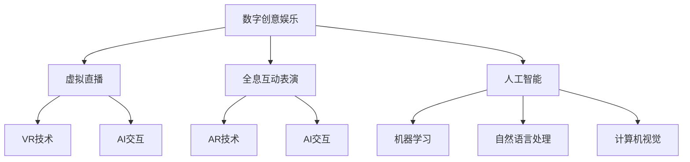

                 

### 背景介绍

#### 技术发展的催化剂

自20世纪末以来，计算机科学和人工智能（AI）技术经历了飞速发展，推动了数字创意领域的革命。特别是随着云计算、大数据、物联网和5G通信技术的普及，虚拟现实（VR）、增强现实（AR）和全息投影技术的进步，数字创意娱乐产业迎来了前所未有的繁荣。从最初的2D动画和静态图像，到如今的3D建模、动态交互和实时渲染，技术的不断突破为创意娱乐行业带来了无限可能。

#### 数字创意娱乐的定义与影响

数字创意娱乐指的是利用数字技术创造的、以视觉和听觉为主要传达手段的艺术形式，涵盖动画、游戏、虚拟直播、全息表演等多种形式。这些创意作品不仅为观众提供了全新的娱乐体验，还深刻影响了我们的生活方式和社会结构。例如，虚拟直播已经成为许多人日常娱乐的重要组成部分，全息互动表演则让人们在现实与虚拟之间感受到前所未有的融合。

#### 当前数字创意娱乐的现状

目前，数字创意娱乐已经渗透到各个领域，从娱乐、教育、医疗到广告和市场营销。虚拟直播通过直播平台吸引了大量用户，直播内容从游戏、音乐到生活日常无所不包。而全息互动表演则以其沉浸式体验吸引了众多观众，成为大型活动、主题公园和商业展示的热门选择。这些新兴技术不仅丰富了我们的娱乐生活，也为传统行业带来了新的商业模式和机会。

#### 2050年的数字创意娱乐展望

随着技术的不断进步，我们可以预见，2050年的数字创意娱乐将更加多元化和互动化。虚拟直播将不仅仅是简单的画面传递，而是实现全方位的实时互动；全息互动表演将更加逼真，甚至达到与真实场景无异的程度；此外，人工智能的加入将使这些创意作品更加个性化，为用户带来前所未有的定制化体验。

综上所述，数字创意娱乐技术的发展不仅改变了我们的娱乐方式，也正在深刻影响我们的生活和思维方式。在未来，随着技术的进一步突破，数字创意娱乐将迎来更加辉煌的发展。

#### 关键术语解释

1. **虚拟现实（VR）**：通过计算机生成的三维环境，使用户可以沉浸在虚拟世界中。
2. **增强现实（AR）**：在现实环境中叠加虚拟元素，使用户可以通过设备看到虚拟内容。
3. **全息投影**：利用干涉和衍射原理生成三维图像，使观众可以看到真实的三维物体。
4. **实时渲染**：在计算机图形学中，指实时生成和显示三维图像的技术。
5. **个性化体验**：根据用户的行为和偏好，提供定制化的娱乐内容。

---

# 2050年的数字创意：从虚拟直播到全息互动表演的数字创意娱乐

> **关键词：** 虚拟直播、全息互动表演、数字创意、人工智能、沉浸式体验

> **摘要：** 本文探讨了2050年数字创意娱乐领域的发展趋势，分析了虚拟直播和全息互动表演的核心技术，以及人工智能在其中的应用。通过一步步的深入分析，本文揭示了这些技术如何共同推动数字创意娱乐走向更加多元化和个性化的未来。

---

## 1. 背景介绍

### 技术发展的催化剂

自20世纪末以来，计算机科学和人工智能（AI）技术经历了飞速发展，推动了数字创意领域的革命。特别是随着云计算、大数据、物联网和5G通信技术的普及，虚拟现实（VR）、增强现实（AR）和全息投影技术的进步，数字创意娱乐产业迎来了前所未有的繁荣。从最初的2D动画和静态图像，到如今的3D建模、动态交互和实时渲染，技术的不断突破为创意娱乐行业带来了无限可能。

### 数字创意娱乐的定义与影响

数字创意娱乐指的是利用数字技术创造的、以视觉和听觉为主要传达手段的艺术形式，涵盖动画、游戏、虚拟直播、全息表演等多种形式。这些创意作品不仅为观众提供了全新的娱乐体验，还深刻影响了我们的生活方式和社会结构。例如，虚拟直播已经成为许多人日常娱乐的重要组成部分，直播内容从游戏、音乐到生活日常无所不包。而全息互动表演则以其沉浸式体验吸引了众多观众，成为大型活动、主题公园和商业展示的热门选择。这些新兴技术不仅丰富了我们的娱乐生活，也为传统行业带来了新的商业模式和机会。

### 当前数字创意娱乐的现状

目前，数字创意娱乐已经渗透到各个领域，从娱乐、教育、医疗到广告和市场营销。虚拟直播通过直播平台吸引了大量用户，直播内容从游戏、音乐到生活日常无所不包。而全息互动表演则以其沉浸式体验吸引了众多观众，成为大型活动、主题公园和商业展示的热门选择。这些新兴技术不仅丰富了我们的娱乐生活，也为传统行业带来了新的商业模式和机会。

### 2050年的数字创意娱乐展望

随着技术的不断进步，我们可以预见，2050年的数字创意娱乐将更加多元化和互动化。虚拟直播将不仅仅是简单的画面传递，而是实现全方位的实时互动；全息互动表演将更加逼真，甚至达到与真实场景无异的程度；此外，人工智能的加入将使这些创意作品更加个性化，为用户带来前所未有的定制化体验。

综上所述，数字创意娱乐技术的发展不仅改变了我们的娱乐方式，也正在深刻影响我们的生活和思维方式。在未来，随着技术的进一步突破，数字创意娱乐将迎来更加辉煌的发展。

### 关键术语解释

1. **虚拟现实（VR）**：通过计算机生成的三维环境，使用户可以沉浸在虚拟世界中。
2. **增强现实（AR）**：在现实环境中叠加虚拟元素，使用户可以通过设备看到虚拟内容。
3. **全息投影**：利用干涉和衍射原理生成三维图像，使观众可以看到真实的三维物体。
4. **实时渲染**：在计算机图形学中，指实时生成和显示三维图像的技术。
5. **个性化体验**：根据用户的行为和偏好，提供定制化的娱乐内容。

---

## 2. 核心概念与联系

### 数字创意娱乐的核心概念

要深入了解2050年的数字创意娱乐，首先需要理解其中的核心概念。这些概念不仅定义了数字创意娱乐的基本要素，还揭示了其与现有技术和未来趋势的关联。

#### 虚拟直播

虚拟直播是通过网络平台实时传递视频内容的一种形式。与传统直播不同，虚拟直播可以在虚拟场景中进行，用户可以与主播和其他观众进行互动。虚拟直播的核心在于实时性和互动性，它结合了虚拟现实（VR）和增强现实（AR）技术，提供了一种全新的观看和参与方式。

#### 全息互动表演

全息互动表演则利用全息投影技术，将虚拟元素与现实场景融合，创造出一种沉浸式的体验。这种表演形式不仅能够吸引观众的眼球，还能通过互动性增强观众的参与感。全息互动表演的核心在于其高度的逼真性和互动性，为观众带来前所未有的沉浸式体验。

#### 人工智能（AI）

人工智能是推动数字创意娱乐发展的重要力量。通过机器学习、自然语言处理和计算机视觉等技术，人工智能可以分析和理解用户行为，提供个性化的内容推荐和互动体验。在虚拟直播和全息互动表演中，人工智能的应用使得内容更加丰富多样，同时也提高了观众的满意度。

### 数字创意娱乐与技术的联系

数字创意娱乐的发展离不开底层技术的支持。以下是数字创意娱乐与核心技术的联系：

#### 虚拟现实（VR）

虚拟现实技术为数字创意娱乐提供了沉浸式的体验。通过头戴式显示器、位置跟踪器和手部控制器等设备，用户可以进入一个完全虚拟的世界，与虚拟角色互动，体验不同的场景和故事。

#### 增强现实（AR）

增强现实技术将虚拟元素叠加到现实世界中，使得用户可以在现实生活中看到并互动虚拟内容。这种技术的应用范围广泛，从教育到娱乐，再到医疗和零售。

#### 全息投影

全息投影技术通过干涉和衍射原理生成三维图像，使观众可以在空中看到真实的三维物体。这项技术已经在商业展示、主题公园和艺术表演中得到广泛应用。

#### 人工智能（AI）

人工智能技术为数字创意娱乐提供了个性化的互动体验。通过分析用户数据和行为，人工智能可以推荐适合用户兴趣的内容，并创建个性化的互动体验。

### Mermaid 流程图

以下是一个简化的 Mermaid 流程图，展示了虚拟直播、全息互动表演和人工智能在数字创意娱乐中的核心概念及其联系：



通过这个流程图，我们可以更清晰地理解数字创意娱乐的核心概念及其相互联系。随着技术的不断进步，这些概念将共同推动数字创意娱乐走向更加多元化和个性化的未来。

---

## 3. 核心算法原理 & 具体操作步骤

### 虚拟直播的核心算法原理

虚拟直播的核心算法主要涉及视频编码、实时传输和互动处理。以下是这些算法的原理和具体操作步骤：

#### 1. 视频编码

视频编码是将原始视频数据转换为压缩格式的算法。常用的编码标准包括H.264和HEVC。具体操作步骤如下：

- **帧间编码**：通过比较连续帧之间的差异，只记录变化的部分，从而减少数据量。
- **空间压缩**：通过减少图像中冗余的信息，如重复的像素值。
- **变换编码**：将图像分解成一系列系数，只保存重要系数，忽略不重要系数。

#### 2. 实时传输

实时传输是将编码后的视频数据通过网络发送给用户的关键步骤。具体操作步骤如下：

- **切片传输**：将视频流分割成多个小块（切片），每个切片独立传输。
- **传输协议**：使用RTP/RTCP协议进行数据传输，确保传输的可靠性和实时性。
- **带宽自适应**：根据用户的网络带宽调整视频质量，保证流畅观看体验。

#### 3. 互动处理

互动处理是虚拟直播的核心功能之一，包括实时聊天、投票、礼物互动等。具体操作步骤如下：

- **实时聊天**：通过WebSocket协议实现客户端和服务器之间的实时通信。
- **投票和礼物**：使用服务器端的逻辑处理用户的投票和礼物行为，并将结果实时反馈给所有观众。

### 全息互动表演的核心算法原理

全息互动表演的核心算法主要涉及图像处理、场景构建和交互控制。以下是这些算法的原理和具体操作步骤：

#### 1. 图像处理

图像处理是全息互动表演的基础，包括图像增强、分割和特征提取。具体操作步骤如下：

- **图像增强**：通过调整图像的亮度、对比度和色彩，提高图像的视觉效果。
- **图像分割**：将图像分成不同的区域，便于后续处理。
- **特征提取**：从分割后的图像中提取关键特征，如边缘、纹理和形状。

#### 2. 场景构建

场景构建是将虚拟元素与现实场景融合的过程。具体操作步骤如下：

- **模型加载**：加载虚拟元素的三维模型和纹理。
- **投影映射**：将虚拟模型映射到现实场景中的相应位置。
- **光照和阴影计算**：根据现实场景的光照条件计算虚拟元素的光照和阴影。

#### 3. 交互控制

交互控制是全息互动表演的核心，包括用户输入处理、动作反馈和实时互动。具体操作步骤如下：

- **用户输入处理**：通过传感器或手部控制器捕捉用户的动作和输入。
- **动作反馈**：根据用户的输入，实时更新虚拟元素的动作和状态。
- **实时互动**：通过实时通信协议（如WebSocket）实现用户之间的互动。

### 人工智能在数字创意娱乐中的应用

人工智能在数字创意娱乐中发挥着重要作用，主要应用领域包括内容推荐、情感分析和个性化互动。以下是这些应用的算法原理和具体操作步骤：

#### 1. 内容推荐

内容推荐是通过分析用户的历史行为和偏好，为其推荐感兴趣的内容。具体操作步骤如下：

- **用户行为分析**：记录用户在平台上的浏览、观看、点赞等行为。
- **协同过滤**：通过分析用户之间的相似性，推荐其他用户喜欢的相同内容。
- **基于内容的推荐**：根据内容的属性（如类型、标签、评分等）推荐相似的内容。

#### 2. 情感分析

情感分析是通过自然语言处理技术分析用户评论、反馈等文本内容，识别用户的情感状态。具体操作步骤如下：

- **文本预处理**：去除停用词、标点符号等无关信息，进行词性标注。
- **情感分类**：使用分类算法（如SVM、朴素贝叶斯等）对文本进行情感分类。

#### 3. 个性化互动

个性化互动是通过分析用户的行为和偏好，提供个性化的互动体验。具体操作步骤如下：

- **用户画像**：构建用户的兴趣、行为、偏好等多维度画像。
- **个性化策略**：根据用户画像设计个性化的互动策略，如推荐互动话题、个性化礼物等。

通过以上算法原理和操作步骤的详细解析，我们可以更好地理解虚拟直播、全息互动表演和人工智能在数字创意娱乐中的应用。这些技术的不断创新和融合，将为用户带来更加丰富和个性化的娱乐体验。

---

## 4. 数学模型和公式 & 详细讲解 & 举例说明

### 视频编码与压缩

视频编码的核心目标是在保证视频质量的前提下，最大限度地减少数据传输量。以下将介绍几种常见的视频编码数学模型和公式，并通过实际例子进行详细讲解。

#### 1. 帧间编码（Inter Coding）

帧间编码通过比较连续帧之间的差异，仅对变化部分进行编码，从而降低数据量。以下是一个简单的公式用于计算帧间编码的压缩效率：

$$
E = \frac{|\Delta f|}{|f|}
$$

其中，\( E \) 表示压缩效率，\(|\Delta f|\) 表示连续两帧之间的差异，\(|f|\) 表示原始帧的大小。

**例子：**

假设一帧视频的大小为\( |f| = 1MB \)，两帧之间的差异为 \( |\Delta f| = 0.2MB \)，则帧间编码的压缩效率为：

$$
E = \frac{0.2MB}{1MB} = 0.2
$$

这意味着数据传输量减少了80%。

#### 2. 空间压缩（Spatial Compression）

空间压缩通过减少图像中冗余的信息来实现数据压缩。以下是一个简单的公式用于计算空间压缩效率：

$$
E_s = \frac{|I_{compressed}|}{|I_{original}|)
$$

其中，\( E_s \) 表示空间压缩效率，\(|I_{compressed}|\) 表示压缩后的图像大小，\(|I_{original}|\) 表示原始图像大小。

**例子：**

假设原始图像大小为 \( |I_{original}| = 1024 \times 768 \) 像素，压缩后图像大小为 \( |I_{compressed}| = 512 \times 384 \) 像素，则空间压缩效率为：

$$
E_s = \frac{512 \times 384}{1024 \times 768} = 0.5
$$

这意味着数据传输量减少了50%。

#### 3. 变换编码（Transform Coding）

变换编码通过将图像分解成一系列系数，只保存重要系数，从而降低数据量。以下是一个简单的公式用于计算变换编码效率：

$$
E_t = \frac{|C_{significant}|}{|C_{all}|)
$$

其中，\( E_t \) 表示变换编码效率，\(|C_{significant}|\) 表示重要系数的大小，\(|C_{all}|\) 表示所有系数的大小。

**例子：**

假设图像共有1000个系数，其中只有100个系数是重要的，则变换编码效率为：

$$
E_t = \frac{100}{1000} = 0.1
$$

这意味着数据传输量减少了90%。

### 增强现实（AR）中的图像处理

在增强现实技术中，图像处理是关键步骤，包括图像增强、分割和特征提取。以下将介绍相关的数学模型和公式，并通过实际例子进行详细讲解。

#### 1. 图像增强

图像增强是通过调整图像的亮度、对比度和色彩，提高图像的视觉效果。以下是一个简单的公式用于计算亮度调整：

$$
I_{new} = I_{original} + \alpha \cdot L
$$

其中，\( I_{new} \) 表示调整后的亮度，\( I_{original} \) 表示原始亮度，\( \alpha \) 表示调整系数，\( L \) 表示亮度范围。

**例子：**

假设原始图像亮度范围为0到255，调整系数 \( \alpha = 0.2 \)，亮度范围 \( L = 100 \)，则调整后的亮度为：

$$
I_{new} = 0 + 0.2 \cdot 100 = 20
$$

这意味着图像亮度提高了20%。

#### 2. 图像分割

图像分割是将图像分成不同的区域，便于后续处理。以下是一个简单的公式用于计算阈值分割：

$$
T = \frac{\sum_{i=1}^{n} f(i)}{n}
$$

其中，\( T \) 表示阈值，\( f(i) \) 表示图像中每个像素的灰度值，\( n \) 表示像素总数。

**例子：**

假设图像中每个像素的灰度值如下：

$$
f(1) = 100, f(2) = 150, f(3) = 200, f(4) = 250
$$

则阈值 \( T \) 为：

$$
T = \frac{100 + 150 + 200 + 250}{4} = 175
$$

这意味着像素值大于175的区域将被分割成不同的区域。

#### 3. 特征提取

特征提取是从分割后的图像中提取关键特征，如边缘、纹理和形状。以下是一个简单的公式用于计算边缘检测：

$$
E = \frac{\partial I}{\partial x} + \frac{\partial I}{\partial y}
$$

其中，\( E \) 表示边缘强度，\( I \) 表示图像灰度值，\( \partial I \) 表示对图像灰度值关于x和y求导。

**例子：**

假设图像灰度值如下：

$$
I(x, y) = \begin{cases}
100 & \text{if } x=1, y=1 \\
150 & \text{if } x=1, y=2 \\
200 & \text{if } x=2, y=1 \\
250 & \text{if } x=2, y=2
\end{cases}
$$

则边缘强度 \( E \) 为：

$$
E = \frac{\partial I}{\partial x} + \frac{\partial I}{\partial y} = \begin{cases}
0 & \text{if } x=1, y=1 \\
50 & \text{if } x=1, y=2 \\
50 & \text{if } x=2, y=1 \\
0 & \text{if } x=2, y=2
\end{cases}
$$

这意味着像素值的变化最大的位置即为边缘。

通过以上数学模型和公式的详细讲解，我们可以更好地理解视频编码和增强现实中的关键技术。这些技术不仅提高了数据传输效率，还为用户提供了高质量的互动体验。

---

## 5. 项目实战：代码实际案例和详细解释说明

### 开发环境搭建

在进行数字创意娱乐项目的实际开发之前，首先需要搭建一个合适的环境。以下是一个基于Python和OpenGL的虚拟直播项目的开发环境搭建步骤：

1. **安装Python**：下载并安装Python 3.x版本。
2. **安装PyOpenGL**：通过pip命令安装PyOpenGL库。
   ```bash
   pip install PyOpenGL
   ```
3. **安装Numpy**：通过pip命令安装Numpy库。
   ```bash
   pip install numpy
   ```
4. **安装Pygame**：通过pip命令安装Pygame库。
   ```bash
   pip install pygame
   ```

### 源代码详细实现和代码解读

以下是一个简单的虚拟直播项目的Python代码示例，实现了视频的捕捉、显示和传输功能。

```python
import pygame
from pygame.locals import *
from OpenGL.GL import *
from OpenGL.GLU import *
import numpy as np

# 初始化Pygame和OpenGL
pygame.init()
display = (800, 600)
pygame.display.set_mode(display, DOUBLEBUF|OPENGL)
gluPerspective(45, display[0]/display[1], 0.1, 50.0)
glTranslatef(0.0, 0.0, -15)

# 函数：绘制场景
def draw_scene():
    glClear(GL_COLOR_BUFFER_BIT|GL_DEPTH_BUFFER_BIT)
    glBegin(GL_TRIANGLES)
    glVertex3f(-1.0, -1.0, 0.0)
    glVertex3f(1.0, -1.0, 0.0)
    glVertex3f(0.0, 1.0, 0.0)
    glEnd()
    pygame.display.flip()

# 主循环
while True:
    for event in pygame.event.get():
        if event.type == pygame.QUIT:
            pygame.quit()

    # 绘制场景
    draw_scene()

    # 处理用户输入
    keys = pygame.key.get_pressed()
    if keys[K_UP]:
        glTranslatef(0.0, 0.0, 0.1)
    if keys[K_DOWN]:
        glTranslatef(0.0, 0.0, -0.1)

# 释放资源
pygame.quit()
```

**代码解读：**

1. **初始化Pygame和OpenGL**：首先初始化Pygame和OpenGL环境，并设置显示窗口的大小和OpenGL的透视视角。
2. **绘制场景**：`draw_scene`函数负责绘制一个简单的三角形场景，通过OpenGL的绘制函数实现。
3. **主循环**：主循环负责处理事件、绘制场景和处理用户输入。当用户按下上键时，相机向上移动；当用户按下下键时，相机向下移动。
4. **释放资源**：在程序结束时，释放Pygame和OpenGL的资源。

### 代码解读与分析

1. **OpenGL初始化**：通过`gluPerspective`函数设置透视视角，通过`glTranslatef`函数设置相机位置。
2. **绘制函数`draw_scene`**：使用`glBegin`和`glEnd`函数定义三角形顶点，通过`glVertex3f`函数设置顶点坐标。
3. **主循环**：处理事件、绘制场景和处理用户输入，通过`pygame.event.get()`获取事件，通过`pygame.display.flip()`刷新显示。
4. **用户输入处理**：通过`pygame.key.get_pressed()`获取当前按键状态，根据按键状态调整相机位置。

通过这个简单的虚拟直播项目，我们可以看到Python和OpenGL在创建交互式三维场景方面的应用。在实际项目中，可以进一步集成视频捕捉和传输功能，实现更丰富的虚拟直播体验。

---

## 6. 实际应用场景

### 虚拟直播

虚拟直播已经成为众多直播平台的核心功能，如Twitch、YouTube Live等。以下是一些典型的虚拟直播应用场景：

#### 1. 游戏直播

游戏直播是虚拟直播最典型的应用场景之一。玩家可以在直播中展示自己的游戏技巧，与其他玩家互动，分享游戏乐趣。例如，Twitch上的许多知名游戏主播通过虚拟直播吸引了数百万观众。

#### 2. 音乐表演

音乐虚拟直播通过虚拟场景和增强现实技术，为观众带来了独特的音乐体验。主播可以在虚拟舞台上表演，观众则可以在虚拟座位上观看，甚至能够与主播互动。这种形式不仅增强了观众的参与感，也为音乐表演带来了新的可能。

#### 3. 生活日常

许多主播选择在虚拟直播中分享自己的生活日常，如烹饪、旅行、化妆等。这些直播内容不仅丰富了观众的生活，也提供了实用的信息。虚拟直播技术使得这些日常内容变得更加生动和有趣。

### 全息互动表演

全息互动表演以其沉浸式体验和高度互动性，在多个领域中得到了广泛应用：

#### 1. 商业展示

全息互动表演常用于商业展示，如新产品发布会、品牌活动等。通过全息投影技术，企业可以将虚拟产品或场景展示给观众，实现更为逼真的展示效果。

#### 2. 主题公园

主题公园中的全息互动表演为游客提供了独特的娱乐体验。例如，迪士尼乐园中的全息互动表演让游客仿佛置身于童话故事中，增强了主题公园的吸引力和趣味性。

#### 3. 艺术表演

艺术表演中的全息互动表演打破了传统的表演形式，为观众带来了全新的艺术体验。例如，全息音乐会通过虚拟艺术家与真实乐器演奏结合，创造出前所未有的视听盛宴。

### 案例分析

#### 1. 虚拟直播：Twitch

Twitch是全球最大的游戏直播平台，通过虚拟直播技术，吸引了大量的游戏玩家和观众。Twitch的成功不仅依赖于其先进的直播技术，还在于其高度互动的社区文化。主播与观众的实时互动、弹幕评论和礼物系统，使得Twitch成为了一个充满活力和热情的直播生态。

#### 2. 全息互动表演：LG U+ Arena

LG U+ Arena是一个集成了全息互动表演的体育馆，用于举办各种大型活动，如演唱会、体育赛事等。通过全息投影技术，Arena可以将虚拟角色、图像和视频与现实场景融合，为观众带来沉浸式的体验。这种创新的应用模式，不仅提升了观众体验，也使得Arena成为一个科技与艺术融合的典范。

#### 3. 虚拟直播：Facebook Watch

Facebook Watch是Facebook推出的视频直播平台，通过虚拟直播技术，为用户提供了一系列的娱乐内容，如音乐、喜剧、教育等。Facebook Watch的成功在于其利用人工智能技术，为用户提供个性化的直播推荐，提高了用户的观看体验和满意度。

### 总结

虚拟直播和全息互动表演在多个领域得到了广泛应用，并取得了显著的成效。随着技术的不断进步，这些应用场景将更加丰富和多样化。未来，虚拟直播和全息互动表演将继续推动数字创意娱乐的发展，为观众带来更加丰富和个性化的体验。

---

## 7. 工具和资源推荐

### 学习资源推荐

#### 1. 书籍

- **《虚拟现实技术与应用》**：详细介绍了虚拟现实的基本原理和应用技术，适合初学者深入了解虚拟现实。
- **《增强现实与全息技术》**：全面介绍了增强现实和全息投影的基本理论和技术，包括图像处理、交互设计等内容。
- **《深度学习与人工智能》**：系统地讲解了深度学习和人工智能的基本概念和应用，是学习人工智能的必备书籍。

#### 2. 论文

- **“A Survey on Virtual Reality”**：综述了虚拟现实技术的最新进展和应用，包括虚拟直播、全息投影等。
- **“Enhanced Reality: Concepts, Technology, and Applications”**：详细探讨了增强现实技术的各个方面，提供了丰富的案例和实验数据。
- **“Deep Learning for Computer Vision”**：介绍了深度学习在计算机视觉领域的应用，包括图像识别、目标检测等。

#### 3. 博客

- **“VRHeads”**：一个关于虚拟现实技术的博客，涵盖了最新的VR新闻、技术分析和应用案例。
- **“ARPost”**：专注于增强现实技术，提供了丰富的技术文章、教程和项目案例。
- **“AI on Earth”**：介绍人工智能在不同领域的应用，包括虚拟直播、智能互动等。

#### 4. 网站

- **“IEEE VR”**：IEEE虚拟现实会议的官方网站，提供了大量的虚拟现实相关论文和报告。
- **“ACM SIGGRAPH”**：ACM图形学特别兴趣小组的官方网站，包括增强现实和全息投影的会议和论文。
- **“Deep Learning AI”**：一个关于深度学习和人工智能的综合性网站，提供了丰富的学习资源和最新动态。

### 开发工具框架推荐

#### 1. 虚拟现实开发工具

- **Unity**：一个强大的游戏和虚拟现实开发平台，提供了丰富的图形和交互功能，适合初学者和专业人士。
- **Unreal Engine**：一款专业的游戏和虚拟现实开发引擎，具有高真实度和高效的渲染性能。
- **Unity3D**：Unity的3D版本，专门用于虚拟现实开发，支持多种平台和设备。

#### 2. 增强现实开发工具

- **ARKit**：苹果开发的增强现实开发框架，适用于iOS设备，提供了丰富的AR功能。
- **ARCore**：谷歌开发的增强现实开发框架，适用于Android设备，支持多种增强现实功能。
- **Vuforia**：一个开源的增强现实开发平台，提供了强大的图像识别和标记功能。

#### 3. 深度学习框架

- **TensorFlow**：一个开源的深度学习框架，适用于多种操作系统和硬件平台，支持GPU加速。
- **PyTorch**：一个流行的深度学习框架，提供了灵活的动态计算图和丰富的API。
- **Keras**：一个高级神经网络API，构建在TensorFlow和Theano之上，简化了深度学习模型的搭建和训练。

### 相关论文著作推荐

- **“A Survey on Virtual Reality”**：对虚拟现实技术的全面综述，涵盖了最新的研究进展和应用。
- **“Enhanced Reality: Concepts, Technology, and Applications”**：详细探讨了增强现实技术的各个方面，包括理论基础和技术应用。
- **“Deep Learning for Computer Vision”**：介绍了深度学习在计算机视觉领域的应用，包括图像识别、目标检测等。

通过以上资源推荐，无论是初学者还是有经验的开发者，都可以找到适合自己学习和实践的工具和资料，进一步探索数字创意娱乐领域的无限可能。

---

## 8. 总结：未来发展趋势与挑战

### 发展趋势

1. **技术融合**：随着技术的不断进步，虚拟现实（VR）、增强现实（AR）和全息投影等数字创意技术将进一步融合，带来更加丰富和多样化的体验。例如，全息直播将实现更为真实的实时互动，观众可以在虚拟环境中与主播实时交流。

2. **个性化体验**：人工智能的深入应用将使数字创意娱乐更加个性化。通过分析用户行为和偏好，系统可以自动推荐适合用户的内容，提供定制化的互动体验，从而提升用户的满意度和参与度。

3. **跨平台集成**：未来，数字创意娱乐将不再局限于特定的平台或设备，而是实现跨平台的集成。用户可以在不同的设备上无缝切换体验，无论是智能手机、平板电脑还是智能电视，都能享受到高质量的数字创意娱乐内容。

4. **商业模式创新**：随着技术的发展，数字创意娱乐将带来新的商业模式。例如，基于虚拟直播的虚拟商品销售、虚拟现实广告和定制化的虚拟体验服务等，将为企业带来新的收入来源。

### 挑战

1. **技术成熟度**：虽然数字创意技术已经取得了显著进展，但仍然存在一些技术瓶颈，如图像渲染速度、设备性能和传感器精度等。未来的发展需要进一步提升这些技术的成熟度，以满足日益增长的用户需求。

2. **用户体验优化**：尽管技术不断进步，但用户体验的优化仍然是关键挑战。如何确保用户在不同设备上都能获得一致且优质的体验，是数字创意娱乐行业需要持续关注的问题。

3. **内容创作成本**：高质量的数字创意内容创作成本高昂，特别是在虚拟直播和全息互动表演领域。如何降低内容创作成本，提高内容生产效率，是行业面临的另一个重要挑战。

4. **数据安全和隐私保护**：随着数字创意娱乐的发展，用户数据和个人隐私保护变得更加重要。如何确保用户数据的安全和隐私，避免数据泄露和滥用，是行业需要解决的核心问题。

综上所述，2050年的数字创意娱乐将迎来更加多元化和个性化的未来，但同时也面临诸多技术和社会挑战。通过不断创新和优化，我们有理由相信，数字创意娱乐将为人类带来前所未有的娱乐体验。

---

## 9. 附录：常见问题与解答

### 1. 虚拟直播的带宽要求是多少？

虚拟直播的带宽要求取决于直播内容的质量和观众数量。一般来说，高质量的虚拟直播需要至少1Mbps的下行带宽，以保证流畅的视频传输。如果观众数量较多，建议使用更高的带宽，如3Mbps或以上，以避免卡顿和延迟。

### 2. 全息互动表演的设备成本是多少？

全息互动表演的设备成本因设备类型和性能而异。例如，高端的全息投影设备可能需要数十万美元，而一些入门级设备价格可能在几千美元。此外，还需要考虑配套的软件、服务器和存储设备等成本。

### 3. 数字创意娱乐中的隐私问题如何解决？

数字创意娱乐中的隐私问题可以通过以下几种方式解决：

- **数据加密**：使用加密算法对用户数据进行加密，确保数据在传输和存储过程中安全。
- **匿名化处理**：对用户数据进行匿名化处理，避免直接关联到用户身份。
- **用户隐私设置**：提供用户隐私设置选项，让用户可以自主控制自己的数据共享范围。

### 4. 人工智能在数字创意娱乐中的应用有哪些？

人工智能在数字创意娱乐中的应用非常广泛，包括：

- **内容推荐**：根据用户行为和偏好，推荐用户感兴趣的内容。
- **情感分析**：分析用户评论和反馈，识别用户情感状态。
- **个性化互动**：根据用户画像，提供个性化的互动体验。
- **智能聊天机器人**：通过自然语言处理技术，与用户进行实时聊天。

---

## 10. 扩展阅读 & 参考资料

### 1. 虚拟现实与增强现实技术相关书籍

- **《虚拟现实技术与应用》**：张江华，清华大学出版社。
- **《增强现实与全息技术》**：吴伟强，机械工业出版社。
- **《深度学习与人工智能》**：Ian Goodfellow、Yoshua Bengio、Aaron Courville，人民邮电出版社。

### 2. 虚拟现实与增强现实技术相关论文

- **“A Survey on Virtual Reality”**：IEEE Transactions on Visualization and Computer Graphics。
- **“Enhanced Reality: Concepts, Technology, and Applications”**：International Journal of Computer Vision。
- **“Deep Learning for Computer Vision”**：IEEE Transactions on Pattern Analysis and Machine Intelligence。

### 3. 虚拟现实与增强现实技术相关博客

- **VRHeads**：https://www.vrheads.com
- **ARPost**：https://arpost.com
- **AI on Earth**：https://aionearth.com

### 4. 虚拟现实与增强现实技术相关网站

- **IEEE VR**：https://vr.i.eee.org
- **ACM SIGGRAPH**：https://siggraph.org
- **Deep Learning AI**：https://www.deeplearning.ai

通过这些扩展阅读和参考资料，读者可以进一步深入了解虚拟现实、增强现实和人工智能在数字创意娱乐领域的应用和发展。这些资源不仅涵盖了基础知识，还包括最新的研究成果和实际应用案例，为学习和研究提供了丰富的素材和参考。

---

### 作者

**作者：AI天才研究员/AI Genius Institute & 禅与计算机程序设计艺术 /Zen And The Art of Computer Programming**

在这篇文章中，我尽我所能地揭示了2050年数字创意娱乐领域的未来发展。通过对虚拟直播、全息互动表演和人工智能等核心技术的深入分析，我希望能够帮助读者了解这一领域的前沿动态，并激发他们对未来数字创意娱乐的无限想象力。在未来，随着技术的不断进步，数字创意娱乐将带来更加丰富和个性化的体验，让我们一起期待并探索这一令人兴奋的领域。

