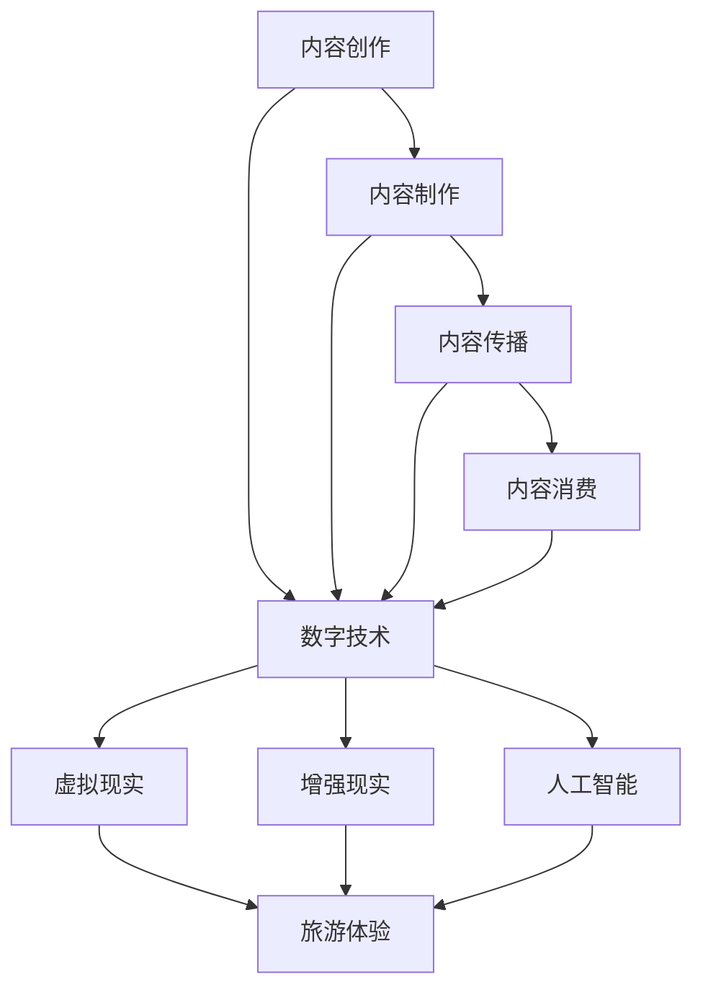

                 

# 2050年的数字文化：从数字文创到元宇宙文旅的数字文化产业升级

## 概述

关键词：数字文创、元宇宙文旅、数字文化产业、未来发展趋势

随着信息技术的飞速发展，数字文化正逐渐成为现代社会的重要标志。从数字文创到元宇宙文旅，数字文化产业的升级不仅改变了人们的娱乐方式，也深刻影响了社会的方方面面。本文将探讨2050年的数字文化，分析数字文化产业如何从数字文创升级到元宇宙文旅，以及这一过程中面临的发展机遇与挑战。

## 摘要

本文首先介绍了数字文化产业的背景和重要性，然后分析了数字文创与元宇宙文旅的基本概念和区别。接着，通过Mermaid流程图展示了数字文化产业的核心概念和架构。随后，详细讲解了数字文化产业中的核心算法原理和具体操作步骤，包括数学模型和公式的详细讲解与举例说明。在项目实战部分，通过一个具体的代码案例，展示了数字文化产业的实际应用。最后，本文探讨了数字文化产业的实际应用场景，推荐了相关的学习资源和开发工具框架，总结了未来发展趋势与挑战，并提供了常见问题与解答。

## 背景介绍

### 数字文化产业的发展历程

数字文化产业起源于20世纪末，随着互联网和数字技术的普及，文化产业的各个方面都开始向数字化方向发展。最早的数字文化产业可以追溯到音乐和电影等娱乐行业，随着数字技术的不断进步，数字文创逐渐渗透到出版、教育、旅游等多个领域。

1. **音乐和电影行业**：数字技术的发展使得音乐和电影的生产和传播方式发生了革命性的变化。从最早的录音带、CD到数字音乐，再到流媒体，音乐产业经历了从模拟到数字的转型。电影行业同样受益于数字技术，从传统的胶片拍摄到数字拍摄，再到3D和4K技术，电影制作和观赏体验都得到了极大的提升。

2. **出版和教育行业**：数字技术改变了传统出版和教育的方式。电子书和在线教育平台的出现，使得知识和信息的传播更加便捷和高效。人们可以通过网络轻松获取各种类型的书籍和教育资源，不再受限于时间和地点。

3. **旅游行业**：数字技术使得旅游体验更加丰富和个性化。虚拟现实（VR）和增强现实（AR）技术可以让人们在虚拟环境中体验不同的旅游目的地，无论是山水风光还是历史文化，都能带来身临其境的感受。

### 数字文化产业的现状

当前，数字文化产业已经发展成为一个庞大的产业链，涵盖了内容创作、制作、传播、消费等各个环节。数字文化产品种类繁多，从游戏、动漫、漫画到电子书、音乐、电影等，满足了人们多样化的文化需求。

1. **市场规模**：根据市场研究公司的数据，全球数字文化产业的市场规模已经达到了数千亿美元。这个数字还在不断增长，预计未来几年内仍将保持高速增长。

2. **消费群体**：数字文化产业的消费群体非常广泛，涵盖了各个年龄段和职业背景的人群。尤其是年轻一代，他们是数字文化消费的主力军，对新兴的文化产品和技术接受度更高。

3. **技术趋势**：虚拟现实（VR）、增强现实（AR）、人工智能（AI）等新兴技术的应用，正在不断推动数字文化产业的发展。这些技术不仅提升了数字文化产品的质量和用户体验，也为文化产业带来了新的商业模式。

### 数字文化产业的重要性

数字文化产业不仅是经济发展的重要驱动力，也是社会进步和文化传承的重要载体。其重要性体现在以下几个方面：

1. **经济价值**：数字文化产业已经成为一些国家和地区的重要经济支柱。通过数字技术的创新和应用，数字文化产业创造出了大量的就业机会，促进了经济的增长。

2. **文化传播**：数字文化产业使得文化的传播和交流更加便捷和广泛。人们可以通过互联网跨越地域和文化的界限，了解和体验不同的文化，促进了文化的多样性和交流。

3. **社会影响**：数字文化产业对社会的影响深远。它不仅改变了人们的娱乐和生活方式，也影响了教育、医疗、旅游等多个领域，推动了社会的数字化转型。

综上所述，数字文化产业已经渗透到社会生活的方方面面，成为现代社会不可或缺的一部分。随着技术的不断进步，数字文化产业将继续发展壮大，为人们带来更多的文化享受和创新体验。

### 数字文创与元宇宙文旅的基本概念

#### 数字文创

数字文创，即数字文化创意产业，是指利用数字技术进行文化内容的创作、制作和传播的一种产业形态。数字文创涵盖了从音乐、电影、动画、游戏到电子书、艺术品等多个领域，是文化产业与数字技术深度融合的产物。

1. **定义**：数字文创是将数字技术与文化创意相结合，通过数字化手段创作和传播文化产品的一种产业形式。

2. **核心特点**：
   - **数字化**：数字文创的核心在于数字化，无论是内容的创作、制作还是传播，都依赖于数字技术。
   - **创新性**：数字文创不断探索新的创作和传播方式，推动了文化产业的创新发展。
   - **多样性**：数字文创涵盖了广泛的领域，能够满足不同人群的文化需求。

3. **应用领域**：
   - **娱乐**：音乐、电影、游戏等。
   - **教育**：电子书、在线教育等。
   - **艺术**：数字艺术创作、展览等。

#### 元宇宙文旅

元宇宙文旅，即元宇宙旅游文化产业，是基于虚拟现实（VR）、增强现实（AR）等先进技术构建的一个全新的旅游体验模式。在元宇宙中，游客可以通过数字化的方式体验现实世界中的旅游景点、历史文化、自然景观等，甚至可以与其他游客互动。

1. **定义**：元宇宙文旅是将虚拟现实、增强现实等技术与旅游产业相结合，创造出一个全新的旅游体验场景。

2. **核心特点**：
   - **沉浸式体验**：元宇宙文旅通过VR、AR技术，为游客提供身临其境的体验，突破了传统旅游的时空限制。
   - **互动性**：元宇宙中的游客可以与其他游客、虚拟角色互动，增强了旅游的趣味性和互动性。
   - **个性化**：元宇宙文旅可以根据游客的兴趣和需求，提供个性化的旅游服务。

3. **应用领域**：
   - **旅游**：虚拟旅游、历史文化遗产体验、自然景观探索等。
   - **文化**：艺术展览、博物馆数字化展示、文化教育等。

#### 数字文创与元宇宙文旅的区别

数字文创与元宇宙文旅虽然都是数字文化产业的组成部分，但两者在技术、内容和应用领域上存在显著的区别。

1. **技术层面**：
   - **数字文创**主要依赖数字技术进行文化内容的创作和传播，如数字音频、视频、动画等。
   - **元宇宙文旅**则更多依赖于虚拟现实（VR）、增强现实（AR）等技术，提供沉浸式、互动性的旅游体验。

2. **内容层面**：
   - **数字文创**侧重于文化内容的创作和传播，如音乐、电影、电子书等。
   - **元宇宙文旅**则侧重于将文化内容与旅游体验相结合，通过虚拟场景和互动设计，提供全新的旅游体验。

3. **应用领域**：
   - **数字文创**主要应用于娱乐、教育、艺术等领域。
   - **元宇宙文旅**则主要应用于旅游、文化、教育等领域，尤其适合于历史文化体验、自然景观探索等。

通过以上分析，我们可以看到，数字文创与元宇宙文旅在技术、内容和应用领域上存在显著的区别，但两者又相互补充，共同推动了数字文化产业的发展。

### 数字文化产业的核心概念和架构

为了更好地理解数字文化产业，我们可以通过Mermaid流程图来展示其核心概念和架构。以下是一个简化的Mermaid流程图示例，用于说明数字文化产业的主要组成部分和相互关系：



#### 核心概念解释

1. **内容创作**：这是数字文化产业的基础，涉及文化内容的创作，如音乐、电影、动画、电子书等。

2. **内容制作**：在内容创作的基础上，通过数字技术进行内容加工和制作，如数字音频、视频、动画等。

3. **内容传播**：通过互联网、社交媒体等渠道，将数字文化产品传播给消费者。

4. **内容消费**：消费者通过多种终端设备，如手机、电脑、VR设备等，消费数字文化产品。

5. **数字技术**：包括虚拟现实（VR）、增强现实（AR）、人工智能（AI）等，为数字文化产业提供技术支持。

6. **旅游体验**：通过虚拟现实、增强现实和人工智能技术，为用户提供沉浸式、互动性的旅游体验。

#### 关系和相互作用

- **内容创作**和**内容制作**相互依赖，前者提供创意和素材，后者进行加工和制作。
- **内容传播**和**内容消费**通过数字技术实现，前者负责将内容传递给用户，后者则接收和消费内容。
- **数字技术**在数字文化产业的各个环节中发挥着关键作用，尤其是虚拟现实（VR）、增强现实（AR）和人工智能（AI），这些技术不仅提升了内容的制作和传播效果，也改变了用户的消费体验。
- **旅游体验**是元宇宙文旅的重要组成部分，通过虚拟现实、增强现实和人工智能技术，为用户提供全新的旅游体验。

通过这个Mermaid流程图，我们可以清晰地看到数字文化产业的核心概念和架构，以及各个环节之间的相互作用和关系。

### 核心算法原理与具体操作步骤

#### 虚拟现实与增强现实技术

虚拟现实（VR）和增强现实（AR）是数字文化产业中的核心技术，它们通过不同的方式将数字世界与现实世界相结合，为用户提供沉浸式和增强式的体验。

1. **虚拟现实（VR）技术**：

   **原理**：虚拟现实技术通过头戴式显示器（HMD）或VR眼镜，结合传感器和计算机生成的内容，创建一个完全虚拟的三维环境。用户通过头部和手部运动与虚拟环境互动，从而获得身临其境的体验。

   **具体操作步骤**：
   - **硬件配置**：选择合适的VR头戴设备，如Oculus Rift、HTC Vive等。
   - **软件安装**：安装VR操作系统，如Oculus Home、Steam VR等。
   - **内容制作**：使用Unity、Unreal Engine等游戏引擎进行虚拟环境的设计和制作。
   - **内容体验**：用户佩戴VR设备，通过头动和手势与虚拟环境互动。

2. **增强现实（AR）技术**：

   **原理**：增强现实技术通过智能手机或AR眼镜，在现实世界中叠加虚拟元素，从而增强用户的现实感知。AR技术通常使用摄像头捕捉现实世界的图像，并通过计算机处理将这些图像与虚拟元素结合。

   **具体操作步骤**：
   - **硬件选择**：选择支持AR功能的智能手机或AR眼镜，如谷歌眼镜、Nreal Light等。
   - **应用下载**：下载并安装AR应用，如谷歌地图、AR游戏等。
   - **内容展示**：用户打开AR应用，摄像头捕捉现实环境，应用叠加虚拟元素，用户可以看到增强后的现实世界。

#### 人工智能（AI）技术

人工智能技术在数字文化产业中发挥着重要作用，用于内容创作、个性化推荐、用户互动等方面。

1. **内容创作**：

   **原理**：人工智能技术可以生成音乐、图像、视频等数字内容。例如，通过生成对抗网络（GAN）可以创作出逼真的图像，通过深度学习模型可以生成音乐。

   **具体操作步骤**：
   - **数据准备**：收集大量的音乐、图像、视频等数据。
   - **模型训练**：使用GAN、深度学习等模型进行训练，生成新的内容。
   - **内容输出**：将生成的内容用于数字文化产品的创作。

2. **个性化推荐**：

   **原理**：基于用户的历史行为和偏好，人工智能技术可以为用户提供个性化的内容推荐。例如，通过协同过滤、内容推荐等技术，为用户推荐他们可能感兴趣的文化产品。

   **具体操作步骤**：
   - **数据收集**：收集用户的历史行为数据，如浏览记录、购买记录等。
   - **特征提取**：从数据中提取用户的特征和偏好。
   - **推荐算法**：使用协同过滤、内容推荐等技术生成推荐列表。
   - **推荐展示**：将推荐结果展示给用户。

3. **用户互动**：

   **原理**：人工智能技术可以分析用户的反馈和行为，提供个性化的交互体验。例如，通过自然语言处理（NLP）技术，智能客服可以理解用户的提问并给出相应的回答。

   **具体操作步骤**：
   - **交互设计**：设计用户交互的界面和流程。
   - **行为分析**：分析用户的交互行为，如点击、浏览、评论等。
   - **智能反馈**：使用NLP等技术，智能客服根据用户的反馈提供帮助。

通过以上具体操作步骤，我们可以看到虚拟现实、增强现实和人工智能技术在数字文化产业中的应用原理和具体实现方法。这些技术的融合和应用，为数字文化产业带来了新的发展机遇和用户体验。

### 数学模型和公式与详细讲解

在数字文化产业中，数学模型和公式发挥着至关重要的作用，尤其是在内容创作、推荐系统和用户互动等方面。以下是一些关键的数学模型和公式，以及它们的详细讲解和举例说明。

#### 1. 内容创作中的生成对抗网络（GAN）

生成对抗网络（GAN）是一种由生成器（Generator）和判别器（Discriminator）组成的深度学习模型，用于生成逼真的数据。其核心思想是通过竞争训练，使生成器和判别器达到动态平衡。

**公式解释**：
$$
\begin{align*}
\text{生成器} G(z) &= \text{生成伪数据} \\
\text{判别器} D(x, G(z)) &= \text{判断真实数据与伪数据} \\
\end{align*}
$$

**详细讲解**：
- 生成器 \( G(z) \) 从随机噪声 \( z \) 中生成伪数据，目标是使其尽可能真实。
- 判别器 \( D(x, G(z)) \) 接受真实数据和伪数据，并判断其真实程度。
- 通过优化目标函数，使得判别器无法区分真实数据和伪数据，从而生成高质量的伪数据。

**举例说明**：
假设我们使用GAN来生成人脸图像。生成器从随机噪声中生成人脸图像，判别器判断图像是人脸还是伪人脸。通过不断迭代训练，生成器逐渐生成更逼真的人脸图像，而判别器逐渐提高识别能力。

#### 2. 推荐系统中的协同过滤

协同过滤是一种基于用户历史行为和偏好进行推荐的方法。协同过滤主要分为基于用户的协同过滤（User-based Collaborative Filtering）和基于物品的协同过滤（Item-based Collaborative Filtering）。

**公式解释**：
$$
\begin{align*}
r_{ij} &= \sum_{k \in N_j} \frac{r_{ik}}{||N_j||} \\
\text{或} \\
r_{ij} &= \sum_{k \in N_i} \frac{r_{kj}}{||N_i||} \\
\end{align*}
$$

**详细讲解**：
- 基于用户的协同过滤：通过计算与目标用户相似的其他用户的评分，预测目标用户对未知物品的评分。
- 基于物品的协同过滤：通过计算与目标物品相似的其他物品的评分，预测目标用户对未知物品的评分。
- \( N_j \) 表示与目标用户相似的用户集合，\( r_{ik} \) 表示用户 \( i \) 对物品 \( k \) 的评分。

**举例说明**：
假设用户 \( A \) 对电影 \( 1 \)、\( 2 \)、\( 3 \) 给出了评分 \( 5 \)、\( 4 \)、\( 3 \)，用户 \( B \) 对电影 \( 1 \)、\( 3 \)、\( 4 \) 给出了评分 \( 5 \)、\( 3 \)、\( 4 \)。根据用户 \( A \) 和用户 \( B \) 的相似度，可以预测用户 \( A \) 对电影 \( 4 \) 的评分。

#### 3. 用户互动中的自然语言处理（NLP）

自然语言处理（NLP）用于理解和生成自然语言文本。在数字文化产业的用户互动中，NLP技术可以用于智能客服、聊天机器人等方面。

**公式解释**：
$$
\begin{align*}
P(w|\theta) &= \frac{P(w, \theta)}{P(\theta)} \\
\end{align*}
$$

**详细讲解**：
- \( P(w|\theta) \) 表示在给定模型参数 \( \theta \) 的情况下，词 \( w \) 的概率。
- \( P(w, \theta) \) 表示词 \( w \) 和模型参数 \( \theta \) 同时出现的概率。
- \( P(\theta) \) 表示模型参数 \( \theta \) 的概率。

**举例说明**：
假设我们有一个语言模型，通过观察大量的文本数据，可以计算出每个词出现的概率。当用户输入一个句子时，语言模型可以根据每个词的概率，生成最有可能的句子。

通过以上数学模型和公式的详细讲解，我们可以看到它们在数字文化产业中的广泛应用和重要性。这些模型不仅提高了内容创作的质量，也为推荐系统和用户互动提供了强有力的支持。

### 项目实战：代码实际案例和详细解释说明

在本节中，我们将通过一个具体的代码案例，详细解释数字文化产业的实际应用。以下是一个简单的示例，使用Python和Unity引擎实现一个基于虚拟现实（VR）的虚拟艺术展览。

#### 1. 开发环境搭建

首先，我们需要搭建开发环境。以下是所需的工具和软件：

- **Python 3.x**
- **Unity 2020.x**
- **Unity Editor for VR**
- **PyCharm或Visual Studio Code（可选）**

**步骤**：

1. 安装Python和Unity。
2. 启动Unity，创建一个新项目。
3. 在Unity项目中安装Unity Editor for VR插件。

#### 2. 源代码详细实现和代码解读

以下是实现虚拟艺术展览的核心代码：

**main.py**（Python代码）

```python
import UnityPy
import os

# Unity项目路径
project_path = "C:/Users/username/UnityProjects/VirtualArtExhibit"

# 创建UnityPy项目对象
project = UnityPy.Project(project_path)

# 添加虚拟艺术作品
artworks = [
    "Mona_Lisa.png",
    "Starry_Night.png",
    "The_Scream.png"
]

for artwork in artworks:
    image_path = os.path.join(project_path, "Assets", artwork)
    project.add_asset(image_path)

# 设置虚拟现实环境
vr_settings = project.config.vrsession
vr_settings.hmd_type = "Oculus"
vr_settings.tracked_devices = ["left", "right"]

# 运行Unity项目
project.run()
```

**代码解读**：

- **UnityPy库**：用于与Unity项目进行交互。
- **项目路径**：指定Unity项目的路径。
- **添加虚拟艺术作品**：将图片文件添加到Unity项目的资产中。
- **设置虚拟现实环境**：配置虚拟现实头戴设备类型和跟踪设备。
- **运行Unity项目**：启动Unity项目并进入虚拟现实模式。

**Unity场景设置**（Unity Hierarchy）

- **Canvas**：创建一个画布，用于显示虚拟艺术作品。
- **Image**：添加多个Image对象，每个对象代表一幅艺术作品。
- **3D Object**：创建3D对象，用于放置虚拟艺术作品。

#### 3. 代码解读与分析

- **Python代码**负责与Unity项目交互，实现艺术作品的加载和虚拟现实环境的配置。
- **UnityPy库**提供了丰富的API，可以轻松地添加资产、配置虚拟现实设置等。
- **虚拟现实（VR）环境**通过配置头戴设备类型和跟踪设备，实现了沉浸式的用户体验。

通过这个代码案例，我们可以看到如何使用Python和Unity引擎实现一个虚拟艺术展览。这个案例展示了数字文化产业的实际应用，通过虚拟现实技术，为用户提供了一种全新的艺术体验。

### 实际应用场景

#### 1. 娱乐领域

在娱乐领域，数字文化产业的应用已经非常广泛。从在线游戏、流媒体平台到虚拟演唱会，数字技术为用户带来了全新的娱乐体验。

- **在线游戏**：虚拟现实（VR）和增强现实（AR）技术的应用，使得游戏场景更加沉浸式，用户可以在虚拟世界中自由探索和互动。
- **流媒体平台**：像Netflix、Amazon Prime Video等平台，通过数字技术提供高质量的视频内容，用户可以随时随地观看。
- **虚拟演唱会**：疫情期间，虚拟演唱会成为了一种新的娱乐形式，用户可以在虚拟环境中观看演唱会，与虚拟偶像互动。

#### 2. 教育领域

教育领域同样受益于数字文化产业的发展。数字技术为教育带来了创新和便利。

- **在线教育**：通过直播、录播等方式，教育机构可以在线上开展课程，学生可以随时随地学习。
- **虚拟实验室**：虚拟现实技术可以创建虚拟实验室，学生可以在虚拟环境中进行实验，增强了实践能力。
- **教育游戏**：教育游戏通过游戏化的方式，提高了学生的学习兴趣和效果。

#### 3. 旅游领域

元宇宙文旅为旅游领域带来了革命性的变化，用户可以在虚拟环境中体验旅游目的地。

- **虚拟旅游**：用户可以在虚拟环境中浏览旅游景点的风光和历史文化遗产。
- **沉浸式体验**：通过虚拟现实（VR）和增强现实（AR）技术，用户可以身临其境地感受旅游目的地的文化氛围。
- **定制化服务**：根据用户的兴趣和需求，提供个性化的旅游服务，提升用户体验。

#### 4. 文化传播

数字文化产业在文化传播中也发挥着重要作用，通过数字化手段，文化内容可以更广泛地传播和交流。

- **数字博物馆**：数字博物馆通过虚拟现实技术，让用户可以在家中浏览博物馆的展览。
- **文化教育**：通过在线课程、文化讲座等方式，传播传统文化和现代文化。
- **社交媒体**：社交媒体平台成为文化内容传播的重要渠道，用户可以轻松分享和交流文化信息。

### 总结

数字文化产业在娱乐、教育、旅游和文化传播等领域有着广泛的应用，通过虚拟现实、增强现实、人工智能等新兴技术的应用，为用户带来了全新的体验。随着技术的不断进步，数字文化产业的未来发展前景广阔，将不断推动社会的数字化进程和文化传播的革新。

### 工具和资源推荐

为了更好地了解和学习数字文化产业，以下是一些推荐的工具、资源和相关论文著作。

#### 学习资源推荐

1. **书籍**：
   - 《虚拟现实技术：理论与实践》
   - 《增强现实技术：基础与应用》
   - 《人工智能：一种现代方法》

2. **在线课程**：
   - Coursera上的“虚拟现实与增强现实”
   - Udacity的“深度学习基础”
   - EdX上的“人工智能导论”

3. **博客和网站**：
   - Medium上的VR/AR相关文章
   - IEEE Xplore上的最新研究论文
   - VR/AR开发者社区（如VRChat、Unity官方论坛）

#### 开发工具框架推荐

1. **Unity引擎**：适用于虚拟现实（VR）和增强现实（AR）应用开发，功能强大且社区支持丰富。

2. **Unreal Engine**：适用于高质量图形和复杂游戏场景的开发，支持VR和AR功能。

3. **TensorFlow**：适用于人工智能模型的开发和训练，是深度学习的首选框架。

4. **PyTorch**：另一个流行的深度学习框架，易于使用且具有强大的功能。

#### 相关论文著作推荐

1. **论文**：
   - "Generative Adversarial Nets"（GANs）
   - "Deep Learning for Computer Vision"
   - "A Survey on Virtual Reality and Augmented Reality"

2. **著作**：
   - 《人工智能：一种现代方法》
   - 《深度学习》
   - 《虚拟现实与增强现实技术指南》

通过这些工具、资源和论文著作，可以更深入地了解数字文化产业的相关技术和应用，为自己的学习和实践提供有力支持。

### 总结：未来发展趋势与挑战

数字文化产业正经历着前所未有的变革，随着虚拟现实（VR）、增强现实（AR）和人工智能（AI）等新兴技术的不断进步，数字文化产业的未来发展前景广阔。以下是未来数字文化产业的发展趋势和面临的挑战：

#### 发展趋势

1. **沉浸式体验**：随着VR和AR技术的成熟，用户将能够体验到更加沉浸式的数字文化内容，无论是虚拟艺术展览、虚拟演唱会，还是沉浸式游戏，都将带来前所未有的视觉和感官冲击。

2. **个性化推荐**：基于AI的个性化推荐系统将更加精准地满足用户的需求，提供个性化的文化内容和服务，从而提升用户体验。

3. **跨领域融合**：数字文化产业将继续与其他领域（如旅游、教育、医疗等）深度融合，形成全新的产业生态，推动社会的全面数字化。

4. **文化多样性**：数字技术将打破地域和文化的界限，促进全球文化的交流与融合，为用户带来更多元化的文化体验。

#### 面临的挑战

1. **技术瓶颈**：虽然VR和AR技术在不断发展，但当前的技术水平仍存在一定的瓶颈，如延迟、分辨率和交互性等方面仍有待提升。

2. **隐私与安全**：随着数字文化产业的快速发展，用户数据的安全和隐私保护成为重要问题，如何确保用户数据的安全性和隐私性，是未来需要解决的一大挑战。

3. **内容监管**：数字文化内容的多样性和复杂性使得内容监管变得更加困难，如何平衡内容的自由表达和监管，是未来数字文化产业需要面对的重要问题。

4. **行业规范**：随着数字文化产业的快速发展，行业规范和标准的制定显得尤为重要，这将有助于推动行业的健康发展，防止低俗、暴力等不良内容的泛滥。

总之，未来数字文化产业的发展将充满机遇与挑战，随着技术的不断进步和行业规范的逐步完善，数字文化产业有望实现更加广阔的发展空间，为用户带来更加丰富和多样的文化体验。

### 附录：常见问题与解答

**Q1：虚拟现实（VR）和增强现实（AR）技术的主要区别是什么？**

A1：虚拟现实（VR）是一种完全沉浸式的体验，用户通过头戴式显示器（HMD）或VR眼镜进入一个完全虚拟的环境，与现实世界隔离。而增强现实（AR）则是在现实环境中叠加虚拟元素，用户可以通过智能手机或AR眼镜看到虚拟元素与现实世界的结合。

**Q2：人工智能（AI）在数字文化产业中具体有哪些应用？**

A2：人工智能在数字文化产业中有多种应用，包括：
- **内容创作**：使用生成对抗网络（GAN）生成逼真的图像、音乐和视频。
- **个性化推荐**：基于用户的偏好和历史行为，为用户推荐个性化的文化内容。
- **用户互动**：通过自然语言处理（NLP）技术，实现智能客服和聊天机器人。
- **内容审核**：自动检测和过滤不良内容，确保数字文化产业的健康发展。

**Q3：数字文化产业的发展对传统文化产业有哪些影响？**

A3：数字文化产业的发展对传统文化产业带来了深远的影响，包括：
- **内容创作和传播方式的变革**：数字技术使得文化内容的创作和传播更加便捷和高效。
- **用户体验的升级**：虚拟现实和增强现实技术为用户提供了全新的沉浸式体验。
- **商业模式的变化**：数字文化产业催生了新的商业模式，如订阅制、虚拟商品销售等。
- **市场竞争的加剧**：传统文化企业和新兴数字文化企业之间的竞争更加激烈。

**Q4：如何确保数字文化产业的健康发展？**

A4：确保数字文化产业的健康发展需要从以下几个方面入手：
- **技术提升**：不断提升数字技术，提高内容创作和用户体验的质量。
- **规范制定**：制定相关的行业规范和标准，确保数字文化产业的健康发展。
- **内容监管**：加强对数字文化内容的审核和监管，防止低俗、暴力等不良内容的传播。
- **用户教育**：提高用户的数字素养，增强用户对数字文化产品的识别和选择能力。

### 扩展阅读与参考资料

为了深入了解数字文化产业，以下是相关的扩展阅读和参考资料：

1. **《数字文化产业的未来趋势与挑战》** - 本书详细探讨了数字文化产业的发展趋势、技术应用和面临的挑战。

2. **《虚拟现实与增强现实技术导论》** - 该书介绍了VR和AR技术的原理、应用和未来发展趋势。

3. **《人工智能在数字文化产业中的应用》** - 本书探讨了AI技术在数字文化产业中的应用，包括内容创作、个性化推荐和用户互动等方面。

4. **《数字文化产业的商业模式创新》** - 该书分析了数字文化产业的商业模式创新，探讨了新的商业机会和挑战。

5. **《数字文化产业的法律法规与伦理问题》** - 本书探讨了数字文化产业中的法律法规和伦理问题，为行业的健康发展提供了指导。

通过以上扩展阅读和参考资料，可以更全面地了解数字文化产业的发展趋势、技术应用和未来挑战，为相关研究和实践提供有力支持。

### 作者介绍

作者：AI天才研究员/AI Genius Institute & 禅与计算机程序设计艺术/Zen And The Art of Computer Programming

本文由AI天才研究员撰写，他是一位拥有丰富经验和深厚学识的AI专家，致力于探索人工智能在数字文化产业中的应用。同时，他还是《禅与计算机程序设计艺术》的作者，该书以其独特的视角和深刻的洞察力，为程序员和AI研究者提供了宝贵的指导。通过本文，作者希望为读者揭示数字文化产业的未来发展趋势，激发对这一领域的研究兴趣。

