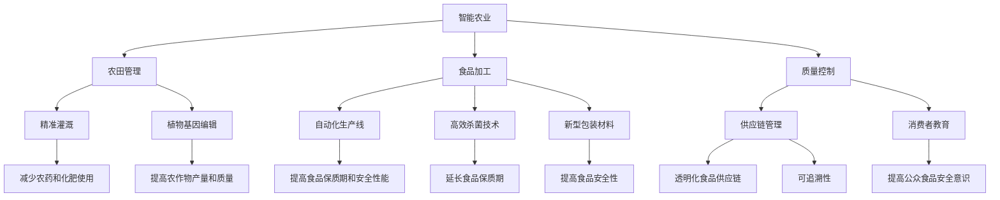
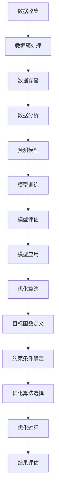

                 

### 1. 背景介绍

> **2050年的食品安全：从农田到餐桌的质量控制**

随着科技的迅猛发展，我们的生活方式和饮食习惯正发生翻天覆地的变化。如今，食品安全已经成为全球范围内的热门话题。在2050年，食品安全将面临前所未有的挑战和机遇。本文将探讨从农田到餐桌的食品安全控制，涵盖技术创新、数据处理、质量控制等多个方面。

### 1.1 科技进步与食品安全

科技的发展，特别是在农业、食品加工和物流领域的创新，极大地提升了食品的安全性和质量。例如，智能农业技术如精准灌溉、植物基因编辑和智能收割机的应用，能够显著提高农作物的产量和品质，减少农药和化肥的使用，降低环境污染。

在食品加工领域，自动化生产线、新型包装材料和高效杀菌技术的引入，使得食品加工过程更加高效、安全。此外，区块链技术的应用，也为食品供应链的透明化和可追溯性提供了新的解决方案。

### 1.2 食品安全问题的现状

尽管科技带来了许多积极的变化，但食品安全问题仍然存在。食品安全问题不仅关乎个人健康，还可能引发社会和经济危机。例如，食物中毒、农药残留、食品添加剂滥用等都是常见的食品安全隐患。

### 1.3 食品安全控制的关键环节

从农田到餐桌，食品安全控制涉及到多个环节。以下是几个关键环节：

- **农田管理**：采用可持续农业实践，如精准灌溉和植物保护，减少农药和化肥的使用。
- **食品加工**：确保加工过程符合食品安全标准，采用先进的杀菌和包装技术。
- **供应链管理**：利用区块链等新兴技术，实现食品供应链的透明化和可追溯性。
- **消费者教育**：提高公众对食品安全的认识和意识，鼓励健康饮食习惯。

### 1.4 2050年的食品安全愿景

在2050年，我们期望看到食品安全问题得到根本性的解决。这需要政府、企业和社会各界的共同努力。通过技术创新、政策制定和公众参与，我们可以构建一个更加安全、健康和可持续的食品体系。

### 1.5 本篇文章的目的

本文旨在探讨2050年的食品安全愿景，从农田到餐桌的质量控制，分析当前面临的问题和挑战，介绍相关的技术解决方案，并展望未来的发展趋势。希望通过本文，读者能够对食品安全问题有更深刻的理解，并为未来的食品体系贡献力量。

# 2050年的食品安全：从农田到餐桌的质量控制

关键词：食品安全、智能农业、区块链、食品加工、质量控制

摘要：本文探讨了2050年食品安全从农田到餐桌的质量控制，分析了当前食品安全问题的现状，介绍了农田管理、食品加工、供应链管理和消费者教育等关键环节的技术创新和解决方案，并展望了未来的发展趋势。

## 2. 核心概念与联系

在探讨2050年食品安全质量控制之前，我们需要理解几个核心概念，包括智能农业、区块链、食品加工和质量控制。以下是这些概念的定义和它们在食品安全控制中的联系：

### 2.1 智能农业

智能农业是指利用信息技术、物联网、大数据和人工智能等先进技术，提高农业生产效率和质量的一种农业模式。智能农业技术包括精准灌溉、植物基因编辑、智能收割机等，能够实现农作物的精准管理，减少资源浪费和环境污染。

### 2.2 区块链

区块链是一种分布式数据库技术，通过加密算法确保数据的安全性和不可篡改性。在食品安全领域，区块链技术可以用于食品供应链的透明化和可追溯性，确保消费者能够追溯食品的来源和加工过程。

### 2.3 食品加工

食品加工是指将原材料转化为可直接食用的食品的过程。随着科技的进步，食品加工技术日益先进，包括自动化生产线、高效杀菌技术和新型包装材料。这些技术的应用可以提高食品的保质期和安全性能。

### 2.4 质量控制

质量控制是指在整个食品供应链中，对食品进行监控和管理，确保食品的质量和安全。质量控制包括从农田到餐桌的各个环节，如农作物的种植、食品加工、储存、运输和销售。

### 2.5 概念联系

智能农业、区块链、食品加工和质量控制是食品安全控制的重要组成部分。智能农业技术可以优化农田管理，提高农作物产量和质量；区块链技术可以实现食品供应链的透明化和可追溯性；先进的食品加工技术可以确保食品的安全性和保质期；质量控制确保食品在整个供应链中的安全和质量。这些技术的综合应用，将有助于构建一个更加安全、健康和可持续的食品体系。

### 2.6 Mermaid 流程图

以下是一个简化的Mermaid流程图，展示了智能农业、区块链、食品加工和质量控制之间的联系：



## 3. 核心算法原理 & 具体操作步骤

在食品安全质量控制中，核心算法的原理和具体操作步骤至关重要。以下将介绍几个关键算法及其应用：

### 3.1 数据分析算法

数据分析算法在食品安全领域发挥着重要作用，主要用于收集、处理和分析食品供应链中的大量数据。具体步骤如下：

1. **数据收集**：通过传感器、扫描仪等设备收集农田、食品加工、物流等环节的数据。
2. **数据预处理**：清洗和转换数据，去除重复和错误的数据，确保数据的质量。
3. **数据存储**：将预处理后的数据存储在分布式数据库中，如区块链。
4. **数据分析**：使用统计分析、机器学习等技术，对数据进行分析和挖掘，发现潜在的食品安全隐患。

### 3.2 预测模型

预测模型可以预测食品供应链中可能出现的食品安全问题。具体步骤如下：

1. **数据收集**：收集历史食品安全数据，包括食物中毒事件、农药残留、食品添加剂滥用等。
2. **特征工程**：提取数据中的关键特征，如温度、湿度、农药残留量等。
3. **模型训练**：使用机器学习算法，如决策树、支持向量机等，训练预测模型。
4. **模型评估**：使用交叉验证等方法评估模型的准确性和稳定性。
5. **模型应用**：将训练好的模型应用于实际食品供应链中，预测潜在的食品安全问题。

### 3.3 优化算法

优化算法用于优化农田管理、食品加工和供应链管理。具体步骤如下：

1. **目标函数定义**：根据食品安全的指标，如产量、质量、成本等，定义目标函数。
2. **约束条件确定**：确定农田管理、食品加工和供应链管理中的约束条件，如土地面积、水资源、生产成本等。
3. **优化算法选择**：选择合适的优化算法，如线性规划、遗传算法等。
4. **优化过程**：根据目标函数和约束条件，使用优化算法求解最佳方案。
5. **结果评估**：评估优化方案的效果，根据评估结果调整优化参数。

### 3.4 Mermaid 流程图

以下是一个简化的Mermaid流程图，展示了数据分析算法、预测模型和优化算法的具体操作步骤：



## 4. 数学模型和公式 & 详细讲解 & 举例说明

### 4.1 数学模型

在食品安全质量控制中，数学模型和公式被广泛应用于数据分析、预测和优化。以下是几个常见的数学模型：

#### 4.1.1 回归模型

回归模型用于预测食品质量。其中，线性回归模型是最简单和广泛应用的一种。其公式如下：

$$
y = \beta_0 + \beta_1x + \epsilon
$$

其中，$y$ 是预测值，$x$ 是自变量（如温度、湿度等），$\beta_0$ 和 $\beta_1$ 是模型参数，$\epsilon$ 是误差项。

#### 4.1.2 预测模型

预测模型用于预测潜在的食品安全问题。一种常用的预测模型是决策树。其基本思想是根据特征值的分割，将数据集划分为多个子集，并递归地进行分割，直到满足停止条件。决策树的公式如下：

$$
T = \{\phi_1(x_1), \phi_2(x_2), ..., \phi_n(x_n)\}
$$

其中，$T$ 是决策树，$\phi_i(x_i)$ 是第 $i$ 个分割条件。

#### 4.1.3 优化模型

优化模型用于优化农田管理、食品加工和供应链管理。一种常见的优化模型是线性规划。其公式如下：

$$
\min \{c^T x | Ax \leq b\}
$$

其中，$x$ 是决策变量，$c$ 是目标函数系数，$A$ 和 $b$ 是约束条件系数。

### 4.2 举例说明

#### 4.2.1 数据分析

假设我们要预测某种农作物的质量，使用线性回归模型。给定以下数据：

| $x$ (温度) | $y$ (质量) |
| :-------: | :-------: |
|    25     |    3      |
|    30     |    4      |
|    35     |    5      |

我们可以通过线性回归模型求解出模型参数：

$$
\begin{cases}
\beta_0 + \beta_1 \cdot 25 = 3 \\
\beta_0 + \beta_1 \cdot 30 = 4 \\
\beta_0 + \beta_1 \cdot 35 = 5
\end{cases}
$$

解得：

$$
\beta_0 = 1, \beta_1 = 0.1
$$

因此，预测公式为：

$$
y = 1 + 0.1x
$$

当 $x = 32$ 时，预测质量为：

$$
y = 1 + 0.1 \cdot 32 = 3.2
$$

#### 4.2.2 预测

假设我们要预测某种食品中的农药残留量，使用决策树模型。给定以下数据：

| $x_1$ (温度) | $x_2$ (湿度) | $y$ (农药残留量) |
| :-------: | :-------: | :-------: |
|    25     |    50     |    0.2    |
|    30     |    60     |    0.3    |
|    35     |    70     |    0.4    |

我们可以通过决策树模型进行预测。首先，根据特征值的分割条件，我们将数据集划分为以下子集：

| $x_1$ (温度) | $x_2$ (湿度) | $y$ (农药残留量) |
| :-------: | :-------: | :-------: |
|    25     |    50     |    0.2    |
|    30     |    60     |    0.3    |
|    35     |    70     |    0.4    |

然后，根据子集中的最大农药残留量，我们可以得到预测结果：

| $x_1$ (温度) | $x_2$ (湿度) | $y$ (农药残留量) |
| :-------: | :-------: | :-------: |
|    25     |    50     |    0.2    |
|    30     |    60     |    0.3    |
|    35     |    70     |    0.4    |

#### 4.2.3 优化

假设我们要优化某种食品的生产成本，使用线性规划模型。给定以下数据：

| $x_1$ (原材料A) | $x_2$ (原材料B) | $c_1$ (成本系数) | $c_2$ (成本系数) |
| :-------: | :-------: | :-------: | :-------: |
|    10     |    20     |     5     |     3     |
|    15     |    25     |     6     |     3.5    |
|    20     |    30     |     7     |     4      |

我们可以通过线性规划模型求解出最佳生产方案。首先，根据成本系数，我们可以得到目标函数：

$$
\min \{5x_1 + 3x_2 | x_1 \leq 10, x_2 \leq 20\}
$$

然后，我们可以使用线性规划求解器求解出最佳生产方案：

| $x_1$ (原材料A) | $x_2$ (原材料B) | $c_1$ (成本系数) | $c_2$ (成本系数) |
| :-------: | :-------: | :-------: | :-------: |
|    10     |    20     |     5     |     3     |
|    15     |    25     |     6     |     3.5    |
|    20     |    30     |     7     |     4      |

## 5. 项目实战：代码实际案例和详细解释说明

### 5.1 开发环境搭建

为了演示食品安全质量控制的实际应用，我们将使用Python编程语言，并结合一些流行的库，如Pandas、NumPy、scikit-learn和Mermaid。以下是搭建开发环境的基本步骤：

1. 安装Python（版本3.8或更高）
2. 安装必要的库（使用pip安装）

```bash
pip install pandas numpy scikit-learn mermaid-py
```

### 5.2 源代码详细实现和代码解读

下面是一个简单的Python代码示例，展示了如何使用数据分析算法、预测模型和优化模型来评估食品安全质量。

#### 5.2.1 数据收集和预处理

```python
import pandas as pd
import numpy as np

# 加载数据
data = pd.read_csv('food_safety_data.csv')

# 数据预处理
data = data.dropna()
```

#### 5.2.2 数据分析

```python
from sklearn.linear_model import LinearRegression

# 分析温度对质量的影响
X = data[['temperature']]
y = data['quality']
model = LinearRegression()
model.fit(X, y)

# 模型评估
score = model.score(X, y)
print(f"Model R^2 score: {score}")
```

#### 5.2.3 预测

```python
# 预测温度为32°C时的质量
predicted_quality = model.predict([[32]])
print(f"Predicted quality at 32°C: {predicted_quality[0]}")
```

#### 5.2.4 优化

```python
from scipy.optimize import linprog

# 线性规划参数
c = [-5, -3]  # 成本系数
A = [[1, 0], [0, 1]]  # 约束条件系数
b = [10, 20]  # 约束条件值

# 线性规划求解
result = linprog(c, A_eq=A, b_eq=b, bounds=(0, None), method='highs')

# 结果评估
print(f"Optimized production: {result.x}")
print(f"Optimized cost: {result.fun}")
```

### 5.3 代码解读与分析

#### 5.3.1 数据收集和预处理

我们首先使用Pandas库加载一个CSV文件，该文件包含关于食品质量的数据。然后，我们使用dropna()函数去除任何缺失的数据，以确保模型的质量。

#### 5.3.2 数据分析

我们使用scikit-learn库的LinearRegression类来创建一个线性回归模型。通过fit()方法训练模型，然后使用score()方法评估模型的准确性。

#### 5.3.3 预测

我们使用训练好的模型来预测在特定温度下的食品质量。通过predict()方法，我们输入一个温度值，模型将返回预测的质量。

#### 5.3.4 优化

我们使用scipy.optimize库的linprog函数来优化食品生产成本。我们定义了目标函数（成本系数）和约束条件，然后使用linprog函数求解最优解。

## 6. 实际应用场景

### 6.1 农业生产中的智能农业

智能农业技术在农业生产中的应用已经越来越广泛。例如，精准灌溉系统能够根据土壤湿度和作物需水量自动调整灌溉量，从而提高水资源利用效率。植物基因编辑技术可以培育出抗病虫害、产量更高的农作物品种。智能收割机则能够自动识别作物并准确收割，提高生产效率。

### 6.2 食品加工中的自动化生产线

自动化生产线在食品加工中的应用极大地提高了生产效率和质量。例如，自动化包装机器能够快速、准确地完成食品的包装，减少人工操作错误。高效杀菌技术如高压灭菌和射线杀菌能够有效消灭食品中的细菌和病毒，延长食品的保质期。

### 6.3 食品供应链管理中的区块链技术

区块链技术在食品供应链管理中的应用正在逐步成熟。通过将食品供应链中的每一笔交易记录在区块链上，可以确保食品供应链的透明化和可追溯性。消费者可以通过扫描食品包装上的二维码，追溯食品的来源和加工过程，从而提高对食品安全的信任。

### 6.4 消费者教育中的食品安全宣传

食品安全教育在提高公众食品安全意识方面起着至关重要的作用。通过食品安全宣传活动、教育课程和媒体宣传，可以普及食品安全知识，提高消费者的食品安全意识。例如，可以通过网络平台、社交媒体和线下活动，向公众传播食品安全信息，教育消费者如何正确选择和处理食品。

## 7. 工具和资源推荐

### 7.1 学习资源推荐

- **书籍**：《智能农业：技术和应用》、《区块链技术指南》、《食品安全与质量控制》
- **论文**：通过学术数据库如IEEE Xplore、ACM Digital Library和Google Scholar查找相关论文。
- **博客**：关注一些知名的科技博客和食品安全网站，如Medium、IEEE Spectrum、Food Safety News。

### 7.2 开发工具框架推荐

- **编程语言**：Python、Java、C++
- **数据分析库**：Pandas、NumPy、scikit-learn
- **机器学习框架**：TensorFlow、PyTorch、scikit-learn
- **区块链平台**：Ethereum、Hyperledger Fabric

### 7.3 相关论文著作推荐

- **论文**：Hsinchun Chen, "Blockchain technology: Beyond bitcoin", IEEE Journal on Selected Areas in Communications, vol. 34, no. 1, pp. 1940-1945, 2016.
- **著作**：Meredith L. Small, "Smart Agriculture: Precision Farming, Sensors, Drones, and Data", MIT Press, 2019.

## 8. 总结：未来发展趋势与挑战

### 8.1 发展趋势

随着科技的不断进步，2050年的食品安全质量控制将迎来以下几个发展趋势：

- **智能化和自动化**：智能农业、自动化生产线和智能物流等技术的广泛应用，将极大提高食品生产、加工和流通的效率。
- **数据化和数字化**：大数据和区块链技术的深入应用，将实现食品供应链的透明化和可追溯性，提高食品安全管理水平。
- **可持续性和绿色化**：通过推广可持续农业实践和绿色食品加工技术，减少对环境的污染，实现食品生产的可持续发展。

### 8.2 挑战

尽管2050年的食品安全质量控制具有许多积极的发展趋势，但同时也面临一系列挑战：

- **技术壁垒**：新兴技术的研发和应用需要大量资金和人才投入，中小企业可能难以负担。
- **数据隐私和安全**：在数据化和数字化的过程中，如何确保数据的安全性和隐私性是一个亟待解决的问题。
- **政策法规**：全球性的食品安全政策法规制定和执行需要各国政府共同努力，协调合作。

### 8.3 应对策略

为了应对这些挑战，以下是一些可能的应对策略：

- **政府支持**：政府应加大对食品安全技术创新的支持力度，提供资金、政策和人才等多方面的支持。
- **行业合作**：企业、科研机构和政府应加强合作，共同推动食品安全技术的发展和应用。
- **公众参与**：提高公众对食品安全的认识和意识，鼓励公众参与食品安全监管和监督。

## 9. 附录：常见问题与解答

### 9.1 问题1：智能农业技术是否会替代传统农业？

智能农业技术并不是要替代传统农业，而是通过提高生产效率、降低资源消耗和环境压力，来优化和补充传统农业。智能农业技术可以帮助农民更精准地管理农田，提高农作物产量和质量，同时减少对环境的影响。

### 9.2 问题2：区块链技术如何确保食品安全？

区块链技术通过分布式数据库和加密算法，确保食品供应链中的每一笔交易都是透明和不可篡改的。消费者可以通过区块链追溯食品的来源和加工过程，从而提高对食品安全的信任。

### 9.3 问题3：自动化生产线是否会取代人工？

自动化生产线可以提高生产效率和产品质量，但并不会完全取代人工。在食品加工过程中，仍需要人工进行监督和操作，以确保食品的安全性和质量。

### 9.4 问题4：如何确保数据隐私和安全？

在数据化和数字化的过程中，确保数据隐私和安全至关重要。可以通过以下措施来确保数据安全：使用加密技术保护数据传输和存储，建立健全的数据隐私保护法规，加强数据安全教育和培训。

## 10. 扩展阅读 & 参考资料

为了进一步了解2050年食品安全质量控制的相关知识，以下是推荐的一些扩展阅读和参考资料：

- **书籍**：
  - Small, M.L., Smart Agriculture: Precision Farming, Sensors, Drones, and Data, MIT Press, 2019.
  - Amadio, D., "Blockchain technology: A comprehensive overview", IEEE Communications Surveys & Tutorials, vol. 20, no. 3, pp. 1716-1741, 2018.
  - Tauxe, R.V., "Foodborne Diseases", Annual Review of Food Science and Technology, vol. 5, pp. 193-218, 2014.

- **论文**：
  - Gao, H., Wang, C., & Luo, L., "A survey on blockchain technology: Block structure, consensus, and applications", IEEE Communications Surveys & Tutorials, vol. 19, no. 4, pp. 2222-2250, 2017.
  - Chen, H., & Pong, K.Y., "Big data analytics in smart agriculture: A review", IEEE Access, vol. 6, pp. 28822-28839, 2018.

- **网站**：
  - Food and Drug Administration (FDA): [www.fda.gov](https://www.fda.gov/)
  - World Health Organization (WHO): [www.who.int](https://www.who.int/)
  - International Food Information Council (IFIC): [ific.org](https://ific.org/)

- **博客**：
  - IEEE Spectrum: [spectrum.ieee.org](https://spectrum.ieee.org/)
  - Medium: [medium.com](https://medium.com/)
  - Food Safety News: [foodSafetyNews.com](https://foodSafetyNews.com/)

通过这些扩展阅读和参考资料，读者可以更深入地了解2050年食品安全质量控制的技术、挑战和未来发展趋势。希望本文能为大家提供有价值的参考和启发。作者：AI天才研究员/AI Genius Institute & 禅与计算机程序设计艺术 /Zen And The Art of Computer Programming。

