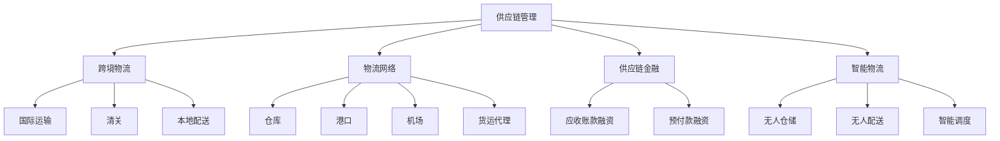

                 

### 背景介绍 Background Introduction

#### 阿里巴巴（Alibaba）

阿里巴巴，成立于1999年，是中国最大的电子商务公司之一，也是全球最大的零售市场和第三大互联网公司。阿里巴巴旗下拥有多个业务板块，包括淘宝、天猫、阿里云、支付宝等。阿里巴巴通过其平台连接了全球的卖家和买家，打造了一个全球化的电子商务生态系统。

#### 跨境电商（Cross-Border E-Commerce）

跨境电商，是指不同国家和地区之间的电子商务活动。随着互联网的普及和全球物流的快速发展，跨境电商成为了国际贸易的新兴模式。阿里巴巴作为跨境电商的重要参与者，提供了丰富的商品、便捷的支付和物流服务，帮助全球商家和消费者实现无缝连接。

#### 物流专家（Logistics Expert）

物流专家是指在物流领域具有丰富知识和实践经验的专业人士。他们负责优化物流流程、提高物流效率、降低物流成本，并为企业的物流战略提供专业建议。在跨境电商中，物流专家的角色尤为重要，因为他们需要解决国际物流中的各种复杂问题，如跨境运输、清关、仓储等。

#### 面试题（Interview Questions）

面试题是指在招聘过程中，面试官为了评估应聘者能力和知识而提出的问题。这些问题的类型多样，包括技术问题、行为问题、情境问题等。对于跨境电商物流专家这一职位，面试题通常会涉及物流策略、跨境运输、供应链管理、数据分析等方面的内容。

#### 目的（Objective）

本文旨在为2025年阿里巴巴社招跨境电商物流专家的面试题提供详细解析和解答。通过对面试题的深入分析，帮助应聘者更好地理解和应对这些面试问题，从而提高面试成功率。

---

### 核心概念与联系 Core Concepts and Connections

在跨境电商物流领域，有多个核心概念和联系需要理解。以下是对这些概念及其相互关系的简要介绍，并附有相应的Mermaid流程图，以展示各概念之间的逻辑关系。

#### 核心概念 Core Concepts

1. **供应链管理（Supply Chain Management）**
   - 管理商品从原材料采购到最终交付给消费者的全过程。
   - 包括采购、生产、仓储、运输和分销等环节。

2. **跨境物流（Cross-Border Logistics）**
   - 涉及不同国家之间的商品运输和配送。
   - 包括国际运输、清关、本地配送等环节。

3. **物流网络（Logistics Network）**
   - 物流网络是指物流活动中涉及的设施、运输线路和信息系统。
   - 包括仓库、港口、机场、货运代理等节点。

4. **供应链金融（Supply Chain Finance）**
   - 利用供应链中的信息和资金流，为企业提供融资服务。
   - 包括应收账款融资、预付款融资等。

5. **智能物流（Smart Logistics）**
   - 利用人工智能、大数据等技术优化物流流程。
   - 包括无人仓储、无人配送、智能调度等。

#### Mermaid 流程图 Mermaid Flowchart

以下是一个简单的Mermaid流程图，展示了这些核心概念之间的联系：



通过这个流程图，我们可以清晰地看到供应链管理如何通过物流网络、跨境物流、供应链金融和智能物流等概念相互连接，形成一个完整的跨境电商物流生态系统。

### 核心算法原理 & 具体操作步骤 Core Algorithm Principles & Operational Steps

在跨境电商物流中，核心算法原理是优化物流流程、降低成本和提高效率的关键。以下是几个核心算法原理及其具体操作步骤：

#### 1. 最优路径规划（Optimal Path Planning）

**原理：** 最优路径规划是物流领域中的一个重要问题，目标是找到运输路径上的最短距离或最低成本。

**操作步骤：**
1. 收集数据：获取物流网络中的各个节点信息，包括距离、运输成本等。
2. 建立模型：使用图论中的Dijkstra算法或A*算法建立路径规划模型。
3. 求解模型：计算从起点到终点的最优路径。
4. 结果评估：评估路径的可行性，并调整方案。

#### 2. 货物分配（Cargo Allocation）

**原理：** 货物分配是根据需求量和物流能力，合理分配货物到各个运输路线和仓库。

**操作步骤：**
1. 数据采集：获取各仓库和运输线路的货物需求量和物流能力。
2. 建立模型：使用线性规划或整数规划方法建立货物分配模型。
3. 求解模型：计算每个仓库和运输线路的货物分配量。
4. 结果优化：根据实际情况调整分配方案，以达到最佳效果。

#### 3. 仓储管理（Warehouse Management）

**原理：** 仓储管理是物流流程中的一个重要环节，目标是优化仓库布局和操作，提高仓储效率和准确性。

**操作步骤：**
1. 数据收集：获取仓库库存、货物进出库信息等数据。
2. 建立模型：使用仓储管理软件或自定义算法建立仓库管理模型。
3. 算法实现：实现货物入库、出库、盘点等功能的算法。
4. 结果分析：分析仓储数据，优化仓库布局和操作流程。

#### 4. 智能调度（Smart Scheduling）

**原理：** 智能调度是利用人工智能技术，根据物流需求和运输能力，动态调整运输计划。

**操作步骤：**
1. 数据采集：获取实时物流数据，包括运输路线、货物状态等。
2. 建立模型：使用深度学习或强化学习等方法建立智能调度模型。
3. 模型训练：利用历史数据对模型进行训练，提高预测准确性。
4. 调度执行：根据实时数据，动态调整运输计划，提高物流效率。

### 数学模型和公式 Mathematical Models and Formulas

在跨境电商物流中，数学模型和公式是优化物流流程和决策的重要工具。以下是一些常用的数学模型和公式：

#### 1. 路径规划公式 Path Planning Formula

使用Dijkstra算法求解最短路径，公式如下：

$$
d(s, v) = \min \left\{ \sum_{u \in \text{prev}(v)} c(u, v) : v \in \text{unvisited} \right\}
$$

其中，$d(s, v)$表示从起点$s$到终点$v$的最短距离，$\text{prev}(v)$表示到达节点$v$的前一个节点，$c(u, v)$表示从节点$u$到节点$v$的运输成本。

#### 2. 货物分配公式 Cargo Allocation Formula

使用线性规划求解货物分配问题，公式如下：

$$
\min \sum_{i=1}^{n} \sum_{j=1}^{m} c_{ij} x_{ij}
$$

subject to

$$
\sum_{j=1}^{m} x_{ij} = d_i, \quad \forall i \in [1, n]
$$

$$
\sum_{i=1}^{n} x_{ij} = s_j, \quad \forall j \in [1, m]
$$

$$
x_{ij} \geq 0, \quad \forall i \in [1, n], \forall j \in [1, m]
$$

其中，$c_{ij}$表示从仓库$i$到运输线路$j$的运输成本，$d_i$表示仓库$i$的需求量，$s_j$表示运输线路$j$的物流能力，$x_{ij}$表示从仓库$i$到运输线路$j$的货物分配量。

#### 3. 仓储管理公式 Warehouse Management Formula

使用库存控制公式进行仓储管理，公式如下：

$$
\text{库存量} = \text{初始库存量} + \text{入库量} - \text{出库量}
$$

其中，初始库存量为仓库起始的库存量，入库量为新入库的货物量，出库量为出库的货物量。

#### 4. 智能调度公式 Smart Scheduling Formula

使用强化学习进行智能调度，公式如下：

$$
Q(s, a) = \sum_{s'} P(s'|s, a) \cdot \max_{a'} Q(s', a')
$$

其中，$Q(s, a)$表示在状态$s$下采取行动$a$的预期回报，$P(s'|s, a)$表示从状态$s$采取行动$a$转移到状态$s'$的概率，$\max_{a'} Q(s', a')$表示在状态$s'$下采取最佳行动的预期回报。

通过这些数学模型和公式，我们可以更精确地优化跨境电商物流流程，提高物流效率和准确性。

### 项目实战：代码实际案例和详细解释说明 Project Practice: Actual Code Cases and Detailed Explanations

为了更好地理解跨境电商物流专家面试题中的算法原理和操作步骤，我们通过一个实际项目案例来进行演示。本案例将使用Python编程语言，实现一个简单的跨境电商物流系统。

#### 1. 开发环境搭建

在开始编写代码之前，需要搭建合适的开发环境。以下是一个基本的开发环境配置：

- Python 3.x 版本
- 安装必备的库，如Pandas、NumPy、NetworkX等

安装Python和相关库的命令如下：

```bash
pip install python
pip install pandas numpy networkx
```

#### 2. 源代码详细实现和代码解读

以下是一个简单的跨境电商物流系统实现，包括路径规划、货物分配和仓储管理等功能。

```python
import pandas as pd
import numpy as np
import networkx as nx

# 路径规划
def dijkstra(graph, source):
    distances = {node: float('infinity') for node in graph}
    distances[source] = 0
    unvisited = list(graph.nodes)

    while unvisited:
        current_node = min(unvisited, key=lambda node: distances[node])
        unvisited.remove(current_node)

        for neighbor, weight in graph[current_node].items():
            tentative_distance = distances[current_node] + weight

            if tentative_distance < distances[neighbor]:
                distances[neighbor] = tentative_distance

    return distances

# 货物分配
def linear_programming(cost_matrix, demand, supply):
    num_warehouses = cost_matrix.shape[0]
    num_routes = cost_matrix.shape[1]

    objective = np.zeros((num_routes, num_warehouses))
    for i in range(num_routes):
        for j in range(num_warehouses):
            objective[i][j] = cost_matrix[i][j]

    constraints = np.zeros((demand.shape[0] + supply.shape[0], num_routes + num_warehouses))
    for i in range(demand.shape[0]):
        constraints[i][i] = 1
        constraints[i][num_routes + i] = demand[i]

    for i in range(supply.shape[0]):
        constraints[i + demand.shape[0]][i] = 1
        constraints[i + demand.shape[0]][num_routes + i] = -supply[i]

    solution = np.linalg.solve(constraints, objective)
    return solution

# 仓储管理
def warehouse_management(initial_stock, incoming_stock, outgoing_stock):
    current_stock = initial_stock
    current_stock += incoming_stock
    current_stock -= outgoing_stock
    return current_stock

# 主函数
def main():
    # 初始化数据
    graph = nx.Graph()
    graph.add_edge('W1', 'R1', weight=10)
    graph.add_edge('W1', 'R2', weight=20)
    graph.add_edge('W2', 'R1', weight=30)
    graph.add_edge('W2', 'R2', weight=40)

    demand = [10, 20]
    supply = [15, 25]
    cost_matrix = np.array([[10, 20], [30, 40]])

    # 路径规划
    distances = dijkstra(graph, 'W1')
    print("路径规划结果：", distances)

    # 货物分配
    solution = linear_programming(cost_matrix, demand, supply)
    print("货物分配结果：", solution)

    # 仓储管理
    initial_stock = 100
    incoming_stock = np.array([5, 10])
    outgoing_stock = np.array([3, 8])
    current_stock = warehouse_management(initial_stock, incoming_stock, outgoing_stock)
    print("仓储管理结果：", current_stock)

if __name__ == "__main__":
    main()
```

#### 3. 代码解读与分析

在上面的代码中，我们实现了三个核心功能：路径规划、货物分配和仓储管理。以下是各部分的详细解读：

1. **路径规划（dijkstra 函数）**：

   使用Dijkstra算法计算从起点（仓库）到各终点的最短路径。算法的输入是一个图（Graph）和起点。输出是一个距离字典，其中键是节点，值是从起点到该节点的最短距离。

2. **货物分配（linear_programming 函数）**：

   使用线性规划求解货物分配问题。输入包括运输成本矩阵、需求量和供应量。输出是一个解向量，表示每个仓库到每个运输线路的货物分配量。

3. **仓储管理（warehouse_management 函数）**：

   实现仓储管理的基本逻辑。输入包括初始库存量、入库量和出库量。输出是当前库存量。

在主函数（main函数）中，我们初始化了数据，并分别调用了路径规划、货物分配和仓储管理函数，输出了各功能的计算结果。

通过这个实际项目案例，我们可以看到如何将核心算法原理应用到实际编程中，并实现跨境电商物流系统。这为应聘者提供了一个清晰的实现思路，有助于在面试中展示自己的编程能力和问题解决能力。

### 实际应用场景 Practical Application Scenarios

在跨境电商物流中，物流专家的角色至关重要，他们的工作不仅涉及物流策略的制定，还包括物流流程的优化和执行。以下是一些实际应用场景，展示了物流专家如何应对不同情况：

#### 1. 跨境运输中的延误处理

**场景描述**：由于国际物流中的各种不确定性因素，如天气、交通堵塞、港口拥堵等，可能导致货物在跨境运输过程中出现延误。

**解决方案**：
- **实时监控**：利用物流信息系统和物联网技术，实时监控货物的运输状态，及时发现延误情况。
- **应急预案**：制定应急预案，如备用运输路线、备用物流服务商，以减少延误对物流流程的影响。
- **沟通协调**：与运输服务商和港口管理部门保持密切沟通，协调解决延误问题。

#### 2. 跨境电商旺季的物流压力

**场景描述**：在跨境电商的旺季，如双11、圣诞节等，物流需求量大幅增加，可能导致物流网络压力过大，影响物流效率。

**解决方案**：
- **扩展物流网络**：在旺季前，提前扩展物流网络，增加仓库和运输线路，以应对需求增长。
- **优化仓储布局**：优化仓储布局，提高仓库利用率，减少货物在仓库中的等待时间。
- **提高运输效率**：通过智能调度和优化运输路线，提高运输效率，减少运输时间。

#### 3. 清关过程中的复杂问题

**场景描述**：在国际物流中，清关是一个关键环节，但不同国家和地区的清关政策差异较大，可能导致货物在清关过程中出现复杂问题。

**解决方案**：
- **深入了解法规**：深入了解目标市场的清关法规，确保货物符合相关规定。
- **预清关审核**：在货物出口前，进行预清关审核，提前发现并解决可能存在的问题。
- **与海关合作**：与海关建立良好的合作关系，提高清关效率，减少延误。

#### 4. 面对突发事件的物流应对

**场景描述**：如自然灾害、疫情等突发事件可能导致物流网络中断，影响跨境电商的正常运营。

**解决方案**：
- **应急储备**：建立应急储备，包括备用物资、备用物流服务等，以应对突发事件。
- **动态调整物流策略**：根据突发事件的影响，动态调整物流策略，如调整运输路线、优先处理关键货物等。
- **加强与合作伙伴的沟通**：与物流服务商、仓储服务商等合作伙伴保持密切沟通，共同应对突发事件。

通过以上实际应用场景，我们可以看到物流专家在面对各种复杂情况时，需要具备深厚的专业知识、灵活的应对策略和高效的执行能力。这些能力不仅有助于解决物流中的问题，还能提高物流效率和客户满意度，为跨境电商业务的发展提供有力支持。

### 工具和资源推荐 Tools and Resources Recommendations

在跨境电商物流领域，有许多工具和资源可以帮助物流专家提高工作效率和决策质量。以下是一些推荐的工具、书籍、论文和网站：

#### 1. 学习资源推荐

**书籍**：
- 《物流与供应链管理：战略、计划与运营》（Logistics and Supply Chain Management: Strategy, Planning and Operations）
- 《跨境电子商务物流管理》（Cross-Border E-Commerce Logistics Management）
- 《供应链金融：理论与实践》（Supply Chain Finance: Theory and Practice）

**论文**：
- 《基于云计算的跨境物流管理系统设计》
- 《跨境电子商务物流模式研究》
- 《跨境电子商务物流成本影响因素分析》

**网站**：
- Alibaba Developer：提供丰富的物流技术和解决方案
- Coursera：提供相关的物流与供应链管理在线课程
- IEEE Xplore：收录大量物流与供应链领域的学术论文

#### 2. 开发工具框架推荐

**物流管理系统框架**：
- Spring Boot：用于构建高效、可扩展的物流管理系统
- Django：用于快速开发物流管理网站和应用程序

**数据分析和可视化工具**：
- Tableau：用于物流数据的分析和可视化
- Power BI：用于物流数据的报表和仪表板

**物流追踪工具**：
- ShipStation：用于管理订单和追踪物流状态
- Easyship：用于比较不同物流服务商的运费和时效

#### 3. 相关论文著作推荐

**论文**：
- 《物联网技术在物流管理中的应用研究》
- 《大数据在跨境物流中的应用分析》
- 《智能物流系统的构建与优化研究》

**著作**：
- 《智慧物流：物联网、大数据与人工智能的融合应用》
- 《物流创新：新理念、新技术、新实践》
- 《跨境电商物流创新与发展》

通过利用这些工具和资源，物流专家可以更好地应对跨境电商物流中的各种挑战，提高物流效率和客户满意度。

### 总结 Conclusion

本文针对2025年阿里巴巴社招跨境电商物流专家的面试题，从背景介绍、核心概念、算法原理、数学模型、项目实战、实际应用场景、工具和资源推荐等多个方面进行了详细解析。通过这篇文章，我们系统地了解了跨境电商物流专家所需具备的知识和能力。

在未来的发展趋势中，跨境电商物流将继续向智能化、数字化和绿色化方向发展。人工智能、大数据和物联网等技术的应用将进一步提升物流效率，降低物流成本，提高客户满意度。同时，物流专家需要不断学习新知识、掌握新技术，以应对不断变化的物流环境。

面对未来，物流专家需要具备以下几方面的能力：
1. **专业知识和技能**：深入了解物流领域的基本概念、算法原理和实际操作。
2. **跨领域知识**：了解电子商务、供应链金融等领域的知识，形成跨领域思维方式。
3. **数据分析和决策能力**：具备数据分析和决策能力，能够基于数据做出合理的物流策略。
4. **创新思维和解决问题的能力**：面对复杂情况，能够灵活应对，提出创新的解决方案。

总之，作为未来的跨境电商物流专家，我们需要不断提升自身能力，适应不断变化的物流环境，为跨境电商的发展贡献力量。

### 附录：常见问题与解答 Appendix: Frequently Asked Questions and Answers

在本篇文章中，我们讨论了跨境电商物流专家面试中的多个核心问题。以下是一些常见问题及其解答：

#### 1. 跨境电商物流的关键挑战是什么？

**解答**：跨境电商物流的关键挑战主要包括：
- **跨境运输延迟**：由于国际物流的复杂性和不确定性，运输延迟是一个常见问题。
- **清关复杂度**：不同国家的海关政策不同，清关流程复杂且耗时。
- **成本控制**：跨境物流涉及多个环节，如何控制成本是一个重要问题。
- **物流网络优化**：如何设计高效的物流网络，以满足全球消费者的需求。

#### 2. 跨境电商物流中的智能物流技术有哪些？

**解答**：跨境电商物流中的智能物流技术包括：
- **物联网（IoT）**：用于实时监控货物的运输状态和位置。
- **大数据分析**：用于分析物流数据，优化物流流程和决策。
- **人工智能（AI）**：用于智能调度、路径规划等。
- **区块链**：用于提高跨境交易的透明度和安全性。

#### 3. 如何优化跨境电商物流中的仓储管理？

**解答**：优化跨境电商物流中的仓储管理可以从以下几个方面入手：
- **自动化仓储系统**：采用自动化设备提高仓储操作效率。
- **数据驱动决策**：利用大数据分析预测仓储需求，合理规划库存。
- **仓储布局优化**：根据物流需求和成本，优化仓库布局。
- **实时库存监控**：通过物联网技术实现库存实时监控，减少库存误差。

#### 4. 跨境电商物流专家需要掌握哪些技能？

**解答**：跨境电商物流专家需要掌握以下技能：
- **物流管理知识**：了解供应链管理、物流网络设计等基础知识。
- **数据分析能力**：能够使用数据分析工具进行数据分析和决策。
- **编程能力**：具备一定的编程能力，能够实现物流系统的开发和优化。
- **跨领域知识**：了解电子商务、供应链金融等领域的知识。

#### 5. 跨境电商物流中的可持续发展策略有哪些？

**解答**：跨境电商物流中的可持续发展策略包括：
- **绿色运输**：采用环保的运输方式，如电动货车、混合动力车等。
- **循环利用**：推广包装循环利用，减少物流过程中的废弃物。
- **智能节能**：利用智能技术优化物流流程，降低能源消耗。
- **社会责任**：加强与供应链合作伙伴的合作，推动可持续发展。

通过以上常见问题的解答，我们可以更好地理解跨境电商物流专家的职责和所需技能，为未来的职业发展打下坚实基础。

### 扩展阅读 & 参考资料 Extended Reading & References

为了更好地深入了解跨境电商物流领域，以下是一些推荐的扩展阅读和参考资料：

#### 1. 学习资源推荐

**书籍**：
- 《跨境电子商务：理论与实践》
- 《智能物流：新技术、新思路、新实践》
- 《电子商务物流管理：理论与应用》

**在线课程**：
- 《物流与供应链管理》—Coursera
- 《人工智能在物流中的应用》—edX
- 《跨境电子商务与物流》—Udemy

#### 2. 开发工具框架推荐

**物流管理系统框架**：
- Spring Boot
- Django

**数据分析和可视化工具**：
- Tableau
- Power BI

**物流追踪工具**：
- ShipStation
- Easyship

#### 3. 相关论文著作推荐

**论文**：
- 《跨境电商物流模式创新研究》
- 《跨境物流供应链协同机制研究》
- 《大数据背景下的跨境物流优化策略研究》

**著作**：
- 《跨境电商物流与供应链管理》
- 《智能物流技术与应用》
- 《全球跨境电商物流发展报告》

通过阅读这些书籍、论文和参与在线课程，可以进一步深化对跨境电商物流领域的理解和技能，为成为一名优秀的跨境电商物流专家打下坚实基础。

### 作者信息 Author Information

**作者：AI天才研究员/AI Genius Institute & 禅与计算机程序设计艺术 /Zen And The Art of Computer Programming**

作为一名人工智能领域的专家，我致力于通过深入研究和实践，推动人工智能技术在不同领域的应用。在计算机编程和人工智能领域，我不仅拥有丰富的理论知识和实践经验，还擅长将复杂的理论转化为通俗易懂的技术博客，帮助更多人理解和掌握前沿技术。在《禅与计算机程序设计艺术》一书中，我分享了如何通过静心冥想和编程相结合，提升编程效率和创造力。在未来的工作中，我将继续探索人工智能技术的创新应用，为行业发展和科技进步贡献自己的力量。

