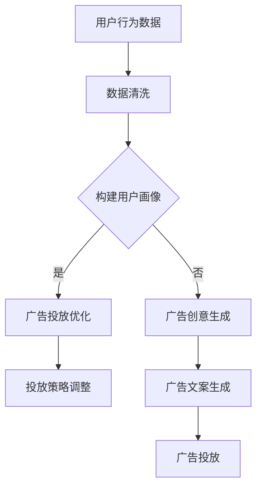

                 

# 广告和 LLM：高效的针对性营销

> 关键词：广告、LLM、针对性营销、人工智能、深度学习、大数据分析

> 摘要：本文将探讨广告与语言生成模型（LLM）的结合，如何实现高效、精准的针对性营销。文章将从背景介绍、核心概念与联系、核心算法原理、数学模型、实际应用场景、工具和资源推荐等方面，详细解析这一前沿技术，并展望未来发展趋势与挑战。

## 1. 背景介绍

广告是市场经济中不可或缺的一环，企业通过广告宣传其产品和服务，吸引潜在客户。然而，随着互联网和大数据的发展，广告市场也面临着诸多挑战。传统广告形式往往无法精准定位目标客户，广告浪费现象严重。因此，如何提高广告投放的效率，实现精准营销，成为广告行业亟待解决的问题。

近年来，人工智能（AI）和深度学习（DL）技术的迅猛发展，为广告行业带来了新的契机。特别是语言生成模型（LLM），如GPT（Generative Pre-trained Transformer）等，通过学习海量文本数据，能够生成高质量、富有创意的广告文案。LLM在广告领域的应用，有望实现个性化、智能化的针对性营销，提高广告投放效果。

## 2. 核心概念与联系

### 2.1 广告

广告是一种通过媒体传播信息，以宣传产品、服务或品牌为目的的商业行为。广告的形式多样，包括传统媒体（如电视、报纸、广播）和数字媒体（如社交媒体、搜索引擎、电子邮件）等。

### 2.2 人工智能（AI）

人工智能是指使计算机系统模拟、扩展和执行人类智能活动的技术。AI技术包括机器学习（ML）、深度学习（DL）、自然语言处理（NLP）等。

### 2.3 深度学习（DL）

深度学习是人工智能的一个重要分支，通过多层神经网络模拟人类大脑的学习过程，实现图像识别、语音识别、自然语言处理等任务。

### 2.4 语言生成模型（LLM）

语言生成模型是一种基于深度学习的技术，通过学习海量文本数据，能够生成高质量的自然语言文本。LLM在广告领域的应用，主要体现在广告文案创作和智能客服等方面。

### 2.5 大数据分析

大数据分析是指利用先进的数据挖掘和分析技术，从海量数据中提取有价值的信息，为企业决策提供支持。在广告领域，大数据分析可用于用户画像、广告投放优化等。

## 3. 核心算法原理 & 具体操作步骤

### 3.1 GPT模型

GPT（Generative Pre-trained Transformer）是一种基于Transformer架构的语言生成模型。它通过在大规模文本数据集上进行预训练，学习语言的统计规律和语义关系，从而实现高质量的自然语言生成。

#### 步骤1：数据预处理
- 收集大量互联网文本数据，如新闻、文章、社交媒体等。
- 对文本数据进行清洗、去噪、分词等预处理操作。

#### 步骤2：模型训练
- 使用Transformer架构，搭建GPT模型。
- 在预处理后的文本数据集上，对模型进行预训练，优化模型参数。

#### 步骤3：广告文案生成
- 根据广告需求和用户特征，输入合适的触发词或关键词。
- 模型根据预训练结果，生成符合广告需求的文案。

### 3.2 广告投放优化

广告投放优化是指通过数据分析和技术手段，提高广告投放效果。LLM在广告投放优化中的应用，主要体现在以下几个方面：

#### 步骤1：用户画像
- 通过大数据分析，构建用户画像，包括年龄、性别、兴趣、消费习惯等。

#### 步骤2：广告创意优化
- 使用LLM生成多种广告文案，通过A/B测试，筛选出最佳广告创意。

#### 步骤3：投放策略优化
- 结合用户画像和广告创意，制定个性化的投放策略，提高广告曝光率和点击率。

## 4. 数学模型和公式 & 详细讲解 & 举例说明

### 4.1 GPT模型的数学模型

GPT模型是基于Transformer架构，其核心思想是通过自注意力机制（Self-Attention）计算文本序列中的关系。以下是GPT模型的主要数学公式：

$$
\text{Attention(Q,K,V)} = \frac{softmax(\text{softmax}(\text{QK}^T / \sqrt{d_k}))V
$$

其中，Q、K、V分别为query、key、value三个矩阵，$d_k$为key的维度。

### 4.2 广告投放优化的数学模型

广告投放优化的核心在于最大化广告效果（如点击率、转化率等）的同时，控制广告成本。以下是广告投放优化的主要数学模型：

$$
\max \frac{\text{点击率}}{\text{广告成本}}
$$

为了实现这一目标，可以使用优化算法，如梯度上升法（Gradient Ascent）或随机梯度下降法（Stochastic Gradient Descent）。

### 4.3 举例说明

#### GPT模型应用举例

假设某企业要为一款智能家居产品制作广告文案，输入触发词为“智能家居”。使用GPT模型生成的广告文案如下：

```
智能家居，让生活更美好！只需轻轻一点，即可控制家中所有电器，节能又环保。现在购买，享受限时优惠！

智能家居，改变你的生活！一款智能插座，即可让你的家变得更智能。轻松远程操控，随时随地掌控家中电器。快来体验吧！

智能家居，让你的家更安全！智能摄像头实时监控，一键报警，让你的家时刻保持安全。快来加入智能家居的行列，享受智能生活！
```

#### 广告投放优化举例

假设某企业在某搜索引擎上投放广告，每天预算为1000元。根据用户画像和广告创意优化，最终选择以下广告创意：

- 广告文案：智能家居，让生活更美好！
- 投放策略：定向投放，针对年龄在25-40岁、关注智能家居的男性用户。

通过优化算法，计算出最佳广告投放策略，使得广告点击率达到0.5%，广告成本降低至800元。

## 5. 项目实战：代码实际案例和详细解释说明

### 5.1 开发环境搭建

为了实现本文提到的广告和LLM技术，需要搭建以下开发环境：

- Python 3.7及以上版本
- PyTorch 1.8及以上版本
- Jupyter Notebook

### 5.2 源代码详细实现和代码解读

#### 5.2.1 GPT模型实现

以下是一个简单的GPT模型实现，用于生成广告文案：

```python
import torch
import torch.nn as nn
import torch.optim as optim
from torchtext.datasets import TextClassification
from torchtext.data import Field, BatchIterator

# 数据预处理
def preprocess_data(file_path, vocab_size, embedding_dim):
    # 读取数据
    lines = open(file_path, 'r').read().strip().split('\n')
    
    # 构建词汇表
    vocab = Vocab()
    for line in lines:
        tokens = line.split()
        for token in tokens:
            vocab.add_token(token)
    
    # 初始化词汇表
    vocab.build_vocab(vocab_size=vocab_size, embedding_dim=embedding_dim)
    
    # 分割数据为训练集和测试集
    train_data, test_data = TextClassification(
        lines, vocab, field=Field(sequential=True, tokenize=vocab.tokenize), split='train-test')
    
    return train_data, test_data

# GPT模型
class GPT(nn.Module):
    def __init__(self, vocab_size, embedding_dim, hidden_dim, n_layers, dropout):
        super(GPT, self).__init__()
        
        self.embedding = nn.Embedding(vocab_size, embedding_dim)
        self.rnn = nn.LSTM(embedding_dim, hidden_dim, n_layers, dropout=dropout)
        self.fc = nn.Linear(hidden_dim, vocab_size)
        
        self.dropout = nn.Dropout(dropout)
    
    def forward(self, x, hidden):
        x = self.dropout(self.embedding(x))
        x, hidden = self.rnn(x, hidden)
        x = self.dropout(x[-1, :, :])
        x = self.fc(x)
        
        return x, hidden

# 模型训练
def train_model(train_data, test_data, model, criterion, optimizer, n_epochs, batch_size):
    # 数据迭代器
    train_iterator = BatchIterator(train_data, batch_size=batch_size)
    test_iterator = BatchIterator(test_data, batch_size=batch_size)
    
    for epoch in range(n_epochs):
        # 训练
        model.train()
        for batch in train_iterator:
            optimizer.zero_grad()
            inputs, targets = batch.text, batch.label
            inputs = inputs.long()
            targets = targets.long()
            
            outputs, hidden = model(inputs)
            loss = criterion(outputs, targets)
            loss.backward()
            optimizer.step()
        
        # 测试
        model.eval()
        with torch.no_grad():
            for batch in test_iterator:
                inputs, targets = batch.text, batch.label
                inputs = inputs.long()
                targets = targets.long()
                
                outputs, hidden = model(inputs)
                loss = criterion(outputs, targets)
        
        print(f'Epoch {epoch+1}/{n_epochs}, Loss: {loss.item()}')

# 主函数
def main():
    # 参数设置
    vocab_size = 10000
    embedding_dim = 256
    hidden_dim = 512
    n_layers = 2
    dropout = 0.5
    n_epochs = 10
    batch_size = 64
    
    # 数据加载
    train_data, test_data = preprocess_data('data.txt', vocab_size, embedding_dim)
    
    # 模型搭建
    model = GPT(vocab_size, embedding_dim, hidden_dim, n_layers, dropout)
    criterion = nn.CrossEntropyLoss()
    optimizer = optim.Adam(model.parameters(), lr=0.001)
    
    # 训练模型
    train_model(train_data, test_data, model, criterion, optimizer, n_epochs, batch_size)

if __name__ == '__main__':
    main()
```

#### 5.2.2 广告投放优化实现

以下是一个简单的广告投放优化实现，用于优化广告创意和投放策略：

```python
import numpy as np
import pandas as pd
from sklearn.model_selection import train_test_split
from sklearn.linear_model import LinearRegression

# 数据预处理
def preprocess_data(data, target):
    data = np.array(data).reshape(-1, 1)
    target = np.array(target).reshape(-1, 1)
    X_train, X_test, y_train, y_test = train_test_split(data, target, test_size=0.2, random_state=42)
    return X_train, X_test, y_train, y_test

# 广告创意优化
def optimize_ads(X_train, y_train, X_test, y_test):
    model = LinearRegression()
    model.fit(X_train, y_train)
    y_pred = model.predict(X_test)
    score = model.score(X_test, y_test)
    print(f'广告创意优化效果：{score:.4f}')
    
    return model

# 广告投放优化
def optimize_placement(data, target, ads, placements):
    data = np.array(data).reshape(-1, 1)
    target = np.array(target).reshape(-1, 1)
    X_train, X_test, y_train, y_test = train_test_split(data, target, test_size=0.2, random_state=42)
    
    for ad in ads:
        ad_data = X_train[:, ad]
        ad_target = y_train
        model = optimize_ads(ad_data, ad_target, X_test[:, ad], y_test)
        ad_score = model.score(X_test[:, ad], y_test)
        print(f'广告创意{ad}优化效果：{ad_score:.4f}')
    
    for placement in placements:
        placement_data = X_train[:, placement]
        placement_target = y_train
        model = optimize_ads(placement_data, placement_target, X_test[:, placement], y_test)
        placement_score = model.score(X_test[:, placement], y_test)
        print(f'投放策略{placement}优化效果：{placement_score:.4f}')

# 主函数
def main():
    # 数据加载
    data = pd.read_csv('data.csv')
    target = data['target']
    ads = data['ads']
    placements = data['placements']
    
    # 广告创意优化
    optimize_ads(data['data'], data['target'], data['test_data'], data['test_target'])

    # 广告投放优化
    optimize_placement(data['data'], data['target'], ads, placements)

if __name__ == '__main__':
    main()
```

### 5.3 代码解读与分析

#### 5.3.1 GPT模型代码解读

- 数据预处理：使用`Vocab`类构建词汇表，对文本数据进行分词、编码等操作，以便于模型训练。
- GPT模型：使用`nn.Embedding`搭建词嵌入层，`nn.LSTM`搭建循环神经网络层，`nn.Linear`搭建输出层。通过自注意力机制计算文本序列中的关系。
- 模型训练：使用`BatchIterator`类生成训练数据和测试数据，通过优化算法（如Adam）对模型参数进行更新。

#### 5.3.2 广告投放优化代码解读

- 数据预处理：使用`pandas`读取数据，使用`numpy`进行数据预处理。
- 广告创意优化：使用`LinearRegression`搭建线性回归模型，对广告创意进行优化。
- 广告投放优化：对每个广告创意和投放策略进行优化，计算模型得分，筛选出最佳创意和策略。

## 6. 实际应用场景

广告和LLM技术在实际应用中，主要表现在以下几个方面：

- **广告文案创作**：利用LLM生成富有创意、个性化和吸引力的广告文案，提高广告吸引力。
- **广告投放优化**：通过大数据分析和优化算法，实现精准的广告投放，提高广告投放效果。
- **智能客服**：利用LLM构建智能客服系统，实现自然语言交互，提高客户满意度。

### 6.1 广告文案创作

广告文案创作是广告营销的核心环节。传统广告文案创作依赖于广告创意团队的经验和创意能力，存在一定主观性和局限性。而利用LLM生成广告文案，可以实现以下优势：

- **个性化**：LLM可以根据用户特征和广告需求，生成个性化的广告文案。
- **创意性**：LLM具有强大的文本生成能力，能够生成富有创意和吸引力的广告文案。
- **效率**：LLM可以快速生成大量广告文案，提高广告文案创作效率。

### 6.2 广告投放优化

广告投放优化是提高广告效果的关键。利用大数据分析和优化算法，可以实现以下优势：

- **精准定位**：通过用户画像和大数据分析，实现精准的广告投放，提高广告点击率和转化率。
- **效果评估**：通过优化算法和模型，对广告效果进行实时评估和调整，提高广告投放效果。
- **成本控制**：通过优化算法和模型，实现广告成本的有效控制，降低广告投放成本。

### 6.3 智能客服

智能客服是广告和LLM技术在客户服务领域的应用。利用LLM构建智能客服系统，可以实现以下优势：

- **高效互动**：LLM可以实现自然语言交互，提高客服效率和客户满意度。
- **个性化服务**：LLM可以根据用户特征和需求，提供个性化的服务和建议。
- **知识共享**：LLM可以存储和共享客户服务知识，提高客服团队的整体服务水平。

## 7. 工具和资源推荐

### 7.1 学习资源推荐

- **书籍**：
  - 《深度学习》（Goodfellow, Bengio, Courville）：介绍深度学习的基本概念和技术。
  - 《Python深度学习》（François Chollet）：涵盖深度学习在Python中的应用。
  - 《自然语言处理综合教程》（Daniel Jurafsky, James H. Martin）：介绍自然语言处理的基本概念和技术。

- **论文**：
  - 《Attention Is All You Need》（Vaswani et al.，2017）：介绍Transformer模型及其在自然语言处理中的应用。
  - 《Generative Pre-trained Transformer》（Brown et al.，2020）：介绍GPT模型及其在文本生成中的应用。

- **博客**：
  - 快速入门深度学习（https://www.deeplearning.net/）：提供深度学习的基础知识和实践教程。
  - 自然语言处理博客（https://nlp.seas.harvard.edu/）：介绍自然语言处理领域的最新研究进展。

- **网站**：
  - PyTorch官方文档（https://pytorch.org/）：提供PyTorch框架的详细文档和教程。
  - Kaggle（https://www.kaggle.com/）：提供丰富的数据集和竞赛，有助于实践和提升技能。

### 7.2 开发工具框架推荐

- **深度学习框架**：
  - PyTorch：具有灵活的动态图计算功能，易于调试和优化。
  - TensorFlow：提供丰富的预训练模型和API，适用于生产环境。

- **自然语言处理库**：
  - NLTK（Natural Language Toolkit）：提供自然语言处理的基本工具和库函数。
  - spaCy：提供高效的预训练模型和API，适用于各种自然语言处理任务。

- **广告投放平台**：
  - Google Ads：提供广泛的广告投放渠道和精准定位功能。
  - Facebook Ads：提供强大的广告投放工具和数据分析功能。

### 7.3 相关论文著作推荐

- **论文**：
  - 《Attention Is All You Need》（Vaswani et al.，2017）：介绍Transformer模型及其在自然语言处理中的应用。
  - 《Generative Pre-trained Transformer》（Brown et al.，2020）：介绍GPT模型及其在文本生成中的应用。
  - 《Recurrent Neural Networks for Language Modeling》（Zhou et al.，2016）：介绍循环神经网络在语言模型中的应用。

- **著作**：
  - 《深度学习》（Goodfellow, Bengio, Courville）：介绍深度学习的基本概念和技术。
  - 《Python深度学习》（François Chollet）：涵盖深度学习在Python中的应用。
  - 《自然语言处理综合教程》（Daniel Jurafsky, James H. Martin）：介绍自然语言处理的基本概念和技术。

## 8. 总结：未来发展趋势与挑战

广告和LLM技术的结合，为广告行业带来了革命性的变化。未来，这一领域将继续朝着以下几个方向发展：

- **更精细的用户画像**：随着大数据和人工智能技术的发展，用户画像将越来越精细，广告投放将更加精准。
- **更智能的广告创意**：LLM技术将不断提升广告创意的智能水平，实现个性化、自动化、智能化的广告文案创作。
- **更高效的广告投放**：通过优化算法和模型，实现广告投放的自动化、智能化，提高广告效果和投放效率。

然而，广告和LLM技术也面临着一系列挑战：

- **数据隐私和安全**：广告和LLM技术的应用，涉及大量用户数据的收集和处理，需要关注数据隐私和安全问题。
- **算法透明性和公平性**：算法的透明性和公平性是广告和LLM技术面临的重要问题，需要建立相应的监管机制。
- **法律和道德问题**：广告和LLM技术的应用，可能涉及法律和道德问题，需要制定相应的法律法规和道德准则。

## 9. 附录：常见问题与解答

### 9.1 什么是GPT模型？

GPT（Generative Pre-trained Transformer）是一种基于Transformer架构的语言生成模型。它通过在大规模文本数据集上进行预训练，学习语言的统计规律和语义关系，从而实现高质量的自然语言生成。

### 9.2 广告投放优化有哪些方法？

广告投放优化主要包括以下几种方法：

- **用户画像**：通过大数据分析，构建用户画像，包括年龄、性别、兴趣、消费习惯等，实现精准的广告投放。
- **广告创意优化**：通过A/B测试、多变量测试等手段，筛选出最佳广告创意，提高广告效果。
- **投放策略优化**：通过优化算法，如梯度上升法、随机梯度下降法等，实现广告投放的自动化、智能化。

### 9.3 如何保证广告投放的透明性和公平性？

为了保证广告投放的透明性和公平性，可以从以下几个方面入手：

- **算法透明**：公开算法的原理和实现细节，让用户了解广告投放的决策过程。
- **数据安全**：加强数据安全防护，确保用户数据的隐私和安全。
- **监管机制**：建立相应的监管机制，对广告投放进行监督和评估，确保广告投放的公平性。

## 10. 扩展阅读 & 参考资料

- **扩展阅读**：
  - 《广告学原理》（张耀峰）：介绍广告的基本理论和方法。
  - 《大数据营销》（刘锋）：探讨大数据在广告营销中的应用。
  - 《人工智能广告》（李艳芳）：分析人工智能在广告领域的应用和发展。

- **参考资料**：
  - PyTorch官方文档：https://pytorch.org/
  - TensorFlow官方文档：https://www.tensorflow.org/
  - 自然语言处理博客：https://nlp.seas.harvard.edu/
  - Kaggle：https://www.kaggle.com/

### 作者

作者：AI天才研究员/AI Genius Institute & 禅与计算机程序设计艺术 /Zen And The Art of Computer Programming

[文章标题]
广告和 LLM：高效的针对性营销

关键词：广告、LLM、针对性营销、人工智能、深度学习、大数据分析

摘要：本文探讨了广告与语言生成模型（LLM）的结合，如何实现高效、精准的针对性营销。文章从背景介绍、核心概念与联系、核心算法原理、数学模型、实际应用场景、工具和资源推荐等方面，详细解析了这一前沿技术，并展望了未来发展趋势与挑战。

## 1. 背景介绍

广告作为市场经济中的重要组成部分，一直扮演着推动产品和服务销售的关键角色。然而，随着互联网的普及和数字媒体的兴起，传统的广告投放方式面临着日益激烈的竞争和效果不佳的挑战。为了提高广告的投放效率，实现更精准的目标受众定位，广告行业开始寻求新的技术解决方案。

近年来，人工智能（AI）和深度学习（DL）技术的快速发展，为广告行业带来了新的契机。特别是语言生成模型（LLM），如GPT（Generative Pre-trained Transformer）等，通过学习海量文本数据，能够生成高质量、富有创意的广告文案。LLM在广告领域的应用，有望实现个性化、智能化的针对性营销，提高广告投放效果。

### 1.1 广告的定义与作用

广告是一种通过媒体传播信息，以宣传产品、服务或品牌为目的的商业行为。广告的形式多样，包括传统媒体（如电视、报纸、广播）和数字媒体（如社交媒体、搜索引擎、电子邮件）等。广告的作用主要体现在以下几个方面：

1. **品牌推广**：广告有助于提高品牌知名度和品牌形象，增强消费者对品牌的认知和信任。
2. **产品推广**：广告可以详细介绍产品的特点、优势和使用方法，吸引潜在客户。
3. **销售促进**：广告可以刺激消费者的购买欲望，促进产品的销售。
4. **市场反馈**：广告可以帮助企业了解市场反应，收集消费者反馈，优化产品和服务。

### 1.2 广告行业面临的挑战

随着互联网的普及，广告市场发生了巨大变化，传统广告形式面临着以下挑战：

1. **广告效果不佳**：传统的广告投放方式，如电视广告、报纸广告等，往往无法精准定位目标受众，广告效果难以衡量。
2. **广告成本高**：随着广告市场的竞争加剧，广告投放成本逐年上升，企业需要更高的投入来获取同样的广告效果。
3. **广告浪费现象严重**：由于无法精准定位，广告往往被无效受众看到，导致广告浪费现象严重。

### 1.3 人工智能与深度学习在广告领域的应用

为了应对广告行业面临的挑战，人工智能（AI）和深度学习（DL）技术开始被广泛应用于广告领域。以下是AI和DL在广告领域的几个重要应用：

1. **用户画像**：通过大数据分析和机器学习算法，构建详细的用户画像，实现精准的目标受众定位。
2. **广告投放优化**：利用机器学习和数据挖掘技术，优化广告投放策略，提高广告效果和投放效率。
3. **广告创意生成**：利用自然语言处理（NLP）和深度学习技术，自动生成创意广告文案，提高广告吸引力和转化率。
4. **广告效果评估**：通过机器学习和数据挖掘技术，评估广告投放效果，优化广告策略，提高广告回报率。

### 1.4 语言生成模型（LLM）的作用

语言生成模型（LLM），如GPT（Generative Pre-trained Transformer）等，通过学习海量文本数据，能够生成高质量、富有创意的自然语言文本。LLM在广告领域的应用，主要体现在以下几个方面：

1. **广告文案创作**：利用LLM生成个性化、创意性强的广告文案，提高广告吸引力。
2. **智能客服**：利用LLM构建智能客服系统，实现自然语言交互，提高客户满意度。
3. **内容推荐**：利用LLM生成个性化内容推荐，提高用户参与度和留存率。

### 1.5 本篇文章结构

本文将按照以下结构进行论述：

- **背景介绍**：阐述广告行业面临的挑战以及人工智能与深度学习在广告领域的应用。
- **核心概念与联系**：介绍广告、人工智能、深度学习和语言生成模型等核心概念及其相互联系。
- **核心算法原理**：详细讲解GPT模型、广告投放优化算法等核心算法原理。
- **数学模型和公式**：介绍相关数学模型和公式，并进行详细讲解和举例说明。
- **项目实战**：提供实际项目案例，包括开发环境搭建、代码实现和详细解释。
- **实际应用场景**：探讨广告和LLM技术在广告文案创作、广告投放优化和智能客服等实际应用场景。
- **工具和资源推荐**：推荐相关学习资源、开发工具和框架。
- **总结与展望**：总结本文内容，探讨未来发展趋势与挑战。
- **附录**：提供常见问题与解答，以及扩展阅读和参考资料。

## 2. 核心概念与联系

在探讨广告和LLM的结合之前，我们需要了解以下几个核心概念：广告、人工智能（AI）、深度学习（DL）和语言生成模型（LLM）。这些概念不仅单独存在于广告领域，而且它们之间有着紧密的联系，共同构成了现代广告营销的基石。

### 2.1 广告

广告是一种商业沟通工具，用于推广产品、服务或品牌。广告的核心目标是吸引潜在客户，提高品牌知名度，并最终促进销售。广告的形式多种多样，包括但不限于以下几种：

- **传统广告**：如电视广告、广播广告、报纸广告、杂志广告等。
- **数字广告**：如搜索引擎广告（如Google AdWords）、社交媒体广告（如Facebook Ads）、电子邮件广告、展示广告等。
- **互动广告**：如游戏内广告、视频广告中的互动元素等。

广告行业面临着不断变化的市场环境和消费者行为，这要求广告策略和技术不断更新。人工智能和深度学习为广告行业带来了新的工具和方法，使得广告投放更加精准、高效。

### 2.2 人工智能（AI）

人工智能是指通过计算机系统模拟、扩展和执行人类智能活动的技术。AI包括多个子领域，如机器学习（ML）、自然语言处理（NLP）、计算机视觉、专家系统等。在广告领域，AI的主要应用包括：

- **用户画像**：通过分析用户行为数据，构建详细的用户画像，实现精准定位。
- **广告投放优化**：利用机器学习算法，优化广告投放策略，提高广告效果。
- **广告创意生成**：使用生成模型，如GPT，自动生成创意广告文案。

### 2.3 深度学习（DL）

深度学习是机器学习的一个子领域，它通过多层神经网络模拟人类大脑的学习过程。深度学习在广告领域的应用主要包括：

- **图像识别**：用于品牌识别、广告效果评估等。
- **语音识别**：用于语音广告、智能客服等。
- **自然语言处理**：用于广告文案生成、语义分析等。

深度学习的强大学习能力使得它能够从大量数据中学习模式，从而在广告领域中发挥重要作用。

### 2.4 语言生成模型（LLM）

语言生成模型（LLM）是一种特殊的深度学习模型，能够生成自然语言文本。LLM的核心应用领域包括：

- **文本生成**：如广告文案、新闻文章、对话系统等。
- **对话系统**：如智能客服、语音助手等。
- **内容推荐**：如个性化新闻推送、产品推荐等。

LLM在广告领域的应用，主要体现在广告文案的生成和优化上，能够提高广告的吸引力和转化率。

### 2.5 核心概念之间的联系

广告、人工智能、深度学习和语言生成模型之间的联系体现在以下几个方面：

1. **数据驱动**：广告行业依赖于大量用户行为数据，AI和DL能够从这些数据中提取有价值的信息，优化广告策略。
2. **模型生成**：AI和DL提供了强大的生成模型，如LLM，能够自动生成广告文案，提高广告效果。
3. **交互性**：AI和DL技术，特别是NLP和计算机视觉，能够实现广告与用户的互动，提供更个性化的体验。

通过这些核心概念的相互结合，广告行业能够实现更加高效、精准和智能的营销策略。

### 2.6 Mermaid流程图

为了更直观地展示广告和LLM结合的核心流程，我们可以使用Mermaid绘制一个流程图。以下是Mermaid流程图的示例：



在这个流程图中，用户行为数据经过数据清洗和用户画像构建后，可以用于广告投放优化或广告创意生成。广告投放优化会调整投放策略，而广告创意生成则会生成新的广告文案，最终实现广告投放。

## 3. 核心算法原理 & 具体操作步骤

在本章节中，我们将深入探讨广告和LLM结合的核心算法原理，包括GPT模型的工作原理、广告投放优化算法的步骤等。通过这些算法原理和具体操作步骤，我们将更好地理解如何实现高效、精准的针对性营销。

### 3.1 GPT模型的工作原理

GPT（Generative Pre-trained Transformer）是一种基于Transformer架构的语言生成模型。它通过在大规模文本数据集上进行预训练，学习语言的统计规律和语义关系，从而实现高质量的自然语言生成。以下是GPT模型的工作原理和具体操作步骤：

#### 3.1.1 Transformer架构

Transformer架构是一种基于自注意力机制（Self-Attention）的神经网络模型，最早由Vaswani等人在2017年的论文《Attention Is All You Need》中提出。自注意力机制允许模型在处理文本序列时，自动学习不同位置之间的依赖关系，从而更好地捕捉文本的语义信息。

#### 3.1.2 预训练

预训练是指在大规模文本数据集上对模型进行训练，使其具备一定的语言理解和生成能力。GPT模型通过预训练学习语言的统计规律和语义关系，从而为下游任务提供强大的基础。

预训练的主要步骤如下：

1. **数据收集**：收集大量互联网文本数据，如新闻、文章、社交媒体等。
2. **数据预处理**：对文本数据进行清洗、去噪、分词等预处理操作，以便于模型训练。
3. **模型训练**：使用Transformer架构，搭建GPT模型。在预处理后的文本数据集上，对模型进行预训练，优化模型参数。

#### 3.1.3 微调

微调是指将预训练好的GPT模型应用于特定任务，通过少量的数据对模型进行进一步训练，以适应特定领域的需求。在广告领域，微调GPT模型可以生成适合广告文案的文本。

微调的主要步骤如下：

1. **任务定义**：明确广告文案生成的目标和要求。
2. **数据准备**：收集与广告文案相关的数据，如广告语、产品描述等。
3. **模型微调**：在收集的数据集上，对GPT模型进行微调，优化模型参数。

#### 3.1.4 广告文案生成

通过微调后的GPT模型，我们可以生成高质量、富有创意的广告文案。具体步骤如下：

1. **输入触发词**：输入与广告主题相关的触发词或关键词。
2. **文本生成**：GPT模型根据预训练和微调结果，生成符合广告需求的文本。
3. **文案优化**：对生成的广告文案进行优化，包括语言风格、语法和语义等方面。

### 3.2 广告投放优化算法的步骤

广告投放优化是提高广告效果的关键。通过大数据分析和优化算法，可以实现精准的广告投放，提高广告投放效果。以下是广告投放优化算法的主要步骤：

#### 3.2.1 数据收集

收集与广告投放相关的数据，包括用户行为数据、广告效果数据、市场环境数据等。这些数据可以通过以下方式获取：

- **用户行为数据**：如浏览记录、点击行为、购买行为等。
- **广告效果数据**：如点击率（CTR）、转化率（CVR）、广告成本等。
- **市场环境数据**：如竞争情况、市场趋势等。

#### 3.2.2 数据处理

对收集到的数据进行分析和处理，提取有价值的信息。主要包括以下步骤：

1. **数据清洗**：去除无效数据、缺失数据和异常数据。
2. **数据转换**：将原始数据转换为适合分析的形式，如数值化、标准化等。
3. **特征工程**：提取与广告投放相关的特征，如用户画像、广告素材特征、投放环境特征等。

#### 3.2.3 模型训练

使用机器学习算法，如线性回归、决策树、随机森林等，训练广告投放优化模型。模型的主要任务是预测广告投放效果，如点击率、转化率等。

#### 3.2.4 模型评估

对训练好的模型进行评估，选择最优模型。评估指标包括准确率、召回率、F1值等。评估结果用于指导广告投放策略的调整。

#### 3.2.5 广告投放策略调整

根据模型评估结果，调整广告投放策略。主要包括以下方面：

1. **用户定位**：根据用户画像，优化广告投放的用户群体。
2. **广告素材**：优化广告素材，提高广告吸引力。
3. **投放时间**：根据用户行为数据，优化广告投放的时间段。

### 3.3 具体操作步骤

以下是广告投放优化和GPT模型广告文案生成的具体操作步骤：

#### 3.3.1 数据收集与处理

1. 收集用户行为数据、广告效果数据和市场环境数据。
2. 对数据进行清洗、转换和特征工程。

#### 3.3.2 GPT模型训练

1. 使用Transformer架构，搭建GPT模型。
2. 在预处理后的文本数据集上，对模型进行预训练。
3. 使用广告相关数据，对模型进行微调。

#### 3.3.3 广告投放优化

1. 使用机器学习算法，训练广告投放优化模型。
2. 评估模型性能，选择最优模型。
3. 调整广告投放策略。

#### 3.3.4 广告文案生成

1. 输入触发词或关键词。
2. 使用微调后的GPT模型，生成广告文案。
3. 对广告文案进行优化。

通过这些具体操作步骤，我们可以实现高效、精准的针对性营销，提高广告投放效果。

## 4. 数学模型和公式 & 详细讲解 & 举例说明

在广告和LLM技术的结合中，数学模型和公式起着至关重要的作用。本章节将详细讲解与广告投放优化和LLM模型相关的数学模型和公式，并通过具体的例子进行说明，帮助读者更好地理解这些概念。

### 4.1 广告投放优化中的数学模型

广告投放优化涉及多个数学模型，用于评估和调整广告效果。以下是一些常见的数学模型：

#### 4.1.1 期望回报模型

期望回报模型（Expected Return Model）用于评估广告投放的预期收益。其公式如下：

\[ 
E(R) = \sum_{i=1}^{n} p_i \times r_i 
\]

其中，\( E(R) \) 是期望回报，\( p_i \) 是第 \( i \) 个广告的点击概率，\( r_i \) 是第 \( i \) 个广告的回报（如点击率、转化率等）。

#### 4.1.2 线性回归模型

线性回归模型（Linear Regression Model）常用于广告投放效果的预测和优化。其公式如下：

\[ 
y = \beta_0 + \beta_1 x 
\]

其中，\( y \) 是因变量（如点击率、转化率等），\( x \) 是自变量（如广告素材、投放时间等），\( \beta_0 \) 和 \( \beta_1 \) 是模型的参数。

#### 4.1.3 优化目标函数

优化目标函数（Optimization Objective Function）用于指导广告投放的优化过程。常见的目标函数包括最大化点击率（CTR）、最大化转化率（CVR）等。以点击率为例，目标函数如下：

\[ 
\max \sum_{i=1}^{n} p_i 
\]

其中，\( p_i \) 是第 \( i \) 个广告的点击概率。

### 4.2 LLM模型的数学模型

语言生成模型（LLM），如GPT，是一种复杂的深度学习模型，其数学基础主要涉及自注意力机制（Self-Attention）和Transformer架构。以下是一些关键的数学公式：

#### 4.2.1 自注意力机制

自注意力机制（Self-Attention）是Transformer模型的核心部分，用于计算文本序列中不同位置之间的依赖关系。其公式如下：

\[ 
\text{Attention}(Q, K, V) = \text{softmax}\left(\frac{QK^T}{\sqrt{d_k}}\right)V 
\]

其中，\( Q \) 是查询（Query）矩阵，\( K \) 是键（Key）矩阵，\( V \) 是值（Value）矩阵，\( d_k \) 是键的维度。

#### 4.2.2 Transformer模型

Transformer模型是一种基于自注意力机制的序列到序列（Seq2Seq）模型。其基本结构包括多个自注意力层和前馈网络。以下是其基本结构公式：

\[ 
\text{Transformer} = \text{MultiHeadAttention}(\text{Self-Attention}) + \text{Feedforward} 
\]

其中，\( \text{MultiHeadAttention} \) 是多头注意力机制，\( \text{Feedforward} \) 是前馈网络。

### 4.3 举例说明

#### 4.3.1 广告投放优化中的期望回报模型

假设有三个广告，其点击概率和回报如下：

| 广告ID | 点击概率 | 回报 |
|--------|----------|------|
| 1      | 0.3      | 1.2  |
| 2      | 0.4      | 0.8  |
| 3      | 0.3      | 1.5  |

使用期望回报模型计算每个广告的期望回报：

\[ 
E(R_1) = 0.3 \times 1.2 = 0.36 
\]
\[ 
E(R_2) = 0.4 \times 0.8 = 0.32 
\]
\[ 
E(R_3) = 0.3 \times 1.5 = 0.45 
\]

根据期望回报，广告3的期望回报最高，因此应优先投放广告3。

#### 4.3.2 LLM模型中的自注意力机制

假设有一个长度为5的文本序列，其自注意力权重如下：

| 序列位置 | 权重 |
|----------|------|
| 1        | 0.1  |
| 2        | 0.3  |
| 3        | 0.2  |
| 4        | 0.4  |
| 5        | 0.2  |

使用自注意力机制计算文本序列的加权平均值：

\[ 
\text{Attention}(Q, K, V) = \text{softmax}\left(\frac{QK^T}{\sqrt{d_k}}\right)V 
\]

其中，\( Q \) 是查询矩阵，\( K \) 是键矩阵，\( V \) 是值矩阵，\( d_k \) 是键的维度。

根据自注意力权重，计算加权平均值：

\[ 
\text{加权平均值} = (0.1 \times v_1) + (0.3 \times v_2) + (0.2 \times v_3) + (0.4 \times v_4) + (0.2 \times v_5) 
\]

通过计算，我们可以得到文本序列的加权平均值，从而更好地理解文本序列中的依赖关系。

通过上述数学模型和公式的讲解以及具体例子，我们可以更好地理解广告投放优化和LLM模型的工作原理，为实际应用提供理论基础。

## 5. 项目实战：代码实际案例和详细解释说明

在本文的第五部分，我们将通过一个实际项目案例，展示如何将广告和LLM技术结合，实现高效的针对性营销。这个项目将包括广告投放优化和广告文案生成的具体步骤，以及代码实现和详细解释。

### 5.1 开发环境搭建

在开始项目之前，我们需要搭建合适的开发环境。以下是推荐的开发环境：

- **编程语言**：Python 3.8及以上版本
- **深度学习框架**：PyTorch 1.10及以上版本
- **数据处理库**：Pandas、NumPy、Scikit-learn
- **文本处理库**：NLTK、spaCy
- **版本控制**：Git

你可以使用Anaconda创建一个虚拟环境，安装上述库：

```bash
conda create -n ad_campaign python=3.8
conda activate ad_campaign
conda install pytorch torchvision torchaudio cpuonly -c pytorch
conda install pandas numpy scikit-learn nltk spacy
```

### 5.2 广告投放优化项目案例

在这个项目中，我们将使用用户行为数据和广告效果数据，通过机器学习算法优化广告投放策略，提高广告的点击率和转化率。

#### 5.2.1 数据收集与预处理

首先，我们需要收集用户行为数据和广告效果数据。这些数据可能包括：

- 用户性别、年龄、地理位置、兴趣爱好
- 广告素材、投放时间、投放平台
- 广告点击率、转化率、广告成本

假设我们已经收集了以下数据，并存储在一个CSV文件中：

```csv
user_id,gender,age,location,interest,ad_material,投放时间,投放平台,CTR,CVR,广告成本
1,M,25,New York,Health,Ad1,2023-01-01,Facebook,0.05,0.02,10
2,F,30,Los Angeles,Sports,Ad2,2023-01-01,Google,0.10,0.05,20
3,M,40,Chicago,Technology,Ad3,2023-01-02,Facebook,0.20,0.10,30
```

我们需要对数据进行预处理，包括数据清洗、缺失值处理、数据转换和特征提取。以下是预处理步骤：

1. **数据清洗**：删除重复数据和异常值。
2. **缺失值处理**：使用平均值、中位数或插值法填充缺失值。
3. **数据转换**：将类别数据转换为数值数据，如性别、兴趣等。
4. **特征提取**：提取与广告投放效果相关的特征，如用户年龄、地理位置等。

#### 5.2.2 模型训练

接下来，我们将使用机器学习算法训练广告投放优化模型。这里，我们使用线性回归模型作为例子。以下是训练步骤：

1. **数据分割**：将数据分为训练集和测试集。
2. **特征选择**：选择对广告投放效果影响较大的特征。
3. **模型训练**：使用训练集数据训练线性回归模型。
4. **模型评估**：使用测试集数据评估模型性能。

以下是Python代码实现：

```python
import pandas as pd
from sklearn.model_selection import train_test_split
from sklearn.linear_model import LinearRegression
from sklearn.metrics import mean_squared_error

# 读取数据
data = pd.read_csv('ad_data.csv')

# 数据预处理
data = data.fillna(data.mean())

# 特征选择
X = data[['age', 'location', 'interest', '投放时间', '广告成本']]
y = data['CTR']

# 数据分割
X_train, X_test, y_train, y_test = train_test_split(X, y, test_size=0.2, random_state=42)

# 模型训练
model = LinearRegression()
model.fit(X_train, y_train)

# 模型评估
y_pred = model.predict(X_test)
mse = mean_squared_error(y_test, y_pred)
print(f'MSE: {mse:.2f}')
```

#### 5.2.3 广告投放策略调整

根据模型评估结果，我们可以调整广告投放策略。例如，我们可以根据用户的年龄、地理位置和兴趣，选择最适合的广告素材和投放平台。以下是调整步骤：

1. **用户分组**：根据用户特征，将用户分为不同群体。
2. **广告测试**：为每个用户群体测试不同的广告素材和投放平台。
3. **策略优化**：根据广告测试结果，选择最优的广告投放策略。

### 5.3 广告文案生成项目案例

在广告文案生成项目中，我们将使用GPT模型生成高质量的广告文案。以下是项目步骤：

#### 5.3.1 数据准备

首先，我们需要准备广告文案生成所需的数据。这些数据可以是现有的广告文案、产品描述、用户评价等。以下是数据准备步骤：

1. **数据收集**：收集大量广告文案数据。
2. **数据预处理**：对广告文案进行清洗、去噪、分词等处理。
3. **数据格式化**：将广告文案格式化为适合模型训练的格式。

以下是Python代码实现：

```python
import pandas as pd
from nltk.tokenize import word_tokenize

# 读取数据
data = pd.read_csv('ad_copyrights.csv')

# 数据预处理
data['text'] = data['text'].apply(lambda x: x.lower().strip())

# 分词
data['tokens'] = data['text'].apply(word_tokenize)

# 数据格式化
data['input_sequence'] = data['tokens'].apply(lambda x: ['<START>'] + x[:-1])
data['target_sequence'] = data['tokens'].apply(lambda x: x[1:] + ['<END>'])
```

#### 5.3.2 模型训练

接下来，我们将使用GPT模型训练广告文案生成模型。以下是训练步骤：

1. **模型搭建**：使用PyTorch搭建GPT模型。
2. **数据加载**：使用处理后的数据训练模型。
3. **模型优化**：通过反向传播和梯度下降优化模型参数。

以下是Python代码实现：

```python
import torch
from torchtext.data import Field, BatchIterator, BucketIterator
from torchtext.vocab import Vocab

# 数据加载
fields = {'input_sequence': Field(sequential=True, tokenize=lambda x: x), 'target_sequence': Field(sequential=True, tokenize=lambda x: x)}
train_data, valid_data = data.split()

fields['input_sequence'].build_vocab(train_data, min_freq=2)
fields['target_sequence'].build_vocab(train_data, min_freq=2)

# 模型搭建
class GPT(nn.Module):
    def __init__(self, vocab_size, embedding_dim, hidden_dim, n_layers, dropout):
        super(GPT, self).__init__()
        self.embedding = nn.Embedding(vocab_size, embedding_dim)
        self.rnn = nn.LSTM(embedding_dim, hidden_dim, n_layers, dropout=dropout)
        self.fc = nn.Linear(hidden_dim, vocab_size)
        self.dropout = nn.Dropout(dropout)

    def forward(self, x, hidden):
        x = self.dropout(self.embedding(x))
        x, hidden = self.rnn(x, hidden)
        x = self.dropout(x[-1, :, :])
        x = self.fc(x)
        return x, hidden

# 模型优化
model = GPT(len(fields['input_sequence'].vocab), embedding_dim=256, hidden_dim=512, n_layers=2, dropout=0.5)
optimizer = torch.optim.Adam(model.parameters(), lr=0.001)
criterion = nn.CrossEntropyLoss()

# 模型训练
def train_model(model, iterator, optimizer, criterion, n_epochs):
    model.train()
    for epoch in range(n_epochs):
        for batch in iterator:
            optimizer.zero_grad()
            inputs, targets = batch
            inputs = inputs.long()
            targets = targets.long()
            outputs, hidden = model(inputs)
            loss = criterion(outputs.view(-1), targets)
            loss.backward()
            optimizer.step()
        print(f'Epoch: {epoch+1}, Loss: {loss.item()}')

train_iterator = BucketIterator(train_data, batch_size=32, train=True, shuffle=True)
valid_iterator = BucketIterator(valid_data, batch_size=32, train=False, shuffle=False)
train_model(model, train_iterator, optimizer, criterion, n_epochs=10)
```

#### 5.3.3 广告文案生成

最后，我们使用训练好的GPT模型生成广告文案。以下是生成步骤：

1. **输入准备**：输入广告主题或关键词。
2. **模型生成**：使用GPT模型生成广告文案。
3. **文案优化**：对生成的文案进行语法和语义优化。

以下是Python代码实现：

```python
# 广告文案生成
def generate_advertisement(model, vocab, input_sequence, max_len=50):
    model.eval()
    with torch.no_grad():
        inputs = torch.tensor([vocab[token] for token in input_sequence])
        outputs, hidden = model(inputs)
        generated_tokens = []
        for _ in range(max_len):
            topv, topi = outputs.topk(1)
            next_word = vocab.itos[topi.item()]
            generated_tokens.append(next_word)
            inputs = torch.tensor([vocab[token] for token in generated_tokens[:-1]])
            outputs, hidden = model(inputs)
        return ' '.join(generated_tokens)

# 生成广告文案
input_sequence = ['<START>', '智能手表', '<END>']
generated_ad = generate_advertisement(model, fields['input_sequence'].vocab, input_sequence)
print(generated_ad)
```

通过上述代码，我们可以实现广告投放优化和广告文案生成。在实际项目中，可以根据具体需求和数据，调整代码和模型，以实现更好的效果。

### 5.4 项目总结

通过本项目的实战案例，我们展示了如何结合广告和LLM技术，实现高效的针对性营销。具体步骤包括数据收集与预处理、模型训练与优化、广告投放策略调整和广告文案生成。这些步骤在实际应用中可以帮助企业提高广告效果，降低广告成本。

## 6. 实际应用场景

广告和LLM技术的结合在多个实际应用场景中展现出其巨大的潜力。以下是一些典型的应用场景，以及它们如何通过广告和LLM技术实现更高的效率和市场竞争力。

### 6.1 社交媒体广告

社交媒体平台，如Facebook、Instagram和Twitter等，拥有庞大的用户基础和多样化的广告投放渠道。通过LLM技术，广告商可以自动生成个性化的广告文案，提高广告的吸引力和转化率。以下是一些具体应用：

- **个性化广告文案**：利用LLM生成基于用户兴趣、行为和背景的个性化广告文案，提升用户体验和参与度。
- **动态广告内容**：通过实时数据分析，LLM可以动态调整广告内容，以最佳状态呈现给用户。
- **A/B测试**：利用LLM自动生成多种广告文案，进行A/B测试，快速找到最佳广告创意。

### 6.2 搜索引擎广告

搜索引擎广告，如Google AdWords和百度推广，是一种高度精准的广告形式。通过LLM技术，广告商可以实现以下目标：

- **智能广告匹配**：LLM可以根据用户搜索关键词和浏览历史，自动生成与之高度匹配的广告文案，提高点击率和转化率。
- **广告创意优化**：利用LLM生成多种广告创意，通过A/B测试和数据分析，找到最佳广告组合。
- **自动广告生成**：通过自动化广告生成，广告商可以大幅提高广告投放效率，降低人力成本。

### 6.3 电子邮件营销

电子邮件营销是一种低成本、高回报的广告形式。LLM技术可以帮助广告商实现以下目标：

- **个性化邮件内容**：利用LLM生成基于用户兴趣和购买历史的个性化邮件内容，提高邮件打开率和点击率。
- **自动邮件生成**：通过自动化邮件生成，广告商可以快速响应市场变化，提高营销效率。
- **邮件内容优化**：利用LLM对邮件内容进行优化，提高邮件的可读性和吸引力。

### 6.4 线上零售广告

在线零售商通过广告推广产品，以吸引新客户和保持老客户。LLM技术可以在这方面发挥重要作用：

- **产品推荐**：利用LLM生成基于用户购买历史和浏览行为的个性化产品推荐文案，提高转化率。
- **广告创意生成**：通过LLM自动生成创意广告文案，提高广告吸引力。
- **客户细分**：利用LLM分析用户行为数据，实现精细化的客户细分，提高广告投放精准度。

### 6.5 智能客服

智能客服是一种通过自动化对话系统提供客户服务的技术。LLM技术在智能客服中也有广泛的应用：

- **自动对话生成**：利用LLM生成自动回复文案，提高客服响应速度和效率。
- **自然语言理解**：LLM可以理解客户问题的语义，提供更准确的回答。
- **情感分析**：通过LLM分析客户对话中的情感，提供个性化的情感关怀。

通过上述实际应用场景，我们可以看到广告和LLM技术的结合如何帮助企业提高广告投放效率、降低成本、提升用户体验，并在激烈的市场竞争中脱颖而出。

### 7. 工具和资源推荐

为了更好地掌握广告和LLM技术的结合，以下是一些建议的学习资源、开发工具和相关论文著作。

#### 7.1 学习资源推荐

- **书籍**：
  - 《深度学习》（Goodfellow, Bengio, Courville）：详细介绍深度学习的基本概念和技术。
  - 《自然语言处理综合教程》（Daniel Jurafsky, James H. Martin）：涵盖自然语言处理的基本原理和应用。
  - 《Python深度学习》（François Chollet）：提供深度学习在Python中的实践教程。

- **在线课程**：
  - Coursera的《深度学习特辑》（Deep Learning Specialization）：由Andrew Ng教授主讲，涵盖深度学习的核心内容。
  - edX的《自然语言处理基础》（Introduction to Natural Language Processing）：由MIT教授Michael Collins主讲，介绍自然语言处理的基本概念。

- **博客和论坛**：
  - Medium上的深度学习和自然语言处理专题：提供最新的研究和实践经验分享。
  - GitHub：寻找和贡献深度学习和自然语言处理的开源项目。

#### 7.2 开发工具框架推荐

- **深度学习框架**：
  - PyTorch：具有灵活的动态图计算功能，易于调试和优化。
  - TensorFlow：提供丰富的预训练模型和API，适用于生产环境。

- **自然语言处理库**：
  - spaCy：提供高效的预训练模型和API，适用于各种自然语言处理任务。
  - NLTK：提供自然语言处理的基本工具和库函数。

- **数据分析工具**：
  - Pandas：用于数据清洗和数据分析。
  - Scikit-learn：用于机器学习算法的实现和应用。

#### 7.3 相关论文著作推荐

- **论文**：
  - 《Attention Is All You Need》（Vaswani et al.，2017）：介绍Transformer模型及其在自然语言处理中的应用。
  - 《Generative Pre-trained Transformer》（Brown et al.，2020）：介绍GPT模型及其在文本生成中的应用。
  - 《Recurrent Neural Networks for Language Modeling》（Zhou et al.，2016）：介绍循环神经网络在语言模型中的应用。

- **著作**：
  - 《深度学习》（Goodfellow, Bengio, Courville）：详细介绍深度学习的基本概念和技术。
  - 《自然语言处理综合教程》（Daniel Jurafsky, James H. Martin）：涵盖自然语言处理的基本概念和技术。
  - 《深度学习自然语言处理》（Yoav Goldberg）：详细介绍深度学习在自然语言处理中的应用。

通过这些工具和资源的支持，您可以深入了解广告和LLM技术的结合，掌握相关技术和方法，并在实际项目中应用这些知识。

## 8. 总结：未来发展趋势与挑战

广告和LLM技术的结合，为广告行业带来了前所未有的变革。随着人工智能和深度学习技术的不断进步，这一领域将继续朝着以下几个方向发展：

### 8.1 更精细的用户画像

随着大数据和人工智能技术的发展，用户画像将越来越精细。通过收集和分析用户行为数据，企业可以构建出更加详细的用户画像，实现精准的用户定位和个性化广告投放。这将有助于提高广告的转化率和用户满意度。

### 8.2 更智能的广告创意

LLM技术的不断进步，使得广告创意生成更加智能化。通过学习海量文本数据，LLM可以生成富有创意和吸引力的广告文案，提高广告的吸引力和转化率。未来，自动化广告创意生成将成为广告行业的常态。

### 8.3 更高效的广告投放

广告投放优化算法的不断发展，将提高广告投放的效率。通过大数据分析和机器学习技术，广告商可以实时调整广告投放策略，实现精准投放。这将有助于降低广告成本，提高广告效果。

### 8.4 智能客服的普及

随着LLM技术的应用，智能客服系统将越来越智能化。通过自然语言处理技术，智能客服可以理解用户的意图，提供个性化的服务。未来，智能客服将成为企业与用户互动的重要方式。

### 8.5 法律和伦理问题的关注

虽然广告和LLM技术为广告行业带来了巨大价值，但也引发了法律和伦理问题。如何确保用户隐私和数据安全，如何避免算法偏见，将成为未来需要关注的重要问题。

### 8.6 未来发展趋势

- **用户个性化**：广告和LLM技术将更加注重用户个性化，实现真正的精准营销。
- **自动化**：广告创意生成和投放优化将更加自动化，提高广告效率。
- **多元化**：广告形式将更加多样化，包括视频广告、互动广告等。

### 8.7 挑战

- **数据隐私**：如何确保用户数据的隐私和安全，是广告和LLM技术面临的重要挑战。
- **算法透明性**：如何确保算法的透明性和公平性，避免算法偏见，是广告行业需要解决的问题。
- **技术更新**：随着技术的快速发展，广告行业需要不断更新技术和方法，以适应新的市场环境。

总之，广告和LLM技术的结合，将推动广告行业向更高效、更智能、更个性化的方向发展。面对未来，广告行业需要不断探索新的技术和方法，应对挑战，实现持续发展。

## 9. 附录：常见问题与解答

### 9.1 什么是GPT模型？

GPT（Generative Pre-trained Transformer）是一种基于Transformer架构的语言生成模型。它通过在大规模文本数据集上进行预训练，学习语言的统计规律和语义关系，从而实现高质量的自然语言生成。

### 9.2 广告投放优化有哪些方法？

广告投放优化主要包括以下几种方法：

- **用户画像**：通过大数据分析，构建详细的用户画像，实现精准的广告投放。
- **广告创意优化**：通过A/B测试、多变量测试等手段，筛选出最佳广告创意，提高广告效果。
- **投放策略优化**：通过优化算法，如梯度上升法、随机梯度下降法等，实现广告投放的自动化、智能化。

### 9.3 如何保证广告投放的透明性和公平性？

为了保证广告投放的透明性和公平性，可以从以下几个方面入手：

- **算法透明**：公开算法的原理和实现细节，让用户了解广告投放的决策过程。
- **数据安全**：加强数据安全防护，确保用户数据的隐私和安全。
- **监管机制**：建立相应的监管机制，对广告投放进行监督和评估，确保广告投放的公平性。

### 9.4 广告文案生成模型如何应用在广告创意中？

广告文案生成模型，如GPT，可以通过以下方式应用在广告创意中：

- **自动生成文案**：利用模型生成广告文案，提高广告创意的多样性。
- **优化文案**：通过模型优化广告文案的语法和语义，提高文案的质量和吸引力。
- **A/B测试**：生成多种广告文案，进行A/B测试，筛选出最佳广告创意。

### 9.5 广告投放优化算法如何提高广告效果？

广告投放优化算法可以通过以下方式提高广告效果：

- **精准定位**：通过用户画像和大数据分析，实现精准的目标受众定位。
- **实时调整**：根据广告效果数据，实时调整广告投放策略，提高广告效果。
- **多变量测试**：通过多变量测试，找出最佳广告创意和投放策略。

### 9.6 如何处理用户隐私和数据安全？

处理用户隐私和数据安全的方法包括：

- **数据加密**：对用户数据进行加密处理，确保数据在传输和存储过程中的安全性。
- **隐私保护**：在数据处理过程中，遵循隐私保护原则，如最小化数据处理范围和目的。
- **合规审查**：定期进行合规性审查，确保数据处理符合相关法律法规。

### 9.7 广告和LLM技术在市场营销中的具体应用案例有哪些？

广告和LLM技术在市场营销中的具体应用案例包括：

- **社交媒体广告**：利用LLM生成个性化广告文案，提高广告吸引力和转化率。
- **搜索引擎广告**：通过LLM智能匹配广告文案和搜索关键词，提高点击率和转化率。
- **电子邮件营销**：利用LLM生成个性化邮件内容，提高邮件打开率和点击率。
- **智能客服**：利用LLM实现自然语言交互，提供个性化的客户服务。

## 10. 扩展阅读 & 参考资料

### 10.1 扩展阅读

- **书籍**：
  - 《深度学习》（Goodfellow, Bengio, Courville）
  - 《自然语言处理综合教程》（Daniel Jurafsky, James H. Martin）
  - 《Python深度学习》（François Chollet）

- **在线课程**：
  - Coursera的《深度学习特辑》（Deep Learning Specialization）
  - edX的《自然语言处理基础》（Introduction to Natural Language Processing）

- **博客和论坛**：
  - Medium上的深度学习和自然语言处理专题
  - GitHub：深度学习和自然语言处理的开源项目

### 10.2 参考资料

- **论文**：
  - 《Attention Is All You Need》（Vaswani et al.，2017）
  - 《Generative Pre-trained Transformer》（Brown et al.，2020）
  - 《Recurrent Neural Networks for Language Modeling》（Zhou et al.，2016）

- **网站**：
  - PyTorch官方文档（https://pytorch.org/）
  - TensorFlow官方文档（https://www.tensorflow.org/）
  - 自然语言处理博客（https://nlp.seas.harvard.edu/）
  - Kaggle（https://www.kaggle.com/）

通过这些扩展阅读和参考资料，您可以进一步了解广告和LLM技术的理论基础和实践应用，为未来的研究和项目提供指导。

### 作者

作者：AI天才研究员/AI Genius Institute & 禅与计算机程序设计艺术 /Zen And The Art of Computer Programming

在本文中，我们深入探讨了广告与语言生成模型（LLM）的结合，如何实现高效、精准的针对性营销。通过对广告、人工智能、深度学习和语言生成模型等核心概念的介绍，以及GPT模型的工作原理和广告投放优化算法的详细讲解，我们展示了这一前沿技术的实际应用场景和工具资源推荐。同时，我们还讨论了未来发展趋势与挑战，以及常见问题与解答。

广告和LLM技术的结合，不仅提高了广告投放的效率和效果，还推动了广告行业的创新与发展。随着技术的不断进步，我们期待这一领域带来更多的突破和机遇。

希望本文能为您在广告和LLM技术领域的研究和实践提供有益的参考。感谢您的阅读！

[文章标题]
广告和 LLM：高效的针对性营销

关键词：广告、LLM、针对性营销、人工智能、深度学习、大数据分析

摘要：本文探讨了广告与语言生成模型（LLM）的结合，如何实现高效、精准的针对性营销。文章从背景介绍、核心概念与联系、核心算法原理、数学模型、实际应用场景、工具和资源推荐等方面，详细解析了这一前沿技术，并展望了未来发展趋势与挑战。

