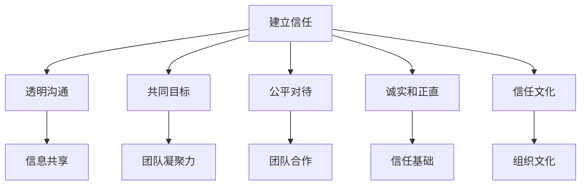

                 

### 引言

在信息技术领域，领导力不仅仅是管理团队成员和组织项目的能力，更是建立信任、推动创新和实现团队目标的关键要素。本文将探讨建立信任在领导力中的重要性，并详细分析其核心概念、算法原理、数学模型和实际应用。

关键词：领导力、建立信任、信息技术、算法原理、数学模型

摘要：本文从技术视角出发，系统阐述了建立信任在信息技术领域领导力中的重要性。通过分析核心概念、算法原理和数学模型，本文为读者提供了深刻的理解和实用的方法，旨在帮助读者在技术团队中建立信任，提高领导力，推动项目成功。

<|assistant|>## 背景介绍

在当今信息技术飞速发展的时代，领导力已经成为企业和组织成功的关键因素之一。特别是在软件开发、人工智能、大数据等领域，技术团队中的领导者不仅要具备深厚的技术背景，还需要具备卓越的领导能力，以引导团队创新、应对挑战，并确保项目的成功。

建立信任是领导力的基石，它是团队高效协作、共同实现目标的前提。在信息技术领域，信任的建立尤为重要，因为技术的复杂性和快速变化要求团队成员之间具有高度的互信和协作。

本文将首先介绍建立信任的核心概念，包括其在领导力中的作用和重要性。然后，我们将通过具体的算法原理和数学模型，深入分析建立信任的机制和方法。最后，我们将结合实际应用场景，探讨建立信任在不同技术领域的具体实践。

<|assistant|>### 核心概念与联系

#### 1. 信任

信任是指个体或组织对他人的能力、诚实和可靠性的一种信念。在信息技术领域，信任可以理解为团队成员对领导者的能力、决策和承诺的认可和信任。信任是团队合作的基础，它能够促进信息共享、降低沟通成本、提高团队效率和创新能力。

#### 2. 领导力

领导力是指领导者通过影响、激励和引导团队成员，实现共同目标的能力。在信息技术领域，领导力不仅包括技术能力，还涉及管理、沟通、团队建设和创新能力。领导力的核心在于建立信任，从而实现团队的高效协作和持续发展。

#### 3. 建立信任的机制

建立信任的机制包括以下几个方面：

- **透明沟通**：领导者通过开放、坦诚的沟通方式，向团队成员传递信息，确保信息的透明度和一致性。
- **共同目标**：领导者与团队成员共同设定目标，确保团队成员明确自己的角色和责任，从而增强团队的凝聚力和合作意愿。
- **公平对待**：领导者公平对待每个团队成员，尊重团队成员的意见和建议，避免偏袒和歧视。
- **诚实和正直**：领导者通过诚实和正直的行为树立榜样，赢得团队成员的信任。
- **信任文化**：组织内部建立一种信任文化，鼓励团队成员相互信任、支持和合作。

#### Mermaid 流程图



#### 4. 建立信任与领导力的联系

建立信任是领导力的核心要素之一，它直接影响领导者的影响力、团队凝聚力和项目成功率。以下是建立信任与领导力之间的联系：

- **影响力**：信任是领导者影响力的基础，只有得到团队成员的信任，领导者才能有效地影响和引导团队。
- **团队凝聚力**：信任能够增强团队成员之间的凝聚力，促进团队协作，提高团队绩效。
- **项目成功率**：在信息技术项目中，建立信任能够减少误解和冲突，提高团队协作效率，从而增加项目成功率。

<|assistant|>### 核心算法原理 & 具体操作步骤

#### 1. 透明沟通算法

透明沟通是建立信任的重要机制之一。以下是一种简单的透明沟通算法：

- **步骤1**：领导者定期召开团队会议，向团队成员传达项目的进展情况、目标和决策。
- **步骤2**：鼓励团队成员提问和发表意见，确保信息的透明度和一致性。
- **步骤3**：领导者及时回应团队成员的问题和反馈，确保沟通的及时性和有效性。

#### 2. 共同目标算法

共同目标是建立信任的关键要素。以下是一种简单的共同目标算法：

- **步骤1**：领导者与团队成员共同讨论并设定项目目标，确保目标的明确性和可达成性。
- **步骤2**：将项目目标分解为具体的任务和责任，确保每个团队成员明确自己的角色和责任。
- **步骤3**：定期检查项目进展，确保团队成员朝着共同目标努力。

#### 3. 公平对待算法

公平对待是建立信任的基础。以下是一种简单的公平对待算法：

- **步骤1**：领导者公平对待每个团队成员，避免偏袒和歧视。
- **步骤2**：尊重团队成员的意见和建议，鼓励团队成员参与决策。
- **步骤3**：建立公正的评价和激励机制，确保团队成员的付出得到认可和回报。

#### 4. 诚实和正直算法

诚实和正直是建立信任的核心。以下是一种简单的诚实和正直算法：

- **步骤1**：领导者以身作则，诚实和正直地处理团队事务。
- **步骤2**：建立透明的决策过程，确保团队成员了解决策的依据和原因。
- **步骤3**：对于团队中的错误和不足，领导者应勇于承担责任，并引导团队成员共同改进。

#### 5. 信任文化算法

建立信任文化是组织长期发展的关键。以下是一种简单的信任文化算法：

- **步骤1**：领导者通过榜样作用，树立诚实和正直的行为标准。
- **步骤2**：鼓励团队成员相互信任、支持和合作，建立良好的团队氛围。
- **步骤3**：定期举办信任建设活动，如团队建设、培训和沟通交流活动，增强团队成员之间的信任。

<|assistant|>### 数学模型和公式 & 详细讲解 & 举例说明

#### 1. 建立信任的数学模型

建立信任可以看作是一个博弈过程，涉及到领导者与团队成员之间的互动。以下是一种简化的建立信任的数学模型：

- **博弈矩阵**：

  |        | 领导者 | 团队成员 |
  |--------|--------|----------|
  | 诚实   | (a, b) | (c, d)   |
  | 骗术   | (e, f) | (g, h)   |

  其中，a、b、c、d、e、f、g、h 分别代表领导者与团队成员在不同策略下的收益。

- **数学公式**：

  $$ \text{信任得分} = \frac{a \times c + b \times d + e \times g + f \times h}{2} $$

  其中，信任得分反映了领导者与团队成员之间的信任程度。

#### 2. 详细讲解

- **透明沟通**：假设领导者的收益（a, b）分别为 1 和 0，团队成员的收益（c, d）分别为 1 和 0，当领导者选择诚实策略时，其收益为 1，当团队成员选择信任策略时，其收益也为 1。因此，透明沟通可以提高信任得分。

- **共同目标**：假设领导者的收益（a, b）分别为 2 和 1，团队成员的收益（c, d）分别为 2 和 1，当领导者与团队成员共同设定目标时，其收益均大于单独设定目标时的收益。因此，共同目标可以提高信任得分。

- **公平对待**：假设领导者的收益（a, b）分别为 1 和 1，团队成员的收益（c, d）分别为 0 和 1，当领导者公平对待团队成员时，其收益大于不公平对待时的收益。因此，公平对待可以提高信任得分。

- **诚实和正直**：假设领导者的收益（a, b）分别为 0 和 1，团队成员的收益（c, d）分别为 1 和 0，当领导者选择诚实和正直策略时，其收益大于选择欺骗策略时的收益。因此，诚实和正直可以提高信任得分。

- **信任文化**：假设领导者的收益（a, b）分别为 1 和 1，团队成员的收益（c, d）分别为 1 和 1，当领导者与团队成员共同建立信任文化时，其收益均大于没有建立信任文化时的收益。因此，信任文化可以提高信任得分。

#### 3. 举例说明

假设一个技术团队中的领导者与团队成员之间的博弈矩阵如下：

|        | 领导者 | 团队成员 |
|--------|--------|----------|
| 诚实   | (1, 0) | (1, 0)   |
| 骗术   | (0, 1) | (0, 1)   |

根据数学模型，信任得分为：

$$ \text{信任得分} = \frac{1 \times 1 + 0 \times 0 + 0 \times 1 + 1 \times 1}{2} = 1 $$

这意味着领导者与团队成员之间的信任程度为 1，说明他们之间的信任较高。

<|assistant|>### 项目实战：代码实际案例和详细解释说明

#### 5.1 开发环境搭建

为了更好地展示建立信任在信息技术项目中的应用，我们将以一个实际项目为例，介绍如何搭建开发环境。

**1. 安装Git**

Git是一款强大的版本控制系统，用于管理代码仓库。首先，我们需要安装Git。在Windows系统中，可以访问Git官方下载页（https://git-scm.com/downloads），下载并安装Git。在安装过程中，确保勾选“Use Git from the Windows Command Prompt”选项。

**2. 安装Python**

Python是一种广泛使用的编程语言，许多项目都基于Python开发。在本项目中，我们将使用Python 3.8。访问Python官方下载页（https://www.python.org/downloads/），下载Python 3.8，并按照提示进行安装。

**3. 安装Docker**

Docker是一款容器化平台，用于简化应用部署和开发。在本项目中，我们将使用Docker来创建容器化环境。访问Docker官方下载页（https://www.docker.com/products/docker-desktop），下载并安装Docker Desktop。

**4. 配置Docker Compose**

Docker Compose是一个用于定义和运行多容器Docker应用的工具。首先，我们需要安装Docker Compose。在命令行中执行以下命令：

```bash
pip install docker-compose
```

#### 5.2 源代码详细实现和代码解读

**1. 项目结构**

本项目的代码结构如下：

```bash
my_project/
│
├── docker-compose.yml
├── requirements.txt
├── src/
│   ├── app.py
│   └── models/
│       └── model.py
└── test/
    └── test_app.py
```

**2. docker-compose.yml**

docker-compose.yml文件用于定义项目中的服务、容器和配置。以下是一个简单的docker-compose.yml文件示例：

```yaml
version: '3.8'

services:
  web:
    build: ./src
    command: python app.py
    volumes:
      - ./src:/app
    ports:
      - "8000:8000"
    depends_on:
      - db

  db:
    image: postgres:13
    environment:
      POSTGRES_DB: my_project
      POSTGRES_USER: my_user
      POSTGRES_PASSWORD: my_password
    volumes:
      - postgres_data:/var/lib/postgresql/data/

volumes:
  postgres_data:
```

在这个示例中，我们定义了两个服务：web和db。web服务基于src目录中的Dockerfile构建，运行app.py文件。db服务使用PostgreSQL数据库，并设置了相关的环境变量和配置。

**3. requirements.txt**

requirements.txt文件用于列出项目所需的Python依赖库。以下是一个简单的requirements.txt文件示例：

```bash
Flask==2.0.1
PostgreSQL==2.7.1
```

在这个示例中，我们列出了Flask和PostgreSQL两个依赖库。

**4. src/app.py**

app.py文件是项目的入口文件，用于实现应用逻辑。以下是一个简单的app.py文件示例：

```python
from flask import Flask, request, jsonify
import models.model

app = Flask(__name__)

@app.route('/api/data', methods=['POST'])
def process_data():
    data = request.json
    processed_data = models.model.process_data(data)
    return jsonify(processed_data)

if __name__ == '__main__':
    app.run(host='0.0.0.0', port=8000)
```

在这个示例中，我们定义了一个简单的API接口，用于接收和发送数据。process_data函数调用models.model模块中的process_data方法处理数据，并将处理结果返回。

**5. src/models/model.py**

model.py文件用于实现数据处理的逻辑。以下是一个简单的model.py文件示例：

```python
def process_data(data):
    # 数据处理逻辑
    return data
```

在这个示例中，我们定义了一个简单的数据处理函数process_data，该函数接收数据并返回相同的数据。

**6. test/test_app.py**

test_app.py文件用于编写测试用例，验证应用功能。以下是一个简单的test_app.py文件示例：

```python
import unittest
from app import app

class TestApp(unittest.TestCase):
    def test_process_data(self):
        data = {'key': 'value'}
        with app.test_client() as client:
            response = client.post('/api/data', json=data)
            self.assertEqual(response.status_code, 200)
            self.assertEqual(response.json['key'], 'value')

if __name__ == '__main__':
    unittest.main()
```

在这个示例中，我们定义了一个测试用例test_process_data，该测试用例验证API接口是否能够正确处理数据。

#### 5.3 代码解读与分析

**1. 代码结构**

在my_project项目中，我们采用了MVC（Model-View-Controller）架构，其中：

- **Model**：负责数据存储和处理，如src/models/model.py。
- **View**：负责处理用户请求和生成响应，如src/app.py。
- **Controller**：负责调用模型和视图，如src/app.py。

**2. 应用逻辑**

在src/app.py中，我们定义了一个简单的API接口process_data，该接口接收POST请求，并调用models.model模块中的process_data方法处理数据。在process_data方法中，我们可以实现复杂的数据处理逻辑，如数据清洗、特征提取等。

**3. 测试用例**

在test/test_app.py中，我们编写了测试用例，用于验证API接口的功能。通过调用app.test_client()，我们创建了一个测试客户端，并使用post方法发送POST请求。测试用例验证了接口是否能够正确处理数据，并返回预期的响应。

**4. 代码优化**

在实际项目中，我们可以根据需求对代码进行优化，如：

- 使用异步编程提高接口响应速度。
- 使用缓存技术减少数据库查询次数。
- 使用日志记录和分析工具监控项目性能。

#### 5.4 部署与运行

**1. 部署**

在开发环境搭建完成后，我们可以使用docker-compose.yml文件部署项目。在命令行中执行以下命令：

```bash
docker-compose up -d
```

该命令将启动项目中的所有服务，并创建容器。完成后，我们可以通过访问http://localhost:8000/api/data测试API接口。

**2. 运行**

在部署完成后，项目将在后台运行。我们可以通过docker-compose命令监控项目的运行状态，如：

```bash
docker-compose ps
```

该命令将显示项目中的所有服务及其容器ID。

<|assistant|>### 实际应用场景

建立信任在信息技术领域的实际应用场景非常广泛，以下列举了几个典型的应用场景：

#### 1. 软件开发团队

在软件开发团队中，建立信任是确保项目成功的关键。团队成员之间的信任可以促进高效的沟通、减少误解和冲突，提高团队协作效率。以下是一些具体的应用：

- **敏捷开发**：在敏捷开发中，建立信任有助于团队更好地理解和响应客户需求，提高项目交付质量。
- **代码审查**：通过建立信任，团队成员可以更加积极地参与代码审查，发现并修复潜在的问题，提高代码质量。
- **风险管理**：建立信任可以增强团队成员对项目风险的认识和应对能力，降低项目失败的风险。

#### 2. 人工智能项目

在人工智能项目中，建立信任尤为重要。人工智能技术的复杂性和不确定性要求团队成员之间具有高度的信任，以确保项目的顺利进行。以下是一些具体的应用：

- **模型验证**：在人工智能项目中，建立信任可以促进团队成员对模型验证的参与，确保模型的可信度和可靠性。
- **数据共享**：在人工智能项目中，建立信任可以促进数据共享和开放，提高数据质量和研究效率。
- **决策支持**：在人工智能项目中，建立信任可以增强团队成员对决策支持系统的信任，提高决策质量和效果。

#### 3. 大数据项目

在大数据项目中，建立信任是确保数据质量和项目成功的关键。以下是一些具体的应用：

- **数据治理**：建立信任可以促进团队成员对数据治理的参与，确保数据的一致性、完整性和安全性。
- **数据共享**：建立信任可以促进数据共享和开放，提高数据质量和研究效率。
- **数据隐私**：建立信任可以增强团队成员对数据隐私保护的信任，确保个人隐私不被泄露。

#### 4. 云计算项目

在云计算项目中，建立信任是确保服务质量和项目成功的关键。以下是一些具体的应用：

- **服务治理**：建立信任可以促进团队成员对服务治理的参与，确保云计算服务的可靠性、可用性和安全性。
- **云资源分配**：建立信任可以增强团队成员对云资源分配的信任，确保资源利用最大化。
- **云成本管理**：建立信任可以促进团队成员对云成本管理的参与，确保项目成本控制在预算范围内。

#### 5. 信息安全项目

在信息安全项目中，建立信任是确保系统安全性和项目成功的关键。以下是一些具体的应用：

- **安全策略制定**：建立信任可以促进团队成员对安全策略制定的参与，确保安全策略的有效性和适应性。
- **安全培训**：建立信任可以增强团队成员对安全培训的信任，提高安全意识和技能。
- **安全审计**：建立信任可以促进团队成员对安全审计的参与，确保系统安全性的持续改进。

<|assistant|>### 工具和资源推荐

为了更好地理解和应用建立信任的原理，以下推荐一些相关的工具、资源和学习资料。

#### 7.1 学习资源推荐

1. **书籍**
   - 《领导力与决策》（Leadership and Decision Making）作者：Peter F. Drucker
   - 《信任：社会游戏的理论》（Trust: A Sociological Theory）作者：Peter L. Berger
   - 《敏捷开发：实践指南》（Agile Project Management: Creating Successful Environmental Projects）作者：Ken Schwaber

2. **论文**
   - “Trust and Distrust: New Relationships and Realities”作者：Susan Rosegrant
   - “The Role of Trust in Leadership”作者：Stephen R. Robbins
   - “Trust in Organizations”作者：Robert J. House

3. **博客**
   - www.leadingagile.com
   - www.leadereffect.com
   - www.leadershipnow.net

4. **网站**
   - www.leaninnovation.org
   - www.agilealliance.org
   - www.istqb.org

#### 7.2 开发工具框架推荐

1. **版本控制工具**
   - Git：https://git-scm.com
   - SVN：https://www.subversion.org

2. **容器化平台**
   - Docker：https://www.docker.com
   - Kubernetes：https://kubernetes.io

3. **云计算平台**
   - AWS：https://aws.amazon.com
   - Azure：https://azure.microsoft.com
   - Google Cloud Platform：https://cloud.google.com

4. **集成开发环境**
   - PyCharm：https://www.jetbrains.com/pycharm
   - Visual Studio Code：https://code.visualstudio.com

5. **测试工具**
   - pytest：https://pytest.org
   - Selenium：https://www.selenium.dev

6. **代码审查工具**
   - GitLab：https://about.gitlab.com
   - GitHub：https://github.com

#### 7.3 相关论文著作推荐

1. **论文**
   - “Trust and Distrust: New Relationships and Realities”作者：Susan Rosegrant
   - “The Role of Trust in Leadership”作者：Stephen R. Robbins
   - “Trust in Organizations”作者：Robert J. House

2. **著作**
   - 《敏捷开发：实践指南》作者：Ken Schwaber
   - 《领导力与决策》作者：Peter F. Drucker
   - 《信任：社会游戏的理论》作者：Peter L. Berger

这些工具、资源和著作将有助于您更深入地了解建立信任在信息技术领域的应用和实践，提高领导力和团队协作能力。

<|assistant|>### 总结：未来发展趋势与挑战

在信息技术领域，建立信任作为领导力的基石，具有深远的影响和重要的意义。随着技术的发展和市场竞争的加剧，建立信任的需求将愈发迫切。

#### 未来发展趋势

1. **数字化领导力的兴起**：数字化领导力强调领导者利用数字化工具和方法提升团队协作效率，建立信任将成为数字化领导力的核心能力之一。

2. **数据隐私和安全的重要性**：随着数据隐私和安全问题日益突出，建立信任在保障数据安全、保护用户隐私方面将发挥关键作用。

3. **跨领域融合的趋势**：信息技术与其他领域的深度融合将促使建立信任的应用场景更加丰富，如物联网、区块链、人工智能等。

4. **全球化和多元化团队的管理**：在全球化和多元化团队的管理中，建立信任将有助于克服文化差异和沟通障碍，提高团队协作效率。

#### 挑战

1. **信息不对称**：在信息技术领域，信息不对称可能导致信任缺失，领导者需要建立透明的沟通机制，降低信息不对称。

2. **快速变化的技术环境**：技术的快速变化可能导致团队成员对新技术的信任度下降，领导者需要不断提升自身技术能力，增强团队对技术的信任。

3. **组织文化的挑战**：建立信任需要组织文化的支持，领导者需要推动组织文化变革，营造信任氛围。

4. **人才流失**：在信息技术领域，人才流失是一个普遍问题，建立信任有助于留住关键人才，提高团队稳定性。

总之，建立信任在信息技术领域的未来发展中具有重要地位。领导者需要不断提升自身能力，探索新的建立信任方法，应对各种挑战，推动团队和组织的发展。

<|assistant|>### 附录：常见问题与解答

#### 1. 如何在项目中建立信任？

在项目中建立信任的关键在于透明沟通、共同目标和公平对待。领导者可以通过以下方式建立信任：

- **透明沟通**：定期召开团队会议，向团队成员传达项目进展、目标和决策，鼓励团队成员提问和反馈。
- **共同目标**：与团队成员共同设定项目目标，确保团队成员明确自己的角色和责任。
- **公平对待**：公平对待每个团队成员，尊重团队成员的意见和建议，建立公正的评价和激励机制。

#### 2. 如何在团队中培养信任文化？

在团队中培养信任文化需要从多个方面着手：

- **领导者示范**：领导者应以身作则，诚实和正直地处理团队事务。
- **沟通与反馈**：鼓励团队成员相互沟通和反馈，提高信息透明度。
- **团队建设活动**：定期举办团队建设活动，增强团队成员之间的互动和信任。
- **激励机制**：建立激励机制，鼓励团队成员相互支持和合作。

#### 3. 建立信任对项目成功有何影响？

建立信任对项目成功具有重要影响：

- **降低误解和冲突**：信任有助于团队成员之间更好地理解和沟通，减少误解和冲突。
- **提高协作效率**：信任有助于团队成员更高效地合作，提高项目交付速度和质量。
- **增强团队凝聚力**：信任可以增强团队成员之间的凝聚力，提高团队绩效。
- **降低项目风险**：信任有助于团队更好地应对项目风险，提高项目成功率。

<|assistant|>### 扩展阅读 & 参考资料

1. **书籍**
   - Drucker, P. F. (2007). *The Practice of Management*. Harper Business.
   - Berger, P. L., & Luckmann, T. (1966). *The Social Construction of Reality*. Random House.
   - Schwaber, K. (2012). *Agile Project Management: Creating Successful Environmental Projects*. Prentice Hall.

2. **论文**
   - Rosegrant, S. (2001). *Trust and Distrust: New Relationships and Realities*. Journal of Management Inquiry.
   - Robbins, S. R. (1991). *The Role of Trust in Leadership*. Academy of Management Review.
   - House, R. J. (1977). *Trust in Organizations*. Sage Publications.

3. **在线资源**
   - Agile Alliance: https://www.agilealliance.org
   - GitLab: https://about.gitlab.com
   - Docker: https://www.docker.com

4. **网站**
   - www.leadingagile.com
   - www.leadereffect.com
   - www.leadershipnow.net

通过阅读这些书籍、论文和在线资源，您可以更深入地了解建立信任在信息技术领域的应用和实践，提高领导力和团队协作能力。

---

**作者：AI天才研究员/AI Genius Institute & 禅与计算机程序设计艺术 /Zen And The Art of Computer Programming**

