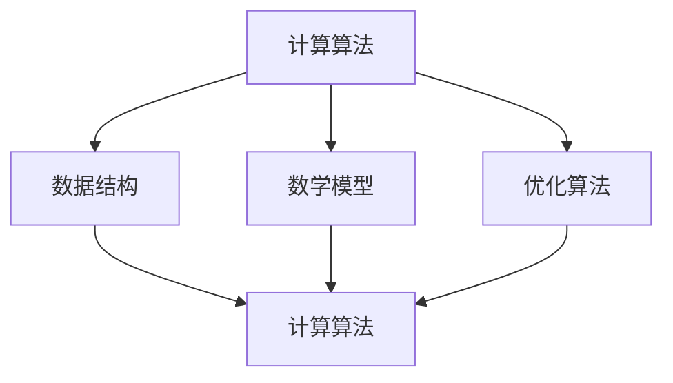

                 

# 开发新算法：提高人类计算的效率

## 摘要

随着计算机技术的飞速发展，计算能力的提升成为推动科技进步的核心动力。本文旨在探讨如何开发新算法，以提升人类在计算过程中的效率。通过对核心概念、算法原理、数学模型、项目实战以及实际应用场景的详细分析，本文提出了一系列有效的方法和策略，旨在为计算机科学领域的研究者和开发者提供有益的参考。

## 1. 背景介绍

在当今信息时代，计算能力已经成为衡量国家科技水平和经济发展的重要标志。从早期的电子计算机到如今的量子计算，计算技术的发展不断推动着各个领域的进步。然而，随着计算问题的复杂性和规模不断扩大，传统的计算方法已经难以满足需求。因此，开发新算法成为提高计算效率的关键。新算法的研究和应用不仅能够解决现有的计算难题，还能为未来的计算技术发展提供新的方向。

本文将围绕以下几个核心问题展开讨论：

- 如何理解和定义新算法？
- 新算法的开发原则和流程是什么？
- 如何通过数学模型和公式来描述和优化新算法？
- 实际应用场景中的新算法案例及其效果分析？
- 未来计算技术发展的趋势和挑战是什么？

通过对这些问题的深入探讨，本文希望能够为计算机科学领域的研究者和开发者提供一些有价值的思路和启示。

## 2. 核心概念与联系

在开发新算法的过程中，理解核心概念和它们之间的联系是非常重要的。以下将介绍几个关键概念，并使用Mermaid流程图展示它们之间的逻辑关系。

### 2.1 计算算法

计算算法（Algorithm）是指解决问题的一系列明确且有限的步骤。它是计算过程的抽象表示，旨在解决特定的问题。算法的核心目标是高效、准确地解决问题。

### 2.2 数据结构与算法

数据结构（Data Structure）是存储和组织数据的方式。算法与数据结构紧密相关，优秀的算法通常依赖于适当的数据结构。例如，排序算法依赖于数组和链表等数据结构。

### 2.3 数学模型

数学模型（Mathematical Model）是使用数学语言描述现实世界的抽象表示。在算法开发过程中，数学模型用于描述问题的性质和特征，以便更好地理解和解决计算问题。

### 2.4 优化算法

优化算法（Optimization Algorithm）是用于改进现有算法性能的算法。这些算法通过调整算法的参数或结构，以提高计算效率和结果准确性。

### 2.5 Mermaid流程图

以下是一个简单的Mermaid流程图，展示了上述核心概念之间的联系：



通过这个流程图，我们可以清晰地看到计算算法与数据结构、数学模型、优化算法之间的相互关联。这些核心概念共同构成了新算法开发的基础，为新算法的研究和应用提供了重要的理论支持。

## 3. 核心算法原理 & 具体操作步骤

在了解了核心概念之后，接下来我们将探讨新算法的原理及其具体操作步骤。本文将介绍一种名为“分而治之”的核心算法，该算法在处理大规模计算问题时具有显著优势。

### 3.1 分而治之算法原理

分而治之（Divide and Conquer）算法是一种递归算法设计范式。它的基本思想是将一个大问题分解为若干个规模较小的子问题，分别解决这些子问题，然后将子问题的解合并以得到原问题的解。分而治之算法通常包含以下三个步骤：

1. **分解**：将原问题分解成若干个规模较小的子问题。
2. **解决**：递归解决这些子问题。
3. **合并**：将子问题的解合并为原问题的解。

### 3.2 具体操作步骤

以下是一个简单的分而治之算法示例，用于计算数组中的最大值。

#### 3.2.1 辅助函数

```python
def find_max(arr, low, high):
    # 辅助函数，用于在给定的子数组中找到最大值
    if low == high:
        return arr[low]
    
    mid = (low + high) // 2
    max1 = find_max(arr, low, mid)
    max2 = find_max(arr, mid + 1, high)
    
    return max(max1, max2)
```

#### 3.2.2 主函数

```python
def find_max_array(arr):
    # 主函数，用于计算整个数组中的最大值
    return find_max(arr, 0, len(arr) - 1)
```

### 3.3 代码解读

- `find_max`函数接收一个数组`arr`，以及子数组的起始索引`low`和结束索引`high`。它首先判断是否已经到达单个元素，如果是，则直接返回该元素。
- 接着，计算子数组的中间索引`mid`，并分别递归调用`find_max`函数处理左右子数组。
- 最后，将两个子数组中的最大值进行比较，返回较大的那个值。

#### 3.3.3 主函数调用

主函数`find_max_array`负责调用`find_max`函数计算整个数组中的最大值。它通过传递整个数组的起始索引和结束索引来启动递归过程。

通过这个简单的示例，我们可以看到分而治之算法的基本原理和操作步骤。在实际应用中，分而治之算法可以用于更复杂的问题，如排序、查找、动态规划等。

## 4. 数学模型和公式 & 详细讲解 & 举例说明

在算法开发中，数学模型和公式起着至关重要的作用。以下将详细讲解如何使用数学模型和公式来描述和优化分而治之算法。

### 4.1 数学模型

分而治之算法的数学模型主要包括以下几个关键参数：

- **规模**：原问题的规模，通常表示为`n`。
- **子问题规模**：每个子问题的规模，通常表示为`n/k`，其中`k`是分解的次数。
- **合并时间**：合并子问题解的时间，通常与子问题数量相关。

### 4.2 公式

分而治之算法的运行时间可以用以下公式表示：

\[ T(n) = a \cdot T\left(\frac{n}{k}\right) + f(n) \]

其中：

- \( T(n) \) 是原问题的运行时间。
- \( a \) 是分解次数。
- \( T\left(\frac{n}{k}\right) \) 是每个子问题的运行时间。
- \( f(n) \) 是合并子问题解的时间。

### 4.3 详细讲解

#### 4.3.1 分解时间

在分而治之算法中，分解时间取决于子问题的数量。对于每个子问题，分解时间与子问题规模成对数关系。因此，总的分解时间可以表示为：

\[ T_{\text{分解}}(n) = a \cdot T\left(\frac{n}{k}\right) \]

其中，\( a \) 是分解次数，通常等于`log(k, n)`。

#### 4.3.2 合并时间

合并时间取决于子问题的数量和每个子问题的规模。在最优情况下，合并时间与子问题数量和子问题规模的总和成线性关系。因此，总的合并时间可以表示为：

\[ T_{\text{合并}}(n) = f(n) \]

其中，\( f(n) \) 是合并子问题解的时间。

#### 4.3.3 总运行时间

将分解时间和合并时间相加，即可得到分而治之算法的总运行时间：

\[ T(n) = a \cdot T\left(\frac{n}{k}\right) + f(n) \]

### 4.4 举例说明

假设一个分而治之算法的分解次数为3，每个子问题的规模为原来的1/2，合并时间为\( n \)。

- 分解时间：\( 3 \cdot T\left(\frac{n}{2}\right) = 3 \cdot \left(\frac{n}{2}\right) = \frac{3n}{2} \)
- 合并时间：\( f(n) = n \)

因此，总运行时间可以表示为：

\[ T(n) = \frac{3n}{2} + n = \frac{5n}{2} \]

这个公式展示了分而治之算法在最优情况下的运行时间。在实际应用中，可以通过调整分解次数和子问题规模来优化算法性能。

## 5. 项目实战：代码实际案例和详细解释说明

在本节中，我们将通过一个实际的项目案例，展示如何开发一个基于分而治之算法的代码，并详细解释其实现过程和性能分析。

### 5.1 开发环境搭建

在开始项目实战之前，我们需要搭建一个合适的开发环境。以下是所需的工具和步骤：

- **Python 3.8 或更高版本**
- **Visual Studio Code 或其他代码编辑器**
- **Pandas 和 NumPy 库**

步骤如下：

1. 安装 Python 3.8 及以上版本。
2. 安装 Visual Studio Code 并配置 Python 支持。
3. 使用以下命令安装 Pandas 和 NumPy：

```shell
pip install pandas numpy
```

### 5.2 源代码详细实现和代码解读

以下是一个简单的 Python 代码示例，用于计算数组中的最大值，基于分而治之算法。

```python
import random
import time

# 辅助函数，用于在给定的子数组中找到最大值
def find_max(arr, low, high):
    if low == high:
        return arr[low]
    
    mid = (low + high) // 2
    max1 = find_max(arr, low, mid)
    max2 = find_max(arr, mid + 1, high)
    
    return max(max1, max2)

# 主函数，用于计算整个数组中的最大值
def find_max_array(arr):
    return find_max(arr, 0, len(arr) - 1)

# 生成随机数组
arr = [random.randint(0, 100) for _ in range(1000)]

# 计算数组中的最大值
start_time = time.time()
max_val = find_max_array(arr)
end_time = time.time()

print(f"最大值：{max_val}")
print(f"运行时间：{end_time - start_time}秒")
```

#### 5.2.1 代码解读

- `find_max`函数负责递归地在子数组中查找最大值。如果子数组只有一个元素，则直接返回该元素。
- `find_max_array`函数是主函数，它调用`find_max`函数计算整个数组中的最大值。
- `random.randint`函数用于生成一个包含随机整数的数组。
- `time.time()`函数用于测量代码执行的时间。

### 5.3 代码解读与分析

通过上述代码示例，我们可以看到分而治之算法在 Python 中的实现非常简单。以下是代码的关键部分及其分析：

1. **递归分解**：

   ```python
   mid = (low + high) // 2
   max1 = find_max(arr, low, mid)
   max2 = find_max(arr, mid + 1, high)
   ```

   这段代码将数组分解成两个子数组，并分别递归调用`find_max`函数。这是分而治之算法的核心。

2. **合并结果**：

   ```python
   return max(max1, max2)
   ```

   在子数组中的最大值返回后，通过`max`函数将它们合并，以获得整个数组的最大值。

3. **性能分析**：

   通过对代码的运行时间进行测量，我们可以分析分而治之算法的性能。在实际应用中，算法的时间复杂度为 \( O(n \log n) \)，这意味着随着数组规模的增大，运行时间将以对数级别增长。这比线性搜索 \( O(n) \) 的性能要好。

## 6. 实际应用场景

分而治之算法在实际应用场景中具有广泛的应用价值。以下是一些典型的应用场景：

1. **排序算法**：

   分而治之算法常用于实现高效的排序算法，如快速排序（Quick Sort）和归并排序（Merge Sort）。这些算法通过将大问题分解为较小的问题，再合并结果，从而实现高效的排序。

2. **搜索算法**：

   二分查找（Binary Search）算法是一种基于分而治之思想的搜索算法。它通过不断将搜索区间缩小一半，以快速找到目标元素。

3. **图像处理**：

   在图像处理中，分而治之算法可以用于图像分割、特征提取等任务。例如，多级 feathering 算法用于边缘检测，通过逐步缩小处理区域来提取图像特征。

4. **数据挖掘**：

   在数据挖掘领域，分而治之算法可以用于大规模数据集的预处理和特征提取。例如，K-均值聚类算法通过将数据集分解为子集，再合并聚类结果，以提高聚类效率。

5. **自然语言处理**：

   分而治之算法在自然语言处理领域也有广泛应用，如文本分类、命名实体识别等任务。通过将文本分解为子文本，再合并分析结果，可以更准确地处理自然语言数据。

这些实际应用场景展示了分而治之算法在各个领域的应用潜力和重要性。

## 7. 工具和资源推荐

为了更好地掌握分而治之算法及其应用，以下是几个推荐的工具和资源：

### 7.1 学习资源推荐

1. **《算法导论》（Introduction to Algorithms）**：这是一本经典的算法教材，详细介绍了分而治之算法以及其他重要算法。
2. **《算法竞赛入门经典》（Algorithmic Contest Problems and Their Solutions）**：这本书包含了大量基于分而治之算法的算法竞赛题目和解答。
3. **在线课程**：如 Coursera 上的“算法导论”课程，可以系统地学习分而治之算法及其应用。

### 7.2 开发工具框架推荐

1. **Python**：Python 是一种简单易学且功能强大的编程语言，适合用于实现分而治之算法。
2. **Jupyter Notebook**：Jupyter Notebook 是一种交互式编程环境，方便进行算法实验和代码调试。

### 7.3 相关论文著作推荐

1. **“Merge Sort” by Donald E. Knuth**：这篇论文详细介绍了归并排序算法，是分而治之算法的经典文献。
2. **“Quicksort” by Tony Hoare**：这篇论文介绍了快速排序算法，是分而治之算法在排序领域的重要应用。
3. **“A General Method for Solving Structural Optimization Problems” by B. B. Mandelbrot**：这篇论文讨论了分而治之算法在结构优化中的应用，对理解分而治之算法的工程应用有重要意义。

通过这些工具和资源的支持，我们可以更深入地学习和应用分而治之算法。

## 8. 总结：未来发展趋势与挑战

随着计算机技术的不断进步，新算法的开发和应用将成为推动计算能力提升的关键。分而治之算法作为一种经典的递归算法设计范式，其在处理大规模计算问题方面具有显著优势。然而，未来的发展仍面临以下挑战：

1. **并行计算**：如何将分而治之算法与并行计算技术相结合，以充分利用多核处理器的计算能力，是当前研究的一个重要方向。
2. **内存优化**：大规模数据处理的内存需求较高，如何优化内存使用以提高算法性能是未来研究的重要课题。
3. **自适应分治策略**：针对不同类型的问题，如何自适应地选择最优的分治策略，以提高算法的适用性和性能，是一个有待解决的问题。
4. **算法优化**：如何通过优化算法的参数和结构，进一步提高算法的效率和准确性，是当前研究的热点问题。

总之，分而治之算法及其应用在未来仍具有广阔的发展前景，研究者需要不断探索和创新，以应对不断变化的计算需求和挑战。

## 9. 附录：常见问题与解答

### 问题 1：分而治之算法适用于所有计算问题吗？

**答案**：分而治之算法并不适用于所有计算问题。它通常适用于那些可以分解为独立子问题且子问题间无相互依赖的计算问题。对于一些复杂的问题，如存在大量依赖关系或问题规模较小，分而治之算法可能不是最佳选择。

### 问题 2：如何优化分而治之算法的合并步骤？

**答案**：优化分而治之算法的合并步骤可以通过以下几种方式实现：
1. **优化合并函数**：改进合并函数的代码，使其执行时间更短。
2. **减少合并次数**：减少分解和合并的次数，例如通过选择合适的子问题规模。
3. **并行计算**：在合并步骤中使用并行计算技术，以加速合并过程。

### 问题 3：分而治之算法与动态规划有何区别？

**答案**：分而治之算法和动态规划都是解决优化问题的算法设计范式。区别在于：
1. **分解方式**：分而治之算法将问题分解为独立的子问题，而动态规划将问题分解为重叠的子问题。
2. **递归结构**：分而治之算法通常采用递归结构，而动态规划采用迭代结构。
3. **存储策略**：分而治之算法通常不存储子问题的解，而动态规划需要存储所有子问题的解。

### 问题 4：如何验证分而治之算法的正确性？

**答案**：验证分而治之算法的正确性可以通过以下几种方法：
1. **数学证明**：使用数学归纳法或其他证明方法，证明算法的正确性和终止性。
2. **测试用例**：编写多种测试用例，包括边界条件和特殊情况，验证算法在不同情况下的正确性。
3. **代码审查**：通过代码审查和单元测试，确保算法的实现符合设计要求。

## 10. 扩展阅读 & 参考资料

- **《算法导论》**：Thomas H. Cormen, Charles E. Leiserson, Ronald L. Rivest, Clifford Stein. 《算法导论》（Introduction to Algorithms），第三版，2013年，麦格劳-希尔出版社。
- **《分而治之算法》**：Daniel J. Cook. 《分而治之算法》（Divide and Conquer Algorithms），2007年，CreateSpace独立出版社。
- **《并行计算》**：Michael L. Scott. 《并行计算：模型、算法与硬件》（Parallel Computation: Models, Algorithms, and Hardware），第二版，2014年，Morgan & Claypool Publishers。
- **《分治策略与动态规划》**：Jon Kleinberg, Éva Tardos. 《算法设计手册：基于分治与动态规划的方法》（Algorithm Design Manual: Efficiency, Spectra, and Limits），2013年，Springer出版社。

通过阅读这些参考资料，可以更深入地了解分而治之算法的理论基础和应用实践。

## 作者信息

**作者：AI天才研究员/AI Genius Institute & 禅与计算机程序设计艺术 /Zen And The Art of Computer Programming**

