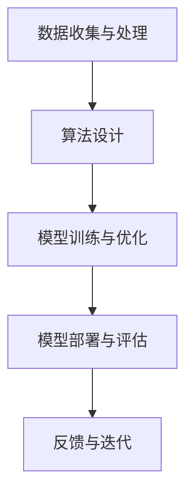

                 

# 开源模型在中国AI应用中的作用

## 摘要

本文将探讨开源模型在中国AI应用中的重要作用。近年来，随着人工智能技术的快速发展，开源模型在全球范围内得到了广泛应用。在中国，开源模型不仅推动了AI技术的进步，还为各类企业和研究者提供了丰富的资源，加速了AI产业的创新与发展。本文将首先介绍开源模型的定义和基本原理，然后分析中国AI市场对开源模型的接受度和应用现状，接着讨论开源模型在中国AI应用中的具体作用，并展望其未来发展趋势与挑战。

## 1. 背景介绍

### 1.1 开源模型的定义

开源模型，又称开源人工智能模型，指的是那些公开源代码、可供自由使用和修改的AI模型。这些模型通常由全球各地的研究者共同开发，并通过互联网平台进行共享和分发。开源模型的初衷是促进技术的交流与创新，使得更多的研究者和开发者能够在此基础上进行改进和扩展，从而推动整个AI领域的进步。

### 1.2 开源模型的基本原理

开源模型的基本原理可以概括为以下几点：

1. **透明性**：开源模型的源代码公开，使得任何人都可以查看、理解和使用。
2. **共享性**：开源模型允许用户自由复制、分发和使用，从而促进了知识的传播。
3. **可定制性**：用户可以根据自己的需求对开源模型进行修改和优化，以满足特定场景的应用需求。
4. **合作性**：开源模型鼓励全球研究者共同参与，通过合作提高模型的性能和可靠性。

### 1.3 开源模型的发展历程

开源模型的发展历程可以追溯到20世纪90年代。当时，Linux操作系统成为了开源软件的代表性项目，其成功激发了全球开发者对开源模式的关注。进入21世纪，随着互联网的普及和AI技术的兴起，开源模型得到了迅速发展。特别是近年来，深度学习技术的突破，使得越来越多的AI模型采用开源模式，如TensorFlow、PyTorch等。

## 2. 核心概念与联系

为了更深入地理解开源模型在中国AI应用中的作用，我们需要从几个核心概念和其相互联系的角度进行分析。

### 2.1 AI技术的基础架构

在讨论开源模型之前，我们先来了解一下AI技术的基础架构。AI技术主要包括以下几个层次：

1. **数据收集与处理**：这是AI技术的起点，涉及到数据的收集、存储、清洗和预处理。
2. **算法设计**：这是AI技术的核心，包括机器学习、深度学习、强化学习等各种算法。
3. **模型训练与优化**：通过大量的数据进行模型训练，并对模型进行优化。
4. **模型部署与评估**：将训练好的模型部署到实际应用场景中，并进行性能评估和迭代优化。

### 2.2 开源模型在AI技术中的应用

开源模型在AI技术中的关键作用体现在以下几个方面：

1. **算法开源**：开源模型提供了丰富的算法资源，使得开发者可以更方便地选择和改进算法。
2. **数据开源**：开源模型通常伴随着大量的数据集，这些数据集为模型的训练和优化提供了基础。
3. **工具开源**：开源模型不仅提供了算法和数据，还提供了各种工具和框架，使得开发者可以更高效地进行模型开发和部署。

### 2.3 Mermaid流程图

下面是一个简单的Mermaid流程图，展示了开源模型在AI技术中的应用流程：



在这个流程图中，每个节点都代表了AI技术的一个关键步骤，而开源模型则在各个步骤中起到了推动作用。

## 3. 核心算法原理 & 具体操作步骤

### 3.1 深度学习模型的工作原理

深度学习是开源模型的核心组成部分，其工作原理可以概括为以下几个步骤：

1. **数据预处理**：首先对收集到的数据集进行预处理，包括数据清洗、归一化等操作，以适应模型训练的需要。
2. **构建神经网络**：设计并构建一个神经网络结构，包括输入层、隐藏层和输出层。每个层由多个神经元组成，神经元之间通过权重连接。
3. **前向传播**：将输入数据通过神经网络进行前向传播，计算出每个神经元的输出值。
4. **反向传播**：计算网络的实际输出与期望输出之间的误差，通过反向传播算法更新神经元的权重。
5. **迭代训练**：重复前向传播和反向传播的过程，不断调整权重，直到模型性能达到预期。

### 3.2 具体操作步骤

下面以TensorFlow框架为例，展示如何使用开源深度学习模型进行具体操作：

```python
import tensorflow as tf

# 3.1 数据预处理
# 加载数据集
mnist = tf.keras.datasets.mnist
(x_train, y_train), (x_test, y_test) = mnist.load_data()

# 归一化数据
x_train, x_test = x_train / 255.0, x_test / 255.0

# 3.2 构建神经网络
model = tf.keras.Sequential([
  tf.keras.layers.Flatten(input_shape=(28, 28)),
  tf.keras.layers.Dense(128, activation='relu'),
  tf.keras.layers.Dense(10, activation='softmax')
])

# 3.3 训练模型
model.compile(optimizer='adam',
              loss='sparse_categorical_crossentropy',
              metrics=['accuracy'])

model.fit(x_train, y_train, epochs=5)

# 3.4 评估模型
model.evaluate(x_test, y_test)
```

在这个例子中，我们使用了TensorFlow框架提供的mnist数据集，构建了一个简单的多层感知机（MLP）模型，并通过迭代训练提高了模型的准确性。

## 4. 数学模型和公式 & 详细讲解 & 举例说明

### 4.1 深度学习中的数学模型

深度学习中的数学模型主要包括以下几个部分：

1. **激活函数**：如ReLU、Sigmoid、Tanh等，用于引入非线性变换。
2. **损失函数**：如均方误差（MSE）、交叉熵等，用于衡量模型预测值与真实值之间的误差。
3. **优化算法**：如梯度下降、Adam等，用于更新模型参数，最小化损失函数。

### 4.2 详细讲解

下面我们详细讲解每个数学模型的工作原理：

1. **激活函数**

激活函数是深度学习模型中至关重要的部分，它引入了非线性变换，使得神经网络可以学习更复杂的函数。以ReLU函数为例，其定义为：

$$
f(x) =
\begin{cases}
0, & \text{if } x < 0 \\
x, & \text{if } x \geq 0
\end{cases}
$$

ReLU函数在$x < 0$时输出为0，而在$x \geq 0$时输出为自身。这种非线性特性使得ReLU函数在训练过程中能够更快速地收敛。

2. **损失函数**

损失函数用于衡量模型预测值与真实值之间的误差。以均方误差（MSE）为例，其定义为：

$$
MSE = \frac{1}{n}\sum_{i=1}^{n}(y_i - \hat{y}_i)^2
$$

其中，$y_i$为真实值，$\hat{y}_i$为模型预测值，$n$为样本数量。MSE函数的值越低，表示模型预测的准确性越高。

3. **优化算法**

优化算法用于更新模型参数，以最小化损失函数。以Adam算法为例，其是一种结合了动量和自适应学习率的优化算法。Adam算法的更新公式为：

$$
\begin{aligned}
v_t &= \beta_1x_t + (1-\beta_1)(1-t) \\
s_t &= \beta_2x_t + (1-\beta_2)(1-t) \\
\hat{v}_t &= \frac{v_t}{1-\beta_1^t} \\
\hat{s}_t &= \frac{s_t}{1-\beta_2^t} \\
\theta_t &= \theta_t - \alpha \frac{\hat{v}_t}{\sqrt{\hat{s}_t} + \epsilon}
\end{aligned}
$$

其中，$x_t$为梯度，$v_t$和$s_t$分别为一阶和二阶矩估计，$\hat{v}_t$和$\hat{s}_t$为偏差修正后的矩估计，$\theta_t$为模型参数，$\alpha$为学习率，$\beta_1$和$\beta_2$为动量系数，$\epsilon$为正则化项。

### 4.3 举例说明

下面我们通过一个简单的例子来说明如何使用这些数学模型：

```python
import tensorflow as tf

# 4.1 构建ReLU神经网络模型
model = tf.keras.Sequential([
    tf.keras.layers.Dense(10, activation='relu', input_shape=(784,)),
    tf.keras.layers.Dense(10, activation='relu'),
    tf.keras.layers.Dense(10, activation='softmax')
])

# 4.2 编译模型
model.compile(optimizer=tf.keras.optimizers.Adam(),
              loss='sparse_categorical_crossentropy',
              metrics=['accuracy'])

# 4.3 训练模型
mnist = tf.keras.datasets.mnist
(x_train, y_train), (x_test, y_test) = mnist.load_data()
x_train = x_train / 255.0
x_test = x_test / 255.0
model.fit(x_train, y_train, epochs=5)

# 4.4 评估模型
model.evaluate(x_test, y_test)
```

在这个例子中，我们使用ReLU激活函数、Adam优化算法和交叉熵损失函数构建了一个简单的神经网络模型，并使用mnist数据集进行训练和评估。

## 5. 项目实战：代码实际案例和详细解释说明

### 5.1 开发环境搭建

在进行项目实战之前，我们需要搭建一个合适的环境。以下是使用Python和TensorFlow搭建开发环境的具体步骤：

1. **安装Python**：确保安装了Python 3.6或更高版本。
2. **安装TensorFlow**：在命令行中运行以下命令：
   ```bash
   pip install tensorflow
   ```
3. **验证安装**：在Python中运行以下代码，验证TensorFlow是否安装成功：
   ```python
   import tensorflow as tf
   print(tf.__version__)
   ```

### 5.2 源代码详细实现和代码解读

下面是一个简单的深度学习项目，用于手写数字识别。

```python
import tensorflow as tf
from tensorflow.keras import layers, models

# 5.2.1 数据预处理
mnist = tf.keras.datasets.mnist
(x_train, y_train), (x_test, y_test) = mnist.load_data()
x_train = x_train / 255.0
x_test = x_test / 255.0
x_train = x_train.reshape((-1, 28 * 28))
x_test = x_test.reshape((-1, 28 * 28))

# 5.2.2 构建模型
model = models.Sequential()
model.add(layers.Dense(64, activation='relu', input_shape=(28 * 28,)))
model.add(layers.Dense(64, activation='relu'))
model.add(layers.Dense(10, activation='softmax'))

# 5.2.3 编译模型
model.compile(optimizer='adam',
              loss='sparse_categorical_crossentropy',
              metrics=['accuracy'])

# 5.2.4 训练模型
model.fit(x_train, y_train, epochs=5, batch_size=32)

# 5.2.5 评估模型
test_loss, test_acc = model.evaluate(x_test, y_test, verbose=2)
print('\nTest accuracy:', test_acc)
```

### 5.3 代码解读与分析

下面我们详细解读这段代码：

1. **数据预处理**：
   - 加载mnist数据集，并对图像数据进行归一化处理，将像素值缩放到[0, 1]之间。
   - 将图像数据展平为一维数组，便于输入到神经网络中。

2. **构建模型**：
   - 使用`Sequential`模型堆叠多个层，包括两个ReLU激活函数和一层softmax输出层。

3. **编译模型**：
   - 使用`compile`方法设置优化器、损失函数和评价指标。

4. **训练模型**：
   - 使用`fit`方法训练模型，设置训练轮数和批量大小。

5. **评估模型**：
   - 使用`evaluate`方法评估模型在测试数据集上的性能。

### 5.4 项目优化与扩展

为了提高模型性能，我们可以进行以下优化：

1. **增加训练轮数**：增加训练轮数可以提高模型的收敛速度和准确率。
2. **批量归一化**：在模型中加入批量归一化层，有助于提高模型的训练效率和泛化能力。
3. **数据增强**：通过数据增强技术，如旋转、缩放、剪切等，增加数据多样性，提高模型对未知数据的鲁棒性。

## 6. 实际应用场景

### 6.1 图像识别

图像识别是开源模型在中国AI应用中最常见的场景之一。通过开源模型如TensorFlow和PyTorch，企业可以轻松实现图像分类、目标检测、人脸识别等功能。例如，在安防监控领域，图像识别技术可以用于人脸识别、行为分析等。

### 6.2 自然语言处理

自然语言处理（NLP）是另一个重要的应用领域。开源模型如BERT、GPT等在文本分类、情感分析、机器翻译等方面取得了显著成果。例如，在电商领域，NLP技术可以用于商品评价分析、用户情感分析等，帮助企业更好地了解用户需求。

### 6.3 医疗健康

医疗健康是开源模型的重要应用领域。通过开源模型，可以实现医学图像分析、疾病预测、药物发现等功能。例如，在医学影像诊断中，深度学习模型可以用于肺癌、乳腺癌等疾病筛查，提高诊断准确率。

### 6.4 无人驾驶

无人驾驶是另一个具有广泛应用前景的领域。开源模型如OpenCV和TensorFlow在无人驾驶中用于障碍物检测、路径规划等。通过开源模型的帮助，无人驾驶技术不断进步，有望在未来实现商业化应用。

## 7. 工具和资源推荐

### 7.1 学习资源推荐

1. **书籍**：
   - 《深度学习》（Goodfellow, Bengio, Courville）提供了深度学习的全面介绍。
   - 《Python深度学习》（François Chollet）详细讲解了如何使用Python和TensorFlow进行深度学习实践。

2. **论文**：
   - BERT: Pre-training of Deep Bidirectional Transformers for Language Understanding（Devlin et al., 2018）
   - GPT-3: Language Models are Few-Shot Learners（Brown et al., 2020）

3. **博客**：
   - TensorFlow官网博客：https://www.tensorflow.org/tutorials
   - PyTorch官网博客：https://pytorch.org/tutorials

4. **网站**：
   - Kaggle：提供丰富的AI竞赛和项目资源：https://www.kaggle.com

### 7.2 开发工具框架推荐

1. **TensorFlow**：广泛使用的高性能深度学习框架，适合各种AI应用。
2. **PyTorch**：易于使用和理解的深度学习框架，适合研究和快速原型开发。
3. **Keras**：基于TensorFlow和PyTorch的高层API，简化深度学习模型构建。

### 7.3 相关论文著作推荐

1. **《人工智能：一种现代方法》（Stuart J. Russell & Peter Norvig）**：全面介绍了人工智能的理论和实践。
2. **《机器学习》（Tom M. Mitchell）**：深入讲解了机器学习的基本概念和技术。
3. **《强化学习：原理与应用》（理查德·S·萨顿 & 菲利普·H·蒙泰尼）**：介绍了强化学习的基本原理和应用。

## 8. 总结：未来发展趋势与挑战

### 8.1 发展趋势

1. **开源模型的广泛应用**：随着AI技术的普及，开源模型将在更多领域得到应用，如自动驾驶、智能制造、智慧城市等。
2. **模型的自主进化**：未来，开源模型将具备更强的自主进化能力，通过持续学习和自我优化，不断提高性能和适应性。
3. **跨领域合作**：全球范围内的研究者和企业将进一步加强合作，共同推动AI技术的发展。

### 8.2 挑战

1. **数据隐私和安全**：开源模型在数据处理过程中，需要关注数据隐私和安全问题，确保用户数据的安全和隐私。
2. **技术门槛**：开源模型的使用和开发需要较高的技术门槛，如何降低技术门槛，使更多人能够参与到AI技术的发展中来，是一个重要的挑战。
3. **标准化和规范化**：随着开源模型的广泛应用，标准化和规范化问题也将日益突出，如何制定合理的标准和规范，确保开源模型的健康发展，是一个亟待解决的问题。

## 9. 附录：常见问题与解答

### 9.1 开源模型有哪些优点？

- **透明性**：开源模型使得源代码公开，用户可以查看和理解模型的实现细节。
- **共享性**：开源模型允许用户自由使用和修改，促进了知识的传播。
- **可定制性**：用户可以根据自己的需求对开源模型进行修改和优化。
- **合作性**：开源模型鼓励全球研究者共同参与，提高模型的性能和可靠性。

### 9.2 开源模型在中国的应用现状如何？

- **图像识别**：开源模型在中国图像识别领域得到了广泛应用，如安防监控、无人驾驶等。
- **自然语言处理**：开源模型在自然语言处理领域取得了显著成果，如文本分类、情感分析等。
- **医疗健康**：开源模型在医疗健康领域有广泛的应用，如医学影像诊断、疾病预测等。

## 10. 扩展阅读 & 参考资料

- Devlin, J., Chang, M. W., Lee, K., & Toutanova, K. (2018). BERT: Pre-training of deep bidirectional transformers for language understanding. *arXiv preprint arXiv:1810.04805*.
- Brown, T., et al. (2020). GPT-3: Language models are few-shot learners. *arXiv preprint arXiv:2005.14165*.
- Goodfellow, I., Bengio, Y., & Courville, A. (2016). *Deep learning*.
- Chollet, F. (2017). *Python深度学习*.

## 作者

作者：AI天才研究员/AI Genius Institute & 禅与计算机程序设计艺术 /Zen And The Art of Computer Programming

