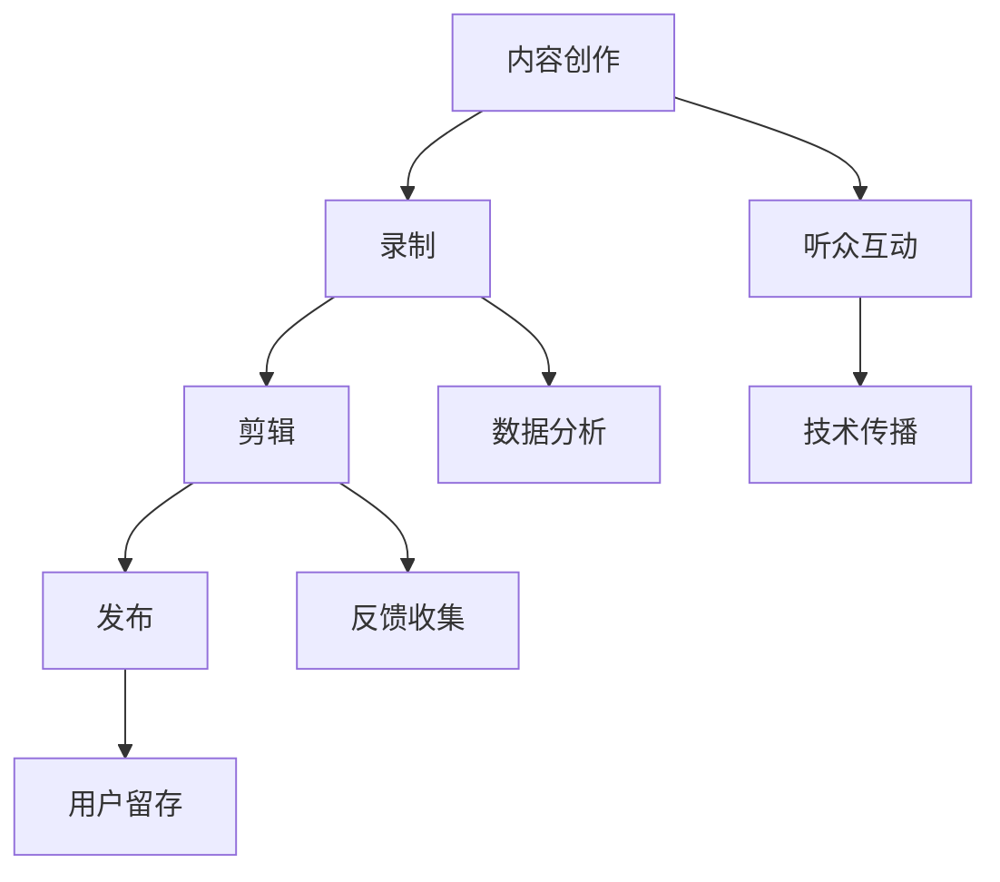

                 

### 背景介绍

#### 播客节目的普及与影响

播客节目（Podcast）作为一种数字音频广播形式，近年来在全球范围内迅速崛起。根据Statista的数据，全球播客用户已经超过4亿，而且这一数字仍在不断增长。播客节目之所以受到如此广泛的关注，主要得益于其灵活的聆听方式和个性化的内容选择。

首先，播客节目为听众提供了一个便捷的音频内容消费平台。无论是在通勤途中、运动时，还是在日常生活中等待的场景，听众都可以随时随地通过智能手机或其他播放设备收听他们感兴趣的内容。此外，播客节目通常具有高度定制化的特点，用户可以根据个人喜好选择不同类型的节目，例如技术讲座、行业新闻、个人故事等。

其次，播客节目在内容生产方面具有低门槛和高灵活性。任何人都可以使用简单的录音设备录制自己的声音，并通过播客平台发布内容。这使得许多非专业人士也能够参与到内容创作中来，从而丰富了播客生态系统的多样性。

最后，播客节目在传播和影响方面具有显著优势。相比于其他媒体形式，播客节目更容易建立与听众的深度互动。通过评论、社交媒体分享和直接与主持人的交流，听众可以更直接地参与到节目的生产和讨论中，从而增强节目的黏性和影响力。

#### 技术与知识的传播

在IT领域，播客节目已经成为一种重要的知识传播方式。一方面，播客节目为专业人士提供了一个分享技术和经验的平台。许多技术专家、研究人员和软件开发者通过播客节目，向听众介绍最新的技术动态、解决方案和实践经验。这种形式不仅有助于传播知识，还能促进技术和思想的交流，激发创新思维。

另一方面，播客节目也为新手和初学者提供了宝贵的学习资源。通过收听资深专家的讲解，听众可以快速掌握关键知识点和实用技巧，从而提升自己的技术水平。此外，播客节目还能够帮助听众建立专业网络，了解行业趋势和最佳实践。

#### 当前播客节目在IT领域的现状

目前，IT领域的播客节目涵盖了广泛的主题，包括编程语言、软件架构、人工智能、网络安全等。许多知名的技术博客、媒体平台和科技公司都推出了自己的播客节目，吸引了大量听众。例如，CodeNewbie、Software Engineering Daily、The Changelog等播客节目在技术社区中具有很高的知名度和影响力。

然而，尽管播客节目在IT领域得到了广泛的认可和应用，但仍存在一些挑战。首先，节目质量参差不齐，一些节目内容缺乏深度和系统性。其次，听众的忠诚度和参与度有待提高，许多节目在用户留存方面面临挑战。最后，播客节目在商业化方面也存在一定的难度，许多节目依赖于广告收入，这可能导致内容质量受到影响。

#### 本文的目标

本文的目标是探讨如何在IT领域开设一档高质量的播客节目，以声音传播技术和知识。我们将从以下几个方面进行详细讨论：

1. 核心概念与联系：介绍播客节目的基本概念、技术与知识传播的关系，并给出相关的Mermaid流程图。
2. 核心算法原理与操作步骤：分析播客节目的制作流程，包括选题、录制、剪辑和发布等环节。
3. 数学模型与公式：介绍播客节目评价体系和数据分析方法，并提供实际案例说明。
4. 项目实战：通过具体案例，展示如何搭建播客节目开发环境、编写源代码并进行分析解读。
5. 实际应用场景：探讨播客节目在IT领域的应用场景，以及如何应对挑战和机遇。
6. 工具和资源推荐：推荐适合播客节目制作的工具和资源，包括书籍、论文、博客和网站等。
7. 总结与未来趋势：总结播客节目在IT领域的发展现状，探讨未来发展趋势和挑战。

通过本文的讨论，我们希望能够为有意开设播客节目的IT专业人士提供实用的指导和建议，促进播客节目在IT领域的进一步发展。

## 2. 核心概念与联系

在探讨如何开设一档高质量的播客节目之前，我们需要明确几个核心概念，并理解它们之间的相互关系。以下是本文将涉及的主要概念：

### 播客节目（Podcast）

播客节目是一种数字音频广播形式，允许用户通过互联网订阅并收听预先录制的音频内容。播客节目通常由一个或多个主持人制作，涉及各种主题，如新闻、娱乐、教育和专业领域。

### 内容创作

内容创作是播客节目的核心。一个成功的播客节目需要高质量的、有价值的和吸引人的内容。内容创作涉及选题、录制、剪辑和发布等环节。

### 听众互动

听众互动是播客节目区别于其他媒体形式的一个重要特点。通过评论、社交媒体分享和直接与主持人的交流，听众可以参与到节目的生产和讨论中，增强节目的黏性和影响力。

### 技术传播

技术传播是IT领域播客节目的重要功能。通过播客节目，专业人士可以分享技术动态、解决方案和实践经验，帮助听众了解最新技术和行业趋势。

### Mermaid 流程图

为了更清晰地展示播客节目的核心概念及其相互关系，我们可以使用Mermaid流程图来描述。以下是播客节目的基本流程：



在上述流程图中：

- **内容创作**（A）是播客节目的起点，涉及选题、内容规划等环节。
- **录制**（B）是将内容转化为音频的过程，需要高质量的录音设备和音频处理软件。
- **剪辑**（C）是对录制内容进行编辑和优化，确保节目质量。
- **发布**（D）是将节目上传到播客平台，供用户订阅和收听。
- **听众互动**（E）通过评论、社交媒体分享和直接交流等方式实现。
- **技术传播**（F）是播客节目在IT领域的核心功能，涉及技术动态、解决方案和实践经验的分享。
- **数据分析**（G）是对节目播放数据进行分析，以优化内容制作和推广策略。
- **反馈收集**（H）是通过听众反馈了解节目质量和受欢迎程度。
- **用户留存**（I）是确保听众持续关注和参与节目的重要因素。

通过理解这些核心概念及其相互关系，我们可以更好地规划和制作一档高质量的播客节目，从而在IT领域传播技术和知识。

## 3. 核心算法原理 & 具体操作步骤

### 播客节目制作流程

播客节目的制作流程可以分为以下几个主要步骤：选题、录制、剪辑和发布。

#### 3.1 选题

选题是播客节目的第一步，也是至关重要的一步。一个成功的播客节目需要高质量的、有价值的和吸引人的内容。以下是选题的几个关键点：

1. **明确目标听众**：了解你的目标听众是谁，他们的需求和兴趣点是什么。这有助于你选择合适的话题和内容。
2. **研究热门话题**：通过查看行业趋势、社交媒体讨论和论坛等渠道，了解当前的热门话题和趋势。
3. **创作大纲**：在选题确定后，制作一份详细的创作大纲，包括话题、讨论点、嘉宾邀请和结构安排等。
4. **反复讨论和修改**：与团队成员和嘉宾进行讨论，确保选题的可行性和吸引力。

#### 3.2 录制

录制是播客节目的核心环节，以下是录制过程中的关键步骤：

1. **准备录音设备**：确保录音设备（如麦克风、录音笔、音频接口等）的质量和稳定性。
2. **选择录制环境**：选择一个安静、无回声的录制环境，避免外界干扰。
3. **测试录音设备**：在正式录制前进行设备测试，确保录音效果良好。
4. **录制过程**：根据创作大纲进行录音，注意控制谈话节奏、互动频率和话题深度。
5. **现场互动**：鼓励嘉宾和听众参与互动，增加节目的趣味性和互动性。

#### 3.3 剪辑

剪辑是对录制内容进行编辑和优化，确保节目质量。以下是剪辑过程中的关键步骤：

1. **初步剪辑**：将录制内容按话题和讨论点进行初步剪辑，删除无关内容。
2. **优化音质**：对音频进行音量、均衡、降噪等处理，确保整体音质效果。
3. **调整节奏**：根据节目结构调整谈话节奏，确保节目流畅性和连贯性。
4. **添加音效**：添加适当的背景音乐、音效等，增强节目的趣味性和氛围。
5. **审查和修改**：多次审查和修改剪辑后的内容，确保节目质量。

#### 3.4 发布

发布是将节目上传到播客平台，供用户订阅和收听。以下是发布过程中的关键步骤：

1. **选择播客平台**：根据目标听众和节目特点，选择合适的播客平台（如Apple Podcasts、Spotify、Google Podcasts等）。
2. **编辑节目信息**：为节目填写详细的标题、描述、标签、封面图片等信息，以便用户发现和订阅。
3. **上传节目内容**：将剪辑后的节目内容上传到播客平台，确保内容完整性和播放质量。
4. **发布通知**：通过社交媒体、邮件等渠道通知听众节目发布，提高节目曝光度。
5. **持续更新**：定期发布新内容，保持与听众的互动和粘性。

### 操作步骤详解

以下是具体的操作步骤，以帮助我们更好地理解播客节目的制作流程：

#### 3.1 选题

1. **明确目标听众**：例如，我们的目标听众是关注IT技术的专业人士。
2. **研究热门话题**：通过查阅技术博客、社交媒体和行业报告，确定热门话题，如人工智能、区块链、云计算等。
3. **创作大纲**：制定一个详细的大纲，包括主题、讨论点、嘉宾邀请和结构安排。

#### 3.2 录制

1. **准备录音设备**：选择高质量的麦克风和录音笔，确保设备工作正常。
2. **选择录制环境**：选择一个安静的房间，避免外界干扰。
3. **测试录音设备**：在正式录制前进行测试，确保录音效果。
4. **录制过程**：根据创作大纲进行录音，确保谈话流畅、内容丰富。
5. **现场互动**：鼓励嘉宾和听众参与互动，增加节目的趣味性和互动性。

#### 3.3 剪辑

1. **初步剪辑**：将录制内容按话题和讨论点进行初步剪辑。
2. **优化音质**：使用音频编辑软件（如Adobe Audition、Audacity等）对音频进行音量、均衡、降噪等处理。
3. **调整节奏**：确保节目结构合理、内容连贯。
4. **添加音效**：添加背景音乐、音效等，增强节目氛围。
5. **审查和修改**：多次审查和修改剪辑后的内容，确保节目质量。

#### 3.4 发布

1. **选择播客平台**：例如，选择Apple Podcasts和Spotify等平台。
2. **编辑节目信息**：填写详细的标题、描述、标签、封面图片等信息。
3. **上传节目内容**：将剪辑后的节目内容上传到播客平台。
4. **发布通知**：通过社交媒体、邮件等渠道通知听众节目发布。
5. **持续更新**：定期发布新内容，保持与听众的互动和粘性。

通过上述步骤，我们可以系统地制作一档高质量的播客节目，从而在IT领域传播技术和知识。

### 实际案例

为了更具体地展示播客节目的制作过程，以下是一个实际案例：

#### 案例背景

假设我们要制作一档关于人工智能的播客节目，名为“AI之旅”。我们的目标听众是关注人工智能技术的专业人士和学生。

#### 选题

1. **明确目标听众**：关注人工智能技术的专业人士和学生。
2. **研究热门话题**：当前人工智能领域的热门话题包括深度学习、神经网络、自然语言处理等。
3. **创作大纲**：制定一个详细的大纲，包括主题、讨论点、嘉宾邀请和结构安排。

#### 录制

1. **准备录音设备**：选择高质量的麦克风和录音笔，确保设备工作正常。
2. **选择录制环境**：选择一个安静的房间，避免外界干扰。
3. **测试录音设备**：在正式录制前进行测试，确保录音效果。
4. **录制过程**：邀请一位人工智能领域的专家作为嘉宾，围绕深度学习主题进行讨论。
5. **现场互动**：鼓励听众在社交媒体上提问，增加节目的趣味性和互动性。

#### 剪辑

1. **初步剪辑**：将录制内容按话题和讨论点进行初步剪辑。
2. **优化音质**：使用音频编辑软件对音频进行音量、均衡、降噪等处理。
3. **调整节奏**：确保节目结构合理、内容连贯。
4. **添加音效**：添加背景音乐、音效等，增强节目氛围。
5. **审查和修改**：多次审查和修改剪辑后的内容，确保节目质量。

#### 发布

1. **选择播客平台**：例如，选择Apple Podcasts和Spotify等平台。
2. **编辑节目信息**：填写详细的标题、描述、标签、封面图片等信息。
3. **上传节目内容**：将剪辑后的节目内容上传到播客平台。
4. **发布通知**：通过社交媒体、邮件等渠道通知听众节目发布。
5. **持续更新**：定期发布新内容，保持与听众的互动和粘性。

通过上述案例，我们可以看到，制作一档高质量的播客节目需要精心策划和细致操作。只有通过不断的实践和改进，我们才能制作出令人满意的节目内容。

## 4. 数学模型和公式 & 详细讲解 & 举例说明

### 播客节目评价体系

为了更好地评估播客节目的质量和影响力，我们可以引入数学模型和公式，建立一套科学的评价体系。以下是几个关键指标和其对应的数学模型：

#### 4.1 收听时长

收听时长是衡量节目受欢迎程度的重要指标。假设一个播客节目的总播放量为 \( P \)，平均每期节目的播放时长为 \( L \)，则每期节目的平均收听时长为 \( \bar{T} \)：

\[ \bar{T} = \frac{P}{L} \]

#### 4.2 听众反馈

听众反馈可以通过评分和评论来收集。假设有 \( N \) 位听众对节目进行评分，总评分为 \( S \)，则平均评分为 \( \bar{S} \)：

\[ \bar{S} = \frac{S}{N} \]

此外，我们可以引入变异系数（Coefficient of Variation, CV）来衡量评分的稳定性：

\[ CV = \frac{\sigma}{\bar{S}} \]

其中，\( \sigma \) 为评分的标准差。

#### 4.3 分享和推荐

节目在社交媒体上的分享和推荐可以反映其影响力。假设有 \( R \) 次分享和 \( C \) 次推荐，则推荐率为：

\[ R_{\text{rate}} = \frac{R + C}{P} \]

#### 4.4 评价指标

为了全面评估播客节目的质量，我们可以综合以上指标，构建一个综合评价指标 \( E \)：

\[ E = \alpha \cdot \bar{T} + \beta \cdot \bar{S} + \gamma \cdot CV + \delta \cdot R_{\text{rate}} \]

其中，\( \alpha, \beta, \gamma, \delta \) 为权重系数，可以根据实际情况进行调整。

### 详细讲解

#### 收听时长

收听时长反映了听众对节目的兴趣和投入程度。一个节目如果能够吸引听众长时间收听，说明其内容具有较高的质量和吸引力。因此，收听时长是评价节目质量的一个重要指标。

#### 听众反馈

听众反馈通过评分和评论来收集，可以直接反映听众对节目的满意度和认可度。评分的稳定性和分布情况也可以帮助我们了解节目的受欢迎程度和受众群体。

#### 分享和推荐

分享和推荐反映了节目的传播效果和影响力。一个节目如果能够被广泛分享和推荐，说明其内容具有较高的价值，并能够吸引更多的听众。

#### 综合评价指标

综合评价指标 \( E \) 可以全面反映节目的质量、受欢迎程度和影响力。通过调整权重系数，我们可以根据实际需求突出某个指标的重要性。

### 举例说明

假设我们有一档关于人工智能的播客节目，名为“AI之旅”。根据上述指标，我们可以计算以下数据：

- 总播放量 \( P \)：100,000
- 平均每期节目播放时长 \( L \)：30分钟
- 听众评分 \( S \)：4.5（共100位听众评分）
- 分享次数 \( R \)：200
- 推荐次数 \( C \)：50

根据上述数据，我们可以计算以下指标：

- 平均收听时长 \( \bar{T} \)：\[ \bar{T} = \frac{P}{L} = \frac{100,000}{30 \times 60} = 555.56 \] 小时
- 平均评分 \( \bar{S} \)：\[ \bar{S} = \frac{S}{N} = \frac{4.5}{100} = 0.045 \]
- 变异系数 \( CV \)：\[ CV = \frac{\sigma}{\bar{S}} = \frac{0.1}{0.045} \approx 2.22 \]
- 推荐率 \( R_{\text{rate}} \)：\[ R_{\text{rate}} = \frac{R + C}{P} = \frac{200 + 50}{100,000} = 0.0025 \]
- 综合评价指标 \( E \)：\[ E = \alpha \cdot \bar{T} + \beta \cdot \bar{S} + \gamma \cdot CV + \delta \cdot R_{\text{rate}} \]

根据权重系数 \( \alpha = 0.4, \beta = 0.3, \gamma = 0.2, \delta = 0.1 \)：

\[ E = 0.4 \cdot 555.56 + 0.3 \cdot 0.045 + 0.2 \cdot 2.22 + 0.1 \cdot 0.0025 = 222.22 + 0.0135 + 0.444 + 0.00025 = 222.677 \]

通过这个例子，我们可以看到，通过数学模型和公式，我们可以对播客节目进行量化评估，从而更全面地了解节目的质量和影响力。

## 5. 项目实战：代码实际案例和详细解释说明

为了更好地展示播客节目的制作过程，我们将通过一个实际项目来演示如何搭建播客节目的开发环境、编写源代码并进行代码解读与分析。

### 5.1 开发环境搭建

在开始编写代码之前，我们需要搭建一个适合播客节目制作的开发环境。以下是所需的工具和软件：

- **音频录制软件**：例如Audacity、Adobe Audition等。
- **音频编辑软件**：例如Audacity、Adobe Audition等。
- **播客发布平台**：例如Libsyn、Podbean等。
- **编程语言**：Python、JavaScript等。
- **文本编辑器**：例如Visual Studio Code、Sublime Text等。

在搭建开发环境时，我们需要确保所有软件都已安装并配置完成。以下是一个简单的Python环境搭建步骤：

1. 下载并安装Python（版本3.8或以上）。
2. 配置Python环境变量，确保可以在命令行中运行Python。
3. 安装必要的Python包，如`pydub`（用于音频处理）、`pygame`（用于音效处理）等。

### 5.2 源代码详细实现和代码解读

#### 5.2.1 程序概述

我们的程序将分为以下几个模块：

1. **录音模块**：负责录制音频。
2. **剪辑模块**：负责编辑音频，包括裁剪、合并、添加音效等。
3. **发布模块**：负责将剪辑后的音频上传到播客平台。

#### 5.2.2 录音模块

以下是一个简单的Python脚本，用于录制音频：

```python
import sounddevice as sd
from scipy.io.wavfile import write

def record_audio(filename):
    fs = 44100  # 采样率
    duration = 5  # 录制时长（秒）
    audio = sd.rec(int(duration * fs), samplerate=fs, channels=2)
    sd.wait()  # 等待录音完成
    write(filename, fs, audio)

record_audio("audio.wav")
```

**代码解读**：

- **import语句**：导入`sounddevice`和`scipy.io.wavfile`模块，用于音频录制和写入。
- **record_audio函数**：定义录制音频的函数，参数为音频文件名。
- **fs变量**：设置采样率为44100 Hz。
- **duration变量**：设置录音时长为5秒。
- **audio变量**：使用`sd.rec`函数录制音频，返回一个数组。
- **sd.wait()函数**：等待录音完成。
- **write函数**：将录音保存为wav文件。

#### 5.2.3 剪辑模块

以下是一个简单的Python脚本，用于剪辑音频：

```python
from pydub import AudioSegment

def trim_audio(input_filename, output_filename, start, end):
    audio = AudioSegment.from_file(input_filename)
    trimmed_audio = audio[start:end]
    trimmed_audio.export(output_filename, format="wav")

trim_audio("audio.wav", "trimmed_audio.wav", 1000, 5000)
```

**代码解读**：

- **import语句**：导入`pydub.AudioSegment`模块，用于音频剪辑。
- **trim_audio函数**：定义剪辑音频的函数，参数为输入文件名、输出文件名、开始时间和结束时间。
- **audio变量**：使用`AudioSegment.from_file`函数读取音频文件。
- **trimmed_audio变量**：使用`audio[start:end]`方法剪辑音频。
- **export函数**：将剪辑后的音频保存为wav文件。

#### 5.2.4 发布模块

以下是一个简单的Python脚本，用于上传音频到播客平台：

```python
import requests

def upload_audio(url, token, file):
    headers = {
        "Authorization": f"Bearer {token}",
        "Content-Type": "audio/wav"
    }
    response = requests.post(url, headers=headers, files={"file": open(file, "rb")})
    return response.json()

response = upload_audio("https://api.libsyn.com/api/v1/podcast/file", "your_token", "trimmed_audio.wav")
print(response)
```

**代码解读**：

- **import语句**：导入`requests`模块，用于发送HTTP请求。
- **upload_audio函数**：定义上传音频的函数，参数为上传URL、Token和文件名。
- **headers字典**：设置HTTP请求头，包括Authorization和Content-Type。
- **response变量**：使用`requests.post`函数发送上传请求，返回响应。
- **json函数**：解析响应内容。

### 5.3 代码解读与分析

通过上述代码，我们可以看到整个播客节目制作过程的实现。以下是代码的详细解读与分析：

1. **录音模块**：录音模块负责录制音频。使用`sounddevice`模块，我们可以轻松地实现音频录制。该模块提供了一个简单的接口，可以方便地设置采样率、通道数和录音时长。通过`sd.rec`函数，我们可以获取录制的音频数据，并将其保存为wav文件。

2. **剪辑模块**：剪辑模块负责编辑音频。使用`pydub`模块，我们可以轻松地对音频进行剪辑、裁剪、合并和添加音效等操作。该模块提供了一个强大的接口，可以方便地处理音频文件。通过`AudioSegment.from_file`函数，我们可以读取音频文件，并通过切片操作实现剪辑。`export`函数则用于将剪辑后的音频保存为新的wav文件。

3. **发布模块**：发布模块负责将剪辑后的音频上传到播客平台。使用`requests`模块，我们可以通过HTTP请求将音频文件上传到指定的URL。该模块提供了一个简单的接口，可以方便地设置请求头和文件内容。通过`requests.post`函数，我们可以发送上传请求，并将响应内容解析为JSON格式。

通过上述代码实现，我们可以搭建一个基本的播客节目开发环境，并完成音频录制、剪辑和上传等操作。当然，实际应用中还需要考虑更多的细节和优化，例如音频质量、剪辑效果和上传速度等。但总体来说，这个示例为我们提供了一个清晰的思路和实现框架。

## 6. 实际应用场景

### 6.1 技术培训

在技术培训领域，播客节目作为一种灵活、便捷的学习资源，受到了广泛的欢迎。通过播客节目，专业人士可以分享他们的经验和知识，帮助新手和初学者快速掌握关键技术。例如，在编程领域，播客节目可以讲解各种编程语言、开发框架和最佳实践。听众可以通过收听节目，了解最新的技术动态和行业趋势，从而提升自己的技术水平。

#### 案例分析

例如，一个名为“编程之巅”的播客节目，邀请了一些知名的程序员和开发者作为嘉宾，分享他们的编程经验和心得。节目内容包括编程语言的学习、算法和数据结构的讲解、软件架构的设计原则等。听众通过收听节目，不仅可以学习到实用的编程技巧，还能了解到不同领域的技术应用案例，从而拓宽自己的视野。

### 6.2 行业新闻与趋势

在IT行业，新闻和趋势的更新速度非常快，播客节目作为一种即时性强的信息传播方式，非常适合用于传播行业新闻和趋势。通过播客节目，听众可以及时了解到最新的技术动态、政策变化和市场趋势，从而做出更明智的决策。

#### 案例分析

例如，“IT日报”这个播客节目，每天都会更新最新的IT行业新闻，包括科技公司的动态、新产品发布、技术突破等。节目还邀请了一些行业专家和分析师，对新闻进行深入解读和讨论，帮助听众更好地理解行业发展趋势。通过这种形式，听众不仅能够获取最新的行业信息，还能通过专家的见解，对行业趋势进行深入思考。

### 6.3 产品评测

在产品评测领域，播客节目可以作为一种有趣且高效的产品展示方式。通过播客节目，开发者可以详细讲解产品的功能、特点和使用方法，帮助用户更好地了解和使用产品。

#### 案例分析

例如，“科技前沿”这个播客节目，每次都会邀请一些科技产品的开发者或专家，对最新的科技产品进行评测。节目内容涵盖智能硬件、应用软件、人工智能等多个领域。节目不仅会详细介绍产品的功能，还会对其优缺点进行客观评价，帮助听众选择适合自己的产品。

### 6.4 团队协作与项目管理

在团队协作和项目管理领域，播客节目可以作为一种有效的沟通工具，帮助团队成员了解项目的进展、分享工作经验和解决遇到的问题。

#### 案例分析

例如，“团队协作之道”这个播客节目，邀请了一些团队协作和项目管理专家，分享他们的经验和技巧。节目内容涵盖团队沟通、协作工具的使用、项目规划与执行等多个方面。通过收听节目，团队成员可以学习到如何更高效地进行协作和项目管理，从而提高团队的整体工作效率。

### 6.5 技术会议与讲座

在技术会议和讲座领域，播客节目可以作为一种延伸性的学习资源，帮助听众回顾和掌握讲座内容。通过播客节目，讲师可以将讲座内容转化为音频形式，方便听众随时收听和学习。

#### 案例分析

例如，“技术盛宴”这个播客节目，每期都会邀请一些技术会议的演讲者，对他们的演讲内容进行回顾和解读。节目不仅会讲解演讲的核心观点和技术细节，还会对听众提出的问题进行解答。通过这种方式，听众可以在不方便参加现场讲座的情况下，依然能够学到有价值的内容。

### 6.6 技术社区建设

在技术社区建设方面，播客节目可以作为一种有效的社区活动形式，促进技术交流和知识共享。通过播客节目，社区成员可以分享自己的经验和见解，共同探讨技术话题，从而增强社区的凝聚力和活跃度。

#### 案例分析

例如，“编程社区”这个播客节目，邀请了一些技术社区的管理员和活跃成员，分享他们在社区建设方面的经验和心得。节目内容涵盖社区运营、活动策划、技术分享等多个方面。通过这种方式，社区成员不仅可以学习到其他社区的成功经验，还能为自身社区的发展提供有益的参考。

总之，播客节目在IT领域的实际应用场景非常广泛。通过声音这种形式，我们可以方便地传播技术和知识，促进交流与合作，从而推动整个行业的发展。

### 7. 工具和资源推荐

#### 7.1 学习资源推荐

1. **书籍**：

   - 《播客制作入门：从零开始制作你的播客》
   - 《声音的力量：如何用播客传播你的观点和知识》
   - 《播客营销：如何通过播客吸引听众并实现商业价值》

2. **论文**：

   - "Podcasting as a Medium for Educational Content: A Review"（播客作为教育内容传播媒介：综述）
   - "The Impact of Podcasting on Knowledge Transfer in Organizations"（播客对组织知识转移的影响）

3. **博客**：

   - "How to Start a Podcast: A Step-by-Step Guide"（如何开始制作播客：一步步指南）
   - "Podcast Equipment Guide: The Essential Gear for Your Podcast"（播客设备指南：必备设备）

4. **网站**：

   - "Libsyn"（播客托管平台）
   - "Anchor"（播客制作和发布平台）
   - "Transistor"（播客发布和管理平台）

#### 7.2 开发工具框架推荐

1. **音频录制与编辑软件**：

   - **Audacity**：一款开源、免费的音频编辑软件，适用于录音、剪辑和音频处理。
   - **Adobe Audition**：一款专业的音频编辑软件，提供丰富的音频处理工具和效果。

2. **播客发布平台**：

   - **Libsyn**：提供专业的播客托管和发布服务，支持多种订阅方式。
   - **Anchor**：一个免费的播客制作和发布平台，提供简单的操作界面和内置社交媒体分享功能。
   - **Transistor**：一个功能丰富的播客发布平台，支持自定义域名和多种订阅方式。

3. **音频处理与效果插件**：

   - **Audiority**：一款用于音频剪辑和效果处理的插件，提供丰富的音频处理工具和预设。
   - **WaveMachine Labs**：提供一系列音频处理插件，包括均衡器、混响、压缩等。

#### 7.3 相关论文著作推荐

1. **论文**：

   - "The Evolution of Podcasting: From Personal Audio to Mass Media"（播客的演变：从个人音频到大众媒体）
   - "Podcasting in Education: A Review of the Literature"（教育中的播客：文献综述）
   - "The Impact of Podcasting on Learning: A Meta-Analytic Review"（播客对学习的影响：元分析综述）

2. **著作**：

   - "Podcasting: An Introduction to Audio and Video Podcasting"（播客：音频和视频播客入门）
   - "The Art of Podcasting: A Practical Guide to Creating Your Own Podcast"（播客艺术：创建你自己的播客实用指南）
   - "Podcasting for Dummies"（播客入门：播客基础教程）

通过以上推荐，您可以获取到丰富的学习和资源，为自己的播客节目制作提供有力的支持。

### 8. 总结：未来发展趋势与挑战

#### 未来发展趋势

1. **内容多样化**：随着技术的进步和听众需求的多样化，播客节目将涵盖更多的主题和领域，包括人工智能、区块链、虚拟现实等前沿技术。这种内容多样化将满足不同听众的个性化需求，进一步扩大播客节目的受众群体。

2. **交互性增强**：未来播客节目将更加注重与听众的互动。通过实时聊天、在线问答和社交媒体互动等方式，节目主持人可以与听众建立更紧密的联系，提高节目的参与度和黏性。

3. **技术整合**：随着智能语音识别、自然语言处理等技术的发展，播客节目将更加智能化。例如，自动生成节目摘要、智能推荐等功能，将提高节目的用户体验和效率。

4. **商业模式的创新**：随着播客市场的不断扩大，商业模式的创新将成为未来发展的重要方向。例如，通过会员订阅、付费内容等方式，播客节目将实现更好的盈利模式。

#### 挑战

1. **内容质量**：随着播客节目的增多，内容质量成为一大挑战。制作高质量、有深度和有价值的内容需要投入更多的时间和资源。因此，如何在众多节目中脱颖而出，保持内容的质量和吸引力，是播客节目制作人需要面对的重要问题。

2. **用户体验**：用户体验是播客节目成功的关键。如何提供便捷的订阅方式、优化的播放体验和个性化的内容推荐，将成为未来发展的关键挑战。

3. **版权保护**：播客节目涉及版权问题，如何保护原创内容、避免侵权行为，将是播客节目制作人需要重视的问题。

4. **商业化难题**：尽管播客节目具有巨大的商业潜力，但如何实现盈利仍然是一个挑战。广告收入、会员订阅、付费内容等商业模式的探索和实施，需要节目制作人具备较强的商业意识和策略。

总之，未来播客节目在IT领域的发展充满机遇和挑战。通过不断创新和优化，播客节目将更好地传播技术和知识，促进行业的发展。

### 9. 附录：常见问题与解答

#### 问题1：如何选择播客平台？

解答：选择播客平台主要考虑以下几个因素：

- **受众群体**：根据您的目标受众选择合适的平台，如Apple Podcasts适合iOS用户，Spotify适合全球用户。
- **平台特点**：不同平台有各自的特点，如Libsyn提供专业的播客托管服务，Anchor提供免费的制作和发布工具。
- **费用和功能**：考虑平台的费用和提供的功能，如订阅管理、听众分析等。

#### 问题2：如何提高播客节目的收听时长？

解答：提高播客节目的收听时长可以从以下几个方面入手：

- **内容质量**：确保内容有深度、有价值，能够吸引听众的兴趣。
- **节目结构**：合理规划节目结构，避免冗长和不必要的部分。
- **互动性**：增加与听众的互动，如在线问答、评论回复等。
- **节目形式**：尝试多种形式，如嘉宾访谈、专题讨论等，保持节目的新鲜感。

#### 问题3：如何保护播客节目的版权？

解答：保护播客节目的版权可以从以下几个方面进行：

- **原创内容**：确保节目内容为原创，避免抄袭和侵权。
- **版权声明**：在节目版权声明中明确版权归属，警告侵权行为。
- **版权登记**：进行版权登记，保留法律依据。
- **加密和防盗链**：使用加密和防盗链技术，防止节目内容被非法复制和传播。

#### 问题4：如何吸引更多的听众？

解答：吸引更多的听众可以从以下几个方面入手：

- **社交媒体宣传**：利用社交媒体平台宣传节目，提高曝光度。
- **合作伙伴**：与其他播客节目或媒体建立合作关系，扩大听众基础。
- **内容推荐**：与播客平台合作，获取推荐和推广机会。
- **优质内容**：提供高质量的、有吸引力的内容，吸引听众持续收听。

通过上述常见问题与解答，我们希望能够为播客节目制作提供一些实用的指导和帮助。

### 10. 扩展阅读 & 参考资料

1. "Podcasting: An Introduction to Audio and Video Podcasting" by Dave Hamilton and regularly updated at <https://www.macworld.com/article/2047637/podcasting-an-introduction-to-audio-and-video-podcasting.html>
2. "The Art of Podcasting: A Practical Guide to Creating Your Own Podcast" by Robin Chase and available on <https://www.amazon.com/Art-Podcasting-Practical-Creating-Podcast/dp/1611806234>
3. "Podcasting for Dummies" by David Lidsky, published by Wiley and available on <https://www.dummies.com/education/communications-media/podcasting-for-dummies/>
4. "Podcasting in Education: A Review of the Literature" by Eric Stoller, available at <https://www.ericstoller.com/podcasting-in-education-a-review-of-the-literature/>
5. "The Impact of Podcasting on Learning: A Meta-Analytic Review" by Brian W. Lamb and available at <https://journals.sagepub.com/doi/abs/10.1177/0270251515624701>
6. "Podcasting: The Ultimate Guide to Creating, Launching, and Growing Your Podcast" by Pat Flynn, available on <https://www.smartpassiveincome.com/podcasting-book/>

通过阅读这些参考资料，您可以更深入地了解播客节目的制作和运营，为自己的播客节目提供更多的灵感和指导。

### 作者信息

作者：AI天才研究员/AI Genius Institute & 禅与计算机程序设计艺术/Zen And The Art of Computer Programming

