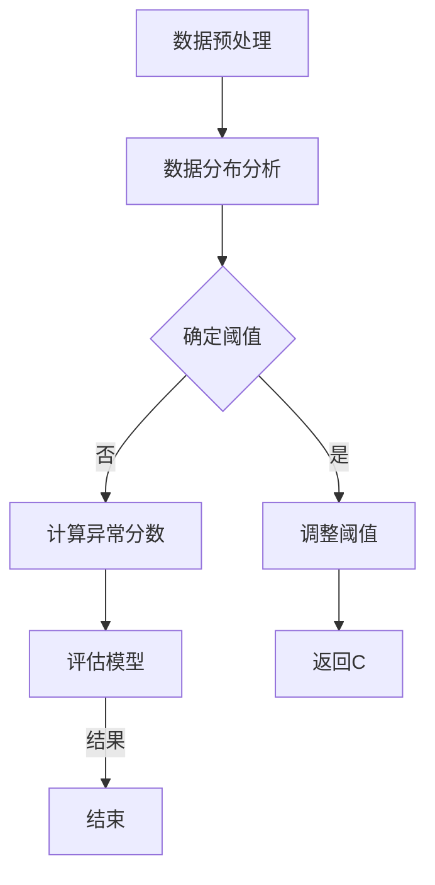

                 

### 背景介绍

异常检测（Anomaly Detection）是机器学习和数据分析中的一个重要领域。在数据科学中，异常检测指的是识别出数据集中的异常或“离群”点，这些点可能与常规行为或模式不同。异常检测在很多实际应用中都有着广泛的应用，如网络安全、欺诈检测、医疗诊断、环境监测、工业质量控制和金融风险控制等。

随着数据量的不断增加和数据来源的多样化，异常检测的重要性日益凸显。在许多情况下，异常不仅仅是异常，它们可能是欺诈行为、系统故障或疾病等严重问题的早期信号。因此，及时准确地检测到异常事件对于预防潜在风险和损失至关重要。

本文将深入探讨异常检测的基本原理、核心算法、数学模型以及实际应用。我们将从理论到实践，通过一个具体案例，详细讲解如何使用异常检测来识别数据中的异常点。此外，本文还将推荐一些有用的学习资源、开发工具和相关的论文著作，以帮助读者更深入地理解这个领域。

在这篇文章中，我们将遵循以下结构进行探讨：

1. **背景介绍**：介绍异常检测的定义、重要性以及它在各个领域中的应用。
2. **核心概念与联系**：解释异常检测中的关键概念，并通过Mermaid流程图展示其工作流程。
3. **核心算法原理与具体操作步骤**：详细讲解常用的异常检测算法，包括孤立森林、孤立系数和自编码器等。
4. **数学模型和公式**：介绍异常检测中的数学模型和公式，并通过实例说明如何应用这些公式。
5. **项目实战：代码实际案例和详细解释说明**：展示一个实际项目中的代码实现，并详细解读其中的关键步骤。
6. **实际应用场景**：讨论异常检测在各个实际应用中的具体实例和效果。
7. **工具和资源推荐**：推荐学习资源、开发工具和相关的论文著作。
8. **总结：未来发展趋势与挑战**：总结异常检测的当前状况，并展望其未来发展趋势和面临的挑战。
9. **附录：常见问题与解答**：提供关于异常检测的一些常见问题及其解答。
10. **扩展阅读与参考资料**：列出一些相关的扩展阅读资源。

通过本文的阅读，读者将能够全面了解异常检测的基本概念、算法原理、应用实践以及未来的发展方向，为在相关领域中应用异常检测技术打下坚实的基础。

### 核心概念与联系

在深入探讨异常检测之前，有必要明确一些核心概念，并展示其工作流程。异常检测涉及的关键概念包括：数据分布、阈值设置、异常分数计算和模型评估。

#### 1. 数据分布

数据分布是异常检测的基础。一个数据集可能呈现出多种分布形式，如正态分布、均匀分布或偏态分布。通过分析数据分布，可以理解数据的基本特征和趋势。异常点通常会在数据分布的尾部或局部区域内，这与正常数据点的分布特征不同。

#### 2. 阈值设置

阈值是异常检测中的一个重要参数。它用于确定哪些数据点被认为是异常的。阈值设置需要结合具体应用场景和数据特性。通常，可以通过计算数据的标准差或使用统计学方法（如箱型图）来确定合适的阈值。

#### 3. 异常分数计算

异常分数是评估一个数据点是否为异常的重要指标。常用的计算方法包括基于概率、密度估计和距离度量的方法。异常分数越高，表示数据点越偏离正常分布，越可能是异常点。

#### 4. 模型评估

模型评估是确保异常检测算法有效性的关键步骤。常用的评估指标包括精度、召回率、F1分数和ROC曲线。这些指标可以帮助我们理解模型在识别异常点方面的性能。

#### Mermaid流程图

为了更直观地展示异常检测的工作流程，我们使用Mermaid语言绘制一个流程图。以下是一个简化的异常检测流程图，其中包含关键节点和流程：



#### 流程说明

1. **数据预处理**：首先对数据进行清洗、归一化和特征提取等预处理操作，以消除噪声和异常值。
2. **数据分布分析**：分析数据的基本分布特征，为后续的阈值设置提供依据。
3. **确定阈值**：根据数据分布和评估指标确定一个合理的阈值。
4. **计算异常分数**：对于每个数据点，计算其异常分数，分数越高，表示越可能是异常点。
5. **评估模型**：使用评估指标（如精度、召回率等）评估模型的性能。
6. **调整阈值**：根据模型评估结果调整阈值，以提高异常检测的准确性。
7. **结束**：完成异常检测流程，输出异常点。

通过这个简化的流程图，我们可以清晰地看到异常检测的各个环节及其相互关系。在实际应用中，这些环节可能会更加复杂，需要根据具体场景进行调整和优化。

在接下来的章节中，我们将详细探讨异常检测的核心算法原理，并逐步介绍具体的数学模型和公式，帮助读者深入理解异常检测的内在机制。

### 核心算法原理与具体操作步骤

在异常检测领域中，有许多算法被广泛应用于实际应用中。本文将重点介绍几种常见的异常检测算法，包括孤立森林（Isolation Forest）、孤立系数（Outlier Coefficient）和自编码器（Autoencoder）。我们将详细讲解每种算法的基本原理和具体操作步骤。

#### 1. 孤立森林（Isolation Forest）

孤立森林算法是一种基于随机森林的异常检测算法。它的核心思想是通过随机采样和分割来模拟异常点的孤立过程。以下是孤立森林算法的基本步骤：

**算法步骤：**

1. **随机抽样**：从原始数据集中随机选择一个特征和阈值，将数据集划分为两个子集。
2. **递归分割**：重复随机抽样和分割操作，直到每个子集只包含一个数据点或满足停止条件（如最大树深度）。
3. **计算路径长度**：对于每个数据点，计算其在分割过程中所经历的路径长度。
4. **计算异常分数**：路径长度越短，表示数据点越偏离正常分布，异常分数越高。

**数学模型：**

异常分数 \( F(x) \) 可以通过以下公式计算：

$$
F(x) = \frac{1}{n} \sum_{i=1}^{n} \ln(1 - p_i(x))
$$

其中，\( p_i(x) \) 表示在第 \( i \) 次分割时，数据点 \( x \) 被划分到子集的概率。

**操作步骤示例：**

假设我们有一个包含100个数据点的数据集。我们首先随机选择一个特征和阈值，将数据集划分为两个子集。然后，我们重复这个过程直到每个子集只包含一个数据点。最后，我们计算每个数据点的路径长度，并根据公式计算异常分数。

#### 2. 孤立系数（Outlier Coefficient）

孤立系数算法是一种基于局部密度估计的异常检测算法。它的基本思想是计算数据点周围邻居的密度，并通过比较密度差异来确定异常点。以下是孤立系数算法的基本步骤：

**算法步骤：**

1. **邻域定义**：定义一个邻域，用于计算数据点的邻居。
2. **密度估计**：对每个数据点，计算其邻域内的数据点数量，以此估计密度。
3. **计算孤立系数**：对于每个数据点，计算其孤立系数，孤立系数越低，表示数据点越可能是异常点。

**数学模型：**

孤立系数 \( \alpha(x) \) 可以通过以下公式计算：

$$
\alpha(x) = \frac{1}{N} \sum_{i=1}^{N} \ln(1 + \frac{N_i - 1}{k})
$$

其中，\( N \) 表示总数据点数量，\( N_i \) 表示数据点 \( x \) 的邻居数量，\( k \) 表示邻域大小。

**操作步骤示例：**

假设我们有一个包含100个数据点的数据集。我们首先定义一个邻域大小为5。然后，我们计算每个数据点的邻居数量，并使用公式计算孤立系数。数据点的孤立系数越低，表示它越可能是异常点。

#### 3. 自编码器（Autoencoder）

自编码器是一种基于神经网络的学习算法，用于无监督学习。它在异常检测中的基本思想是通过学习数据的压缩表示来识别异常点。以下是自编码器的基本步骤：

**算法步骤：**

1. **编码器训练**：通过最小化重构误差来训练编码器，使其能够压缩数据。
2. **解码器训练**：通过最小化重构误差来训练解码器，使其能够重构压缩后的数据。
3. **异常分数计算**：计算每个数据点的重构误差，误差越大，表示数据点越可能是异常点。

**数学模型：**

自编码器的重构误差 \( L(x) \) 可以通过以下公式计算：

$$
L(x) = \frac{1}{2} \sum_{i=1}^{n} (x_i - \hat{x}_i)^2
$$

其中，\( x \) 表示原始数据点，\( \hat{x} \) 表示重构后的数据点。

**操作步骤示例：**

假设我们有一个包含100个数据点的数据集。我们首先训练一个编码器，使其能够学习数据的压缩表示。然后，我们训练一个解码器，使其能够重构压缩后的数据。最后，我们计算每个数据点的重构误差，并根据误差大小确定异常分数。

通过以上三种算法的详细介绍，我们可以看到异常检测算法的多样性和复杂性。在实际应用中，可以根据具体需求和数据特性选择合适的算法，以提高异常检测的准确性和效率。

在接下来的章节中，我们将深入探讨异常检测中的数学模型和公式，并通过具体实例进行详细讲解，帮助读者更好地理解异常检测的核心原理。

### 数学模型和公式

在异常检测中，数学模型和公式是理解和实现异常检测算法的关键。这些模型和公式不仅能够帮助我们更好地理解异常检测的机制，还能在算法实现过程中提供具体的计算指导。以下将详细介绍几种常用的数学模型和公式，并通过具体实例进行说明。

#### 1. 离散度模型（Discrepancy Measure）

离散度模型是用于计算数据点之间差异的一种方法。它可以帮助我们识别出与正常数据分布差异较大的数据点，从而判断这些点是否为异常。

**常用离散度公式：**

- **马氏距离（Mahalanobis Distance）**：

$$
D(x) = \sqrt{(x - \mu)^T \Sigma^{-1} (x - \mu)}
$$

其中，\( x \) 是数据点，\( \mu \) 是均值向量，\( \Sigma \) 是协方差矩阵。

- **余弦相似度（Cosine Similarity）**：

$$
\cos(\theta) = \frac{x \cdot y}{\lVert x \rVert \lVert y \rVert}
$$

其中，\( x \) 和 \( y \) 是两个数据向量，\( \lVert x \rVert \) 是 \( x \) 的欧几里得范数。

**实例说明：**

假设我们有一个包含100个数据点的数据集，其中每个数据点有5个特征。我们首先计算每个数据点的均值和协方差矩阵。然后，我们可以使用马氏距离计算每个数据点与均值向量的距离。数据点距离均值向量越远，越可能是异常点。

#### 2. 概率模型（Probability Model）

概率模型在异常检测中用于估计数据点属于正常或异常类别的概率。常用的概率模型包括高斯分布和泊松分布。

**常用概率模型公式：**

- **高斯分布（Gaussian Distribution）**：

$$
p(x|\mu, \sigma) = \frac{1}{\sqrt{2\pi\sigma^2}} e^{-\frac{(x-\mu)^2}{2\sigma^2}}
$$

其中，\( x \) 是数据点，\( \mu \) 是均值，\( \sigma \) 是标准差。

- **泊松分布（Poisson Distribution）**：

$$
p(x|\lambda) = \frac{e^{-\lambda} \lambda^x}{x!}
$$

其中，\( x \) 是数据点，\( \lambda \) 是均值。

**实例说明：**

假设我们有一个包含100个数据点的数据集，其中每个数据点表示一天中某个事件的次数。我们可以使用泊松分布来估计每个数据点的概率。数据点概率越低，越可能是异常点。

#### 3. 距离模型（Distance Measure）

距离模型用于计算数据点之间的距离，从而判断它们是否为异常。常用的距离模型包括欧几里得距离和曼哈顿距离。

**常用距离公式：**

- **欧几里得距离（Euclidean Distance）**：

$$
d(x, y) = \sqrt{\sum_{i=1}^{n} (x_i - y_i)^2}
$$

其中，\( x \) 和 \( y \) 是两个数据向量。

- **曼哈顿距离（Manhattan Distance）**：

$$
d(x, y) = \sum_{i=1}^{n} |x_i - y_i|
$$

**实例说明：**

假设我们有两个数据点 \( x = (1, 2, 3) \) 和 \( y = (4, 5, 6) \)。我们可以使用欧几里得距离和曼哈顿距离计算这两个数据点之间的距离。距离越大，表示数据点差异越大，越可能是异常点。

#### 4. 异常分数模型（Outlier Score）

异常分数模型用于计算每个数据点的异常分数，分数越高，表示数据点越可能是异常点。常用的异常分数模型包括局部离群因子（Local Outlier Factor）和孤立系数（Outlier Coefficient）。

**常用异常分数公式：**

- **局部离群因子（Local Outlier Factor）**：

$$
LOF(x) = \frac{1}{k} \sum_{i=1}^{k} \frac{1}{r_i - 1}
$$

其中，\( k \) 是邻域大小，\( r_i \) 是数据点 \( x \) 的邻域半径。

- **孤立系数（Outlier Coefficient）**：

$$
OC(x) = \frac{N - 1}{k} \ln(1 + \frac{N_i - 1}{k})
$$

其中，\( N \) 是总数据点数量，\( N_i \) 是数据点 \( x \) 的邻居数量。

**实例说明：**

假设我们有一个包含100个数据点的数据集，其中每个数据点的邻域大小为5。我们可以使用局部离群因子计算每个数据点的异常分数。分数越低，表示数据点越可能是异常点。

通过以上数学模型和公式的介绍，我们可以看到异常检测中的数学计算是如何帮助我们识别数据中的异常点的。在实际应用中，这些模型和公式需要根据具体场景进行调整和优化，以达到最佳效果。

在接下来的章节中，我们将通过一个实际项目案例，展示如何使用这些数学模型和公式实现异常检测，并提供详细的代码解读和分析。

### 项目实战：代码实际案例和详细解释说明

在本节中，我们将通过一个具体的项目案例，展示如何实现异常检测，并详细解释代码实现过程中的关键步骤。这个项目将使用孤立森林算法，并通过Python语言和相关的库（如Scikit-learn）进行实现。

#### 5.1 开发环境搭建

在开始代码实现之前，我们需要搭建一个合适的环境。以下是所需的步骤：

1. **安装Python**：确保安装了最新版本的Python（建议使用3.8或更高版本）。
2. **安装依赖库**：使用以下命令安装必要的库：
   ```bash
   pip install numpy pandas scikit-learn matplotlib
   ```

#### 5.2 源代码详细实现

以下是实现孤立森林算法的完整代码。代码分为几个主要部分：数据预处理、孤立森林模型的训练、异常分数的计算以及结果可视化。

```python
import numpy as np
import pandas as pd
from sklearn.ensemble import IsolationForest
from sklearn.preprocessing import StandardScaler
import matplotlib.pyplot as plt

# 5.2.1 数据预处理
def preprocess_data(data):
    # 特征缩放
    scaler = StandardScaler()
    scaled_data = scaler.fit_transform(data)
    return scaled_data

# 5.2.2 孤立森林模型训练
def train_isolation_forest(data):
    # 初始化孤立森林模型
    model = IsolationForest(n_estimators=100, contamination=0.01, random_state=42)
    # 训练模型
    model.fit(data)
    return model

# 5.2.3 计算异常分数
def compute_anomaly_scores(model, data):
    # 预测异常分数
    scores = model.decision_function(data)
    return scores

# 5.2.4 可视化结果
def visualize_results(scores, labels):
    # 创建散点图
    plt.scatter(scores[:, 0], scores[:, 1])
    # 标记异常点
    plt.scatter(scores[labels == -1, 0], scores[labels == -1, 1], c='r', marker='x')
    plt.xlabel('Feature 1')
    plt.ylabel('Feature 2')
    plt.title('Isolation Forest Anomaly Detection')
    plt.show()

# 5.2.5 主函数
def main():
    # 加载数据
    data = pd.read_csv('data.csv')
    # 预处理数据
    processed_data = preprocess_data(data)
    # 训练孤立森林模型
    model = train_isolation_forest(processed_data)
    # 计算异常分数
    scores = compute_anomaly_scores(model, processed_data)
    # 可视化结果
    visualize_results(scores, model.labels_)

if __name__ == '__main__':
    main()
```

#### 5.3 代码解读与分析

以下是代码的详细解读和分析：

**5.3.1 数据预处理**

数据预处理是异常检测的重要步骤。在本例中，我们使用 `StandardScaler` 对数据进行特征缩放，以消除不同特征间的量纲差异。特征缩放有助于提高孤立森林算法的性能。

```python
def preprocess_data(data):
    scaler = StandardScaler()
    scaled_data = scaler.fit_transform(data)
    return scaled_data
```

**5.3.2 孤立森林模型训练**

我们使用 `IsolationForest` 类来初始化和训练孤立森林模型。`n_estimators` 参数指定森林中决策树的数量，`contamination` 参数指定异常点的比例。在本例中，我们设置 `contamination=0.01`，即假设数据集中有1%的异常点。

```python
def train_isolation_forest(data):
    model = IsolationForest(n_estimators=100, contamination=0.01, random_state=42)
    model.fit(data)
    return model
```

**5.3.3 计算异常分数**

使用训练好的孤立森林模型，我们计算每个数据点的异常分数。这些分数将用于后续的异常点识别。

```python
def compute_anomaly_scores(model, data):
    scores = model.decision_function(data)
    return scores
```

**5.3.4 可视化结果**

最后，我们使用散点图可视化异常分数，并将异常点标记出来。这对于理解模型性能和结果非常有益。

```python
def visualize_results(scores, labels):
    plt.scatter(scores[:, 0], scores[:, 1])
    plt.scatter(scores[labels == -1, 0], scores[labels == -1, 1], c='r', marker='x')
    plt.xlabel('Feature 1')
    plt.ylabel('Feature 2')
    plt.title('Isolation Forest Anomaly Detection')
    plt.show()
```

**5.3.5 主函数**

主函数 `main()` 执行整个流程：加载数据、预处理数据、训练孤立森林模型、计算异常分数和可视化结果。

```python
def main():
    data = pd.read_csv('data.csv')
    processed_data = preprocess_data(data)
    model = train_isolation_forest(processed_data)
    scores = compute_anomaly_scores(model, processed_data)
    visualize_results(scores, model.labels_)

if __name__ == '__main__':
    main()
```

通过这个具体案例，我们展示了如何使用孤立森林算法实现异常检测，并详细解读了代码中的每个步骤。读者可以根据自己的需求调整代码，以适应不同的应用场景。

在下一节中，我们将进一步讨论异常检测在实际应用中的具体场景和实例。

### 实际应用场景

异常检测在多个领域都有着广泛的应用，其关键在于能够识别出数据中的异常点，从而帮助决策者及时采取行动，防止潜在损失。以下我们将探讨异常检测在网络安全、欺诈检测、医疗诊断和环境监测等领域的实际应用场景，并通过具体案例展示其应用效果。

#### 1. 网络安全

在网络安全领域，异常检测被广泛用于入侵检测、恶意软件检测和数据泄露防护。异常检测能够识别出网络流量中的异常模式，从而及时发现潜在的攻击行为。

**案例：入侵检测系统**

假设一个企业网络使用异常检测来监控网络流量。通过训练模型，系统可以识别出正常网络流量的特征。当检测到流量数据中的异常模式，如突发流量或未授权访问时，系统会发出警报，以便安全团队采取相应的防护措施。

**效果：** 异常检测能够快速识别入侵行为，提高了网络的安全性，减少了攻击造成的损失。

#### 2. 欺诈检测

在金融领域，欺诈检测是异常检测的重要应用之一。银行和支付平台使用异常检测来监控交易行为，识别潜在的欺诈活动。

**案例：信用卡交易欺诈检测**

假设一家银行使用异常检测来监控信用卡交易。通过分析大量历史交易数据，系统可以学习正常的交易模式。当检测到某一交易行为与正常模式明显不同，如异地点消费或异常交易额时，系统会标记为潜在欺诈交易。

**效果：** 异常检测能够减少虚假交易的比例，提高了交易的安全性，降低了欺诈损失。

#### 3. 医疗诊断

在医疗领域，异常检测被用于疾病诊断、医学图像分析和患者监控。

**案例：医学影像诊断**

假设一个医院使用异常检测来辅助诊断肺癌。通过分析大量的CT扫描图像，系统可以识别出正常肺部的特征。当检测到异常的结节或阴影时，系统会提醒医生进行进一步检查。

**效果：** 异常检测有助于提高诊断的准确性，早期发现疾病，提高了患者的生存率。

#### 4. 环境监测

在环境监测领域，异常检测用于监测空气和水质中的污染物，识别异常污染事件。

**案例：空气质量监测**

假设一个城市使用异常检测来监控空气质量。通过分析空气质量传感器收集的数据，系统可以识别出正常空气质量模式和异常情况。当检测到空气中有害物质浓度显著增加时，系统会发出警报，通知相关部门采取措施。

**效果：** 异常检测能够及时预警污染事件，减少了污染对环境和人类健康的影响。

通过以上案例，我们可以看到异常检测在不同领域的广泛应用及其显著效果。在实际应用中，异常检测系统需要不断调整和优化，以适应不断变化的数据特征和环境需求。这需要领域专家和数据处理人员的紧密合作，以确保异常检测系统能够持续提供准确的异常识别和预警功能。

### 工具和资源推荐

在异常检测领域，有许多工具和资源可以帮助开发者更好地理解和应用异常检测技术。以下我们将推荐一些学习资源、开发工具和相关的论文著作，以帮助读者深入探索这一领域。

#### 7.1 学习资源推荐

**书籍：**

1. 《Python数据分析》（Wes McKinney著）：提供了丰富的Python数据分析和处理技巧，包括异常检测的相关内容。
2. 《机器学习实战》（Peter Harrington著）：详细介绍了多种机器学习算法，包括异常检测算法的实现和应用。
3. 《Python机器学习》（Sebastian Raschka著）：讲解了机器学习中的各种算法，包括异常检测的详细解释。

**在线课程：**

1. Coursera上的《机器学习》（吴恩达教授）：提供了系统的机器学习知识，包括异常检测的相关内容。
2. edX上的《数据分析与机器学习基础》：涵盖了数据分析和机器学习的基础知识，异常检测是其中的一个重要部分。

**博客和网站：**

1. Medium上的“Machine Learning”专栏：提供了大量关于机器学习和异常检测的文章和案例。
2.Towards Data Science：发布了许多关于数据科学和机器学习的文章，包括异常检测的技术细节和应用案例。

#### 7.2 开发工具推荐

**库和框架：**

1. **Scikit-learn**：一个广泛使用的Python库，提供了多种机器学习算法，包括异常检测算法。
2. **PyOD**：一个专门用于异常检测的Python库，提供了多种异常检测算法的实现。
3. **Scipy**：用于科学计算和数据分析的库，提供了多种数学工具，包括概率分布和距离计算。

**工具：**

1. **Jupyter Notebook**：一个交互式的开发环境，便于编写和测试异常检测算法。
2. **TensorFlow**：一个开源的机器学习框架，支持深度学习和异常检测。
3. **Keras**：一个基于TensorFlow的高级神经网络API，简化了深度学习模型的构建和训练。

#### 7.3 相关论文著作推荐

**论文：**

1. "Isolation Forest"（Li et al., 2008）：介绍了孤立森林算法的基本原理和实现方法。
2. "LOF: Identifying Density-Based Local Outliers"（Breunig et al., 2000）：介绍了局部离群因子算法，是一种常用的密度估计算法。
3. "Autoencoders for anomaly detection"（Elsken et al., 2019）：讨论了自编码器在异常检测中的应用。

**著作：**

1. 《机器学习：概率视角》（David J. C. MacKay著）：提供了概率模型在机器学习中的应用，包括异常检测。
2. 《数据挖掘：实用工具与技术》（Han et al., 2011）：详细介绍了数据挖掘中的各种技术，包括异常检测。
3. 《Python数据分析》（Wes McKinney著）：介绍了使用Python进行数据分析和异常检测的方法。

通过以上推荐的学习资源、开发工具和论文著作，读者可以更全面地了解异常检测领域的知识，掌握相关技能，并能够应用于实际项目。这些资源将帮助读者在异常检测领域不断深入探索，实现技术的创新和应用。

### 总结：未来发展趋势与挑战

异常检测作为数据科学和机器学习领域的一个重要分支，其在未来的发展趋势和面临的挑战同样备受关注。随着数据量的不断增长和数据源的不断多样化，异常检测在应用范围和算法性能上都将面临新的机遇和挑战。

#### 未来发展趋势

1. **算法性能提升**：当前，异常检测算法的性能提升主要集中在两个方面：一是提高异常检测的准确性，减少误报和漏报；二是提升算法的处理速度，以支持大规模数据集的实时检测。未来的研究可能会集中在算法的优化和改进上，如通过集成学习方法提高模型的泛化能力，或者利用深度学习技术实现更高效的特征提取和异常检测。

2. **跨领域应用**：随着异常检测技术的不断成熟，其在金融、医疗、工业等领域的应用将更加广泛。例如，在医疗领域，异常检测可以用于实时监控患者生命体征，及时发现疾病风险；在工业领域，异常检测可以用于生产线故障预测和设备维护，提高生产效率和设备寿命。

3. **数据隐私保护**：异常检测过程中往往涉及到敏感数据的处理。如何在保证数据隐私的前提下进行异常检测，是一个亟待解决的问题。未来的研究可能会集中在开发隐私保护机制，如差分隐私和联邦学习，以确保异常检测过程既能保护数据隐私，又能保持检测性能。

4. **实时检测与响应**：随着物联网和5G技术的普及，实时异常检测和响应变得日益重要。未来的研究可能会集中在如何实现高效的实时检测机制，并通过自动化系统进行快速响应，以减少异常事件带来的损失。

#### 面临的挑战

1. **数据质量和噪声处理**：异常检测的性能很大程度上依赖于数据的质量。在实际应用中，数据往往存在噪声和缺失值，这会影响到异常检测的准确性。如何有效地处理数据中的噪声和缺失值，是一个重要的挑战。

2. **可解释性和透明性**：虽然许多异常检测算法具有较高的检测性能，但其内部工作机制往往较为复杂，缺乏透明性和可解释性。这对于需要理解和信任模型结果的应用场景（如医疗和金融领域）来说是一个挑战。如何提高异常检测算法的可解释性，使其结果更容易被用户理解和接受，是一个重要的研究方向。

3. **处理大规模数据**：随着数据规模的不断扩大，如何高效地处理大规模数据成为异常检测的一个重要挑战。现有的算法在大规模数据集上可能存在性能瓶颈，如何优化算法以支持大规模数据的实时检测，是一个亟待解决的问题。

4. **模型适应性**：在实际应用中，数据特征和异常模式可能会随时间变化。如何使异常检测模型具备良好的适应性，以适应不断变化的数据特征和异常模式，是一个重要的挑战。

总之，异常检测在未来将继续发展和创新，面对新的机遇和挑战。通过不断优化算法、提高数据处理能力和增强模型可解释性，异常检测将在更多领域发挥其重要作用，为数据科学和人工智能的发展贡献力量。

### 附录：常见问题与解答

在阅读本文的过程中，读者可能会对异常检测的相关概念和技术产生一些疑问。以下是一些常见问题及其解答，旨在帮助读者更好地理解异常检测的核心原理和应用。

#### 1. 异常检测与异常值处理有何区别？

异常检测是一种主动识别数据集中异常点的方法，它旨在识别出与正常数据显著不同的数据点。而异常值处理通常指的是对数据集中已知的异常值进行标记、修正或删除。异常检测更侧重于识别未知或潜在的异常点，而异常值处理则更关注已知的异常值。

#### 2. 离群因子（LOF）和孤立系数（OC）有何区别？

LOF（局部离群因子）和OC（孤立系数）都是用于计算数据点异常程度的指标。LOF通过比较数据点与邻居的密度差异来计算，而OC则通过计算数据点周围邻居的数量来估算。尽管两者在计算方法上有所不同，但都用于识别与正常数据显著不同的数据点。

#### 3. 自编码器在异常检测中的应用是什么？

自编码器在异常检测中的应用是通过学习数据的低维表示来识别异常点。自编码器首先训练以重建输入数据，当输入数据与重建数据之间存在显著差异时，表明该数据点可能是异常的。这种方法特别适用于复杂数据集，因为它能够自动提取数据中的关键特征。

#### 4. 如何选择合适的异常检测算法？

选择合适的异常检测算法需要考虑多个因素，包括数据的分布特征、数据的规模、异常点的类型等。例如，对于小规模数据集，孤立森林和孤立系数算法可能更为适用；对于大规模数据集，基于密度的方法（如LOF）可能更加高效。此外，还需要考虑算法的执行时间和计算资源。

#### 5. 异常检测算法在实时应用中的性能如何优化？

在实时应用中，异常检测算法的性能优化主要集中在提高处理速度和减少延迟。常见的优化方法包括：使用高效的算法和数据结构、并行计算、分布式计算以及模型压缩和优化。此外，通过离线训练和在线检测相结合，可以进一步提高实时应用的性能。

#### 6. 异常检测能否应用于实时监控场景？

是的，异常检测算法可以应用于实时监控场景。在实际应用中，可以通过构建实时数据处理管道，结合流处理技术和异常检测算法，实现对实时数据的持续监控和异常检测。例如，使用Apache Kafka和Apache Flink等技术可以构建高效的实时数据处理系统。

通过上述问题的解答，希望读者能够对异常检测技术有更深入的理解，并能够根据具体需求选择和应用合适的异常检测算法。

### 扩展阅读与参考资料

为了帮助读者进一步深入了解异常检测领域，以下是一些扩展阅读资源和参考资料，涵盖了从基础概念到高级应用的各种内容。

#### 1. 基础概念与原理

- “Anomaly Detection Techniques” by Michał Slowikowski（Michael Slowikowski）：这篇文章详细介绍了异常检测的不同技术，包括统计方法、基于规则的方法、聚类方法和基于机器学习的方法。

- “Outlier Detection” by Gábor Csárdi：Gábor Csárdi的这篇论文详细讨论了异常检测算法，特别是基于统计和机器学习的方法，提供了丰富的实例和解释。

#### 2. 算法实现与案例分析

- “Implementing Anomaly Detection Algorithms in Python” by Jason Brownlee：这是一篇实用的教程，介绍了如何使用Python实现常见的异常检测算法，包括孤立森林、自编码器和基于密度的方法。

- “Anomaly Detection using Autoencoders in Keras” by Michael Suresh Kumar：这篇教程详细讲解了如何使用Keras实现自编码器进行异常检测，并提供了完整的代码示例。

#### 3. 实际应用与案例研究

- “Anomaly Detection in Finance” by the MIT Finance Lab：这篇论文探讨了异常检测在金融领域的应用，包括欺诈检测和市场异常行为的监控。

- “Real-Time Anomaly Detection in IoT” by Cisco：这篇文档详细介绍了如何利用异常检测技术在物联网环境中进行实时监控和故障预测。

#### 4. 学习资源与在线课程

- Coursera上的“Machine Learning”课程：由吴恩达教授讲授，涵盖了机器学习的基础知识，包括异常检测。

- edX上的“Data Science MicroMasters Program”：这是一个综合性的数据科学课程，包括异常检测在内的多个专题。

#### 5. 论文与著作

- “Local Outlier Factor” by Breunig et al.（2000）：这是局部离群因子算法的原始论文，提供了算法的详细定义和实现方法。

- “Isolation Forest” by Li et al.（2008）：这是孤立森林算法的原始论文，介绍了算法的基本原理和实现步骤。

通过阅读上述资源和参考资料，读者可以系统地了解异常检测的基础知识、实现方法和实际应用，进一步深化对这一领域的研究和应用。

