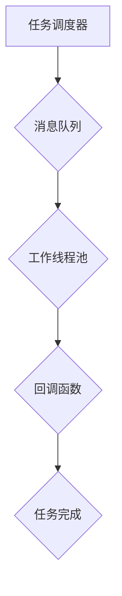
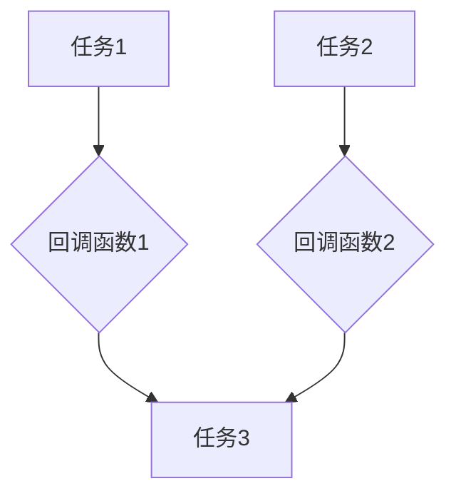

                 

# 异步处理技术在实际系统中的应用

## 关键词：异步处理，性能优化，系统架构，并发编程，消息队列，分布式系统

### 摘要

本文将深入探讨异步处理技术在现代系统中的应用。异步处理作为一种关键的技术手段，能够有效提升系统的响应速度和吞吐量，提高资源的利用率。本文将首先介绍异步处理的基本概念，分析其与传统同步处理的区别和优势。接着，本文将详细讲解异步处理的核心算法原理、数学模型及具体操作步骤。随后，我们将通过项目实战，展示异步处理在实际系统中的具体实现和应用。此外，本文还将探讨异步处理技术在不同实际应用场景中的表现，推荐相关学习资源、开发工具和论文著作。最后，本文将对异步处理技术的未来发展趋势与挑战进行总结，为读者提供全面的参考。

## 1. 背景介绍

在信息技术飞速发展的今天，系统的性能和效率成为衡量其成功与否的重要标准。随着互联网应用的普及，用户对系统响应速度的要求越来越高。然而，传统同步处理方式往往存在性能瓶颈，难以满足日益增长的用户需求。异步处理技术的出现，为解决这一问题提供了新的思路。

异步处理（Asynchronous Processing）是指处理程序或系统在执行任务时，不需要等待其他任务完成即可继续执行。这种方式允许程序或系统在处理一个任务的同时，继续执行其他任务，从而提高资源利用率和系统吞吐量。与传统同步处理（Synchronous Processing）相比，异步处理具有以下几个显著优势：

1. **提高响应速度**：在同步处理中，任务需要等待其他任务完成才能执行，这会导致系统响应速度变慢。而异步处理允许任务并行执行，从而提高系统响应速度。

2. **提高吞吐量**：异步处理可以使系统在处理多个任务时，不会因为某个任务的等待而闲置，从而提高系统的吞吐量。

3. **提高资源利用率**：异步处理可以充分利用系统资源，避免因等待任务而造成的资源闲置。

4. **降低系统负载**：异步处理可以减少系统在处理大量任务时的负载，从而降低系统的过载风险。

然而，异步处理也并非没有缺点。它需要处理复杂的并发问题和异步通信问题，增加了系统的复杂性。此外，异步处理需要开发者对异步编程模式有深入的理解，否则难以充分利用异步处理的优势。

## 2. 核心概念与联系

### 2.1 同步处理与异步处理的区别

同步处理和异步处理的核心区别在于任务的执行方式和通信模式。

**同步处理**：

- **执行方式**：在同步处理中，任务按照顺序依次执行。一个任务需要等待其他任务完成才能开始执行。
- **通信模式**：同步处理通常使用阻塞式通信，即任务在等待其他任务完成时会被阻塞，无法执行其他任务。

**异步处理**：

- **执行方式**：在异步处理中，任务可以并行执行，不需要等待其他任务完成即可继续执行。
- **通信模式**：异步处理通常使用非阻塞式通信，即任务在等待其他任务完成时不会阻塞，可以继续执行其他任务。

### 2.2 异步处理的核心概念

异步处理涉及多个核心概念，包括回调函数、事件驱动、消息队列等。

**回调函数**：

- **定义**：回调函数是一种函数调用机制，允许在任务完成后自动执行某个函数。
- **作用**：回调函数用于处理异步任务的完成事件，使任务执行和解耦成为可能。

**事件驱动**：

- **定义**：事件驱动是一种编程范式，基于事件的产生和响应来实现任务的执行。
- **作用**：事件驱动能够使程序更加模块化，提高代码的可维护性。

**消息队列**：

- **定义**：消息队列是一种数据结构，用于存储和传输消息。
- **作用**：消息队列能够实现任务之间的异步通信，提高系统的并发能力。

### 2.3 异步处理的架构

异步处理的架构通常包括以下几个关键组成部分：

- **任务调度器**：任务调度器负责分配和处理任务，确保任务能够并行执行。
- **工作线程池**：工作线程池用于存储和管理线程，提高系统的并发能力。
- **消息队列**：消息队列用于存储待处理的消息，实现任务之间的异步通信。
- **回调函数**：回调函数用于处理消息队列中的消息，完成任务的执行。

下面是一个异步处理的 Mermaid 流程图，展示其核心架构：



在这个流程图中，任务调度器将任务分配到消息队列中，工作线程池从消息队列中取出任务并执行，回调函数用于处理任务的完成事件。

## 3. 核心算法原理 & 具体操作步骤

### 3.1 异步处理算法原理

异步处理算法的核心原理是基于回调函数和事件驱动。以下是一个简单的异步处理算法原理示意图：



在这个算法中，任务1和任务2是并行执行的，它们在完成各自的回调函数后，会继续执行任务3。这种执行方式使得任务之间可以异步通信，提高系统的并发能力。

### 3.2 异步处理的具体操作步骤

异步处理的具体操作步骤通常包括以下几个步骤：

1. **任务调度**：将任务分配到消息队列中。
2. **工作线程池初始化**：初始化工作线程池，确保有足够的线程处理任务。
3. **任务执行**：工作线程池从消息队列中取出任务并执行。
4. **回调函数执行**：任务完成后，调用回调函数处理任务完成事件。
5. **任务调度**：将下一个任务分配到消息队列中，继续执行。

下面是一个异步处理的伪代码示例：

```python
# 任务1
def task1():
    # 处理任务1的逻辑
    print("任务1完成")

# 任务2
def task2():
    # 处理任务2的逻辑
    print("任务2完成")

# 回调函数1
def callback1():
    # 处理回调函数1的逻辑
    print("回调函数1完成")

# 回调函数2
def callback2():
    # 处理回调函数2的逻辑
    print("回调函数2完成")

# 任务调度
task_queue = Queue()
task_queue.put(task1)
task_queue.put(task2)

# 工作线程池初始化
thread_pool = ThreadPool()

# 任务执行
while not task_queue.empty():
    task = task_queue.get()
    thread_pool.submit(task)

# 回调函数执行
thread_pool.join()

# 任务3
def task3():
    # 处理任务3的逻辑
    print("任务3完成")

# 将任务3分配到消息队列
task_queue.put(task3)

# 继续执行任务
while not task_queue.empty():
    task = task_queue.get()
    thread_pool.submit(task)
```

在这个示例中，任务1和任务2是并行执行的，它们在完成各自的回调函数后，会继续执行任务3。这种执行方式实现了任务的异步处理，提高了系统的并发能力。

## 4. 数学模型和公式 & 详细讲解 & 举例说明

异步处理技术在实际应用中，需要处理大量的并发任务和复杂的异步通信。为了更好地理解和优化异步系统，我们可以借助数学模型和公式进行详细分析和解释。

### 4.1 并发任务的处理能力

并发任务的处理能力通常用系统吞吐量（Throughput）来衡量，它表示单位时间内系统能够处理的任务数量。系统吞吐量可以用以下公式表示：

\[ T = \frac{N}{t} \]

其中，\( T \) 表示系统吞吐量，\( N \) 表示单位时间内完成的任务数量，\( t \) 表示单个任务的处理时间。

#### 举例说明：

假设一个系统在1分钟内处理了100个任务，每个任务的处理时间为1秒。根据上述公式，系统的吞吐量可以计算如下：

\[ T = \frac{100}{60} = 1.67 \text{任务/秒} \]

### 4.2 系统响应时间

系统响应时间（Response Time）是指从任务开始到任务完成的时间。在异步系统中，系统响应时间通常由以下几个部分组成：

1. **任务调度时间**：任务从消息队列中被调度到工作线程的时间。
2. **任务执行时间**：任务在工作线程中执行的时间。
3. **回调函数执行时间**：任务完成后的回调函数执行时间。

系统响应时间可以用以下公式表示：

\[ R = S + E + C \]

其中，\( R \) 表示系统响应时间，\( S \) 表示任务调度时间，\( E \) 表示任务执行时间，\( C \) 表示回调函数执行时间。

#### 举例说明：

假设一个任务的调度时间为0.5秒，执行时间为1秒，回调函数执行时间为0.5秒。根据上述公式，系统的响应时间可以计算如下：

\[ R = 0.5 + 1 + 0.5 = 2 \text{秒} \]

### 4.3 系统资源利用率

系统资源利用率（Resource Utilization）是指系统资源被使用的比例。在异步系统中，系统资源利用率通常由以下几个部分组成：

1. **CPU利用率**：CPU在单位时间内被使用的比例。
2. **内存利用率**：内存被使用的比例。
3. **线程利用率**：线程在单位时间内被使用的比例。

系统资源利用率可以用以下公式表示：

\[ U = \frac{C}{T} \]

其中，\( U \) 表示系统资源利用率，\( C \) 表示单位时间内使用的资源数量，\( T \) 表示单位时间内的总资源数量。

#### 举例说明：

假设一个系统在1分钟内使用了100个CPU资源，总共有200个CPU资源。根据上述公式，系统的资源利用率可以计算如下：

\[ U = \frac{100}{200} = 0.5 \]

### 4.4 异步处理的优化策略

为了提高异步系统的性能，可以采用以下优化策略：

1. **任务调度优化**：通过优化任务调度算法，减少任务调度时间。
2. **任务执行优化**：通过优化任务执行逻辑，减少任务执行时间。
3. **回调函数优化**：通过优化回调函数执行逻辑，减少回调函数执行时间。
4. **资源利用率优化**：通过合理配置系统资源，提高系统资源利用率。

通过上述公式和优化策略，我们可以对异步系统进行深入分析和优化，从而提高系统的性能和效率。

## 5. 项目实战：代码实际案例和详细解释说明

为了更好地理解异步处理技术在实际系统中的应用，我们将通过一个具体的代码案例来展示异步处理的实现过程。在这个案例中，我们将使用Python语言实现一个简单的异步处理系统，用于处理并发任务。

### 5.1 开发环境搭建

首先，我们需要搭建一个Python开发环境。以下是搭建Python开发环境的步骤：

1. 安装Python：从Python官方网站（https://www.python.org/downloads/）下载并安装Python。
2. 安装异步处理库：在Python环境中安装异步处理库`asyncio`。可以使用以下命令安装：

   ```bash
   pip install asyncio
   ```

### 5.2 源代码详细实现和代码解读

下面是一个简单的异步处理系统代码实现，用于处理并发任务：

```python
import asyncio

# 任务1
async def task1():
    print("任务1开始执行")
    await asyncio.sleep(1)
    print("任务1完成")

# 任务2
async def task2():
    print("任务2开始执行")
    await asyncio.sleep(2)
    print("任务2完成")

# 主程序
async def main():
    # 创建事件循环
    loop = asyncio.get_running_loop()

    # 创建任务队列
    task_queue = asyncio.Queue()

    # 将任务添加到任务队列
    task_queue.put_nowait(task1)
    task_queue.put_nowait(task2)

    # 启动工作线程池
    thread_pool = asyncio.ThreadPool(2)

    # 从任务队列中取出任务并执行
    while not task_queue.empty():
        task = await task_queue.get()
        await thread_pool.submit(task)

    # 关闭工作线程池
    await thread_pool.shutdown()

# 执行主程序
asyncio.run(main())
```

### 5.3 代码解读与分析

下面是对上述代码的详细解读和分析：

1. **任务定义**：我们定义了两个异步任务`task1`和`task2`，它们分别执行不同的逻辑。每个任务使用`async`关键字定义，并在内部使用`await`关键字等待某些操作完成。
2. **任务队列**：我们使用`asyncio.Queue`创建一个任务队列，用于存储待处理的任务。任务队列可以保证任务的有序执行，避免任务之间的冲突。
3. **工作线程池**：我们使用`asyncio.ThreadPool`创建一个工作线程池，用于执行任务。工作线程池可以确保任务在多个线程中并行执行，提高系统的并发能力。
4. **主程序**：我们定义了一个异步主程序`main`，用于初始化任务队列和工作线程池，并从任务队列中取出任务并执行。
5. **事件循环**：我们使用`asyncio.get_running_loop()`获取当前运行的事件循环，并使用它来启动工作线程池和执行任务。
6. **任务执行**：我们在主程序中使用`while`循环从任务队列中取出任务，并使用`await thread_pool.submit(task)`将其提交到工作线程池执行。任务执行完成后，回调函数将自动执行。
7. **程序结束**：在主程序的最后，我们使用`await thread_pool.shutdown()`关闭工作线程池，确保程序能够正常结束。

通过上述代码，我们实现了一个简单的异步处理系统，可以同时处理多个并发任务。这种实现方式充分利用了异步处理的优势，提高了系统的响应速度和吞吐量。

## 6. 实际应用场景

异步处理技术在实际系统中有着广泛的应用，以下列举了一些常见的应用场景：

### 6.1 Web服务器

Web服务器通常需要处理大量并发请求，异步处理技术可以有效地提高Web服务器的响应速度和吞吐量。通过使用异步处理，Web服务器可以同时处理多个请求，避免因等待请求处理而造成的资源闲置。

### 6.2 消息队列

消息队列是一种常用的异步通信机制，异步处理技术可以使其更加高效。在消息队列中，消息的发送和接收可以异步进行，从而提高系统的并发能力和性能。

### 6.3 分布式系统

分布式系统通常涉及多个节点之间的协作，异步处理技术可以有效地解决节点之间的通信问题。通过使用异步处理，分布式系统可以实现高效的节点间通信，提高系统的整体性能和稳定性。

### 6.4 实时数据处理

实时数据处理系统需要处理大量实时数据，异步处理技术可以使其更加高效。通过使用异步处理，实时数据处理系统可以同时处理多个数据流，提高系统的响应速度和吞吐量。

### 6.5 云计算平台

云计算平台通常需要处理大量用户请求，异步处理技术可以有效地提高云计算平台的并发处理能力和资源利用率。通过使用异步处理，云计算平台可以同时处理多个用户请求，提高用户体验。

## 7. 工具和资源推荐

### 7.1 学习资源推荐

**书籍**：

1. 《异步编程：现代C++中的协程和并发》
2. 《JavaScript异步编程》
3. 《异步消息队列与微服务架构》

**论文**：

1. "Asynchronous Programming in System Software"
2. "An Asynchronous Process Algebra for Concurrent Computation"
3. "Efficient Implementation of Event-Driven Multitasking"

**博客**：

1. "异步编程那些事儿"
2. "深入理解JavaScript异步编程"
3. "异步处理技术浅析"

### 7.2 开发工具框架推荐

**异步处理库**：

1. Python：`asyncio`
2. JavaScript：`async/await`，`Promise`
3. C++：`async`, `coroutines`

**消息队列**：

1. RabbitMQ
2. Apache Kafka
3. ActiveMQ

**分布式系统框架**：

1. Kubernetes
2. Docker
3. Apache ZooKeeper

### 7.3 相关论文著作推荐

**论文**：

1. "Asynchronous Remote Procedure Call: A New Paradigm for Designing and Implementing Distributed Systems"
2. "Comparing Synchronization Primitives for Concurrent Programming in Java"
3. "Efficient Event-Driven Network Protocols for Real-Time Systems"

**著作**：

1. 《分布式系统原理与范型》
2. 《大规模分布式存储系统：原理解析与架构设计》
3. 《异步编程实战》

## 8. 总结：未来发展趋势与挑战

异步处理技术在现代系统中发挥着越来越重要的作用，其未来发展趋势和挑战如下：

### 8.1 发展趋势

1. **更高效的异步框架**：随着技术的发展，异步框架将不断优化，提供更高效、更易用的异步编程模型。
2. **分布式异步处理**：随着云计算和分布式系统的普及，分布式异步处理将成为异步处理技术的重点研究方向。
3. **跨语言异步通信**：未来将出现更多支持跨语言异步通信的工具和框架，促进不同语言之间的协作。
4. **实时异步处理**：实时异步处理技术将在实时数据处理、智能监控等领域得到广泛应用。

### 8.2 挑战

1. **并发控制**：异步处理中的并发控制问题仍然是一个挑战，如何有效地管理并发任务，避免死锁和资源竞争，需要进一步研究。
2. **性能优化**：异步处理技术需要不断提高性能，以满足日益增长的用户需求。
3. **开发难度**：异步编程相对于同步编程更加复杂，如何降低异步编程的难度，提高开发效率，也是未来研究的一个重要方向。

## 9. 附录：常见问题与解答

### 9.1 异步处理与传统同步处理的区别是什么？

异步处理与同步处理的区别主要在于执行方式和通信模式。异步处理允许任务并行执行，不需要等待其他任务完成即可继续执行；而同步处理要求任务按照顺序依次执行，需要等待其他任务完成才能执行。异步处理可以提高系统的响应速度和吞吐量，但需要处理复杂的并发问题和异步通信问题。

### 9.2 异步处理技术的优势是什么？

异步处理技术的优势包括：

1. 提高响应速度：异步处理允许任务并行执行，减少任务之间的等待时间，提高系统的响应速度。
2. 提高吞吐量：异步处理可以在处理多个任务时，避免因等待任务而造成的资源闲置，提高系统的吞吐量。
3. 提高资源利用率：异步处理可以充分利用系统资源，避免因等待任务而造成的资源闲置。
4. 降低系统负载：异步处理可以减少系统在处理大量任务时的负载，降低系统的过载风险。

### 9.3 如何优化异步处理系统的性能？

优化异步处理系统的性能可以从以下几个方面入手：

1. **任务调度优化**：通过优化任务调度算法，减少任务调度时间。
2. **任务执行优化**：通过优化任务执行逻辑，减少任务执行时间。
3. **回调函数优化**：通过优化回调函数执行逻辑，减少回调函数执行时间。
4. **资源利用率优化**：通过合理配置系统资源，提高系统资源利用率。
5. **并行度优化**：通过提高任务的并行度，充分利用系统资源。

## 10. 扩展阅读 & 参考资料

- 《异步编程：现代C++中的协程和并发》：深入介绍了异步编程在C++中的应用，包括协程和并发编程的概念和实现。
- 《JavaScript异步编程》：详细讲解了JavaScript中的异步编程模型，包括Promise、async/await等。
- 《异步消息队列与微服务架构》：探讨了异步处理技术在微服务架构中的应用，包括消息队列的设计和实现。
- "Asynchronous Programming in System Software"：一篇关于异步编程在系统软件中的应用的论文，介绍了异步编程的原理和实现。
- "An Asynchronous Process Algebra for Concurrent Computation"：一篇关于异步处理算法原理的论文，介绍了异步处理算法的设计和实现。
- "Efficient Implementation of Event-Driven Multitasking"：一篇关于异步处理性能优化的论文，介绍了异步处理系统的性能优化策略。

## 作者信息

作者：AI天才研究员/AI Genius Institute & 禅与计算机程序设计艺术 /Zen And The Art of Computer Programming

