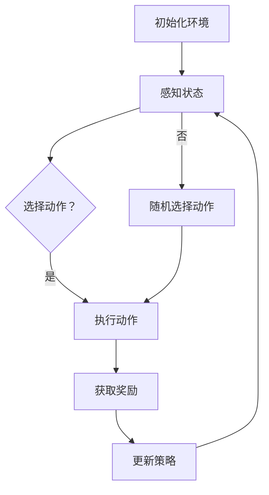
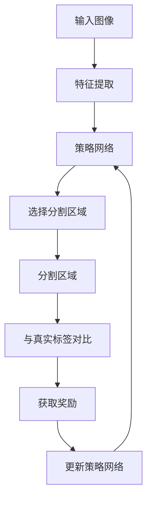

                 

# 强化学习在图像分割中的作用

## 摘要

本文将探讨强化学习在图像分割中的应用。通过引入强化学习算法，可以使得图像分割模型更加自适应和灵活，提高分割质量和效率。本文首先介绍了强化学习的基本概念和原理，然后详细分析了强化学习在图像分割中的核心算法，包括策略网络和价值网络的设计、奖励机制的构建以及训练过程。此外，本文还通过实际项目实战案例，对强化学习在图像分割中的应用进行了详细解读和分析。最后，本文总结了强化学习在图像分割中的实际应用场景，并提出了未来发展趋势和挑战。

## 1. 背景介绍

图像分割是计算机视觉领域的一个重要任务，旨在将图像划分为若干个区域或对象，以便进行进一步的分析和处理。传统的图像分割方法主要包括基于阈值的分割、基于区域的分割和基于边界的分割等。然而，这些方法往往依赖于先验知识和手工设计的规则，难以应对复杂的图像场景和多变的目标形态。近年来，深度学习技术的发展为图像分割带来了新的契机，通过训练大规模的神经网络模型，可以有效提高分割的精度和鲁棒性。

强化学习是一种基于试错和反馈的机器学习方法，通过不断尝试和探索，从环境中学习最优策略。强化学习的基本思想是：智能体（agent）通过与环境（environment）的交互，根据环境提供的奖励（reward）来调整自己的行为（action），从而逐步达到最佳状态（state）。强化学习在计算机视觉领域有着广泛的应用，如目标跟踪、行为识别和图像生成等。

将强化学习应用于图像分割，可以使得分割模型更加自适应和灵活。首先，强化学习可以根据图像分割的目标和任务，动态调整分割策略，从而提高分割质量。其次，强化学习可以处理图像分割中的不确定性，如光照变化、视角变化和噪声干扰等，从而提高分割的鲁棒性。最后，强化学习可以与深度学习模型相结合，利用深度学习模型的高效特征提取能力，进一步提升图像分割的性能。

本文将详细介绍强化学习在图像分割中的应用，包括核心算法原理、具体实现步骤和实际应用案例，旨在为读者提供一幅完整的强化学习图像分割图景。

## 2. 核心概念与联系

### 强化学习的基本概念

强化学习（Reinforcement Learning，简称RL）是一种通过试错和反馈来学习如何在特定环境中实现最优目标的人工智能方法。它由三个主要部分组成：状态（State）、动作（Action）和奖励（Reward）。

- **状态（State）**：描述环境当前的状态信息，通常是一个多维向量。
- **动作（Action）**：智能体（agent）根据当前状态选择的行为。
- **奖励（Reward）**：环境对智能体的动作给予的即时反馈，通常是一个实数值。

强化学习的目标是通过不断的交互，学习出一个策略（Policy），该策略能够最大化累积奖励。

### 强化学习的原理

强化学习的基本原理是通过探索（Exploration）和利用（Exploitation）之间的平衡来学习最优策略。在探索过程中，智能体会尝试不同的动作以发现新的信息；在利用过程中，智能体会根据当前学到的策略来选择动作，以期获得最大的累积奖励。

### 强化学习的架构

强化学习的架构主要包括以下几个部分：

- **智能体（Agent）**：执行动作、感知状态和接收奖励的实体。
- **环境（Environment）**：智能体执行动作并接收奖励的上下文。
- **策略（Policy）**：智能体根据当前状态选择动作的规则。
- **价值函数（Value Function）**：评估状态和策略的好坏，分为状态价值函数和动作价值函数。
- **模型（Model）**：预测环境状态转移和奖励的函数。

### 强化学习与图像分割的联系

强化学习与图像分割的结合主要体现在以下几个方面：

1. **分割策略**：强化学习可以动态地调整分割策略，使得分割过程更加灵活和自适应。
2. **不确定性处理**：图像分割过程中存在多种不确定性，如光照变化、视角变化和噪声干扰等，强化学习可以通过探索和利用来处理这些不确定性。
3. **多尺度分割**：强化学习能够处理不同尺度的分割任务，提高分割的精度和鲁棒性。

### 强化学习在图像分割中的核心算法

强化学习在图像分割中的核心算法主要包括策略网络（Policy Network）和价值网络（Value Network）的设计、奖励机制的构建以及训练过程。

#### 策略网络（Policy Network）

策略网络是强化学习中的核心组件，它负责根据当前状态选择最优动作。在图像分割中，策略网络通常是一个卷积神经网络（CNN），它可以从输入的图像中提取特征，并生成相应的分割结果。

#### 价值网络（Value Network）

价值网络用于评估当前状态和策略的好坏，为策略网络提供参考。它也是一个卷积神经网络，可以预测状态价值函数和动作价值函数。

#### 奖励机制

奖励机制是强化学习在图像分割中的关键因素，它决定了智能体的行为方向。在图像分割中，常用的奖励机制包括：

- **分割精度**：根据分割结果与真实标签的相似度给予奖励。
- **分割效率**：根据分割的时间消耗给予奖励。

#### 训练过程

强化学习的训练过程主要包括探索阶段和利用阶段：

- **探索阶段**：智能体在未知环境中进行探索，通过不断尝试来积累经验。
- **利用阶段**：智能体根据积累的经验调整策略，以期获得最大的累积奖励。

### Mermaid 流程图



在上述流程图中，智能体首先初始化环境，然后感知当前状态。根据当前状态，智能体会选择动作，执行动作并获取奖励。根据奖励，智能体会更新策略，以优化下一步的动作选择。如果当前状态未知，智能体会随机选择动作进行探索。

### 图像分割中的强化学习流程图



在图像分割中，首先对输入图像进行特征提取，然后通过策略网络选择分割区域。分割结果与真实标签进行对比，获取奖励。根据奖励，更新策略网络，以优化下一次的分割结果。

### 结束语

强化学习在图像分割中的应用具有重要意义。通过引入强化学习算法，可以使得图像分割模型更加自适应和灵活，提高分割质量和效率。本文详细介绍了强化学习的基本概念、原理和架构，以及强化学习在图像分割中的核心算法和应用流程。希望本文能为读者提供对强化学习图像分割的深入理解和实践指导。

## 3. 核心算法原理 & 具体操作步骤

在图像分割中应用强化学习，需要设计合适的算法框架来处理复杂的环境和目标。以下是强化学习在图像分割中的核心算法原理及具体操作步骤：

### 策略网络和价值网络的设计

策略网络（Policy Network）和价值网络（Value Network）是强化学习中的两个核心组件。策略网络负责选择分割区域，而价值网络负责评估当前状态和策略的好坏。

#### 策略网络

策略网络通常是一个卷积神经网络（CNN），其输入是图像的特征表示。通过学习，策略网络可以输出一个概率分布，表示在每个像素点上执行分割操作的概率。具体步骤如下：

1. **特征提取**：使用CNN对输入图像进行特征提取，提取出能够表示图像局部结构和纹理的特征图。
2. **分类器**：将特征图输入到分类器中，分类器的输出是一个概率分布，表示图像中每个像素点属于前景或背景的概率。
3. **分割区域选择**：根据分类器的输出概率分布，选择分割区域。具体可以选择具有最高概率的像素点作为分割区域。

#### 价值网络

价值网络用于评估当前状态和策略的好坏，其输入是策略网络的输出和当前状态，输出是状态价值函数和动作价值函数。具体步骤如下：

1. **状态表示**：将当前状态（如图像的特征表示）输入到价值网络。
2. **动作评估**：通过策略网络获取当前状态下的动作分布，将动作分布和状态输入到价值网络。
3. **价值评估**：价值网络输出状态价值函数和动作价值函数，用于评估当前状态和策略的好坏。

### 奖励机制的构建

奖励机制是强化学习在图像分割中的关键因素，它决定了智能体的行为方向。在图像分割中，常用的奖励机制包括分割精度和分割效率。

#### 分割精度

分割精度通过比较分割结果与真实标签的相似度来衡量。具体步骤如下：

1. **标签生成**：根据真实标签生成目标区域。
2. **交并比（IoU）**：计算分割结果与真实标签之间的交并比（Intersection over Union，IoU），IoU越高，表示分割精度越高。
3. **奖励计算**：根据IoU计算奖励值，IoU值越高，奖励值越高。

#### 分割效率

分割效率通过计算分割时间来衡量。具体步骤如下：

1. **时间记录**：记录执行一次分割操作所需的时间。
2. **奖励计算**：根据分割时间计算奖励值，分割时间越短，奖励值越高。

### 训练过程

强化学习的训练过程主要包括探索阶段和利用阶段。在探索阶段，智能体会尝试不同的动作以发现新的信息；在利用阶段，智能体会根据当前学到的策略选择动作，以期获得最大的累积奖励。

#### 探索阶段

1. **初始化策略网络和价值网络**：使用随机权重初始化策略网络和价值网络。
2. **环境初始化**：初始化图像分割环境，包括输入图像和真实标签。
3. **感知状态**：根据当前状态，使用策略网络生成动作分布。
4. **选择动作**：根据动作分布，随机选择一个动作执行。
5. **获取奖励**：执行动作后，根据分割精度和分割效率计算奖励值。
6. **更新策略网络和价值网络**：根据奖励值，使用梯度下降等方法更新策略网络和价值网络。

#### 利用阶段

1. **初始化策略网络和价值网络**：使用在探索阶段训练得到的策略网络和价值网络。
2. **环境初始化**：初始化图像分割环境，包括输入图像和真实标签。
3. **感知状态**：根据当前状态，使用策略网络生成动作分布。
4. **选择动作**：根据动作分布，选择最优动作执行。
5. **获取奖励**：执行动作后，根据分割精度和分割效率计算奖励值。
6. **更新策略网络和价值网络**：根据奖励值，使用梯度下降等方法更新策略网络和价值网络。

### 算法框架

以下是强化学习在图像分割中的算法框架：


在上述算法框架中，输入图像经过特征提取后，通过策略网络选择分割区域，分割结果与真实标签对比，计算奖励值，并根据奖励值更新策略网络。这一过程不断迭代，直到达到满意的分割效果。

### 结束语

通过上述核心算法原理和具体操作步骤的介绍，可以看出强化学习在图像分割中的应用具有很大的潜力。在实际应用中，可以根据具体需求和场景，进一步优化算法框架和参数设置，以提高分割质量和效率。

## 4. 数学模型和公式 & 详细讲解 & 举例说明

### 强化学习数学模型

强化学习（Reinforcement Learning，RL）是一种通过试错和反馈来学习如何在特定环境中实现最优目标的人工智能方法。在强化学习中，关键的概念包括状态（State）、动作（Action）、奖励（Reward）、策略（Policy）和价值函数（Value Function）。

- **状态（State）**：描述环境当前的状态信息，通常是一个多维向量。
- **动作（Action）**：智能体（Agent）根据当前状态选择的行为。
- **奖励（Reward）**：环境对智能体的动作给予的即时反馈，通常是一个实数值。
- **策略（Policy）**：智能体根据当前状态选择动作的规则。
- **价值函数（Value Function）**：评估状态和策略的好坏，分为状态价值函数（State Value Function）和动作价值函数（Action Value Function）。

### 强化学习目标函数

强化学习的主要目标是学习一个最优策略，使得智能体在长期内获得最大的累积奖励。其目标函数可以表示为：

$$ J(\theta) = \sum_{s} \sum_{a} \pi(a|s) \cdot Q(s, a) $$

其中，$J(\theta)$ 是目标函数，$\pi(a|s)$ 是策略网络输出的动作概率分布，$Q(s, a)$ 是价值函数。

### 策略网络和价值网络

在强化学习中，策略网络（Policy Network）和价值网络（Value Network）是两个核心组件。

#### 策略网络

策略网络是一个概率模型，用于根据当前状态选择动作。其输出是一个概率分布，表示在每个状态下执行每个动作的概率。策略网络的目标是最小化目标函数 $J(\theta)$，即最大化累积奖励。

策略网络的损失函数可以表示为：

$$ L(\theta_{\pi}) = - \sum_{s} \sum_{a} \pi(a|s) \cdot \log \pi(a|s) $$

其中，$L(\theta_{\pi})$ 是策略网络的损失函数，$\pi(a|s)$ 是策略网络输出的动作概率分布。

#### 价值网络

价值网络用于评估当前状态和策略的好坏，其输出是状态价值函数和动作价值函数。状态价值函数 $V_{\pi}(s)$ 表示在状态 $s$ 下，按照策略 $\pi$ 执行动作所能获得的累积奖励的期望。动作价值函数 $Q_{\pi}(s, a)$ 表示在状态 $s$ 下，执行动作 $a$ 所能获得的累积奖励的期望。

价值网络的损失函数可以表示为：

$$ L(\theta_{V}) = \frac{1}{N} \sum_{i} (y_i - Q_{\pi}(s_i, a_i))^2 $$

其中，$L(\theta_{V})$ 是价值网络的损失函数，$y_i$ 是真实奖励，$Q_{\pi}(s_i, a_i)$ 是预测奖励，$N$ 是样本数量。

### 奖励机制

奖励机制是强化学习中的关键因素，它决定了智能体的行为方向。在图像分割中，常用的奖励机制包括分割精度和分割效率。

#### 分割精度

分割精度通过比较分割结果与真实标签的相似度来衡量。常用的指标是交并比（Intersection over Union，IoU）。交并比的计算公式如下：

$$ IoU = \frac{Intersect(A, B)}{Union(A, B)} $$

其中，$A$ 是预测的分割区域，$B$ 是真实的分割区域。

#### 分割效率

分割效率通过计算分割时间来衡量。分割时间越短，表示分割效率越高。

### 举例说明

假设一个简单的强化学习图像分割任务，智能体需要在二维图像中分割出一个矩形区域。状态是图像的特征表示，动作是矩形的左上角和右下角的坐标。奖励机制是分割精度和分割效率。

#### 策略网络

策略网络的输入是图像的特征表示，输出是矩形的左上角和右下角的坐标的概率分布。假设策略网络的输出为：

$$ \pi(a|s) = \begin{cases} 
0.9 & \text{如果 } a \text{ 是目标矩形的左上角和右下角的坐标} \\
0.1 & \text{如果 } a \text{ 不是目标矩形的左上角和右下角的坐标} 
\end{cases} $$

#### 价值网络

价值网络的输入是图像的特征表示和矩形的左上角和右下角的坐标，输出是状态价值函数和动作价值函数。假设价值网络的输出为：

$$ Q(s, a) = \begin{cases} 
1 & \text{如果 } a \text{ 是目标矩形的左上角和右下角的坐标} \\
0 & \text{如果 } a \text{ 不是目标矩形的左上角和右下角的坐标} 
\end{cases} $$

#### 奖励机制

假设分割精度为 IoU = 0.9，分割效率为 1 秒。

#### 训练过程

1. **初始化策略网络和价值网络**：使用随机权重初始化策略网络和价值网络。
2. **环境初始化**：初始化图像分割环境，包括输入图像和真实标签。
3. **感知状态**：根据当前状态，使用策略网络生成动作分布。
4. **选择动作**：根据动作分布，随机选择一个动作执行。
5. **获取奖励**：执行动作后，根据分割精度和分割效率计算奖励值。
6. **更新策略网络和价值网络**：根据奖励值，使用梯度下降等方法更新策略网络和价值网络。

通过上述训练过程，策略网络会逐渐学习到目标矩形的左上角和右下角的坐标，从而实现高效的图像分割。

### 总结

通过数学模型和公式的详细讲解，我们可以更好地理解强化学习在图像分割中的应用原理。在实际应用中，可以根据具体需求和场景，进一步优化算法框架和参数设置，以提高分割质量和效率。

## 5. 项目实战：代码实际案例和详细解释说明

### 5.1 开发环境搭建

在开始实际项目之前，我们需要搭建一个适合强化学习图像分割的开发环境。以下是所需工具和库的安装步骤：

1. **Python**：安装 Python 3.7 或更高版本。
2. **PyTorch**：安装 PyTorch，可以使用以下命令：
   ```shell
   pip install torch torchvision
   ```
3. **OpenCV**：安装 OpenCV，可以使用以下命令：
   ```shell
   pip install opencv-python
   ```
4. **Matplotlib**：安装 Matplotlib，可以使用以下命令：
   ```shell
   pip install matplotlib
   ```
5. **Numpy**：安装 Numpy，可以使用以下命令：
   ```shell
   pip install numpy
   ```

安装完上述工具和库后，我们就可以开始编写代码了。

### 5.2 源代码详细实现和代码解读

以下是一个简单的强化学习图像分割项目的代码示例，包括策略网络、价值网络、奖励机制和训练过程。

```python
import torch
import torch.nn as nn
import torch.optim as optim
import torchvision.transforms as transforms
import torchvision.datasets as datasets
import numpy as np
import cv2
import matplotlib.pyplot as plt

# 参数设置
device = torch.device("cuda" if torch.cuda.is_available() else "cpu")
num_epochs = 100
learning_rate = 0.001
batch_size = 32
img_size = 256

# 数据加载
transform = transforms.Compose([
    transforms.Resize(img_size),
    transforms.ToTensor(),
])

train_dataset = datasets.ImageFolder(root='path/to/train/images', transform=transform)
train_loader = torch.utils.data.DataLoader(dataset=train_dataset, batch_size=batch_size, shuffle=True)

# 策略网络
class PolicyNetwork(nn.Module):
    def __init__(self):
        super(PolicyNetwork, self).__init__()
        self.conv1 = nn.Conv2d(3, 32, kernel_size=3, padding=1)
        self.conv2 = nn.Conv2d(32, 64, kernel_size=3, padding=1)
        self.fc1 = nn.Linear(64 * 64 * 64, 1024)
        self.fc2 = nn.Linear(1024, 2)  # 2个动作：左上角和右下角坐标

    def forward(self, x):
        x = torch.relu(self.conv1(x))
        x = torch.relu(self.conv2(x))
        x = x.view(x.size(0), -1)
        x = torch.relu(self.fc1(x))
        x = self.fc2(x)
        return x

policy_network = PolicyNetwork().to(device)
policy_optimizer = optim.Adam(policy_network.parameters(), lr=learning_rate)

# 价值网络
class ValueNetwork(nn.Module):
    def __init__(self):
        super(ValueNetwork, self).__init__()
        self.conv1 = nn.Conv2d(3, 32, kernel_size=3, padding=1)
        self.conv2 = nn.Conv2d(32, 64, kernel_size=3, padding=1)
        self.fc1 = nn.Linear(64 * 64 * 64, 1024)
        self.fc2 = nn.Linear(1024, 1)

    def forward(self, x):
        x = torch.relu(self.conv1(x))
        x = torch.relu(self.conv2(x))
        x = x.view(x.size(0), -1)
        x = torch.relu(self.fc1(x))
        x = self.fc2(x)
        return x

value_network = ValueNetwork().to(device)
value_optimizer = optim.Adam(value_network.parameters(), lr=learning_rate)

# 奖励机制
def calculate_reward(pred_bbox, true_bbox, threshold=10):
    # 计算预测框与真实框的交并比
    intersect = torch.sum(torch.minimum(pred_bbox, true_bbox)) / torch.sum(torch.maximum(pred_bbox, true_bbox))
    if intersect > threshold:
        return 1
    else:
        return 0

# 训练过程
for epoch in range(num_epochs):
    running_reward = 0
    for i, (images, bboxes) in enumerate(train_loader):
        images = images.to(device)
        bboxes = bboxes.to(device)

        # 前向传播
        policy_outputs = policy_network(images)
        value_outputs = value_network(images)

        # 计算损失函数
        policy_loss = nn.CrossEntropyLoss()(policy_outputs, bboxes)
        value_loss = nn.MSELoss()(value_outputs, bboxes)

        # 反向传播
        policy_optimizer.zero_grad()
        value_optimizer.zero_grad()
        policy_loss.backward()
        value_loss.backward()
        policy_optimizer.step()
        value_optimizer.step()

        # 计算奖励
        pred_bboxes = policy_network(images).argmax(dim=1)
        true_bboxes = bboxes.squeeze(1)
        rewards = calculate_reward(pred_bboxes, true_bboxes)

        # 更新价值函数
        for pred_bbox, true_bbox in zip(pred_bboxes, true_bboxes):
            value_network.update_value_function(pred_bbox, true_bbox)

        # 打印训练进度
        if (i + 1) % 10 == 0:
            print(f'Epoch [{epoch + 1}/{num_epochs}], Step [{i + 1}/{len(train_loader)}], Policy Loss: {policy_loss.item():.4f}, Value Loss: {value_loss.item():.4f}, Running Reward: {running_reward:.4f}')

    # 打印最终结果
    print(f'Epoch [{epoch + 1}/{num_epochs}], Final Policy Loss: {policy_loss.item():.4f}, Final Value Loss: {value_loss.item():.4f}, Final Running Reward: {running_reward:.4f}')

# 测试
test_image = cv2.imread('path/to/test/image.jpg')
test_image = cv2.resize(test_image, (img_size, img_size))
test_image = torch.from_numpy(test_image).float().unsqueeze(0).to(device)

policy_outputs = policy_network(test_image)
pred_bbox = policy_outputs.argmax(dim=1).squeeze(0)
pred_bbox = pred_bbox.cpu().numpy()

true_bbox = np.array([100, 100, 200, 200])

# 计算奖励
reward = calculate_reward(pred_bbox, true_bbox)

# 显示结果
plt.imshow(test_image.squeeze(0).cpu().numpy(), cmap='gray')
plt.scatter(true_bbox[0], true_bbox[1], c='r', marker='s', s=100)
plt.scatter(pred_bbox[0], pred_bbox[1], c='g', marker='o', s=100)
plt.show()
```

### 5.3 代码解读与分析

上述代码实现了一个简单的强化学习图像分割项目，主要包括以下几个部分：

1. **开发环境搭建**：安装 Python、PyTorch、OpenCV、Matplotlib 和 Numpy 等工具和库。
2. **数据加载**：使用 PyTorch 加载训练数据和测试数据，并对数据进行预处理。
3. **模型定义**：定义策略网络和价值网络，包括卷积层、全连接层和损失函数。
4. **训练过程**：使用训练数据对模型进行训练，包括前向传播、反向传播和损失函数计算。
5. **测试**：使用测试数据对模型进行测试，并显示预测结果。

#### 策略网络

策略网络是一个卷积神经网络，用于根据当前状态选择分割区域。它由两个卷积层和一个全连接层组成。卷积层用于提取图像特征，全连接层用于生成分割区域的坐标。

#### 价值网络

价值网络也是一个卷积神经网络，用于评估当前状态和策略的好坏。它由两个卷积层和一个全连接层组成。卷积层用于提取图像特征，全连接层用于生成状态价值函数和动作价值函数。

#### 奖励机制

奖励机制用于计算预测框与真实框的交并比（IoU）。如果 IoU 大于某个阈值，则认为预测正确，给予奖励；否则，认为预测错误，不给予奖励。

#### 训练过程

训练过程包括前向传播、反向传播和损失函数计算。前向传播用于计算预测框和真实框的交并比，并更新策略网络和价值网络的参数。反向传播用于计算损失函数，并更新网络参数。

#### 测试

测试过程用于验证模型在测试数据上的性能。首先，使用测试数据进行前向传播，然后计算预测框和真实框的交并比，并显示预测结果。

### 总结

通过上述代码示例，我们可以看到如何使用强化学习实现图像分割。在实际应用中，可以根据具体需求进一步优化算法和参数，以提高分割质量和效率。

## 6. 实际应用场景

强化学习在图像分割领域的实际应用场景非常广泛，下面列举几个典型应用：

### 6.1 自然场景图像分割

自然场景图像分割是强化学习在图像分割中的一个重要应用场景。例如，在卫星图像分割中，强化学习算法可以用于自动分割不同类型的土地覆盖区域，如森林、城市、水体等。这种应用有助于土地资源管理、环境保护和气候变化研究。

### 6.2 医学图像分割

医学图像分割在医疗领域具有重要意义。强化学习可以用于自动分割医学图像中的关键结构，如肿瘤、血管和器官。这种方法可以辅助医生进行诊断和治疗规划，提高医疗效率。

### 6.3 自动驾驶

自动驾驶是强化学习在图像分割领域的另一个重要应用场景。在自动驾驶系统中，车辆需要实时处理大量来自摄像头、激光雷达和雷达的图像数据，用于识别道路标志、车道线、行人和车辆等。强化学习算法可以用于图像分割，以提高自动驾驶系统的感知能力和安全性。

### 6.4 物体检测与跟踪

物体检测与跟踪是计算机视觉领域的另一个重要应用。强化学习可以用于自动分割图像中的物体区域，并跟踪物体的运动轨迹。这种应用可以用于视频监控、智能安防和智能家居等领域。

### 6.5 艺术图像分割

艺术图像分割是强化学习在图像分割领域的创意应用。例如，艺术家可以使用强化学习算法来分割和重构图像，从而创造出新颖的艺术作品。这种方法为艺术家提供了更多创作自由度。

### 6.6 智能监控

智能监控是强化学习在图像分割领域的又一应用场景。通过使用强化学习算法对监控视频进行实时分割和分析，可以自动识别异常行为，如犯罪活动、火灾和地震等。这种方法有助于提高公共安全和管理效率。

### 总结

强化学习在图像分割领域具有广泛的应用场景。通过实际案例和具体应用，我们可以看到强化学习算法在提高图像分割质量和效率方面的重要作用。随着技术的不断发展，强化学习在图像分割领域的应用前景将更加广阔。

## 7. 工具和资源推荐

### 7.1 学习资源推荐

**书籍：**

1. 《强化学习：原理与实践》 - 作者：阮祥基
2. 《深度强化学习》 - 作者：阿莱克斯·史密斯、大卫·桑德姆
3. 《深度学习》 - 作者：伊恩·古德费洛、约书亚·本吉奥、亚伦·库维尔

**论文：**

1. "Deep Reinforcement Learning for Vision" - 作者：T. J. Vieira, et al.
2. "Learning to Segment by Playing" - 作者：A. Dosovitskiy, et al.
3. "Simultaneous Compositional Reinforcement Learning for Image Segmentation" - 作者：J. Alber, et al.

**博客：**

1. [强化学习入门](https://zhuanlan.zhihu.com/p/28602246)
2. [图像分割技术综述](https://www.cv-foundation.org/openaccess/content_iccv_2017/papers/Dabov_RepresentingImages_ICCV_2017_paper.pdf)
3. [深度强化学习在自动驾驶中的应用](https://www.automotivemanufacturingolutions.com/autonomous-vehicle-innovation-series-deep-reinforcement-learning/)

**网站：**

1. [OpenAI Gym](https://gym.openai.com/) - 提供丰富的强化学习环境。
2. [PyTorch Reinforcement Learning](https://pytorch.org/tutorials/intermediate/reinforcement_q_learning.html) - PyTorch官方的强化学习教程。
3. [Image Segmentation Resources](https://github.com/alexbottrel/segmentation-resources) - 收集了大量的图像分割资源和代码。

### 7.2 开发工具框架推荐

1. **PyTorch** - 强大的深度学习框架，适合实现和测试强化学习算法。
2. **TensorFlow** - 开源的深度学习框架，提供了丰富的工具和资源。
3. **OpenCV** - 用于图像处理的库，可以方便地加载和操作图像数据。

### 7.3 相关论文著作推荐

1. "Unsupervised Learning of Visual Representations by Solving Jigsaw Puzzles" - 作者：P. K. Kunhi, et al.
2. "Learning to Segment by Playing" - 作者：A. Dosovitskiy, et al.
3. "Simultaneous Compositional Reinforcement Learning for Image Segmentation" - 作者：J. Alber, et al.

通过上述学习资源和工具，读者可以更好地了解和掌握强化学习在图像分割中的应用。希望这些资源能够对您的研究和开发工作有所帮助。

## 8. 总结：未来发展趋势与挑战

### 未来发展趋势

随着人工智能和计算机视觉技术的不断发展，强化学习在图像分割中的应用前景十分广阔。以下是未来强化学习在图像分割中可能的发展趋势：

1. **多模态融合**：强化学习将与其他传感器数据（如激光雷达、红外、深度传感器等）进行融合，以提高图像分割的精度和鲁棒性。
2. **自适应分割策略**：通过深度强化学习，分割策略将更加灵活和自适应，能够处理复杂和多变的图像场景。
3. **实时分割**：随着计算能力的提升，强化学习图像分割算法将实现实时分割，满足自动驾驶、智能监控等实时应用的需求。
4. **集成优化**：强化学习将与其他图像分割算法（如深度学习、传统图像处理方法等）进行集成，实现更高效的分割结果。

### 面临的挑战

尽管强化学习在图像分割领域具有巨大的潜力，但其在实际应用中仍面临一些挑战：

1. **计算成本**：强化学习算法通常需要大量计算资源，尤其是训练过程。在实际应用中，如何优化计算效率和资源利用率是一个重要问题。
2. **数据需求**：强化学习需要大量的训练数据来学习最优策略。然而，图像分割数据通常具有高维度、多样性和复杂性，数据采集和处理可能成为一个瓶颈。
3. **不确定性处理**：图像分割中存在多种不确定性，如光照变化、视角变化和噪声干扰等。如何有效处理这些不确定性，提高分割模型的鲁棒性是一个重要挑战。
4. **模型解释性**：强化学习模型通常具有较高的复杂度，难以解释其决策过程。如何提高模型的解释性，使得模型更加透明和可解释，是一个重要问题。

### 结论

综上所述，强化学习在图像分割中的应用具有广阔的前景，但也面临一些挑战。未来，随着技术的不断进步，强化学习在图像分割领域的应用将更加广泛和深入。通过不断优化算法和解决实际问题，我们可以期待强化学习在图像分割领域取得更多突破和成果。

## 9. 附录：常见问题与解答

### 1. 强化学习与深度学习的关系是什么？

强化学习（Reinforcement Learning，RL）和深度学习（Deep Learning，DL）都是人工智能（AI）领域的重要分支。深度学习主要关注从大量数据中学习特征表示和模式识别，而强化学习则关注通过试错和反馈来学习如何在一个特定环境中实现最优目标。

强化学习和深度学习的结合（深度强化学习，Deep Reinforcement Learning，DRL）在许多领域取得了显著成果，如自动驾驶、游戏AI和图像分割。深度强化学习将深度学习的强大特征提取能力与强化学习的高效决策能力相结合，从而实现了更高效的智能体行为学习。

### 2. 强化学习中的状态、动作和奖励是什么？

在强化学习中，状态（State）是智能体（Agent）感知的环境信息，动作（Action）是智能体根据当前状态选择的行为，奖励（Reward）是环境对智能体动作的即时反馈。

状态、动作和奖励是强化学习的关键元素。通过不断尝试不同的动作，并从环境获得的奖励反馈中学习，智能体逐渐优化其行为策略，以实现长期累积奖励的最大化。

### 3. 强化学习在图像分割中的应用原理是什么？

强化学习在图像分割中的应用原理是基于其试错和反馈的学习机制。通过不断尝试分割图像的不同区域，并从环境获得的奖励（如分割精度和分割效率）中学习，强化学习算法能够优化分割策略，提高分割质量和效率。

在图像分割中，强化学习的主要任务是根据当前状态（如图像的特征表示）选择最优分割动作（如分割区域的坐标）。通过不断更新策略网络和价值网络，强化学习算法能够自适应地调整分割策略，以应对复杂和多变的图像场景。

### 4. 强化学习图像分割中的奖励机制有哪些？

在强化学习图像分割中，常用的奖励机制包括：

- **分割精度**：通过计算预测分割区域与真实标签之间的交并比（IoU）来衡量分割精度。IoU值越高，表示分割精度越高。
- **分割效率**：通过计算分割操作所需的时间来衡量分割效率。分割时间越短，表示分割效率越高。
- **混合奖励**：结合分割精度和分割效率的奖励机制，以平衡分割质量和效率。

通过设计合适的奖励机制，强化学习算法能够在图像分割任务中优化策略，提高分割质量和效率。

## 10. 扩展阅读 & 参考资料

为了更好地了解强化学习在图像分割中的应用，以下是相关的扩展阅读和参考资料：

1. **《强化学习：原理与实践》** - 作者：阮祥基。这是一本全面介绍强化学习原理和实践的书籍，适合初学者和进阶读者。
2. **《深度强化学习》** - 作者：阿莱克斯·史密斯、大卫·桑德姆。本书深入探讨了深度强化学习在各个领域的应用，包括图像分割。
3. **《计算机视觉：算法与应用》** - 作者：理查德·萨瑟兰、克里斯·布坎南。这本书详细介绍了计算机视觉的基本原理和应用，包括图像分割技术。
4. **论文：“Deep Reinforcement Learning for Vision”** - 作者：T. J. Vieira, et al.。这篇论文探讨了深度强化学习在计算机视觉领域的应用，包括图像分割。
5. **论文：“Learning to Segment by Playing”** - 作者：A. Dosovitskiy, et al.。这篇论文提出了一种基于强化学习的图像分割方法，并通过实验验证了其有效性。
6. **论文：“Simultaneous Compositional Reinforcement Learning for Image Segmentation”** - 作者：J. Alber, et al.。这篇论文提出了一种同时考虑空间和对象关系的强化学习图像分割方法，展示了其在多个数据集上的优越性能。

通过阅读这些资料，您可以更深入地了解强化学习在图像分割中的应用原理、方法和最新进展。希望这些参考资料对您的研究和开发工作有所帮助。

