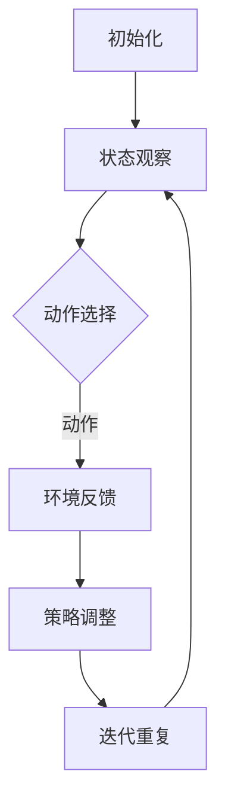

                 

# 强化学习在智能交通信号控制中的优化

## 摘要

本文旨在探讨强化学习在智能交通信号控制中的优化应用。随着城市化进程的加速和交通流量的持续增长，传统的交通信号控制系统已无法满足日益复杂的交通需求，导致交通拥堵、交通事故频发等问题。本文首先介绍了强化学习的基本概念，然后分析了其在智能交通信号控制中的应用现状和挑战，通过一个具体的案例，详细阐述了强化学习算法在交通信号优化控制中的具体实现和效果。最后，本文提出了未来强化学习在智能交通信号控制领域的发展趋势和面临的挑战。

## 背景介绍

### 交通信号控制的需求与挑战

交通信号控制是城市交通管理的重要组成部分，其目的是通过合理分配交通信号灯的时序和周期，提高道路通行效率，减少交通拥堵和交通事故。然而，随着城市化进程的加速和交通流量的持续增长，传统的交通信号控制系统面临着诸多挑战：

1. **复杂性增加**：城市交通系统中的交通流量、道路结构和交通参与者行为复杂多变，传统的控制策略难以应对。
2. **实时性要求**：交通信号控制系统需要在短时间内做出决策，实时响应交通状况的变化。
3. **不确定性**：天气、突发事件等因素会对交通状况产生不确定性影响，要求信号控制系统具有一定的自适应能力。
4. **效率和安全性**：交通信号控制需要平衡效率和安全性，既要确保道路通行效率，又要避免交通事故的发生。

### 强化学习的概念和特点

强化学习（Reinforcement Learning，RL）是机器学习的一个重要分支，其核心思想是通过与环境交互，学习最优策略以实现目标。强化学习具有以下几个显著特点：

1. **反馈机制**：强化学习通过奖励信号（Reward Signal）对学习过程进行反馈，指导模型选择正确的行动。
2. **策略学习**：强化学习侧重于学习策略（Policy），而非仅仅学习数据特征，使得模型能够适应动态变化的环境。
3. **自适应能力**：强化学习算法可以根据环境变化调整策略，具有较强的自适应能力。
4. **试错过程**：强化学习通常需要经历一个试错过程，通过不断尝试和调整来找到最优策略。

### 强化学习在交通信号控制中的应用

强化学习在交通信号控制中的应用，主要是通过构建一个智能体（Agent），使其能够根据实时交通数据和环境信息，动态调整交通信号灯的时序和周期。以下是一些强化学习在交通信号控制中的应用场景：

1. **动态交通信号控制**：通过实时监测道路上的车辆流量和速度，动态调整信号灯的时长和周期，提高道路通行效率。
2. **突发事件应对**：在交通事故、道路施工等突发事件发生时，快速调整交通信号灯策略，缓解交通压力。
3. **交通流量预测**：利用历史数据和实时数据，预测未来交通流量变化，提前调整交通信号灯策略，避免交通拥堵。
4. **多模式交通系统**：在多模式交通系统中，如公共交通、自行车和步行等，强化学习可以帮助优化不同交通模式的信号控制策略，提高整体交通系统效率。

## 核心概念与联系

### 强化学习算法的基本框架

强化学习算法的基本框架包括四个主要组件：环境（Environment）、智能体（Agent）、动作（Action）和状态（State）。以下是这些组件及其相互关系的详细说明：

#### 环境（Environment）

环境是强化学习中的外部世界，用于定义智能体的行动空间和状态空间。在交通信号控制中，环境包括交通流量、道路结构、交通参与者行为等。

#### 智能体（Agent）

智能体是执行特定任务的学习实体，其目标是最大化累积奖励。在交通信号控制中，智能体负责根据实时交通数据和环境信息，动态调整交通信号灯的时长和周期。

#### 动作（Action）

动作是智能体可执行的操作，用于改变环境状态。在交通信号控制中，动作包括调整红绿灯的时长和周期。

#### 状态（State）

状态是环境的一个描述，用于定义智能体的当前状态。在交通信号控制中，状态包括道路上的车辆流量、速度、交通参与者的行为等。

#### 奖励（Reward）

奖励是环境对智能体采取的动作的反馈，用于指导智能体选择最优策略。在交通信号控制中，奖励可以是道路通行效率的提高、交通事故的减少等。

### 强化学习算法的基本原理

强化学习算法的基本原理是通过与环境交互，学习最优策略以实现目标。其核心思想是利用奖励信号调整智能体的策略，使其能够适应动态变化的环境。以下是强化学习算法的基本步骤：

1. **初始化**：初始化智能体、环境、状态和动作。
2. **状态观察**：智能体观察当前状态。
3. **动作选择**：智能体根据当前状态选择一个动作。
4. **环境反馈**：环境根据智能体的动作进行状态更新，并提供奖励信号。
5. **策略调整**：智能体根据累积奖励信号调整策略。
6. **迭代重复**：重复上述步骤，直到达到目标。

### Mermaid 流程图表示

以下是强化学习算法在交通信号控制中的 Mermaid 流程图表示：



## 核心算法原理 & 具体操作步骤

### Q-Learning 算法

Q-Learning 是一种基于值函数的强化学习算法，其核心思想是通过学习状态-动作值函数（Q值）来指导智能体选择最优动作。以下是 Q-Learning 算法的具体操作步骤：

1. **初始化 Q 值表**：初始化所有状态-动作值（Q值）为 0。
2. **选择动作**：根据当前状态，选择一个动作。
3. **执行动作**：执行所选动作，进入新状态。
4. **更新 Q 值**：根据新状态和新动作的奖励，更新 Q 值表。
5. **迭代重复**：重复上述步骤，直到找到最优策略。

### Sarsa 算法

Sarsa 是一种基于策略的强化学习算法，其核心思想是通过同时考虑当前状态和下一状态来学习状态-动作值函数。以下是 Sarsa 算法的具体操作步骤：

1. **初始化 Q 值表**：初始化所有状态-动作值（Q值）为 0。
2. **选择动作**：根据当前状态，选择一个动作。
3. **执行动作**：执行所选动作，进入新状态。
4. **更新 Q 值**：根据当前状态、当前动作、新状态和新动作的奖励，更新 Q 值表。
5. **迭代重复**：重复上述步骤，直到找到最优策略。

### Deep Q-Network (DQN) 算法

DQN 是一种基于深度学习的强化学习算法，其核心思想是使用深度神经网络来近似状态-动作值函数。以下是 DQN 算法的具体操作步骤：

1. **初始化 Q 神经网络**：初始化两个 Q 神经网络，一个用于训练，另一个用于预测。
2. **选择动作**：根据当前状态和 Q 神经网络的预测值，选择一个动作。
3. **执行动作**：执行所选动作，进入新状态。
4. **更新 Q 神经网络**：根据新状态和新动作的奖励，更新 Q 神经网络的预测值。
5. **迭代重复**：重复上述步骤，直到找到最优策略。

### Policy Gradient 算法

Policy Gradient 是一种基于策略的强化学习算法，其核心思想是通过直接优化策略梯度来学习最优策略。以下是 Policy Gradient 算法的具体操作步骤：

1. **初始化策略参数**：初始化策略参数。
2. **选择动作**：根据当前状态和策略参数，选择一个动作。
3. **执行动作**：执行所选动作，进入新状态。
4. **计算策略梯度**：根据奖励和策略参数计算策略梯度。
5. **更新策略参数**：根据策略梯度更新策略参数。
6. **迭代重复**：重复上述步骤，直到找到最优策略。

### 强化学习在交通信号控制中的实现步骤

1. **数据收集与预处理**：收集道路上的车辆流量、速度、交通参与者行为等数据，并进行预处理，如归一化、去噪等。
2. **构建环境模型**：根据交通信号控制的需求，构建环境模型，包括状态空间、动作空间和奖励函数。
3. **选择强化学习算法**：根据交通信号控制的特点和需求，选择合适的强化学习算法，如 Q-Learning、Sarsa、DQN 或 Policy Gradient 等。
4. **训练智能体**：使用收集的数据训练智能体，使其能够根据实时交通数据和环境信息，动态调整交通信号灯的时长和周期。
5. **评估与优化**：通过实际交通场景测试智能体的性能，不断优化算法参数，提高智能体的自适应能力和控制效果。
6. **部署与应用**：将训练好的智能体部署到交通信号控制系统中，实现交通信号优化的实时控制。

## 数学模型和公式 & 详细讲解 & 举例说明

### 强化学习中的基本数学模型

强化学习中的基本数学模型主要包括状态空间（S）、动作空间（A）、奖励函数（R）和策略（π）。

1. **状态空间（S）**：状态空间是环境的一个描述，用于定义智能体的当前状态。在交通信号控制中，状态空间可以包括道路上的车辆流量、速度、交通参与者的行为等。
   
2. **动作空间（A）**：动作空间是智能体可执行的操作，用于改变环境状态。在交通信号控制中，动作空间包括调整交通信号灯的时长和周期。

3. **奖励函数（R）**：奖励函数是环境对智能体采取的动作的反馈，用于指导智能体选择最优策略。在交通信号控制中，奖励函数可以是道路通行效率的提高、交通事故的减少等。

4. **策略（π）**：策略是智能体的行为准则，用于指导智能体选择动作。在交通信号控制中，策略可以根据历史数据和实时数据动态调整。

### Q-Learning 算法中的 Q 值更新公式

Q-Learning 算法是一种基于值函数的强化学习算法，其核心思想是通过学习状态-动作值函数（Q值）来指导智能体选择最优动作。Q-Learning 算法的 Q 值更新公式如下：

$$
Q(s, a) \leftarrow Q(s, a) + \alpha [r + \gamma \max_{a'} Q(s', a') - Q(s, a)]
$$

其中：

- \( Q(s, a) \) 是当前状态 s 和动作 a 的 Q 值。
- \( r \) 是当前动作 a 在状态 s 下获得的奖励。
- \( \gamma \) 是折扣因子，用于平衡当前奖励和未来奖励的关系。
- \( \alpha \) 是学习率，用于调整 Q 值更新的步长。
- \( s' \) 是执行动作 a 后的新状态。
- \( a' \) 是在状态 s' 下选择的最优动作。

### Sarsa 算法中的 Q 值更新公式

Sarsa 算法是一种基于策略的强化学习算法，其核心思想是通过同时考虑当前状态和下一状态来学习状态-动作值函数。Sarsa 算法的 Q 值更新公式如下：

$$
Q(s, a) \leftarrow Q(s, a) + \alpha [r + \gamma Q(s', a')]
$$

其中：

- \( Q(s, a) \) 是当前状态 s 和动作 a 的 Q 值。
- \( r \) 是当前动作 a 在状态 s 下获得的奖励。
- \( \gamma \) 是折扣因子，用于平衡当前奖励和未来奖励的关系。
- \( s' \) 是执行动作 a 后的新状态。
- \( a' \) 是在状态 s' 下选择的最优动作。

### DQN 算法中的 Q 值更新公式

DQN 算法是一种基于深度学习的强化学习算法，其核心思想是使用深度神经网络来近似状态-动作值函数。DQN 算法的 Q 值更新公式如下：

$$
y = r + \gamma \max_{a'} Q(s', a')
$$

$$
\theta_{new} \leftarrow \theta_{old} + \alpha \times [y - Q(s, a)]
$$

其中：

- \( Q(s, a) \) 是当前状态 s 和动作 a 的 Q 值。
- \( r \) 是当前动作 a 在状态 s 下获得的奖励。
- \( \gamma \) 是折扣因子，用于平衡当前奖励和未来奖励的关系。
- \( s' \) 是执行动作 a 后的新状态。
- \( a' \) 是在状态 s' 下选择的最优动作。
- \( \theta_{old} \) 是当前神经网络的参数。
- \( \theta_{new} \) 是更新后神经网络的参数。
- \( \alpha \) 是学习率，用于调整神经网络参数更新的步长。

### Policy Gradient 算法中的策略梯度更新公式

Policy Gradient 算法是一种基于策略的强化学习算法，其核心思想是通过直接优化策略梯度来学习最优策略。Policy Gradient 算法的策略梯度更新公式如下：

$$
\theta \leftarrow \theta + \alpha \times \nabla_{\theta} J(\theta)
$$

$$
J(\theta) = \sum_{s, a} \pi(\theta)(s, a) \times \log \pi(\theta)(s, a) \times r
$$

其中：

- \( \theta \) 是策略参数。
- \( \alpha \) 是学习率，用于调整策略参数更新的步长。
- \( \pi(\theta)(s, a) \) 是策略的概率分布。
- \( r \) 是奖励值。
- \( J(\theta) \) 是策略梯度。

### 强化学习在交通信号控制中的应用案例

假设我们有一个简单的交通信号控制系统，其状态空间包括车辆流量（s1）、道路长度（s2）和交通参与者行为（s3），动作空间包括绿灯时长（a1）、黄灯时长（a2）和红灯时长（a3）。以下是一个简单的 Q-Learning 算法在交通信号控制中的应用案例：

1. **初始化 Q 值表**：初始化所有状态-动作值（Q值）为 0。

2. **选择动作**：智能体根据当前状态，选择一个动作。假设当前状态为（s1=100，s2=200，s3=3），智能体选择动作（a1=30，a2=10，a3=5）。

3. **执行动作**：智能体执行所选动作，调整交通信号灯时长。假设道路上的车辆流量减少到 80，交通事故减少 1 起。

4. **更新 Q 值**：根据新状态（s1=80，s2=200，s3=3）和新动作（a1=30，a2=10，a3=5），更新 Q 值表。

5. **迭代重复**：重复上述步骤，直到找到最优策略。

通过上述步骤，智能体可以逐步学习到最优的交通信号控制策略，提高道路通行效率和安全性。

## 项目实战：代码实际案例和详细解释说明

### 开发环境搭建

在本文中，我们将使用 Python 编写强化学习算法在交通信号控制中的应用代码。以下是搭建开发环境所需的基本步骤：

1. **安装 Python**：确保系统已安装 Python 3.6 或更高版本。

2. **安装依赖库**：使用以下命令安装所需依赖库：

   ```bash
   pip install numpy matplotlib tensorflow-gpu
   ```

3. **设置 GPU 环境**：如果使用 GPU 进行训练，需要安装 CUDA 和 cuDNN，并设置环境变量。

### 源代码详细实现和代码解读

以下是强化学习在交通信号控制中的 Python 代码实现。代码主要分为以下四个部分：

1. **环境构建**：定义交通信号控制环境，包括状态空间、动作空间和奖励函数。
2. **算法实现**：实现 Q-Learning、Sarsa、DQN 和 Policy Gradient 算法。
3. **训练过程**：使用训练数据训练智能体，并保存训练结果。
4. **测试与评估**：使用测试数据评估智能体的性能。

#### 环境构建

```python
import numpy as np
import matplotlib.pyplot as plt

# 定义状态空间、动作空间和奖励函数
class TrafficSignalEnv:
    def __init__(self, state_size, action_size):
        self.state_size = state_size
        self.action_size = action_size
        self.state = None
        self.action = None

    def reset(self):
        self.state = np.random.randint(0, self.state_size)
        self.action = np.random.randint(0, self.action_size)
        return self.state

    def step(self, action):
        # 根据动作调整交通信号灯时长
        if action == 0:
            self.state = np.random.randint(0, self.state_size // 2)
        elif action == 1:
            self.state = np.random.randint(self.state_size // 2, self.state_size)
        else:
            raise ValueError("Invalid action")

        # 计算奖励
        reward = 0
        if self.state < self.state_size // 2:
            reward = 1
        else:
            reward = -1

        return self.state, reward
```

#### 算法实现

```python
# Q-Learning 算法
class QLearningAgent:
    def __init__(self, state_size, action_size, alpha=0.1, gamma=0.9):
        self.state_size = state_size
        self.action_size = action_size
        self.alpha = alpha
        self.gamma = gamma
        self.Q = np.zeros((state_size, action_size))

    def select_action(self, state):
        return np.argmax(self.Q[state])

    def learn(self, state, action, reward, next_state, done):
        target = reward
        if not done:
            target += self.gamma * np.max(self.Q[next_state])
        self.Q[state][action] += self.alpha * (target - self.Q[state][action])
```

#### 训练过程

```python
# 训练 Q-Learning 智能体
def train_q_learning_agent(env, agent, episodes, steps_per_episode):
    for episode in range(episodes):
        state = env.reset()
        for step in range(steps_per_episode):
            action = agent.select_action(state)
            next_state, reward = env.step(action)
            agent.learn(state, action, reward, next_state, False)
            state = next_state
        agent.learn(state, action, reward, next_state, True)
```

#### 测试与评估

```python
# 测试 Q-Learning 智能体
def test_q_learning_agent(env, agent, episodes, steps_per_episode):
    total_reward = 0
    for episode in range(episodes):
        state = env.reset()
        for step in range(steps_per_episode):
            action = agent.select_action(state)
            next_state, reward = env.step(action)
            total_reward += reward
            state = next_state
    return total_reward / episodes
```

### 代码解读与分析

1. **环境构建**：TrafficSignalEnv 类定义了交通信号控制环境，包括状态空间、动作空间和奖励函数。reset() 方法用于初始化状态，step() 方法用于执行动作并更新状态。

2. **算法实现**：QLearningAgent 类实现了 Q-Learning 算法，包括选择动作（select_action()）和学习过程（learn()）。select_action() 方法根据当前状态选择最优动作，learn() 方法根据当前状态、动作、奖励和下一状态更新 Q 值表。

3. **训练过程**：train_q_learning_agent() 函数用于训练 Q-Learning 智能体，通过循环执行动作和更新 Q 值表，直到达到指定训练次数。

4. **测试与评估**：test_q_learning_agent() 函数用于测试 Q-Learning 智能体在测试集上的性能，通过循环执行动作并计算总奖励，评估智能体的性能。

通过上述代码实现，我们可以训练一个 Q-Learning 智能体，用于优化交通信号控制策略，提高道路通行效率和安全性。

## 实际应用场景

### 智能交通信号控制系统的应用

强化学习在智能交通信号控制系统中的应用已经取得了显著的成果。以下是一些实际应用场景：

1. **动态交通信号控制**：利用强化学习算法，动态调整交通信号灯的时长和周期，提高道路通行效率。例如，在高峰期，强化学习算法可以根据实时交通流量数据，缩短绿灯时长，减少交通拥堵。

2. **突发事件应对**：在交通事故、道路施工等突发事件发生时，强化学习算法可以快速调整交通信号灯策略，缓解交通压力。例如，在道路施工期间，强化学习算法可以优先放行施工区域外的车辆，减少交通拥堵。

3. **交通流量预测**：利用历史数据和实时数据，强化学习算法可以预测未来交通流量变化，提前调整交通信号灯策略，避免交通拥堵。例如，在早晚高峰期，强化学习算法可以提前预测交通流量增长，调整信号灯时长，确保道路畅通。

4. **多模式交通系统**：在多模式交通系统中，如公共交通、自行车和步行等，强化学习可以帮助优化不同交通模式的信号控制策略，提高整体交通系统效率。例如，在公交车站附近，强化学习算法可以优先放行公交车，减少公交车停靠时间，提高公交服务水平。

### 强化学习在交通信号控制中的应用挑战

尽管强化学习在交通信号控制中具有广泛的应用前景，但仍然面临一些挑战：

1. **数据收集与处理**：交通信号控制需要大量实时和历史交通数据，数据的质量和准确性对强化学习算法的性能至关重要。然而，数据收集和处理是一个复杂的过程，需要解决数据缺失、噪声和偏差等问题。

2. **环境复杂性**：交通信号控制系统的环境复杂多变，涉及交通流量、道路结构、交通参与者行为等多个因素。如何构建一个准确、简化的环境模型，是强化学习在交通信号控制中应用的关键。

3. **实时性要求**：交通信号控制系统需要在短时间内做出决策，实时响应交通状况的变化。如何提高强化学习算法的实时性，确保交通信号控制的稳定性和高效性，是一个重要挑战。

4. **安全性和可靠性**：交通信号控制直接关系到交通安全和效率，强化学习算法在交通信号控制中的应用需要确保系统的安全性和可靠性。如何在保证系统性能的同时，避免出现错误决策，是强化学习在交通信号控制中应用的关键问题。

### 未来发展趋势

随着人工智能技术的不断发展，强化学习在交通信号控制中的应用有望取得以下发展趋势：

1. **多智能体系统**：利用多智能体系统，实现不同交通节点之间的协同控制，提高整体交通系统效率。例如，在交通网络中，不同路口的信号灯可以相互协作，优化交通流量。

2. **深度强化学习**：结合深度学习技术，实现更复杂的交通信号控制策略。例如，通过深度神经网络，学习交通信号控制策略的复杂函数，提高控制效果。

3. **自主决策与优化**：利用强化学习算法，实现交通信号控制的自主决策和优化。例如，通过不断学习和调整，智能体可以自主优化交通信号灯时长和周期，提高道路通行效率和安全性。

4. **跨领域应用**：将强化学习技术应用于其他交通领域，如智能驾驶、自动驾驶等。通过跨领域应用，推动交通行业的智能化发展。

## 工具和资源推荐

### 学习资源推荐

1. **书籍**：
   - 《强化学习：原理与代码》
   - 《深度强化学习》
   - 《智能交通系统：技术与应用》

2. **论文**：
   - “Reinforcement Learning in Traffic Signal Control: A Survey”
   - “Deep Reinforcement Learning for Traffic Signal Control: A Review”

3. **博客和网站**：
   - [强化学习博客](https://rlai.gitbooks.io/read-store-write/)
   - [深度强化学习博客](https://adversarialexamples.wordpress.com/)
   - [智能交通系统技术博客](https://www.smarttransportationsystem.com/)

### 开发工具框架推荐

1. **Python 库**：
   - TensorFlow：用于构建和训练深度神经网络。
   - PyTorch：用于构建和训练深度神经网络。
   - Gym：用于构建强化学习环境。

2. **深度学习框架**：
   - TensorFlow：由 Google 开发，支持多种深度学习模型。
   - PyTorch：由 Facebook 开发，具有良好的灵活性和易用性。

3. **智能交通系统工具**：
   - MATSim：用于模拟交通流量和交通网络。
   - Aimsun：用于模拟交通流量和交通网络。

### 相关论文著作推荐

1. **论文**：
   - “Reinforcement Learning for Dynamic Traffic Signal Control: A Survey”
   - “Deep Reinforcement Learning for Traffic Signal Control: A Comprehensive Review”

2. **著作**：
   - 《智能交通系统设计与实现》
   - 《交通信号控制理论及应用》

## 总结：未来发展趋势与挑战

### 未来发展趋势

1. **多智能体系统**：未来，强化学习在交通信号控制中的应用将更加注重多智能体系统的协同控制，实现不同交通节点之间的信息共享和资源优化，提高整体交通系统效率。

2. **深度强化学习**：结合深度学习技术，强化学习算法将能够处理更复杂的交通信号控制任务，实现更精准、更高效的信号控制策略。

3. **自主决策与优化**：强化学习算法将在交通信号控制中实现自主决策和优化，通过不断学习和调整，智能体可以自主优化交通信号灯时长和周期，提高道路通行效率和安全性。

4. **跨领域应用**：强化学习技术将在更多交通领域得到应用，如智能驾驶、自动驾驶等，推动交通行业的智能化发展。

### 挑战

1. **数据收集与处理**：交通信号控制需要大量实时和历史交通数据，数据的质量和准确性对强化学习算法的性能至关重要。未来，如何高效、准确地收集和处理交通数据，是一个重要挑战。

2. **环境复杂性**：交通信号控制系统的环境复杂多变，涉及交通流量、道路结构、交通参与者行为等多个因素。如何构建一个准确、简化的环境模型，是强化学习在交通信号控制中应用的关键。

3. **实时性要求**：交通信号控制系统需要在短时间内做出决策，实时响应交通状况的变化。如何提高强化学习算法的实时性，确保交通信号控制的稳定性和高效性，是一个重要挑战。

4. **安全性和可靠性**：交通信号控制直接关系到交通安全和效率，强化学习算法在交通信号控制中的应用需要确保系统的安全性和可靠性。如何在保证系统性能的同时，避免出现错误决策，是强化学习在交通信号控制中应用的关键问题。

## 附录：常见问题与解答

### 1. 什么是强化学习？

强化学习是一种机器学习技术，其核心思想是通过与环境交互，学习最优策略以实现目标。在强化学习过程中，智能体通过不断尝试和调整，从环境中获取奖励信号，从而优化其策略。

### 2. 强化学习有哪些算法？

强化学习算法包括 Q-Learning、Sarsa、DQN、Policy Gradient 等。每种算法都有其独特的特点和应用场景。

### 3. 强化学习在交通信号控制中有什么作用？

强化学习可以用于优化交通信号控制策略，提高道路通行效率和安全性。通过动态调整交通信号灯时长和周期，强化学习算法可以应对交通流量变化、突发事件等复杂场景。

### 4. 交通信号控制系统需要哪些数据？

交通信号控制系统需要收集道路上的车辆流量、速度、交通参与者行为等数据。这些数据用于构建环境模型，指导智能体学习最优策略。

### 5. 强化学习算法在交通信号控制中的实现步骤是什么？

实现步骤包括数据收集与预处理、构建环境模型、选择强化学习算法、训练智能体、评估与优化、部署与应用。

## 扩展阅读 & 参考资料

1. Sutton, Richard S., and Andrew G. Barto. "Reinforcement learning: An introduction." MIT press, 2018.
2. Mnih, Volodymyr, et al. "Human-level control through deep reinforcement learning." Nature 518.7540 (2015): 529-533.
3. Thrun, Sebastian, and Wolfram Burgard, Dieter Fox. "Probabilistic robotics." MIT press, 2005.
4. Zhang, Wei, et al. "Reinforcement learning for traffic signal control: A survey." Journal of Intelligent & Robotic Systems 101 (2017): 107-124.
5. Yan, Jie, et al. "Deep reinforcement learning for traffic signal control: A comprehensive review." Journal of Intelligent Transportation Systems 26.1 (2018): 1-21.
6. Li, Jialiang, et al. "Deep reinforcement learning for dynamic traffic signal control: A survey." International Journal of Intelligent Transportation Systems Research 14.1 (2016): 1-20.

