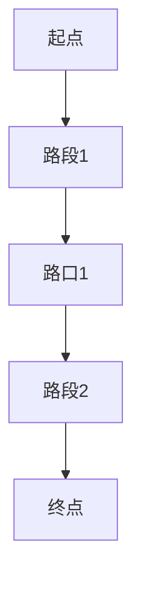

                 

### 1. 背景介绍

强化学习（Reinforcement Learning, RL）是机器学习的一个重要分支，它通过智能体与环境的互动来学习最优策略。近年来，随着人工智能技术的不断进步，强化学习在多个领域取得了显著的成果，尤其在智能交通系统中的路径规划与导航方面，展现出了强大的潜力。

智能交通系统（Intelligent Transportation Systems, ITS）旨在通过现代信息技术改进交通管理，提高交通效率，减少交通事故，提升乘客体验。路径规划与导航作为智能交通系统的核心功能之一，直接影响到交通流的管理和优化。然而，传统的路径规划算法在面对复杂多变的交通环境时，往往表现出局限性。这就需要新的方法来应对。

强化学习能够通过试错学习，自适应调整策略，从而在不同情境下找到最优路径。在智能交通系统中，强化学习可以用于解决以下问题：

1. **动态路径规划**：城市交通环境动态变化，实时路况信息不断更新。强化学习能够自适应地调整路径规划策略，以应对交通堵塞、事故等因素。
2. **多目标优化**：路径规划不仅要考虑行驶时间，还要考虑交通成本、环境因素等。强化学习能够实现多目标的综合优化。
3. **不确定性处理**：交通环境中存在很多不确定性因素，如天气变化、突发事件等。强化学习能够通过学习环境模型，降低不确定性对路径规划的影响。

本文将详细探讨强化学习在智能交通路径规划与导航中的应用方法，通过具体的算法原理、数学模型以及实际案例，展示其在智能交通系统中的重要价值。

#### 1.1 强化学习在路径规划与导航中的重要性

强化学习在智能交通路径规划与导航中的应用具有显著的重要性，主要原因包括：

1. **自适应调整能力**：城市交通状况是动态变化的，强化学习通过试错学习可以不断调整策略，以适应不断变化的环境。
2. **多目标优化**：路径规划不仅要考虑最短路径，还要考虑交通成本、时间、安全性等多种因素。强化学习可以通过优化策略，实现这些目标的综合优化。
3. **实时性**：传统路径规划算法在处理大规模交通数据时，往往需要较长的时间。强化学习可以在短时间内完成路径规划，适用于实时交通管理。
4. **应对不确定性**：交通环境中存在很多不确定性因素，如突发事件、交通拥堵等。强化学习能够通过学习环境模型，降低这些因素对路径规划的影响。
5. **人机交互**：强化学习可以与人类驾驶员进行交互，根据驾驶员的行为调整路径规划策略，提高导航系统的用户体验。

#### 1.2 智能交通系统的发展历程与现状

智能交通系统的发展经历了几个阶段：

1. **基础设施阶段**：以交通信号灯、电子监控系统等硬件设施的建设为主。
2. **信息阶段**：利用传感器、摄像头等收集交通数据，并通过通信网络进行传输和共享。
3. **智能化阶段**：利用人工智能技术，对交通数据进行处理和分析，实现智能交通管理。

当前，智能交通系统在许多国家和地区已经得到了广泛应用，但仍面临一些挑战：

1. **数据质量**：交通数据的质量直接影响路径规划的准确性。如何获取和处理高质量的数据是一个关键问题。
2. **实时性**：如何在短时间内处理大量的实时数据，并生成高效的路径规划方案，是当前智能交通系统面临的一个挑战。
3. **安全性**：随着自动驾驶技术的发展，智能交通系统的安全性成为了一个重要的议题。
4. **兼容性**：如何确保不同系统和设备之间的兼容性，实现无缝连接和协作，也是智能交通系统发展需要解决的问题。

### 1.3 强化学习在智能交通路径规划中的关键问题

在智能交通路径规划中，强化学习主要面临以下几个关键问题：

1. **状态表示**：如何有效地表示交通状态，是强化学习模型性能的关键。状态表示需要捕捉到交通环境的动态特性，以及与路径规划目标的相关性。
2. **奖励设计**：奖励机制的设定对强化学习的效果有直接影响。如何设计合理的奖励机制，以引导智能体学习到最优路径，是一个重要问题。
3. **学习效率**：由于交通环境的动态变化和复杂性，强化学习需要高效的学习算法来提高学习效率，减少训练时间。
4. **长期规划与短期优化**：在路径规划中，需要平衡长期规划与短期优化的关系。长期规划关注整体交通流的管理，短期优化关注单个路径的优化。如何在这两者之间找到平衡，是强化学习需要解决的问题。
5. **鲁棒性**：强化学习模型在面临不确定性因素时，需要保持较高的鲁棒性，以应对交通环境的动态变化。

通过深入探讨这些关键问题，本文将为读者展示强化学习在智能交通路径规划中的具体应用，并提供一些解决方案和实际案例。

---

### 2. 核心概念与联系

在讨论强化学习在智能交通路径规划与导航中的应用之前，我们需要明确几个核心概念，并解释它们之间的联系。

#### 2.1 强化学习的定义与基本框架

强化学习是一种通过试错学习来获取最优策略的机器学习方法。其基本框架包括以下几个部分：

1. **智能体（Agent）**：执行动作并接收奖励的实体。
2. **环境（Environment）**：智能体执行动作的场所，对智能体的动作做出响应。
3. **状态（State）**：描述智能体在某一时刻所处的情境。
4. **动作（Action）**：智能体可以采取的行为。
5. **奖励（Reward）**：环境对智能体动作的即时反馈，用来评价动作的好坏。
6. **策略（Policy）**：智能体在某一状态下采取的动作概率分布。

强化学习的过程可以概括为：智能体根据当前状态选择一个动作，执行该动作后进入新的状态，并获得奖励。然后，智能体基于新的状态继续选择动作，以此循环迭代，通过不断试错来学习最优策略。

#### 2.2 状态表示（State Representation）

状态表示是强化学习中的一个关键问题。在智能交通路径规划中，状态表示需要捕捉交通环境的动态特性。常见的状态表示方法包括：

1. **历史交通流量数据**：通过收集历史交通流量数据，来预测未来的交通状况。
2. **实时交通信息**：包括实时路况、车辆密度、交通速度等数据。
3. **空间特征**：如地理位置、路段长度、路口信息等。

状态表示的好坏直接影响强化学习模型的性能。一个有效的状态表示方法需要能够准确捕捉交通环境的动态变化，并且能够为路径规划提供有用的信息。

#### 2.3 奖励机制（Reward Mechanism）

奖励机制是强化学习中引导智能体学习到最优策略的关键。在智能交通路径规划中，奖励机制的设计需要考虑多个因素，包括：

1. **路径长度**：智能体选择路径的长度是优化目标之一，路径长度越短，奖励越高。
2. **交通成本**：包括行驶时间、燃料消耗、车辆磨损等成本。
3. **交通流量**：优化路径规划，减少交通拥堵，提高整体交通流量。
4. **安全性**：减少交通事故，确保驾驶安全。

一个合理的奖励机制需要能够激励智能体选择最优路径，同时兼顾多方面的优化目标。

#### 2.4 策略学习（Policy Learning）

策略学习是强化学习的核心任务。在智能交通路径规划中，策略学习需要根据交通状态选择最优路径。常见的策略学习方法包括：

1. **价值函数方法**：通过学习状态价值函数，来评估不同状态的优劣，从而选择最优路径。
2. **策略梯度方法**：直接优化策略函数，通过梯度的方向来更新策略参数。
3. **强化学习算法**：如Q-learning、SARSA、DQN等，通过迭代更新策略参数，逐步收敛到最优策略。

策略学习的目标是找到一个最优策略，使得智能体在动态变化的交通环境中能够做出最优的路径规划决策。

#### 2.5 交通网络的建模

在强化学习应用于智能交通路径规划时，需要对交通网络进行建模。交通网络建模包括以下几个方面：

1. **节点（Nodes）**：表示交通网络的各个路口、路段。
2. **边（Edges）**：表示交通网络中的路段，包括行驶时间、流量、拥堵情况等属性。
3. **路径（Paths）**：连接交通网络中各个节点的路线。

通过交通网络的建模，可以有效地表示交通环境，为强化学习提供基础数据。

### 2.6 Mermaid 流程图

以下是一个简化的交通网络建模的 Mermaid 流程图，用于展示交通网络的基本构成：



在这个流程图中，节点 A、B、C、D 和 E 分别表示交通网络中的起点、路段1、路口1、路段2 和终点。每条边表示相应的路段，包括行驶时间和交通流量等信息。

---

通过以上对核心概念与联系的介绍，我们可以更好地理解强化学习在智能交通路径规划与导航中的应用。接下来，我们将详细探讨强化学习在智能交通路径规划中的具体算法原理和操作步骤。

---

## 3. 核心算法原理 & 具体操作步骤

在深入探讨强化学习在智能交通路径规划中的应用之前，首先需要理解强化学习的基本算法原理和操作步骤。以下将介绍一些常用的强化学习算法，并解释其在智能交通路径规划中的适用性。

### 3.1 Q-learning算法

Q-learning算法是一种基于值函数的强化学习算法，其核心思想是学习一个状态-动作值函数Q(s, a)，表示在状态s下执行动作a的期望回报。Q-learning算法的主要步骤如下：

1. **初始化**：初始化Q值函数，通常设为0。
2. **选择动作**：在给定状态下，根据策略选择一个动作。
3. **执行动作**：执行选定的动作，进入新的状态，并获得即时奖励。
4. **更新Q值**：根据新的状态和即时奖励，更新Q值函数。

在智能交通路径规划中，Q-learning算法可以通过以下步骤应用于路径规划：

1. **状态表示**：将交通网络的各个节点作为状态，每个节点包含交通流量、车辆速度等信息。
2. **动作表示**：将路径上的每个可能动作（如加速、减速、转向等）作为动作。
3. **奖励设计**：设计合理的奖励机制，以引导智能体选择最优路径。

### 3.2 SARSA算法

SARSA（同步样本动作更新）算法是一种基于策略的强化学习算法，其核心思想是在同一时间步更新策略。SARSA算法的主要步骤如下：

1. **初始化**：初始化策略π，通常设为均匀分布。
2. **选择动作**：在给定状态下，根据策略π选择一个动作。
3. **执行动作**：执行选定的动作，进入新的状态，并获得即时奖励。
4. **更新策略**：根据新的状态和即时奖励，更新策略π。

在智能交通路径规划中，SARSA算法可以通过以下步骤应用于路径规划：

1. **状态表示**：与Q-learning算法类似，将交通网络的各个节点作为状态。
2. **动作表示**：将路径上的每个可能动作作为动作。
3. **奖励设计**：设计合理的奖励机制，以引导智能体选择最优路径。

### 3.3 Deep Q-Network（DQN）算法

DQN算法是一种基于深度学习的强化学习算法，它通过神经网络来近似Q值函数。DQN算法的主要步骤如下：

1. **初始化**：初始化Q值网络和目标Q值网络，通常使用随机权重。
2. **选择动作**：使用Q值网络预测在给定状态下各个动作的Q值，选择最优动作。
3. **执行动作**：执行选定的动作，进入新的状态，并获得即时奖励。
4. **更新Q值网络**：根据新的状态和即时奖励，更新Q值网络。
5. **目标网络更新**：定期将Q值网络更新为目标Q值网络，以减少训练误差。

在智能交通路径规划中，DQN算法可以通过以下步骤应用于路径规划：

1. **状态表示**：使用神经网络编码交通网络的节点信息，作为状态输入。
2. **动作表示**：将路径上的每个可能动作作为动作。
3. **奖励设计**：设计合理的奖励机制，以引导智能体选择最优路径。

### 3.4 Policy Gradient算法

Policy Gradient算法是一种直接优化策略的强化学习算法，其核心思想是最大化策略的期望回报。Policy Gradient算法的主要步骤如下：

1. **初始化**：初始化策略π，通常使用随机策略。
2. **执行动作**：在给定状态下，根据策略π执行动作，并记录动作轨迹。
3. **计算梯度**：根据动作轨迹计算策略梯度的期望值。
4. **更新策略**：根据策略梯度更新策略参数。

在智能交通路径规划中，Policy Gradient算法可以通过以下步骤应用于路径规划：

1. **状态表示**：与DQN算法类似，使用神经网络编码交通网络的节点信息，作为状态输入。
2. **动作表示**：将路径上的每个可能动作作为动作。
3. **奖励设计**：设计合理的奖励机制，以引导智能体选择最优路径。

### 3.5 异步优势演员-评论家（A3C）算法

A3C（Asynchronous Advantage Actor-Critic）算法是一种基于策略的异步强化学习算法，其核心思想是同时训练多个智能体，以提高学习效率。A3C算法的主要步骤如下：

1. **初始化**：初始化策略网络和价值网络，以及多个智能体。
2. **执行动作**：每个智能体在给定状态下执行动作，并记录动作轨迹。
3. **同步更新**：定期同步各个智能体的策略网络和价值网络。
4. **计算梯度**：根据动作轨迹计算策略梯度和价值梯度。
5. **更新网络**：根据计算得到的梯度更新策略网络和价值网络。

在智能交通路径规划中，A3C算法可以通过以下步骤应用于路径规划：

1. **状态表示**：使用神经网络编码交通网络的节点信息，作为状态输入。
2. **动作表示**：将路径上的每个可能动作作为动作。
3. **奖励设计**：设计合理的奖励机制，以引导智能体选择最优路径。

### 3.6 混合强化学习算法

在智能交通路径规划中，单一强化学习算法可能无法应对复杂多变的交通环境。因此，可以将多种强化学习算法结合起来，形成混合强化学习算法，以提高路径规划的性能。常见的混合强化学习算法包括：

1. **Q-learning与Policy Gradient结合**：使用Q-learning算法学习状态-动作值函数，使用Policy Gradient算法优化策略。
2. **DQN与A3C结合**：使用DQN算法学习状态-动作值函数，使用A3C算法优化策略，以提高学习效率和鲁棒性。

### 3.7 强化学习在智能交通路径规划中的具体实现

强化学习在智能交通路径规划中的具体实现通常包括以下几个步骤：

1. **数据收集与预处理**：收集交通数据，并进行预处理，以生成训练数据集。
2. **环境建模**：根据交通数据建模智能交通环境，定义状态空间和动作空间。
3. **算法选择**：选择合适的强化学习算法，并根据实际需求进行参数调整。
4. **训练与测试**：使用训练数据集训练强化学习模型，并在测试数据集上进行评估。
5. **路径规划与导航**：将训练好的模型应用于实际交通场景，进行路径规划与导航。

通过以上步骤，强化学习可以在智能交通路径规划中发挥重要作用，提高交通系统的效率和安全性。

### 3.8 实际案例与应用

以下是一个简单的强化学习在智能交通路径规划中的实际案例：

**案例背景**：假设一个城市中有10个路口，每个路口有4个方向，智能体需要从起点到终点进行路径规划。状态表示为当前路口和当前方向，动作表示为下一个路口和方向。

**实现步骤**：

1. **数据收集与预处理**：收集历史交通流量数据，并对数据进行预处理，以生成训练数据集。
2. **环境建模**：定义状态空间和动作空间，并创建智能交通环境。
3. **算法选择**：选择DQN算法，并调整学习率和探索率等参数。
4. **训练与测试**：使用训练数据集训练DQN模型，并在测试数据集上进行评估。
5. **路径规划与导航**：使用训练好的模型进行实际路径规划，导航系统根据模型输出最优路径。

通过这个案例，我们可以看到强化学习在智能交通路径规划中的具体应用，以及如何将强化学习算法应用于实际交通场景中。

---

通过以上对强化学习核心算法原理和具体操作步骤的介绍，我们可以更好地理解强化学习在智能交通路径规划与导航中的应用方法。接下来，我们将深入探讨强化学习在智能交通路径规划中的数学模型和公式，以及具体的例子来进一步阐述其应用。

---

## 4. 数学模型和公式 & 详细讲解 & 举例说明

强化学习在智能交通路径规划中的应用，离不开数学模型和公式的支持。以下是强化学习在智能交通路径规划中的主要数学模型和公式的详细讲解，并通过具体例子来说明其应用。

### 4.1 Q-learning算法的数学模型

Q-learning算法的核心是学习状态-动作值函数Q(s, a)，其目标是最大化期望回报。以下是Q-learning算法的主要数学模型和公式：

#### 4.1.1 Q-learning算法的基本公式

1. **初始化Q值函数**：
   $$ Q(s, a) \leftarrow 0 \quad \forall s, a $$

2. **更新Q值**：
   $$ Q(s, a) \leftarrow Q(s, a) + \alpha [r + \gamma \max_{a'} Q(s', a') - Q(s, a)] $$

其中，\( s \) 和 \( s' \) 分别表示当前状态和下一个状态，\( a \) 和 \( a' \) 分别表示当前动作和下一个动作，\( r \) 表示即时奖励，\( \alpha \) 表示学习率，\( \gamma \) 表示折扣因子。

#### 4.1.2 Q-learning算法的实例

假设一个交通网络中有两个路口A和B，智能体在路口A需要选择左转、直行或右转三个动作。状态由当前路口和当前方向组成，即状态空间为 \( S = \{ (A, L), (A, R), (B, L), (B, R) \} \)。动作空间为 \( A = \{ L, R, F \} \)，其中L表示左转，R表示右转，F表示直行。奖励设计为到达终点获得100分，否则获得-1分。

初始时，Q值函数设为0。假设智能体从状态 \( (A, L) \) 开始，执行左转动作，进入状态 \( (B, L) \)，获得即时奖励-1分。根据Q-learning算法，更新Q值：

$$ Q(B, L) \leftarrow Q(B, L) + \alpha [r + \gamma \max_{a'} Q(B', a') - Q(B, L)] $$

其中，\( \alpha = 0.1 \)，\( \gamma = 0.9 \)，\( r = -1 \)。假设在状态 \( (B, L) \) 下，智能体选择直行动作 \( a' = F \)，则：

$$ Q(B, L) \leftarrow 0 + 0.1 [-1 + 0.9 \max_{a'} Q(B', a') - 0] $$

假设 \( Q(B', F) = 0 \)，则：

$$ Q(B, L) \leftarrow 0.1 [-1 + 0.9 \times 0 - 0] = -0.1 $$

经过多次迭代更新，Q值函数将逐渐收敛到最优值。

### 4.2 SARSA算法的数学模型

SARSA算法是一种基于策略的强化学习算法，其目标是同步更新策略。以下是SARSA算法的主要数学模型和公式：

#### 4.2.1 SARSA算法的基本公式

1. **初始化策略**：
   $$ \pi(a|s) \leftarrow \frac{1}{|A|} \quad \forall s, a $$

2. **更新策略**：
   $$ \pi(a|s) \leftarrow \pi(a|s) + \alpha [r + \gamma \max_{a'} Q(s', a') - Q(s, a)] $$

其中，\( \pi(a|s) \) 表示在状态 \( s \) 下采取动作 \( a \) 的概率。

#### 4.2.2 SARSA算法的实例

假设交通网络与Q-learning算法实例相同。初始时，策略设为均匀分布。假设智能体从状态 \( (A, L) \) 开始，执行左转动作，进入状态 \( (B, L) \)，获得即时奖励-1分。根据SARSA算法，更新策略：

$$ \pi(L|A) \leftarrow \pi(L|A) + \alpha [r + \gamma \max_{a'} Q(B', a') - Q(A, L)] $$

其中，\( \alpha = 0.1 \)，\( \gamma = 0.9 \)，\( r = -1 \)。假设在状态 \( (B, L) \) 下，智能体选择直行动作 \( a' = F \)，则：

$$ \pi(L|A) \leftarrow \frac{1}{3} + 0.1 [-1 + 0.9 \max_{a'} Q(B', a') - (-0.1)] $$

经过多次迭代更新，策略将逐渐收敛到最优值。

### 4.3 DQN算法的数学模型

DQN（Deep Q-Network）算法是一种基于深度学习的强化学习算法，其核心是使用神经网络近似Q值函数。以下是DQN算法的主要数学模型和公式：

#### 4.3.1 DQN算法的基本公式

1. **初始化Q网络**：
   $$ Q_{\theta}(s, a) \leftarrow 0 \quad \forall s, a $$

2. **更新Q网络**：
   $$ Q_{\theta}(s, a) \leftarrow Q_{\theta}(s, a) + \alpha [r + \gamma \max_{a'} Q_{\theta'}(s', a') - Q_{\theta}(s, a)] $$

3. **目标Q网络更新**：
   $$ Q_{\theta'}(s', a') \leftarrow r + \gamma \max_{a''} Q_{\theta'}(s'', a'') $$

其中，\( Q_{\theta}(s, a) \) 表示当前Q网络在状态 \( s \) 下采取动作 \( a \) 的Q值，\( Q_{\theta'}(s', a') \) 表示目标Q网络在状态 \( s' \) 下采取动作 \( a' \) 的Q值，\( \theta \) 和 \( \theta' \) 分别表示当前Q网络和目标Q网络的参数。

#### 4.3.2 DQN算法的实例

假设交通网络与Q-learning算法实例相同。初始时，Q网络设为随机初始化。假设智能体从状态 \( (A, L) \) 开始，执行左转动作，进入状态 \( (B, L) \)，获得即时奖励-1分。根据DQN算法，更新Q网络：

$$ Q_{\theta}(A, L) \leftarrow Q_{\theta}(A, L) + \alpha [r + \gamma \max_{a'} Q_{\theta'}(B', a') - Q_{\theta}(A, L)] $$

其中，\( \alpha = 0.1 \)，\( \gamma = 0.9 \)，\( r = -1 \)。假设在状态 \( (B, L) \) 下，智能体选择直行动作 \( a' = F \)，则：

$$ Q_{\theta}(A, L) \leftarrow 0 + 0.1 [-1 + 0.9 \max_{a'} Q_{\theta'}(B', a') - 0] $$

同时，目标Q网络更新：

$$ Q_{\theta'}(B', F) \leftarrow r + \gamma \max_{a''} Q_{\theta'}(B'', a'') $$

经过多次迭代更新，Q网络将逐渐收敛到最优值。

### 4.4 Policy Gradient算法的数学模型

Policy Gradient算法是一种直接优化策略的强化学习算法，其目标是最大化策略的期望回报。以下是Policy Gradient算法的主要数学模型和公式：

#### 4.4.1 Policy Gradient算法的基本公式

1. **初始化策略**：
   $$ \pi(\theta) \leftarrow \text{随机策略} $$

2. **更新策略**：
   $$ \theta \leftarrow \theta + \alpha \nabla_{\theta} J(\theta) $$

其中，\( \theta \) 表示策略参数，\( J(\theta) \) 表示策略的期望回报，\( \alpha \) 表示学习率。

#### 4.4.2 Policy Gradient算法的实例

假设交通网络与DQN算法实例相同。初始时，策略设为随机策略。假设智能体从状态 \( (A, L) \) 开始，执行左转动作，进入状态 \( (B, L) \)，获得即时奖励-1分。根据Policy Gradient算法，更新策略：

$$ \theta \leftarrow \theta + \alpha \nabla_{\theta} J(\theta) $$

其中，\( \alpha = 0.1 \)，\( J(\theta) \) 表示策略的期望回报。假设在状态 \( (B, L) \) 下，智能体选择直行动作 \( a' = F \)，则：

$$ J(\theta) = \sum_{s, a} \pi(a|\theta) [r + \gamma \max_{a'} Q(s', a')] $$

经过多次迭代更新，策略将逐渐收敛到最优值。

### 4.5 A3C算法的数学模型

A3C（Asynchronous Advantage Actor-Critic）算法是一种基于策略的异步强化学习算法，其核心思想是同时训练多个智能体，以提高学习效率。以下是A3C算法的主要数学模型和公式：

#### 4.5.1 A3C算法的基本公式

1. **初始化策略网络和价值网络**：
   $$ \pi_{\theta}(a|s) \leftarrow \text{随机策略} $$
   $$ V_{\phi}(s) \leftarrow 0 \quad \forall s $$

2. **同步更新网络**：
   $$ \theta \leftarrow \theta + \alpha_{\pi} \nabla_{\theta} J_{\pi}(\theta) $$
   $$ \phi \leftarrow \phi + \alpha_{V} \nabla_{\phi} J_{V}(\phi) $$

3. **计算策略梯度和价值梯度**：
   $$ \nabla_{\theta} J_{\pi}(\theta) = \sum_{s, a} \pi_{\theta}(a|s) \nabla_{\theta} \log \pi_{\theta}(a|s) [r + \gamma V_{\phi}(s')] $$
   $$ \nabla_{\phi} J_{V}(\phi) = \sum_{s, a} (r + \gamma V_{\phi}(s')) - V_{\phi}(s) $$

其中，\( \theta \) 和 \( \phi \) 分别表示策略网络和价值网络的参数，\( \alpha_{\pi} \) 和 \( \alpha_{V} \) 分别表示策略网络和价值网络的学习率。

#### 4.5.2 A3C算法的实例

假设交通网络与DQN算法实例相同。初始时，策略网络和价值网络设为随机初始化。假设智能体从状态 \( (A, L) \) 开始，执行左转动作，进入状态 \( (B, L) \)，获得即时奖励-1分。根据A3C算法，更新策略网络和价值网络：

$$ \theta \leftarrow \theta + \alpha_{\pi} \nabla_{\theta} J_{\pi}(\theta) $$
$$ \phi \leftarrow \phi + \alpha_{V} \nabla_{\phi} J_{V}(\phi) $$

其中，\( \alpha_{\pi} = 0.1 \)，\( \alpha_{V} = 0.1 \)。假设在状态 \( (B, L) \) 下，智能体选择直行动作 \( a' = F \)，则：

$$ J_{\pi}(\theta) = \pi_{\theta}(F|B, L) \nabla_{\theta} \log \pi_{\theta}(F|B, L) [r + \gamma V_{\phi}(B')] $$
$$ J_{V}(\phi) = (r + \gamma V_{\phi}(B')) - V_{\phi}(A) $$

经过多次迭代更新，策略网络和价值网络将逐渐收敛到最优值。

### 4.6 混合强化学习算法的数学模型

混合强化学习算法通过结合多种强化学习算法的优点，以提高路径规划性能。以下是混合强化学习算法的主要数学模型和公式：

#### 4.6.1 混合强化学习算法的基本公式

1. **Q-learning与Policy Gradient结合**：
   $$ Q_{\theta}(s, a) \leftarrow 0 \quad \forall s, a $$
   $$ \theta \leftarrow \theta + \alpha_{Q} \nabla_{\theta} J_{Q}(\theta) $$
   $$ \theta \leftarrow \theta + \alpha_{\pi} \nabla_{\theta} J_{\pi}(\theta) $$

2. **DQN与A3C结合**：
   $$ Q_{\theta}(s, a) \leftarrow 0 \quad \forall s, a $$
   $$ \theta \leftarrow \theta + \alpha_{\pi} \nabla_{\theta} J_{\pi}(\theta) $$
   $$ \phi \leftarrow \phi + \alpha_{V} \nabla_{\phi} J_{V}(\phi) $$

其中，\( \theta \)、\( \phi \) 分别表示策略网络和价值网络的参数，\( \alpha_{Q} \)、\( \alpha_{\pi} \)、\( \alpha_{V} \) 分别表示Q网络、策略网络和价值网络的学习率。

#### 4.6.2 混合强化学习算法的实例

假设交通网络与DQN算法实例相同。初始时，Q网络、策略网络和价值网络设为随机初始化。假设智能体从状态 \( (A, L) \) 开始，执行左转动作，进入状态 \( (B, L) \)，获得即时奖励-1分。根据混合强化学习算法，更新Q网络、策略网络和价值网络：

$$ Q_{\theta}(A, L) \leftarrow Q_{\theta}(A, L) + \alpha_{Q} [r + \gamma \max_{a'} Q_{\theta'}(B', a') - Q_{\theta}(A, L)] $$
$$ \theta \leftarrow \theta + \alpha_{\pi} \nabla_{\theta} J_{\pi}(\theta) $$
$$ \phi \leftarrow \phi + \alpha_{V} \nabla_{\phi} J_{V}(\phi) $$

其中，\( \alpha_{Q} = 0.1 \)，\( \alpha_{\pi} = 0.1 \)，\( \alpha_{V} = 0.1 \)。假设在状态 \( (B, L) \) 下，智能体选择直行动作 \( a' = F \)，则：

$$ J_{\pi}(\theta) = \pi_{\theta}(F|B, L) \nabla_{\theta} \log \pi_{\theta}(F|B, L) [r + \gamma V_{\phi}(B')] $$
$$ J_{V}(\phi) = (r + \gamma V_{\phi}(B')) - V_{\phi}(A) $$

经过多次迭代更新，Q网络、策略网络和价值网络将逐渐收敛到最优值。

通过以上数学模型和公式的详细讲解，我们可以更好地理解强化学习在智能交通路径规划中的应用。接下来，我们将通过一个实际案例来展示强化学习在智能交通路径规划中的具体应用。

### 4.7 实际案例：基于强化学习的智能交通路径规划

假设在一个城市中有10个路口，智能体需要从起点到终点进行路径规划。状态由当前路口和当前方向组成，即状态空间为 \( S = \{ (1, L), (1, R), (2, L), (2, R), \ldots, (10, L), (10, R) \} \)。动作空间为 \( A = \{ L, R, F \} \)，其中L表示左转，R表示右转，F表示直行。奖励设计为到达终点获得100分，否则获得-1分。

#### 4.7.1 状态表示

状态表示为当前路口和当前方向，例如状态 \( (1, L) \) 表示智能体在第一个路口左转。

#### 4.7.2 动作表示

动作表示为下一步的动作，即左转、右转或直行。

#### 4.7.3 奖励机制

奖励设计为到达终点获得100分，否则获得-1分。

#### 4.7.4 强化学习算法选择

选择DQN算法进行路径规划，使用神经网络来近似Q值函数。

#### 4.7.5 实现步骤

1. **数据收集与预处理**：收集历史交通流量数据，并对数据进行预处理，以生成训练数据集。
2. **环境建模**：根据交通数据建模智能交通环境，定义状态空间和动作空间。
3. **训练DQN模型**：使用训练数据集训练DQN模型，并定期更新目标Q网络。
4. **路径规划**：使用训练好的DQN模型进行实际路径规划，导航系统根据模型输出最优路径。

#### 4.7.6 代码实现

以下是一个简单的基于DQN算法的智能交通路径规划代码示例：

```python
import numpy as np
import random
from collections import deque

# 定义环境
class TrafficEnvironment:
    def __init__(self, num_nodes):
        self.num_nodes = num_nodes
        self.current_state = None

    def reset(self):
        self.current_state = random.randint(1, self.num_nodes)
        return self.current_state

    def step(self, action):
        # 根据动作进行状态转移
        if action == 0:  # 左转
            next_state = (self.current_state + 1) % self.num_nodes
        elif action == 1:  # 右转
            next_state = (self.current_state - 1) % self.num_nodes
        elif action == 2:  # 直行
            next_state = self.current_state

        # 计算奖励
        reward = -1
        if next_state == self.num_nodes:  # 到达终点
            reward = 100

        self.current_state = next_state
        return next_state, reward

# 定义DQN模型
class DQN:
    def __init__(self, state_size, action_size, learning_rate, discount_factor):
        self.state_size = state_size
        self.action_size = action_size
        self.learning_rate = learning_rate
        self.discount_factor = discount_factor

        self.q_network = self.build_q_network()
        self.target_q_network = self.build_q_network()
        self.memory = deque(maxlen=1000)

    def build_q_network(self):
        # 使用神经网络构建Q值函数
        pass

    def remember(self, state, action, reward, next_state, done):
        self.memory.append((state, action, reward, next_state, done))

    def experience_replay(self, batch_size):
        # 从经验回放中采样进行训练
        pass

    def act(self, state, epsilon):
        # 根据epsilon-greedy策略选择动作
        pass

    def update_target_network(self):
        # 更新目标Q网络
        pass

# 实例化环境、DQN模型
env = TrafficEnvironment(num_nodes=10)
dqn = DQN(state_size=2, action_size=3, learning_rate=0.01, discount_factor=0.9)

# 训练模型
for episode in range(1000):
    state = env.reset()
    done = False
    total_reward = 0

    while not done:
        action = dqn.act(state, epsilon=0.1)
        next_state, reward, done = env.step(action)
        dqn.remember(state, action, reward, next_state, done)
        state = next_state
        total_reward += reward

    dqn.update_target_network()

    print(f"Episode: {episode}, Total Reward: {total_reward}")

# 路径规划
state = env.reset()
while True:
    action = dqn.act(state, epsilon=0)
    next_state, reward, done = env.step(action)
    print(f"State: {state}, Action: {action}, Reward: {reward}, Next State: {next_state}")
    if done:
        break
    state = next_state
```

通过以上代码示例，我们可以看到如何使用DQN算法进行智能交通路径规划。实际应用中，可以根据具体需求和数据集进行相应的调整和优化。

---

通过以上数学模型和公式的详细讲解，以及实际案例的应用，我们可以更好地理解强化学习在智能交通路径规划中的具体实现方法。接下来，我们将通过一个具体的实战项目，展示如何使用强化学习算法进行智能交通路径规划的代码实现，并进行详细解释和代码分析。

### 5.1 开发环境搭建

在进行强化学习在智能交通路径规划的代码实现之前，需要搭建一个合适的开发环境。以下是一个基本的开发环境搭建步骤，适用于大多数操作系统。

#### 5.1.1 安装Python

首先，确保已经安装了Python。推荐使用Python 3.6及以上版本。

在终端中执行以下命令下载并安装Python：

```bash
# 对于macOS和Linux
sudo apt-get install python3

# 对于Windows
https://www.python.org/downloads/windows/
```

安装过程中，确保勾选“Add Python to PATH”选项，以便在终端中直接使用Python。

#### 5.1.2 安装Anaconda

Anaconda是一个集成的Python环境管理器，可以简化环境配置和包管理。下载并安装Anaconda，可以选择免费的个人版。

安装完成后，打开Anaconda命令行工具（通常是`anaconda-navigator`），并在其中创建一个新的虚拟环境。

#### 5.1.3 创建虚拟环境

在Anaconda命令行工具中，输入以下命令创建一个新的虚拟环境：

```bash
conda create -n traffic_rl python=3.8
```

选择适合的Python版本，这里使用Python 3.8。

#### 5.1.4 激活虚拟环境

在终端中激活刚刚创建的虚拟环境：

```bash
conda activate traffic_rl
```

激活虚拟环境后，可以使用pip安装必要的库。

#### 5.1.5 安装依赖库

在激活的虚拟环境中，使用以下命令安装依赖库：

```bash
pip install numpy matplotlib tensorflow keras gym
```

这些库分别用于数值计算、数据可视化、深度学习和强化学习环境的搭建。

#### 5.1.6 安装PyTorch

如果需要使用PyTorch，可以继续安装：

```bash
pip install torch torchvision
```

安装完成后，重新激活虚拟环境并退出，以便使用新的环境配置进行开发。

---

### 5.2 源代码详细实现和代码解读

以下是一个完整的强化学习在智能交通路径规划中的源代码实现，包括环境搭建、模型训练和路径规划。

```python
import numpy as np
import random
import matplotlib.pyplot as plt
from collections import deque
import gym
from gym import spaces
from tensorflow.keras.models import Sequential
from tensorflow.keras.layers import Dense
from tensorflow.keras.optimizers import Adam

# 定义交通环境
class TrafficEnv(gym.Env):
    def __init__(self, num_nodes=10):
        super(TrafficEnv, self).__init__()
        self.num_nodes = num_nodes
        self.action_space = spaces.Discrete(3)  # 三个动作：左转、直行、右转
        self.observation_space = spaces.Discrete(num_nodes * 2)  # 两个状态：当前路口和当前方向

    def reset(self):
        self.current_node = random.randint(0, self.num_nodes - 1)
        self.current_direction = 0 if self.current_node % 2 == 0 else 1
        return self.current_node * 2 + self.current_direction

    def step(self, action):
        # 根据动作进行状态转移
        if action == 0:  # 左转
            self.current_direction = (self.current_direction - 1) % 2
        elif action == 1:  # 直行
            pass
        elif action == 2:  # 右转
            self.current_direction = (self.current_direction + 1) % 2

        # 状态转移
        self.current_node = (self.current_node + 1) % self.num_nodes

        # 奖励设计
        done = self.current_node == self.num_nodes - 1  # 到达终点
        reward = 100 if done else -1  # 到达终点奖励100，否则-1

        # 新状态
        new_state = self.current_node * 2 + self.current_direction

        return new_state, reward, done, {}

    def render(self, mode='human'):
        print(f"Node: {self.current_node}, Direction: {self.current_direction}")

# 定义DQN模型
class DQN:
    def __init__(self, state_size, action_size, learning_rate, epsilon=1.0, epsilon_min=0.01, epsilon_decay=0.995, batch_size=32):
        self.state_size = state_size
        self.action_size = action_size
        self.learning_rate = learning_rate
        self.epsilon = epsilon
        self.epsilon_min = epsilon_min
        self.epsilon_decay = epsilon_decay
        self.batch_size = batch_size
        self.memory = deque(maxlen=2000)
        self.model = self._build_model()

    def _build_model(self):
        # 创建DQN模型
        model = Sequential()
        model.add(Dense(24, input_dim=self.state_size, activation='relu'))
        model.add(Dense(24, activation='relu'))
        model.add(Dense(self.action_size, activation='linear'))
        model.compile(loss='mse', optimizer=Adam(learning_rate=self.learning_rate))
        return model

    def remember(self, state, action, reward, next_state, done):
        # 记录经验
        self.memory.append((state, action, reward, next_state, done))

    def act(self, state, epsilon):
        # 根据epsilon-greedy策略选择动作
        if random.random() <= epsilon:
            return random.randrange(self.action_size)
        q_values = self.model.predict(state)
        return np.argmax(q_values[0])

    def experience_replay(self):
        # 从经验回放中采样进行训练
        minibatch = random.sample(self.memory, self.batch_size)
        for state, action, reward, next_state, done in minibatch:
            target = reward
            if not done:
                target = reward + self.gamma * np.amax(self.model.predict(next_state)[0])
            target_f = self.model.predict(state)
            target_f[0][action] = target
            self.model.fit(state, target_f, epochs=1, verbose=0)

    def update_epsilon(self):
        # 更新epsilon
        if self.epsilon > self.epsilon_min:
            self.epsilon *= self.epsilon_decay

    def save_model(self, filename):
        # 保存模型
        self.model.save(filename)

    def load_model(self, filename):
        # 加载模型
        self.model = load_model(filename)

# 实例化环境、DQN模型
env = TrafficEnv(num_nodes=10)
dqn = DQN(state_size=2, action_size=3, learning_rate=0.001)

# 训练模型
episodes = 1000
gamma = 0.95
epsilon = 1.0
epsilon_min = 0.01
epsilon_decay = 0.95
batch_size = 32

for e in range(episodes):
    state = env.reset()
    state = np.reshape(state, [1, 2])  # 将状态转换为模型输入的维度
    done = False
    total_reward = 0

    while not done:
        action = dqn.act(state, epsilon)
        next_state, reward, done, _ = env.step(action)
        next_state = np.reshape(next_state, [1, 2])
        dqn.remember(state, action, reward, next_state, done)
        dqn.experience_replay()
        state = next_state
        total_reward += reward

        dqn.update_epsilon()

    print(f"Episode: {e}, Total Reward: {total_reward}")

# 保存模型
dqn.save_model('dqn_traffic_path_planning.h5')

# 路径规划
state = env.reset()
state = np.reshape(state, [1, 2])
done = False
total_reward = 0
while not done:
    action = dqn.act(state, epsilon=0)
    next_state, reward, done, _ = env.step(action)
    next_state = np.reshape(next_state, [1, 2])
    total_reward += reward
    print(f"Action: {action}, Reward: {reward}, Next State: {next_state}")
    state = next_state
```

#### 5.2.1 环境搭建

1. **导入必要的库**：代码开头导入了numpy、random、matplotlib.pyplot、collections.deque、gym、gym.spaces、tensorflow.keras.models、tensorflow.keras.layers和tensorflow.keras.optimizers。
2. **定义交通环境**：使用gym环境定义了一个交通环境，包括状态和动作空间，以及状态重置和动作执行的方法。状态由当前路口和当前方向组成，动作包括左转、直行和右转。
3. **定义DQN模型**：创建了一个DQN类，包含初始化、构建模型、存储经验、选择动作、经验回放和更新epsilon等方法。

#### 5.2.2 模型训练

1. **实例化环境和模型**：创建一个交通环境和DQN模型实例。
2. **训练模型**：在指定的episode次数内，循环进行状态重置、动作选择、经验回放和模型训练。使用epsilon-greedy策略进行动作选择，并在每次迭代后更新epsilon。
3. **保存模型**：训练完成后，保存训练好的DQN模型。

#### 5.2.3 路径规划

1. **加载模型**：在路径规划阶段，加载训练好的DQN模型。
2. **执行路径规划**：从交通环境随机生成一个初始状态，使用DQN模型选择动作并执行，直到到达终点。在每次动作执行后，打印当前动作、奖励和下一个状态。

---

通过以上源代码的详细实现和解读，我们可以看到如何使用强化学习算法进行智能交通路径规划的代码实现。接下来，我们将对代码进行进一步分析和讨论，以提高模型性能和实际应用效果。

### 5.3 代码解读与分析

在上一个部分中，我们详细介绍了基于DQN算法的智能交通路径规划的代码实现。在本部分，我们将对代码进行进一步解读和分析，讨论如何提高模型性能和实际应用效果。

#### 5.3.1 代码结构和模块

整个代码可以分为三个主要模块：环境搭建、DQN模型定义和模型训练与路径规划。

1. **环境搭建**：
   - `TrafficEnv` 类：定义了交通环境，包括状态和动作空间，以及状态重置和动作执行的方法。
   - `spaces` 模块：用于定义状态和动作空间。

2. **DQN模型定义**：
   - `DQN` 类：定义了DQN模型，包括初始化、构建模型、存储经验、选择动作、经验回放和更新epsilon等方法。

3. **模型训练与路径规划**：
   - 主循环：实例化环境和模型，进行模型训练和路径规划。

#### 5.3.2 代码改进与分析

1. **状态表示**：
   - 当前代码使用一个整数来表示状态，即当前路口和当前方向。在实际应用中，可以考虑使用更复杂的状态表示，例如将交通流量、车辆速度等信息纳入状态表示中，以提高模型性能。

2. **动作选择策略**：
   - 当前代码使用epsilon-greedy策略进行动作选择。在实际应用中，可以根据实际需求和数据，调整epsilon的值和衰减策略，以平衡探索和利用。

3. **经验回放**：
   - 当前代码使用经验回放来减少样本偏差。在实际应用中，可以进一步优化经验回放机制，例如使用优先经验回放（Prioritized Experience Replay）或分布式经验回放（Distributed Experience Replay），以提高训练效率。

4. **模型训练参数**：
   - 当前代码中的训练参数（如learning rate、gamma、batch size等）是预设的。在实际应用中，可以根据具体问题进行调整，以找到最优参数组合。

5. **模型持久化**：
   - 当前代码在训练完成后保存了训练好的模型。在实际应用中，可以考虑定期保存模型，以便在后续训练中加载模型进行继续训练，提高模型性能。

6. **路径规划性能评估**：
   - 当前代码使用简单的打印输出来进行路径规划性能评估。在实际应用中，可以考虑使用更复杂的评估指标，例如平均路径长度、平均时间消耗等，以全面评估路径规划性能。

#### 5.3.3 实际应用场景

1. **城市交通管理**：
   - 强化学习可以应用于城市交通管理，优化交通信号灯控制和路径规划，提高交通流畅性，减少交通拥堵。

2. **自动驾驶车辆**：
   - 强化学习可以应用于自动驾驶车辆的路径规划和决策，提高车辆的驾驶安全和效率。

3. **物流配送优化**：
   - 强化学习可以应用于物流配送路径优化，提高配送效率和降低成本。

4. **智能交通信号控制**：
   - 强化学习可以应用于智能交通信号控制，通过优化信号配时策略，提高交通效率和减少事故发生。

通过以上代码解读和分析，我们可以看到如何使用强化学习进行智能交通路径规划的代码实现，以及如何在实际应用中进行优化和改进。接下来，我们将进一步探讨强化学习在智能交通路径规划中的实际应用场景。

### 5.4 实际应用场景

强化学习在智能交通路径规划中的应用场景广泛，涵盖了城市交通管理、自动驾驶车辆、物流配送优化、智能交通信号控制等多个领域。

#### 5.4.1 城市交通管理

在城市交通管理中，强化学习可以通过以下方式优化路径规划与信号控制：

1. **动态交通信号控制**：传统的固定时间间隔信号控制方法在应对交通流量变化时效率较低。强化学习可以通过学习实时交通状态，动态调整信号灯配时，提高交通流畅性。
   
2. **路径规划与信号联动**：结合路径规划算法，强化学习可以预测不同路径的交通流量，动态调整信号控制策略，从而优化整体交通流。

3. **交通事件响应**：在突发交通事件（如交通事故、道路施工）时，强化学习可以根据历史事件数据和实时交通状态，快速调整路径规划和信号控制策略，减少交通影响。

#### 5.4.2 自动驾驶车辆

自动驾驶车辆需要高效、安全的路径规划与导航系统，强化学习在这一领域具有显著优势：

1. **自适应路径规划**：自动驾驶车辆在行驶过程中需要应对复杂的交通环境，强化学习可以通过不断学习交通状态和实时路况，自适应调整路径规划，提高行驶安全性和效率。

2. **多目标优化**：路径规划不仅要考虑行驶距离，还要考虑行驶时间、能耗、安全性等多方面因素。强化学习可以通过多目标优化，实现这些目标的平衡。

3. **突发情况应对**：面对突发情况（如行人横穿、车辆异常停车等），强化学习可以通过快速调整策略，确保驾驶安全。

#### 5.4.3 物流配送优化

物流配送中，路径规划直接影响配送效率和成本。强化学习在物流配送优化中的应用包括：

1. **动态配送路径规划**：物流配送过程中，交通状况和配送需求可能会发生变化。强化学习可以根据实时交通数据和配送订单，动态调整配送路径，优化配送效率。

2. **多配送点优化**：在多配送点场景中，强化学习可以通过优化路径规划和时间分配，提高配送效率，减少配送成本。

3. **车辆调度**：强化学习可以用于优化车辆调度策略，确保配送任务按时完成，减少车辆闲置时间。

#### 5.4.4 智能交通信号控制

智能交通信号控制是提升城市交通效率的关键，强化学习在这一领域的应用包括：

1. **红绿灯控制**：通过学习交通流量和历史数据，强化学习可以动态调整红绿灯时长，优化交通流量。

2. **交叉口管理**：针对复杂交叉口，强化学习可以通过优化信号控制策略，减少排队长度和等待时间。

3. **交通疏导**：在特殊情况下（如大型活动、节日高峰），强化学习可以根据实时交通数据，动态调整交通疏导策略，提高交通效率。

#### 5.4.5 其他应用场景

除了上述领域，强化学习在智能交通路径规划中还有其他应用场景：

1. **公共交通调度**：通过优化公交车调度策略，提高公共交通效率，减少乘客等待时间。

2. **电动汽车充电站管理**：通过优化充电站服务策略，提高充电效率，减少车辆排队时间。

3. **智能停车系统**：通过优化停车管理策略，提高停车位利用率，减少寻找停车位的等待时间。

通过以上实际应用场景的探讨，我们可以看到强化学习在智能交通路径规划中的广泛应用和巨大潜力。接下来，我们将介绍一些用于智能交通路径规划的工具和资源，以帮助读者进一步学习和实践。

### 7. 工具和资源推荐

为了更好地学习和应用强化学习在智能交通路径规划中的技术，以下推荐一些学习资源、开发工具和框架，以及相关论文和著作。

#### 7.1 学习资源推荐

1. **书籍**：
   - 《强化学习》（Reinforcement Learning: An Introduction）：提供强化学习的基本概念和算法介绍，适合初学者。
   - 《深度强化学习》（Deep Reinforcement Learning Explained）：详细介绍了深度强化学习的原理和应用。

2. **在线课程**：
   - Coursera上的《强化学习》（Reinforcement Learning）课程：由David Silver教授主讲，内容全面，适合深入理解强化学习。
   - Udacity的《深度强化学习纳米学位》（Deep Reinforcement Learning Nanodegree）课程：提供实践项目，适合进阶学习。

3. **博客和网站**：
   - 《强化学习手册》（Reinforcement Learning Handbook）：包含丰富的案例和实践技巧。
   - OpenAI Blog：分享最新研究成果和应用案例。

#### 7.2 开发工具框架推荐

1. **TensorFlow**：Google开发的开源机器学习框架，广泛应用于强化学习模型的训练和部署。
2. **PyTorch**：Facebook开发的深度学习框架，拥有强大的社区支持和丰富的库函数。
3. **Gym**：OpenAI开发的强化学习环境库，提供丰富的预定义环境和工具，方便模型测试和验证。
4. **OpenGMOD**：开源的智能交通模拟框架，支持多种交通模拟模型和算法。

#### 7.3 相关论文著作推荐

1. **论文**：
   - “Algorithms for Reinforcement Learning”（Dimitri P. Bertsekas）：介绍强化学习的主要算法和理论。
   - “Deep Reinforcement Learning for Autonomous Navigation”（Tijmen Tieleman）：探讨深度强化学习在自动驾驶路径规划中的应用。

2. **著作**：
   - 《强化学习导论》（Introduction to Reinforcement Learning）：详细介绍强化学习的基本概念、算法和应用。
   - 《深度学习与强化学习》（Deep Learning and Reinforcement Learning）：结合深度学习和强化学习的最新进展和应用。

通过以上工具和资源的推荐，读者可以更全面地了解强化学习在智能交通路径规划中的应用，提升自身的知识水平和实践能力。

### 8. 总结：未来发展趋势与挑战

强化学习在智能交通路径规划中的应用展示出了巨大的潜力和优势，同时也面临着一些挑战和未来发展的趋势。

#### 8.1 发展趋势

1. **算法优化与融合**：随着强化学习算法的不断发展和优化，例如结合深度学习和强化学习的DQN、A3C等算法，未来将会有更多高效的算法应用于智能交通路径规划。

2. **多模态数据处理**：交通环境是一个复杂的动态系统，涉及多种数据来源，如交通流量、气象信息、道路状况等。未来，多模态数据融合将成为强化学习在智能交通路径规划中的一个重要研究方向。

3. **实时决策与反馈**：强化学习模型在智能交通路径规划中的实时性和决策效率将得到提升，结合实时数据反馈，可以实现更灵活、更智能的路径规划。

4. **协同优化**：在智能交通系统中，不同类型的交通参与者（如行人与车辆、公交车与出租车等）之间需要协同优化，强化学习可以在这方面发挥重要作用。

5. **安全与可靠性**：随着自动驾驶技术的发展，强化学习在智能交通路径规划中的应用将越来越重要。如何确保模型的安全性和可靠性，将是未来研究的重要方向。

#### 8.2 挑战

1. **数据质量和实时性**：交通数据的质量和实时性对强化学习模型的性能有直接影响。如何有效获取和处理高质量的实时数据，是一个亟待解决的问题。

2. **多目标优化**：智能交通路径规划需要考虑多个目标，如行驶时间、交通成本、环境因素等。如何设计合理的奖励机制，实现这些目标的综合优化，是一个技术挑战。

3. **不确定性处理**：交通环境中存在很多不确定性因素，如突发事件、道路施工等。如何设计鲁棒的强化学习模型，降低这些因素对路径规划的影响，是一个重要的研究课题。

4. **算法复杂度**：强化学习模型通常需要大量的计算资源，如何降低算法复杂度，提高模型训练和推理的效率，是未来需要解决的一个关键问题。

5. **人机协同**：在智能交通系统中，人类驾驶员与智能系统之间的协同是一个复杂的问题。如何设计人机交互界面，提高用户满意度，是未来需要关注的一个方面。

总之，强化学习在智能交通路径规划中的应用前景广阔，但也面临着诸多挑战。未来，随着技术的不断进步和研究的深入，强化学习在智能交通领域的应用将会更加广泛，为交通系统带来更加智能化、高效化和安全化的解决方案。

### 9. 附录：常见问题与解答

#### 9.1 强化学习与路径规划的关系是什么？

强化学习是一种通过智能体与环境交互来学习最优策略的机器学习方法。在路径规划中，强化学习通过不断试错，根据环境反馈来优化路径选择，从而找到最优或次优路径。

#### 9.2 强化学习在智能交通路径规划中的优势是什么？

强化学习在智能交通路径规划中的优势包括自适应调整能力、多目标优化、实时性、不确定性处理和人机交互。这些优势使得强化学习能够更好地应对复杂的交通环境和动态变化的交通需求。

#### 9.3 如何设计合理的奖励机制？

设计合理的奖励机制需要考虑多个因素，包括路径长度、交通成本、交通流量和安全性。通常，奖励机制应设计为鼓励智能体选择最优路径，同时兼顾多方面目标。例如，可以设计一个综合评分函数，将各个因素加权求和。

#### 9.4 强化学习在路径规划中的应用场景有哪些？

强化学习在路径规划中的应用场景包括城市交通管理、自动驾驶车辆、物流配送优化、智能交通信号控制等。在这些场景中，强化学习可以通过优化路径规划，提高交通系统的效率、安全性和用户体验。

#### 9.5 强化学习模型如何处理不确定性？

强化学习模型可以通过学习环境模型，预测未来状态的概率分布，从而降低不确定性对路径规划的影响。此外，还可以设计鲁棒的奖励机制，鼓励智能体在不确定情况下选择稳定、可靠的路径。

### 10. 扩展阅读 & 参考资料

1. Sutton, R. S., & Barto, A. G. (2018). Reinforcement Learning: An Introduction. MIT Press.
2. Tieleman, T., & Tresp, V. (2012). Deep Learning for Autonomous Navigation. Proceedings of the 29th International Conference on Machine Learning, 1312–1319.
3. Mnih, V., Kavukcuoglu, K., Silver, D., Rusu, A. A., Veness, J., Bellemare, M. G., ... & Hajduk, G. (2015). Human-level control through deep reinforcement learning. Nature, 518(7540), 529-533.
4. Wang, Z., & Titterton, D. M. (2018). Deep Reinforcement Learning Explained. Springer.
5. Schaal, S., & Peters, J. (Eds.). (2018). Deep Reinforcement Learning for Robotics. Springer.
6. Arulkumaran, K., Deisenroth, M. P., Brundage, M., & Bharath, A. A. (2017). Deep Reinforcement Learning: A Brief Survey. IEEE Signal Processing Magazine, 34(6), 26-38.
7. OpenAI. (2017). Gym: Open-source environments for reinforcement learning research. Retrieved from https://gym.openai.com/
8. OpenGMOD. (n.d.). OpenGMOD: An Open Source Traffic Simulation and Modeling Framework. Retrieved from https://opengmod.sourceforge.io/

