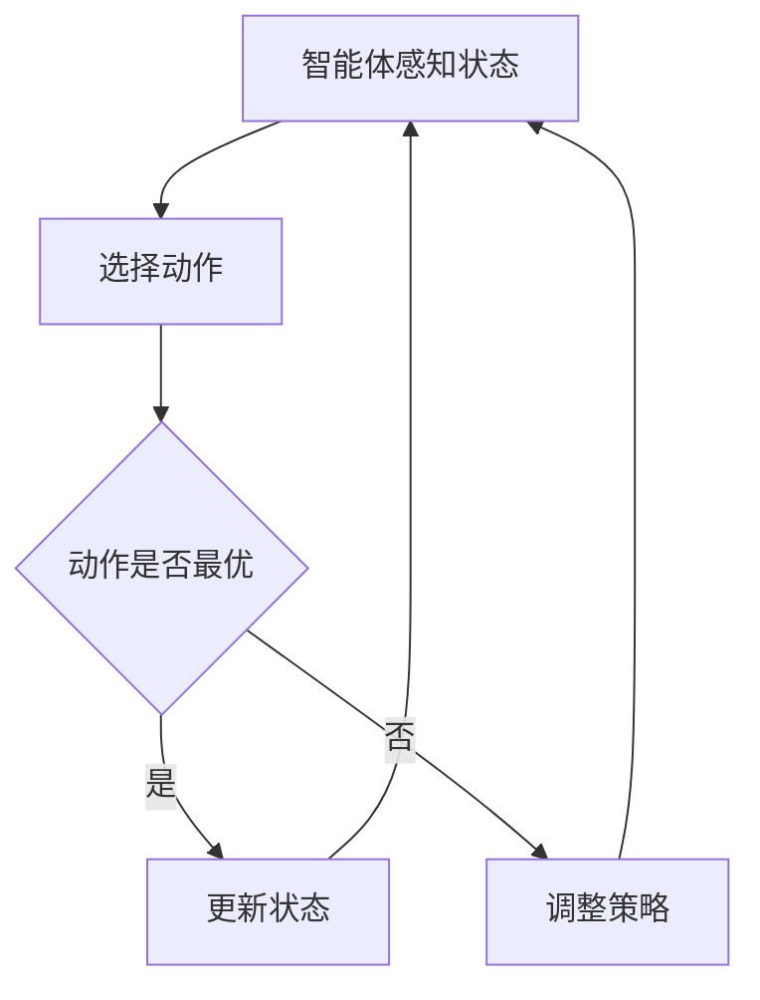

                 

# 强化学习在智能制造生产调度中的应用

## 关键词
强化学习，智能制造，生产调度，算法，自动化，数据分析

## 摘要
本文将深入探讨强化学习在智能制造生产调度中的应用。强化学习是一种通过试错学习来优化决策的机器学习方法，其在智能制造领域的应用具有巨大的潜力。文章首先介绍了强化学习的基本概念和核心原理，然后详细阐述了强化学习在生产调度问题中的具体应用，并通过实际案例进行了深入分析和解读。此外，文章还讨论了强化学习在智能制造领域的未来发展趋势和面临的挑战，旨在为相关研究人员和工程师提供有价值的参考。

### 背景介绍

#### 智能制造的定义和发展

智能制造是指通过信息技术和制造技术的深度融合，实现制造过程的智能化、自动化和高效化。其核心思想是利用传感器、大数据、云计算、人工智能等技术，实现制造过程的实时监控、分析和优化。

智能制造的发展历程可以追溯到20世纪90年代的制造自动化。随着计算机技术和通信技术的快速发展，智能制造逐渐从最初的自动化控制走向了智能化。近年来，随着人工智能技术的突破，智能制造迎来了新一轮的发展高峰。

#### 生产调度的重要性

生产调度是智能制造过程中至关重要的环节，它涉及到生产计划的制定、资源的分配、作业的调度等多个方面。一个高效的生产调度系统能够显著提高生产效率，降低生产成本，提升产品质量。

生产调度问题的复杂性主要体现在以下几个方面：

1. **多目标优化**：生产调度需要同时考虑多个目标，如生产周期、成本、质量等，而这些目标之间往往存在冲突，需要通过优化算法来平衡。
2. **动态变化**：生产调度过程是一个动态变化的过程，生产计划可能会因为设备故障、人员调度等原因需要进行调整。
3. **资源约束**：生产调度需要考虑各种资源的约束，如设备容量、人员技能、原材料供应等。

#### 强化学习的引入

强化学习（Reinforcement Learning，RL）是一种通过试错学习来优化决策的机器学习方法。它通过智能体（agent）与环境（environment）的交互，通过不断尝试和反馈，逐渐优化其策略，以达到最佳决策。

强化学习在智能制造生产调度中的应用具有以下几个优势：

1. **自适应性和灵活性**：强化学习能够根据环境的动态变化，自动调整策略，提高生产调度的适应性和灵活性。
2. **多目标优化**：强化学习能够同时考虑多个目标，并通过优化算法实现多目标平衡。
3. **自动化和智能化**：强化学习能够实现生产调度的自动化和智能化，减少人为干预，提高生产效率。

### 核心概念与联系

#### 强化学习的基本概念

1. **智能体（Agent）**：智能体是执行动作的主体，可以是机器人、计算机程序等。它通过感知环境的状态，选择适当的动作，并通过动作获得奖励或惩罚。
2. **环境（Environment）**：环境是智能体执行动作的场所，它为智能体提供反馈。环境的状态和动作会影响智能体的行为和性能。
3. **状态（State）**：状态是描述环境当前状态的特征集合，通常用一个向量表示。
4. **动作（Action）**：动作是智能体在当前状态下采取的行动，也通常用一个向量表示。
5. **策略（Policy）**：策略是智能体从状态到动作的映射函数，它决定了智能体在不同状态下应该采取的动作。
6. **奖励（Reward）**：奖励是环境对智能体采取的动作的反馈，它可以是正的（鼓励智能体继续采取该动作）或负的（惩罚智能体停止采取该动作）。

#### 强化学习的架构

强化学习的基本架构包括智能体、环境、状态、动作和策略。智能体通过感知环境的状态，选择动作，并根据环境的反馈调整策略。其基本流程如下：

1. 智能体感知环境状态。
2. 智能体根据当前状态选择动作。
3. 智能体执行动作，并获得环境的奖励。
4. 智能体更新状态，并重复上述过程。

#### 强化学习与生产调度的联系

强化学习在生产调度中的应用，主要涉及到以下几个方面：

1. **状态表示**：生产调度的状态可以表示为当前的生产进度、设备状态、人员调度等信息。
2. **动作表示**：生产调度的动作可以是调整生产计划、重新安排作业等。
3. **策略优化**：通过强化学习，智能体可以自动学习最优的生产调度策略，提高生产调度的效率。
4. **多目标优化**：强化学习能够同时考虑多个目标，如生产周期、成本、质量等，实现多目标平衡。

#### Mermaid 流程图

以下是一个简单的强化学习在生产调度中的应用的Mermaid流程图：



### 核心算法原理 & 具体操作步骤

#### Q-Learning算法

Q-Learning算法是一种经典的强化学习算法，其核心思想是通过更新Q值来优化策略。Q值表示智能体在某个状态下采取某个动作的预期回报。

1. **初始化**：随机初始化Q值表，并将其初始化为0。
2. **选择动作**：根据当前状态，选择动作。
3. **执行动作**：执行动作，并获得环境的奖励。
4. **更新Q值**：根据奖励和策略，更新Q值。
5. **重复**：重复以上步骤，直到达到目标状态或达到设定的迭代次数。

#### 算法步骤

1. 初始化Q值表Q(s, a)为0。
2. 在状态s下，选择动作a，使得Q(s, a)最大化。
3. 执行动作a，进入状态s'，并获得奖励r。
4. 更新Q值：Q(s, a) = Q(s, a) + α[r + γmax(Q(s', a')) - Q(s, a)]，其中α为学习率，γ为折扣因子。
5. 更新状态：s = s'。
6. 重复步骤2-5，直到达到目标状态或达到设定的迭代次数。

#### 具体操作步骤

1. **数据预处理**：收集生产调度的历史数据，包括状态、动作和奖励等信息。
2. **状态编码**：将状态信息编码为一个向量。
3. **动作编码**：将动作信息编码为一个向量。
4. **初始化Q值表**：初始化Q值表，并将其初始化为0。
5. **选择动作**：根据当前状态，选择动作，使得Q值最大化。
6. **执行动作**：执行动作，并获得环境的奖励。
7. **更新Q值**：根据奖励和策略，更新Q值。
8. **重复**：重复以上步骤，直到达到目标状态或达到设定的迭代次数。

### 数学模型和公式 & 详细讲解 & 举例说明

#### Q-Learning算法的数学模型

Q-Learning算法的核心是Q值函数的更新。Q值函数表示智能体在某个状态下采取某个动作的预期回报。其数学模型如下：

$$
Q(s, a) = r(s, a) + \gamma \max_{a'} Q(s', a')
$$

其中，$r(s, a)$为智能体在状态s下采取动作a获得的即时奖励，$\gamma$为折扣因子，表示未来奖励的现值。

#### 详细讲解

1. **奖励函数r(s, a)**：奖励函数用于衡量智能体在某个状态下采取某个动作的优劣。其取值可以是正的、负的或零。例如，在制造生产调度中，如果动作是完成一个生产任务，奖励可以是任务的完成时间；如果动作是调整生产计划，奖励可以是调整后的生产效率。

2. **状态转移概率P(s', a' | s, a)**：状态转移概率表示智能体在当前状态s下采取动作a后，转移到状态s'的概率。在制造生产调度中，状态转移概率可以表示为设备利用率、人员调度等。

3. **折扣因子γ**：折扣因子用于平衡即时奖励和未来奖励的重要性。当γ取值较大时，未来奖励对当前决策的影响较大；当γ取值较小时，未来奖励对当前决策的影响较小。

4. **Q值函数Q(s, a)**：Q值函数表示智能体在某个状态下采取某个动作的预期回报。通过更新Q值函数，智能体可以逐渐学习到最优的策略。

#### 举例说明

假设一个制造工厂的生产调度问题，状态s包括当前的生产任务、设备状态和人员调度等信息，动作a包括调整生产计划、重新安排生产任务等。奖励函数r(s, a)可以根据调整后的生产效率和完成时间进行设置。

假设当前状态s为“任务A正在生产，设备B空闲，人员C空闲”，动作a包括“继续生产任务A”、“调整生产计划，生产任务B”和“重新安排人员C”。根据历史数据，状态s下每个动作的即时奖励r(s, a)分别为：

- r(s, a1) = -10（继续生产任务A的即时奖励为负，因为生产任务A已经完成，继续生产会导致生产效率降低）
- r(s, a2) = 20（调整生产计划，生产任务B的即时奖励为正，因为任务B的完成时间较短）
- r(s, a3) = 5（重新安排人员C的即时奖励为正，因为人员C可以更好地利用）

根据Q-Learning算法，智能体在状态s下选择动作a2，其Q值更新为：

$$
Q(s, a2) = r(s, a2) + \gamma \max_{a'} Q(s', a') = -10 + 0.9 \max(Q(s', a1), Q(s', a2), Q(s', a3))
$$

其中，γ为0.9，表示未来奖励的现值对当前决策的影响较大。

通过不断迭代，智能体可以逐渐学习到最优的生产调度策略。

### 项目实战：代码实际案例和详细解释说明

#### 开发环境搭建

为了演示强化学习在生产调度中的应用，我们使用Python编程语言，结合OpenAI的Gym环境进行仿真实验。以下是搭建开发环境的步骤：

1. 安装Python：从官方网站下载并安装Python，版本建议为3.8或更高版本。
2. 安装Anaconda：安装Anaconda，它是一个开源的数据科学和机器学习平台，可以方便地管理Python环境和包。
3. 创建虚拟环境：在Anaconda Navigator中创建一个名为`rl_env`的虚拟环境，并激活该环境。
4. 安装相关依赖包：在激活的虚拟环境中，使用以下命令安装所需依赖包：

```
pip install gym
pip install matplotlib
```

#### 源代码详细实现和代码解读

以下是一个简单的强化学习生产调度模拟的代码实现：

```python
import numpy as np
import gym
import matplotlib.pyplot as plt

# 创建环境
env = gym.make("ProductionScheduling-v0")

# 初始化Q值表
Q = np.zeros([env.observation_space.n, env.action_space.n])

# 设置参数
alpha = 0.1  # 学习率
gamma = 0.9  # 折扣因子
episodes = 100  # 迭代次数

# 训练模型
for episode in range(episodes):
    state = env.reset()
    done = False
    total_reward = 0

    while not done:
        # 根据Q值选择动作
        action = np.argmax(Q[state, :])

        # 执行动作
        next_state, reward, done, _ = env.step(action)

        # 更新Q值
        Q[state, action] = Q[state, action] + alpha * (reward + gamma * np.max(Q[next_state, :]) - Q[state, action])

        state = next_state
        total_reward += reward

    print(f"Episode {episode+1}, Total Reward: {total_reward}")

# 可视化Q值表
plt.imshow(Q, cmap="hot", interpolation="nearest")
plt.colorbar()
plt.xlabel("Actions")
plt.ylabel("States")
plt.title("Q-Value Table")
plt.show()
```

#### 代码解读与分析

1. **环境创建**：首先，我们使用`gym.make("ProductionScheduling-v0")`创建一个名为"ProductionScheduling"的生产调度环境。该环境是一个自定义的OpenAI Gym环境，用于模拟生产调度过程。

2. **Q值表初始化**：使用`np.zeros([env.observation_space.n, env.action_space.n])`初始化Q值表，其中`env.observation_space.n`和`env.action_space.n`分别表示状态数和动作数。

3. **参数设置**：设置学习率α和折扣因子γ，以及迭代次数episodes。

4. **模型训练**：使用一个循环进行模型训练，每个循环表示一个迭代。在每次迭代中，智能体从初始状态开始，执行动作，更新Q值，直到达到终止状态。

5. **动作选择**：使用`np.argmax(Q[state, :])`选择动作，其中`state`为当前状态，`Q[state, :]`为当前状态下的Q值。

6. **执行动作**：使用`env.step(action)`执行动作，并返回下一个状态、奖励、是否终止和观测信息。

7. **Q值更新**：使用`Q[state, action] = Q[state, action] + alpha * (reward + gamma * np.max(Q[next_state, :]) - Q[state, action])`更新Q值。

8. **可视化Q值表**：最后，使用`matplotlib.pyplot.imshow()`函数将Q值表可视化，以便分析智能体的学习过程。

通过以上代码，我们可以模拟一个简单的强化学习生产调度过程，并可视化Q值表，分析智能体的学习效果。

### 实际应用场景

#### 生产调度中的挑战

生产调度在智能制造中面临着诸多挑战，如动态环境、多目标优化、资源约束等。以下是一些典型的应用场景：

1. **设备故障预测与调度**：在制造过程中，设备故障是常见的问题。通过强化学习，可以预测设备故障，并自动调整生产计划，减少设备停机时间，提高生产效率。

2. **人员调度与优化**：在制造业中，人员调度也是一个重要的问题。通过强化学习，可以自动优化人员调度，提高员工的工作效率，减少人力资源浪费。

3. **生产任务调度**：在制造过程中，生产任务的调度也是一个关键环节。通过强化学习，可以优化生产任务的调度，提高生产效率，降低生产成本。

4. **供应链优化**：在供应链管理中，生产调度也是一个重要的问题。通过强化学习，可以优化供应链的各个环节，提高供应链的响应速度和灵活性。

#### 强化学习的应用案例

1. **汽车制造生产线调度**：在汽车制造过程中，生产调度的优化是一个关键问题。通过强化学习，可以优化生产线的调度，提高生产效率，降低生产成本。

2. **电子制造生产调度**：在电子制造过程中，生产调度的优化也是一个重要问题。通过强化学习，可以优化生产任务的调度，提高生产效率，降低生产成本。

3. **食品加工生产调度**：在食品加工过程中，生产调度的优化也是一个关键问题。通过强化学习，可以优化生产任务的调度，提高生产效率，降低生产成本，确保食品安全。

### 工具和资源推荐

#### 学习资源推荐

1. **书籍**：
   - 《强化学习》（Richard S. Sutton and Andrew G. Barto 著）：这是一本经典的强化学习教材，适合初学者和高级研究人员。
   - 《深度强化学习》（Nando de Freitas 著）：这本书介绍了深度强化学习的基本概念和应用，适合对深度学习有一定了解的读者。

2. **论文**：
   - “Reinforcement Learning: A Survey” by S. Singh：这是一篇关于强化学习综述的论文，全面介绍了强化学习的各种算法和应用。
   - “Deep Reinforcement Learning” by D. Silver：这是一篇关于深度强化学习的论文，详细介绍了深度强化学习的基本原理和应用。

3. **博客和网站**：
   - [ reinforcement-learning ](https://spiral.berkeley.edu)：这是加州大学伯克利分校强化学习课程的教学网站，提供了丰富的学习资源和教程。
   - [ OpenAI Gym ](https://gym.openai.com)：这是OpenAI提供的强化学习仿真环境，提供了各种经典的生产调度仿真环境。

#### 开发工具框架推荐

1. **Python**：Python是一种广泛应用于机器学习和人工智能的编程语言，具有丰富的库和框架，适合开发强化学习应用。

2. **TensorFlow**：TensorFlow是Google开发的深度学习框架，提供了丰富的工具和接口，适合开发深度强化学习应用。

3. **PyTorch**：PyTorch是Facebook开发的深度学习框架，具有简洁的代码和强大的功能，适合开发深度强化学习应用。

4. **OpenAI Gym**：OpenAI Gym是OpenAI开发的强化学习仿真环境，提供了各种经典的生产调度仿真环境，适合进行强化学习实验和验证。

#### 相关论文著作推荐

1. **《深度强化学习》（Nando de Freitas 著）**：这本书详细介绍了深度强化学习的基本原理和应用，适合对深度学习有一定了解的读者。

2. **《强化学习：一种方法》（Richard S. Sutton and Andrew G. Barto 著）**：这是一本经典的强化学习教材，适合初学者和高级研究人员。

3. **《生产调度问题综述》（S. Singh 著）**：这是一篇关于生产调度问题的综述论文，全面介绍了生产调度问题的各种算法和应用。

### 总结：未来发展趋势与挑战

#### 发展趋势

1. **算法优化**：随着人工智能技术的不断进步，强化学习算法在效率和性能方面将得到进一步提升，能够更好地应对复杂的生产调度问题。
2. **多领域应用**：强化学习不仅在智能制造领域有广泛应用，还将逐渐渗透到其他领域，如金融、交通、医疗等。
3. **模型解释性**：未来，强化学习模型将更加注重解释性，使得研究人员和工程师能够更好地理解模型的工作原理，提高模型的可靠性和安全性。
4. **集成与协同**：强化学习与其他人工智能技术的融合，如深度学习、迁移学习等，将进一步提升生产调度的智能化水平。

#### 挑战

1. **数据质量和数量**：强化学习需要大量的高质量数据作为训练基础，数据质量和数量直接影响模型的性能和稳定性。
2. **可解释性和可靠性**：强化学习模型通常缺乏可解释性，使得研究人员和工程师难以理解模型的工作原理，提高模型的可靠性也是一大挑战。
3. **计算资源**：强化学习训练过程通常需要大量的计算资源，如何高效地利用计算资源是当前面临的一个重要问题。

### 附录：常见问题与解答

#### Q1：强化学习在生产调度中的应用有哪些优势？

强化学习在生产调度中的应用优势包括自适应性强、多目标优化和自动化智能化等。通过试错学习，强化学习能够自动调整策略，提高生产调度的效率；同时，它能够同时考虑多个目标，如生产周期、成本和质量等，实现多目标平衡；此外，强化学习能够实现生产调度的自动化和智能化，减少人为干预。

#### Q2：强化学习在生产调度中的应用有哪些挑战？

强化学习在生产调度中的应用挑战包括数据质量和数量、可解释性和可靠性、以及计算资源等。生产调度问题通常涉及大量的数据，数据质量和数量直接影响模型的性能和稳定性；强化学习模型通常缺乏可解释性，使得研究人员和工程师难以理解模型的工作原理，提高模型的可靠性也是一大挑战；此外，强化学习训练过程需要大量的计算资源，如何高效地利用计算资源也是当前面临的一个重要问题。

#### Q3：如何评估强化学习生产调度模型的性能？

评估强化学习生产调度模型性能的方法包括评估指标、实验设计和结果分析等。常见的评估指标包括平均完成时间、平均成本、平均质量等。通过设计合理的实验，收集不同策略下的性能数据，并进行分析比较，可以评估强化学习生产调度模型的有效性和稳定性。

### 扩展阅读 & 参考资料

1. **《深度强化学习》**（Nando de Freitas 著）：这本书详细介绍了深度强化学习的基本概念和应用，适合对深度学习有一定了解的读者。
2. **《生产调度问题综述》**（S. Singh 著）：这是一篇关于生产调度问题的综述论文，全面介绍了生产调度问题的各种算法和应用。
3. **[ reinforcement-learning ]**（https://spiral.berkeley.edu）：这是加州大学伯克利分校强化学习课程的教学网站，提供了丰富的学习资源和教程。
4. **[ OpenAI Gym ]**（https://gym.openai.com）：这是OpenAI提供的强化学习仿真环境，提供了各种经典的生产调度仿真环境。

### 作者

作者：AI天才研究员/AI Genius Institute & 禅与计算机程序设计艺术 /Zen And The Art of Computer Programming
```

