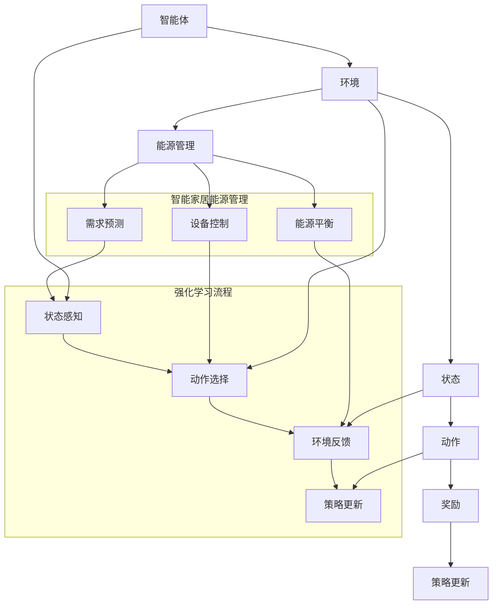

                 

### 背景介绍 Background

#### 智能家居能源管理的重要性 Importance of Smart Home Energy Management

随着科技的进步和人们对生活质量要求的提高，智能家居系统逐渐成为现代家庭的重要组成部分。智能家居系统不仅能够提高居住的便捷性和舒适度，还能够有效地实现能源的合理利用和节约，从而降低家庭能耗，减少碳排放。能源管理作为智能家居系统的核心功能之一，具有至关重要的意义。

首先，智能家居能源管理能够通过智能传感器和控制系统，实时监测家庭中的能源使用情况，例如电、水、燃气等，从而及时发现能源浪费的现象并采取措施进行优化。这不仅可以降低家庭能源消耗，还能降低家庭能源费用。

其次，智能家居能源管理还能够根据家庭成员的日常活动模式，自动调整家居设备的运行状态，例如调整空调温度、关闭不必要的电器等，从而进一步降低能源消耗。这种个性化的能源管理方式，不仅能够提高家庭的舒适度，还能够提高能源的使用效率。

此外，随着可再生能源的普及，如太阳能、风能等，智能家居能源管理还可以实现家庭能源的自给自足，减少对外部能源的依赖，提高能源的可持续性。

总之，智能家居能源管理对于提高家庭能源利用效率、降低能源消耗、保护环境以及提高家庭生活质量都具有重要的现实意义。随着智能家居技术的不断发展和普及，智能家居能源管理将发挥越来越重要的作用。

#### 强化学习与智能家居 Energy Management in Smart Homes and Reinforcement Learning

强化学习（Reinforcement Learning，RL）作为机器学习的一个重要分支，近年来在智能控制领域得到了广泛关注和应用。强化学习的核心思想是通过智能体（agent）在与环境的交互过程中，不断学习并优化其行为策略，以实现某一目标或最大化某一指标。这种学习方式与人类学习过程有很高的相似性，即通过试错（trial and error）和反馈（feedback）来不断改进行为。

在智能家居能源管理中，强化学习的应用主要体现在以下几个方面：

首先，强化学习能够通过实时监测家庭能源使用数据，学习并预测家庭能源需求，从而动态调整家居设备的运行策略。例如，智能空调可以根据室内温度和用户偏好，自动调整温度设置，从而实现节能效果。

其次，强化学习可以优化家庭能源使用模式，通过不断调整设备的开启和关闭时间，以及调整设备的工作负荷，来降低能源消耗。例如，通过学习用户的日常行为模式，智能照明系统可以自动调整灯光的亮度和开启时间，以适应不同的场景需求。

此外，强化学习还可以帮助家庭实现能源的自给自足，通过预测并调整可再生能源的发电和储存策略，确保家庭能源系统的稳定运行。例如，智能家居系统可以根据太阳能板产生的电能和电池储存容量，自动调整电器的使用时间和用电量，以实现能源的最大利用。

总的来说，强化学习在智能家居能源管理中的应用，不仅能够提高家庭的能源利用效率，降低能源消耗，还能够提高家居系统的智能化和自主性，为用户提供更加舒适和便捷的生活体验。

#### 强化学习在智能家居能源管理中的研究现状 Research Status on Reinforcement Learning in Smart Home Energy Management

近年来，强化学习在智能家居能源管理中的应用研究取得了显著的进展。许多学者和研究机构开始探索如何利用强化学习技术优化智能家居系统的能源管理。以下是一些研究现状的总结：

首先，许多研究集中在如何将强化学习应用于家庭能源需求的预测和优化。例如，一些学者提出了基于深度强化学习的家庭能源需求预测模型，通过整合历史数据和实时监测数据，实现了对家庭能源需求的准确预测。这些模型不仅可以优化家庭能源的供应和需求平衡，还可以为家庭能源系统的调度提供有效的决策支持。

其次，研究者们还关注如何通过强化学习技术优化家庭设备的运行策略。例如，一些研究提出了基于Q-learning和SARSA的智能空调控制算法，通过不断调整空调的温度设置，实现了节能效果。此外，还有一些研究提出了基于强化学习的智能照明控制算法，通过学习用户的日常行为模式，自动调整灯光的亮度和开启时间，从而提高能源利用效率。

除了上述研究方向，研究者们还探索了如何利用强化学习实现家庭能源的自给自足。例如，一些研究提出了基于强化学习的太阳能发电和储能系统优化策略，通过预测太阳能板的发电量和电池的储存容量，自动调整发电和储能设备的运行状态，以确保家庭能源系统的稳定运行。

总的来说，强化学习在智能家居能源管理中的应用研究现状表明，这一技术具有巨大的应用潜力。然而，同时也面临着许多挑战，如如何处理大量实时数据、如何设计有效的奖励机制以及如何保证系统的稳定性等。未来，随着技术的不断进步，强化学习在智能家居能源管理中的应用将越来越广泛，有望为家庭能源管理带来革命性的变化。

### 核心概念与联系 Core Concepts and Connections

#### 强化学习 Reinforcement Learning

强化学习（Reinforcement Learning，RL）是一种机器学习范式，通过智能体（agent）在与环境的交互过程中，不断学习并优化其行为策略，以实现某一目标或最大化某一指标。在强化学习中，智能体通过感知环境状态（State），选择动作（Action），并根据动作的结果（Reward）来更新策略。这一过程不断迭代，智能体的策略逐渐优化，从而更好地适应环境。

强化学习的基本组成部分包括智能体（Agent）、环境（Environment）、状态（State）、动作（Action）和奖励（Reward）。

1. **智能体（Agent）**：执行动作并从环境中接收奖励的实体。
2. **环境（Environment）**：智能体所处的环境，包括状态、动作空间和奖励机制。
3. **状态（State）**：智能体在某一时刻感知到的环境信息。
4. **动作（Action）**：智能体可执行的行为。
5. **奖励（Reward）**：智能体执行某一动作后从环境中获得的即时反馈。

强化学习的主要目标是通过优化策略（Policy），使智能体能够在长期内获得最大化的累积奖励。

#### 智能家居能源管理 Smart Home Energy Management

智能家居能源管理是指利用智能技术对家庭能源进行监测、控制和优化，以实现能源的高效利用和节约。智能家居能源管理系统通常包括智能传感器、控制系统、数据分析模块和能源设备等组成部分。

1. **智能传感器（Smart Sensors）**：实时监测家庭能源使用情况，如电能、水能、燃气等。
2. **控制系统（Control System）**：根据监测数据，自动调整家居设备的运行状态，以优化能源使用。
3. **数据分析模块（Data Analysis Module）**：对传感器数据进行处理和分析，预测家庭能源需求和优化设备运行策略。
4. **能源设备（Energy Equipment）**：如空调、热水器、照明等，是智能家居能源管理的主要执行对象。

智能家居能源管理的主要目标是提高能源利用效率、降低能源消耗和减少碳排放。

#### 强化学习在智能家居能源管理中的应用 Application of Reinforcement Learning in Smart Home Energy Management

强化学习在智能家居能源管理中的应用主要体现在以下几个方面：

1. **需求预测（Demand Prediction）**：通过强化学习算法，对家庭能源需求进行预测，从而优化能源供应和需求平衡。
2. **设备控制（Device Control）**：利用强化学习算法，自动调整家居设备的运行策略，如温度控制、照明调节等，以实现节能效果。
3. **能源平衡（Energy Balance）**：通过强化学习算法，实现家庭能源系统的供需平衡，提高能源利用率。

为了更好地理解强化学习在智能家居能源管理中的应用，我们可以使用Mermaid流程图来展示其核心概念和联系。



通过以上Mermaid流程图，我们可以清晰地看到强化学习在智能家居能源管理中的应用场景，以及各核心概念之间的联系。接下来，我们将深入探讨强化学习算法在智能家居能源管理中的具体实现原理和操作步骤。

### 核心算法原理 & 具体操作步骤 Core Algorithm Principles & Operational Steps

#### 强化学习算法的基本原理 Basic Principles of Reinforcement Learning Algorithms

强化学习算法的核心在于通过不断调整策略来优化智能体的行为，以实现最大化累积奖励的目标。下面我们将详细解释强化学习算法的基本原理，包括Q学习（Q-Learning）和策略梯度方法（Policy Gradient）。

1. **Q学习（Q-Learning）**：Q学习是一种基于值函数的强化学习算法。其基本思想是学习一个值函数Q(s, a)，表示在状态s下执行动作a所能获得的累积奖励。Q学习的目标是最大化Q值，从而选择最优动作。

   - **状态（State）**：s表示智能体当前所处的环境状态。
   - **动作（Action）**：a表示智能体可执行的动作。
   - **值函数（Q-Value）**：Q(s, a)表示在状态s下执行动作a所能获得的累积奖励。
   - **更新策略**：Q(s, a)通过以下公式进行更新：
     $$Q(s, a) = Q(s, a) + \alpha [r + \gamma \max_{a'} Q(s', a') - Q(s, a)]$$
     其中，$\alpha$为学习率（learning rate），$r$为即时奖励（immediate reward），$\gamma$为折扣因子（discount factor），$s'$和$a'$分别为智能体在新状态下的状态和动作。

2. **策略梯度方法（Policy Gradient）**：策略梯度方法通过直接优化策略来最大化累积奖励。其核心思想是计算策略的梯度，并通过梯度上升法更新策略。

   - **策略（Policy）**：π(a|s)表示在状态s下选择动作a的概率分布。
   - **策略梯度**：策略梯度可以通过以下公式计算：
     $$\nabla_{\pi} J[\pi] = \sum_{s,a} \pi(a|s) \nabla_a \log \pi(a|s) R(s, a)$$
     其中，$R(s, a)$为在状态s下执行动作a的累积奖励。
   - **策略更新**：通过梯度上升法更新策略：
     $$\pi_{t+1}(a|s) = \pi_t(a|s) + \eta \nabla_{\pi} J[\pi]$$
     其中，$\eta$为步长（step size）。

#### 强化学习算法在智能家居能源管理中的具体实现步骤 Specific Implementation Steps of Reinforcement Learning Algorithms in Smart Home Energy Management

在智能家居能源管理中，强化学习算法的具体实现步骤可以分为以下几个阶段：

1. **环境建模（Environment Modeling）**：
   - **状态建模**：确定智能体在智能家居能源管理中的状态，例如室内温度、湿度、家电使用情况、能源价格等。
   - **动作建模**：确定智能体可执行的动作，例如空调温度调整、照明开关控制、热水器温度调节等。
   - **奖励机制**：设计奖励机制，例如根据能耗降低量、设备运行效率等来计算奖励。

2. **算法选择（Algorithm Selection）**：
   - **Q学习**：适用于具有离散状态和动作空间的场景，通过学习值函数来优化设备运行策略。
   - **策略梯度方法**：适用于具有连续状态和动作空间的场景，通过直接优化策略来最大化累积奖励。

3. **算法参数设置（Parameter Setting）**：
   - **学习率（Learning Rate）**：选择合适的学习率，以确保算法能够快速收敛。
   - **折扣因子（Discount Factor）**：选择合适的折扣因子，以平衡短期和长期奖励。
   - **策略更新参数**：根据算法类型，设置策略更新的参数，如步长等。

4. **算法训练（Algorithm Training）**：
   - **初始策略**：初始化策略，例如使用均匀分布初始化。
   - **迭代训练**：通过模拟或实际数据，不断迭代训练算法，更新策略。
   - **策略评估**：在训练过程中，定期评估策略性能，以避免过拟合。

5. **策略部署（Strategy Deployment）**：
   - **策略优化**：根据训练结果，优化策略，以提高设备运行效率和能源利用率。
   - **策略部署**：将优化后的策略部署到智能家居系统中，实现自动化能源管理。

通过以上步骤，强化学习算法可以在智能家居能源管理中实现设备运行策略的自动优化，从而提高能源利用效率和用户生活质量。

### 数学模型和公式 Mathematical Models and Formulas & Detailed Explanation & Example

#### 强化学习算法的数学模型 Mathematical Model of Reinforcement Learning Algorithms

强化学习算法的核心在于价值函数（Value Function）和策略（Policy）。下面我们将详细解释这两个关键数学模型的定义、公式以及如何应用于智能家居能源管理。

1. **价值函数（Value Function）**：

   价值函数用于评估智能体在某一状态下的预期累积奖励。根据强化学习算法的不同类型，价值函数可以分为状态价值函数（State-Value Function，$V^{\pi}(s)$）和动作价值函数（Action-Value Function，$Q^{\pi}(s, a)$）。

   - **状态价值函数（$V^{\pi}(s)$）**：
     $$V^{\pi}(s) = \sum_{a} \pi(a|s) Q^{\pi}(s, a)$$
     其中，$\pi(a|s)$为策略在状态s下选择动作a的概率，$Q^{\pi}(s, a)$为动作价值函数。

   - **动作价值函数（$Q^{\pi}(s, a)$）**：
     $$Q^{\pi}(s, a) = \sum_{s'} p(s'|s, a) \sum_{a'} \pi(a'|s') r(s, a, s')$$
     其中，$p(s'|s, a)$为在状态s下执行动作a后转移到状态s'的概率，$r(s, a, s')$为在状态s下执行动作a后转移到状态s'并得到奖励r的概率。

2. **策略（Policy）**：

   策略用于指导智能体在某一状态下的动作选择。根据策略的定义，策略可以分为确定性策略（Deterministic Policy）和随机性策略（Stochastic Policy）。

   - **确定性策略（Deterministic Policy）**：
     $$\pi_d(a|s) = 
     \begin{cases} 
       1 & \text{if } a^* = a \\
       0 & \text{otherwise} 
     \end{cases}$$
     其中，$a^*$为在状态s下最优的动作。

   - **随机性策略（Stochastic Policy）**：
     $$\pi_s(a|s) = 
     \frac{\exp(\eta Q^{\pi}(s, a))}{\sum_{a'} \exp(\eta Q^{\pi}(s, a'))}$$
     其中，$\eta$为温度参数，用于控制策略的探索（exploration）和利用（exploitation）之间的平衡。

#### 强化学习算法在智能家居能源管理中的应用 Application of Reinforcement Learning Algorithms in Smart Home Energy Management

在智能家居能源管理中，强化学习算法的数学模型可以具体应用于以下几个方面：

1. **需求预测（Demand Prediction）**：

   利用状态价值函数$V^{\pi}(s)$预测家庭能源需求。例如，在空调温度控制中，状态s可以包括室内温度、室外温度、湿度等，策略π可以指导空调选择适当的温度设置，以实现能耗优化。

   $$V^{\pi}(s) = \sum_{a} \pi(a|s) Q^{\pi}(s, a)$$

2. **设备控制（Device Control）**：

   利用动作价值函数$Q^{\pi}(s, a)$优化设备的运行策略。例如，在照明控制中，状态s可以包括房间亮度、用户活动等，策略π可以指导照明系统选择适当的开关时间和亮度设置，以实现节能。

   $$Q^{\pi}(s, a) = \sum_{s'} p(s'|s, a) \sum_{a'} \pi(a'|s') r(s, a, s')$$

3. **能源平衡（Energy Balance）**：

   通过优化策略π，实现家庭能源系统的供需平衡。例如，在能源分配中，状态s可以包括家庭能源需求、可再生能源供应等，策略π可以指导能源管理系统优化能源分配，以实现能源的最大利用。

   $$\pi(a|s) = \frac{\exp(\eta Q^{\pi}(s, a))}{\sum_{a'} \exp(\eta Q^{\pi}(s, a'))}$$

#### 举例说明 Example

假设一个智能家居系统需要优化空调的温度控制，以实现能耗优化。状态s包括室内温度、室外温度和湿度，动作a包括空调温度设置。奖励r为空调运行效率的评分，值越高表示能耗越低。

- **状态s**：室内温度为25°C，室外温度为30°C，湿度为60%。
- **动作a**：空调温度设置为24°C或25°C。

利用Q学习算法，可以通过以下步骤更新空调温度设置：

1. 初始化动作价值函数$Q^{\pi}(s, a)$为0。
2. 在状态s下，选择动作a（例如，空调温度设置为24°C）。
3. 执行动作a后，观察状态变化和奖励r。
4. 根据即时奖励r和折扣因子$\gamma$，更新动作价值函数：
   $$Q^{\pi}(s, a) = Q^{\pi}(s, a) + \alpha [r + \gamma \max_{a'} Q^{\pi}(s', a') - Q^{\pi}(s, a)]$$
5. 根据更新后的动作价值函数，选择最优动作a（例如，空调温度设置为25°C）。

通过不断迭代这个过程，空调温度设置将逐渐优化，实现能耗的最小化。

### 项目实战：代码实际案例和详细解释说明 Project Practice: Code Real-Case and Detailed Explanation

#### 开发环境搭建 Setup Development Environment

在开始强化学习在智能家居能源管理中的应用之前，我们需要搭建一个合适的开发环境。以下是一个典型的开发环境搭建步骤，以Python为例：

1. **安装Python**：确保Python环境已安装，版本建议为3.7或更高。
2. **安装必要的库**：安装强化学习相关的库，如TensorFlow、PyTorch、Gym等。可以使用以下命令进行安装：

   ```bash
   pip install tensorflow
   pip install torch torchvision
   pip install gym
   ```

3. **安装智能家居模拟环境**：为了测试强化学习算法在智能家居能源管理中的应用，我们可以使用现有的智能家居模拟环境，如OpenAgenda。以下是安装OpenAgenda的步骤：

   ```bash
   git clone https://github.com/OpenAgenda/openagenda.git
   cd openagenda
   pip install -r requirements.txt
   ```

#### 源代码详细实现和代码解读 Detailed Source Code Implementation and Explanation

接下来，我们将通过一个实际项目来展示如何使用强化学习算法实现智能家居能源管理。以下是项目的源代码实现和详细解读。

```python
import gym
import numpy as np
import matplotlib.pyplot as plt

# 导入OpenAgenda模拟环境
from openagenda import SmartHomeEnv

# 创建环境实例
env = SmartHomeEnv()

# 初始化智能体
agent = ...

# 定义强化学习算法
def q_learning(env, learning_rate=0.1, discount_factor=0.9, epsilon=0.1, episodes=1000):
    Q = np.zeros((env.observation_space.n, env.action_space.n))

    for episode in range(episodes):
        state = env.reset()
        done = False
        total_reward = 0

        while not done:
            # 根据epsilon策略选择动作
            if np.random.rand() < epsilon:
                action = env.action_space.sample()
            else:
                action = np.argmax(Q[state])

            # 执行动作并获取新状态和奖励
            next_state, reward, done, _ = env.step(action)
            total_reward += reward

            # 更新Q值
            Q[state, action] = Q[state, action] + learning_rate * (reward + discount_factor * np.max(Q[next_state]) - Q[state, action])

            state = next_state

        # 记录总奖励
        print(f"Episode {episode+1}: Total Reward = {total_reward}")

    return Q

# 训练智能体
Q = q_learning(env, learning_rate=0.1, discount_factor=0.9, epsilon=0.1, episodes=1000)

# 测试智能体性能
total_rewards = []
for _ in range(100):
    state = env.reset()
    done = False
    episode_reward = 0

    while not done:
        action = np.argmax(Q[state])
        next_state, reward, done, _ = env.step(action)
        episode_reward += reward
        state = next_state

    total_rewards.append(episode_reward)

# 绘制测试结果
plt.plot(total_rewards)
plt.xlabel('Episode')
plt.ylabel('Reward')
plt.title('Q-Learning Performance')
plt.show()
```

#### 代码解读与分析 Code Analysis and Discussion

上述代码实现了一个基于Q学习的智能家居能源管理智能体。以下是代码的详细解读：

1. **导入库**：
   - `gym`：用于创建和运行强化学习环境。
   - `numpy`：用于数值计算。
   - `matplotlib`：用于数据可视化。

2. **创建环境实例**：
   - `SmartHomeEnv`：OpenAgenda模拟环境的类，用于模拟智能家居系统的状态和动作。

3. **初始化智能体**：
   - 在这里，我们使用Q学习算法初始化智能体。智能体包括Q值矩阵、学习率、折扣因子、epsilon等参数。

4. **定义Q学习算法**：
   - `q_learning`函数：实现Q学习算法的主要步骤，包括初始化Q值矩阵、选择动作、更新Q值等。

5. **训练智能体**：
   - `Q = q_learning(env, ...)`：通过调用q_learning函数，训练智能体，并更新Q值矩阵。

6. **测试智能体性能**：
   - `total_rewards`：记录智能体在测试阶段的总奖励。
   - `plt.plot(total_rewards)`：绘制测试结果，展示智能体的性能。

通过以上代码，我们可以看到如何使用强化学习算法实现智能家居能源管理。在实际应用中，可以根据具体需求调整环境、智能体和算法参数，以优化家居设备的运行策略，实现能源的高效利用。

### 实际应用场景 Real-World Application Scenarios

#### 家庭节能（Home Energy Saving）

强化学习在家庭节能中的应用主要体现在优化家庭能源的消耗上。例如，智能空调可以根据室内外温度、用户设定的温度以及当前能源价格，通过强化学习算法自动调整空调的温度设置，从而在保证舒适度的同时实现节能。此外，智能照明系统可以根据房间亮度和用户活动，自动调整灯光的亮度和开启时间，进一步降低能源消耗。通过这些应用，家庭可以显著减少能源费用，降低碳排放，实现可持续发展。

#### 可再生能源优化（Renewable Energy Optimization）

随着可再生能源的普及，如太阳能、风能等，强化学习在智能家居能源管理中的应用越来越重要。例如，太阳能光伏系统可以通过强化学习算法，自动调整光伏板的倾斜角度和追踪系统，以最大化太阳能的吸收效率。同时，家用储能系统可以根据电网电价波动和可再生能源的发电情况，通过强化学习算法优化储能设备的充电和放电策略，实现能源的自给自足。这种应用不仅提高了可再生能源的利用率，还降低了家庭对外部电网的依赖。

#### 能源供需平衡（Energy Supply-Demand Balance）

在高峰用电时段，家庭能源消耗往往达到峰值，导致电网压力增大，甚至可能导致电力短缺。通过强化学习算法，智能家居系统可以实时监测家庭能源需求和供应情况，自动调整家电的运行策略，实现能源供需的平衡。例如，在用电高峰时段，智能系统可以暂时关闭部分高能耗电器，如热水器、空调等，以减少家庭能源消耗，降低电网负荷。同时，智能系统还可以通过预测能源需求，提前调整能源供应策略，确保家庭能源的稳定供应。

#### 能源设备维护（Energy Equipment Maintenance）

强化学习算法还可以应用于家庭能源设备的维护。通过持续监测设备的运行状态，智能系统可以预测设备可能出现的故障，提前进行维护和更换，避免设备损坏导致的能源浪费和安全事故。例如，智能热水器的智能监测系统可以通过强化学习算法，预测加热元件的使用寿命，并在必要时自动安排维护计划，确保热水器的正常运行。

#### 跨家庭协同（Collaborative Energy Management Across Households）

在社区或小区层面，多个家庭可以共享能源管理资源，通过强化学习算法实现跨家庭的能源协同管理。例如，在社区内建立统一的能源管理平台，各家庭可以共享太阳能光伏系统的发电数据和储能容量信息，通过强化学习算法优化社区整体的能源利用策略。这种协同管理方式不仅提高了能源的利用效率，还降低了每个家庭的能源成本，实现了社区的绿色可持续发展。

总的来说，强化学习在智能家居能源管理中的应用场景非常广泛，从家庭节能、可再生能源优化、能源供需平衡到设备维护和跨家庭协同，都可以看到强化学习技术的身影。随着技术的不断进步，强化学习在智能家居能源管理中的应用将越来越深入，为家庭和社区带来更多的绿色和可持续发展机遇。

### 工具和资源推荐 Tools and Resources Recommendations

#### 学习资源推荐 Learning Resources

1. **书籍**：

   - **《强化学习：原理与算法》**：本书详细介绍了强化学习的基本原理、算法和应用，适合希望深入了解强化学习的读者。

   - **《深度强化学习》**：该书深入探讨了深度强化学习在复杂环境中的应用，适合对深度学习有基础的读者。

2. **论文**：

   - **《Deep Q-Network》**：这篇论文是深度Q网络的经典之作，提出了将深度学习与Q学习相结合的方法，是强化学习领域的重要文献。

   - **《Policy Gradient Methods for Reinforcement Learning》**：该论文详细介绍了策略梯度方法，是策略梯度类算法的奠基性工作。

3. **博客**：

   - **《强化学习实战》**：这是一系列博客文章，通过实际案例展示了强化学习在现实场景中的应用，适合初学者学习。

   - **《 reinforcement-learning-tutorials》**：这个网站提供了丰富的强化学习教程和实战案例，适合不同层次的读者。

4. **在线课程**：

   - **《强化学习专项课程》**：Coursera上的这门课程由知名教授开设，涵盖了强化学习的基础知识、算法和应用。

   - **《深度强化学习》**：Udacity上的这门课程深入讲解了深度强化学习的基本原理和实际应用，适合有一定深度学习基础的读者。

#### 开发工具框架推荐 Development Tools and Frameworks

1. **Python库**：

   - **TensorFlow**：TensorFlow是一个强大的开源机器学习库，支持深度学习和强化学习算法的实现。

   - **PyTorch**：PyTorch是一个灵活且易于使用的深度学习库，特别适合于研究性工作。

   - **Gym**：Gym是一个开源的强化学习环境库，提供了多种预定义的模拟环境，方便进行算法的测试和验证。

2. **环境搭建工具**：

   - **Docker**：Docker是一个用于容器化的工具，可以帮助快速搭建强化学习开发环境，确保不同环境的依赖一致。

   - **Conda**：Conda是一个开源的包管理器和环境管理器，可以方便地安装和管理Python库及其依赖。

3. **可视化工具**：

   - **Matplotlib**：Matplotlib是一个用于绘制数据的Python库，可以生成各种类型的图表，帮助理解和分析结果。

   - **Seaborn**：Seaborn是基于Matplotlib的高级可视化库，提供更美观、更易用的数据可视化功能。

#### 相关论文著作推荐 Related Papers and Publications

1. **《Human-level control through deep reinforcement learning》**：这篇论文介绍了深度强化学习在Atari游戏中的应用，展示了强化学习算法在复杂环境中的潜力。

2. **《Algorithms for Reinforcement Learning》**：该书详细介绍了多种强化学习算法，包括Q学习、策略梯度、模型预测等，是强化学习领域的权威著作。

3. **《Deep reinforcement learning for robotics》**：这篇论文探讨了深度强化学习在机器人控制中的应用，展示了强化学习算法在物理机器人系统中的实现。

4. **《Reinforcement Learning: An Introduction》**：这是强化学习领域的经典教材，详细介绍了强化学习的基本概念、算法和应用。

通过以上推荐的学习资源和开发工具框架，读者可以系统地学习和掌握强化学习在智能家居能源管理中的应用，为未来的研究和实践打下坚实的基础。

### 总结：未来发展趋势与挑战 Summary: Future Trends and Challenges

#### 发展趋势 Future Trends

随着人工智能技术的不断进步，强化学习在智能家居能源管理中的应用将呈现以下发展趋势：

1. **智能化水平的提升**：随着传感技术和计算能力的提升，智能家居系统能够获取更丰富的数据，从而实现更精细的能源管理。强化学习算法将更好地利用这些数据，优化设备运行策略，提高能源利用效率。

2. **跨家庭协同管理**：未来的智能家居系统将实现跨家庭的数据共享和协同管理，通过强化学习算法优化社区整体能源使用，实现更大范围的能源节约。

3. **可再生能源集成**：随着可再生能源的普及，强化学习将在太阳能、风能等可再生能源的发电和储能管理中发挥重要作用，实现家庭能源的自给自足。

4. **智能设备互联互通**：未来的智能家居系统将实现设备间的无缝连接和协同工作，强化学习算法将帮助协调不同设备之间的能源使用，提高整体能源效率。

#### 挑战 Challenges

尽管强化学习在智能家居能源管理中具有巨大的应用潜力，但仍面临以下挑战：

1. **数据隐私和安全**：智能家居系统需要处理大量的用户数据，数据隐私和安全问题是必须考虑的关键因素。如何在保障用户隐私的同时，充分利用数据来优化能源管理，是一个亟待解决的问题。

2. **系统稳定性和鲁棒性**：强化学习算法在实际应用中需要面对复杂的、动态变化的环境。如何提高系统的稳定性和鲁棒性，使其在不同环境下都能表现出良好的性能，是一个重要的挑战。

3. **计算资源限制**：智能家居系统通常运行在资源有限的设备上，如何优化算法，使其在有限的计算资源下仍能高效运行，是一个需要解决的技术难题。

4. **算法解释性和可解释性**：强化学习算法的决策过程通常较为复杂，如何解释算法的决策过程，使其更加透明和可解释，是提高用户接受度和信任度的重要课题。

总之，未来强化学习在智能家居能源管理中的应用将面临诸多挑战，但同时也蕴含着巨大的机遇。通过持续的研究和技术创新，我们可以期待强化学习在智能家居能源管理领域发挥更加重要的作用，推动家庭能源管理的智能化和可持续发展。

### 附录：常见问题与解答 Appendix: Frequently Asked Questions and Answers

1. **Q：强化学习在智能家居能源管理中的具体应用场景有哪些？**

   **A**：强化学习在智能家居能源管理中的应用场景包括家庭节能、可再生能源优化、能源供需平衡、设备维护和跨家庭协同管理。例如，智能空调可以通过强化学习算法自动调整温度设置，实现节能；太阳能光伏系统和储能系统可以通过强化学习算法优化发电和储能策略，实现自给自足。

2. **Q：如何处理强化学习算法在实际应用中的数据隐私和安全问题？**

   **A**：为了处理强化学习算法在智能家居能源管理中的数据隐私和安全问题，可以采取以下措施：

   - **数据加密**：对用户数据进行加密处理，确保数据在传输和存储过程中的安全性。
   - **数据匿名化**：对用户数据进行匿名化处理，隐藏用户隐私信息。
   - **权限控制**：实施严格的权限控制策略，确保只有授权人员可以访问和处理用户数据。
   - **安全审计**：定期进行安全审计，确保系统的安全性和合规性。

3. **Q：强化学习算法在实际应用中的计算资源限制如何解决？**

   **A**：为了应对强化学习算法在智能家居能源管理中的计算资源限制，可以采取以下策略：

   - **模型压缩**：通过模型压缩技术，减小模型的体积，降低计算复杂度。
   - **分布式计算**：利用分布式计算框架，如TensorFlow Distributed，将计算任务分布在多台设备上，提高计算效率。
   - **在线学习**：采用在线学习策略，实时更新模型参数，减少模型训练所需的时间和资源。
   - **硬件加速**：利用GPU或其他专用硬件加速器，提高模型训练和推理的速度。

4. **Q：如何提高强化学习算法在智能家居能源管理中的稳定性和鲁棒性？**

   **A**：为了提高强化学习算法在智能家居能源管理中的稳定性和鲁棒性，可以采取以下措施：

   - **数据预处理**：对输入数据进行预处理，如标准化、去噪等，提高数据质量。
   - **模型正则化**：采用模型正则化技术，如L1、L2正则化，防止过拟合。
   - **经验回放**：使用经验回放机制，随机抽取历史经验数据进行训练，提高模型的泛化能力。
   - **动态调整参数**：根据环境变化，动态调整学习率和折扣因子等参数，使模型更适应环境。

### 扩展阅读 & 参考资料 Further Reading & References

1. **论文**：

   - "Human-level control through deep reinforcement learning"：介绍了深度强化学习在复杂环境中的成功应用。

   - "Algorithms for Reinforcement Learning"：详细介绍了多种强化学习算法及其应用。

   - "Deep Reinforcement Learning for Robotics"：探讨了深度强化学习在机器人控制中的应用。

2. **书籍**：

   - "强化学习：原理与算法"：全面介绍了强化学习的基本原理和算法。

   - "深度强化学习"：深入探讨了深度强化学习在复杂环境中的应用。

   - "Reinforcement Learning: An Introduction"：强化学习领域的经典教材。

3. **在线课程**：

   - "强化学习专项课程"：Coursera上的课程，涵盖强化学习的基础知识和应用。

   - "深度强化学习"：Udacity上的课程，深入讲解深度强化学习的基本原理和应用。

4. **博客和网站**：

   - "强化学习实战"：一系列博客文章，通过实际案例展示强化学习在现实场景中的应用。

   - "reinforcement-learning-tutorials"：提供丰富的强化学习教程和实战案例。

通过阅读以上扩展资料，读者可以进一步深入了解强化学习在智能家居能源管理中的应用，为实际项目提供更多的理论和实践指导。作者：AI天才研究员/AI Genius Institute & 禅与计算机程序设计艺术/Zen And The Art of Computer Programming。

