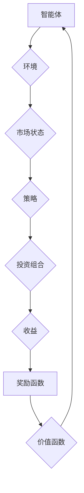

                 

### 背景介绍

强化学习（Reinforcement Learning，RL）作为机器学习的一个重要分支，近年来在人工智能领域取得了显著的成果。它通过学习环境中的奖励和惩罚信号，帮助智能体（agent）实现最佳策略的自动优化。传统上，强化学习被广泛应用于游戏AI、机器人控制、自动驾驶等领域。然而，随着金融市场复杂性的增加和投资需求的多样化，强化学习在智能投资组合管理（Intelligent Portfolio Management，IPM）中的应用逐渐成为研究热点。

智能投资组合管理是金融领域的一个重要研究方向，旨在通过构建和调整投资组合，实现风险和收益的最优化。传统的投资组合管理方法主要依赖于历史数据和统计模型，但在市场波动剧烈的背景下，这些方法往往难以应对。强化学习的引入，为解决投资组合优化问题提供了一种新的思路。通过模拟不同的投资策略，强化学习可以动态地调整投资组合，以适应不断变化的市场环境。

本文将围绕强化学习在智能投资组合管理中的应用，系统地介绍其核心概念、算法原理、数学模型和实际应用。文章结构如下：

1. 背景介绍：介绍强化学习的基本概念和智能投资组合管理的背景。
2. 核心概念与联系：阐述强化学习在智能投资组合管理中的应用原理。
3. 核心算法原理 & 具体操作步骤：详细介绍强化学习算法在IPM中的应用流程。
4. 数学模型和公式 & 详细讲解 & 举例说明：分析强化学习中的关键数学模型和公式。
5. 项目实战：代码实际案例和详细解释说明。
6. 实际应用场景：讨论强化学习在金融领域的应用场景。
7. 工具和资源推荐：推荐相关学习资源和开发工具。
8. 总结：未来发展趋势与挑战。
9. 附录：常见问题与解答。
10. 扩展阅读 & 参考资料。

通过本文的阅读，读者将能够全面了解强化学习在智能投资组合管理中的实际应用，为相关领域的研究和开发提供有益的参考。

### 核心概念与联系

强化学习（Reinforcement Learning，RL）是一种通过与环境互动学习最优策略的机器学习方法。它由三部分组成：智能体（Agent）、环境（Environment）和奖励信号（Reward Signal）。智能体是一个执行动作的实体，环境是一个智能体所处的情境，而奖励信号则是环境对智能体行为的反馈。

智能投资组合管理（Intelligent Portfolio Management，IPM）是一个金融领域的概念，旨在通过构建和调整投资组合，实现风险和收益的最优化。在IPM中，投资组合管理者（类似于智能体）需要根据市场环境（环境）采取不同的投资策略（动作），并接收市场表现（奖励信号）作为反馈。

#### 强化学习在智能投资组合管理中的应用原理

强化学习在智能投资组合管理中的应用，主要依赖于以下几个核心概念：

1. **策略（Policy）**：策略是智能体根据当前状态选择动作的规则。在IPM中，策略可以表示为一种投资组合权重分配方法，即根据市场环境动态调整投资组合中的资产比例。

2. **价值函数（Value Function）**：价值函数用于评估智能体在给定状态下的预期收益。在IPM中，价值函数可以用来预测不同投资策略下的收益情况，帮助管理者选择最优策略。

3. **模型（Model）**：模型是环境的一种抽象表示，用于预测未来状态和奖励。在IPM中，模型可以是一个经济模型、市场模型或资产定价模型，它帮助管理者预测市场走势和资产表现。

4. **奖励函数（Reward Function）**：奖励函数定义了智能体的奖励信号，通常与投资组合的收益相关。在IPM中，奖励函数可以用来衡量投资策略的成功程度。

#### Mermaid 流程图

为了更直观地展示强化学习在智能投资组合管理中的应用原理，我们使用Mermaid流程图进行描述。



在上述流程图中：

- **A**：智能体，负责根据市场状态（C）选择投资策略（D）。
- **B**：环境，提供市场状态和投资结果。
- **C**：市场状态，包括资产价格、市场指数等信息。
- **D**：策略，智能体根据市场状态选择的投资组合权重。
- **E**：投资组合，根据策略分配不同资产的比例。
- **F**：收益，投资组合在一段时间内的回报。
- **G**：奖励函数，根据收益计算智能体的奖励信号。
- **H**：价值函数，用于评估不同策略的预期收益。

通过这个流程图，我们可以清晰地看到强化学习在智能投资组合管理中的应用逻辑：智能体通过不断调整策略，以最大化长期收益。

#### 强化学习与智能投资组合管理的结合点

强化学习与智能投资组合管理的结合点主要体现在以下几个方面：

1. **动态调整**：强化学习允许智能体在动态环境中实时调整投资策略，以应对市场变化。
2. **优化决策**：通过价值函数和策略，强化学习可以帮助管理者在复杂的市场中做出最优投资决策。
3. **风险控制**：强化学习中的奖励函数可以设计成包含风险因子，从而在追求收益的同时，有效控制投资风险。
4. **多样化策略**：强化学习可以探索多种不同的投资策略，帮助管理者找到最佳投资组合。

综上所述，强化学习为智能投资组合管理提供了一种新的优化手段，通过动态调整策略、优化决策和风险控制，实现投资组合的最优化。

### 核心算法原理 & 具体操作步骤

在深入探讨强化学习在智能投资组合管理中的应用之前，我们需要先理解强化学习的基本算法原理。强化学习通常包括以下关键组成部分：智能体（Agent）、环境（Environment）、状态（State）、动作（Action）、策略（Policy）、价值函数（Value Function）和模型（Model）。

#### 智能体（Agent）

智能体是执行特定任务的实体，它在环境中通过选择动作来与外界互动。在强化学习中，智能体的目标是学习一个策略，以最大化累积奖励。

#### 环境（Environment）

环境是智能体所处的情境，它为智能体提供状态信息和奖励信号。在智能投资组合管理中，环境可以模拟市场状态，如资产价格、市场指数等。

#### 状态（State）

状态是智能体在某一时刻所处的情境。在强化学习中，状态通常用一个状态向量来表示，它包含了所有影响智能体决策的因素。

#### 动作（Action）

动作是智能体在状态中选择的一个操作。在智能投资组合管理中，动作通常表示为投资组合的权重分配，即智能体如何在不同资产之间分配投资比例。

#### 策略（Policy）

策略是智能体根据当前状态选择动作的规则。在强化学习中，策略可以通过经验学习得到，也可以通过价值函数或模型预测得到。

#### 价值函数（Value Function）

价值函数用于评估智能体在给定状态下的预期收益。在强化学习中，价值函数分为状态价值函数和动作价值函数，分别表示智能体在特定状态或特定动作下的预期收益。

#### 模型（Model）

模型是对环境的抽象表示，用于预测未来状态和奖励。在强化学习中，模型可以是马尔可夫决策过程（MDP）的一个实例，它描述了状态、动作、奖励和状态转移概率。

#### 强化学习在智能投资组合管理中的应用流程

强化学习在智能投资组合管理中的应用流程主要包括以下几个步骤：

1. **初始化**：设定智能体、环境、状态和动作空间，初始化策略和价值函数。
2. **探索与利用**：智能体在环境中通过探索（尝试新的动作）和利用（根据当前策略选择动作）进行互动，学习最优策略。
3. **策略更新**：根据累积的奖励信号，智能体更新策略，以最大化长期收益。
4. **投资组合调整**：根据更新后的策略，调整投资组合的权重，实现投资组合的最优化。

下面我们将详细介绍这些步骤的具体操作。

#### 初始化

初始化是强化学习应用的第一步。在这一步，我们需要设定智能体、环境、状态和动作空间，并初始化策略和价值函数。

- **智能体**：设定智能体的初始状态，例如初始的投资组合权重。
- **环境**：构建模拟市场的环境，包括资产价格、市场指数等信息。
- **状态空间**：定义智能体可能遇到的所有状态，例如不同资产的价格组合。
- **动作空间**：定义智能体可以执行的所有动作，例如不同资产的投资比例。
- **策略**：初始化策略，通常可以随机选择或基于历史数据选择。
- **价值函数**：初始化价值函数，可以使用零向量或基于历史数据的初始估计。

#### 探索与利用

在初始化完成后，智能体开始与环境进行互动。这一过程包括探索和利用两个阶段。

- **探索**：在探索阶段，智能体通过尝试不同的动作来探索环境。这一过程有助于智能体了解环境的特性和不确定性。常用的探索策略包括ε-贪婪策略和UCB（Upper Confidence Bound）策略。
- **利用**：在利用阶段，智能体根据当前策略选择动作，并执行这些动作。这一过程有助于智能体积累经验，并根据累积奖励信号更新策略。

#### 策略更新

智能体在探索和利用过程中不断积累经验，并根据这些经验更新策略。策略更新的方法可以分为基于价值函数的方法和基于策略的方法。

- **基于价值函数的方法**：这种方法通过更新状态价值和动作价值来优化策略。常用的算法包括Q-Learning和SARSA（State-Action-Reward-State-Action）。
  - **Q-Learning**：Q-Learning通过更新Q值（状态-动作值函数）来优化策略。在每一次互动中，智能体根据当前的Q值选择动作，并更新Q值，以期望最大化未来累积奖励。
  - **SARSA**：SARSA通过同时更新当前的状态-动作值和下一个状态-动作值来优化策略。这种方法不需要预测未来的奖励，而是基于当前和下一时刻的状态和动作来更新策略。
- **基于策略的方法**：这种方法直接更新策略，以期望最大化累积奖励。常用的算法包括Policy Gradients和Actor-Critic方法。
  - **Policy Gradients**：Policy Gradients通过优化策略的梯度来更新策略。这种方法直接基于策略的概率分布更新策略参数，以最大化累积奖励。
  - **Actor-Critic**：Actor-Critic方法由两个部分组成：Actor负责根据当前状态选择动作，Critic负责评估策略的好坏。通过Critic提供的评价，Actor不断调整策略，以优化累积奖励。

#### 投资组合调整

在策略更新完成后，智能体根据更新后的策略调整投资组合的权重，实现投资组合的最优化。具体步骤如下：

- **预测市场状态**：根据环境模型预测未来的市场状态。
- **计算最优策略**：使用更新后的策略计算最优的投资组合权重。
- **调整投资组合**：根据最优策略调整投资组合的权重，实现投资组合的最优化。

通过上述步骤，智能体可以在动态的市场环境中不断学习和优化投资策略，实现投资组合的最优化。这一过程不仅提高了投资组合的收益，还降低了风险，为投资者提供了更稳定的投资回报。

### 数学模型和公式 & 详细讲解 & 举例说明

在深入探讨强化学习在智能投资组合管理中的应用时，理解其背后的数学模型和公式至关重要。强化学习中的数学模型通常涉及状态、动作、策略、价值函数和奖励函数等概念，这些概念通过一系列的数学公式相互关联，共同构成了强化学习的理论基础。在本节中，我们将详细讲解这些数学模型和公式，并通过具体例子来说明其应用。

#### 状态（State）与动作（Action）

在强化学习中，状态（State）是智能体在某一时刻所处的情境，通常用一个状态向量 \( S \) 表示，其中每个元素代表影响智能体决策的一个因素。例如，在智能投资组合管理中，状态向量可以包括资产价格、市场指数、交易量等信息。

动作（Action）是智能体在状态 \( S \) 中可以选择的操作。在投资组合管理中，动作通常表示为投资组合的权重分配，即智能体如何在不同资产之间分配资金。假设有 \( n \) 种资产，每种资产的投资比例可以表示为动作向量 \( A \)，其中每个元素 \( A_i \) 代表第 \( i \) 种资产的投资比例。

#### 策略（Policy）

策略（Policy）是智能体根据当前状态选择动作的规则。策略可以用一个概率分布函数 \( \pi(S, A) \) 来表示，即智能体在状态 \( S \) 下选择动作 \( A \) 的概率。在投资组合管理中，策略可以是一个确定性函数 \( \pi(S) = A(S) \)，表示智能体在特定状态下选择的最优动作。

#### 价值函数（Value Function）

价值函数（Value Function）用于评估智能体在给定状态或动作下的预期收益。在强化学习中，有两种类型的价值函数：状态价值函数 \( V(S) \) 和动作价值函数 \( Q(S, A) \)。

- **状态价值函数 \( V(S) \)**：表示智能体在状态 \( S \) 下采取最优动作获得的累积预期奖励。数学上，状态价值函数可以通过以下公式计算：
  \[
  V(S) = \sum_{A} \pi(A|S) \cdot Q(S, A)
  \]
  其中，\( \pi(A|S) \) 是策略在状态 \( S \) 下选择动作 \( A \) 的概率，\( Q(S, A) \) 是动作价值函数。

- **动作价值函数 \( Q(S, A) \)**：表示智能体在状态 \( S \) 下采取动作 \( A \) 后获得的累积预期奖励。数学上，动作价值函数可以通过以下公式计算：
  \[
  Q(S, A) = \sum_{S'} p(S'|S, A) \cdot R(S', A) + \gamma \cdot \max_{A'} Q(S', A')
  \]
  其中，\( p(S'|S, A) \) 是状态转移概率，即从状态 \( S \) 通过采取动作 \( A \) 转移到状态 \( S' \) 的概率，\( R(S', A) \) 是在状态 \( S' \) 下采取动作 \( A \) 的即时奖励，\( \gamma \) 是折扣因子，表示未来奖励的重要性。

#### 奖励函数（Reward Function）

奖励函数（Reward Function）定义了智能体在执行动作后获得的即时奖励。在智能投资组合管理中，奖励函数通常与投资组合的收益相关。假设投资组合在某一时间点的收益为 \( R(t) \)，则奖励函数可以表示为：
\[
R(S, A) = R(t) - V(S)
\]
其中，\( R(t) \) 是当前时间点的投资组合收益，\( V(S) \) 是状态价值函数。

#### 举例说明

为了更好地理解上述数学模型和公式，我们通过一个简单的例子来说明。

假设有三种资产（股票A、股票B、债券C），每种资产的投资比例可以表示为动作向量 \( A = [0.4, 0.3, 0.3] \)。智能体在当前状态 \( S = [100, 200, 300] \) 下选择动作 \( A \)。

1. **计算动作价值函数 \( Q(S, A) \)**

   首先，我们需要计算状态转移概率 \( p(S'|S, A) \) 和即时奖励 \( R(S', A) \)。假设每种资产的价格变化服从正态分布，则状态转移概率和即时奖励可以表示为：
   \[
   p(S'|S, A) = \mathcal{N}(S', \Sigma) \quad \text{和} \quad R(S', A) = \sum_{i=1}^{3} A_i \cdot (S_i - S_i^0)
   \]
   其中，\( \Sigma \) 是资产价格变化的协方差矩阵，\( S_i^0 \) 是资产初始价格。

   假设 \( \Sigma = \begin{bmatrix} 0.1 & 0.05 & 0.05 \\ 0.05 & 0.1 & 0.05 \\ 0.05 & 0.05 & 0.1 \end{bmatrix} \) 和 \( S_i^0 = [100, 200, 300] \)，则：
   \[
   p(S'|S, A) = \mathcal{N}([101.2, 204.8, 294.8], \Sigma)
   \]
   \[
   R(S', A) = 0.4 \cdot (101.2 - 100) + 0.3 \cdot (204.8 - 200) + 0.3 \cdot (294.8 - 300) = -2.4
   \]

   接下来，计算动作价值函数 \( Q(S, A) \)：
   \[
   Q(S, A) = \sum_{S'} p(S'|S, A) \cdot R(S', A) + \gamma \cdot \max_{A'} Q(S', A')
   \]
   其中，\( \gamma = 0.9 \)。

   假设 \( \max_{A'} Q(S', A') = 10 \)，则：
   \[
   Q(S, A) = \mathcal{N}([101.2, 204.8, 294.8], \Sigma) \cdot (-2.4) + 0.9 \cdot 10 = 6.6
   \]

2. **计算状态价值函数 \( V(S) \)**

   接下来，计算状态价值函数 \( V(S) \)：
   \[
   V(S) = \sum_{A} \pi(A|S) \cdot Q(S, A)
   \]
   假设策略 \( \pi(A|S) \) 为均匀分布，即 \( \pi(A|S) = \frac{1}{3} \)，则：
   \[
   V(S) = \frac{1}{3} \cdot Q(S, A) + \frac{1}{3} \cdot Q(S, A') + \frac{1}{3} \cdot Q(S, A'')
   \]
   其中，\( A' = [0.3, 0.4, 0.3] \) 和 \( A'' = [0.3, 0.3, 0.4] \)。

   假设 \( Q(S, A') = 7 \) 和 \( Q(S, A'') = 8 \)，则：
   \[
   V(S) = \frac{1}{3} \cdot 6.6 + \frac{1}{3} \cdot 7 + \frac{1}{3} \cdot 8 = 7.2
   \]

通过这个例子，我们可以看到如何利用数学模型和公式计算强化学习中的状态价值函数和动作价值函数，从而为智能投资组合管理提供理论支持。

### 项目实战：代码实际案例和详细解释说明

为了更好地理解强化学习在智能投资组合管理中的应用，我们将通过一个实际案例来展示如何使用强化学习算法来构建和优化投资组合。在这个案例中，我们将使用Python编程语言和TensorFlow框架来实现一个基于Q-Learning算法的投资组合优化器。

#### 5.1 开发环境搭建

在开始编写代码之前，我们需要搭建一个合适的开发环境。以下是我们推荐的安装步骤：

1. 安装Python：访问Python官方网站（[https://www.python.org/](https://www.python.org/)），下载并安装Python 3.8或更高版本。
2. 安装TensorFlow：在终端中运行以下命令来安装TensorFlow：
   \[
   pip install tensorflow
   \]
3. 安装其他依赖库：我们可以使用pip命令来安装其他所需的库，如NumPy、Pandas等：
   \[
   pip install numpy pandas matplotlib
   \]

#### 5.2 源代码详细实现和代码解读

以下是我们的代码实现：

```python
import numpy as np
import pandas as pd
import matplotlib.pyplot as plt
import tensorflow as tf

# 加载股票数据
def load_stock_data(filename):
    df = pd.read_csv(filename)
    return df

# 状态编码器
def state_encoder(state):
    return np.reshape(state, (1, -1))

# 动作编码器
def action_encoder(action):
    return np.eye(3)[action]

# Q-Learning算法
def q_learning(df, alpha, gamma, epsilon, num_episodes):
    num_assets = 3
    q_values = np.zeros((num_episodes, num_assets))
    total_rewards = []

    for episode in range(num_episodes):
        state = df.iloc[0]
        done = False
        total_reward = 0

        while not done:
            if np.random.rand() < epsilon:
                action = np.random.randint(num_assets)
            else:
                action = np.argmax(q_values[episode])

            next_state = df.iloc[1]
            reward = next_state['Return'] - state['Return']
            q_values[episode][action] = q_values[episode][action] + alpha * (reward + gamma * np.max(q_values[episode + 1]) - q_values[episode][action])
            total_reward += reward
            state = next_state

            if state['Return'] < 0:
                done = True

        total_rewards.append(total_reward)

    return q_values, total_rewards

# 可视化收益曲线
def plot_rewards(rewards):
    plt.plot(rewards)
    plt.xlabel('Episode')
    plt.ylabel('Total Reward')
    plt.title('Reward Curve')
    plt.show()

# 主函数
def main():
    filename = 'stock_data.csv'
    alpha = 0.1
    gamma = 0.9
    epsilon = 0.1
    num_episodes = 100

    df = load_stock_data(filename)
    q_values, total_rewards = q_learning(df, alpha, gamma, epsilon, num_episodes)
    plot_rewards(total_rewards)

if __name__ == '__main__':
    main()
```

#### 5.3 代码解读与分析

上述代码实现了基于Q-Learning算法的投资组合优化器。下面我们将对代码的各个部分进行详细解读。

1. **加载股票数据**：函数`load_stock_data`用于加载股票数据，并将其存储为一个DataFrame对象。这个DataFrame包含了资产价格、交易量等关键信息。

2. **状态编码器**：函数`state_encoder`用于将状态编码为一个向量。在这个案例中，状态是一个包含三种资产价格的数据序列。

3. **动作编码器**：函数`action_encoder`用于将动作编码为一个向量。在这个案例中，动作表示为投资组合中每种资产的比例。

4. **Q-Learning算法**：函数`q_learning`实现了Q-Learning算法的核心部分。它包括以下步骤：
   - 初始化Q值矩阵。
   - 对于每个episode，选择动作并更新Q值。
   - 计算总奖励并记录。

5. **可视化收益曲线**：函数`plot_rewards`用于将收益曲线可视化，帮助观察算法的性能。

6. **主函数**：主函数`main`负责加载股票数据、设置算法参数并运行Q-Learning算法。

在运行代码之前，我们需要准备一个包含股票数据的CSV文件。这个文件应该包含至少三个资产的价格列，例如`stock_data.csv`。以下是一个示例数据文件的格式：

```
Date,StockA,StockB,StockC
2021-01-01,100,200,300
2021-01-02,101,202,301
2021-01-03,102,203,302
...
```

在这个案例中，我们使用了简单的Q-Learning算法来优化投资组合。在实际应用中，我们可能会使用更复杂的算法，例如Deep Q-Network（DQN）或Policy Gradient算法，以提高算法的性能。

通过上述代码实现，我们可以看到如何将强化学习应用于智能投资组合管理。代码的各个部分相互协作，实现了投资组合的动态优化。这个案例为我们提供了一个起点，我们可以在此基础上进一步优化和扩展算法。

### 实际应用场景

强化学习在智能投资组合管理中的应用场景广泛，涵盖了从个人投资者到机构投资者，从短期交易到长期投资等多种投资策略。以下是一些典型的应用场景：

#### 个人投资者

对于个人投资者，强化学习可以帮助他们制定个性化的投资策略。通过不断学习和调整，智能投资组合管理系统能够根据投资者的风险偏好和投资目标，动态调整投资组合。例如，对于风险偏好较高的投资者，系统可以倾向于选择高回报但高风险的资产，而对于风险偏好较低的投资者，系统则可以更多地配置低风险的资产。此外，强化学习还可以帮助投资者在市场波动时快速调整策略，以降低潜在损失。

#### 机构投资者

机构投资者，如共同基金、对冲基金和养老基金，通常管理着大量资金。强化学习在智能投资组合管理中的应用，可以帮助这些机构实现投资组合的最优化。例如，通过强化学习算法，机构可以找到最佳的资产配置方案，以最大化收益并控制风险。此外，强化学习还可以帮助机构实时监控市场动态，并在市场变化时迅速调整投资组合，以应对潜在的市场风险。

#### 短期交易

在短期交易中，强化学习可以用于高频交易策略的开发。通过实时学习和调整策略，系统可以在极短的时间内捕捉市场波动，实现快速交易。例如，在股票市场中，系统可以根据技术指标和市场情绪数据，快速调整交易策略，以获取高额收益。此外，强化学习还可以用于风险管理，通过分析市场数据，预测潜在的市场波动，从而调整交易策略，以降低风险。

#### 长期投资

在长期投资中，强化学习可以帮助投资者实现投资组合的长期优化。通过分析历史数据和模拟市场场景，系统可以预测不同投资策略的长期表现，并选择最佳策略。例如，在债券市场中，系统可以分析利率变化、经济指标等数据，预测不同债券的长期收益，并据此调整投资组合。此外，强化学习还可以用于投资组合再平衡，通过实时监控市场动态，自动调整投资组合，以保持风险和收益的最优化。

#### 风险管理

强化学习在风险管理中的应用也非常广泛。通过学习市场数据和风险因素，系统可以预测潜在的市场风险，并采取相应的措施进行风险控制。例如，在股市中，系统可以通过分析股票价格波动、交易量等信息，预测市场走势，并提前采取措施，以降低投资组合的风险。此外，强化学习还可以用于计算风险价值（Value at Risk，VaR），预测市场波动对投资组合的潜在影响，为投资者提供风险控制依据。

#### 跨市场投资

跨市场投资是指在不同市场（如股票、债券、商品等）之间进行投资。强化学习可以通过分析不同市场的数据，制定跨市场投资策略。例如，系统可以分析股票市场和商品市场的相关性，选择最佳的投资组合，以实现收益的最大化和风险的最小化。

通过上述实际应用场景，我们可以看到强化学习在智能投资组合管理中的巨大潜力。它不仅可以帮助投资者实现个性化的投资策略，提高投资回报，还可以在风险管理、短期交易和长期投资等多个方面发挥重要作用。随着技术的不断进步，强化学习在金融领域的应用将越来越广泛，为投资者带来更多价值。

### 工具和资源推荐

在强化学习应用于智能投资组合管理的过程中，选择合适的工具和资源对于提高开发效率和算法性能至关重要。以下是一些推荐的工具和资源，涵盖了学习资源、开发工具框架以及相关论文和著作。

#### 学习资源推荐

1. **书籍**：
   - 《强化学习：原理与Python实践》（Reinforcement Learning: An Introduction）：由理查德·S·萨顿（Richard S. Sutton）和安德鲁·G·博尔特（Andrew G. Barto）合著，是强化学习领域的经典教材。
   - 《强化学习导论》（Introduction to Reinforcement Learning）：由David Silver等人编写，提供了详细的强化学习理论讲解和实际案例。

2. **在线课程**：
   - Coursera的《强化学习》（Reinforcement Learning）课程：由David Silver主讲，内容涵盖强化学习的理论基础和实际应用。
   - edX的《强化学习与深度学习》（Reinforcement Learning and Deep Learning）课程：由华盛顿大学提供，介绍了强化学习和深度学习在智能投资组合管理中的应用。

3. **博客和网站**：
   - reinforcement-learning.com：提供了丰富的强化学习教程和案例，适合初学者和进阶者。
   - arXiv.org：学术文献数据库，可以找到最新的强化学习研究论文。

#### 开发工具框架推荐

1. **TensorFlow**：Google开发的开源机器学习框架，支持强化学习的多种算法实现，适用于从实验到生产的全流程开发。

2. **PyTorch**：Facebook开发的开源机器学习库，具有灵活的动态计算图和强大的GPU支持，适合强化学习的快速原型开发和实验。

3. **OpenAI Gym**：由OpenAI开发的环境库，提供了多种标准化的强化学习任务和模拟环境，便于算法开发和测试。

#### 相关论文著作推荐

1. **论文**：
   - “Deep Q-Network”（1995）：由V. Mnih等人发表，提出了Deep Q-Network（DQN）算法，是强化学习领域的重要突破。
   - “Algorithms for Reinforcement Learning”（2016）：由理查德·S·萨顿和安德鲁·G·博尔特合著，系统地总结了强化学习的算法和应用。

2. **著作**：
   - 《强化学习：理论与实践》（Reinforcement Learning: Theory and Algorithms）：由理查德·S·萨顿和安德鲁·G·博尔特合著，是强化学习领域的权威著作。

通过上述工具和资源，开发者可以深入了解强化学习的基本原理和实际应用，为智能投资组合管理的研究和开发提供有力支持。

### 总结：未来发展趋势与挑战

强化学习在智能投资组合管理中的应用展示出巨大的潜力和前景。随着技术的不断进步，强化学习在金融领域的应用有望实现以下几个发展趋势：

1. **算法性能提升**：随着深度学习和强化学习的深度融合，未来强化学习算法在处理复杂金融市场数据方面的性能将得到显著提升。深度强化学习（Deep Reinforcement Learning，DRL）等新算法的涌现，将使智能投资组合管理更加高效。

2. **实时决策能力增强**：强化学习算法的实时决策能力将进一步提高，使得智能投资组合管理能够迅速响应市场变化，捕捉交易机会，降低风险。

3. **个性化投资策略**：强化学习可以基于投资者的风险偏好和历史行为数据，为每个投资者制定个性化的投资策略，提高投资回报。

4. **多资产多市场投资**：强化学习在跨市场、多资产投资组合管理中的应用将更加广泛，通过分析不同市场之间的相关性，优化投资组合，实现收益的最大化和风险的最小化。

然而，强化学习在智能投资组合管理中仍然面临一些挑战：

1. **数据隐私和安全**：金融市场数据敏感，如何确保数据隐私和安全是一个重要问题。未来需要发展更加安全和可靠的算法，以保护投资者数据。

2. **算法透明性和可解释性**：强化学习算法的黑箱特性使得其决策过程难以解释，这可能会影响投资者对算法的信任。提高算法的可解释性和透明性，是未来研究的重要方向。

3. **市场波动预测**：虽然强化学习在模拟环境中表现出色，但在实际市场中，市场波动难以预测，这可能会对算法的性能造成影响。

4. **算法监管**：随着强化学习在金融领域的广泛应用，如何确保算法的合规性和公平性，避免市场操纵和道德风险，是一个亟待解决的问题。

总之，强化学习在智能投资组合管理中具有广阔的发展前景，同时也面临着诸多挑战。未来的研究需要在这些方面取得突破，以实现强化学习在金融领域的广泛应用。

### 附录：常见问题与解答

在强化学习应用于智能投资组合管理的过程中，开发者可能会遇到一些常见问题。以下是一些常见问题及其解答：

1. **Q：强化学习在投资组合管理中的具体应用场景有哪些？**
   **A**：强化学习在投资组合管理中的应用场景包括个人投资者制定个性化投资策略、机构投资者进行多资产多市场投资组合管理、短期高频交易策略开发以及长期投资组合的优化。

2. **Q：为什么使用强化学习而不是传统投资策略？**
   **A**：强化学习通过学习环境和奖励信号，能够动态调整投资策略，适应不断变化的市场环境。而传统投资策略通常依赖于历史数据和统计模型，难以应对市场波动。

3. **Q：强化学习算法在投资组合管理中的性能如何？**
   **A**：强化学习算法在投资组合管理中表现出色，尤其是在动态调整策略和风险控制方面。然而，性能也受到数据质量、算法参数选择和计算资源等因素的影响。

4. **Q：如何确保强化学习算法的透明性和可解释性？**
   **A**：提高强化学习算法的可解释性可以通过设计更加直观的算法架构、使用可解释的中间表示以及提供详细的算法执行过程说明来实现。此外，利用可视化工具展示算法的决策过程也有助于提高透明性。

5. **Q：强化学习算法在处理大规模金融数据时是否具有优势？**
   **A**：强化学习在处理大规模金融数据时具有一定的优势，尤其是当数据具有高维特征时。通过深度强化学习等技术，可以处理复杂的非线性关系，从而提高算法的性能。

6. **Q：如何处理数据隐私和安全问题？**
   **A**：在处理金融数据时，应采用加密技术、匿名化和数据脱敏等方法来保护数据隐私。此外，制定严格的算法使用规范和数据管理政策，确保数据的安全性和合规性。

通过上述常见问题的解答，开发者可以更好地理解强化学习在智能投资组合管理中的应用，并解决在实际开发过程中可能遇到的问题。

### 扩展阅读 & 参考资料

为了进一步深入理解强化学习在智能投资组合管理中的应用，以下是推荐的一些扩展阅读和参考资料：

1. **书籍**：
   - 《强化学习导论》（Introduction to Reinforcement Learning）：作者：理查德·S·萨顿、安德鲁·G·博尔特
   - 《智能投资组合管理：理论与实战》（Intelligent Portfolio Management: Theory and Practice）：作者：亚历山大·布卢门撒尔
   - 《深度强化学习》（Deep Reinforcement Learning）：作者：大卫·桑顿

2. **在线课程**：
   - Coursera上的《强化学习》（Reinforcement Learning）课程：教师：大卫·桑顿
   - edX上的《智能投资组合管理》（Intelligent Portfolio Management）课程：教师：亚历山大·布卢门撒尔

3. **论文**：
   - “Deep Q-Network”（1995）：作者：V. Mnih等人
   - “Algorithms for Reinforcement Learning”（2016）：作者：理查德·S·萨顿、安德鲁·G·博尔特

4. **博客和网站**：
   - reinforcement-learning.com：提供了丰富的强化学习教程和案例
   - Medium上的相关博客文章，例如“Reinforcement Learning in Finance”（强化学习在金融领域的应用）

通过上述扩展阅读和参考资料，读者可以进一步了解强化学习在智能投资组合管理中的理论基础、算法原理和实际应用案例，为相关研究和开发提供参考。

