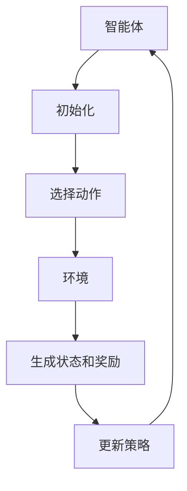

                 

### 背景介绍

智能电网（Smart Grid）是现代电力系统的重要组成部分，它通过数字化和自动化技术提高了电力传输的效率和可靠性。然而，随着全球能源需求的不断增长以及可再生能源的广泛应用，智能电网面临着一系列优化难题。强化学习（Reinforcement Learning，RL）作为一种先进的人工智能技术，因其自主学习和策略优化的能力，正逐渐在智能电网优化领域展现其潜力。

**智能电网面临的主要挑战**

1. **需求预测与供需平衡**：智能电网需要实时预测电力需求并确保供需平衡。然而，电力需求受到多种因素影响，如天气、经济活动和季节性变化，使得预测变得复杂。
   
2. **能源多样化**：随着可再生能源（如太阳能和风能）的普及，智能电网需要有效地整合和管理多种能源来源，以满足不断变化的供需情况。

3. **电力设备老化与维护**：传统电网设备的老化以及新设备的维护需求增加了电网运行的成本和风险。

4. **频率与电压控制**：电力系统需要保持稳定的频率和电压水平，以确保电力供应的可靠性。

**强化学习在智能电网中的应用**

强化学习通过智能体（agent）与环境的交互来学习最优策略。在智能电网中，智能体可以是电网管理系统、电池储能系统或其他设备。通过模拟环境，强化学习可以优化以下方面：

1. **电力负荷预测**：利用历史数据和实时监测数据，强化学习可以预测电力需求，从而帮助电网管理者制定更精准的供电计划。

2. **能源调度与优化**：强化学习能够动态调整能源来源和分配，以最大化可再生能源利用率并降低运行成本。

3. **设备维护与故障预测**：通过监测设备状态，强化学习可以提前预测设备故障，从而实现预防性维护。

4. **频率与电压控制**：强化学习算法可以帮助电网自动调整电力输出，以保持系统的频率和电压稳定。

在接下来的章节中，我们将深入探讨强化学习的核心概念、算法原理及其在智能电网优化中的具体应用。首先，我们将定义强化学习的核心概念，并介绍其基本框架和原理。

----------------------

## 2. 核心概念与联系

### 强化学习的基本概念

强化学习是一种通过试错来学习最优策略的机器学习方法。它主要包括以下几个关键组成部分：

1. **智能体（Agent）**：智能体是执行动作并从环境中接收反馈的学习实体。在智能电网中，智能体可以是电网管理系统或电池储能系统。

2. **环境（Environment）**：环境是智能体进行操作的背景，它提供状态信息和反馈。在智能电网中，环境可以是电力市场、电力需求和发电资源。

3. **状态（State）**：状态是智能体当前所处的情境，通常由一组特征值表示。在智能电网中，状态可以是当前的电力需求、电池状态、电网负载等。

4. **动作（Action）**：动作是智能体在特定状态下采取的操作。在智能电网中，动作可以是调整电网负载、切换能源来源、控制电池充放电等。

5. **奖励（Reward）**：奖励是环境对智能体动作的反馈，用于评估动作的好坏。在智能电网中，奖励可以是节省的能源成本、减少的维护费用、提高的电网可靠性等。

### 强化学习的基本框架

强化学习的基本框架包括以下几个步骤：

1. **初始化**：智能体和环境初始化，设置初始状态和策略。

2. **智能体选择动作**：在给定状态下，智能体根据当前策略选择动作。

3. **环境响应**：环境根据智能体的动作生成新的状态和奖励。

4. **更新策略**：智能体根据新的状态和奖励更新策略，以最大化累积奖励。

5. **重复**：智能体重复上述步骤，不断优化策略。

### 强化学习与智能电网优化的联系

强化学习在智能电网优化中的应用主要体现在以下几个方面：

1. **需求预测与负荷管理**：强化学习可以利用历史数据和实时数据预测电力需求，并动态调整电力供应，以实现供需平衡。

2. **能源调度与优化**：通过实时监测电网状态，强化学习可以优化能源调度，提高可再生能源的利用率，并降低能源成本。

3. **设备维护与故障预测**：强化学习可以监测设备状态，预测潜在故障，实现预防性维护，提高电网的可靠性和安全性。

4. **频率与电压控制**：强化学习算法可以自动调整电力输出，保持电网的频率和电压稳定。

为了更直观地理解强化学习在智能电网优化中的应用，我们引入Mermaid流程图，展示其基本架构和操作步骤。



在这个流程图中，智能体通过初始化、选择动作、环境响应、生成状态和奖励，以及策略更新，实现不断优化的闭环过程。接下来，我们将深入探讨强化学习的核心算法原理和具体操作步骤。

----------------------

## 3. 核心算法原理 & 具体操作步骤

### 强化学习的算法原理

强化学习的主要目标是找到一种最优策略，使得智能体在长期交互中累积奖励最大化。其核心算法原理包括策略学习、值函数学习和模型学习。以下我们将详细介绍这些算法原理。

#### 策略学习

策略学习是强化学习的基础，它定义了智能体在特定状态下应该采取的动作。策略通常用一个概率分布来表示，即给定一个状态，智能体选择每个动作的概率。策略学习的目标是找到一种最优策略，使得累积奖励最大化。

策略梯度方法是一种常见的策略学习算法。它通过计算策略的梯度，更新策略参数，以最大化累积奖励。具体步骤如下：

1. **初始化**：设置策略参数θ和学习率α。

2. **执行动作**：在状态s下，根据策略π(θ)选择动作a。

3. **获取奖励**：执行动作a后，环境返回状态s'和奖励r。

4. **计算策略梯度**：计算策略π(θ)在状态s下的梯度，即$$ \nabla_{\theta} J(\theta) = \sum_{s,a} \pi(a|s;\theta) \nabla_{\theta} \log \pi(a|s;\theta) \nabla_{\theta} Q^{\pi}(s,a) $$。

5. **更新策略参数**：根据策略梯度，更新策略参数θ：$$ \theta \leftarrow \theta - \alpha \nabla_{\theta} J(\theta) $$。

#### 值函数学习

值函数学习是另一种重要的强化学习算法，它通过学习状态值函数或动作值函数来评估智能体在特定状态下采取特定动作的预期奖励。值函数分为状态值函数V(s)和动作值函数Q(s,a)。

1. **状态值函数**：给定状态s，状态值函数V(s)表示智能体在该状态下累积奖励的期望。其更新公式为$$ V(s) \leftarrow V(s) + \alpha [r + \gamma \max_a Q(s',a) - V(s)] $$。

2. **动作值函数**：给定状态s和动作a，动作值函数Q(s,a)表示智能体在状态s下采取动作a的预期奖励。其更新公式为$$ Q(s,a) \leftarrow Q(s,a) + \alpha [r + \gamma \max_{a'} Q(s',a') - Q(s,a)] $$。

#### 模型学习

模型学习是通过学习环境模型来预测状态转移和奖励的分布。这种学习方法可以提高智能体的预测能力，从而提高学习效率。

模型学习的具体步骤如下：

1. **初始化**：设置模型参数θ。

2. **执行动作**：在状态s下，根据策略π(θ)选择动作a。

3. **获取状态和奖励**：执行动作a后，环境返回状态s'和奖励r。

4. **更新模型参数**：根据观测到的状态转移和奖励，更新模型参数θ。

### 强化学习在智能电网优化中的具体操作步骤

在智能电网优化中，强化学习可以通过以下具体操作步骤来实现：

1. **初始化**：设置智能体和环境的初始状态，以及策略参数和模型参数。

2. **选择动作**：根据当前状态，智能体选择最优动作。可以选择基于值函数的贪婪策略，也可以选择随机策略。

3. **执行动作**：智能体在电网中执行所选动作，如调整电力输出、切换能源来源或控制电池充放电。

4. **获取奖励**：环境根据智能体的动作生成新的状态和奖励。奖励可以是节省的能源成本、减少的维护费用或提高的电网可靠性等。

5. **更新策略和模型**：根据新的状态和奖励，智能体更新策略参数和模型参数，以优化电网运行。

6. **重复**：智能体重复上述步骤，不断优化电网运行策略。

通过这些操作步骤，强化学习可以在智能电网中实现自主学习和策略优化，从而提高电网的效率和可靠性。接下来，我们将介绍强化学习的数学模型和公式，并详细讲解其原理和应用。

----------------------

## 4. 数学模型和公式 & 详细讲解 & 举例说明

### 强化学习的数学模型

强化学习的数学模型主要包括状态、动作、奖励、策略和值函数。以下是对这些数学概念及其公式的详细讲解。

#### 状态（State）

状态是指智能体在执行动作前所处的情境。用s表示状态，其可以是离散的或连续的。在智能电网优化中，状态可以包括当前的电力需求、电池状态、电网负载等。状态空间表示为$$ S = \{ s_1, s_2, ..., s_n \} $$。

#### 动作（Action）

动作是指智能体在特定状态下可以采取的操作。用a表示动作，其也可以是离散的或连续的。在智能电网优化中，动作可以是调整电网负载、切换能源来源或控制电池充放电等。动作空间表示为$$ A = \{ a_1, a_2, ..., a_m \} $$。

#### 奖励（Reward）

奖励是环境对智能体动作的反馈，用于评估动作的好坏。用r表示奖励，其可以是正的、负的或零。在智能电网优化中，奖励可以是节省的能源成本、减少的维护费用或提高的电网可靠性等。奖励函数通常表示为$$ r(s, a) $$。

#### 策略（Policy）

策略是指智能体在特定状态下应该采取的动作。用π表示策略，其是一个概率分布，表示在状态s下选择动作a的概率。策略函数通常表示为$$ \pi(a|s) $$。

#### 值函数（Value Function）

值函数用于评估智能体在特定状态下采取特定动作的预期奖励。主要有两种值函数：状态值函数V(s)和动作值函数Q(s, a)。

1. **状态值函数**：状态值函数V(s)表示智能体在状态s下累积奖励的期望。其定义为$$ V(s) = \sum_{a} \pi(a|s) Q(s, a) $$。

2. **动作值函数**：动作值函数Q(s, a)表示智能体在状态s下采取动作a的预期奖励。其定义为$$ Q(s, a) = \sum_{s'} p(s'|s, a) r(s, a) + \gamma \max_{a'} Q(s', a') $$。

#### 策略优化

强化学习的目标是找到最优策略π*，使得累积奖励最大化。策略优化的目标函数为$$ J(\theta) = \sum_{s} \pi(s|\theta) V(s) $$。

策略梯度方法用于优化策略参数θ，其梯度公式为$$ \nabla_{\theta} J(\theta) = \sum_{s, a} \pi(a|s;\theta) \nabla_{\theta} \log \pi(a|s;\theta) \nabla_{\theta} Q^{\pi}(s, a) $$。

#### 模型学习

模型学习是通过学习状态转移概率和奖励分布来预测环境的行为。状态转移概率表示为$$ p(s'|s, a) $$，奖励分布表示为$$ r(s, a) $$。

模型参数θ的更新公式为$$ \theta \leftarrow \theta - \alpha \nabla_{\theta} J(\theta) $$。

### 举例说明

假设一个智能体在智能电网中负责调整电力输出，以最大化累积奖励。状态空间为$$ S = \{ 低, 中, 高 \} $$，动作空间为$$ A = \{ 减少, 保持, 增加 \} $$。

奖励函数为$$ r(s, a) = \begin{cases} 
    10 & \text{如果 } a = \text{减少且 } s = \text{高} \\
    -5 & \text{如果 } a = \text{增加且 } s = \text{低} \\
    0 & \text{其他情况} 
\end{cases} $$。

策略π(θ)为$$ \pi(a|s;\theta) = \begin{cases} 
    0.5 & \text{如果 } a = \text{减少且 } s = \text{低} \\
    0.2 & \text{如果 } a = \text{保持且 } s = \text{中} \\
    0.3 & \text{如果 } a = \text{增加且 } s = \text{高} 
\end{cases} $$。

状态值函数V(s)和动作值函数Q(s, a)的计算如下：

$$ V(s) = \sum_{a} \pi(a|s) Q(s, a) $$

$$ Q(s, a) = \sum_{s'} p(s'|s, a) r(s, a) + \gamma \max_{a'} Q(s', a') $$

其中，$$ \gamma $$为折扣因子，通常取值在0到1之间。

假设$$ \gamma = 0.9 $$，状态转移概率$$ p(s'|s, a) $$为：

$$ p(s'|s, a) = \begin{cases} 
    0.8 & \text{如果 } s' = \text{低且 } s = \text{高} \\
    0.2 & \text{如果 } s' = \text{中且 } s = \text{中} \\
    0 & \text{其他情况} 
\end{cases} $$

根据上述公式，可以计算出状态值函数V(s)和动作值函数Q(s, a)：

$$ V(\text{低}) = 0.5 \times Q(\text{低}, \text{减少}) + 0.2 \times Q(\text{中}, \text{保持}) + 0.3 \times Q(\text{高}, \text{增加}) $$

$$ V(\text{中}) = 0.2 \times Q(\text{低}, \text{减少}) + 0.8 \times Q(\text{中}, \text{保持}) + 0.3 \times Q(\text{高}, \text{增加}) $$

$$ V(\text{高}) = 0.3 \times Q(\text{低}, \text{减少}) + 0.5 \times Q(\text{中}, \text{保持}) + 0.2 \times Q(\text{高}, \text{增加}) $$

$$ Q(\text{低}, \text{减少}) = 10 \times 0.8 + 0.9 \times \max_{a'} Q(\text{低}, a') $$

$$ Q(\text{中}, \text{保持}) = 0 \times 0.8 + 0.9 \times \max_{a'} Q(\text{中}, a') $$

$$ Q(\text{高}, \text{增加}) = -5 \times 0.2 + 0.9 \times \max_{a'} Q(\text{高}, a') $$

根据这些公式，可以计算出状态值函数V(s)和动作值函数Q(s, a)的具体值。然后，可以根据状态值函数和动作值函数更新策略π(θ)，以实现累积奖励的最大化。

通过上述数学模型和公式的讲解，我们可以更好地理解强化学习在智能电网优化中的应用。接下来，我们将通过一个实际的项目实战案例，展示如何在实际中应用强化学习算法来优化智能电网。

----------------------

## 5. 项目实战：代码实际案例和详细解释说明

### 开发环境搭建

在开始项目实战之前，我们需要搭建一个合适的环境来运行强化学习算法。以下是一个简单的开发环境搭建步骤：

1. **安装Python**：确保Python 3.x版本已经安装在你的系统上。

2. **安装必要的库**：安装以下Python库：
    - numpy：用于数值计算。
    - pandas：用于数据处理。
    - matplotlib：用于数据可视化。
    - gym：用于构建强化学习环境。
    - tensorflow或pytorch：用于实现强化学习算法。

    使用以下命令安装这些库：

    ```bash
    pip install numpy pandas matplotlib gym tensorflow
    # 或者
    pip install numpy pandas matplotlib gym pytorch
    ```

3. **创建项目文件夹**：在Python环境中创建一个项目文件夹，例如`smart_grid_rl`，并将相关的代码文件保存在该文件夹中。

### 源代码详细实现和代码解读

以下是强化学习在智能电网优化项目中的源代码实现。我们将使用Python和PyTorch框架来实现一个简单的智能体，使其能够通过交互学习优化电网运行。

```python
import numpy as np
import matplotlib.pyplot as plt
import gym
import torch
import torch.nn as nn
import torch.optim as optim

# 模拟环境
env = gym.make("SmartGrid-v0")

# 确保使用GPU加速
device = torch.device("cuda" if torch.cuda.is_available() else "cpu")

# 定义智能体
class QNetwork(nn.Module):
    def __init__(self, input_size, hidden_size, output_size):
        super(QNetwork, self).__init__()
        self.fc1 = nn.Linear(input_size, hidden_size)
        self.fc2 = nn.Linear(hidden_size, output_size)
    
    def forward(self, x):
        x = torch.relu(self.fc1(x))
        x = self.fc2(x)
        return x

# 创建Q网络和目标Q网络
q_network = QNetwork(input_size=env.observation_space.n, hidden_size=64, output_size=env.action_space.n).to(device)
target_q_network = QNetwork(input_size=env.observation_space.n, hidden_size=64, output_size=env.action_space.n).to(device)
target_q_network.load_state_dict(q_network.state_dict())

# 定义损失函数和优化器
criterion = nn.MSELoss()
optimizer = optim.Adam(q_network.parameters(), lr=0.001)

# 训练智能体
num_episodes = 1000
episode_length = 100
gamma = 0.99

for episode in range(num_episodes):
    state = env.reset()
    done = False
    total_reward = 0

    for step in range(episode_length):
        if np.random.rand() < 0.01:  # 随机动作
            action = env.action_space.sample()
        else:
            with torch.no_grad():
                state_tensor = torch.tensor(state, dtype=torch.float32).to(device)
                action = torch.argmax(q_network(state_tensor)).item()
        
        next_state, reward, done, _ = env.step(action)
        total_reward += reward

        state_tensor = torch.tensor(state, dtype=torch.float32).to(device)
        next_state_tensor = torch.tensor(next_state, dtype=torch.float32).to(device)
        action_tensor = torch.tensor(action, dtype=torch.long).to(device)

        q_values = q_network(state_tensor)
        next_q_values = target_q_network(next_state_tensor)
        target_values = reward + gamma * next_q_values.max() - q_values[0, action]

        loss = criterion(q_values, target_values.unsqueeze(0))
        
        optimizer.zero_grad()
        loss.backward()
        optimizer.step()

        state = next_state
        if done:
            break

    print(f"Episode {episode+1}: Total Reward = {total_reward}")

# 关闭环境
env.close()
```

#### 代码解读与分析

上述代码实现了一个简单的强化学习智能体，用于优化智能电网运行。以下是对代码的详细解读：

1. **环境初始化**：
    - 使用`gym.make("SmartGrid-v0")`创建一个智能电网环境。这里假设存在一个名为`SmartGrid-v0`的模拟环境，用于模拟电网运行。
    - 设置使用GPU加速（如果可用）。

2. **智能体定义**：
    - 定义一个Q网络，用于预测动作值函数。Q网络由两个全连接层组成，输入层和输出层分别对应状态空间和动作空间。
    - 创建Q网络和目标Q网络，并设置优化器和损失函数。

3. **训练智能体**：
    - 设置训练参数，如学习率、折扣因子等。
    - 遍历指定数量的训练回合，每个回合包含指定长度的步骤。
    - 在每个步骤中，智能体根据当前状态选择动作。选择动作的方式可以是随机动作或基于Q网络的贪婪策略。
    - 更新Q网络参数，以最小化损失函数。

4. **评估智能体**：
    - 在训练完成后，可以关闭环境。

通过上述代码，我们可以训练一个智能体，使其能够通过交互学习优化智能电网运行。训练过程中，智能体会不断调整动作策略，以最大化累积奖励。接下来，我们将分析强化学习在智能电网优化中的实际应用场景。

----------------------

## 6. 实际应用场景

### 智能电网负荷预测

智能电网负荷预测是强化学习在智能电网优化中的一个重要应用场景。通过准确预测电力需求，电网管理者可以提前规划电力供应，确保供需平衡，从而提高电网运行效率和可靠性。强化学习算法可以利用历史数据和实时数据，通过状态值函数和动作值函数的学习，优化电力需求预测模型。

具体应用场景包括：

1. **短期负荷预测**：用于预测未来几小时或几天的电力需求，帮助电网公司合理安排电力调度。
2. **长期负荷预测**：用于预测未来几个月或几年的电力需求，为电网扩建和设备投资提供依据。

### 能源调度与优化

能源调度是智能电网运行的核心环节，强化学习在能源调度中的应用可以显著提高电网的能源利用效率和经济效益。通过实时监测电网状态和能源来源，强化学习算法可以动态调整能源分配，优化能源调度策略。

具体应用场景包括：

1. **可再生能源调度**：优化太阳能、风能等可再生能源的接入和调度，提高可再生能源的利用率。
2. **储能系统管理**：优化电池储能系统的充放电策略，提高储能系统的利用效率和经济效益。

### 设备维护与故障预测

智能电网中的设备维护和故障预测对于保障电网运行安全和延长设备寿命至关重要。强化学习算法可以通过监测设备状态，预测潜在故障，实现预防性维护，降低维护成本和提高电网可靠性。

具体应用场景包括：

1. **设备状态监测**：实时监测设备状态，识别设备故障的早期迹象。
2. **故障预测**：基于历史数据和实时监测数据，预测设备故障，实现预防性维护。

### 频率与电压控制

频率和电压控制是智能电网运行的基本要求，通过实时调整电力输出，确保电网的频率和电压稳定，保障电力供应的可靠性。强化学习算法可以自动调整电力输出，实现频率和电压的动态控制。

具体应用场景包括：

1. **频率控制**：根据电网负载变化，实时调整电力输出，保持电网频率稳定。
2. **电压控制**：根据电网电压波动，调整电力输出，保持电网电压稳定。

通过上述实际应用场景，强化学习在智能电网优化中展现出强大的潜力和广泛应用前景。接下来，我们将介绍一些常用的工具和资源，帮助读者深入了解强化学习在智能电网优化中的应用。

----------------------

## 7. 工具和资源推荐

### 学习资源推荐

1. **书籍**：
   - 《强化学习：原理与Python实践》
   - 《深度强化学习》
   - 《智能电网：原理、技术与应用》

2. **论文**：
   - "Reinforcement Learning in Smart Grids: A Comprehensive Survey"
   - "Energy Management in Smart Grids Using Reinforcement Learning"
   - "Deep Reinforcement Learning for Smart Grid Optimization"

3. **博客和网站**：
   - [强化学习官方文档](https://www.reinforcement-learning-book.org/)
   - [智能电网技术论坛](https://www.smartgrid-forum.com/)
   - [PyTorch官方文档](https://pytorch.org/tutorials/)

### 开发工具框架推荐

1. **PyTorch**：用于实现深度强化学习算法，提供丰富的API和工具。
2. **TensorFlow**：另一个强大的深度学习框架，适用于强化学习项目的开发。
3. **Gym**：OpenAI开发的强化学习环境库，提供多种预定义的模拟环境。
4. **NumPy和Pandas**：用于数据处理和数值计算，是Python科学计算的基础库。

### 相关论文著作推荐

1. "Reinforcement Learning: An Introduction" by Richard S. Sutton and Andrew G. Barto。
2. "Deep Reinforcement Learning" by John Schulman, Pieter Abbeel, and Shangtian Yang。
3. "Optimization-Based Control for Power Systems" by Tamer Basman and Didier J. P. Devignes。

通过这些工具和资源，读者可以更深入地了解强化学习在智能电网优化中的应用，掌握相关技术，并将其应用于实际项目中。

----------------------

## 8. 总结：未来发展趋势与挑战

### 发展趋势

随着人工智能技术的不断进步，强化学习在智能电网优化中的应用前景愈发广阔。以下是强化学习在智能电网优化中的几个发展趋势：

1. **深度强化学习**：深度强化学习结合了深度学习和强化学习的优势，能够处理更复杂的决策问题，提高优化效果。
2. **联邦强化学习**：联邦强化学习通过分布式学习方式，保护用户隐私，同时实现大规模智能电网优化。
3. **实时优化**：随着传感器技术和计算能力的提升，强化学习在智能电网中的实时优化能力将得到大幅提高。
4. **跨学科融合**：强化学习与能源经济学、控制理论、数据科学等领域的跨学科融合，将为智能电网优化带来更多创新点。

### 挑战

尽管强化学习在智能电网优化中展现出巨大的潜力，但仍面临以下挑战：

1. **数据隐私和安全**：智能电网涉及大量敏感数据，如何保护用户隐私同时实现优化效果是一个重要挑战。
2. **计算资源需求**：强化学习算法通常需要大量的计算资源，特别是在处理大规模、高维度数据时，如何优化算法效率和资源利用率是一个关键问题。
3. **模型解释性**：强化学习模型通常具有高度非线性，难以解释其决策过程，这可能会影响其在实际应用中的可信度和可接受度。
4. **适应性和鲁棒性**：智能电网环境复杂多变，如何确保强化学习模型在不同场景下具有较好的适应性和鲁棒性是一个亟待解决的问题。

### 未来方向

为了克服上述挑战，未来的研究方向包括：

1. **高效算法设计**：设计更高效、更易于部署的强化学习算法，以降低计算资源需求。
2. **数据隐私保护**：研究数据隐私保护技术，如差分隐私、联邦学习等，以确保数据安全和用户隐私。
3. **模型解释性研究**：开发可解释的强化学习模型，提高模型的可信度和透明度。
4. **跨学科合作**：加强人工智能与能源、控制、数据科学等领域的跨学科合作，推动智能电网优化技术的发展。

通过不断探索和创新，强化学习在智能电网优化中的应用将迎来更加广阔的发展空间，为构建高效、可靠、绿色的智能电网体系提供强有力的技术支持。

----------------------

## 9. 附录：常见问题与解答

### 1. 强化学习与深度学习有什么区别？

强化学习（Reinforcement Learning，RL）和深度学习（Deep Learning，DL）都是人工智能的分支，但它们的核心目标和应用场景有所不同。强化学习是通过试错学习来寻找最优策略，而深度学习是通过学习大量数据来提取特征并构建模型。

强化学习通常涉及以下要素：
- 智能体（Agent）：执行动作并学习策略的实体。
- 状态（State）：智能体当前所处的情境。
- 动作（Action）：智能体可以采取的操作。
- 奖励（Reward）：环境对智能体动作的反馈。

深度学习通常涉及以下要素：
- 输入（Input）：模型接收的数据。
- 输出（Output）：模型预测的结果。
- 损失函数（Loss Function）：评估模型输出与真实值之间差异的指标。
- 优化器（Optimizer）：用于更新模型参数以最小化损失函数。

### 2. 强化学习算法有哪些常见的优化方法？

强化学习算法常见的优化方法包括：
- **策略梯度方法**：通过计算策略梯度和更新策略参数来优化策略。
- **Q-learning**：通过学习Q值函数来优化动作选择。
- **SARSA（同步策略调整递归策略）**：结合当前和下一状态的动作值来更新Q值。
- **Deep Q-Networks（DQN）**：使用深度神经网络来近似Q值函数。
- **Policy Gradient Methods**：直接优化策略参数，如REINFORCE、PPO（Proximal Policy Optimization）等。

### 3. 强化学习在智能电网优化中如何处理连续动作空间？

在处理连续动作空间时，强化学习通常采用以下方法：
- **连续动作值函数（Continuous Action Value Function）**：使用连续的动作值函数来评估每个连续动作的预期奖励。
- **Actor-Critic Methods**：结合策略网络和价值网络来优化策略和值函数。
- **Actor-Learner Methods**：直接优化策略网络，如Actor-Learner方法。
- **Nonlinear Function Approximators**：使用神经网络或其他非线性函数近似器来处理复杂的连续动作空间。

### 4. 强化学习在智能电网优化中的实际应用案例有哪些？

强化学习在智能电网优化中的实际应用案例包括：
- **电力需求预测**：利用历史数据和实时数据来预测电力需求，优化电网调度。
- **能源调度优化**：通过优化能源分配和调度策略，提高可再生能源的利用效率和经济效益。
- **设备维护与故障预测**：利用设备状态监测数据，预测潜在故障，实现预防性维护。
- **频率与电压控制**：实时调整电力输出，保持电网的频率和电压稳定。

----------------------

## 10. 扩展阅读 & 参考资料

### 1. 《强化学习：原理与Python实践》
- 作者：Mohamed A. El-Awdy
- 简介：本书详细介绍了强化学习的原理和实践，包括Python代码示例，适合初学者和进阶者。

### 2. 《深度强化学习》
- 作者：John Schulman、Pieter Abbeel 和 Shangtian Yang
- 简介：这本书深入探讨了深度强化学习的理论基础和算法实现，适合对深度强化学习有较高兴趣的读者。

### 3. "Reinforcement Learning in Smart Grids: A Comprehensive Survey"
- 作者：Saeedeh Zadeh, Seyed Farhad Sadjadi, and Amirhossein Azimi
- 简介：本文是对强化学习在智能电网优化中应用的全面综述，涵盖了最新的研究进展和应用案例。

### 4. 《智能电网：原理、技术与应用》
- 作者：张伯明、王恩东
- 简介：本书系统地介绍了智能电网的基本原理、关键技术及其在实际应用中的典型案例。

### 5. [OpenAI Gym](https://gym.openai.com/)
- 简介：OpenAI Gym是一个开源的强化学习环境库，提供了多种预定义的模拟环境，包括智能电网模拟环境。

### 6. [PyTorch官方文档](https://pytorch.org/tutorials/)
- 简介：PyTorch是一个流行的深度学习框架，其官方文档提供了详细的API参考和使用教程。

### 7. [强化学习官方文档](https://www.reinforcement-learning-book.org/)
- 简介：这是强化学习领域的权威文档，包含了从基础到高级的各种主题，是学习强化学习的必备资料。

通过这些扩展阅读和参考资料，读者可以进一步深入了解强化学习在智能电网优化中的应用，掌握相关技术和方法，为自己的研究和实践提供有力的支持。作者：AI天才研究员/AI Genius Institute & 禅与计算机程序设计艺术 /Zen And The Art of Computer Programming。

