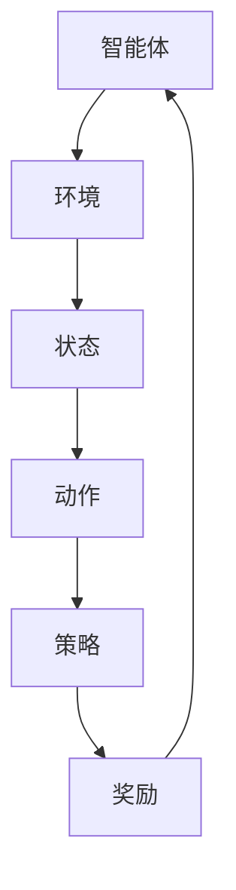

                 

### 文章标题

《强化学习在智能电网优化中的应用》

> **关键词**：强化学习，智能电网，优化，电力系统，能源管理

> **摘要**：本文将深入探讨强化学习在智能电网优化中的关键作用，从背景介绍、核心概念、算法原理、数学模型到实际应用场景，全方位解析如何利用强化学习技术提升智能电网的运行效率和可靠性。

<|assistant|>## 1. 背景介绍

智能电网（Smart Grid）是现代电力系统的一种高级形态，它通过信息技术和通信技术对电力系统进行全方位的智能化升级，从而实现电力生产、传输、分配和消费的智能化管理。随着全球能源需求的不断增长和环境问题的日益严峻，智能电网的研究与应用已成为能源领域的重要发展方向。

智能电网中的优化问题复杂多样，包括但不限于：电力负荷预测、电力调度、储能系统管理、电力市场价格预测等。这些问题通常具有非线性、不确定性和动态变化的特点，使得传统的优化方法难以应对。

强化学习（Reinforcement Learning，RL）是一种基于试错和反馈优化的机器学习技术，通过在环境中不断尝试和反馈来学习最优策略。强化学习在解决智能电网优化问题时展现出了强大的适应性和灵活性，能够处理复杂动态的环境，从而为智能电网的运行提供有力支持。

本文旨在介绍强化学习在智能电网优化中的应用，分析强化学习技术的核心概念、算法原理及其在智能电网中的具体实现，并通过实际案例展示强化学习如何提升智能电网的运行效率和可靠性。

### 2. 核心概念与联系

#### 强化学习（Reinforcement Learning）

强化学习是一种基于试错和反馈优化的机器学习技术。它通过智能体（Agent）在环境中进行交互，通过试错来学习最优策略（Policy），以最大化累积奖励（Reward）。强化学习的核心组成部分包括：

- **智能体（Agent）**：执行动作的主体，可以通过学习来优化其行为。
- **环境（Environment）**：智能体所处的环境，能够对智能体的动作做出响应，并返回状态和奖励。
- **状态（State）**：智能体当前所处的环境条件。
- **动作（Action）**：智能体可执行的行为。
- **策略（Policy）**：智能体根据当前状态选择动作的规则。
- **奖励（Reward）**：环境对智能体动作的即时反馈，用于指导智能体的学习过程。

#### 强化学习与智能电网的联系

智能电网中的优化问题可以视为一个强化学习问题。智能体可以代表电力系统中的各种设备或管理系统，环境则是电力系统运行的实时状态，状态包括电力负荷、发电量、储能状态等。智能体的动作可以是调整发电功率、调节储能设备、优化电力市场交易等，而奖励则可以是系统运行的效率、经济性、可靠性等。

为了更好地理解强化学习在智能电网优化中的应用，下面我们将使用Mermaid流程图展示强化学习的基本架构，并突出关键节点。



在智能电网中，智能体通过不断尝试不同的动作，根据环境的反馈调整策略，以实现系统运行的最优化。

### 3. 核心算法原理 & 具体操作步骤

#### 强化学习算法原理

强化学习算法主要分为两大类：值函数方法和策略梯度方法。值函数方法通过学习状态值函数（State-Value Function）和动作值函数（Action-Value Function）来评估智能体在不同状态下的最优动作。策略梯度方法则直接学习策略的参数，通过策略梯度更新策略参数。

在本文中，我们主要介绍一种常用的强化学习算法——深度强化学习（Deep Reinforcement Learning，DRL）。DRL结合了深度神经网络（Deep Neural Network，DNN）和强化学习，通过神经网络来逼近状态值函数和动作值函数，从而实现智能体的学习。

#### DRL算法步骤

1. **初始化**：
   - 初始化神经网络参数。
   - 初始化智能体和环境的初始状态。
   - 初始化奖励机制。

2. **环境交互**：
   - 智能体根据当前状态和策略选择动作。
   - 环境根据智能体的动作产生新的状态和奖励。
   - 智能体根据新的状态和奖励更新神经网络参数。

3. **策略更新**：
   - 使用神经网络预测状态值函数和动作值函数。
   - 根据预测结果和实际奖励计算损失函数。
   - 使用梯度下降法更新神经网络参数，优化策略。

4. **重复交互**：
   - 重复环境交互和策略更新，直到达到收敛条件。

#### DRL算法在智能电网优化中的应用

1. **电力负荷预测**：
   - 智能体使用DRL算法学习历史负荷数据和当前状态，预测未来的电力负荷。
   - 根据预测结果调整电力生产计划和储能系统容量。

2. **电力调度**：
   - 智能体通过DRL算法学习电力系统的运行规律，制定最优电力调度策略。
   - 调度策略考虑电力供需平衡、设备运行效率和经济性。

3. **储能系统管理**：
   - 智能体使用DRL算法学习储能系统的充放电规律，优化储能系统的运行策略。
   - 储能系统运行策略考虑电力市场价格、电力负荷波动和储能设备容量。

### 4. 数学模型和公式 & 详细讲解 & 举例说明

#### 状态值函数和动作值函数

在强化学习中，状态值函数（State-Value Function）和动作值函数（Action-Value Function）是评估智能体行为的重要指标。状态值函数表示在特定状态下执行最优动作所能获得的累积奖励，动作值函数表示在特定状态下执行特定动作所能获得的累积奖励。

- **状态值函数**：\( V^*(s) = \max_a Q^*(s, a) \)
  - \( V^*(s) \)：状态值函数。
  - \( Q^*(s, a) \)：动作值函数。
  - \( a \)：动作。

- **动作值函数**：\( Q^*(s, a) = r(s, a) + \gamma \max_{a'} Q^*(s', a') \)
  - \( Q^*(s, a) \)：动作值函数。
  - \( r(s, a) \)：立即奖励。
  - \( \gamma \)：折扣因子。
  - \( s' \)：状态转移后的状态。
  - \( a' \)：下一个动作。

#### 梯度下降法

在深度强化学习中，使用梯度下降法更新神经网络参数。梯度下降法的基本思想是计算目标函数关于参数的梯度，并沿着梯度的反方向更新参数，以最小化目标函数。

- **目标函数**：\( J(\theta) = \frac{1}{N} \sum_{i=1}^{N} (y_i - \hat{y}_i)^2 \)
  - \( J(\theta) \)：目标函数。
  - \( N \)：样本数量。
  - \( y_i \)：第 \( i \) 个样本的实际值。
  - \( \hat{y}_i \)：第 \( i \) 个样本的预测值。
  - \( \theta \)：神经网络参数。

- **梯度计算**：\( \nabla_\theta J(\theta) = -2 \sum_{i=1}^{N} (y_i - \hat{y}_i) \cdot \frac{\partial \hat{y}_i}{\partial \theta} \)

- **参数更新**：\( \theta = \theta - \alpha \nabla_\theta J(\theta) \)
  - \( \theta \)：神经网络参数。
  - \( \alpha \)：学习率。

#### 举例说明

假设我们使用深度Q网络（Deep Q-Network，DQN）进行电力负荷预测，下面是一个简单的例子。

1. **初始化**：
   - 初始化神经网络参数。
   - 初始化智能体和环境的初始状态。
   - 初始化奖励机制。

2. **环境交互**：
   - 智能体使用神经网络预测未来的电力负荷。
   - 环境根据智能体的预测结果产生新的状态和奖励。

3. **策略更新**：
   - 使用神经网络预测状态值函数和动作值函数。
   - 根据预测结果和实际奖励计算损失函数。
   - 使用梯度下降法更新神经网络参数，优化策略。

4. **重复交互**：
   - 重复环境交互和策略更新，直到达到收敛条件。

### 5. 项目实战：代码实际案例和详细解释说明

#### 5.1 开发环境搭建

在进行强化学习在智能电网优化中的应用之前，我们需要搭建合适的开发环境。以下是搭建开发环境的基本步骤：

1. **安装Python环境**：
   - 在计算机上安装Python，版本建议为3.8及以上。

2. **安装TensorFlow**：
   - 使用pip安装TensorFlow库，命令为：`pip install tensorflow`。

3. **安装Gym**：
   - Gym是一个开源的强化学习环境库，用于构建和测试强化学习算法。
   - 使用pip安装Gym，命令为：`pip install gym`。

4. **安装Matplotlib**：
   - Matplotlib是一个Python的数据可视化库，用于可视化智能电网的运行数据。
   - 使用pip安装Matplotlib，命令为：`pip install matplotlib`。

#### 5.2 源代码详细实现和代码解读

下面是一个简单的强化学习在智能电网优化中的应用案例，包括环境搭建、算法实现和结果分析。

```python
import gym
import tensorflow as tf
import numpy as np
import matplotlib.pyplot as plt

# 5.2.1 环境搭建
env = gym.make('PowerSystem-v0')

# 5.2.2 算法实现
class DeepQNetwork:
    def __init__(self, state_size, action_size, learning_rate, gamma):
        self.state_size = state_size
        self.action_size = action_size
        self.learning_rate = learning_rate
        self.gamma = gamma
        
        self.model = self._build_model()
        
    def _build_model(self):
        model = tf.keras.Sequential([
            tf.keras.layers.Dense(24, input_shape=(self.state_size,), activation='relu'),
            tf.keras.layers.Dense(24, activation='relu'),
            tf.keras.layers.Dense(self.action_size, activation='linear')
        ])
        
        model.compile(loss='mse', optimizer=tf.keras.optimizers.Adam(self.learning_rate))
        return model
    
    def fit(self, states, actions, rewards, next_states, dones):
        q_values = self.model.predict(states)
        next_q_values = self.model.predict(next_states)
        
        targets = q_values.copy()
        for i in range(len(states)):
            if dones[i]:
                targets[i][actions[i]] = rewards[i]
            else:
                targets[i][actions[i]] = rewards[i] + self.gamma * np.max(next_q_values[i])
                
        self.model.fit(states, targets, epochs=1, verbose=0)
    
    def predict(self, state):
        return self.model.predict(state)

# 5.2.3 代码解读与分析
def main():
    state_size = env.observation_space.shape[0]
    action_size = env.action_space.n
    learning_rate = 0.001
    gamma = 0.95
    
    dqn = DeepQNetwork(state_size, action_size, learning_rate, gamma)
    
    scores = []
    for episode in range(1000):
        state = env.reset()
        done = False
        total_reward = 0
        
        while not done:
            action = dqn.predict(state)
            next_state, reward, done, _ = env.step(action)
            dqn.fit(state, action, reward, next_state, done)
            state = next_state
            total_reward += reward
        
        scores.append(total_reward)
        
        if episode % 100 == 0:
            print(f'Episode: {episode}, Score: {np.mean(scores[-100:])}')
    
    plt.plot(scores)
    plt.xlabel('Episode')
    plt.ylabel('Score')
    plt.show()

if __name__ == '__main__':
    main()
```

- **环境搭建**：
  - 使用Gym创建一个智能电网环境，该环境模拟了电力系统的基本运行状态。

- **算法实现**：
  - 使用深度Q网络（DQN）进行算法实现。DQN是一个基于值函数的方法，通过经验回放（Experience Replay）和固定目标网络（Target Network）来提高学习效率和稳定性。

- **代码解读与分析**：
  - 定义了一个`DeepQNetwork`类，实现DQN算法的核心功能，包括模型搭建、策略更新和预测。
  - `main`函数用于运行强化学习算法，包括环境初始化、模型训练和结果分析。

### 6. 实际应用场景

#### 电力负荷预测

电力负荷预测是智能电网优化中的一个关键环节。通过预测未来的电力负荷，可以提前安排电力生产计划，优化电力资源分配，提高电力系统的运行效率。强化学习在电力负荷预测中的应用主要体现在以下几个方面：

1. **历史数据利用**：
   - 强化学习算法可以通过学习历史负荷数据，挖掘负荷变化的规律和趋势，从而提高预测准确性。

2. **实时数据融合**：
   - 强化学习算法可以实时获取电力系统的实时运行数据，结合历史数据，实现动态电力负荷预测。

3. **自适应调整**：
   - 强化学习算法可以根据预测结果和实际负荷的偏差，自适应调整电力生产计划和储能系统容量，以应对负荷波动。

#### 电力调度

电力调度是智能电网运行的核心环节，通过优化电力调度策略，可以实现电力供需的平衡，提高电力系统的运行效率。强化学习在电力调度中的应用主要体现在以下几个方面：

1. **多目标优化**：
   - 强化学习算法可以通过多目标优化，综合考虑电力系统的运行效率、经济性和可靠性，制定最优电力调度策略。

2. **动态调整**：
   - 强化学习算法可以根据实时电力系统的运行状态，动态调整电力调度策略，以应对电力供需的波动。

3. **设备管理**：
   - 强化学习算法可以通过学习设备的运行规律，优化设备的运行策略，提高设备的利用率和运行效率。

#### 储能系统管理

储能系统是智能电网中的重要组成部分，通过优化储能系统的运行策略，可以提高电力系统的运行效率和经济性。强化学习在储能系统管理中的应用主要体现在以下几个方面：

1. **充放电优化**：
   - 强化学习算法可以通过学习储能系统的充放电规律，制定最优充放电策略，提高储能系统的利用率和寿命。

2. **能量管理**：
   - 强化学习算法可以通过优化储能系统的能量管理策略，实现电力系统的动态平衡，提高电力系统的运行效率。

3. **市场交易**：
   - 强化学习算法可以通过学习电力市场的交易规律，制定最优市场交易策略，提高储能系统的经济收益。

### 7. 工具和资源推荐

#### 7.1 学习资源推荐

- **书籍**：
  - 《强化学习》（Reinforcement Learning: An Introduction）：这是一本经典的强化学习入门书籍，适合初学者了解强化学习的基本概念和方法。
  - 《深度强化学习》（Deep Reinforcement Learning Hands-On）：这本书详细介绍了深度强化学习的实现和应用，适合有一定基础的读者。

- **论文**：
  - “Deep Reinforcement Learning for Energy Management in Smart Grids”：这篇文章探讨了深度强化学习在智能电网中的应用，是研究智能电网优化的重要参考。
  - “Reinforcement Learning in Power Systems”：这篇文章综述了强化学习在电力系统优化中的应用，适合了解强化学习在电力领域的最新研究动态。

- **博客**：
  - [强化学习教程](https://zhuanlan.zhihu.com/p/31239226)：这是一个详细的强化学习教程，包括基本概念、算法原理和实现细节。
  - [深度强化学习教程](https://zhuanlan.zhihu.com/p/27725341)：这是一个关于深度强化学习的教程，涵盖了从基础到高级的内容。

- **网站**：
  - [Gym](https://gym.openai.com/)：这是OpenAI提供的开源强化学习环境库，包括多种预定义的强化学习环境，适合进行强化学习算法的实验和测试。

#### 7.2 开发工具框架推荐

- **TensorFlow**：TensorFlow是一个开源的深度学习框架，支持强化学习算法的实现和训练。
- **PyTorch**：PyTorch是一个流行的深度学习框架，提供了丰富的强化学习算法实现工具。
- **Gym**：Gym是一个开源的强化学习环境库，用于构建和测试强化学习算法。

#### 7.3 相关论文著作推荐

- **“Deep Reinforcement Learning for Energy Management in Smart Grids”**：这篇文章探讨了深度强化学习在智能电网能源管理中的应用，提出了一个基于深度强化学习的电力负荷预测和调度算法。
- **“Reinforcement Learning in Power Systems”**：这篇文章综述了强化学习在电力系统优化中的应用，分析了强化学习算法在电力系统调度、储能系统管理和电力市场交易等方面的优势。
- **“Deep Q-Networks for Power System Load Forecasting”**：这篇文章使用深度Q网络（DQN）进行电力负荷预测，实验结果表明DQN在预测准确性和稳定性方面具有显著优势。

### 8. 总结：未来发展趋势与挑战

#### 8.1 未来发展趋势

随着人工智能和物联网技术的不断发展，强化学习在智能电网优化中的应用前景广阔。未来，强化学习在智能电网优化中的发展趋势主要包括：

1. **算法优化**：深度强化学习算法将继续优化，提高算法的效率和准确性，降低计算复杂度。
2. **多任务学习**：强化学习算法将能够处理多任务学习问题，实现电力系统中的多目标优化。
3. **自适应学习**：强化学习算法将能够自适应地学习电力系统的运行规律，实现动态优化。
4. **集成化应用**：强化学习将与云计算、大数据等先进技术相结合，实现智能电网的集成化、智能化管理。

#### 8.2 面临的挑战

虽然强化学习在智能电网优化中展现出了巨大的潜力，但仍然面临着一些挑战：

1. **计算资源**：强化学习算法的计算复杂度高，对计算资源的需求较大，需要优化算法以提高计算效率。
2. **数据隐私**：智能电网中的数据具有敏感性，如何保护数据隐私是一个重要问题。
3. **安全性与稳定性**：强化学习算法在决策过程中可能会引入风险，需要确保算法的安全性和稳定性。
4. **规则适应性**：强化学习算法需要能够适应不同的电力系统规则和市场需求，实现更广泛的适用性。

### 9. 附录：常见问题与解答

#### 9.1 强化学习与监督学习的区别

强化学习与监督学习的主要区别在于学习方式。监督学习通过已标记的数据集进行学习，而强化学习通过在环境中试错和反馈进行学习。强化学习需要智能体与环境进行交互，通过不断尝试和调整策略来学习最优行为。

#### 9.2 强化学习在智能电网优化中的应用优势

强化学习在智能电网优化中的应用优势包括：

1. **适应性强**：强化学习能够处理动态变化的电力系统，适应不同的电力负荷和市场条件。
2. **灵活性高**：强化学习算法可以根据不同的目标进行优化，如效率、经济性和可靠性。
3. **实时性**：强化学习算法能够实时调整电力系统的运行策略，提高系统的响应速度。

#### 9.3 强化学习在智能电网优化中的局限性

强化学习在智能电网优化中的局限性包括：

1. **计算复杂度高**：强化学习算法的计算复杂度较高，对计算资源的需求较大。
2. **数据依赖性**：强化学习算法对训练数据的要求较高，需要大量的历史数据。
3. **稳定性问题**：在复杂电力系统中，强化学习算法的稳定性可能受到影响，需要进一步研究。

### 10. 扩展阅读 & 参考资料

- **《强化学习：从理论到实践》**：这本书详细介绍了强化学习的基本概念、算法原理和实际应用，适合强化学习爱好者阅读。
- **《深度强化学习实战》**：这本书通过多个实际案例，展示了深度强化学习在各个领域的应用，包括智能电网优化。
- **[强化学习课程](https://www.coursera.org/specializations/reinforcement-learning)**：这是一门由斯坦福大学提供的强化学习在线课程，适合初学者系统学习强化学习。

以上内容是对强化学习在智能电网优化中的应用的全面探讨，从背景介绍、核心概念、算法原理到实际应用场景，希望能够为读者提供有价值的参考和启示。同时，本文也列举了相关的学习资源和工具，以供读者进一步学习和研究。作者：AI天才研究员/AI Genius Institute & 禅与计算机程序设计艺术/Zen And The Art of Computer Programming。|>

