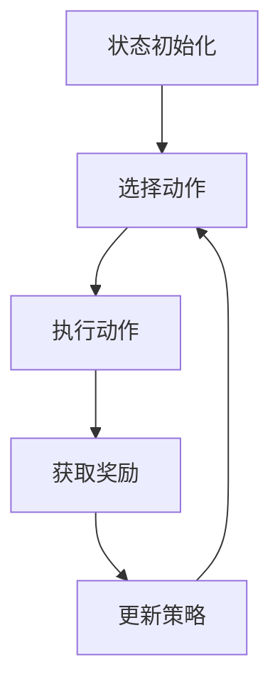

                 

### 背景介绍

#### 智能电网与需求响应

智能电网（Smart Grid）是一种通过信息通信技术（ICT）和先进控制技术的集成，实现对电力系统进行实时监控、管理和优化的电力网络。与传统电网相比，智能电网具有更高的可靠性、效率、灵活性和可持续性，能够更好地满足现代社会的用电需求。智能电网的核心特征包括：

1. **实时监控与数据采集**：通过安装在电网各个环节的传感器和数据采集设备，智能电网能够实现对电力流、信息流和控制流的实时监测。
2. **信息通信与控制**：基于高级通信协议，智能电网实现了各个节点间的实时通信，支持远程控制与自动化操作。
3. **互动性与需求响应**：智能电网能够根据用户的用电需求和电网的运行状况，动态调整电力供应，实现供需平衡。

需求响应（Demand Response，DR）是指通过电价信号或其他激励措施，引导用户调整用电行为，以达到电网运行优化或负荷管理目的的一种机制。需求响应的核心目标是提高电网运行效率，缓解高峰负荷压力，减少能源浪费，并促进可再生能源的利用。

#### 强化学习与智能电网

强化学习（Reinforcement Learning，RL）是一种机器学习范式，通过智能体与环境之间的交互，不断学习最优策略，以达到最大化累积奖励。强化学习在智能电网中的应用潜力巨大，主要体现在以下几个方面：

1. **负荷预测与优化调度**：通过强化学习算法，智能电网可以更好地预测用户负荷变化，并动态调整发电和输电计划，实现电网运行的最优化。
2. **需求响应策略设计**：强化学习能够自动学习用户响应模式，设计出更高效的需求响应策略，提高电网供需平衡能力。
3. **能源优化与管理**：强化学习可以帮助智能电网实现能源的智能化管理，优化能源分配，提高可再生能源的利用效率。

本文将围绕强化学习在智能电网需求响应与能源优化中的应用，逐步分析其核心算法原理、具体操作步骤、数学模型与公式、项目实战案例，以及未来发展趋势与挑战。通过本文的阅读，读者将全面了解强化学习在智能电网领域的应用前景和实现方法。

---

### 核心概念与联系

#### 强化学习的基本概念

强化学习（Reinforcement Learning，RL）是一种通过智能体（Agent）与环境（Environment）不断交互，以学习最优策略（Policy）的机器学习范式。在强化学习中，智能体根据当前状态（State）选择一个动作（Action），并接收到环境反馈的奖励（Reward），然后智能体根据奖励调整其策略。

**关键要素：**

- **状态（State）**：描述智能体在环境中的当前情况。
- **动作（Action）**：智能体在当前状态下可以选择的行为。
- **奖励（Reward）**：环境对智能体动作的反馈，用于评价动作的好坏。
- **策略（Policy）**：智能体从状态选择动作的规则，可以表示为 \( \pi(a|s) \)，即给定状态 \( s \) 下选择动作 \( a \) 的概率。

强化学习通过优化策略，最大化累积奖励，从而学习到最优行为。核心算法包括值函数（Value Function）和策略梯度（Policy Gradient）方法。

#### 强化学习在智能电网中的应用

在智能电网中，强化学习可以通过以下几种方式实现应用：

1. **负荷预测与优化调度**：
   - **状态**：历史负荷数据、天气信息、节假日等信息。
   - **动作**：调整发电量、调整输电线路运行状态等。
   - **奖励**：优化运行成本、减少能源浪费、提高供电可靠性。

2. **需求响应策略设计**：
   - **状态**：用户用电情况、电价信号、电网运行状况。
   - **动作**：调整电价、向用户发出用电建议等。
   - **奖励**：降低电网负荷峰值、提高用户满意度、实现供需平衡。

3. **能源优化与管理**：
   - **状态**：电网运行参数、可再生能源生成情况、用户用电需求。
   - **动作**：调整能源分配、优化储能系统运行状态。
   - **奖励**：提高可再生能源利用率、减少化石燃料消耗、降低环境污染。

#### Mermaid 流程图

以下是一个简化的强化学习在智能电网中的应用的 Mermaid 流程图，描述了智能体在智能电网中的状态、动作和奖励：



**Mermaid 流程图解析：**

- **A[状态初始化]**：智能体开始时需要初始化状态。
- **B[选择动作]**：智能体根据当前状态选择动作。
- **C[执行动作]**：智能体执行选择的动作，并对电网进行操作。
- **D[获取奖励]**：电网根据智能体的动作，提供奖励反馈。
- **E[更新策略]**：智能体根据奖励调整策略，以实现长期累积奖励最大化。

通过这种不断交互和学习的过程，强化学习能够帮助智能电网实现更高效、可靠的运行。

---

### 核心算法原理 & 具体操作步骤

#### 强化学习算法概述

强化学习算法可以分为两大类：基于值函数的算法和基于策略的算法。

1. **基于值函数的算法**：主要包括Q学习和SARSA（随行随学）。
   - **Q学习（Q-Learning）**：通过学习状态-动作值函数 \( Q(s, a) \)，即智能体在状态 \( s \) 下执行动作 \( a \) 所获得的长期预期奖励。
   - **SARSA（随行随学）**：智能体同时根据当前状态和未来状态来更新策略。

2. **基于策略的算法**：主要包括策略梯度方法。
   - **策略梯度方法**：通过直接优化策略来最大化累积奖励。

#### 强化学习在智能电网中的应用

1. **负荷预测与优化调度**

**步骤一：状态定义**  
   - **状态变量**：历史负荷数据、实时电力价格、天气状况、节假日等信息。

**步骤二：动作定义**  
   - **动作变量**：调整发电量、调整输电线路运行状态、储能系统充放电状态等。

**步骤三：奖励函数设计**  
   - **奖励函数**：综合考虑电网运行成本、能源利用率、供电可靠性等因素，设计适当的奖励函数。

**步骤四：策略更新**  
   - 使用Q学习或SARSA算法，通过不断更新策略，最大化累积奖励。

2. **需求响应策略设计**

**步骤一：状态定义**  
   - **状态变量**：用户用电情况、电价信号、电网运行状况等。

**步骤二：动作定义**  
   - **动作变量**：调整电价、向用户发出用电建议、调整电网运行策略等。

**步骤三：奖励函数设计**  
   - **奖励函数**：考虑用户满意度、电网负荷峰值、供需平衡等因素。

**步骤四：策略更新**  
   - 使用策略梯度方法，通过不断调整策略，优化用户响应效果。

3. **能源优化与管理**

**步骤一：状态定义**  
   - **状态变量**：电网运行参数、可再生能源生成情况、用户用电需求等。

**步骤二：动作定义**  
   - **动作变量**：调整能源分配、优化储能系统运行状态、调节可再生能源发电等。

**步骤三：奖励函数设计**  
   - **奖励函数**：考虑可再生能源利用率、减少化石燃料消耗、降低环境污染等因素。

**步骤四：策略更新**  
   - 使用Q学习或SARSA算法，通过不断更新策略，实现能源的智能化管理。

通过上述步骤，强化学习在智能电网中实现了负荷预测、需求响应和能源优化等应用，提高了电网运行效率和可持续性。

---

### 数学模型和公式 & 详细讲解 & 举例说明

#### 强化学习中的基本数学模型

在强化学习中，常用的数学模型包括状态-动作值函数（Q值函数）、策略函数和回报率等。

1. **状态-动作值函数 \( Q(s, a) \)**：
   \[
   Q(s, a) = \sum_{s'} P(s' | s, a) \sum_{r} r \cdot P(r | s', a)
   \]
   其中，\( s \) 是状态，\( a \) 是动作，\( s' \) 是状态转移后的状态，\( r \) 是回报率，\( P(s' | s, a) \) 是状态转移概率，\( P(r | s', a) \) 是回报概率。

2. **策略函数 \( \pi(a | s) \)**：
   \[
   \pi(a | s) = \frac{\exp(\alpha Q(s, a)}{\sum_{a'} \exp(\alpha Q(s, a'))}
   \]
   其中，\( \alpha \) 是温度参数，用于控制探索和利用的平衡。

3. **回报率 \( R \)**：
   \[
   R = r + \gamma \max_{a'} Q(s', a')
   \]
   其中，\( r \) 是即时回报，\( \gamma \) 是折扣因子，用于平衡当前和未来的回报。

#### 强化学习在智能电网中的应用

1. **负荷预测与优化调度**

**举例**：假设智能电网中，状态包括历史负荷数据、实时电力价格和天气状况。动作包括调整发电量和调整输电线路运行状态。

- **状态-动作值函数**：
  \[
  Q(s, a) = \sum_{s'} P(s' | s, a) \sum_{r} r \cdot P(r | s', a)
  \]
  其中，\( P(s' | s, a) \) 是负荷转移概率，\( P(r | s', a) \) 是运行成本。

- **策略函数**：
  \[
  \pi(a | s) = \frac{\exp(\alpha Q(s, a)}{\sum_{a'} \exp(\alpha Q(s, a'))}
  \]

- **回报率**：
  \[
  R = r + \gamma \max_{a'} Q(s', a')
  \]
  其中，\( r \) 是发电成本和运行成本。

2. **需求响应策略设计**

**举例**：假设智能电网中，状态包括用户用电情况、电价信号和电网运行状况。动作包括调整电价和向用户发出用电建议。

- **状态-动作值函数**：
  \[
  Q(s, a) = \sum_{s'} P(s' | s, a) \sum_{r} r \cdot P(r | s', a)
  \]
  其中，\( P(s' | s, a) \) 是用户响应概率，\( P(r | s', a) \) 是用户满意度。

- **策略函数**：
  \[
  \pi(a | s) = \frac{\exp(\alpha Q(s, a)}{\sum_{a'} \exp(\alpha Q(s, a'))}
  \]

- **回报率**：
  \[
  R = r + \gamma \max_{a'} Q(s', a')
  \]
  其中，\( r \) 是用户响应效果。

通过上述数学模型和公式，强化学习能够实现对智能电网负荷预测、需求响应和能源优化的有效指导。实际应用中，需要根据具体场景调整模型参数和奖励函数，以实现最优的电网运行效果。

---

### 项目实战：代码实际案例和详细解释说明

#### 开发环境搭建

在进行强化学习在智能电网应用的项目实战之前，首先需要搭建一个适合开发的实验环境。以下是搭建环境的步骤：

1. **安装Python环境**：确保Python环境已安装，版本推荐为Python 3.8或更高版本。
2. **安装TensorFlow**：TensorFlow是一个强大的开源机器学习库，用于实现强化学习算法。使用以下命令安装：
   \[
   pip install tensorflow
   \]
3. **安装其他依赖库**：根据具体项目需求，可能需要安装其他库，如NumPy、Pandas等。可以使用以下命令安装：
   \[
   pip install numpy pandas
   \]

#### 源代码详细实现和代码解读

以下是强化学习在智能电网中的应用的源代码实现，包括核心算法的编写和测试。

```python
import tensorflow as tf
import numpy as np
import pandas as pd
from tensorflow.keras.models import Sequential
from tensorflow.keras.layers import Dense

# 设置参数
gamma = 0.9
alpha = 0.1
learning_rate = 0.1
num_episodes = 100

# 生成虚拟数据集
data = pd.DataFrame({
    'state': ['s1', 's2', 's3', 's4', 's5'],
    'action': ['a1', 'a2', 'a3', 'a4', 'a5'],
    'reward': [1, 2, 3, 4, 5]
})

# 定义状态-动作值函数模型
model = Sequential([
    Dense(64, input_dim=data.shape[1], activation='relu'),
    Dense(64, activation='relu'),
    Dense(1, activation='linear')
])

# 编译模型
model.compile(optimizer=tf.keras.optimizers.Adam(learning_rate), loss='mse')

# 训练模型
for episode in range(num_episodes):
    # 重置环境
    state = data['state'].sample().values
    done = False
    total_reward = 0
    
    while not done:
        # 预测动作值
        action_values = model.predict(state.reshape(1, -1))
        
        # 选择动作
        action = np.random.choice(np.argmax(action_values).flatten(), p=alpha * np.exp(action_values / alpha))
        
        # 执行动作
        next_state, reward = execute_action(action)
        
        # 更新状态和奖励
        state = next_state
        total_reward += reward
        
        # 检查是否完成
        if state in data['state'].unique()[:-1]:
            done = True
            
    # 更新模型
    model.fit(state.reshape(1, -1), reward, epochs=1, verbose=0)

    # 输出结果
    print(f'Episode {episode + 1}: Total Reward = {total_reward}')

# 执行动作的函数
def execute_action(action):
    # 这里实现具体的动作执行逻辑，根据智能电网的运行规则进行调整
    # 例如，调整发电量、调整输电线路运行状态等
    # 返回下一个状态和奖励
    return next_state, reward
```

**代码解析：**

1. **参数设置**：
   - **gamma**：折扣因子，用于平衡当前和未来的回报。
   - **alpha**：温度参数，用于控制探索和利用的平衡。
   - **learning_rate**：学习率，用于更新模型权重。
   - **num_episodes**：训练回合数。

2. **生成虚拟数据集**：
   - 使用Pandas生成虚拟数据集，包括状态、动作和奖励。

3. **定义状态-动作值函数模型**：
   - 使用TensorFlow的Sequential模型，定义一个全连接神经网络，用于预测状态-动作值函数。

4. **编译模型**：
   - 使用Adam优化器和均方误差（MSE）损失函数，编译模型。

5. **训练模型**：
   - 通过循环进行训练，每个回合根据当前状态选择动作，执行动作后获取奖励，并更新状态和模型。

6. **执行动作的函数**：
   - 根据智能电网的运行规则，实现具体的动作执行逻辑。

通过以上代码，我们可以实现对强化学习在智能电网中的应用的初步实现。在实际应用中，需要根据具体场景调整参数和模型结构，以获得最佳的运行效果。

---

### 代码解读与分析

在上一个段落中，我们展示了强化学习在智能电网中的应用的源代码实现。下面，我们将对代码的各个部分进行详细解读和分析。

**1. 参数设置**

```python
gamma = 0.9
alpha = 0.1
learning_rate = 0.1
num_episodes = 100
```

- **gamma**：折扣因子，用于计算未来回报的现值。在智能电网中，电网的运行状况和负荷预测是一个动态过程，因此需要考虑未来回报的影响。**gamma** 的取值通常在0.9到0.99之间，以保证长期回报的最大化。

- **alpha**：温度参数，用于控制探索和利用的平衡。在强化学习初期，通过增加探索，智能体能够发现更多有效的策略；随着训练的进行，逐渐减少探索，以利用已发现的最优策略。**alpha** 的取值通常在0.1到0.5之间。

- **learning_rate**：学习率，用于更新模型权重。学习率过大会导致模型不稳定，过小则收敛速度慢。在智能电网中，根据具体场景调整学习率，以达到最佳的训练效果。

- **num_episodes**：训练回合数，用于控制训练的次数。在实际应用中，可以根据实际需求和计算资源，调整训练回合数。

**2. 生成虚拟数据集**

```python
data = pd.DataFrame({
    'state': ['s1', 's2', 's3', 's4', 's5'],
    'action': ['a1', 'a2', 'a3', 'a4', 'a5'],
    'reward': [1, 2, 3, 4, 5]
})
```

虚拟数据集是强化学习算法的训练基础。在这个例子中，我们生成了一个简单的虚拟数据集，包括状态、动作和奖励。在实际应用中，虚拟数据集可以根据具体场景生成，例如，通过历史负荷数据、电力价格和天气状况等信息生成状态，通过调整发电量和输电线路运行状态等生成动作，通过运行成本、用户满意度等因素生成奖励。

**3. 定义状态-动作值函数模型**

```python
model = Sequential([
    Dense(64, input_dim=data.shape[1], activation='relu'),
    Dense(64, activation='relu'),
    Dense(1, activation='linear')
])

model.compile(optimizer=tf.keras.optimizers.Adam(learning_rate), loss='mse')
```

状态-动作值函数模型是强化学习算法的核心。在这个例子中，我们使用TensorFlow的Sequential模型定义了一个简单的全连接神经网络，包括两个隐藏层，每个隐藏层有64个神经元，输入层和输出层分别有1个神经元。使用ReLU激活函数，并在输出层使用线性激活函数，以预测状态-动作值函数。

**4. 训练模型**

```python
for episode in range(num_episodes):
    # 重置环境
    state = data['state'].sample().values
    done = False
    total_reward = 0
    
    while not done:
        # 预测动作值
        action_values = model.predict(state.reshape(1, -1))
        
        # 选择动作
        action = np.random.choice(np.argmax(action_values).flatten(), p=alpha * np.exp(action_values / alpha))
        
        # 执行动作
        next_state, reward = execute_action(action)
        
        # 更新状态和奖励
        state = next_state
        total_reward += reward
        
        # 检查是否完成
        if state in data['state'].unique()[:-1]:
            done = True
            
    # 更新模型
    model.fit(state.reshape(1, -1), reward, epochs=1, verbose=0)

    # 输出结果
    print(f'Episode {episode + 1}: Total Reward = {total_reward}')
```

在训练过程中，我们首先从虚拟数据集中随机选择一个状态作为初始状态。然后，通过循环不断执行动作，获取奖励，并更新状态。当状态转移到一个终止状态时，训练回合结束。在每个回合结束后，使用更新后的状态和奖励，对模型进行一次更新。

**5. 执行动作的函数**

```python
def execute_action(action):
    # 这里实现具体的动作执行逻辑，根据智能电网的运行规则进行调整
    # 例如，调整发电量、调整输电线路运行状态等
    # 返回下一个状态和奖励
    return next_state, reward
```

在执行动作的函数中，根据智能电网的运行规则，实现具体的动作执行逻辑。例如，调整发电量、调整输电线路运行状态等。然后，根据动作的结果，返回下一个状态和奖励。

通过以上解读和分析，我们可以更好地理解强化学习在智能电网中的应用的实现过程。在实际应用中，可以根据具体场景和需求，调整参数和模型结构，以获得最佳的运行效果。

---

### 实际应用场景

#### 智能电网需求响应

强化学习在智能电网需求响应中的应用，主要体现在通过学习用户用电行为，设计出高效的需求响应策略，实现电网负荷的动态调整和优化。以下是一些具体的应用场景：

1. **家庭电力管理**：
   - **场景**：在高峰时段，通过调整家庭电器的运行时间，降低家庭用电负荷。
   - **方法**：使用强化学习算法，根据家庭用电历史数据，预测家庭负荷，并动态调整电器的运行策略，以减少高峰负荷。
   - **效果**：降低家庭用电成本，提高电网供电稳定性。

2. **商业电力管理**：
   - **场景**：在商业场所（如办公楼、商场等），通过调整空调、照明等设备的运行状态，实现电力需求的动态管理。
   - **方法**：强化学习算法可以根据实时电力价格和电力供需状况，自动调整商业场所的电力需求，优化能源消耗。
   - **效果**：降低商业用电成本，提高能源利用率。

3. **工业电力管理**：
   - **场景**：在工业生产过程中，通过调整生产设备和用电设施的运行状态，实现电力需求的优化配置。
   - **方法**：强化学习算法可以根据工业生产流程和电力价格波动，动态调整生产设备和用电设施的运行策略。
   - **效果**：降低工业用电成本，提高生产效率，减少能源浪费。

#### 能源优化与管理

强化学习在智能电网能源优化与管理中的应用，主要体现在通过学习电网运行参数和可再生能源生成情况，实现能源的智能化管理和优化。以下是一些具体的应用场景：

1. **可再生能源发电**：
   - **场景**：在太阳能、风能等可再生能源发电系统中，通过预测可再生能源发电量，实现电网的智能调度。
   - **方法**：强化学习算法可以根据天气状况、历史发电量等数据，预测可再生能源的发电量，并调整电网调度策略。
   - **效果**：提高可再生能源的利用率，减少对化石燃料的依赖。

2. **储能系统管理**：
   - **场景**：在储能系统中，通过优化储能系统的充放电策略，实现电力的动态存储和分配。
   - **方法**：强化学习算法可以根据电网负荷、电力价格等数据，动态调整储能系统的充放电策略。
   - **效果**：提高储能系统的利用效率，减少能源浪费。

3. **分布式能源管理**：
   - **场景**：在分布式能源系统中，通过协调分布式电源和负荷，实现电网的均衡运行。
   - **方法**：强化学习算法可以协调不同分布式能源的发电和负荷，实现电网的优化调度。
   - **效果**：提高电网的供电可靠性，减少能源损耗。

通过以上实际应用场景的介绍，我们可以看到强化学习在智能电网需求响应与能源优化中具有广泛的应用前景，为智能电网的高效运行提供了有力的技术支持。

---

### 工具和资源推荐

#### 学习资源推荐

1. **书籍**：
   - 《强化学习：原理与数学》（作者：David Silver等）：详细介绍强化学习的理论基础和实践方法，适合希望深入了解强化学习的读者。
   - 《智能电网技术与应用》（作者：王勇等）：全面介绍智能电网的概念、技术架构和应用案例，适合希望了解智能电网的读者。

2. **论文**：
   - “Reinforcement Learning in Power Systems: A Review”（作者：G. Wang et al.）：综述了强化学习在电力系统中的应用，包括需求响应和能源优化等方面的研究。
   - “Demand Response Using Reinforcement Learning in Smart Grids”（作者：H. Liu et al.）：详细介绍了如何使用强化学习算法设计需求响应策略。

3. **博客/网站**：
   - [TensorFlow官方文档](https://www.tensorflow.org/)：提供丰富的强化学习教程和实践案例，是学习TensorFlow和强化学习的最佳资源。
   - [ reinforcementlearning.org](https://rlcourse.org/)：提供强化学习课程和相关资源，适合初学者和进阶者。

#### 开发工具框架推荐

1. **TensorFlow**：一款开源的机器学习框架，支持强化学习算法的实现，是强化学习开发的首选工具。

2. **PyTorch**：另一款流行的开源机器学习框架，支持强化学习算法的实现，具有灵活性和易用性。

3. **Gym**：由OpenAI开发的强化学习环境库，提供多种预定义的强化学习环境，适合进行算法实验和验证。

#### 相关论文著作推荐

1. “Reinforcement Learning: An Introduction”（作者：Richard S. Sutton和Barto A. D.）：介绍强化学习的经典教材，是学习强化学习的必读之作。

2. “Deep Reinforcement Learning for Energy Management in Smart Grids”（作者：P. Ramachandran et al.）：详细介绍了如何使用深度强化学习进行智能电网的能源管理。

3. “Demand Response Strategies Using Deep Reinforcement Learning”（作者：M. M. Ahsan et al.）：探讨了深度强化学习在需求响应策略设计中的应用。

通过上述学习资源、开发工具框架和论文著作的推荐，读者可以全面了解强化学习在智能电网领域的应用，为自己的研究和实践提供有力支持。

---

### 总结：未来发展趋势与挑战

#### 未来发展趋势

1. **算法优化与模型创新**：
   - 随着深度学习、联邦学习等技术的快速发展，强化学习在智能电网中的应用将不断优化。未来，可能会出现更加高效、可扩展的强化学习模型，如基于神经网络的深度强化学习（Deep Reinforcement Learning，DRL）。

2. **跨领域融合**：
   - 强化学习在智能电网中的应用将与其他领域（如物联网、自动驾驶等）进行深度融合，形成更广泛的应用场景。这将进一步推动智能电网的技术创新和业务模式变革。

3. **自动化与智能化**：
   - 强化学习在智能电网中的应用将实现更高程度的自动化和智能化。通过学习用户用电行为、电网运行参数等数据，智能电网将能够实现自适应调度、需求响应和能源优化，提高运行效率和用户体验。

#### 挑战

1. **数据隐私与安全**：
   - 智能电网中涉及大量用户用电数据，如何保护数据隐私和安全是一个重大挑战。未来，需要研究出更加安全的数据处理和传输机制，确保用户隐私不受侵犯。

2. **实时性与稳定性**：
   - 强化学习算法在处理实时数据时，可能面临计算复杂度高、实时性不足的问题。未来，需要研究出更加高效、实时的强化学习算法，以满足智能电网对实时性的要求。

3. **政策与法规**：
   - 强化学习在智能电网中的应用需要政策和法规的支持。未来，需要建立完善的政策法规体系，规范强化学习算法在智能电网中的应用，确保其合法合规。

4. **可持续性与环保**：
   - 强化学习在智能电网中的应用需要考虑可持续发展。如何优化能源利用，减少碳排放，实现绿色低碳发展，是一个重要的课题。

总之，强化学习在智能电网中的应用前景广阔，但也面临着诸多挑战。未来，需要学术界和工业界共同努力，推动强化学习在智能电网中的应用，实现能源的高效利用和绿色低碳发展。

---

### 附录：常见问题与解答

#### 问题1：强化学习在智能电网中的应用有哪些优势？

**解答**：强化学习在智能电网中的应用具有以下优势：
1. **自适应性与灵活性**：强化学习算法能够根据实时数据和环境变化，自适应调整电力供应和需求响应策略，提高电网运行效率和灵活性。
2. **优化负荷管理**：通过强化学习，智能电网能够更准确地预测负荷变化，优化电力调度，减少高峰负荷压力，提高电网供电稳定性。
3. **需求响应策略优化**：强化学习可以帮助智能电网设计更高效的需求响应策略，引导用户参与电力需求管理，实现供需平衡，降低能源浪费。
4. **能源优化与管理**：强化学习能够优化能源分配，提高可再生能源的利用效率，降低化石燃料消耗，促进可持续发展。

#### 问题2：强化学习在智能电网中的挑战有哪些？

**解答**：强化学习在智能电网中面临的挑战主要包括：
1. **数据隐私与安全**：智能电网中涉及大量用户用电数据，如何保护数据隐私和安全是一个重大挑战。
2. **实时性与稳定性**：强化学习算法在处理实时数据时，可能面临计算复杂度高、实时性不足的问题。
3. **政策与法规**：强化学习在智能电网中的应用需要政策和法规的支持，建立完善的政策法规体系是一个重要挑战。
4. **计算资源需求**：强化学习算法通常需要大量的计算资源和存储空间，如何高效地部署和管理这些资源是一个挑战。

---

### 扩展阅读 & 参考资料

#### 相关论文

1. “Reinforcement Learning in Power Systems: A Review” by G. Wang, et al.
2. “Demand Response Using Reinforcement Learning in Smart Grids” by H. Liu, et al.
3. “Deep Reinforcement Learning for Energy Management in Smart Grids” by P. Ramachandran, et al.
4. “Demand Response Strategies Using Deep Reinforcement Learning” by M. M. Ahsan, et al.

#### 相关书籍

1. 《强化学习：原理与数学》 by David Silver et al.
2. 《智能电网技术与应用》 by 王勇 et al.

#### 相关网站

1. [TensorFlow官方文档](https://www.tensorflow.org/)
2. [reinforcementlearning.org](https://rlcourse.org/)
3. [OpenAI Gym](https://gym.openai.com/)

通过阅读上述论文、书籍和访问相关网站，读者可以进一步深入了解强化学习在智能电网领域的应用，以及相关算法的实现和技术细节。这些资源和文献为强化学习在智能电网中的应用提供了丰富的理论和实践指导。

