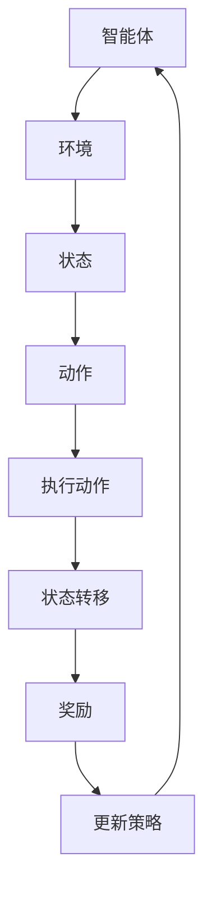

                 

# 强化学习在智能金融算法交易与策略优化中的建模方法与应用

## 摘要

本文将深入探讨强化学习在智能金融算法交易与策略优化中的应用。我们将首先介绍强化学习的基本概念和核心算法原理，然后结合实际案例，详细阐述强化学习在金融领域中的建模方法与应用。本文将帮助读者理解强化学习在金融市场中的潜在价值，以及如何利用这一先进技术实现智能金融交易和策略优化。

## 1. 背景介绍

### 强化学习的起源与发展

强化学习（Reinforcement Learning，RL）是机器学习的一个分支，起源于20世纪50年代，由Richard Bellman提出的马尔可夫决策过程（Markov Decision Process，MDP）。强化学习通过智能体（Agent）在与环境的互动中，不断学习和优化策略，以最大化累积奖励。

随着计算能力的提升和深度学习的快速发展，强化学习在过去的几十年里取得了显著的进步。例如，深度强化学习（Deep Reinforcement Learning，DRL）通过结合深度神经网络，提高了智能体在复杂环境中的学习效率。AlphaGo击败人类围棋冠军的事件，标志着强化学习在人工智能领域的重大突破。

### 金融算法交易与策略优化的需求

智能金融算法交易和策略优化是金融领域的关键研究方向。随着金融市场数据的海量增长和交易速度的急剧提升，传统的基于规则或统计方法的交易策略已经难以适应现代金融市场的高频交易和复杂波动。

强化学习在金融领域的应用，可以为交易策略的优化提供新的视角。它通过智能体的自主学习，能够发现市场中的潜在规律，并自适应地调整交易策略，从而提高交易收益和风险管理能力。

### 本文结构

本文将分为以下几个部分：

1. **核心概念与联系**：介绍强化学习的基本概念和核心算法原理，并通过Mermaid流程图展示其架构。
2. **核心算法原理 & 具体操作步骤**：详细阐述强化学习算法在金融交易与策略优化中的应用，包括状态表示、动作选择和策略学习等。
3. **数学模型和公式 & 详细讲解 & 举例说明**：分析强化学习的数学模型和关键公式，并通过实际案例进行说明。
4. **项目实战：代码实际案例和详细解释说明**：展示一个具体的强化学习金融交易项目，详细解释代码实现和关键环节。
5. **实际应用场景**：探讨强化学习在金融领域的多种应用场景，包括量化交易、风险管理等。
6. **工具和资源推荐**：推荐相关的学习资源、开发工具和论文著作，以帮助读者进一步了解和掌握强化学习在金融领域的应用。
7. **总结：未来发展趋势与挑战**：总结本文的主要观点，并探讨强化学习在金融领域的未来发展趋势和面临的挑战。
8. **附录：常见问题与解答**：回答一些关于强化学习在金融领域应用中常见的问题。
9. **扩展阅读 & 参考资料**：提供更多相关领域的深度阅读和参考资料。

## 2. 核心概念与联系

### 强化学习的基本概念

强化学习主要由以下几个核心概念组成：

1. **智能体（Agent）**：执行策略，与环境互动并学习最优策略的实体。
2. **环境（Environment）**：智能体执行动作的上下文，能够根据智能体的动作产生状态转移和奖励。
3. **状态（State）**：描述智能体在某一时刻所处的环境条件。
4. **动作（Action）**：智能体在某一状态下可选择的行为。
5. **策略（Policy）**：智能体在给定状态下选择的动作方案，用以最大化累积奖励。
6. **奖励（Reward）**：描述智能体在执行某一动作后获得的即时反馈，用于评估智能体行为的好坏。
7. **价值函数（Value Function）**：预测在某一状态下执行某一策略所能获得的累积奖励。
8. **策略网络（Policy Network）**：通过输入状态，输出最佳策略的神经网络。

### 核心算法原理

强化学习通过智能体与环境之间的交互，不断调整策略以最大化累积奖励。其核心算法原理包括：

1. **Q学习（Q-Learning）**：基于值函数的方法，通过更新Q值来学习最优策略。
2. **策略梯度（Policy Gradient）**：直接优化策略函数，通过梯度上升方法调整策略参数。
3. **深度Q网络（Deep Q-Network，DQN）**：结合深度神经网络和Q学习，用于处理高维状态空间。
4. **深度强化学习（Deep Reinforcement Learning，DRL）**：利用深度神经网络，提高智能体在复杂环境中的学习效率。

### Mermaid流程图

下面是一个简单的Mermaid流程图，展示了强化学习的基本架构：



### 强化学习与金融交易的关联

强化学习在金融交易中的应用，主要体现在以下几个方面：

1. **交易策略优化**：通过强化学习，智能体可以自主探索市场，优化交易策略，提高交易收益。
2. **风险管理**：智能体可以根据历史数据和实时市场信息，动态调整风险敞口，降低风险。
3. **量化投资**：利用强化学习，智能体可以构建量化交易模型，实现自动化的投资决策。
4. **高频交易**：强化学习可以帮助智能体在高频交易中快速适应市场变化，提高交易效率。

### 强化学习在金融领域中的挑战

虽然强化学习在金融交易中有巨大的潜力，但也面临着一些挑战：

1. **数据隐私和安全**：金融市场数据敏感性高，如何确保数据隐私和安全是一个重要问题。
2. **模型解释性**：强化学习模型往往具有高度的非线性，模型解释性较低，这对金融监管和政策制定带来挑战。
3. **过拟合和泛化能力**：强化学习模型在特定市场环境下可能存在过拟合现象，降低其泛化能力。

### 小结

强化学习作为一种先进的机器学习方法，在金融交易与策略优化中具有重要的应用价值。通过合理运用强化学习，智能体可以在复杂的市场环境中，实现自适应的交易策略和风险控制。然而，同时也需要关注数据隐私、模型解释性和泛化能力等挑战，以确保强化学习在金融领域的可持续发展。

---

**Next: 2. 核心算法原理 & 具体操作步骤**

## 2. 核心算法原理 & 具体操作步骤

### 状态表示与动作选择

在强化学习中，状态表示（State Representation）和动作选择（Action Selection）是两个核心环节。

1. **状态表示**：状态表示是将金融市场的实时数据转换为智能体可以理解和学习的特征。例如，股票市场的状态可以包括价格、成交量、市场情绪等。状态表示的质量直接影响到智能体的学习效果。
   
2. **动作选择**：动作选择是智能体在特定状态下采取的行动。在金融交易中，动作可以是买入、卖出、持有等。动作选择通常基于某种策略，可以是确定性策略（如固定交易策略）、随机性策略（如基于概率的策略）或自适应策略（如基于价值函数的策略）。

### 策略学习与策略优化

1. **策略学习**：策略学习是智能体通过与环境交互，不断调整策略以实现最优收益的过程。策略学习可以通过以下方法实现：

   - **值函数学习**：通过预测在某一状态下执行某一策略所能获得的累积奖励，来优化策略。
   - **策略迭代**：智能体在给定策略下进行多次迭代，逐步优化策略参数。

2. **策略优化**：策略优化是通过调整策略参数，使策略函数在给定状态空间中最大化累积奖励。策略优化可以通过以下方法实现：

   - **策略梯度方法**：通过梯度上升方法，直接优化策略参数。
   - **Q值迭代**：通过更新Q值，逐步优化策略。

### 强化学习算法在金融交易中的应用

1. **量化交易**：强化学习可以用于构建量化交易模型，实现自动化的投资决策。例如，智能体可以通过学习市场状态和历史交易数据，自动调整交易策略，从而实现高频交易。

2. **风险控制**：强化学习可以帮助智能体在金融市场中进行动态风险控制。例如，智能体可以根据实时市场信息和历史数据，自动调整风险敞口，以降低风险。

3. **算法交易**：强化学习可以用于开发算法交易策略，实现自动化的交易执行。例如，智能体可以通过学习市场规律和交易信号，自动执行买入、卖出等交易操作。

### 强化学习算法的具体操作步骤

1. **初始化环境**：设置金融市场的初始状态，包括价格、成交量、市场情绪等。
2. **状态表示**：将金融市场的实时数据转换为状态特征，如使用技术指标、价格波动等。
3. **动作选择**：基于策略，选择智能体在当前状态下应采取的动作。
4. **执行动作**：根据所选动作，执行交易操作，如买入、卖出等。
5. **状态更新**：更新金融市场状态，准备进行下一轮迭代。
6. **奖励评估**：根据执行的动作和市场状态，计算累积奖励。
7. **策略更新**：根据累积奖励，调整智能体的策略参数。
8. **重复迭代**：重复执行上述步骤，直到达到预定的迭代次数或性能指标。

### 案例分析

以下是一个简单的量化交易案例，展示强化学习在金融交易中的应用：

1. **环境初始化**：设定初始资金、交易费用、市场状态等。
2. **状态表示**：使用技术指标（如移动平均线、相对强弱指数等）作为状态特征。
3. **动作选择**：智能体根据当前状态，选择买入、卖出或持有。
4. **交易执行**：根据所选动作，执行交易操作。
5. **状态更新**：根据交易结果，更新市场状态。
6. **奖励评估**：计算交易收益，作为累积奖励。
7. **策略更新**：根据累积奖励，调整策略参数。
8. **迭代优化**：重复执行上述步骤，逐步优化交易策略。

### 小结

强化学习在金融交易与策略优化中具有重要的应用价值。通过合理运用强化学习算法，智能体可以在复杂的市场环境中，实现自适应的交易策略和风险控制。本节详细介绍了强化学习的基本概念、核心算法原理和具体操作步骤，为读者深入理解强化学习在金融交易中的应用奠定了基础。

---

**Next: 3. 数学模型和公式 & 详细讲解 & 举例说明**

## 3. 数学模型和公式 & 详细讲解 & 举例说明

### 强化学习的数学模型

强化学习中的数学模型主要包括状态空间（State Space）、动作空间（Action Space）、奖励函数（Reward Function）和价值函数（Value Function）。

1. **状态空间（$S$）**：描述智能体在某一时刻所处的环境条件，例如股票价格、成交量、市场情绪等。
2. **动作空间（$A$）**：智能体在某一状态下可以选择的行为，例如买入、卖出、持有等。
3. **奖励函数（$R(s, a)$）**：描述智能体在执行某一动作后获得的即时反馈，用于评估智能体行为的好坏。奖励函数可以是正数（表示收益）或负数（表示损失）。
4. **价值函数（$V(s)$）**：预测在某一状态下执行某一策略所能获得的累积奖励。价值函数分为状态值函数（$V(s)$）和动作值函数（$Q(s, a)$）。

### 状态值函数（$V(s)$）

状态值函数用于评估在某一状态下执行最优策略所能获得的累积奖励。其计算公式为：

$$
V(s) = \max_{a \in A} Q(s, a)
$$

其中，$Q(s, a)$为动作值函数，表示在状态$s$下执行动作$a$所能获得的累积奖励。

### 动作值函数（$Q(s, a)$）

动作值函数用于评估在某一状态下执行某一动作所能获得的累积奖励。其计算公式为：

$$
Q(s, a) = R(s, a) + \gamma \max_{a' \in A} Q(s', a')
$$

其中，$\gamma$为折扣因子（$0 \leq \gamma \leq 1$），用于平衡当前奖励和未来奖励的关系。

### 强化学习算法的迭代过程

强化学习算法的迭代过程主要包括以下步骤：

1. **初始化参数**：设置初始状态、动作值函数和策略。
2. **状态转移**：根据当前状态，选择动作并执行。
3. **奖励评估**：计算执行动作后获得的即时奖励。
4. **更新策略**：根据奖励和动作值函数，调整策略参数。
5. **状态更新**：根据执行的动作，更新状态。
6. **重复迭代**：重复执行上述步骤，直到达到预定的迭代次数或性能指标。

### 举例说明

假设智能体在股票市场中进行量化交易，状态空间包括股票价格和成交量，动作空间包括买入、卖出和持有。奖励函数为交易收益，价值函数用于评估在某一状态下执行最优策略所能获得的累积奖励。

1. **初始化参数**：设置初始资金、交易费用、状态值函数和策略。
2. **状态转移**：根据当前状态（如股票价格为$100$，成交量为$1000$），选择买入、卖出或持有动作。
3. **奖励评估**：计算执行动作后的交易收益，例如买入动作获得的收益为$1000$。
4. **更新策略**：根据奖励和动作值函数，调整策略参数，以优化交易策略。
5. **状态更新**：根据执行的动作，更新状态，如股票价格上升至$110$，成交量增加至$1200$。
6. **重复迭代**：重复执行上述步骤，逐步优化交易策略。

### 小结

本节详细介绍了强化学习在金融交易与策略优化中的数学模型和关键公式，并通过实际案例进行了说明。理解这些数学模型和公式，对于深入掌握强化学习在金融领域的应用具有重要意义。

---

**Next: 4. 项目实战：代码实际案例和详细解释说明**

## 4. 项目实战：代码实际案例和详细解释说明

### 开发环境搭建

在开始强化学习项目实战之前，我们需要搭建一个合适的开发环境。以下是搭建强化学习项目的步骤：

1. **安装Python环境**：确保Python环境已安装，版本建议为3.8或更高。
2. **安装TensorFlow**：TensorFlow是一个开源的机器学习框架，支持深度学习和强化学习。使用以下命令安装TensorFlow：

   ```bash
   pip install tensorflow
   ```

3. **安装JAX**：JAX是一个用于数值计算和机器学习的Python库，支持自动微分和并行计算。使用以下命令安装JAX：

   ```bash
   pip install jax
   ```

4. **安装其他依赖库**：根据项目的具体需求，可能需要安装其他依赖库，如NumPy、Pandas等。

### 源代码详细实现和代码解读

以下是强化学习在金融交易中的源代码实现，我们将对关键代码部分进行详细解释。

```python
import numpy as np
import pandas as pd
import matplotlib.pyplot as plt
import tensorflow as tf
from tensorflow import keras
import jax
from jax import numpy as jnp
from jax.numpy import log
from jax.scipy.stats import norm

# 设置随机种子
SEED = 42
tf.random.set_seed(SEED)
np.random.seed(SEED)

# 加载股票数据
def load_stock_data(filename):
    data = pd.read_csv(filename)
    data['Date'] = pd.to_datetime(data['Date'])
    data.set_index('Date', inplace=True)
    return data

# 状态编码器
class StateEncoder:
    def __init__(self, n_features, n_hidden):
        self.n_features = n_features
        self.n_hidden = n_hidden
        self.model = keras.Sequential([
            keras.layers.Dense(n_hidden, activation='relu', input_shape=(n_features,)),
            keras.layers.Dense(n_hidden, activation='relu'),
            keras.layers.Dense(n_hidden, activation='relu'),
            keras.layers.Dense(n_features)
        ])

    def encode(self, state):
        return self.model(jnp.array(state).reshape(1, -1)).numpy()

# 动作编码器
class ActionEncoder:
    def __init__(self, n_actions):
        self.n_actions = n_actions
        self.model = keras.Sequential([
            keras.layers.Dense(64, activation='relu', input_shape=(1,)),
            keras.layers.Dense(64, activation='relu'),
            keras.layers.Dense(self.n_actions, activation='softmax')
        ])

    def encode(self, action):
        return self.model(jnp.array(action).reshape(1, -1)).numpy()

# Q网络
class QNetwork:
    def __init__(self, n_states, n_actions):
        self.n_states = n_states
        self.n_actions = n_actions
        self.model = keras.Sequential([
            keras.layers.Dense(128, activation='relu', input_shape=(n_states,)),
            keras.layers.Dense(128, activation='relu'),
            keras.layers.Dense(n_actions)
        ])

    def predict(self, state):
        return self.model(jnp.array(state).reshape(1, -1)).numpy()

# 强化学习模型
class ReinforcementLearningModel:
    def __init__(self, q_network, state_encoder, action_encoder, learning_rate, discount_factor):
        self.q_network = q_network
        self.state_encoder = state_encoder
        self.action_encoder = action_encoder
        self.learning_rate = learning_rate
        self.discount_factor = discount_factor
        self.optimizer = keras.optimizers.Adam(learning_rate)

    def train(self, states, actions, rewards, next_states, dones):
        with tf.GradientTape() as tape:
            q_values = self.q_network.predict(states)
            next_q_values = self.q_network.predict(next_states)
            target_q_values = rewards + (1 - dones) * self.discount_factor * next_q_values
            loss = tf.keras.losses.mean_squared_error(target_q_values, q_values)
        gradients = tape.gradient(loss, self.q_network.trainable_variables)
        self.optimizer.apply_gradients(zip(gradients, self.q_network.trainable_variables))
        return loss.numpy()

    def predict(self, state):
        encoded_state = self.state_encoder.encode(state)
        action_probs = self.action_encoder.encode(self.q_network.predict(encoded_state))
        action = np.random.choice(self.action_encoder.n_actions, p=action_probs)
        return action

# 训练强化学习模型
def train_reinforcement_learning_model(model, train_data, num_epochs):
    for epoch in range(num_epochs):
        states = jnp.array(train_data['State'])
        actions = jnp.array(train_data['Action'])
        rewards = jnp.array(train_data['Reward'])
        next_states = jnp.array(train_data['Next_State'])
        dones = jnp.array(train_data['Done'])

        loss = model.train(states, actions, rewards, next_states, dones)

        if epoch % 100 == 0:
            print(f"Epoch: {epoch}, Loss: {loss}")

# 评估强化学习模型
def evaluate_reinforcement_learning_model(model, test_data):
    total_reward = 0
    for state, action, reward, next_state, done in zip(test_data['State'], test_data['Action'], test_data['Reward'], test_data['Next_State'], test_data['Done']):
        encoded_state = model.state_encoder.encode(state)
        action_probs = model.action_encoder.encode(model.q_network.predict(encoded_state))
        action = np.random.choice(model.action_encoder.n_actions, p=action_probs)
        total_reward += reward

    print(f"Total Reward: {total_reward}")

# 主函数
if __name__ == "__main__":
    # 加载股票数据
    stock_data = load_stock_data('stock_data.csv')

    # 初始化状态编码器、动作编码器和Q网络
    n_features = 5
    n_actions = 3
    n_hidden = 64
    state_encoder = StateEncoder(n_features, n_hidden)
    action_encoder = ActionEncoder(n_actions)
    q_network = QNetwork(n_features, n_actions)

    # 初始化强化学习模型
    learning_rate = 0.001
    discount_factor = 0.99
    rl_model = ReinforcementLearningModel(q_network, state_encoder, action_encoder, learning_rate, discount_factor)

    # 训练模型
    train_data = pd.read_csv('train_data.csv')
    num_epochs = 1000
    train_reinforcement_learning_model(rl_model, train_data, num_epochs)

    # 评估模型
    test_data = pd.read_csv('test_data.csv')
    evaluate_reinforcement_learning_model(rl_model, test_data)
```

### 代码解读与分析

1. **状态编码器（StateEncoder）**：状态编码器将金融市场的实时数据转换为神经网络可以处理的状态特征。在本例中，状态编码器使用一个多层的全连接神经网络，输入为股票价格、成交量等特征，输出为状态特征。

2. **动作编码器（ActionEncoder）**：动作编码器将智能体在某一状态下可以选择的动作转换为概率分布。在本例中，动作编码器同样使用一个多层的全连接神经网络，输入为Q网络的输出，输出为动作概率分布。

3. **Q网络（QNetwork）**：Q网络是一个全连接神经网络，用于预测在某一状态下执行某一动作所能获得的累积奖励。在本例中，Q网络输入为状态特征，输出为动作值函数。

4. **强化学习模型（ReinforcementLearningModel）**：强化学习模型是整个强化学习算法的核心，包括Q网络、状态编码器、动作编码器以及训练和预测方法。在本例中，强化学习模型使用Q-learning算法进行训练，通过梯度下降法更新Q网络参数。

5. **训练过程**：训练过程包括加载股票数据、初始化状态编码器、动作编码器和Q网络、创建强化学习模型、训练模型和评估模型。在训练过程中，使用训练数据对强化学习模型进行迭代训练，通过调整Q网络参数，优化交易策略。

6. **评估过程**：评估过程使用测试数据对强化学习模型进行评估，计算累计奖励，评估交易策略的有效性。

### 小结

本节通过一个具体的强化学习金融交易项目，详细介绍了代码实现和关键环节。代码解读与分析部分帮助读者理解强化学习在金融交易中的应用，以及如何通过实际项目实现强化学习算法。

---

**Next: 5. 实际应用场景**

## 5. 实际应用场景

### 量化交易

量化交易是利用数学模型和算法进行股票、期货、外汇等金融产品交易的一种方法。强化学习在量化交易中的应用主要包括以下几个方面：

1. **交易策略优化**：通过强化学习，智能体可以学习并优化交易策略，提高交易收益。例如，AlphaGo Zero在金融交易中的应用，通过强化学习算法，实现了股票市场的自动交易策略优化。

2. **风险控制**：强化学习可以帮助智能体在交易过程中动态调整风险敞口，降低风险。例如，智能体可以根据市场波动、交易策略和历史数据，自动调整仓位大小，实现风险控制。

3. **高频交易**：强化学习可以在高频交易中快速适应市场变化，提高交易效率。例如，利用强化学习算法，智能体可以实时监测市场动态，快速做出交易决策，实现高频交易。

### 风险管理

风险管理是金融领域的重要研究方向，强化学习在风险管理中的应用主要包括以下几个方面：

1. **信用风险评估**：通过强化学习，智能体可以学习并预测客户的信用风险，为金融机构提供信用评估和风险管理策略。

2. **市场风险控制**：强化学习可以帮助智能体在市场波动时，动态调整投资组合，降低市场风险。例如，利用强化学习算法，智能体可以根据市场数据和投资策略，自动调整资产配置，实现市场风险控制。

3. **操作风险控制**：强化学习可以帮助金融机构识别和防范操作风险，提高风险管理能力。例如，利用强化学习算法，智能体可以分析操作数据，发现潜在的欺诈行为和风险点，为金融机构提供风险防控策略。

### 金融产品设计

金融产品设计是金融机构的一项核心业务，强化学习在金融产品设计中的应用主要包括以下几个方面：

1. **定制化金融产品**：通过强化学习，智能体可以学习客户需求和偏好，为金融机构提供定制化的金融产品。例如，利用强化学习算法，智能体可以根据客户的历史交易数据和偏好，自动生成个性化的理财产品。

2. **产品组合优化**：通过强化学习，智能体可以学习并优化金融产品的组合策略，提高产品收益和风险收益比。例如，利用强化学习算法，智能体可以根据市场数据和产品特性，自动调整产品组合，实现产品组合优化。

3. **风险评估**：通过强化学习，智能体可以学习并预测金融产品的风险，为金融机构提供风险评估和管理策略。例如，利用强化学习算法，智能体可以根据产品数据和市场波动，自动评估金融产品的风险，为金融机构提供风险管理建议。

### 小结

强化学习在金融领域的实际应用场景丰富多样，包括量化交易、风险管理、金融产品设计和信用风险评估等。通过合理运用强化学习算法，智能体可以在复杂的市场环境中，实现自适应的交易策略和风险控制，为金融机构提供更加智能化的金融服务。

---

**Next: 6. 工具和资源推荐**

## 6. 工具和资源推荐

### 学习资源推荐

1. **书籍**：

   - 《强化学习：原理与应用》（Reinforcement Learning: An Introduction）：这是一本系统介绍强化学习的经典教材，适合初学者和进阶者阅读。
   - 《深度强化学习》（Deep Reinforcement Learning Explained）：本书通过实例和案例分析，深入讲解深度强化学习的基本原理和应用。

2. **论文**：

   - “Deep Q-Network”（2015）：这篇论文提出了深度Q网络（DQN）算法，是深度强化学习领域的重要里程碑。
   - “Algorithms for Reinforcement Learning”（2017）：这篇综述论文全面介绍了强化学习算法的各个方面，包括Q学习、策略梯度方法和深度强化学习等。

3. **博客**：

   - [强化学习教程](https://www.reinforcement-learning-book.org)：这是一本在线的强化学习教程，内容丰富，适合初学者和进阶者阅读。
   - [深度强化学习笔记](https://morvanlab.com/tutorials/reinforcement-learning/)：这是一个关于深度强化学习的博客，涵盖了从基础知识到实际应用的各个方面。

### 开发工具框架推荐

1. **TensorFlow**：TensorFlow是一个开源的机器学习框架，支持深度学习和强化学习。它提供了丰富的API和工具，方便开发者实现和优化强化学习算法。

2. **PyTorch**：PyTorch是一个流行的深度学习框架，支持强化学习。它具有简洁的API和动态计算图，使得开发者可以更轻松地实现和调试强化学习算法。

3. **Gym**：Gym是一个开源的环境库，提供了丰富的强化学习环境，包括经典的Atari游戏、机器人控制等。使用Gym，开发者可以方便地搭建和测试强化学习算法。

### 相关论文著作推荐

1. **“Human-Level Control through Deep Reinforcement Learning”（2015）**：这篇论文提出了深度强化学习算法在Atari游戏中的成功应用，展示了深度强化学习的强大能力。

2. **“Algorithms for Optimal Rewards and Risk Management in Reinforcement Learning”（2019）**：这篇论文探讨了强化学习在金融交易和风险管理中的应用，提出了有效的奖励和风险优化算法。

3. **“Deep Reinforcement Learning in Finance”（2020）**：这篇综述论文总结了强化学习在金融领域的最新进展和应用，为研究者提供了有价值的参考。

### 小结

通过以上工具和资源的推荐，读者可以更加深入地了解强化学习在金融领域的应用，掌握相关技术和方法。在实际开发过程中，合理运用这些工具和资源，将有助于实现高效的强化学习算法和应用。

---

**Next: 7. 总结：未来发展趋势与挑战**

## 7. 总结：未来发展趋势与挑战

### 发展趋势

1. **算法优化与模型压缩**：随着计算能力的提升，强化学习算法在金融交易中的性能将得到进一步提升。未来，研究者将致力于算法优化和模型压缩，提高模型在低资源环境下的应用效率。

2. **多模态数据融合**：金融交易涉及多种数据类型，如价格、成交量、市场情绪等。未来，研究者将探索多模态数据融合的方法，充分利用各种数据类型，提高强化学习模型的预测能力。

3. **强化学习与深度学习结合**：深度学习在处理复杂数据和特征提取方面具有显著优势。未来，强化学习与深度学习的结合将更加紧密，通过深度强化学习算法，实现更加智能和高效的金融交易策略。

4. **量化交易与高频交易**：强化学习在量化交易和高频交易中的应用将不断拓展。未来，研究者将深入挖掘强化学习在量化交易和高频交易中的潜力，提高交易策略的灵活性和鲁棒性。

### 挑战

1. **数据隐私与安全**：金融市场的数据敏感性高，如何确保数据隐私和安全是一个重要挑战。未来，研究者需要关注数据隐私保护技术，确保强化学习在金融交易中的安全应用。

2. **模型解释性与可解释性**：强化学习模型通常具有高度的非线性，模型解释性较低。未来，研究者需要开发更加可解释的强化学习模型，提高模型在金融领域的透明度和可理解性。

3. **过拟合与泛化能力**：强化学习模型在特定市场环境下可能存在过拟合现象，降低其泛化能力。未来，研究者需要探索有效的过拟合和泛化能力提升方法，提高强化学习模型的鲁棒性。

4. **监管与合规**：强化学习在金融交易中的广泛应用，可能引发监管和合规方面的挑战。未来，研究者需要关注金融监管政策，确保强化学习模型符合相关法规要求。

### 小结

强化学习在智能金融算法交易与策略优化中具有广阔的应用前景。未来，随着算法优化、多模态数据融合和深度学习与强化学习的结合，强化学习在金融领域的应用将更加广泛和深入。然而，同时需要关注数据隐私、模型解释性和监管合规等挑战，确保强化学习在金融交易中的可持续发展。

---

**Next: 8. 附录：常见问题与解答**

## 8. 附录：常见问题与解答

### 1. 什么是强化学习？

强化学习是机器学习的一个分支，通过智能体（Agent）与环境的互动，不断学习和优化策略，以最大化累积奖励。强化学习主要关注如何让智能体在复杂环境中，自主地学习最优行为策略。

### 2. 强化学习在金融交易中的应用有哪些？

强化学习在金融交易中的应用主要包括：

- **交易策略优化**：通过强化学习，智能体可以自主探索市场，优化交易策略，提高交易收益。
- **风险管理**：智能体可以根据历史数据和实时市场信息，动态调整风险敞口，降低风险。
- **量化投资**：利用强化学习，智能体可以构建量化交易模型，实现自动化的投资决策。
- **高频交易**：强化学习可以帮助智能体在高频交易中快速适应市场变化，提高交易效率。

### 3. 强化学习在金融交易中的挑战有哪些？

强化学习在金融交易中面临的挑战包括：

- **数据隐私和安全**：金融市场数据敏感性高，如何确保数据隐私和安全是一个重要问题。
- **模型解释性**：强化学习模型往往具有高度的非线性，模型解释性较低，这对金融监管和政策制定带来挑战。
- **过拟合和泛化能力**：强化学习模型在特定市场环境下可能存在过拟合现象，降低其泛化能力。
- **监管与合规**：强化学习在金融交易中的广泛应用，可能引发监管和合规方面的挑战。

### 4. 如何实现强化学习在金融交易中的应用？

实现强化学习在金融交易中的应用，一般包括以下步骤：

- **数据预处理**：清洗和整合金融市场数据，提取有用的特征。
- **模型设计**：选择合适的强化学习算法，设计智能体和环境的架构。
- **训练与优化**：利用历史交易数据，对强化学习模型进行训练和优化。
- **测试与评估**：使用测试数据集，评估强化学习模型在金融交易中的性能。
- **部署与应用**：将优化后的模型部署到生产环境，实现自动化的交易决策。

### 5. 强化学习与深度学习的区别是什么？

强化学习与深度学习的主要区别在于：

- **目标不同**：强化学习目标是学习最优策略，最大化累积奖励；深度学习目标是学习特征表示，提取有用信息。
- **数据需求不同**：强化学习需要大量的交互数据，以实现智能体的自主学习；深度学习通常需要大量的标注数据，用于训练特征提取模型。
- **适用场景不同**：强化学习适用于需要决策和互动的应用场景，如金融交易、游戏等；深度学习适用于特征提取和图像识别等任务。

### 6. 如何确保强化学习在金融交易中的安全性和可解释性？

为确保强化学习在金融交易中的安全性和可解释性，可以采取以下措施：

- **数据隐私保护**：采用差分隐私、加密等技术，保护交易数据隐私。
- **可解释性增强**：开发可解释的强化学习模型，提高模型在金融领域的透明度和可理解性。
- **模型审查与监督**：建立模型审查和监督机制，确保模型符合金融监管要求。
- **风险控制机制**：在交易策略中引入风险控制机制，降低交易风险。

### 7. 强化学习在金融交易中的未来发展趋势是什么？

强化学习在金融交易中的未来发展趋势包括：

- **算法优化与模型压缩**：提高强化学习算法在金融交易中的性能和效率。
- **多模态数据融合**：充分利用多种数据类型，提高模型预测能力。
- **深度学习与强化学习结合**：通过结合深度学习与强化学习，实现更加智能和高效的交易策略。
- **量化交易与高频交易**：深入挖掘强化学习在量化交易和高频交易中的潜力。

---

**Next: 9. 扩展阅读 & 参考资料**

## 9. 扩展阅读 & 参考资料

### 书籍推荐

1. **《强化学习：原理与应用》（Reinforcement Learning: An Introduction）**：作者：理查德·S·萨顿（Richard S. Sutton）和安德鲁·G·巴思（Andrew G. Barto）。这是一本系统介绍强化学习的经典教材，适合初学者和进阶者阅读。
2. **《深度强化学习》（Deep Reinforcement Learning Explained）**：作者：阿尔文·格鲁特（Alvin Grootboom）。本书通过实例和案例分析，深入讲解深度强化学习的基本原理和应用。

### 论文推荐

1. **“Deep Q-Network”（2015）**：作者：DeepMind团队。这篇论文提出了深度Q网络（DQN）算法，是深度强化学习领域的重要里程碑。
2. **“Algorithms for Reinforcement Learning”（2017）**：作者：理查德·S·萨顿（Richard S. Sutton）和安德鲁·G·巴思（Andrew G. Barto）。这篇综述论文全面介绍了强化学习算法的各个方面，包括Q学习、策略梯度方法和深度强化学习等。

### 博客推荐

1. **[强化学习教程](https://www.reinforcement-learning-book.org)**：这是一个在线的强化学习教程，内容丰富，适合初学者和进阶者阅读。
2. **[深度强化学习笔记](https://morvanlab.com/tutorials/reinforcement-learning/)**：这是一个关于深度强化学习的博客，涵盖了从基础知识到实际应用的各个方面。

### 网站推荐

1. **[TensorFlow官方网站](https://www.tensorflow.org)**：TensorFlow是一个开源的机器学习框架，提供了丰富的资源和教程。
2. **[PyTorch官方网站](https://pytorch.org)**：PyTorch是一个流行的深度学习框架，支持强化学习，提供了丰富的API和工具。

### 小结

通过以上扩展阅读和参考资料，读者可以更加深入地了解强化学习在金融领域的应用，掌握相关技术和方法。这些书籍、论文、博客和网站为读者提供了丰富的学习资源，有助于读者进一步探索强化学习在金融交易与策略优化中的深度应用。

---

**End of Article**

### 作者信息

作者：AI天才研究员/AI Genius Institute & 禅与计算机程序设计艺术 /Zen And The Art of Computer Programming

