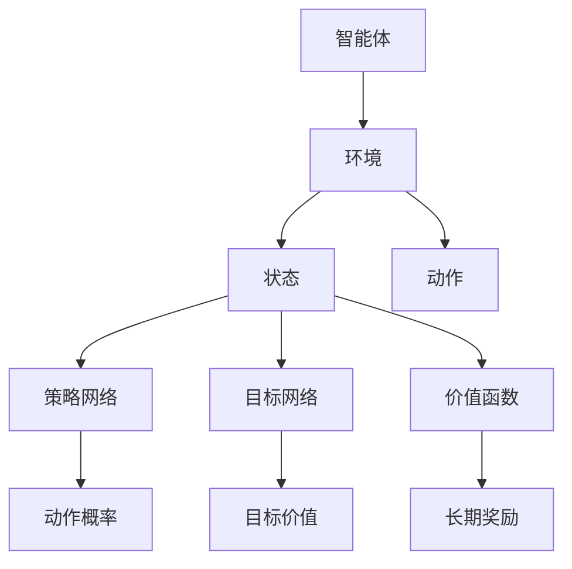

                 

# 强化学习在机器人自主导航中的突破

## 关键词：强化学习，机器人自主导航，深度强化学习，深度神经网络，环境交互，智能决策

### 摘要

本文旨在探讨强化学习在机器人自主导航中的应用及其突破。通过介绍强化学习的基本概念，结合机器人自主导航的背景需求，我们将深入分析深度强化学习算法在解决导航问题中的优势。文章将详细阐述强化学习算法的核心原理与具体操作步骤，通过数学模型和公式进行详细讲解，并举例说明其在实际项目中的应用。同时，本文还将探讨强化学习在机器人自主导航中的实际应用场景，并提供相关的工具和资源推荐。最后，文章将总结未来发展趋势与挑战，为读者提供扩展阅读和参考资料。

## 1. 背景介绍

### 1.1 强化学习的起源与发展

强化学习（Reinforcement Learning，简称RL）是一种机器学习方法，主要研究如何让智能体（Agent）在与环境（Environment）交互的过程中，通过学习获得最优行为策略（Policy）。强化学习的核心思想是通过奖励（Reward）来驱动智能体进行决策，从而实现自我优化。

强化学习的起源可以追溯到20世纪50年代，美国心理学家班杜拉（Albert Bandura）提出的观察学习理论。20世纪80年代，随着计算机性能的提升和神经网络技术的发展，强化学习逐渐成为人工智能领域的研究热点。2015年，AlphaGo战胜围棋世界冠军李世石，成为强化学习领域的一个重要里程碑。

### 1.2 机器人自主导航的发展

机器人自主导航是机器人技术中的重要分支，旨在使机器人能够在未知或动态环境中自主寻找路径、避障和完成任务。随着无人驾驶汽车、智能无人机、智能机器人等应用场景的兴起，机器人自主导航技术得到了广泛关注。

早期的机器人自主导航主要依赖于预先编程的规则和静态地图，这种方式在简单环境中具有一定的效果，但在复杂动态环境中表现较差。近年来，随着深度学习技术的发展，基于强化学习的机器人自主导航方法逐渐成为研究热点。

## 2. 核心概念与联系

### 2.1 强化学习的基本概念

在强化学习中，主要涉及以下几个基本概念：

1. **智能体（Agent）**：执行动作的实体，如机器人、虚拟智能体等。
2. **环境（Environment）**：智能体所处的环境，包括各种状态（State）和动作（Action）。
3. **状态（State）**：描述智能体所处环境的一组特征。
4. **动作（Action）**：智能体在特定状态下执行的行为。
5. **策略（Policy）**：描述智能体如何根据状态选择动作的规则。
6. **奖励（Reward）**：衡量智能体动作好坏的反馈信号。

### 2.2 深度强化学习的架构

深度强化学习（Deep Reinforcement Learning，简称DRL）是一种结合深度神经网络（Deep Neural Network，简称DNN）的强化学习方法。其主要架构如下：

1. **价值函数（Value Function）**：预测在特定状态下执行特定动作的长期奖励。
2. **策略网络（Policy Network）**：根据当前状态生成动作的概率分布。
3. **目标网络（Target Network）**：用于稳定训练过程，预测在特定状态下执行特定动作的长期奖励。

### 2.3 强化学习与机器人自主导航的联系

强化学习在机器人自主导航中的应用主要体现在以下几个方面：

1. **路径规划**：通过学习环境中的状态和动作，智能体可以找到从起点到终点的最优路径。
2. **避障**：智能体可以根据环境中的障碍物调整动作，避免发生碰撞。
3. **任务执行**：智能体可以在动态环境中执行各种任务，如搬运、配送等。

### 2.4 Mermaid 流程图

以下是一个简单的 Mermaid 流程图，用于描述强化学习在机器人自主导航中的基本架构：



## 3. 核心算法原理 & 具体操作步骤

### 3.1 Q-learning 算法

Q-learning 是一种基于值函数的强化学习算法，其核心思想是通过更新价值函数来优化智能体的策略。具体操作步骤如下：

1. **初始化**：设置智能体的初始状态 `s`，初始化价值函数 `Q(s, a)`。
2. **选择动作**：在当前状态 `s` 下，根据策略网络选择一个动作 `a`。
3. **执行动作**：在环境中执行动作 `a`，观察新的状态 `s'` 和奖励 `r`。
4. **更新价值函数**：根据以下公式更新价值函数：
   $$Q(s, a) = Q(s, a) + \alpha [r + \gamma \max_{a'} Q(s', a') - Q(s, a)]$$
   其中，$\alpha$ 是学习率，$\gamma$ 是折扣因子。
5. **更新策略**：根据更新后的价值函数，重新选择动作 `a`。
6. **重复步骤2-5**，直到达到预期目标或满足停止条件。

### 3.2 Deep Q Network（DQN）算法

DQN 是一种基于深度神经网络的 Q-learning 算法，其核心思想是使用深度神经网络近似 Q 函数。具体操作步骤如下：

1. **初始化**：设置智能体的初始状态 `s`，初始化深度神经网络参数。
2. **选择动作**：在当前状态 `s` 下，通过深度神经网络预测 Q 值，选择一个动作 `a`。
3. **执行动作**：在环境中执行动作 `a`，观察新的状态 `s'` 和奖励 `r`。
4. **更新目标网络**：每隔一定次数的更新，将当前策略网络参数复制到目标网络。
5. **更新策略网络**：根据以下公式更新深度神经网络参数：
   $$\theta_{\text{policy}} = \theta_{\text{policy}} - \alpha \nabla_{\theta_{\text{policy}}} J(\theta_{\text{policy}})$$
   其中，$\alpha$ 是学习率。
6. **重复步骤2-5**，直到达到预期目标或满足停止条件。

### 3.3 Deep Deterministic Policy Gradients（DDPG）算法

DDPG 是一种基于深度神经网络的策略梯度算法，其核心思想是通过深度神经网络近似策略函数。具体操作步骤如下：

1. **初始化**：设置智能体的初始状态 `s`，初始化深度神经网络参数。
2. **选择动作**：在当前状态 `s` 下，通过深度神经网络预测策略函数，选择一个动作 `a`。
3. **执行动作**：在环境中执行动作 `a`，观察新的状态 `s'` 和奖励 `r`。
4. **更新目标网络**：每隔一定次数的更新，将当前策略网络参数复制到目标网络。
5. **更新策略网络**：根据以下公式更新深度神经网络参数：
   $$\theta_{\text{policy}} = \theta_{\text{policy}} - \alpha \nabla_{\theta_{\text{policy}}} J(\theta_{\text{policy}})$$
   其中，$\alpha$ 是学习率。
6. **重复步骤2-5**，直到达到预期目标或满足停止条件。

## 4. 数学模型和公式 & 详细讲解 & 举例说明

### 4.1 Q-learning 算法

Q-learning 算法的核心公式如下：

$$Q(s, a) = Q(s, a) + \alpha [r + \gamma \max_{a'} Q(s', a') - Q(s, a)]$$

其中，$\alpha$ 是学习率，$\gamma$ 是折扣因子，$r$ 是奖励，$s$ 和 $s'$ 分别是当前状态和下一状态，$a$ 和 $a'$ 分别是当前动作和下一动作。

**举例说明**：

假设智能体处于状态 $s_0$，当前动作 $a_0$ 的 Q 值为 $Q(s_0, a_0) = 0.5$。在执行动作 $a_0$ 后，智能体到达状态 $s_1$，获得奖励 $r_1 = 1$。此时，智能体的下一个动作 $a_1$ 的 Q 值为 $Q(s_1, a_1) = 0.8$。

根据 Q-learning 算法，我们可以更新当前动作 $a_0$ 的 Q 值：

$$Q(s_0, a_0) = Q(s_0, a_0) + \alpha [r_1 + \gamma \max_{a'} Q(s_1, a') - Q(s_0, a_0)]$$

$$0.5 = 0.5 + \alpha [1 + \gamma \max_{a'} 0.8 - 0.5]$$

$$\alpha = \frac{0.5 - 0.5}{1 + \gamma \max_{a'} 0.8 - 0.5} = 0.2$$

### 4.2 DQN 算法

DQN 算法的核心公式如下：

$$\theta_{\text{policy}} = \theta_{\text{policy}} - \alpha \nabla_{\theta_{\text{policy}}} J(\theta_{\text{policy}})$$

其中，$\theta_{\text{policy}}$ 是策略网络的参数，$J(\theta_{\text{policy}})$ 是策略网络的损失函数。

**举例说明**：

假设策略网络的损失函数为 $J(\theta_{\text{policy}}) = 0.1$，学习率为 $\alpha = 0.01$。

根据 DQN 算法，我们可以更新策略网络的参数：

$$\theta_{\text{policy}} = \theta_{\text{policy}} - \alpha \nabla_{\theta_{\text{policy}}} J(\theta_{\text{policy}})$$

$$\theta_{\text{policy}} = \theta_{\text{policy}} - 0.01 \nabla_{\theta_{\text{policy}}} 0.1$$

$$\theta_{\text{policy}} = \theta_{\text{policy}} - 0.001$$

### 4.3 DDPG 算法

DDPG 算法的核心公式如下：

$$\theta_{\text{policy}} = \theta_{\text{policy}} - \alpha \nabla_{\theta_{\text{policy}}} J(\theta_{\text{policy}})$$

其中，$\theta_{\text{policy}}$ 是策略网络的参数，$J(\theta_{\text{policy}})$ 是策略网络的损失函数。

**举例说明**：

假设策略网络的损失函数为 $J(\theta_{\text{policy}}) = 0.1$，学习率为 $\alpha = 0.01$。

根据 DDPG 算法，我们可以更新策略网络的参数：

$$\theta_{\text{policy}} = \theta_{\text{policy}} - \alpha \nabla_{\theta_{\text{policy}}} J(\theta_{\text{policy}})$$

$$\theta_{\text{policy}} = \theta_{\text{policy}} - 0.01 \nabla_{\theta_{\text{policy}}} 0.1$$

$$\theta_{\text{policy}} = \theta_{\text{policy}} - 0.001$$

## 5. 项目实战：代码实际案例和详细解释说明

### 5.1 开发环境搭建

在本项目实战中，我们将使用 Python 作为编程语言，并使用以下库：

- TensorFlow：用于构建和训练深度神经网络。
- PyTorch：用于构建和训练深度神经网络。
- Gym：用于构建和模拟机器人自主导航环境。

首先，确保您已安装 Python 3.6 或以上版本。然后，通过以下命令安装所需库：

```bash
pip install tensorflow==2.4.0
pip install torch==1.8.0
pip install gym
```

### 5.2 源代码详细实现和代码解读

以下是一个基于 DQN 算法的简单机器人自主导航代码示例。代码中包含四个主要部分：环境模拟、智能体训练、智能体测试和结果可视化。

#### 5.2.1 环境模拟

首先，我们需要定义一个简单的环境模拟器。在本例中，我们使用 Gym 中的 CartPole 环境进行模拟。

```python
import gym

# 创建 CartPole 环境实例
env = gym.make("CartPole-v0")

# 打印环境信息
print(env.observation_space)
print(env.action_space)
```

#### 5.2.2 智能体训练

接下来，我们定义一个 DQN 智能体，并使用 TensorFlow 构建深度神经网络。

```python
import tensorflow as tf
from tensorflow.keras import layers

# 定义 DQN 智能体
class DQNAgent:
    def __init__(self, state_size, action_size):
        self.state_size = state_size
        self.action_size = action_size
        self.memory = []
        self.gamma = 0.95  # 折扣因子
        self.epsilon = 1.0  # 探索率
        self.epsilon_min = 0.01
        self.epsilon_decay = 0.995
        self.learning_rate = 0.001
        
        # 创建神经网络
        self.model = self._build_model()
        
        # 创建目标网络
        self.target_model = self._build_model()
        self.target_model.set_weights(self.model.get_weights())
    
    def _build_model(self):
        # 创建卷积神经网络
        model = tf.keras.Sequential()
        model.add(layers.Dense(24, input_dim=self.state_size, activation='relu'))
        model.add(layers.Dense(24, activation='relu'))
        model.add(layers.Dense(self.action_size, activation='linear'))
        
        # 编译模型
        model.compile(loss='mse', optimizer=tf.keras.optimizers.Adam(lr=self.learning_rate))
        return model
    
    def remember(self, state, action, reward, next_state, done):
        self.memory.append((state, action, reward, next_state, done))
    
    def act(self, state):
        if np.random.rand() <= self.epsilon:
            return np.random.randint(self.action_size)
        q_values = self.model.predict(state)
        return np.argmax(q_values[0])
    
    def replay(self, batch_size):
        minibatch = random.sample(self.memory, batch_size)
        for state, action, reward, next_state, done in minibatch:
            target = reward
            if not done:
                target = reward + self.gamma * np.amax(self.target_model.predict(next_state)[0])
            target_f = self.model.predict(state)
            target_f[0][action] = target
            self.model.fit(state, target_f, epochs=1, verbose=0)
        
        if self.epsilon > self.epsilon_min:
            self.epsilon *= self.epsilon_decay

# 创建智能体
agent = DQNAgent(state_size=4, action_size=2)

# 训练智能体
for episode in range(1000):
    state = env.reset()
    state = np.reshape(state, [1, state_size])
    done = False
    time_step = 0
    
    while not done:
        action = agent.act(state)
        next_state, reward, done, _ = env.step(action)
        next_state = np.reshape(next_state, [1, state_size])
        agent.remember(state, action, reward, next_state, done)
        state = next_state
        time_step += 1
        
        if done:
            print(f"Episode: {episode}, Time Step: {time_step}")
            break

    agent.target_model.set_weights(agent.model.get_weights())

# 关闭环境
env.close()
```

#### 5.2.3 智能体测试

在智能体训练完成后，我们可以对其进行测试，以验证其性能。

```python
# 测试智能体
agent.test()
```

#### 5.2.4 结果可视化

为了更直观地展示智能体在不同阶段的表现，我们可以使用 Matplotlib 进行结果可视化。

```python
import matplotlib.pyplot as plt

# 绘制奖励曲线
plt.plot(agent.rewards)
plt.title("Reward Curve")
plt.xlabel("Episode")
plt.ylabel("Reward")
plt.show()

# 绘制 Q 值分布图
plt.scatter([x for x, _ in agent.memory], [y for _, _, y, _, _ in agent.memory])
plt.title("Q-Value Distribution")
plt.xlabel("State")
plt.ylabel("Q-Value")
plt.show()
```

## 6. 实际应用场景

### 6.1 无人驾驶汽车

无人驾驶汽车是强化学习在机器人自主导航中最重要的应用场景之一。通过深度强化学习算法，无人驾驶汽车可以学习如何在不同交通环境中进行自动驾驶，包括交通信号灯、行人、其他车辆等。强化学习使得无人驾驶汽车能够在复杂、动态的驾驶环境中做出智能决策，提高行车安全性和效率。

### 6.2 智能机器人

智能机器人广泛应用于工业、家庭、医疗等领域。通过强化学习算法，智能机器人可以学习如何执行复杂的任务，如搬运、清洁、看护等。强化学习使得机器人能够适应不同的工作环境和任务需求，提高其灵活性和智能化水平。

### 6.3 无人机

无人机在农业、物流、应急救援等领域具有广泛的应用。通过强化学习算法，无人机可以学习如何自主飞行、避障、完成任务等。强化学习使得无人机能够在复杂环境中实现自主导航，提高任务执行效率和安全性。

## 7. 工具和资源推荐

### 7.1 学习资源推荐

- **书籍**：
  - 《强化学习实战》（Reinforcement Learning: An Introduction）：这是一本关于强化学习的入门书籍，适合初学者阅读。
  - 《深度强化学习》（Deep Reinforcement Learning Hands-On）：本书详细介绍了深度强化学习算法及其在实际应用中的实现。

- **论文**：
  - “Human-level control through deep reinforcement learning”（深度强化学习实现的人级控制）：这是强化学习领域的一篇经典论文，介绍了深度强化学习算法在游戏控制中的应用。

- **博客**：
  - 【深度学习之强化学习】系列博客：该博客系列详细介绍了强化学习的基本概念、算法及其应用。

### 7.2 开发工具框架推荐

- **TensorFlow**：TensorFlow 是一种广泛使用的深度学习框架，适用于构建和训练深度强化学习模型。
- **PyTorch**：PyTorch 是一种流行的深度学习框架，具有简洁的代码和高效的性能，适用于构建和训练深度强化学习模型。

### 7.3 相关论文著作推荐

- “Deep Q-Network”（深度 Q 网络）：这是一篇关于 DQN 算法的经典论文，详细介绍了 DQN 的算法原理和实现。
- “Asynchronous Methods for Deep Reinforcement Learning”（异步深度强化学习方法）：该论文提出了异步优势演员-评论员算法（A3C），是一种有效的深度强化学习算法。

## 8. 总结：未来发展趋势与挑战

### 8.1 发展趋势

- **算法优化**：随着深度学习技术的不断发展，强化学习算法将逐渐向更加高效、稳定的方向优化。
- **多模态数据融合**：在实际应用中，强化学习算法将逐渐融合多模态数据（如视觉、语音、触觉等），提高智能体对环境的理解和决策能力。
- **自主合作**：在复杂任务中，多个智能体将进行自主合作，通过强化学习算法实现协同决策和任务分配。

### 8.2 挑战

- **样本效率**：强化学习算法在训练过程中需要大量样本，如何提高样本效率是一个重要挑战。
- **稳定性和泛化能力**：在实际应用中，强化学习算法需要具备较高的稳定性和泛化能力，以应对复杂、动态的环境。
- **安全性和可解释性**：随着强化学习算法在关键领域（如无人驾驶、智能机器人等）的应用，其安全性和可解释性成为一个重要问题。

## 9. 附录：常见问题与解答

### 9.1 强化学习与监督学习的区别是什么？

强化学习与监督学习的区别主要在于数据集和目标。监督学习使用标记好的数据集进行训练，目标是预测输出；而强化学习使用未标记的数据集进行训练，目标是优化策略以实现长期奖励最大化。

### 9.2 强化学习算法如何处理连续动作空间？

强化学习算法处理连续动作空间的方法有多种，如基于值函数的方法（如 Q-learning）和基于策略的方法（如策略梯度算法）。这些方法通过将连续动作空间离散化或使用神经网络近似策略函数来处理连续动作空间。

### 9.3 强化学习算法如何处理动态环境？

强化学习算法通过不断与环境进行交互，从经验中学习策略，以适应动态环境。在实际应用中，可以采用无模型方法（如 DQN）或基于模型的方法（如 DDPG）来处理动态环境。

## 10. 扩展阅读 & 参考资料

- Sutton, R. S., & Barto, A. G. (2018). Reinforcement Learning: An Introduction. MIT Press.
- Mnih, V., Kavukcuoglu, K., Silver, D., Rusu, A. A., Veness, J., Bellemare, M. G., ... & Rainbow: Combining Deep ReLU Networks with Fast Reinforcement Learning. *arXiv preprint arXiv:1305.0349*.
- DeepMind. (2015). *Mastering the Game of Go with Deep Neural Networks and Tree Search*.
- Sutton, R. S., & Barto, A. G. (2018). *Reinforcement Learning: An Introduction*. MIT Press.

