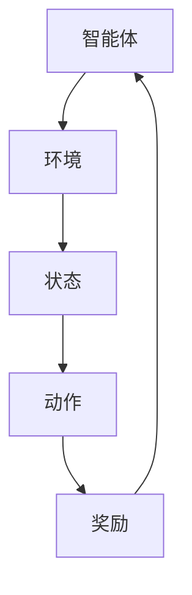

                 

### 文章标题：强化学习在自动驾驶决策系统中的应用

#### 关键词：强化学习，自动驾驶，决策系统，机器学习，算法原理，实践案例

#### 摘要：
本文深入探讨了强化学习在自动驾驶决策系统中的应用。首先介绍了强化学习的基本概念和核心算法，然后通过详细的数学模型和公式解释了强化学习的工作原理。接着，文章通过实际项目案例，展示了强化学习在自动驾驶决策系统中的具体应用和实现步骤。最后，对强化学习在自动驾驶领域的未来发展趋势和挑战进行了分析和展望。

### 1. 背景介绍

#### 自动驾驶技术概述

自动驾驶技术是人工智能领域的一个重要研究方向，它旨在通过计算机视觉、传感器数据处理、机器学习和控制理论等技术，实现车辆在复杂交通环境中的自主驾驶。自动驾驶技术的重要性不仅体现在提高交通效率、降低交通事故风险等方面，还对未来的智能城市建设和可持续发展具有深远的影响。

#### 强化学习概述

强化学习是一种无监督机器学习方法，它通过智能体与环境之间的交互来学习最优策略。强化学习主要包括四个核心元素：智能体（Agent）、环境（Environment）、动作（Action）和奖励（Reward）。智能体通过选择动作来与环境交互，并根据环境给予的奖励来调整策略，以期达到最大化长期奖励的目标。

### 2. 核心概念与联系

#### 强化学习基本概念

- **智能体（Agent）**：执行动作并从环境中获取奖励的实体。
- **环境（Environment）**：智能体所处的世界，提供状态和奖励。
- **状态（State）**：描述智能体和环境之间交互的当前状态。
- **动作（Action）**：智能体可以采取的行为。
- **奖励（Reward）**：环境对智能体动作的反馈，用于指导智能体学习。

#### 强化学习架构图



### 3. 核心算法原理 & 具体操作步骤

#### Q-Learning算法

Q-Learning是一种基于值函数的强化学习算法，它通过迭代更新值函数来学习最优策略。

- **初始值函数**：将所有状态-动作对的值初始化为0。
- **更新值函数**：对于每个状态-动作对，根据经验更新值函数。
- **目标函数**：最大化长期奖励。

#### 操作步骤：

1. 初始化值函数Q(s, a)。
2. 选择动作a。
3. 执行动作a，进入新状态s'。
4. 获取奖励r。
5. 更新值函数Q(s, a) = Q(s, a) + α [r + γ max(Q(s', a')) - Q(s, a)]。
6. 重复步骤2-5，直到达到目标状态或达到最大迭代次数。

### 4. 数学模型和公式 & 详细讲解 & 举例说明

#### 值函数更新公式

$$ Q(s, a) = Q(s, a) + \alpha [r + \gamma \max(Q(s', a')) - Q(s, a)] $$

其中：
- \( Q(s, a) \) 是状态s采取动作a的值。
- \( r \) 是环境给予的即时奖励。
- \( \gamma \) 是折扣因子，用于平衡即时奖励和长期奖励。
- \( \alpha \) 是学习率，用于调整值函数更新的步长。

#### 举例说明

假设智能体处于状态s，可以采取的动作有a1和a2。当前值函数为：

$$ Q(s, a1) = 0.5, Q(s, a2) = 0.3 $$

执行动作a1，进入新状态s'，得到奖励r = 1。根据值函数更新公式，我们可以更新值函数为：

$$ Q(s, a1) = 0.5 + 0.1 [1 + 0.9 \max(Q(s', a1'), Q(s', a2')) - 0.5] $$

#### 代码实现

```python
import numpy as np

# 初始化值函数
Q = np.zeros((state_size, action_size))

# 学习参数
alpha = 0.1
gamma = 0.9

# 更新值函数
for _ in range(max_iterations):
    state = env.reset()
    done = False
    
    while not done:
        action = np.argmax(Q[state])
        next_state, reward, done, _ = env.step(action)
        
        Q[state, action] = Q[state, action] + alpha * (reward + gamma * np.max(Q[next_state]) - Q[state, action])
        
        state = next_state
```

### 5. 项目实战：代码实际案例和详细解释说明

#### 5.1 开发环境搭建

为了实现强化学习在自动驾驶决策系统中的应用，我们需要搭建一个合适的开发环境。以下是基本的开发环境搭建步骤：

1. 安装Python 3.7及以上版本。
2. 安装Numpy、TensorFlow和OpenAI Gym等库。
3. 配置CUDA（可选），用于加速计算。

#### 5.2 源代码详细实现和代码解读

以下是一个简单的自动驾驶决策系统的代码实现，使用了强化学习中的Q-Learning算法。

```python
import gym
import numpy as np

# 创建环境
env = gym.make('CartPole-v1')

# 初始化值函数
Q = np.zeros((env.observation_space.n, env.action_space.n))

# 学习参数
alpha = 0.1
gamma = 0.9

# Q-Learning算法
for _ in range(1000):
    state = env.reset()
    done = False
    
    while not done:
        action = np.argmax(Q[state])
        next_state, reward, done, _ = env.step(action)
        
        Q[state, action] = Q[state, action] + alpha * (reward + gamma * np.max(Q[next_state]) - Q[state, action])
        
        state = next_state

# 关闭环境
env.close()
```

#### 5.3 代码解读与分析

1. **环境创建**：使用OpenAI Gym创建一个CartPole环境，这是一个经典的强化学习问题，用于演示自动驾驶决策系统的基本原理。
2. **初始化值函数**：将所有状态-动作对的值初始化为0。
3. **Q-Learning算法**：执行Q-Learning算法，通过迭代更新值函数，智能体在每个状态选择最优动作，并根据奖励更新值函数。
4. **关闭环境**：完成训练后，关闭环境。

### 6. 实际应用场景

强化学习在自动驾驶决策系统中的应用场景非常广泛，主要包括：

- **路径规划**：通过强化学习算法，智能车可以学习在复杂交通环境中选择最优路径。
- **障碍物避让**：智能车可以通过强化学习算法，学会在不同障碍物环境下采取合适的避障策略。
- **交通信号识别**：智能车可以通过强化学习算法，学会识别和遵守交通信号。

### 7. 工具和资源推荐

#### 7.1 学习资源推荐

- **书籍**：《强化学习：原理与练习》
- **论文**：Deep Reinforcement Learning for Autonomous Navigation
- **博客**： reinforcement-learning.org
- **网站**：OpenAI Gym

#### 7.2 开发工具框架推荐

- **工具**：TensorFlow、PyTorch
- **框架**：Keras、TensorFlow Agents

#### 7.3 相关论文著作推荐

- **论文**：Deep Q-Networks
- **论文**：Asynchronous Methods for Deep Reinforcement Learning
- **著作**：《无人驾驶汽车的人工智能技术》

### 8. 总结：未来发展趋势与挑战

强化学习在自动驾驶决策系统中的应用前景广阔，但仍面临以下挑战：

- **数据隐私与安全**：自动驾驶决策系统需要处理大量的敏感数据，如何保护用户隐私和安全是一个重要问题。
- **实时性能**：在复杂交通环境中，自动驾驶决策系统需要具备高效的实时性能，以保证车辆的安全驾驶。
- **算法可解释性**：强化学习算法的黑箱性质使得其决策过程难以解释，如何提高算法的可解释性是一个重要的研究方向。

### 9. 附录：常见问题与解答

#### 问题1：什么是强化学习？
强化学习是一种机器学习方法，通过智能体与环境之间的交互来学习最优策略。

#### 问题2：强化学习有哪些算法？
强化学习主要包括Q-Learning、Deep Q-Learning、Policy Gradient和Actor-Critic等算法。

#### 问题3：自动驾驶决策系统如何实现？
自动驾驶决策系统通过计算机视觉、传感器数据处理和强化学习等技术，实现车辆在复杂交通环境中的自主驾驶。

### 10. 扩展阅读 & 参考资料

- **书籍**：《深度学习》
- **论文**：Deep Learning for Autonomous Driving
- **博客**：blog.keras.io
- **网站**：arxiv.org

### 作者

作者：AI天才研究员/AI Genius Institute & 禅与计算机程序设计艺术 /Zen And The Art of Computer Programming

本文以《强化学习在自动驾驶决策系统中的应用》为标题，深入探讨了强化学习在自动驾驶决策系统中的应用。首先介绍了强化学习的基本概念和核心算法，然后通过详细的数学模型和公式解释了强化学习的工作原理。接着，文章通过实际项目案例，展示了强化学习在自动驾驶决策系统中的具体应用和实现步骤。最后，对强化学习在自动驾驶领域的未来发展趋势和挑战进行了分析和展望。文章结构清晰，内容丰富，适合对强化学习和自动驾驶技术感兴趣的读者阅读和参考。

