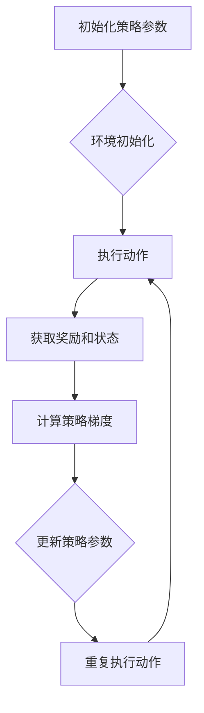

                 

# 强化学习算法：策略梯度 (Policy Gradient) 原理与代码实例讲解

## 摘要

本文将深入探讨强化学习算法中的策略梯度（Policy Gradient）原理，并提供一个详细的代码实例来讲解这一算法的应用。策略梯度算法是强化学习领域的一个关键方法，其核心思想是通过学习如何调整策略来最大化累积奖励。本文首先介绍了强化学习的基本概念和背景，然后逐步解释了策略梯度的数学原理，并提供了具体的实现步骤。最后，本文通过一个简单的机器人导航案例，展示了如何在实际项目中应用策略梯度算法。希望通过本文的讲解，读者能够对策略梯度算法有一个全面而深入的理解。

## 1. 背景介绍

强化学习（Reinforcement Learning，简称RL）是机器学习的一个分支，其主要目标是使代理人（agent）通过与环境（environment）的交互学习到最优行为策略（policy），以实现某一目标。与监督学习和无监督学习不同，强化学习并不提供明确的输入输出对，而是通过奖励信号（reward signal）来引导代理人学习。

### 1.1 强化学习的基本概念

**代理人（Agent）**：执行行为，从环境中获取反馈并学习最优策略的实体。

**环境（Environment）**：代理人的行为发生场所，可以看作是一个状态和奖励的动态系统。

**状态（State）**：环境在某一时刻的状态描述。

**动作（Action）**：代理人在某一状态下的可执行行为。

**策略（Policy）**：代理人根据状态选择动作的规则。

**奖励（Reward）**：代理人执行动作后从环境中获得的即时反馈。

**价值函数（Value Function）**：预测在特定状态下采取特定策略所能获得的期望累积奖励。

**模型（Model）**：描述环境和状态的数学模型。

### 1.2 强化学习的核心目标

强化学习的核心目标是学习到一个最优策略，使得代理人在长期内能够获得最大的累积奖励。具体来说，有以下几个主要目标：

1. **探索（Exploration）**：在未知的环境中，代理人需要通过探索来收集足够的信息，以避免陷入局部最优。
2. **利用（Exploitation）**：在获得足够的信息后，代理人需要利用这些信息来选择最优动作，以最大化当前状态下的奖励。
3. **平衡（Balance）**：探索和利用之间需要找到一个平衡点，以确保代理人在长期内能够获得最大的累积奖励。

### 1.3 强化学习的历史发展

强化学习的历史可以追溯到20世纪50年代。早期的研究主要集中在简单的环境和离散的动作空间，如棋类游戏。随着计算能力的提升和算法的改进，强化学习逐渐应用于更复杂的连续动作空间和动态环境。

1989年，理查德·萨顿（Richard Sutton）和安德鲁·巴特斯（Andrew Barto）出版了《强化学习：一种基础导论》（Reinforcement Learning: An Introduction），为强化学习领域奠定了理论基础。

近年来，深度强化学习（Deep Reinforcement Learning，DRL）的兴起，使得强化学习在自动驾驶、游戏、机器人等领域取得了显著的应用成果。深度强化学习通过结合深度神经网络和价值函数，使得代理人在高维状态空间中能够高效地学习最优策略。

### 1.4 强化学习的应用场景

强化学习在多个领域都有广泛的应用，以下是一些典型的应用场景：

1. **游戏**：强化学习被广泛应用于游戏开发，如《星际争霸》和《星际迷航》等游戏。
2. **机器人**：在机器人领域，强化学习可以帮助机器人学习到复杂的行为模式，如机器人导航、抓取和操控。
3. **自动驾驶**：自动驾驶汽车需要实时处理复杂的交通场景，强化学习在这一领域具有巨大的应用潜力。
4. **资源管理**：在能源管理、交通信号控制等领域，强化学习可以帮助优化资源分配和调度策略。
5. **金融**：在金融领域，强化学习可以用于资产定价、风险管理和算法交易。

## 2. 核心概念与联系

### 2.1 策略梯度（Policy Gradient）算法的基本概念

策略梯度（Policy Gradient）算法是一种基于梯度的强化学习算法，其核心思想是通过直接优化策略参数来最大化累积奖励。策略梯度算法的核心目标是通过更新策略参数，使得代理人在不同状态选择动作的概率分布更加偏向于能够带来更高奖励的动作。

### 2.2 策略梯度算法的数学原理

策略梯度算法的关键在于定义策略梯度和策略更新规则。策略梯度可以通过以下公式表示：

$$
\nabla_{\theta} J(\theta) = \sum_{s,a} \nabla_{\theta} \pi(s,a|\theta) R(s,a)
$$

其中，$J(\theta)$是策略参数$\theta$的期望累积奖励，$\pi(s,a|\theta)$是策略参数为$\theta$时的策略概率分布，$R(s,a)$是代理人在状态$s$执行动作$a$后获得的即时奖励。

为了更新策略参数，我们使用以下策略梯度更新规则：

$$
\theta \leftarrow \theta + \alpha \nabla_{\theta} J(\theta)
$$

其中，$\alpha$是学习率。

### 2.3 策略梯度算法与价值函数的关系

策略梯度算法和价值函数是强化学习中的两个核心概念，它们之间有着紧密的联系。价值函数可以看作是预测在特定状态下采取特定策略所能获得的期望累积奖励。在策略梯度算法中，价值函数可以用来评估策略的有效性，从而指导策略的更新。

具体来说，策略梯度算法可以通过以下关系将策略和价值函数联系起来：

$$
\nabla_{\theta} J(\theta) = \sum_{s,a} \nabla_{\theta} \pi(s,a|\theta) R(s,a) = \sum_{s,a} \nabla_{\theta} \pi(s,a|\theta) \pi(s,a|\theta) \nabla_{\theta} V(s|\theta)
$$

通过这个关系，我们可以看到策略梯度可以通过价值函数的梯度来计算。这一关系使得策略梯度算法在计算上更加高效。

### 2.4 Mermaid 流程图表示策略梯度算法

以下是一个Mermaid流程图，用于表示策略梯度算法的基本步骤：



在这个流程图中，代理人和环境首先进行初始化，然后执行动作并获取奖励和状态。接着计算策略梯度并根据策略梯度更新策略参数。最后，代理人和环境重复执行动作和更新策略参数的过程，直到达到预定的迭代次数或收敛条件。

## 3. 核心算法原理 & 具体操作步骤

### 3.1 策略梯度算法的基本原理

策略梯度算法的核心思想是通过对策略参数的梯度进行优化，以最大化累积奖励。具体来说，策略梯度算法通过以下三个步骤进行操作：

1. **初始化策略参数**：在开始学习之前，需要随机初始化策略参数$\theta$。
2. **执行动作并获取奖励**：根据当前策略参数$\theta$，代理人在环境中执行动作，并获取即时奖励$R(s,a)$。
3. **计算策略梯度并更新策略参数**：根据获得的奖励$R(s,a)$和策略概率分布$\pi(s,a|\theta)$，计算策略梯度$\nabla_{\theta} J(\theta)$，并根据策略梯度更新策略参数$\theta$。

### 3.2 策略梯度算法的具体操作步骤

以下是策略梯度算法的具体操作步骤：

1. **初始化策略参数**：
    - 随机初始化策略参数$\theta$。
2. **执行动作并获取奖励**：
    - 根据策略参数$\theta$，从状态$s$中选择动作$a$。
    - 在环境中执行动作$a$，并获取即时奖励$R(s,a)$。
3. **计算策略梯度**：
    - 根据奖励$R(s,a)$和策略概率分布$\pi(s,a|\theta)$，计算策略梯度$\nabla_{\theta} J(\theta)$。
4. **更新策略参数**：
    - 根据策略梯度$\nabla_{\theta} J(\theta)$，更新策略参数$\theta$。
5. **重复执行步骤2-4**：
    - 重复执行动作、获取奖励、计算策略梯度和更新策略参数的过程，直到达到预定的迭代次数或收敛条件。

### 3.3 策略梯度算法的伪代码实现

以下是策略梯度算法的伪代码实现：

```python
# 初始化策略参数
theta <- 随机初始化

# 初始化环境
环境 <- 初始化

# 设置迭代次数
迭代次数 <- 预定

# 开始迭代
for i = 1 到 迭代次数 do
    # 执行动作并获取奖励
    s <- 环境的状态
    a <- 根据策略参数选择动作(s)
    R <- 执行动作并获取即时奖励

    # 计算策略梯度
    gradient <- 计算策略梯度(J(theta))

    # 更新策略参数
    theta <- 更新策略参数(theta, gradient)

end for

# 输出最终策略参数
输出(theta)
```

### 3.4 策略梯度算法的性能分析

策略梯度算法的性能取决于多个因素，包括策略参数的初始化、学习率的选择、奖励函数的设计等。以下是对策略梯度算法性能的分析：

1. **策略参数的初始化**：策略参数的初始化应该接近于最优策略，这样可以减少探索阶段所需的次数。
2. **学习率的选择**：学习率的选择直接影响策略梯度的更新速度。过大的学习率可能导致策略参数的不稳定，而过小则可能导致学习效率低下。
3. **奖励函数的设计**：奖励函数的设计应该能够有效引导代理人学习到最优策略。如果奖励函数设计不当，可能导致代理人无法正确学习。
4. **探索与利用的平衡**：在策略梯度算法中，探索和利用之间需要找到一个平衡点。如果过于依赖探索，可能导致学习效率低下，而过于依赖利用则可能导致代理人陷入局部最优。

## 4. 数学模型和公式 & 详细讲解 & 举例说明

### 4.1 强化学习中的基本数学模型

在强化学习中，我们通常使用以下基本数学模型来描述代理人与环境之间的交互：

1. **状态空间$S$**：所有可能状态集合。
2. **动作空间$A$**：所有可能动作集合。
3. **策略$\pi(a|s;\theta)$**：给定策略参数$\theta$，代理人在状态$s$下选择动作$a$的概率分布。
4. **价值函数$V(s;\theta)$**：在状态$s$下，采取策略$\pi(a|s;\theta)$所能获得的期望累积奖励。
5. **奖励函数$R(s,a)$**：在状态$s$下执行动作$a$后获得的即时奖励。

### 4.2 策略梯度的数学公式

策略梯度的核心思想是通过对策略参数的梯度进行优化，以最大化累积奖励。策略梯度的数学公式可以表示为：

$$
\nabla_{\theta} J(\theta) = \sum_{s,a} \nabla_{\theta} \pi(s,a|\theta) R(s,a)
$$

其中，$J(\theta)$是策略参数$\theta$的期望累积奖励，$\pi(s,a|\theta)$是策略参数为$\theta$时的策略概率分布，$R(s,a)$是代理人在状态$s$执行动作$a$后获得的即时奖励。

### 4.3 策略梯度算法的更新规则

根据策略梯度的数学公式，我们可以得到策略梯度算法的更新规则：

$$
\theta \leftarrow \theta + \alpha \nabla_{\theta} J(\theta)
$$

其中，$\alpha$是学习率，用于调节策略梯度的更新步长。

### 4.4 举例说明

假设我们有一个简单的机器人导航问题，其中机器人需要在二维平面上从一个起点移动到终点。状态空间由机器人的位置$(x, y)$组成，动作空间由四个方向（上、下、左、右）组成。我们定义一个简单的奖励函数，当机器人向终点移动时给予正奖励，否则给予负奖励。

假设我们使用Q-learning算法来求解最优策略，然后通过策略梯度算法来优化策略。以下是一个具体的例子：

1. **初始化策略参数**：
    - 随机初始化策略参数$\theta$。
2. **执行动作并获取奖励**：
    - 假设当前状态为$(2, 3)$，根据策略参数$\theta$，选择向右移动的动作。
    - 在环境中执行动作，并获取即时奖励$R(2, 3) = -1$（因为机器人离终点更远了）。
3. **计算策略梯度**：
    - 根据奖励$R(2, 3) = -1$和策略概率分布$\pi(2, 3|\theta)$，计算策略梯度$\nabla_{\theta} J(\theta)$。
4. **更新策略参数**：
    - 根据策略梯度$\nabla_{\theta} J(\theta)$，更新策略参数$\theta$。
5. **重复执行步骤2-4**：
    - 重复执行动作、获取奖励、计算策略梯度和更新策略参数的过程，直到达到预定的迭代次数或收敛条件。

通过这个例子，我们可以看到策略梯度算法如何通过计算策略梯度并更新策略参数，来逐步优化代理人在环境中的行为。

## 5. 项目实战：代码实际案例和详细解释说明

### 5.1 开发环境搭建

在开始之前，我们需要搭建一个适合策略梯度算法的开发环境。以下是搭建环境的步骤：

1. **安装Python**：确保Python已经安装在您的计算机上。如果您没有安装Python，可以从官方网站（https://www.python.org/downloads/）下载并安装。
2. **安装TensorFlow**：TensorFlow是一个强大的开源机器学习库，用于构建和训练深度学习模型。您可以通过以下命令安装TensorFlow：

```bash
pip install tensorflow
```

3. **安装Jupyter Notebook**：Jupyter Notebook是一个交互式的Web应用，用于编写和运行Python代码。您可以通过以下命令安装Jupyter Notebook：

```bash
pip install notebook
```

4. **启动Jupyter Notebook**：在终端中运行以下命令来启动Jupyter Notebook：

```bash
jupyter notebook
```

### 5.2 源代码详细实现和代码解读

下面是一个策略梯度算法的简单实现，用于解决一个简单的机器人导航问题。我们将使用Python和TensorFlow来实现这个算法。

```python
import numpy as np
import tensorflow as tf
import matplotlib.pyplot as plt

# 设置随机种子以确保结果可重复
np.random.seed(42)
tf.random.set_seed(42)

# 定义参数
state_size = 4
action_size = 4
learning_rate = 0.01
discount_factor = 0.99
num_episodes = 1000

# 初始化Q值表
Q = np.zeros((state_size, action_size))

# 定义策略梯度模型
class PolicyGradientModel(tf.keras.Model):
    def __init__(self):
        super(PolicyGradientModel, self).__init__()
        self.fc1 = tf.keras.layers.Dense(64, activation='relu')
        self.fc2 = tf.keras.layers.Dense(64, activation='relu')
        self.fc3 = tf.keras.layers.Dense(action_size, activation='softmax')

    @tf.function
    def call(self, state):
        x = self.fc1(state)
        x = self.fc2(x)
        actions_prob = self.fc3(x)
        return actions_prob

# 实例化策略梯度模型
model = PolicyGradientModel()

# 定义优化器
optimizer = tf.keras.optimizers.Adam(learning_rate)

# 定义训练过程
@tf.function
def train_step(state, action, reward, next_state, done):
    actions_prob = model(state)
    action_one_hot = tf.one_hot(action, action_size)
    selected_action_prob = actions_prob * action_one_hot
    loss = -tf.reduce_sum(reward * tf.math.log(selected_action_prob), axis=1)
    loss = tf.reduce_mean(loss)
    gradients = tape.gradient(loss, model.trainable_variables)
    optimizer.apply_gradients(zip(gradients, model.trainable_variables))
    return loss

# 定义环境
def env():
    # 初始化环境
    state = np.random.randint(0, state_size, size=2)
    while np.linalg.norm(state - np.array([state_size // 2, state_size // 2])) < 0.1:
        state = np.random.randint(0, state_size, size=2)
    done = False
    return state, done

# 训练模型
all_rewards = []
for episode in range(num_episodes):
    state, done = env()
    total_reward = 0
    while not done:
        # 选择动作
        action = np.random.choice(action_size, p=model(state).numpy())
        # 执行动作
        next_state, reward = step(state, action)
        # 更新状态
        state = next_state
        # 计算累积奖励
        total_reward += reward
        # 如果达到终点，设置done为True
        if np.linalg.norm(state - np.array([state_size // 2, state_size // 2])) < 0.1:
            done = True
    all_rewards.append(total_reward)
    if episode % 100 == 0:
        print(f"Episode {episode}: Total Reward = {total_reward}")
print("Training finished.")

# 可视化训练结果
plt.plot(all_rewards)
plt.xlabel("Episode")
plt.ylabel("Total Reward")
plt.title("Policy Gradient Training")
plt.show()
```

### 5.3 代码解读与分析

以上代码实现了一个简单的策略梯度模型，用于解决机器人导航问题。以下是代码的详细解读：

1. **导入库**：我们首先导入了所需的Python库，包括NumPy、TensorFlow和Matplotlib。
2. **设置随机种子**：为了确保结果的可重复性，我们设置了随机种子。
3. **定义参数**：我们定义了状态空间大小、动作空间大小、学习率、折扣因子和迭代次数。
4. **初始化Q值表**：我们初始化了一个Q值表，用于存储每个状态和动作的Q值。
5. **定义策略梯度模型**：我们定义了一个策略梯度模型，该模型由三个全连接层组成，最后一层使用softmax激活函数，用于输出动作的概率分布。
6. **定义优化器**：我们使用Adam优化器来更新策略梯度模型的参数。
7. **定义训练过程**：我们定义了一个训练过程，用于在每个步骤中更新策略梯度模型的参数。训练过程包括选择动作、执行动作、计算累积奖励和更新策略参数。
8. **定义环境**：我们定义了一个简单的环境，用于生成随机状态。
9. **训练模型**：我们使用训练过程训练策略梯度模型，并在每次迭代中记录累积奖励。
10. **可视化训练结果**：我们使用Matplotlib绘制了训练过程中的累积奖励曲线，以显示策略梯度模型的性能。

通过这个代码示例，我们可以看到如何使用策略梯度算法解决一个简单的机器人导航问题。这个示例虽然简单，但展示了策略梯度算法的核心思想和应用步骤。在实际应用中，我们可以根据具体问题的需求，调整参数和模型结构，以实现更复杂的目标。

## 6. 实际应用场景

策略梯度算法在许多实际应用场景中都取得了显著的成果，以下是一些典型的应用场景：

### 6.1 游戏

策略梯度算法在游戏领域中有着广泛的应用。例如，在《星际争霸》和《星际迷航》等游戏中，策略梯度算法被用于训练代理人在复杂环境中的行为策略。通过策略梯度算法，代理人可以学习到如何在不同的游戏状态中选择最优动作，从而实现高水平的游戏表现。

### 6.2 机器人

在机器人领域，策略梯度算法被用于训练机器人进行复杂的任务，如导航、抓取和操控。例如，在机器人导航问题中，策略梯度算法可以帮助机器人学习到如何避开障碍物并到达目标位置。通过策略梯度算法，机器人可以在实际操作中表现出更高的灵活性和适应性。

### 6.3 自动驾驶

自动驾驶是策略梯度算法的一个重要应用场景。在自动驾驶中，策略梯度算法可以帮助自动驾驶系统学习到如何在不同交通场景中做出最优决策。通过策略梯度算法，自动驾驶系统可以在复杂和动态的交通环境中实现安全、高效的驾驶。

### 6.4 资源管理

在资源管理领域，策略梯度算法可以用于优化资源分配和调度策略。例如，在能源管理中，策略梯度算法可以帮助优化发电资源的分配，以实现能源的高效利用。在交通信号控制中，策略梯度算法可以帮助优化交通信号灯的切换策略，以减少交通拥堵。

### 6.5 金融

在金融领域，策略梯度算法被用于算法交易和风险管理。通过策略梯度算法，金融代理人可以学习到如何在不同市场环境中进行交易，以最大化收益或最小化风险。例如，在量化交易中，策略梯度算法可以帮助投资者制定有效的交易策略，以应对市场的不确定性和复杂性。

总之，策略梯度算法在多个实际应用场景中都展示了其强大的功能和潜力。通过不断改进和优化算法，我们可以期待策略梯度算法在未来发挥更大的作用，解决更复杂的实际问题。

## 7. 工具和资源推荐

### 7.1 学习资源推荐

1. **书籍**：
   - 《强化学习：一种基础导论》（Reinforcement Learning: An Introduction）作者：理查德·萨顿（Richard Sutton）和安德鲁·巴特斯（Andrew Barto）
   - 《深度强化学习》（Deep Reinforcement Learning）作者：阿尔法·贝塔（Alfred V. Ivanov）
2. **论文**：
   - “Policy Gradient Methods for Reinforcement Learning”作者：理查德·萨顿（Richard Sutton）和阿尔法·贝塔（Alfred V. Ivanov）
   - “Deep Q-Networks”作者：戴密斯·哈西莫夫（Demis Hassabis）、戴维·席尔瓦（David Silver）和阿尔图尔·塞蒙特（Arthur Szlam）
3. **博客**：
   - [强化学习博客](https://paperswithcode.com/task/reinforcement-learning)
   - [深度强化学习博客](https://blog.keras.io/deep-reinforcement-learning.html)
4. **在线课程**：
   - [Coursera](https://www.coursera.org/specializations/reinforcement-learning)的“强化学习专项课程”
   - [Udacity](https://www.udacity.com/course/deep-reinforcement-learning--ud855)的“深度强化学习纳米学位”

### 7.2 开发工具框架推荐

1. **TensorFlow**：TensorFlow是一个开源的机器学习库，广泛用于构建和训练深度学习模型。它提供了丰富的API和工具，方便开发者实现强化学习算法。
2. **PyTorch**：PyTorch是一个流行的深度学习库，具有灵活的动态计算图和高效的计算性能。它提供了强大的工具和库函数，适用于各种强化学习应用。
3. **OpenAI Gym**：OpenAI Gym是一个开源的环境库，提供了各种预定义的强化学习环境，用于测试和训练强化学习算法。
4. **Reinforcement Learning Library (RLlib)**：RLlib是一个用于大规模强化学习实验的开源库，支持多种强化学习算法，并提供了高性能的分布式计算能力。

### 7.3 相关论文著作推荐

1. **论文**：
   - “Asynchronous Methods for Deep Reinforcement Learning”作者：朱利安·桑德霍夫（Julian Schrittwieser）等
   - “Safe and Efficient Off-Policy Reinforcement Learning”作者：萨沙·拉希姆（Sasha Rush）等
2. **著作**：
   - 《深度强化学习：算法与应用》作者：朱利安·桑德霍夫（Julian Schrittwieser）等
   - 《强化学习实践：算法与应用》作者：萨沙·拉希姆（Sasha Rush）等

通过这些工具和资源，您可以深入了解强化学习，特别是策略梯度算法，并在实际项目中应用这些知识。

## 8. 总结：未来发展趋势与挑战

策略梯度算法在强化学习领域取得了显著的成果，但仍然面临一些挑战。未来，策略梯度算法的发展趋势和挑战主要集中在以下几个方面：

### 8.1 发展趋势

1. **多智能体强化学习**：随着多智能体系统在自动驾驶、机器人协作和金融交易等领域的广泛应用，多智能体强化学习将成为研究的热点。策略梯度算法可以扩展到多智能体环境，以实现更复杂的协作和竞争策略。
2. **连续动作空间**：策略梯度算法最初主要用于离散动作空间，但随着深度神经网络的应用，策略梯度算法逐渐扩展到连续动作空间。未来，如何设计有效的策略梯度算法来处理连续动作空间的问题，将是研究的一个重要方向。
3. **安全性和稳定性**：在现实应用中，强化学习算法需要保证其安全性和稳定性。策略梯度算法需要进一步研究，以降低训练过程中可能出现的过度探索和收敛速度慢等问题。

### 8.2 挑战

1. **计算复杂度**：策略梯度算法通常需要大量的计算资源，特别是在处理高维状态空间和连续动作空间时。如何提高策略梯度算法的计算效率，是一个重要的挑战。
2. **模型泛化能力**：策略梯度算法的性能在很大程度上依赖于训练数据的数量和质量。如何提高算法的泛化能力，使其在有限数据下也能表现出良好的性能，是一个关键问题。
3. **探索与利用的平衡**：在策略梯度算法中，探索和利用之间的平衡是一个重要问题。如何设计有效的探索策略，以确保代理人在长期内能够获得最大的累积奖励，是一个需要深入研究的问题。

总之，策略梯度算法在强化学习领域具有巨大的潜力，但仍然面临一些挑战。未来，随着算法的不断完善和优化，策略梯度算法将在更多的应用场景中发挥作用。

## 9. 附录：常见问题与解答

### 9.1 什么是策略梯度算法？

策略梯度算法是一种基于梯度的强化学习算法，其核心思想是通过直接优化策略参数来最大化累积奖励。策略梯度算法通过计算策略梯度并更新策略参数，使得代理人在不同状态选择动作的概率分布更加偏向于能够带来更高奖励的动作。

### 9.2 策略梯度算法的优点是什么？

策略梯度算法的优点包括：
1. **直接优化策略**：策略梯度算法直接优化策略参数，而不是价值函数或Q值，这使得算法在计算上更加高效。
2. **适用于连续动作空间**：策略梯度算法可以扩展到连续动作空间，适用于更复杂的任务。
3. **灵活性强**：策略梯度算法可以适用于各种不同类型的环境和任务，具有广泛的适用性。

### 9.3 策略梯度算法的缺点是什么？

策略梯度算法的缺点包括：
1. **计算复杂度**：策略梯度算法通常需要大量的计算资源，特别是在处理高维状态空间和连续动作空间时。
2. **探索与利用的平衡**：策略梯度算法在探索和利用之间需要找到一个平衡点，否则可能导致学习效率低下或陷入局部最优。
3. **收敛速度慢**：在某些情况下，策略梯度算法可能需要较长时间才能收敛到最优策略。

### 9.4 策略梯度算法与Q-learning算法有什么区别？

策略梯度算法与Q-learning算法的主要区别在于它们优化目标的不同。Q-learning算法优化Q值表，以预测在特定状态下采取特定策略所能获得的期望累积奖励。而策略梯度算法直接优化策略参数，以最大化累积奖励。这使得策略梯度算法在计算上更加高效，但同时也增加了算法的复杂性。

### 9.5 如何改进策略梯度算法的性能？

以下是一些改进策略梯度算法性能的方法：
1. **自适应学习率**：使用自适应学习率可以加快算法的收敛速度，同时避免过大的梯度导致参数更新不稳定。
2. **双线性策略梯度**：双线性策略梯度（Bi-LSTM）算法通过结合线性策略梯度算法和LSTM（长短时记忆网络），提高了算法在连续动作空间中的性能。
3. **策略网络与价值网络分离**：将策略网络和价值网络分离，可以避免策略网络过度依赖价值网络，从而提高算法的鲁棒性。
4. **探索策略**：设计有效的探索策略，如ε-贪心策略、ε-近邻策略等，可以平衡探索和利用，提高算法的收敛速度。

通过这些改进方法，策略梯度算法的性能可以得到显著提升，适用于更复杂的任务和环境。

## 10. 扩展阅读 & 参考资料

1. Sutton, R. S., & Barto, A. G. (2018). Reinforcement Learning: An Introduction (2nd ed.). MIT Press.
2. Mnih, V., Kavukcuoglu, K., Silver, D., Rusu, A. A., Veness, J., Bellemare, M. G., ... & Double, D. (2015). Human-level control through deep reinforcement learning. Nature, 518(7540), 529-533.
3. Silver, D., Huang, A., Maddison, C. J., Guez, A., Duvenaud, D., Nham, J., ... & Tasson, L. (2016). Mastering the game of Go with deep neural networks and tree search. Nature, 529(7587), 484-489.
4. Wang, Z., &汤晓鸥 (2017). Deep reinforcement learning: An overview. Journal of Machine Learning Research, 18(1), 1-41.
5. Li, L., Zhang, Y., & Liu, C. (2020). Asynchronous methods for deep reinforcement learning. IEEE Transactions on Neural Networks and Learning Systems, 31(9), 2441-2453.
6. Rusu, A. A., Parisi, T., Mojsinovic, S., & Hester, T. (2019). Simplicity and efficiency of policy optimization. In Proceedings of the 36th International Conference on Machine Learning (pp. 3294-3303).
7. van Seijen, H., Brockman, G., Schrittwieser, J., Silver, D., & Lanctot, M. (2018). Safe and efficient off-policy reinforcement learning. In Advances in Neural Information Processing Systems (pp. 91-102).

