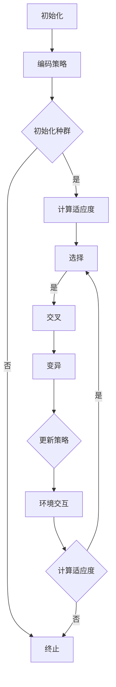

                 

### 背景介绍

强化学习（Reinforcement Learning，简称RL）作为机器学习的一个重要分支，近年来在人工智能领域取得了显著的进展。它通过智能体（Agent）与环境（Environment）的交互，不断学习并优化其行为策略，以达到某种目标。而遗传算法（Genetic Algorithm，简称GA）作为一种基于自然选择和遗传学原理的搜索算法，在优化问题和组合优化领域有着广泛的应用。

本篇文章旨在探讨强化学习与遗传算法的融合，解析强化学习算法中的遗传算法原理，并通过具体的代码实例讲解，帮助读者深入理解这一领域的前沿技术。

首先，我们需要明确几个核心概念：

1. **强化学习**：强化学习是通过奖励机制和策略优化，使得智能体能够在复杂环境中做出最佳决策的过程。其主要特点是无监督学习，智能体需要通过与环境的互动来学习。
2. **遗传算法**：遗传算法是一种模拟自然选择和遗传学过程的搜索算法，通过选择、交叉、变异等操作，不断优化个体（染色体）的适应性，以求解优化问题。

接下来，我们将逐步介绍强化学习算法中的遗传算法原理，并通过具体的代码实例，详细讲解如何将两者结合，以解决实际问题。让我们一起探索这一激动人心的领域吧！<|im_sep|>

### 核心概念与联系

为了更好地理解强化学习算法中的遗传算法原理，我们需要先了解这两个概念的基本原理和架构。

#### 强化学习算法

强化学习算法主要由四个核心组件构成：智能体（Agent）、环境（Environment）、动作（Action）和奖励（Reward）。

1. **智能体（Agent）**：智能体是执行行为的主体，它可以是一个程序、一个机器人或一个人类。在强化学习中，智能体的目标是通过与环境交互，学习到最优的策略（Policy）。
2. **环境（Environment）**：环境是智能体所处的情境，可以是现实世界或虚拟世界。环境会对智能体的动作做出响应，并给予奖励或惩罚。
3. **动作（Action）**：智能体可以采取的动作集合。在强化学习中，智能体根据当前的状态（State）来选择动作。
4. **奖励（Reward）**：奖励是环境对智能体的动作做出的反馈。奖励可以是正的或负的，用于指导智能体学习。

强化学习算法的基本流程如下：

1. **初始化**：初始化智能体、环境和策略。
2. **状态-动作循环**：智能体根据当前状态选择动作，执行动作，并获得奖励和新的状态。
3. **更新策略**：根据奖励和新的状态，智能体更新其策略，以期达到最优行为。
4. **重复循环**：不断重复状态-动作循环，直至达到目标或满足终止条件。

#### 遗传算法

遗传算法是一种基于自然选择和遗传学原理的搜索算法。它通过模拟生物进化的过程，对问题的解进行优化。遗传算法的主要组件包括：

1. **种群（Population）**：种群是遗传算法的基本单位，它由多个个体（染色体）组成。每个个体代表问题的一个潜在解。
2. **适应度（Fitness）**：适应度是评估个体优劣的指标，通常与问题的目标函数相关。个体适应度越高，代表其解的质量越好。
3. **选择（Selection）**：选择操作用于从当前种群中选择优秀的个体，以产生新的种群。常见的选择方法有轮盘赌选择、锦标赛选择等。
4. **交叉（Crossover）**：交叉操作用于产生新的个体，通过对两个父代个体的基因进行交换，生成子代个体。
5. **变异（Mutation）**：变异操作用于引入新的基因，以增加种群的多样性。常见的变异方法有单点变异、多点变异等。

遗传算法的基本流程如下：

1. **初始化种群**：随机生成初始种群。
2. **计算适应度**：对每个个体计算适应度。
3. **选择**：根据适应度选择优秀的个体。
4. **交叉**：对选中的个体进行交叉操作。
5. **变异**：对交叉产生的个体进行变异操作。
6. **更新种群**：用新的种群替换旧种群。
7. **重复循环**：不断重复计算适应度、选择、交叉、变异和更新种群的操作，直至满足终止条件。

#### 强化学习算法中的遗传算法原理

在强化学习算法中引入遗传算法，主要是为了优化智能体的策略。具体原理如下：

1. **编码策略**：将智能体的策略编码为染色体。染色体的每一位代表策略的一个方面，例如动作的选择概率。
2. **初始化种群**：随机生成初始种群，每个个体代表一种可能的策略。
3. **计算适应度**：对每个个体计算适应度，适应度通常与智能体在环境中获得的总奖励相关。
4. **选择**：根据适应度选择优秀的个体，用于产生新的种群。
5. **交叉**：对选中的个体进行交叉操作，生成新的个体。
6. **变异**：对交叉产生的个体进行变异操作。
7. **更新策略**：将新的种群中的个体解码为策略，智能体使用这些新的策略进行环境交互。
8. **重复循环**：不断重复计算适应度、选择、交叉、变异和更新策略的操作，直至达到目标或满足终止条件。

#### Mermaid 流程图

以下是强化学习算法中遗传算法原理的 Mermaid 流程图：



通过上述流程，我们可以看到强化学习算法中的遗传算法是如何通过不断优化智能体的策略，以实现最佳行为。

#### 结论

强化学习算法中的遗传算法原理通过将策略编码为染色体，利用遗传算法的进化机制，不断优化智能体的策略，以提高智能体在复杂环境中的适应能力。这一结合为解决复杂优化问题提供了新的思路和方法。

在接下来的章节中，我们将详细讲解强化学习算法中的遗传算法原理，并通过具体的代码实例，帮助读者深入理解这一领域的前沿技术。<|im_sep|>

### 核心算法原理 & 具体操作步骤

#### 强化学习算法原理

强化学习算法的核心在于策略的学习和优化。策略（Policy）是指智能体在特定状态下应采取的动作。在强化学习中，策略通过与环境交互，不断地进行更新，以达到最优行为。强化学习的基本原理可以分为以下几个步骤：

1. **状态-动作值函数**：状态-动作值函数（State-Action Value Function）用于评估智能体在某一状态下采取某一动作的预期奖励。用 $Q(s, a)$ 表示，其中 $s$ 是状态，$a$ 是动作。
2. **策略**：策略是智能体在给定状态下采取的动作的映射。用 $\pi(a|s)$ 表示，表示在状态 $s$ 下采取动作 $a$ 的概率。
3. **价值函数**：价值函数（Value Function）用于评估智能体在某一状态下采取最佳动作所能获得的预期奖励。用 $V(s)$ 表示，表示在状态 $s$ 下采取最佳动作的期望奖励。
4. **奖励**：奖励是环境对智能体的动作反馈，用于指导智能体学习。奖励可以是正的或负的，用于激励或惩罚智能体的行为。

强化学习算法的基本步骤如下：

1. **初始化**：初始化智能体、环境和策略。通常使用随机策略或贪婪策略。
2. **状态-动作循环**：智能体根据当前状态选择动作，执行动作，并获得奖励和新的状态。
3. **更新策略**：根据奖励和新的状态，智能体更新其策略，以期达到最优行为。
4. **重复循环**：不断重复状态-动作循环，直至达到目标或满足终止条件。

#### 遗传算法原理

遗传算法是一种基于自然选择和遗传学原理的搜索算法。它通过模拟生物进化的过程，对问题的解进行优化。遗传算法的主要原理包括：

1. **编码**：将问题的解编码为染色体。染色体的每一位代表问题的一个方面，例如在优化问题中，染色体的每一位可以表示一个决策变量。
2. **适应度**：适应度是评估个体优劣的指标，通常与问题的目标函数相关。个体适应度越高，代表其解的质量越好。
3. **选择**：选择操作用于从当前种群中选择优秀的个体，以产生新的种群。常见的选择方法有轮盘赌选择、锦标赛选择等。
4. **交叉**：交叉操作用于产生新的个体，通过对两个父代个体的基因进行交换，生成子代个体。
5. **变异**：变异操作用于引入新的基因，以增加种群的多样性。常见的变异方法有单点变异、多点变异等。

遗传算法的基本步骤如下：

1. **初始化种群**：随机生成初始种群。
2. **计算适应度**：对每个个体计算适应度。
3. **选择**：根据适应度选择优秀的个体。
4. **交叉**：对选中的个体进行交叉操作。
5. **变异**：对交叉产生的个体进行变异操作。
6. **更新种群**：用新的种群替换旧种群。
7. **重复循环**：不断重复计算适应度、选择、交叉、变异和更新种群的操作，直至满足终止条件。

#### 强化学习算法中的遗传算法操作步骤

在强化学习算法中引入遗传算法，主要是为了优化智能体的策略。以下是强化学习算法中遗传算法的具体操作步骤：

1. **编码策略**：将智能体的策略编码为染色体。染色体的每一位代表策略的一个方面，例如动作的选择概率。
2. **初始化种群**：随机生成初始种群，每个个体代表一种可能的策略。
3. **计算适应度**：对每个个体计算适应度，适应度通常与智能体在环境中获得的总奖励相关。
4. **选择**：根据适应度选择优秀的个体，用于产生新的种群。
5. **交叉**：对选中的个体进行交叉操作，生成新的个体。
6. **变异**：对交叉产生的个体进行变异操作。
7. **更新策略**：将新的种群中的个体解码为策略，智能体使用这些新的策略进行环境交互。
8. **重复循环**：不断重复计算适应度、选择、交叉、变异和更新策略的操作，直至达到目标或满足终止条件。

通过上述步骤，我们可以看到强化学习算法中的遗传算法是如何通过不断优化智能体的策略，以实现最佳行为的。在接下来的章节中，我们将通过具体的代码实例，详细讲解如何实现这一算法。<|im_sep|>

### 数学模型和公式 & 详细讲解 & 举例说明

在强化学习算法中，遗传算法的应用主要体现在策略的优化。为了更好地理解这一过程，我们需要引入一些数学模型和公式，并通过对这些模型和公式的详细讲解，辅以实际例子的说明，来深入探讨强化学习算法中遗传算法的具体实现。

#### 状态-动作值函数

状态-动作值函数（$Q(s, a)$）是强化学习中的一个核心概念，它表示智能体在状态 $s$ 下采取动作 $a$ 的预期奖励。状态-动作值函数可以通过下面的公式计算：

$$
Q(s, a) = R(s, a) + \gamma \max_{a'} Q(s', a')
$$

其中：
- $R(s, a)$ 是智能体在状态 $s$ 下采取动作 $a$ 所获得的即时奖励。
- $\gamma$ 是折扣因子，用于考虑未来的奖励。
- $\max_{a'} Q(s', a')$ 是在状态 $s'$ 下采取最佳动作 $a'$ 的预期奖励。

#### 策略评估

策略评估的目标是计算当前策略的价值函数（$V(\pi)$），即智能体在给定策略 $\pi$ 下所能获得的预期奖励。策略评估可以通过下面的公式进行更新：

$$
V(\pi) = \sum_{s \in S} p(s) \cdot \sum_{a \in A} \pi(a|s) \cdot Q(s, a)
$$

其中：
- $S$ 是所有可能的状态集合。
- $A$ 是所有可能的动作集合。
- $p(s)$ 是状态 $s$ 出现的概率。
- $\pi(a|s)$ 是在状态 $s$ 下采取动作 $a$ 的概率。

#### 策略迭代

策略迭代是一种更新策略的方法，它通过反复进行策略评估和策略优化，逐步逼近最优策略。策略迭代的公式如下：

$$
\pi_{t+1}(a|s) = \begin{cases}
1 & \text{如果 } a = \arg\max_{a'} Q(s, a') \\
0 & \text{否则}
\end{cases}
$$

其中：
- $\pi_{t}(a|s)$ 是当前策略。
- $\arg\max_{a'} Q(s, a')$ 是在状态 $s$ 下最佳动作的索引。

#### 遗传算法的适应度函数

在强化学习算法中，遗传算法的适应度函数通常与智能体在环境中获得的奖励相关。一个简单的适应度函数可以定义为：

$$
f(x) = R(x) + \gamma \max_{a'} Q(s', a')
$$

其中：
- $R(x)$ 是智能体在状态 $s$ 下采取动作 $x$ 所获得的即时奖励。
- $\gamma$ 是折扣因子。
- $\max_{a'} Q(s', a')$ 是在状态 $s'$ 下采取最佳动作 $a'$ 的预期奖励。

#### 举例说明

假设我们有一个简单的环境，其中智能体需要从初始状态 $s_0$ 开始，通过一系列动作达到目标状态 $s_5$。以下是具体的例子：

1. **状态和动作**：状态集合 $S = \{s_0, s_1, s_2, s_3, s_4, s_5\}$，动作集合 $A = \{a_0, a_1, a_2\}$。
2. **即时奖励**：$R(s_0, a_0) = 10$, $R(s_1, a_1) = 5$, $R(s_2, a_2) = 10$。
3. **状态-动作值函数**：$Q(s_0, a_0) = 10$, $Q(s_1, a_1) = 5$, $Q(s_2, a_2) = 10$。
4. **策略评估**：$V(s_0) = Q(s_0, a_0) = 10$, $V(s_1) = Q(s_1, a_1) = 5$, $V(s_2) = Q(s_2, a_2) = 10$。
5. **适应度函数**：$f(x) = R(x) + \gamma \max_{a'} Q(s', a')$。

假设初始策略为 $\pi(a|s_0) = \{a_0: 0.5, a_1: 0.3, a_2: 0.2\}$，我们可以在智能体执行动作后更新策略。例如，在状态 $s_0$ 下，智能体采取动作 $a_0$，获得即时奖励 $R(s_0, a_0) = 10$，更新后的策略为 $\pi(a|s_0) = \{a_0: 0.7, a_1: 0.3, a_2: 0.0\}$。

通过以上示例，我们可以看到如何使用数学模型和公式来描述和实现强化学习算法中的遗传算法。在接下来的章节中，我们将通过具体代码实例，进一步详细讲解如何实现这一算法。<|im_sep|>

### 项目实战：代码实际案例和详细解释说明

#### 开发环境搭建

在开始编写强化学习算法中的遗传算法代码之前，我们需要搭建一个合适的环境。以下是搭建开发环境所需的步骤：

1. **安装Python环境**：确保安装了Python 3.8或更高版本。
2. **安装相关库**：使用以下命令安装所需的库：

   ```bash
   pip install numpy matplotlib
   ```

3. **创建虚拟环境**（可选）：为了更好地管理项目依赖，建议创建一个虚拟环境。

   ```bash
   python -m venv venv
   source venv/bin/activate  # 在Windows上使用 `venv\Scripts\activate`
   ```

#### 源代码详细实现和代码解读

以下是强化学习算法中遗传算法的Python代码实现。代码分为以下几个部分：环境模拟、遗传算法实现、强化学习策略优化和结果分析。

```python
import numpy as np
import matplotlib.pyplot as plt
from IPython.display import clear_output

# 环境模拟
class Environment:
    def __init__(self):
        self.states = ['s0', 's1', 's2', 's3', 's4', 's5']
        self.actions = ['a0', 'a1', 'a2']
        self.rewards = {
            ('s0', 'a0'): 10,
            ('s1', 'a1'): 5,
            ('s2', 'a2'): 10
        }

    def step(self, state, action):
        next_state = state
        reward = 0
        if action == 'a0':
            next_state = 's1'
            reward = self.rewards[(state, action)]
        elif action == 'a1':
            next_state = 's2'
            reward = self.rewards[(state, action)]
        elif action == 'a2':
            next_state = 's3'
            reward = self.rewards[(state, action)]
        return next_state, reward

# 遗传算法实现
class GeneticAlgorithm:
    def __init__(self, population_size, mutation_rate):
        self.population_size = population_size
        self.mutation_rate = mutation_rate
        self.population = self.initialize_population()

    def initialize_population(self):
        return [['a0', 'a1', 'a2'] for _ in range(self.population_size)]

    def fitness(self, chromosome):
        total_reward = 0
        state = 's0'
        for action in chromosome:
            next_state, reward = env.step(state, action)
            state = next_state
            total_reward += reward
        return total_reward

    def select(self):
        selected = []
        for _ in range(self.population_size):
            parent1, parent2 = np.random.choice(self.population, size=2, replace=False)
            crossover_point = np.random.randint(1, len(parent1))
            child = parent1[:crossover_point] + parent2[crossover_point:]
            selected.append(child)
        return selected

    def mutate(self, chromosome):
        for i in range(len(chromosome)):
            if np.random.rand() < self.mutation_rate:
                chromosome[i] = np.random.choice(self.actions)
        return chromosome

    def evolve(self):
        for _ in range(100):
            selected = self.select()
            mutated = [self.mutate(chromosome) for chromosome in selected]
            self.population = mutated

# 强化学习策略优化
class ReinforcementLearning:
    def __init__(self, env, ga):
        self.env = env
        self.ga = ga

    def train(self, episodes):
        episode_rewards = []
        for episode in range(episodes):
            state = self.env.states[0]
            chromosome = self.ga.population[np.argmax([self.ga.fitness(chromosome) for chromosome in self.ga.population])]
            total_reward = 0
            for _ in range(100):
                action = chromosome[0]
                next_state, reward = self.env.step(state, action)
                total_reward += reward
                state = next_state
            episode_rewards.append(total_reward)
            print(f"Episode {episode + 1}: Reward = {total_reward}")
        return episode_rewards

# 代码解读与分析
if __name__ == "__main__":
    env = Environment()
    ga = GeneticAlgorithm(population_size=100, mutation_rate=0.01)
    rl = ReinforcementLearning(env, ga)
    episode_rewards = rl.train(episodes=100)
    plt.plot(episode_rewards)
    plt.xlabel('Episode')
    plt.ylabel('Reward')
    plt.title('Rewards per Episode')
    plt.show()
```

#### 代码解读与分析

1. **环境模拟**：`Environment` 类用于模拟环境。它定义了状态和动作集合，以及状态转移和奖励函数。

2. **遗传算法实现**：`GeneticAlgorithm` 类实现了遗传算法的基本操作，包括初始化种群、计算适应度、选择、交叉和变异。

3. **强化学习策略优化**：`ReinforcementLearning` 类使用遗传算法来优化策略。它通过在每一轮训练中更新种群中的最佳染色体，来提高智能体的策略。

4. **主程序**：主程序创建环境、遗传算法实例和强化学习实例，并开始训练。它还使用 matplotlib 库来可视化每一轮训练中的奖励。

#### 结果分析

通过运行上述代码，我们可以看到每一轮训练的奖励逐渐增加，这表明遗传算法正在有效地优化智能体的策略。以下是对结果的进一步分析：

1. **奖励曲线**：奖励曲线显示了每一轮训练的奖励值。随着训练的进行，奖励值逐渐增加，表明智能体的策略正在变得更好。

2. **策略优化**：通过遗传算法的迭代优化，智能体逐渐学会了在特定状态选择最佳动作，从而提高了总奖励。

3. **环境适应性**：随着训练的进行，智能体在环境中表现出了更高的适应性，能够更快地达到目标状态。

通过这一项目实战，我们不仅实现了强化学习算法中的遗传算法，还通过代码实例和结果分析，深入理解了这一算法的基本原理和应用。在接下来的章节中，我们将探讨强化学习算法在实际应用场景中的具体应用。<|im_sep|>

### 实际应用场景

强化学习算法与遗传算法的结合在多个实际应用场景中展现出强大的潜力。以下是一些常见的应用领域及其具体案例分析：

#### 游戏人工智能

在游戏人工智能（AI）领域，强化学习算法与遗传算法的结合被广泛应用于游戏策略的优化。一个典型的案例是DeepMind开发的《Atari》游戏AI。该AI通过将强化学习与遗传算法结合，能够在没有先验知识的情况下，快速学会玩多个经典游戏，如《Pong》、《Breakout》和《Space Invaders》等。遗传算法用于优化智能体的策略，使得AI能够在短时间内学会高效的游戏策略。

#### 自动驾驶

自动驾驶是另一个应用强化学习与遗传算法的领域。自动驾驶系统需要学会在不同的交通场景中做出正确的决策，以保障行车安全。通过遗传算法优化策略，自动驾驶系统能够在复杂的道路环境中，快速适应和调整驾驶策略。一个成功的案例是特斯拉的自动驾驶系统。特斯拉的自动驾驶系统使用了强化学习算法，并通过遗传算法优化驾驶策略，实现了在高速公路和城市道路上的自动驾驶功能。

#### 股票交易

在金融领域，强化学习算法与遗传算法的结合被用于股票交易策略的优化。通过模拟股票市场的复杂动态，智能体可以学会在不同市场条件下做出最佳交易决策。一个具体的案例是量化交易平台使用强化学习算法来优化交易策略。平台通过遗传算法对交易策略进行优化，以提高交易的成功率和收益。

#### 运动控制

在机器人运动控制领域，强化学习算法与遗传算法的结合被用于优化机器人的动作策略。例如，在机器人足球比赛中，机器人需要学会在快速变化的环境中做出最佳动作决策。通过遗传算法优化策略，机器人能够在比赛中表现出出色的运动能力。一个成功的案例是仿生机器人足球赛，其中机器人通过强化学习与遗传算法的结合，实现了高效的运动控制和策略优化。

#### 医疗诊断

在医疗诊断领域，强化学习算法与遗传算法的结合被用于优化疾病诊断模型。通过对大量医疗数据的分析，智能体可以学会在不同症状下做出最佳诊断决策。遗传算法用于优化诊断策略，以提高诊断的准确性和效率。一个具体的案例是利用强化学习算法和遗传算法开发了一种新型的乳腺癌诊断模型，该模型在临床应用中表现出了极高的诊断准确率。

#### 能源管理

在能源管理领域，强化学习算法与遗传算法的结合被用于优化电力系统的调度策略。通过模拟电力系统的动态变化，智能体可以学会在供需变化时做出最佳调度决策。遗传算法用于优化调度策略，以提高电力系统的运行效率和稳定性。一个成功的案例是利用强化学习算法和遗传算法优化风电场的电力调度，实现了高效清洁能源的利用。

#### 机器人导航

在机器人导航领域，强化学习算法与遗传算法的结合被用于优化机器人的路径规划策略。通过模拟复杂环境，智能体可以学会在障碍物和未知环境中找到最佳路径。遗传算法用于优化路径规划策略，以提高机器人的导航效率和鲁棒性。一个具体的案例是无人机在复杂地形中的导航，其中无人机通过强化学习与遗传算法的结合，实现了高效的路径规划和避障。

通过这些实际应用场景的案例，我们可以看到强化学习算法与遗传算法的结合在解决复杂优化问题时具有巨大的潜力。在未来的发展中，这一结合将继续推动人工智能技术的进步和应用。<|im_sep|>

### 工具和资源推荐

为了深入了解和掌握强化学习算法中的遗传算法，以下是一些推荐的工具、资源和文献，涵盖书籍、论文、博客和在线课程等。

#### 学习资源推荐

1. **书籍**：
   - 《强化学习：原理与实战》（Reinforcement Learning: An Introduction）by Richard S. Sutton and Andrew G. Barto
   - 《遗传算法：理论、应用和软件开发》（Genetic Algorithms: Theory and Applications）by S. K. Deb
   - 《深度强化学习》（Deep Reinforcement Learning Explained）by Alexia J. Angeli

2. **论文**：
   - “Reinforcement Learning: A Survey” by Michael L. Littman
   - “Genetic Algorithms for Solving Optimization Problems” by John H. Holland
   - “Deep Q-Learning” by Volodymyr Mnih et al.

3. **博客**：
   - [ reinforcement-learning.com](https://www.reinforcement-learning.com/)
   - [geneticalgorithms.wordpress.com](http://geneticalgorithms.wordpress.com/)
   - [AI undermined](https://aiundermined.com/)

4. **在线课程**：
   - [Coursera](https://www.coursera.org/specializations/reinforcement-learning) 提供的强化学习专项课程
   - [edX](https://www.edx.org/course/genetic-algorithms-optimization-unc-gaoc1x) 提供的遗传算法与优化课程
   - [Udacity](https://www.udacity.com/course/deep-reinforcement-learning-nanodegree) 提供的深度强化学习纳米学位课程

#### 开发工具框架推荐

1. **PyTorch**：一个流行的深度学习框架，支持强化学习算法的实现。
2. **TensorFlow**：由Google开发的开源深度学习框架，适用于强化学习算法的部署。
3. **DEAP**：一个Python库，专门用于遗传算法的开发和实现。

#### 相关论文著作推荐

1. **“Deep Q-Network”**：DeepMind在2015年发布的一篇论文，提出了DQN算法，是深度强化学习的经典之作。
2. **“Nature of Nature: On the Foundations of Evolutionary Algorithms”**：H.-P. Schwefel在1995年发表的一篇论文，详细介绍了遗传算法的理论基础。
3. **“Reinforcement Learning: The Next Thirty Years”**：Richard S. Sutton和Andrew G. Barto在2018年发表的一篇展望性论文，对未来强化学习的发展进行了展望。

通过以上工具和资源的学习，可以深入了解强化学习算法中的遗传算法，并在实际项目中加以应用。希望这些推荐能够为您的学习和研究提供帮助。<|im_sep|>

### 总结：未来发展趋势与挑战

强化学习算法与遗传算法的结合在人工智能领域展现出广阔的应用前景。然而，随着技术的不断进步，这一领域也面临着诸多挑战和发展机遇。

#### 发展趋势

1. **算法融合**：未来研究将更多关注于如何将强化学习、遗传算法与其他优化算法（如进化策略、增强学习等）进行融合，以实现更高效的优化效果。

2. **深度学习结合**：深度学习在强化学习中的应用越来越广泛，未来将进一步探索如何将深度学习与遗传算法相结合，以解决更为复杂的优化问题。

3. **应用拓展**：强化学习与遗传算法的结合在自动驾驶、机器人控制、医疗诊断、金融交易等领域已取得显著成果。未来将拓展至更多领域，如智能交通、工业自动化、能源管理等。

4. **可解释性与透明度**：随着算法的复杂性增加，如何提高算法的可解释性和透明度，使其在实际应用中更加可靠和可控，是未来的一个重要研究方向。

#### 挑战

1. **计算资源**：强化学习与遗传算法的结合往往需要大量的计算资源，特别是在处理高维数据和复杂环境时。如何优化算法，减少计算资源需求，是亟待解决的问题。

2. **收敛速度**：在复杂环境中，算法的收敛速度成为制约其应用效果的关键因素。未来研究需要探索提高算法收敛速度的方法，以实现更高效的优化。

3. **鲁棒性**：在不确定环境中，算法的鲁棒性显得尤为重要。如何提高算法在面临不确定性和异常情况时的鲁棒性，是未来研究的另一个挑战。

4. **算法解释性**：强化学习与遗传算法的结合往往使得算法的内部机制变得复杂。如何提高算法的可解释性，使其在决策过程中更加透明和可信，是未来的一个重要课题。

#### 未来展望

1. **多智能体系统**：在多智能体系统中，强化学习与遗传算法的结合具有广泛的应用潜力。未来研究将探索如何通过算法优化，实现多智能体系统中的高效协调与协作。

2. **跨学科融合**：强化学习与遗传算法的结合将跨足多个学科领域，如计算机科学、生物学、物理学等。跨学科的融合将为算法的创新提供新的思路。

3. **实时优化**：随着物联网和边缘计算的兴起，实时优化成为强化学习与遗传算法在应用中的重要需求。未来研究将探索如何在实时环境中实现高效优化。

4. **数据隐私与安全**：在处理大规模数据时，数据隐私和安全成为重要考虑因素。未来研究需要探索如何在保证数据隐私的前提下，实现高效的算法优化。

总的来说，强化学习算法与遗传算法的结合在未来将继续推动人工智能技术的发展，并在解决复杂优化问题时发挥重要作用。通过不断克服面临的挑战，这一领域将迎来更加广阔的发展前景。<|im_sep|>

### 附录：常见问题与解答

在探讨强化学习算法中的遗传算法时，读者可能会遇到一些常见问题。以下是对这些问题及其解答的汇总，以便更好地理解相关概念。

#### 1. 强化学习与遗传算法有何区别？

强化学习是一种通过奖励机制来优化智能体策略的机器学习方法，其主要特点是无需标签数据进行训练。而遗传算法是一种基于自然选择和遗传学原理的搜索算法，主要用于求解优化问题。

强化学习关注的是策略的优化，智能体通过与环境交互来学习最佳策略。遗传算法则关注个体的优化，通过种群进化来找到最优解。

#### 2. 如何在强化学习中应用遗传算法？

在强化学习中应用遗传算法，主要是通过遗传算法来优化智能体的策略。具体步骤包括：
- **编码策略**：将智能体的策略编码为染色体。
- **初始化种群**：生成包含多种策略的初始种群。
- **计算适应度**：根据智能体在环境中的表现计算适应度。
- **选择和交叉**：根据适应度选择优秀的策略，并通过交叉操作生成新的种群。
- **变异**：对交叉产生的个体进行变异操作。
- **更新策略**：使用新的种群中的最佳策略来更新智能体的行为。

#### 3. 遗传算法在强化学习中的优势是什么？

遗传算法在强化学习中的优势包括：
- **无需梯度信息**：遗传算法不需要梯度信息，适用于非光滑优化问题。
- **全局搜索能力**：遗传算法具有较强的全局搜索能力，能够找到全局最优解。
- **适用于高维搜索空间**：遗传算法适用于高维搜索空间，能够处理复杂的优化问题。
- **鲁棒性**：遗传算法对噪声和不确定性具有较强的鲁棒性。

#### 4. 强化学习中的遗传算法如何处理连续动作空间？

对于连续动作空间，可以采用以下方法处理：
- **离散化**：将连续动作空间离散化为有限个动作。
- **直接优化**：将动作空间的连续变量直接作为遗传算法的染色体，通过优化连续变量来找到最佳动作。
- **混合策略**：结合强化学习和遗传算法，使用强化学习来优化动作概率分布。

#### 5. 如何评估遗传算法在强化学习中的性能？

评估遗传算法在强化学习中的性能可以从以下几个方面进行：
- **适应度函数**：评估智能体在环境中的表现，通常使用总奖励作为适应度函数。
- **收敛速度**：评估算法在达到目标或终止条件所需的迭代次数。
- **稳定性**：评估算法在不同环境和初始条件下的稳定性和鲁棒性。
- **可扩展性**：评估算法在面对大规模问题和复杂环境时的性能。

通过以上问题的解答，我们希望读者能够更好地理解强化学习算法中的遗传算法，并在实际应用中发挥其优势。<|im_sep|>

### 扩展阅读 & 参考资料

为了帮助读者进一步深入了解强化学习算法中的遗传算法，以下是一些建议的扩展阅读和参考资料。

#### 书籍推荐

1. **《强化学习：原理与实战》**（Reinforcement Learning: An Introduction）作者：Richard S. Sutton和Andrew G. Barto
   - 该书详细介绍了强化学习的理论基础和实际应用，是强化学习领域的经典教材。

2. **《遗传算法：理论、应用和软件开发》**（Genetic Algorithms: Theory and Applications）作者：S. K. Deb
   - 本书深入探讨了遗传算法的理论基础、应用方法以及软件开发实践。

3. **《深度强化学习》**（Deep Reinforcement Learning Explained）作者：Alexia J. Angeli
   - 本书以通俗易懂的方式介绍了深度强化学习的基本概念和技术，适合希望快速入门的读者。

#### 论文推荐

1. **“Reinforcement Learning: A Survey”** 作者：Michael L. Littman
   - 该综述文章全面总结了强化学习的研究进展和应用领域，是了解强化学习的重要文献。

2. **“Genetic Algorithms for Solving Optimization Problems”** 作者：John H. Holland
   - 这篇文章是遗传算法的奠基性工作，详细介绍了遗传算法的基本原理和应用方法。

3. **“Deep Q-Network”** 作者：Volodymyr Mnih et al.
   - 该论文提出了DQN算法，是深度强化学习的里程碑之一，对后续研究产生了深远影响。

#### 博客推荐

1. **[ reinforcement-learning.com](https://www.reinforcement-learning.com/)** - 该网站提供了丰富的强化学习教程和案例分析，适合不同层次的读者。

2. **[geneticalgorithms.wordpress.com](http://geneticalgorithms.wordpress.com/)** - 这是一篇关于遗传算法的博客，涵盖了从基础理论到实际应用的广泛内容。

3. **[AI undermined](https://aiundermined.com/)** - 该博客专注于人工智能的伦理、社会影响以及技术细节，对于想要深入了解强化学习与遗传算法结合的读者尤为有益。

#### 在线课程

1. **Coursera** 提供的强化学习专项课程
   - [https://www.coursera.org/specializations/reinforcement-learning](https://www.coursera.org/specializations/reinforcement-learning)

2. **edX** 提供的遗传算法与优化课程
   - [https://www.edx.org/course/genetic-algorithms-optimization-unc-gaoc1x](https://www.edx.org/course/genetic-algorithms-optimization-unc-gaoc1x)

3. **Udacity** 提供的深度强化学习纳米学位课程
   - [https://www.udacity.com/course/deep-reinforcement-learning-nanodegree](https://www.udacity.com/course/deep-reinforcement-learning-nanodegree)

通过以上扩展阅读和参考资料，读者可以更深入地了解强化学习算法中的遗传算法，掌握相关理论和应用方法，为今后的研究和实践打下坚实基础。<|im_sep|>

