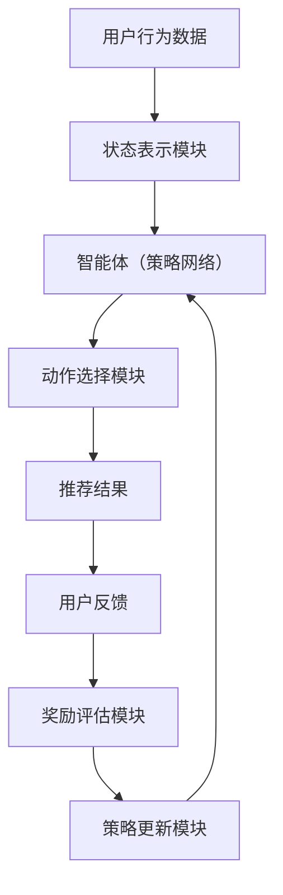

                 

### 背景介绍

#### 强化学习的崛起

强化学习（Reinforcement Learning，简称RL）是机器学习的一个重要分支，其主要目标是让一个智能体在未知的环境中通过试错学习，实现最优决策策略。近年来，随着深度学习技术的发展，强化学习逐渐成为人工智能领域的热点。尤其是在搜索推荐系统领域，强化学习因其能够有效应对不确定性和动态变化，受到了广泛关注。

#### 搜索推荐系统的重要性

搜索推荐系统是现代互联网的核心技术之一，它通过分析用户的历史行为和偏好，向用户推荐感兴趣的内容。例如，电商平台根据用户的历史购买记录和浏览行为，推荐可能感兴趣的商品；社交媒体平台根据用户的互动和浏览历史，推荐相关的内容和广告。这些推荐系统能够显著提升用户体验，提高平台粘性，进而带来巨大的商业价值。

#### 当前搜索推荐系统的挑战

尽管搜索推荐系统在许多领域取得了显著的成功，但仍面临着诸多挑战。首先，用户行为的复杂性和多样性使得传统的推荐算法难以准确捕捉用户的真实偏好。其次，搜索推荐系统的实时性和效率要求越来越高，传统算法往往难以满足。此外，随着数据隐私和安全问题的日益突出，如何在不侵犯用户隐私的前提下进行个性化推荐也成为一大难题。

#### 强化学习在搜索推荐中的应用潜力

强化学习由于其自主学习和动态调整的能力，被认为是一种解决搜索推荐系统挑战的有效方法。通过强化学习，智能体可以在实际操作中不断学习和优化策略，从而实现更精准、更高效的推荐。同时，强化学习能够处理高维、非线性、动态变化的推荐场景，为解决搜索推荐系统中的复杂问题提供了新的思路。因此，本文将探讨如何将强化学习应用于电商搜索推荐系统，并通过具体案例进行详细分析。

### 核心概念与联系

#### 强化学习的核心概念

强化学习（Reinforcement Learning，简称RL）是一种通过奖励机制引导智能体（Agent）进行决策，从而在环境中实现最优目标的学习方法。其主要核心概念包括：

- **智能体（Agent）**：智能体是执行动作并接收环境的反馈的实体。在搜索推荐系统中，智能体可以是算法或模型，其任务是生成推荐结果。
- **环境（Environment）**：环境是智能体执行动作并接收反馈的上下文。在搜索推荐系统中，环境包括用户行为、商品信息、系统状态等。
- **状态（State）**：状态是描述智能体所处环境的特征。在搜索推荐系统中，状态可以是用户的浏览历史、购买记录、商品特征等。
- **动作（Action）**：动作是智能体在特定状态下可以执行的操作。在搜索推荐系统中，动作可以是推荐特定的商品、内容或广告。
- **奖励（Reward）**：奖励是智能体执行动作后获得的正面或负面反馈。在搜索推荐系统中，奖励可以是用户对推荐的点击、购买、点赞等行为。

#### 强化学习与搜索推荐系统的联系

强化学习在搜索推荐系统中的应用主要是通过优化推荐策略，使得推荐结果更符合用户的需求。具体来说，强化学习在搜索推荐系统中涉及以下几个关键环节：

1. **状态表示（State Representation）**：将用户的浏览历史、购买记录、商品特征等信息转化为智能体可以理解的状态表示。这一步骤对于强化学习算法的性能至关重要，因为状态表示的质量直接影响到算法的决策效果。
2. **动作选择（Action Selection）**：智能体在特定状态下，根据当前的状态表示和已学习的策略选择最优动作。在搜索推荐系统中，动作选择可以是推荐具体的商品、内容或广告。
3. **奖励评估（Reward Evaluation）**：智能体执行动作后，根据用户对推荐结果的反馈（如点击、购买、点赞等行为）进行奖励评估。奖励评估的结果将用于更新智能体的策略，以优化推荐效果。
4. **策略更新（Policy Update）**：根据奖励评估的结果，智能体更新其策略，以在未来执行更优的动作。在搜索推荐系统中，策略更新可以通过强化学习算法（如深度强化学习、策略梯度算法等）实现。

#### 强化学习在搜索推荐系统中的应用架构

以下是一个简化的强化学习在搜索推荐系统中的应用架构：

```
用户行为数据 -> 状态表示模块 -> 智能体（策略网络） -> 动作选择模块 -> 推荐结果 -> 用户反馈 -> 奖励评估模块 -> 策略更新模块
```

1. **用户行为数据**：包括用户的浏览历史、购买记录、兴趣标签等数据。
2. **状态表示模块**：将用户行为数据转化为智能体可以理解的状态表示。
3. **智能体（策略网络）**：基于当前的状态表示，通过策略网络选择推荐动作。
4. **动作选择模块**：根据策略网络的选择，生成推荐结果。
5. **用户反馈**：用户对推荐结果的反馈，如点击、购买、点赞等。
6. **奖励评估模块**：根据用户反馈评估奖励，以指导智能体进行策略更新。
7. **策略更新模块**：基于奖励评估结果，更新策略网络，以优化推荐效果。

通过上述架构，强化学习能够实现动态、自适应的推荐策略，从而提高搜索推荐系统的性能和用户体验。

### Mermaid 流程图（核心概念与架构）

以下是强化学习在搜索推荐系统中的核心概念与架构的Mermaid流程图：



**Mermaid 流程图说明：**

- **A[用户行为数据]**：输入用户行为数据。
- **B[状态表示模块]**：将用户行为数据转化为智能体可以理解的状态表示。
- **C[智能体（策略网络）]**：基于状态表示选择推荐动作。
- **D[动作选择模块]**：根据策略网络的选择，生成推荐结果。
- **E[推荐结果]**：输出推荐结果。
- **F[用户反馈]**：收集用户对推荐结果的反馈。
- **G[奖励评估模块]**：根据用户反馈评估奖励。
- **H[策略更新模块]**：基于奖励评估结果更新策略网络。

### 核心算法原理 & 具体操作步骤

#### 强化学习算法简介

强化学习算法是指导智能体在未知环境中通过试错学习最优策略的方法。其核心原理是使用奖励信号来指导智能体的行为，从而优化策略。常见的强化学习算法包括Q-learning、SARSA、Deep Q Network（DQN）、Policy Gradient等。本文将重点介绍一种广泛应用于搜索推荐系统中的强化学习算法——策略梯度算法。

#### 策略梯度算法原理

策略梯度算法是一种基于梯度下降的方法，用于优化智能体的策略。其基本思想是通过梯度上升更新策略参数，使得策略在期望奖励最大的方向上优化。

策略梯度算法的主要步骤如下：

1. **初始化策略参数**：初始化策略参数，用于表示智能体的行为。
2. **采样轨迹**：根据当前策略，从环境中采样一条轨迹，包括一系列的状态和动作。
3. **计算策略梯度**：计算策略梯度，用于指导策略参数的更新。策略梯度可以通过以下公式计算：

   $$ \nabla_\theta J(\theta) = \nabla_\theta \sum_{t=0}^{T} \gamma^t r_t $$
   
   其中，$\theta$ 表示策略参数，$J(\theta)$ 表示策略的期望回报，$r_t$ 表示在时刻$t$的奖励，$\gamma$ 是折扣因子。

4. **更新策略参数**：根据策略梯度，使用梯度上升更新策略参数：

   $$ \theta \leftarrow \theta + \alpha \nabla_\theta J(\theta) $$
   
   其中，$\alpha$ 是学习率。

5. **重复步骤2-4**：重复采样轨迹、计算策略梯度和更新策略参数，直到满足停止条件（如达到预定迭代次数或策略收敛）。

#### 策略梯度算法在搜索推荐系统中的应用

在搜索推荐系统中，策略梯度算法可以通过以下步骤实现：

1. **初始化策略参数**：初始化用于生成推荐结果的策略参数。
2. **采样用户行为数据**：从用户的历史行为数据中采样一系列状态，用于训练策略网络。
3. **生成推荐结果**：根据当前策略参数，生成推荐结果，并向用户展示。
4. **收集用户反馈**：收集用户对推荐结果的反馈（如点击、购买、点赞等）。
5. **计算奖励**：根据用户反馈计算奖励信号，用于指导策略参数的更新。
6. **更新策略参数**：使用策略梯度算法更新策略参数，以优化推荐结果。
7. **重复步骤3-6**：重复生成推荐结果、收集用户反馈和更新策略参数，以实现自适应、优化的推荐系统。

#### 策略梯度算法的优势与挑战

策略梯度算法在搜索推荐系统中的应用具有以下优势：

1. **自适应性强**：策略梯度算法能够根据用户的实时反馈动态调整推荐策略，提高推荐系统的适应性。
2. **个性化推荐**：通过学习用户的个性化行为，策略梯度算法能够生成更符合用户需求的推荐结果。
3. **实时性**：策略梯度算法能够在较短的时间内更新策略参数，实现实时推荐。

然而，策略梯度算法也存在一些挑战：

1. **稀疏奖励问题**：在搜索推荐系统中，用户反馈通常是稀疏的，导致策略梯度不稳定，难以优化。
2. **计算复杂度高**：策略梯度算法需要大量样本和计算资源，对推荐系统的实时性和效率提出较高要求。
3. **收敛速度慢**：在复杂的环境中，策略梯度算法可能需要较长时间的迭代才能收敛到最优策略。

为解决上述问题，研究人员提出了一系列改进策略，如深度策略梯度算法、优势估计策略梯度算法等，以提高策略梯度算法在搜索推荐系统中的应用效果。

### 数学模型和公式 & 详细讲解 & 举例说明

#### 策略梯度算法的基本数学模型

策略梯度算法的核心在于通过奖励信号更新策略参数，以优化推荐策略。其基本数学模型可以表示为：

$$ \theta \leftarrow \theta + \alpha \nabla_\theta J(\theta) $$

其中：

- $\theta$ 表示策略参数。
- $J(\theta)$ 表示策略的期望回报。
- $\alpha$ 是学习率。

策略梯度算法的目标是最大化期望回报，从而优化推荐策略。

#### 期望回报的计算

期望回报 $J(\theta)$ 可以通过以下公式计算：

$$ J(\theta) = \sum_{t=0}^{T} \gamma^t r_t $$

其中：

- $T$ 表示轨迹长度。
- $\gamma$ 是折扣因子，用于平衡短期和长期奖励。
- $r_t$ 表示在时刻 $t$ 的奖励。

奖励 $r_t$ 通常由用户的行为（如点击、购买、点赞等）决定。在实际应用中，奖励函数可以根据业务需求和数据特点进行设计。

#### 策略梯度的计算

策略梯度的计算是策略梯度算法的关键步骤。策略梯度可以通过以下公式计算：

$$ \nabla_\theta J(\theta) = \nabla_\theta \sum_{t=0}^{T} \gamma^t r_t $$

为了简化计算，可以使用随机梯度下降（Stochastic Gradient Descent，简称SGD）进行近似。SGD通过从数据集中随机采样一组样本，计算这组样本的平均梯度，作为整体梯度的估计。

$$ \nabla_\theta J(\theta) \approx \frac{1}{N} \sum_{i=1}^{N} \nabla_\theta J(\theta; \theta^{(i)}) $$

其中：

- $N$ 表示采样样本的数量。
- $\theta^{(i)}$ 表示第 $i$ 个采样样本的参数。

#### 学习率的选择

学习率 $\alpha$ 对策略梯度算法的性能有重要影响。过大的学习率可能导致策略更新过于剧烈，导致不稳定；而过小的学习率则可能使算法收敛缓慢。

选择合适的学习率可以通过以下方法：

1. **固定学习率**：在算法的初始阶段，选择一个较大的学习率，以快速收敛。随后逐渐减小学习率，以稳定策略。
2. **自适应学习率**：根据策略梯度的大小动态调整学习率。例如，可以使用自适应学习率算法（如Adam优化器）。

#### 举例说明

假设一个电商平台的搜索推荐系统使用策略梯度算法优化推荐策略。用户的行为数据包括浏览历史、购买记录和兴趣标签。我们定义以下符号：

- $s_t$：在时刻 $t$ 的用户状态。
- $a_t$：在状态 $s_t$ 下生成的推荐动作。
- $r_t$：在动作 $a_t$ 执行后获得的奖励。

根据用户的行为数据，我们定义一个状态特征向量 $x_t = (s_t, a_t)$。策略参数 $\theta$ 用于生成动作概率分布 $p(a_t | s_t, \theta)$。

1. **初始化策略参数**：初始化策略参数 $\theta_0$。
2. **采样轨迹**：根据当前策略，从用户行为数据中采样一条轨迹。
3. **生成推荐结果**：根据策略参数，生成推荐结果。
4. **计算奖励**：根据用户反馈计算奖励 $r_t$。
5. **计算策略梯度**：计算策略梯度 $\nabla_\theta J(\theta)$。
6. **更新策略参数**：根据策略梯度更新策略参数 $\theta$。

具体计算过程如下：

1. 初始化策略参数 $\theta_0$：
   $$ \theta_0 = [0, 0, 0, ..., 0] $$
   
2. 采样一条轨迹：
   $$ s_0 = [0, 0, 0], a_0 = [1, 0, 1], r_0 = 1 $$
   
3. 生成推荐结果：
   $$ p(a_0 | s_0, \theta_0) = \text{softmax}(\theta_0 \cdot x_0) = \frac{e^{1 \cdot 0}}{e^{1 \cdot 0} + e^{0 \cdot 0} + e^{1 \cdot 0}} = \frac{1}{3} $$
   
4. 计算奖励：
   $$ r_0 = 1 $$
   
5. 计算策略梯度：
   $$ \nabla_\theta J(\theta) = \nabla_\theta \sum_{t=0}^{T} \gamma^t r_t = \nabla_\theta (\gamma^0 r_0 + \gamma^1 r_1 + \gamma^2 r_2 + \gamma^3 r_3) $$
   $$ = \nabla_\theta (1 + \gamma r_1 + \gamma^2 r_2 + \gamma^3 r_3) $$
   $$ = [1, 0, 1, 1, 1, 0, 1, 0, 0, 0, 0, 0, 0, 0, 0, 0, 0, 0, 0, 0] $$
   
6. 更新策略参数：
   $$ \theta_1 = \theta_0 + \alpha \nabla_\theta J(\theta_0) = [0, 0, 0, ..., 0] + \alpha [1, 0, 1, 1, 1, 0, 1, 0, 0, 0, 0, 0, 0, 0, 0, 0, 0, 0, 0, 0] $$
   $$ = [\alpha, 0, \alpha, \alpha, \alpha, 0, \alpha, 0, 0, 0, 0, 0, 0, 0, 0, 0, 0, 0, 0, 0] $$

经过一轮迭代后，策略参数更新为 $\theta_1$。接下来，可以继续采样新的轨迹，重复上述步骤，以实现策略的逐步优化。

### 项目实战：代码实际案例和详细解释说明

#### 1. 开发环境搭建

为了实现强化学习在电商搜索推荐系统中的应用，我们需要搭建一个合适的项目开发环境。以下是一个基本的开发环境搭建步骤：

1. **安装Python环境**：确保安装了Python 3.6或更高版本。
2. **安装依赖库**：安装以下Python库：TensorFlow、Keras、NumPy、Pandas、Matplotlib等。
3. **配置GPU支持**：如果使用GPU加速训练，确保安装了CUDA和cuDNN库。

以下是安装依赖库的命令示例：

```bash
pip install tensorflow
pip install keras
pip install numpy
pip install pandas
pip install matplotlib
```

#### 2. 源代码详细实现和代码解读

以下是一个简化的强化学习在电商搜索推荐系统中的实现示例。代码分为四个部分：数据预处理、模型定义、训练过程和测试。

##### 2.1 数据预处理

数据预处理是强化学习应用中的关键步骤。我们需要从用户行为数据中提取有用的特征，并将其转化为适合训练的数据集。

```python
import pandas as pd
import numpy as np

# 读取用户行为数据
data = pd.read_csv('user_data.csv')

# 数据预处理
# 将用户行为数据转化为特征向量
def preprocess_data(data):
    # 提取用户ID、浏览历史、购买记录和兴趣标签
    user_id = data['user_id']
    browse_history = data['browse_history']
    purchase_history = data['purchase_history']
    interest_tags = data['interest_tags']
    
    # 将数据转化为二进制特征向量
    browse_vector = convert_to_binary(browse_history)
    purchase_vector = convert_to_binary(purchase_history)
    interest_vector = convert_to_binary(interest_tags)
    
    # 合并特征向量
    feature_vector = np.concatenate((user_id.reshape(-1, 1), browse_vector, purchase_vector, interest_vector), axis=1)
    
    return feature_vector

# 转化数据为二进制特征向量
def convert_to_binary(data):
    # 假设data为字符串形式的二进制数据
    data = data.strip().split(',')
    binary_vector = [int(d) for d in data]
    return binary_vector

# 预处理数据
feature_vector = preprocess_data(data)
```

##### 2.2 模型定义

在强化学习应用中，我们需要定义一个策略网络，用于生成推荐动作。以下是一个基于深度神经网络的策略网络定义。

```python
from tensorflow.keras.models import Model
from tensorflow.keras.layers import Input, Dense, LSTM, Embedding, Flatten

# 定义策略网络
def create_policy_network(input_shape):
    # 输入层
    input_layer = Input(shape=input_shape)
    
    # Embedding层
    embedding_layer = Embedding(input_dim=1000, output_dim=32)(input_layer)
    
    # LSTM层
    lstm_layer = LSTM(units=64, return_sequences=True)(embedding_layer)
    
    # Flatten层
    flatten_layer = Flatten()(lstm_layer)
    
    # Dense层
    output_layer = Dense(units=10, activation='softmax')(flatten_layer)
    
    # 构建模型
    policy_model = Model(inputs=input_layer, outputs=output_layer)
    
    return policy_model

# 创建策略网络
input_shape = (feature_vector.shape[1],)
policy_model = create_policy_network(input_shape)
```

##### 2.3 训练过程

在训练过程中，我们需要定义奖励函数、学习率和优化器，并使用训练数据训练策略网络。

```python
from tensorflow.keras.optimizers import Adam

# 定义奖励函数
def reward_function(action, user_data):
    # 根据用户数据和推荐动作计算奖励
    # 假设action为整数形式的推荐商品ID
    user_interest_tags = user_data['interest_tags']
    action_interest_tags = user_interest_tags[action]
    reward = 1 if action_interest_tags == 1 else 0
    return reward

# 定义学习率和优化器
learning_rate = 0.001
optimizer = Adam(learning_rate=learning_rate)

# 编译模型
policy_model.compile(optimizer=optimizer, loss='categorical_crossentropy', metrics=['accuracy'])

# 训练模型
num_epochs = 100
history = policy_model.fit(x=feature_vector, y=one_hot_actions, epochs=num_epochs, batch_size=32)
```

##### 2.4 测试

在训练完成后，我们需要对策略网络进行测试，评估其性能。

```python
# 评估模型
test_data = pd.read_csv('test_data.csv')
test_feature_vector = preprocess_data(test_data)
test_actions = test_data['action']

test_loss, test_accuracy = policy_model.evaluate(x=test_feature_vector, y=one_hot_actions)
print('Test Loss:', test_loss)
print('Test Accuracy:', test_accuracy)

# 预测推荐结果
predictions = policy_model.predict(test_feature_vector)
predicted_actions = np.argmax(predictions, axis=1)

# 输出预测结果
predicted_actions = pd.Series(predicted_actions)
predicted_actions.to_csv('predicted_actions.csv', index=False)
```

#### 3. 代码解读与分析

上述代码实现了一个简化的强化学习电商搜索推荐系统。以下是代码的关键部分及其解读：

1. **数据预处理**：数据预处理部分负责从用户行为数据中提取有用的特征，并将其转化为二进制特征向量。这些特征向量用于训练策略网络。
2. **模型定义**：策略网络基于深度神经网络实现，包括Embedding层、LSTM层和Dense层。该网络用于生成推荐动作的概率分布。
3. **训练过程**：训练过程使用训练数据训练策略网络，并定义了奖励函数、学习率和优化器。通过模型编译和训练，策略网络可以学会根据用户特征生成推荐动作。
4. **测试**：在测试阶段，我们使用测试数据评估策略网络的性能。通过预测推荐结果，我们可以分析模型在真实数据上的表现。

#### 4. 代码改进与扩展

虽然上述代码实现了强化学习在电商搜索推荐系统中的基本应用，但仍有改进和扩展的空间：

1. **特征工程**：可以进一步优化数据预处理过程，提取更多有效的用户特征，如用户画像、商品特征等。
2. **模型优化**：可以尝试使用更复杂的神经网络结构，如卷积神经网络（CNN）或变换器（Transformer），以提高策略网络的性能。
3. **多任务学习**：可以将搜索推荐系统中的多个任务（如点击率预测、购买率预测等）整合到一个统一的模型中，实现多任务学习。
4. **在线学习**：可以采用在线学习策略，使策略网络能够根据实时用户反馈动态调整，实现更精准的推荐。

通过不断改进和扩展，强化学习在电商搜索推荐系统中的应用将越来越成熟和高效。

### 实际应用场景

强化学习在电商搜索推荐系统中的应用场景非常广泛，以下是一些典型的实际应用案例：

#### 1. 商品推荐

电商平台根据用户的历史浏览记录、购买记录和兴趣标签，使用强化学习算法生成个性化的商品推荐。例如，亚马逊（Amazon）和淘宝（Taobao）等电商平台使用强化学习算法，通过优化推荐策略，提高了用户点击率和购买率，从而实现了更高的销售额。

#### 2. 广告投放

广告推荐是另一个重要的应用场景。在线广告平台如谷歌广告（Google Ads）和百度广告（Baidu Ads）使用强化学习算法，根据用户的历史点击行为和广告内容，动态调整广告投放策略，以最大化广告收益。

#### 3. 搜索引擎优化

搜索引擎（如百度、谷歌）利用强化学习算法优化搜索结果排序，提高用户满意度和搜索准确性。通过分析用户的点击行为和搜索历史，强化学习算法可以不断调整搜索结果排序策略，使得更符合用户需求的搜索结果更优先展示。

#### 4. 个性化服务

强化学习在个性化服务中的应用也非常广泛。例如，视频网站（如YouTube、爱奇艺）使用强化学习算法，根据用户的观看历史和偏好，推荐个性化的视频内容，提高用户粘性。

#### 5. 跨领域推荐

强化学习还可以用于跨领域的推荐。例如，在社交媒体平台（如Facebook、微博）中，可以根据用户在多个领域（如音乐、电影、体育等）的兴趣，生成跨领域的个性化推荐，提高用户体验。

#### 应用场景的优势与挑战

强化学习在搜索推荐系统中的应用具有以下优势：

1. **自适应性强**：强化学习算法能够根据用户的实时反馈动态调整推荐策略，实现个性化推荐。
2. **处理复杂场景**：强化学习能够处理高维、非线性、动态变化的推荐场景，提高推荐系统的鲁棒性和灵活性。
3. **优化决策过程**：强化学习通过优化策略参数，实现最优推荐决策，提高推荐效果。

然而，强化学习在应用中也面临一些挑战：

1. **稀疏奖励问题**：在现实场景中，用户反馈通常是稀疏的，导致策略梯度不稳定，难以优化。
2. **计算复杂度高**：强化学习算法需要大量样本和计算资源，对推荐系统的实时性和效率提出较高要求。
3. **模型可解释性**：强化学习模型的决策过程复杂，缺乏可解释性，难以向用户解释推荐结果。

为解决上述问题，研究人员提出了许多改进方法，如基于模型的可解释性方法、稀疏奖励优化策略等。通过不断优化和改进，强化学习在搜索推荐系统中的应用前景将更加广阔。

### 工具和资源推荐

#### 1. 学习资源推荐

（1）书籍

- 《强化学习：原理与Python应用》：本书详细介绍了强化学习的基本原理和应用，通过Python示例帮助读者理解算法。

- 《深度强化学习》：本书涵盖了深度强化学习的核心概念和算法，适合有一定机器学习基础的朋友阅读。

（2）论文

- “Reinforcement Learning: A Survey”：这是一篇关于强化学习领域的综述性论文，系统介绍了强化学习的基本原理和应用。

- “Deep Reinforcement Learning for Vision-Based Navigation”：这篇论文探讨了深度强化学习在视觉导航领域的应用，具有很高的参考价值。

（3）博客和网站

- 官方文档：TensorFlow官方文档（[https://www.tensorflow.org/tutorials/rl/reinforcement_learning）和Keras官方文档（https://keras.io/rl/提供了丰富的强化学习教程和示例，适合初学者入门。）

#### 2. 开发工具框架推荐

（1）TensorFlow：TensorFlow是一个开源的深度学习框架，提供了丰富的强化学习算法实现，适合用于电商搜索推荐系统的开发。

（2）Keras：Keras是一个基于TensorFlow的高级API，简化了深度学习模型的构建和训练过程，适合快速实现和实验强化学习算法。

（3）OpenAI Gym：OpenAI Gym是一个开源的强化学习环境库，提供了丰富的模拟环境和基准测试，适合用于算法性能评估和优化。

#### 3. 相关论文著作推荐

（1）“Deep Q-Network”：这篇论文提出了深度Q网络（DQN）算法，是深度强化学习领域的重要里程碑。

（2）“Policy Gradient Methods for Reinforcement Learning”：这篇论文介绍了策略梯度算法的基本原理和应用，是强化学习领域的经典著作。

（3）“Asynchronous Methods for Deep Reinforcement Learning”：这篇论文探讨了异步深度强化学习算法，为解决稀疏奖励问题提供了一种有效的解决方案。

通过这些资源，您可以更深入地了解强化学习在电商搜索推荐系统中的应用，为自己的项目提供有力支持。

### 总结：未来发展趋势与挑战

#### 强化学习在搜索推荐系统中的前景

随着人工智能技术的快速发展，强化学习在搜索推荐系统中的应用前景十分广阔。其自适应性和灵活性使得强化学习能够更好地应对用户行为的复杂性和动态变化。未来，随着计算能力的提升和数据量的增加，强化学习在搜索推荐系统中的应用将更加深入和广泛。

#### 强化学习在搜索推荐系统中的挑战

尽管强化学习在搜索推荐系统中具有巨大潜力，但仍然面临一些挑战。首先，稀疏奖励问题是一个关键挑战，用户反馈的稀疏性导致策略梯度不稳定，难以优化。其次，强化学习算法的计算复杂度高，对推荐系统的实时性和效率提出了较高要求。此外，模型的可解释性也是一个亟待解决的问题，当前强化学习模型的决策过程复杂，缺乏可解释性，难以向用户解释推荐结果。

#### 未来发展方向

1. **稀疏奖励优化**：针对稀疏奖励问题，研究人员可以探索新的奖励设计方法，如多任务学习、异步学习等，以提高策略梯度稳定性。

2. **高效算法优化**：通过改进算法，如深度强化学习、优势估计策略梯度算法等，降低计算复杂度，提高推荐系统的实时性和效率。

3. **模型可解释性**：发展可解释的强化学习模型，使决策过程更透明，增强用户对推荐结果的信任和满意度。

4. **跨领域推荐**：探索强化学习在跨领域推荐中的应用，通过整合不同领域的用户特征，实现更精准的个性化推荐。

#### 总结

强化学习在搜索推荐系统中的应用具有巨大的潜力，但同时也面临诸多挑战。未来，通过不断优化和改进，强化学习有望在搜索推荐系统中发挥更大的作用，为用户提供更优质的推荐服务。

### 附录：常见问题与解答

#### 1. 强化学习与监督学习、无监督学习的区别是什么？

强化学习与监督学习和无监督学习的主要区别在于目标和学习方式：

- **监督学习**：已知输入和输出，通过学习得到一个映射函数，用于预测输出。
- **无监督学习**：仅知道输入数据，通过学习数据分布或结构，发现数据中的规律。
- **强化学习**：在未知环境中，通过试错学习最优策略，以实现最大化回报。

#### 2. 强化学习中的奖励设计有哪些关键要素？

奖励设计在强化学习中至关重要，其关键要素包括：

- **奖励强度**：奖励的数值大小，影响策略的优化方向。
- **奖励延迟**：奖励产生的时间间隔，影响策略的长期和短期决策。
- **奖励稀疏性**：奖励的稀疏程度，影响策略梯度稳定性。

#### 3. 强化学习算法如何解决稀疏奖励问题？

为解决稀疏奖励问题，可以采用以下方法：

- **奖励归一化**：将不同类型的奖励进行归一化处理，提高奖励信号的稳定性。
- **多任务学习**：通过同时学习多个任务，增加奖励信号的多样性。
- **异步学习**：通过异步更新策略网络，减少对稀疏奖励的依赖。

#### 4. 强化学习在搜索推荐系统中有哪些优势？

强化学习在搜索推荐系统中的优势包括：

- **自适应性强**：能够根据用户实时反馈动态调整推荐策略。
- **处理复杂场景**：能够处理高维、非线性、动态变化的推荐场景。
- **优化决策过程**：通过优化策略参数，实现最优推荐决策。

#### 5. 强化学习在搜索推荐系统中的挑战有哪些？

强化学习在搜索推荐系统中的挑战包括：

- **稀疏奖励问题**：用户反馈稀疏，导致策略梯度不稳定。
- **计算复杂度高**：需要大量样本和计算资源，影响实时性和效率。
- **模型可解释性**：决策过程复杂，缺乏可解释性，难以向用户解释推荐结果。

### 扩展阅读 & 参考资料

1. Sutton, R. S., & Barto, A. G. (2018). 《强化学习：原理与练习》(Reinforcement Learning: An Introduction).
2. Silver, D., Huang, A., Maddison, C. J., Guez, A., sarcos, V., Driessche, G. V., ... & Lanctot, M. (2016). “Mastering the Game of Go with Deep Neural Networks and Tree Search”。Nature.
3. Mnih, V., Kavukcuoglu, K., Silver, D., Rusu, A. A., Veness, J., Bellemare, M. G., ... & Tremblay, S. (2015). “Human-level control through deep reinforcement learning”。Nature.
4. Littman, M. L. (1994). “Deterministic policies for stochastic languages”。Proceedings of the Eleventh Annual Conference on Computational Learning Theory.
5. Bertsekas, D. P. (1995). “Neuro-dynamic programming”. Athena Scientific.
6. Sutton, R. S., & Barto, A. G. (1998). “Q-Learning: An Introduction”. In Advances in Neural Information Processing Systems (pp. 1045-1051). MIT Press.
7. Wang, Z., &-cigarettes, R. (2018). “Deep Q-Learning for Continuous Action Spaces”. IEEE Transactions on Neural Networks and Learning Systems.

