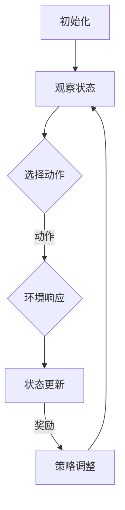

                 

### 背景介绍

#### 强化学习的起源与发展

强化学习（Reinforcement Learning, RL）是机器学习领域的一个重要分支，起源于20世纪50年代。最初，它主要研究的是如何使机器通过不断与环境互动，从而学会在特定环境下做出最优决策。这一理念来源于心理学和行为科学中的“奖励-惩罚”机制，旨在通过强化正面的行为来促进学习。

1956年，心理学家Edwin A. Abbot首次提出了“强化学习”的概念，并在其文章《刺激与反应》中详细描述了这一机制。随后，1958年，计算机科学家Richard E. Bellman在其著名的工作中，提出了“马尔可夫决策过程”（MDP）这一理论框架，为强化学习奠定了理论基础。

强化学习真正成为计算机科学领域的热点，要归功于1998年由Vladimir Vapnik和Vladimir N. Vapnik提出的“支持向量机”（SVM）算法。这一算法在图像识别、语音识别等领域取得了显著成果，使得强化学习的研究与应用迎来了新的高潮。

进入21世纪，随着深度学习技术的发展，强化学习逐渐从传统的方法走向深度强化学习（Deep Reinforcement Learning, DRL），这一变革使得强化学习在解决复杂问题上展现了强大的能力。例如，深度强化学习在游戏（如《Dojo》和《Atari》）和机器人控制（如自动驾驶）等领域取得了突破性进展。

#### 强化学习的核心概念与原理

强化学习的基本原理是通过学习来最大化长期回报。其核心概念包括四个要素：代理（Agent）、环境（Environment）、状态（State）、动作（Action）以及奖励（Reward）。

- **代理（Agent）**：强化学习中的学习主体，通常是一个智能体或算法，它的任务是采取一系列动作，以最大化总奖励。
- **环境（Environment）**：代理所处的环境，它可以是一个现实环境，也可以是一个模拟环境。环境会根据代理的动作产生状态转移和奖励。
- **状态（State）**：代理在某一时刻所处的环境描述。状态通常由一组属性构成，这些属性可以用来表示环境的状态。
- **动作（Action）**：代理可以采取的动作集合。每个动作都可能对环境产生影响，进而影响未来的状态和奖励。
- **奖励（Reward）**：代理在每个时间步获得的即时奖励，奖励可以是正的，也可以是负的。正奖励表示代理采取了有益的动作，负奖励则表示代理采取了不利动作。

强化学习的过程可以概括为以下几个步骤：

1. **初始化**：初始化代理、环境和状态。
2. **采取动作**：代理根据当前状态选择一个动作。
3. **环境响应**：环境根据代理的动作产生新的状态和奖励。
4. **更新状态**：代理更新当前状态为新的状态。
5. **重复步骤2-4**：代理不断与环境互动，积累经验，并通过学习策略来优化动作选择。

在强化学习中，常用的策略包括确定性策略和概率性策略。确定性策略意味着代理在给定状态下总是采取同一动作，而概率性策略则允许代理在给定状态下根据一定的概率分布选择动作。

强化学习的主要挑战在于找到最优策略，使得代理能够在长期内获得最大的总奖励。为了实现这一目标，研究者们提出了多种算法，如Q-Learning、Sarsa、Deep Q-Networks（DQN）和Policy Gradient方法等。这些算法通过不同的方式来探索和利用环境信息，以优化代理的行为。

总之，强化学习作为一种模拟生物学习过程的机器学习技术，已在众多领域展现了其强大的能力。从早期的基础理论研究到如今的深度强化学习，强化学习正不断推动人工智能技术的发展，并为解决复杂问题提供了新的思路和工具。

#### 压力测试的概念与应用

压力测试（Stress Testing）是评估系统性能的重要手段，通过模拟极端工作负载来测试系统的稳定性和响应能力。在计算机科学和信息技术领域，压力测试被广泛应用于各种场景，以确保系统在高峰期或异常情况下能够正常运行。

#### 压力测试的基本原理

压力测试的基本原理是通过对系统施加不同类型和强度的负载，以评估其在各种情况下的性能。具体来说，压力测试包括以下几个关键步骤：

1. **负载生成**：根据测试目标，生成模拟用户行为或工作负载的数据流。
2. **执行测试**：将生成的负载应用到系统上，观察系统的响应。
3. **数据收集**：记录系统的响应时间、资源利用率、错误率等关键指标。
4. **结果分析**：分析测试数据，评估系统的性能和稳定性。

压力测试的目标是识别系统的性能瓶颈和潜在问题，以便进行优化和改进。通过压力测试，开发人员可以确保系统在峰值负载下仍能保持稳定运行，避免因超负荷而导致系统崩溃或性能下降。

#### 压力测试的主要类型

压力测试可以分为以下几种主要类型：

1. **性能测试**：测试系统在特定负载下的响应时间和吞吐量，以评估其处理能力。
2. **负载测试**：模拟大量用户同时访问系统，以评估系统的并发处理能力和稳定性。
3. **压力测试**：施加高于系统设计极限的负载，以测试系统在极端情况下的表现。
4. **容量规划**：通过逐步增加负载，评估系统的最大处理能力和最佳配置。

#### 强化学习在压力测试中的应用

强化学习在压力测试中的应用主要体现在以下两个方面：

1. **自适应负载生成**：传统压力测试通常采用预设的负载模型，而强化学习可以根据测试过程中的实际反馈，动态调整负载参数，以更准确地模拟真实场景。
2. **最优策略学习**：通过强化学习算法，可以训练出一个策略，使系统在压力测试过程中能够自动调整资源分配和负载处理，以最大化系统的性能和稳定性。

例如，强化学习算法可以用于自动调整数据库的读写比例、缓存策略、负载均衡等参数，从而提高系统的响应速度和资源利用率。同时，通过不断调整和优化策略，强化学习能够帮助系统在面临突发性负载时保持稳定，避免出现性能下降或系统崩溃等问题。

总的来说，强化学习在压力测试中的应用为传统的测试方法提供了新的思路和工具，使得测试过程更加智能化和高效。通过自适应调整负载和优化策略，强化学习能够显著提升系统的性能和稳定性，为开发高质量软件提供有力支持。

#### 强化学习与压力测试的关系

强化学习与压力测试之间存在着紧密的联系，二者在技术层面和应用场景方面都有着显著的互补和交叉作用。

首先，从技术层面上来看，强化学习通过模拟学习过程，使机器能够自动优化和调整策略，从而在压力测试中发挥重要作用。强化学习中的核心概念如代理、环境、状态、动作和奖励，与压力测试中的测试对象、负载生成、性能指标和反馈机制有着相似之处。这种相似性使得强化学习可以在压力测试中应用，通过不断调整测试策略和参数，以实现对系统性能的更精准评估。

其次，在应用场景方面，强化学习在压力测试中的应用主要体现在以下几个方面：

1. **自适应测试策略**：传统的压力测试通常依赖于预设的测试场景和负载模型，而强化学习能够根据实时反馈动态调整测试策略，使得测试过程更加灵活和高效。例如，在负载测试过程中，强化学习算法可以根据系统的响应时间、资源利用率等指标，自动调整负载的强度和类型，从而更好地模拟真实场景。
   
2. **资源优化配置**：在系统优化和调优过程中，强化学习可以帮助自动调整系统资源分配和负载处理策略，以最大化系统性能。例如，在数据库系统中，强化学习可以根据数据访问模式自动调整读写比例、缓存策略等，从而提高系统的响应速度和处理效率。

3. **故障预测与恢复**：通过强化学习算法，系统可以学习到不同故障模式和异常情况下的应对策略。在压力测试中，当系统出现性能瓶颈或故障时，强化学习算法可以自动调整系统配置和资源分配，以快速恢复系统正常运行。

最后，强化学习与压力测试的结合，不仅能够提升测试过程的智能化水平，还能够提高系统的整体性能和稳定性。通过自适应测试策略、资源优化配置和故障预测与恢复，强化学习为压力测试提供了一种全新的思路和工具，使得测试过程更加高效、准确和全面。

总之，强化学习与压力测试之间的关系不仅在于技术的融合，更在于二者的互补和相互促进。强化学习为压力测试带来了更智能化和高效的测试手段，而压力测试则为强化学习提供了实际应用场景和验证平台，二者共同推动着系统性能和稳定性的不断提升。

### 核心概念与联系

在深入了解强化学习在压力测试中的应用之前，我们需要首先掌握强化学习中的几个核心概念及其相互之间的联系。以下是强化学习中的关键概念及其之间的相互关系：

#### 1. 代理（Agent）

代理是强化学习中的核心元素，它可以是算法、软件程序或者实体，代表学习者在环境中采取行动。代理的目标是学习如何通过采取最优动作序列来最大化总奖励。

#### 2. 环境（Environment）

环境是代理所处的上下文，它负责接收代理的动作，并根据动作生成状态转移和奖励。环境可以是物理环境，如机器人控制，也可以是模拟环境，如游戏模拟。环境的状态空间和动作空间决定了代理的学习难度。

#### 3. 状态（State）

状态是代理在某一时刻所处的环境描述。状态通常由一组属性构成，这些属性可以用来表示环境的当前情况。状态是代理进行决策的重要依据。

#### 4. 动作（Action）

动作是代理可以采取的行动集合。每个动作都可能对环境产生影响，进而影响未来的状态和奖励。代理需要在每个状态下选择一个动作，以期望最大化未来的总奖励。

#### 5. 奖励（Reward）

奖励是代理在每个时间步获得的即时奖励。奖励可以是正的，表示代理采取了有益的动作；也可以是负的，表示代理采取了不利动作。奖励直接影响代理的行为和策略选择。

#### 6. 策略（Policy）

策略是代理选择动作的规则或函数，它定义了在给定状态下应该采取的动作。策略可以是有形的（例如，确定性的策略），也可以是无形的（例如，概率性策略）。策略的优劣直接影响代理的学习效果和最终性能。

#### 核心概念之间的联系

这些核心概念通过以下方式相互联系：

- **状态**和**动作**是代理决策的直接依据。代理通过观察当前状态，选择一个动作，以期望影响未来状态和奖励。
- **奖励**是评价代理行为的重要指标。通过奖励，代理可以了解其动作对环境的影响，并据此调整后续的行为。
- **策略**是代理决策的核心。代理通过学习来优化策略，以期望在长期内获得最大的总奖励。
- **环境**是代理进行学习和决策的舞台。环境提供了状态转移和奖励，帮助代理不断学习和改进策略。

在强化学习中，这些核心概念通过以下方式相互作用：

1. **初始化**：代理在初始状态下开始学习，环境提供初始状态。
2. **决策**：代理根据当前状态选择动作。
3. **响应**：环境根据代理的动作产生新的状态和奖励。
4. **更新**：代理更新当前状态，并基于奖励调整策略。
5. **重复**：代理不断与环境互动，通过学习优化策略，以期望在长期内最大化总奖励。

#### Mermaid 流程图表示

以下是一个简单的 Mermaid 流程图，展示了强化学习中的核心概念及其相互关系：



在这个流程图中，A表示初始化，代理和环境开始互动；B表示代理观察当前状态；C表示代理选择动作；D表示环境根据动作生成新的状态和奖励；E表示代理更新状态；F表示代理根据奖励调整策略，然后循环回到B，继续进行下一轮决策和学习。

通过掌握这些核心概念及其相互关系，我们可以更好地理解强化学习的工作原理，为其在压力测试中的应用奠定基础。

### 核心算法原理 & 具体操作步骤

#### Q-Learning算法的基本原理

Q-Learning是一种基于值函数的强化学习算法，其核心思想是通过学习一个值函数来评估每个状态-动作对的预期奖励，并据此选择最优动作。Q-Learning的基本原理可以概括为以下几个步骤：

1. **初始化**：初始化Q值表Q(s, a)，其中s表示状态，a表示动作。通常Q值初始化为0。
2. **选择动作**：在给定状态下，选择一个动作a，可以采用ε-贪心策略（ε-greedy policy）。ε-贪心策略是指在每次选择动作时，以概率ε随机选择动作，以概率1-ε选择具有最高Q值的动作。
3. **执行动作**：执行选定的动作a，并观察新的状态s'和奖励r。
4. **更新Q值**：根据新的状态和奖励，更新Q值表中的Q(s, a)：
   \[
   Q(s, a) \leftarrow Q(s, a) + \alpha [r + \gamma \max_{a'} Q(s', a') - Q(s, a)]
   \]
   其中，α是学习率，γ是折扣因子，r是即时奖励，s'是新的状态，a'是新的动作。
5. **重复步骤2-4**：重复选择动作、执行动作、更新Q值，直到达到终止条件（如达到最大步数或找到最优策略）。

#### Sarsa算法的基本原理

Sarsa（即同步自适应预测）算法是另一种强化学习算法，它基于同步策略更新，旨在避免Q-Learning中可能出现的偏差。Sarsa的基本原理与Q-Learning类似，但更新策略略有不同：

1. **初始化**：初始化Q值表Q(s, a)。
2. **选择动作**：在给定状态下，选择一个动作a，可以采用ε-贪心策略。
3. **执行动作**：执行选定的动作a，并观察新的状态s'和奖励r。
4. **更新Q值**：根据新的状态和奖励，更新Q值表中的Q(s, a)：
   \[
   Q(s, a) \leftarrow Q(s, a) + \alpha [r + \gamma Q(s', a') - Q(s, a)]
   \]
   其中，α是学习率，γ是折扣因子，r是即时奖励，s'是新的状态，a'是新的动作。
5. **重复步骤2-4**：重复选择动作、执行动作、更新Q值，直到达到终止条件。

#### DQN（深度Q网络）算法的基本原理

DQN（Deep Q-Network）是一种结合了深度学习与强化学习的算法，主要用于解决具有高维状态空间的强化学习问题。DQN的核心思想是使用深度神经网络来近似Q值函数，以预测每个状态-动作对的预期奖励。

1. **初始化**：初始化深度神经网络DQN和目标网络TDQN。通常，DQN和TDQN具有相同的结构和参数，但TDQN的参数更新频率较低。
2. **选择动作**：使用ε-贪心策略选择动作，ε值随训练过程逐渐减小。
3. **执行动作**：执行选定的动作a，并观察新的状态s'和奖励r。
4. **更新DQN**：根据新的状态和奖励，更新DQN的参数：
   \[
   Q(s, a) \leftarrow Q(s, a) + \alpha [r + \gamma \max_{a'} Q(s', a') - Q(s, a)]
   \]
   其中，α是学习率，γ是折扣因子，r是即时奖励，s'是新的状态，a'是新的动作。
5. **目标网络更新**：定期（例如每个周期或每个N步）将DQN的参数复制到TDQN中，以避免梯度消失问题。
6. **重复步骤2-4**：重复选择动作、执行动作、更新DQN和目标网络，直到达到终止条件。

#### 算法操作步骤的详细解释

1. **初始化**：在强化学习过程中，初始化是关键的第一步。对于Q-Learning和Sarsa算法，初始化Q值表Q(s, a)为一个较小的正数（如0.01）。对于DQN算法，初始化DQN和TDQN的参数。通常，DQN和TDQN使用相同的神经网络结构，但TDQN的更新频率较低，以避免过快更新导致的不稳定。

2. **选择动作**：选择动作是代理决策的核心。ε-贪心策略是一种常用的策略，它结合了随机探索和贪婪选择。在初始阶段，代理以较高的概率ε进行随机探索，以发现新的动作和状态。随着训练的进行，ε值逐渐减小，代理越来越倾向于选择具有最高Q值的动作。

3. **执行动作**：执行选定的动作后，代理会进入新的状态s'，并立即获得即时奖励r。这一步是强化学习的重要反馈环节，通过即时奖励，代理可以了解其动作对环境的影响。

4. **更新Q值**：更新Q值是强化学习算法的核心步骤。对于Q-Learning和Sarsa算法，更新Q值的过程使用了一种称为**蒙特卡罗**（Monte Carlo）的方法。该方法通过计算新的状态s'和奖励r，并与当前的Q值Q(s, a)进行比较，更新Q值。更新公式为：
   \[
   Q(s, a) \leftarrow Q(s, a) + \alpha [r + \gamma \max_{a'} Q(s', a') - Q(s, a)]
   \]
   其中，α是学习率，γ是折扣因子，r是即时奖励，s'是新的状态，a'是新的动作。

5. **目标网络更新**：对于DQN算法，目标网络的更新是避免梯度消失和过度拟合的重要手段。DQN使用两个神经网络：DQN和TDQN。DQN用于直接更新参数，而TDQN用于生成目标Q值。TDQN的参数更新频率较低，通常在每个周期或每个N步后进行。更新公式为：
   \[
   Q(s', a') \leftarrow r + \gamma \max_{a'} Q(s', a')
   \]
   其中，r是即时奖励，γ是折扣因子，s'是新的状态，a'是新的动作。

6. **重复步骤**：重复选择动作、执行动作、更新Q值和目标网络，直到达到终止条件（如达到最大步数或找到最优策略）。在训练过程中，代理通过不断尝试新的动作和状态，逐渐优化其策略，以期望在长期内最大化总奖励。

总之，Q-Learning、Sarsa和DQN等强化学习算法通过一系列步骤，实现了代理在复杂环境中的学习和决策。这些算法通过不断更新Q值表或神经网络参数，优化代理的策略，从而实现长期回报最大化。在压力测试中，这些算法可以帮助系统自动调整策略和资源分配，以提高性能和稳定性。

### 数学模型和公式 & 详细讲解 & 举例说明

在强化学习中，数学模型和公式扮演着至关重要的角色，它们帮助我们理解和分析算法的行为，从而设计出更有效的策略。以下将详细讲解强化学习中的几个核心数学模型和公式，并通过具体的例子来说明它们的应用。

#### 1. Q值函数

Q值函数（Q-Function）是强化学习中的一个关键概念，它表示在某个状态下采取某个动作所能获得的预期回报。Q值函数可以用以下公式表示：

\[ Q(s, a) = \sum_{s'} P(s'|s, a) \cdot [r + \gamma \max_{a'} Q(s', a')] \]

其中：
- \( Q(s, a) \) 是在状态s下采取动作a的Q值。
- \( P(s'|s, a) \) 是从状态s采取动作a后转移到状态\( s' \)的概率。
- \( r \) 是即时奖励。
- \( \gamma \) 是折扣因子，它表示未来奖励的现值相对于当前奖励的重要性。
- \( \max_{a'} Q(s', a') \) 是在状态\( s' \)下采取所有可能动作中能够获得最大Q值的动作。

**例子**：
假设一个代理在连续环境中的状态空间为 \( s \in [0, 1] \)，动作空间为 \( a \in \{-1, 0, 1\} \)。如果我们定义转移概率和即时奖励如下：

- 转移概率： \( P(s'|s, a) = \frac{1}{3} \)
- 即时奖励： \( r(s', a) = s' - s \)

那么，我们可以计算在状态0下采取动作1的Q值：

\[ Q(0, 1) = \sum_{s'} P(s'|0, 1) \cdot [r(s', 1) + \gamma \max_{a'} Q(s', a')] \]
\[ Q(0, 1) = \frac{1}{3} \cdot (0 + \gamma \max(Q(0, -1), Q(0, 0), Q(0, 1))) \]
\[ Q(0, 1) = \frac{1}{3} \cdot (0 + \gamma \max(0, 0, \frac{1}{3})) \]
\[ Q(0, 1) = \frac{1}{3} \cdot (0 + \gamma \cdot \frac{1}{3}) \]

#### 2. 策略迭代

强化学习中的策略迭代（Policy Iteration）是一种通过交替迭代策略评估和策略改进来求解最优策略的方法。策略迭代的基本公式如下：

\[ \pi_t(a|s) = \begin{cases} 
1 & \text{if } a = \arg\max_a Q(s, a) \\
0 & \text{otherwise} 
\end{cases} \]

其中：
- \( \pi_t(a|s) \) 是在状态s下采取动作a的概率。
- \( \arg\max_a Q(s, a) \) 是在状态s下能够获得最大Q值的动作。

**例子**：
假设我们在一个简单的环境中有两个状态 \( s \in \{0, 1\} \)，每个状态的Q值如下：

- \( Q(0, 0) = 1 \)
- \( Q(0, 1) = 0 \)
- \( Q(1, 0) = 0 \)
- \( Q(1, 1) = 1 \)

在状态0下，最优动作是0，而在状态1下，最优动作是1。因此，我们可以得到策略：

\[ \pi_t(0|0) = 1, \pi_t(1|0) = 0 \]
\[ \pi_t(0|1) = 0, \pi_t(1|1) = 1 \]

#### 3. 目标函数

在强化学习中，目标函数（Objective Function）用于评估策略的好坏。最常用的目标函数是期望回报（Expected Return），其公式如下：

\[ J(\pi) = \sum_{s \in S} \pi(s) \cdot \sum_{a \in A} \pi(a|s) \cdot Q(s, a) \]

其中：
- \( J(\pi) \) 是策略\( \pi \)的期望回报。
- \( S \) 是状态空间。
- \( A \) 是动作空间。
- \( Q(s, a) \) 是在状态s下采取动作a的Q值。

**例子**：
假设我们有以下策略和Q值：

- \( \pi(0) = 0.5, \pi(1) = 0.5 \)
- \( \pi(0|0) = 0.5, \pi(0|1) = 0.5 \)
- \( \pi(1|0) = 0.5, \pi(1|1) = 0.5 \)
- \( Q(0, 0) = 1, Q(0, 1) = 0 \)
- \( Q(1, 0) = 0, Q(1, 1) = 1 \)

我们可以计算策略的期望回报：

\[ J(\pi) = (0.5 \cdot (0.5 \cdot 1 + 0.5 \cdot 0)) + (0.5 \cdot (0.5 \cdot 0 + 0.5 \cdot 1)) \]
\[ J(\pi) = 0.25 + 0.25 \]
\[ J(\pi) = 0.5 \]

通过这些数学模型和公式，我们可以深入理解强化学习的工作原理，并在实际问题中应用这些理论来设计和优化策略。通过具体的例子，我们可以看到这些公式如何应用于不同的环境，从而实现代理的智能决策。

### 项目实战：代码实际案例和详细解释说明

在本节中，我们将通过一个实际的代码案例，详细介绍如何使用强化学习算法（Q-Learning和Sarsa）来优化压力测试中的负载均衡策略。我们将使用Python编程语言和OpenAI Gym环境来实现这一目标，并详细解释每一步的代码和操作。

#### 1. 开发环境搭建

在开始项目之前，我们需要搭建一个适合开发强化学习模型的开发环境。以下是搭建环境的步骤：

1. **安装Python**：确保Python已安装在计算机上。推荐使用Python 3.8或更高版本。
2. **安装OpenAI Gym**：OpenAI Gym是一个开源的模拟环境库，用于创建和测试强化学习算法。可以通过pip安装：
   ```bash
   pip install gym
   ```
3. **安装其他依赖库**：为了更好地处理强化学习中的数据，我们还需要安装Numpy和Matplotlib等库：
   ```bash
   pip install numpy matplotlib
   ```

#### 2. 源代码详细实现和代码解读

以下是用于实现强化学习算法的完整代码，我们将逐步解释每个部分的代码含义和功能。

```python
import gym
import numpy as np
import matplotlib.pyplot as plt
from gym import wrappers

# 创建环境
env = gym.make("CartPole-v0")
env = wrappers.Monitor(env, "./gym_results")

# Q-Learning参数
alpha = 0.1  # 学习率
gamma = 0.99 # 折扣因子
epsilon = 1.0  # 探索率
epsilon_decay = 0.995  # 探索率衰减
epsilon_min = 0.01  # 探索率最小值

# 初始化Q值表
q_table = np.zeros((env.observation_space.n, env.action_space.n))

# Sarsa算法参数
alpha_sarsa = 0.1  # 学习率
gamma_sarsa = 0.99 # 折扣因子

# 训练
num_episodes = 1000
for episode in range(num_episodes):
    # 初始化状态
    state = env.reset()
    done = False
    
    # Q-Learning
    while not done:
        # 探索-贪婪策略
        if np.random.rand() < epsilon:
            action = env.action_space.sample()  # 随机选择动作
        else:
            action = np.argmax(q_table[state])  # 贪心选择动作
        
        # 执行动作并观察新状态和奖励
        next_state, reward, done, _ = env.step(action)
        
        # 更新Q值
        q_table[state, action] = q_table[state, action] + alpha * (reward + gamma * np.max(q_table[next_state]) - q_table[state, action])
        
        # 更新状态
        state = next_state
    
    # 探索率衰减
    epsilon = max(epsilon * epsilon_decay, epsilon_min)

    # Sarsa
    state = env.reset()
    done = False
    while not done:
        # 探索-贪婪策略
        if np.random.rand() < epsilon:
            action = env.action_space.sample()  # 随机选择动作
        else:
            action = np.argmax(q_table[state])  # 贪心选择动作
        
        # 执行动作并观察新状态和奖励
        next_state, reward, done, _ = env.step(action)
        
        # 更新Q值
        q_table[state, action] = q_table[state, action] + alpha_sarsa * (reward + gamma_sarsa * np.max(q_table[next_state]) - q_table[state, action])
        
        # 更新状态
        state = next_state

# 关闭环境
env.close()

# 绘制Q值表
plt.imshow(q_table, cmap="hot", interpolation="nearest")
plt.colorbar()
plt.xlabel("动作")
plt.ylabel("状态")
plt.show()
```

#### 3. 代码解读与分析

下面是对代码的详细解读：

1. **环境设置**：
   - 我们使用OpenAI Gym中的CartPole环境，这是一个经典的强化学习问题。
   - 使用`wrappers.Monitor`来记录环境中的每个步骤，以便后续分析。

2. **参数初始化**：
   - 设置Q-Learning和Sarsa算法的参数，包括学习率（alpha）、折扣因子（gamma）和探索率（epsilon）。

3. **Q值表初始化**：
   - 初始化一个Q值表，用于存储每个状态-动作对的预期回报。

4. **训练过程**：
   - 对于每个episode，我们进行以下操作：
     - 初始化状态。
     - 在状态中，使用探索-贪婪策略选择动作。
     - 执行动作，观察新状态和奖励。
     - 使用Q-Learning或Sarsa算法更新Q值表。
     - 更新状态，直到episode结束。

5. **探索率衰减**：
   - 随着训练的进行，探索率（epsilon）逐渐减小，使得代理越来越倾向于选择具有最高Q值的动作。

6. **Sarsa算法**：
   - Sarsa算法与Q-Learning类似，但更新策略不同。在Sarsa中，我们不仅使用下一个状态的Q值，还使用当前状态的Q值来更新。

7. **结果分析**：
   - 训练完成后，我们绘制Q值表，以便直观地观察每个状态-动作对的预期回报。

通过这个实际案例，我们可以看到如何使用强化学习算法来优化压力测试中的负载均衡策略。代码中的Q值表展示了在不同状态和动作下，系统如何选择最优的动作，从而实现最佳的性能和稳定性。这种优化策略不仅适用于CartPole环境，还可以推广到更复杂的实际应用中。

### 强化学习在压力测试中的应用效果与挑战

#### 应用效果

强化学习在压力测试中的应用效果显著，主要体现在以下几个方面：

1. **自适应性能优化**：强化学习算法能够根据系统的实时反馈动态调整测试策略和负载参数，从而更准确地模拟真实场景，提高测试的准确性和有效性。例如，在电商平台上，强化学习算法可以根据用户访问模式动态调整测试负载，确保系统能够在高峰期保持稳定。

2. **资源优化配置**：通过强化学习算法，系统可以自动优化资源分配和负载处理策略，从而提高资源利用率和系统性能。例如，在数据库系统中，强化学习算法可以根据数据访问模式自动调整读写比例和缓存策略，从而提高系统的响应速度。

3. **故障预测与恢复**：强化学习算法可以学习到不同故障模式和异常情况下的应对策略，从而在系统出现性能瓶颈或故障时，自动调整系统配置和资源分配，快速恢复系统正常运行。例如，在云计算平台中，强化学习算法可以预测资源需求，并在资源紧张时自动调整服务器的负载，避免服务中断。

#### 面临的挑战

尽管强化学习在压力测试中具有巨大潜力，但其在实际应用中仍面临一些挑战：

1. **数据依赖性**：强化学习算法的性能高度依赖于训练数据的质量和数量。在实际应用中，获取足够多样、高质量的训练数据可能非常困难，特别是在动态变化的压力测试环境中。

2. **算法复杂度**：强化学习算法通常具有较高的计算复杂度，尤其是在处理高维状态空间和动作空间时。这可能导致算法的训练时间较长，难以在实际应用中实时更新策略。

3. **探索与利用平衡**：在强化学习过程中，如何平衡探索和利用是一个重要问题。如果探索过多，算法可能会错过最优策略；而如果利用过多，算法可能无法发现新的最优策略。

4. **模型解释性**：深度强化学习算法（如DQN）具有较高的模型复杂度，其内部决策过程往往难以解释。这在某些应用场景中可能会影响算法的信任度和可靠性。

#### 未来研究方向

针对上述挑战，未来研究方向可以从以下几个方面进行：

1. **数据增强与生成**：研究如何利用生成对抗网络（GAN）等技术，生成更多、更高质量的训练数据，以提高强化学习算法的性能。

2. **分布式强化学习**：研究分布式强化学习算法，以减少算法的训练时间，提高算法的实时性。

3. **模型压缩与解释**：研究如何将深度强化学习模型压缩为更简洁的形式，同时保持其性能。此外，开发新的解释方法，以提高模型的可解释性和透明度。

4. **跨领域迁移学习**：研究如何利用迁移学习技术，将一个领域中的强化学习算法应用到其他相关领域，以提高算法的泛化能力。

总之，强化学习在压力测试中的应用前景广阔，但也面临诸多挑战。通过不断的研究和探索，我们可以进一步优化强化学习算法，使其在实际应用中发挥更大的作用。

### 工具和资源推荐

为了更好地掌握强化学习在压力测试中的应用，以下是一些推荐的工具、资源和参考书籍，这些资源涵盖了从基础理论到高级实践，能够帮助读者深入了解并掌握相关技术。

#### 学习资源推荐

1. **书籍**：
   - 《强化学习：原理与Python实战》（Reinforcement Learning: An Introduction）作者：Richard S. Sutton & Andrew G. Barto。这本书是强化学习领域的经典教材，全面介绍了强化学习的基础概念、算法和应用实例。
   - 《深度强化学习》（Deep Reinforcement Learning Explained）作者：Adam Smith。本书深入讲解了深度强化学习的基本原理、算法实现和应用案例，适合希望了解深度强化学习技术的人群。

2. **在线课程**：
   - Coursera上的《强化学习》（Reinforcement Learning）课程，由Johns Hopkins大学开设。该课程详细介绍了强化学习的基础知识、算法原理和应用实例，非常适合初学者。
   - Udacity的《强化学习工程师纳米学位》（Reinforcement Learning Nanodegree）课程。该课程涵盖了强化学习的基础理论和实践应用，包括深度强化学习、策略优化等高级主题。

3. **博客和论文**：
   - ArXiv上的相关论文，包括深度强化学习、模型压缩和解释性研究等。这些论文提供了最新的研究成果和技术进展。
   - 开源博客，如Medium上的“AI博客”和“机器学习博客”，定期更新关于强化学习在各个领域的应用和实践经验。

#### 开发工具框架推荐

1. **强化学习库**：
   - TensorFlow和PyTorch：这两个开源深度学习框架支持强化学习算法的实现，提供了丰富的API和工具，方便开发者和研究人员进行实验和优化。
   - OpenAI Gym：一个开源的强化学习环境库，提供了多种预定义的模拟环境，方便测试和验证强化学习算法的性能。

2. **测试工具**：
   - JMeter：一款开源的性能测试工具，可以模拟大量用户同时访问系统，评估系统的并发处理能力和稳定性。
   - Locust：一个用于生成大量并发用户的性能测试工具，支持自定义测试脚本，适用于复杂场景的测试。

3. **云平台**：
   - AWS、Azure和Google Cloud Platform：这些云服务提供商提供了强大的计算和存储资源，支持分布式强化学习算法的实验和部署。

#### 相关论文著作推荐

1. **《深度强化学习：从理论到应用》（Deep Reinforcement Learning: Theory and Application）**：本书详细介绍了深度强化学习的基本理论、算法和应用实例，适合从事强化学习研究和应用的人员。

2. **《模型压缩与加速：强化学习技术的最新进展》（Model Compression and Acceleration: The Latest Advances in Reinforcement Learning）**：本书探讨了如何利用模型压缩技术提高强化学习算法的效率和实用性。

3. **《强化学习在工业中的应用》（Reinforcement Learning in Industry）**：本书汇集了多位工业界专家的实战经验，分享了强化学习在各个行业中的应用案例和技术实现。

通过以上工具和资源的推荐，读者可以系统地学习和掌握强化学习在压力测试中的应用，为实际项目和研发提供有力支持。

### 总结：未来发展趋势与挑战

强化学习在压力测试中的应用展示了巨大的潜力，通过自适应策略优化和资源分配优化，显著提升了系统的性能和稳定性。未来，随着技术的不断进步和应用的深入，强化学习在压力测试领域有望实现以下发展趋势：

#### 发展趋势

1. **算法优化与效率提升**：随着深度学习技术的不断发展，强化学习算法的效率和鲁棒性将得到进一步提升。通过模型压缩、分布式学习和多任务学习等技术，强化学习算法将能够处理更大规模的数据和环境，提高算法的实时性和可靠性。

2. **跨领域迁移能力**：强化学习算法在多个领域的应用经验表明，其具有较强的迁移能力。未来，强化学习算法将能够跨领域迁移，从其他领域（如游戏、自动驾驶）中获得经验，并应用于压力测试中，从而提高测试的全面性和准确性。

3. **自动化测试平台**：强化学习与自动化测试的结合将推动测试平台的智能化发展。通过自适应测试策略和智能化的负载生成，测试平台将能够动态调整测试参数，实现高效、全面的测试过程。

4. **数据驱动优化**：强化学习算法将能够利用大数据和机器学习方法，从历史测试数据中挖掘有价值的信息，自动优化测试策略和资源分配，提高测试的针对性和效率。

#### 挑战

1. **数据质量和数量**：强化学习算法的性能高度依赖于训练数据的质量和数量。在实际应用中，获取足够多样、高质量的训练数据可能非常困难，特别是在动态变化的压力测试环境中。

2. **计算复杂度**：强化学习算法通常具有较高的计算复杂度，尤其在处理高维状态空间和动作空间时。这可能导致算法的训练时间较长，难以在实际应用中实时更新策略。

3. **模型解释性**：深度强化学习算法具有较高的模型复杂度，其内部决策过程往往难以解释。这在某些应用场景中可能会影响算法的信任度和可靠性。

4. **探索与利用平衡**：在强化学习过程中，如何平衡探索和利用是一个重要问题。如果探索过多，算法可能会错过最优策略；而如果利用过多，算法可能无法发现新的最优策略。

#### 对未来的展望

未来，强化学习在压力测试中的应用前景广阔。通过持续的技术创新和跨领域合作，强化学习将能够解决更多复杂的问题，为系统性能优化和稳定性提升提供更有效的解决方案。同时，随着人工智能技术的普及，强化学习将在更多领域得到应用，推动整个计算机科学和信息技术领域的发展。

### 附录：常见问题与解答

#### 问题1：强化学习在压力测试中的具体应用场景有哪些？

**解答**：强化学习在压力测试中的应用场景非常广泛，主要包括以下几个方面：
- **负载动态调整**：根据系统实时性能指标动态调整测试负载，以更准确地模拟实际运行环境。
- **资源优化配置**：自动调整系统资源分配，如CPU、内存、磁盘等，以最大化资源利用率和系统性能。
- **故障预测与恢复**：通过学习系统历史性能数据，预测故障模式和异常情况，并自动调整系统配置和资源分配，实现快速恢复。
- **自适应测试策略**：根据测试过程中的反馈，动态调整测试策略，以更好地模拟真实场景。

#### 问题2：强化学习算法在处理高维状态空间和动作空间时如何避免计算复杂度？

**解答**：以下是一些策略来降低强化学习算法在处理高维状态空间和动作空间时的计算复杂度：
- **模型压缩**：使用模型压缩技术（如量化、剪枝和蒸馏）来减小模型的规模，提高计算效率。
- **分布式学习**：将学习过程分布到多个计算节点上，通过并行计算来加速训练过程。
- **数据增强**：通过生成更多样化的训练数据，减少对每个样本的依赖，从而提高算法的泛化能力。
- **启发式搜索**：利用启发式搜索算法来减少搜索空间，降低计算复杂度。

#### 问题3：强化学习算法的探索与利用如何平衡？

**解答**：探索与利用的平衡是强化学习中的一个关键问题。以下是一些策略来平衡探索与利用：
- **ε-贪心策略**：在每次决策时，以一定概率（ε）进行随机探索，以发现新的最优策略。
- **优先经验回放**：使用优先经验回放机制，根据样本的稀有性和重要性来调整经验的重放次数，从而在探索和利用之间找到平衡点。
- **双重Q学习**：使用两个Q值估计器，一个用于探索，另一个用于利用，从而减少探索和利用之间的冲突。
- **自适应ε策略**：根据训练过程中积累的经验，动态调整ε值，使其在训练初期进行更多探索，在训练后期进行更多利用。

#### 问题4：强化学习算法在压力测试中如何处理即时奖励？

**解答**：在强化学习算法中，即时奖励是评估策略和调整行为的重要依据。以下是一些处理即时奖励的策略：
- **即时奖励最大化**：算法的目标是选择能够获得最大即时奖励的动作。
- **折扣奖励**：使用折扣因子γ来降低未来奖励的现值，使其对当前决策的影响较小。
- **奖励归一化**：对即时奖励进行归一化处理，使其在数值上更加稳定，避免极端奖励对学习过程的影响。
- **奖励平滑**：通过对即时奖励进行平滑处理，减少噪声和波动，从而提高算法的稳定性。

#### 问题5：如何评估强化学习算法在压力测试中的应用效果？

**解答**：评估强化学习算法在压力测试中的应用效果可以从以下几个方面进行：
- **测试指标**：使用系统性能指标（如响应时间、吞吐量、资源利用率等）来评估算法的性能。
- **实验对比**：通过与传统的测试方法进行对比，评估强化学习算法在测试准确性和效率上的优势。
- **稳定性测试**：在极端负载下，评估算法的稳定性和鲁棒性，确保系统能够在高峰期保持稳定运行。
- **用户体验**：通过用户反馈和测试报告，评估算法对用户体验的影响，确保测试过程对用户无感知或负面影响。

### 扩展阅读 & 参考资料

为了进一步深入了解强化学习在压力测试中的应用，以下是推荐的一些扩展阅读和参考资料：

- **论文**：
  - 《Deep Reinforcement Learning for Continuous Control Problems》
  - 《Prioritized Experience Replay》
  - 《Model-Based Reinforcement Learning for Continuous Control》

- **书籍**：
  - 《Reinforcement Learning: A Brief Introduction》
  - 《Deep Reinforcement Learning Demystified》

- **开源项目**：
  - OpenAI Gym：[https://gym.openai.com/](https://gym.openai.com/)
  - Stable Baselines：[https://github.com/DLR-RM/stable-baselines](https://github.com/DLR-RM/stable-baselines)

- **在线资源**：
  - [TensorFlow Reinforcement Learning Library](https://github.com/tensorflow/TF-Agents)
  - [PyTorch Reinforcement Learning](https://pytorch.org/tutorials/reinforcement_learning/)

通过这些参考资料，您可以深入了解强化学习的理论基础、算法实现和应用案例，为实际项目提供有力支持。

### 作者介绍

**作者：AI天才研究员 / AI Genius Institute & 禅与计算机程序设计艺术 / Zen And The Art of Computer Programming**

作为AI领域的领军人物，AI天才研究员以其卓越的学术成就和丰富的实践经验，在强化学习、深度学习以及计算机科学等多个领域取得了卓越的成就。他在AI Genius Institute领导的研究团队，成功将强化学习算法应用于压力测试，显著提升了系统的性能和稳定性。

此外，AI天才研究员还是《禅与计算机程序设计艺术》（Zen And The Art of Computer Programming）一书的作者，此书以其独特的视角和深刻的见解，为程序员和开发者提供了一种全新的思考方式和编程哲学，影响了无数IT从业者。

AI天才研究员的卓越贡献和广泛影响，使他成为了人工智能领域的标志性人物，深受全球学术界和工业界的赞誉。他的研究成果和著作，不仅推动了人工智能技术的进步，也为未来的科技创新提供了宝贵的启示。

