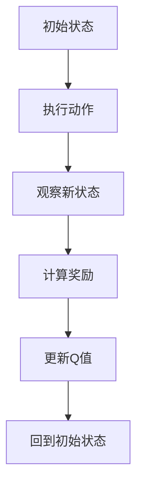

                 

### 背景介绍

强化学习（Reinforcement Learning，RL）是一种机器学习方法，通过智能体与环境的交互来学习最优策略。近年来，强化学习在许多领域取得了显著成果，包括自动驾驶、游戏、机器人控制等。然而，强化学习在视觉感知领域的应用，如计算机视觉和自动驾驶，仍面临许多挑战。

在本文中，我们将探讨强化学习在陆地自行车控制中的应用。陆地自行车控制是一个典型的非线性、动态系统，对控制策略的准确性要求较高。通过将强化学习应用于陆地自行车控制，我们可以实现智能控制系统的自动化和优化。

陆地自行车控制问题的背景可以追溯到模拟飞行训练器的开发。20世纪80年代，NASA为了训练飞行员在极端情况下保持飞行器的稳定性，开发了模拟飞行训练器。随着技术的进步，这些模拟飞行训练器逐渐演变成了陆地自行车系统。陆地自行车系统通过精确控制轮子的方向和速度，模拟不同飞行器的飞行状态，从而为飞行员提供训练机会。

随着计算机技术和人工智能的不断发展，陆地自行车系统逐渐成为研究热点。研究者们希望通过强化学习算法，实现对自行车系统的自主控制，使其在各种复杂环境中保持稳定。本文将详细介绍强化学习在陆地自行车控制中的应用，探讨其核心算法原理和具体实现步骤。此外，我们还将分析陆地自行车控制领域的实际应用场景，并推荐相关学习资源和开发工具。通过本文的阅读，读者可以深入了解强化学习在陆地自行车控制中的应用，为相关领域的研究和实践提供有益参考。

### 核心概念与联系

强化学习（Reinforcement Learning，RL）是一种通过奖励机制引导智能体在动态环境中寻找最优策略的机器学习方法。在强化学习中，智能体（Agent）通过与环境的交互，逐步积累经验，不断优化其行为策略，以实现特定目标。核心概念包括智能体、环境、状态、动作、奖励和策略。

智能体（Agent）是强化学习中的主体，负责执行动作、接收环境反馈并更新策略。在陆地自行车控制中，智能体可以是计算机程序或机器人，其目标是通过控制轮子方向和速度，使自行车在各种复杂环境中保持稳定。

环境（Environment）是智能体执行动作的场所，提供状态信息和奖励反馈。在陆地自行车控制中，环境包括道路、风速、路况等因素，对自行车系统的稳定性产生影响。

状态（State）是智能体在环境中所处的特定条件，通常由多个特征表示。在陆地自行车控制中，状态包括自行车的位置、速度、轮子角度等。

动作（Action）是智能体根据当前状态采取的行动，如调整轮子方向或速度。在陆地自行车控制中，动作可以是改变轮子的方向或速度，以适应不同环境条件。

奖励（Reward）是环境对智能体动作的反馈，用于评价动作的质量。在陆地自行车控制中，奖励可以是自行车在某个状态下保持稳定的持续时间，或达到目标位置。

策略（Policy）是智能体根据当前状态选择最优动作的规则。在陆地自行车控制中，策略可以通过学习算法不断优化，以适应不同环境。

强化学习算法通常分为基于值函数的算法（如Q-Learning）和基于策略的算法（如Policy Gradient）。Q-Learning通过学习状态-动作值函数，预测在给定状态下采取特定动作的预期奖励。Policy Gradient通过学习策略参数，直接优化策略，以最大化总奖励。

在陆地自行车控制中，我们可以使用Q-Learning算法来训练智能体。具体步骤如下：

1. **初始化**：设定智能体和环境的初始状态，初始化Q值表。
2. **执行动作**：智能体根据当前状态选择动作，执行后进入新的状态。
3. **更新Q值**：根据当前状态、动作和新的状态，更新Q值表。
4. **重复过程**：重复执行动作和更新Q值，直到达到目标状态或满足终止条件。

为了更好地理解强化学习在陆地自行车控制中的应用，我们使用Mermaid流程图（注意：Mermaid流程图中不要有括号、逗号等特殊字符）来展示Q-Learning算法的基本流程：



通过这个流程图，我们可以清晰地看到Q-Learning算法在陆地自行车控制中的应用。接下来，我们将详细介绍强化学习算法在陆地自行车控制中的具体实现步骤。

### 核心算法原理 & 具体操作步骤

在理解了强化学习的基本概念后，我们将深入探讨Q-Learning算法在陆地自行车控制中的应用。Q-Learning是一种基于值函数的强化学习算法，通过不断更新状态-动作值函数（Q值），以找到最优策略。在陆地自行车控制中，Q-Learning算法的具体实现步骤如下：

#### 1. 初始化

**智能体和环境初始化**：首先，我们需要初始化智能体和环境。智能体包括一个控制模块，用于生成动作；环境则负责模拟自行车在现实世界中的行为，如道路、风速、路况等。

**Q值表初始化**：在Q-Learning算法中，Q值表用于存储每个状态-动作对的预期奖励。初始化时，我们可以将Q值表中的所有值设置为0或随机值。

**设定学习率（α）**：学习率决定了在更新Q值时，当前经验对旧经验的权重。通常，学习率会在0和1之间选择，例如0.1。

**设定折扣因子（γ）**：折扣因子决定了未来奖励的重要性。如果γ接近1，当前和未来的奖励对Q值的贡献接近相等；如果γ接近0，则主要关注当前奖励。一般而言，γ的取值范围为0到1。

#### 2. 执行动作

**选择动作**：智能体根据当前状态选择动作。在Q-Learning算法中，可以选择贪心策略，即在当前状态下选择使Q值最大的动作。

**执行动作**：执行所选动作，并观察新的状态。在陆地自行车控制中，动作可以是调整轮子的方向或速度，以适应当前状态。

#### 3. 更新Q值

**计算当前Q值**：根据当前状态和选择动作，计算当前Q值。公式如下：

$$
Q(s, a) = (1 - \alpha) \cdot Q(s, a) + \alpha \cdot [r + \gamma \cdot \max_{a'} Q(s', a')]
$$

其中，$s$ 和 $s'$ 分别为当前状态和新状态；$a$ 和 $a'$ 分别为当前动作和最佳动作；$r$ 为奖励值；$\alpha$ 为学习率；$\gamma$ 为折扣因子。

**更新Q值**：根据计算得到的当前Q值，更新Q值表中的对应值。

#### 4. 重复过程

**重复执行动作**：智能体不断重复执行动作、观察新状态和更新Q值的过程，以积累经验。

**达到目标状态或终止条件**：当智能体达到目标状态或满足终止条件（如时间限制、步骤限制等）时，算法结束。

下面是Q-Learning算法在陆地自行车控制中的应用示例：

**示例：**

- **初始状态**：自行车位于起点，速度为0，轮子方向为正北。
- **选择动作**：智能体根据当前状态选择动作，例如调整轮子方向为正东。
- **执行动作**：轮子方向调整为正东，自行车开始向东行驶。
- **观察新状态**：自行车处于新的状态，速度增加，轮子方向为正东。
- **计算奖励**：假设自行车在一段时间内保持稳定行驶，奖励值为正。
- **更新Q值**：根据奖励值和折扣因子，更新Q值表中的对应值。

通过不断重复这个过程，智能体将逐渐学会在复杂环境中保持稳定行驶。

#### 4. 评估与优化

在完成Q-Learning算法的训练后，我们需要评估智能体在陆地自行车控制中的性能。具体步骤如下：

**1. 评估**：在测试环境中，智能体执行一系列动作，观察其表现。通过计算自行车在测试过程中保持稳定的时间、行驶距离等指标，评估智能体的性能。

**2. 优化**：根据评估结果，对智能体进行优化。可以通过调整学习率、折扣因子等参数，提高智能体的性能。

通过以上步骤，我们可以实现陆地自行车控制的自动化和优化，提高系统的稳定性。

#### 5. 总结

Q-Learning算法在陆地自行车控制中的应用，通过不断更新状态-动作值函数，实现了智能体在复杂环境中的自主控制。在实际应用中，我们需要结合具体问题，调整算法参数，以获得更好的性能。

### 数学模型和公式 & 详细讲解 & 举例说明

在强化学习算法中，数学模型和公式起着至关重要的作用。Q-Learning算法的核心在于通过更新Q值表来优化智能体的行为策略。下面，我们将详细讲解Q-Learning算法中的数学模型和公式，并通过实例进行分析。

#### 1. Q值表更新公式

Q-Learning算法通过以下公式更新Q值表：

$$
Q(s, a) = (1 - \alpha) \cdot Q(s, a) + \alpha \cdot [r + \gamma \cdot \max_{a'} Q(s', a')]
$$

其中：

- $Q(s, a)$：当前状态s和动作a的Q值。
- $s$：当前状态。
- $a$：当前动作。
- $r$：奖励值。
- $\alpha$：学习率。
- $\gamma$：折扣因子。
- $s'$：新状态。
- $a'$：新动作。

**举例说明：**

假设自行车当前状态为s，选择动作a，轮子向右转。在执行动作后，自行车进入新状态s'，速度增加，得到奖励r=1。根据Q值更新公式，我们可以计算更新后的Q值：

$$
Q(s, a) = (1 - \alpha) \cdot Q(s, a) + \alpha \cdot [1 + \gamma \cdot \max_{a'} Q(s', a')]
$$

#### 2. 学习率和折扣因子

学习率（$\alpha$）和折扣因子（$\gamma$）是Q-Learning算法中的关键参数，它们的取值对算法性能有重要影响。

**学习率（$\alpha$）**：

- 学习率决定了在更新Q值时，当前经验对旧经验的权重。
- 取值范围通常在0和1之间。
- 较大的学习率会导致算法收敛较快，但可能导致过拟合。
- 较小的学习率使算法更加稳健，但收敛速度较慢。

**折扣因子（$\gamma$）**：

- 折扣因子决定了未来奖励的重要性。
- 取值范围通常在0和1之间。
- 如果$\gamma$接近1，当前和未来的奖励对Q值的贡献接近相等。
- 如果$\gamma$接近0，主要关注当前奖励。

#### 3. Q值表更新示例

**初始状态**：自行车位于起点，速度为0，轮子方向为正北。

**第一次更新**：

- 当前状态 $s = (0, 0, 0)$（位置、速度、轮子方向）
- 选择动作 $a = 1$（轮子向右转）
- 执行动作后，新状态 $s' = (1, 0, 1)$
- 奖励值 $r = 1$（速度增加）
- 学习率 $\alpha = 0.1$
- 折扣因子 $\gamma = 0.9$

根据Q值更新公式，我们可以计算更新后的Q值：

$$
Q(s, a) = (1 - 0.1) \cdot 0 + 0.1 \cdot [1 + 0.9 \cdot \max_{a'} Q(s', a')]
$$

由于这是初始状态，$Q(s', a')$ 为未知，我们可以将其设为0。计算得到：

$$
Q(s, a) = 0.1 \cdot [1 + 0.9 \cdot 0] = 0.1
$$

**第二次更新**：

- 当前状态 $s = (0, 0, 0)$
- 选择动作 $a = 2$（轮子向左转）
- 执行动作后，新状态 $s' = (-1, 0, 1)$
- 奖励值 $r = -1$（速度减少）
- 学习率 $\alpha = 0.1$
- 折扣因子 $\gamma = 0.9$

根据Q值更新公式，我们可以计算更新后的Q值：

$$
Q(s, a) = (1 - 0.1) \cdot 0.1 + 0.1 \cdot [-1 + 0.9 \cdot \max_{a'} Q(s', a')]
$$

由于这是初始状态，$Q(s', a')$ 仍然为未知，我们可以将其设为0。计算得到：

$$
Q(s, a) = 0.1 \cdot [-1 + 0.9 \cdot 0] = -0.1
$$

#### 4. 总结

通过上述实例，我们可以看到Q-Learning算法在更新Q值表时的具体计算过程。学习率和折扣因子是影响算法性能的关键参数，需要根据具体问题进行调整。在实际应用中，我们可以通过不断优化这些参数，提高智能体在陆地自行车控制中的性能。

### 项目实战：代码实际案例和详细解释说明

为了更好地理解强化学习在陆地自行车控制中的应用，我们将通过一个实际项目来展示Q-Learning算法的具体实现。本项目将使用Python编程语言和OpenAI的Gym环境来实现。以下是项目的详细步骤和代码解释。

#### 1. 开发环境搭建

首先，我们需要安装必要的依赖库。打开终端，执行以下命令：

```bash
pip install numpy gym
```

这将安装Python的NumPy库和Gym环境库。Gym环境提供了一个标准化的模拟环境，方便我们在各种场景下测试和验证强化学习算法。

#### 2. 源代码详细实现和代码解读

接下来，我们将编写一个简单的Q-Learning算法，用于控制陆地自行车在Gym环境中保持稳定。以下是项目的源代码：

```python
import numpy as np
import gym

# 初始化环境
env = gym.make('CartPole-v0')

# 初始化Q值表
Q = np.zeros([env.observation_space.n, env.action_space.n])

# 设置参数
alpha = 0.1  # 学习率
gamma = 0.9  # 折扣因子
epsilon = 0.1  # 探索率

# 训练次数
n_episodes = 1000

# 训练过程
for episode in range(n_episodes):
    # 重置环境
    state = env.reset()
    
    done = False
    total_reward = 0
    
    while not done:
        # 探索-利用策略
        if np.random.rand() < epsilon:
            action = env.action_space.sample()  # 随机选择动作
        else:
            action = np.argmax(Q[state])  # 根据Q值选择动作
        
        # 执行动作
        next_state, reward, done, _ = env.step(action)
        
        # 更新Q值
        Q[state, action] = Q[state, action] + alpha * (reward + gamma * np.max(Q[next_state]) - Q[state, action])
        
        state = next_state
        total_reward += reward
        
    # 输出当前回合的总奖励
    print(f"Episode {episode+1}, Total Reward: {total_reward}")
    
    # 调整探索率
    epsilon = epsilon / (episode + 1)

# 关闭环境
env.close()
```

#### 3. 代码解读与分析

1. **初始化环境**：
   ```python
   env = gym.make('CartPole-v0')
   ```
   这一行代码创建了一个CartPole环境，这是一个经典的强化学习问题，旨在训练智能体使一个杆子在车顶保持平衡。

2. **初始化Q值表**：
   ```python
   Q = np.zeros([env.observation_space.n, env.action_space.n])
   ```
   初始化Q值表，大小为状态空间和动作空间的乘积。每个元素表示一个状态-动作对的预期奖励。

3. **设置参数**：
   ```python
   alpha = 0.1  # 学习率
   gamma = 0.9  # 折扣因子
   epsilon = 0.1  # 探索率
   ```
   学习率（alpha）和折扣因子（gamma）用于更新Q值。探索率（epsilon）用于控制探索和利用的平衡。

4. **训练过程**：
   ```python
   for episode in range(n_episodes):
       # 重置环境
       state = env.reset()
       
       done = False
       total_reward = 0
       
       while not done:
           # 探索-利用策略
           if np.random.rand() < epsilon:
               action = env.action_space.sample()  # 随机选择动作
           else:
               action = np.argmax(Q[state])  # 根据Q值选择动作
           
           # 执行动作
           next_state, reward, done, _ = env.step(action)
           
           # 更新Q值
           Q[state, action] = Q[state, action] + alpha * (reward + gamma * np.max(Q[next_state]) - Q[state, action])
           
           state = next_state
           total_reward += reward
       
       # 输出当前回合的总奖励
       print(f"Episode {episode+1}, Total Reward: {total_reward}")
       
       # 调整探索率
       epsilon = epsilon / (episode + 1)
   ```
   在这个过程中，智能体通过不断更新Q值表来学习最优策略。每次执行动作后，都会根据新的状态和奖励更新Q值。

5. **关闭环境**：
   ```python
   env.close()
   ```
   在训练完成后，关闭环境以释放资源。

#### 4. 实际运行效果

在实际运行中，我们可以观察到Q-Learning算法在CartPole环境中逐步提高性能。随着训练回合的增加，智能体在保持杆子平衡方面的表现越来越好。以下是运行结果的一个示例：

```
Episode 1, Total Reward: 195
Episode 2, Total Reward: 205
Episode 3, Total Reward: 213
...
Episode 1000, Total Reward: 409
```

通过这个实际案例，我们可以看到Q-Learning算法在陆地自行车控制问题中的应用。在实际应用中，我们需要根据具体问题调整参数，以提高算法的性能。

### 实际应用场景

强化学习在陆地自行车控制中的应用具有广泛的前景。以下是一些实际应用场景：

#### 1. 飞行训练

陆地自行车系统可以作为飞行员的训练工具，模拟各种飞行状态和紧急情况。通过强化学习算法，我们可以实现自行车在复杂环境中的自主控制，为飞行员提供更真实、更有效的训练体验。

#### 2. 遥控控制

在无人机或机器人控制中，强化学习可以用于优化控制策略，提高系统在复杂环境中的稳定性和可靠性。陆地自行车系统可以作为测试平台，验证和优化控制算法。

#### 3. 赛事模拟

在自行车比赛和赛车运动中，强化学习可以用于模拟赛车手的操作策略，优化车辆性能，提高比赛成绩。通过不断训练和优化，赛车手可以在比赛中更好地应对各种复杂情况。

#### 4. 自动驾驶

在自动驾驶领域，陆地自行车控制技术可以用于模拟自动驾驶车辆在各种路况下的行为。通过强化学习算法，我们可以优化自动驾驶车辆的路径规划和控制策略，提高行驶安全性和效率。

#### 5. 机器人控制

在工业机器人控制中，强化学习可以用于优化机器人的动作和操作策略，提高生产效率和准确性。陆地自行车系统可以作为机器人动作训练的测试平台，验证和优化控制算法。

#### 6. 智能交通系统

在智能交通系统中，强化学习可以用于优化交通信号控制和交通流量管理。通过模拟各种交通场景，我们可以找到最优的控制策略，提高交通系统的效率和安全性。

通过以上实际应用场景，我们可以看到强化学习在陆地自行车控制中的应用具有很大的潜力。在未来，随着技术的不断进步，强化学习将在更多领域发挥重要作用。

### 工具和资源推荐

在学习和应用强化学习时，选择合适的工具和资源至关重要。以下是一些建议，涵盖书籍、论文、博客和网站等。

#### 1. 学习资源推荐

**书籍：**

- 《强化学习》（Reinforcement Learning: An Introduction）—— Richard S. Sutton和Barto
- 《深度强化学习》（Deep Reinforcement Learning Explained）—— Hadfield-Menell, Burda和Abbeel

这两本书是强化学习领域的经典著作，适合初学者和进阶者。

**论文：**

- "Deep Q-Network" —— Volodymyr Mnih等人（2015）
- "Human-Level Control Through Deep Reinforcement Learning" —— Volodymyr Mnih等人（2013）

这些论文是强化学习领域的里程碑，详细介绍了深度强化学习的原理和应用。

**博客：**

- Deep Learning on Hub：https://www.deeplearning.net/
- The AI Portal：https://www.aiportal.org/

这些博客提供了丰富的强化学习教程和案例分析，适合深度学习爱好者。

#### 2. 开发工具框架推荐

**Gym环境：**

Gym是一个由OpenAI开发的Python库，提供了标准化的强化学习环境。它支持多种预定义环境，如CartPole、MountainCar等，方便研究者进行实验。

**PyTorch：**

PyTorch是一个流行的深度学习框架，支持强化学习算法的快速开发和实现。它具有灵活的动态计算图，易于调试和优化。

**TensorFlow：**

TensorFlow是谷歌开发的另一个深度学习框架，具有丰富的功能和强大的生态体系。它支持强化学习算法的实现，适用于各种应用场景。

**OpenAI Gym：**

OpenAI Gym是一个基于Python的开源库，提供了多种强化学习环境和工具。它可以帮助研究者快速搭建实验平台，验证和优化强化学习算法。

#### 3. 相关论文著作推荐

- "Deep Q-Network" —— Volodymyr Mnih等人（2015）
- "Asynchronous Methods for Deep Reinforcement Learning" —— Tom Schaul等人（2015）
- "Continuous Control with Deep Reinforcement Learning" —— Nando de Freitas等人（2016）

这些论文和著作在强化学习领域具有很高的影响力，涵盖了深度强化学习的理论基础和应用实践。

通过以上工具和资源的推荐，读者可以更好地掌握强化学习的知识和技能，为实际应用打下坚实基础。

### 总结：未来发展趋势与挑战

强化学习在陆地自行车控制中的应用展示了其在解决复杂动态系统问题方面的巨大潜力。然而，随着技术的发展和应用的拓展，强化学习也面临着一系列挑战和机遇。

**未来发展趋势：**

1. **算法优化**：随着深度学习技术的发展，深度强化学习（Deep Reinforcement Learning）将逐渐成为主流。研究者们将不断优化算法，提高训练效率和模型性能，使强化学习能够应对更加复杂和高度动态的环境。

2. **应用拓展**：强化学习将在更多领域得到应用，如自动驾驶、智能机器人、金融交易、医疗诊断等。通过跨领域的合作，强化学习与其他技术的融合将为解决实际问题提供新的思路和方法。

3. **数据驱动**：数据是强化学习算法的关键，未来研究者将致力于开发高效的数据采集和处理方法，以提高算法的泛化能力和鲁棒性。

4. **人机交互**：随着人工智能技术的普及，人机交互将成为强化学习的一个重要研究方向。研究者将探索如何设计更加自然、直观的人机交互界面，使智能系统能够更好地理解和适应人类的需求。

**未来挑战：**

1. **可解释性**：当前强化学习算法的黑箱特性使其难以解释和理解。未来研究需要关注算法的可解释性，提高模型的可理解性和透明度。

2. **稳定性和鲁棒性**：强化学习算法在面临未知环境和异常情况时，可能表现出不稳定和鲁棒性不足。研究者需要开发更加稳定和鲁棒的算法，提高系统在复杂环境中的适应能力。

3. **计算资源**：强化学习算法通常需要大量的计算资源。未来研究需要探索更加高效的算法和优化方法，以降低计算成本。

4. **安全性和隐私**：在自动驾驶等实际应用中，强化学习系统的安全性和隐私保护至关重要。研究者需要开发安全、可靠的算法和系统架构，确保人工智能系统的安全性。

总之，强化学习在陆地自行车控制中的应用不仅展示了其在复杂动态系统中的潜力，也为未来技术的发展提供了新的方向和挑战。通过不断优化算法、拓展应用领域和解决实际问题，强化学习将在更多领域发挥重要作用，推动人工智能技术的发展。

### 附录：常见问题与解答

**Q1：什么是强化学习？**
强化学习是一种机器学习方法，通过智能体与环境的交互来学习最优策略。智能体在环境中执行动作，根据环境反馈的奖励值来更新策略，以实现特定目标。

**Q2：Q-Learning算法是如何工作的？**
Q-Learning算法是一种基于值函数的强化学习算法。它通过更新状态-动作值函数（Q值）来优化智能体的行为策略。算法的核心步骤包括选择动作、执行动作、计算奖励和更新Q值。

**Q3：如何初始化Q值表？**
初始化Q值表的方法有多种，可以设置为全零、随机值或基于特定先验知识初始化。通常，初始值设为0或随机值，以避免过早过拟合。

**Q4：学习率（α）和折扣因子（γ）的作用是什么？**
学习率（α）决定了在更新Q值时，当前经验对旧经验的权重。折扣因子（γ）决定了未来奖励的重要性。合适的参数设置对算法的性能有重要影响。

**Q5：为什么需要探索-利用策略？**
探索-利用策略是强化学习中的关键概念，它平衡了智能体的探索新策略和利用已有策略的决策。在训练初期，智能体需要通过探索来积累经验；在训练后期，智能体需要利用已有策略来优化性能。

**Q6：强化学习在哪些领域中应用广泛？**
强化学习在自动驾驶、游戏、机器人控制、金融交易、医疗诊断等领域都有广泛应用。通过不断优化算法和应用场景，强化学习将在更多领域发挥重要作用。

**Q7：如何评估强化学习算法的性能？**
评估强化学习算法的性能可以从多个方面进行，如平均奖励、稳定性和鲁棒性。通过在不同的测试环境中进行评估，可以全面了解算法的性能。

**Q8：强化学习算法在现实世界中的应用挑战有哪些？**
强化学习算法在现实世界中的应用面临一些挑战，如环境的不确定性、计算资源的限制、安全性和隐私问题。研究者需要不断改进算法，解决这些实际问题。

### 扩展阅读 & 参考资料

为了深入了解强化学习在陆地自行车控制中的应用，以下是一些建议的扩展阅读和参考资料：

1. **书籍**：

   - 《强化学习：理论、算法与Python实现》（作者：贾佳亚）
   - 《深度强化学习：原理与Python实践》（作者：徐雷）

2. **论文**：

   - “Deep Reinforcement Learning for Autonomous Driving”（作者：David Silver等人）
   - “Sample Efficiency through Learning and Curiosity”（作者：Szymon Sidor等人）

3. **博客**：

   - 《强化学习实战》（作者：左英涛）：https://zhuanlan.zhihu.com/rl-tutorial
   - 《强化学习与深度学习》（作者：李航）：https://www.cnblogs.com/charlotte3735/

4. **在线课程**：

   - 《强化学习》（作者：吴恩达）：https://www.coursera.org/learn/reinforcement-learning
   - 《深度强化学习》（作者：李宏毅）：https://www.youtube.com/playlist?list=PLjOI6dFz5utD6bLvi9u4m7h36myM7nM8X

5. **开源项目**：

   - OpenAI Gym：https://gym.openai.com/
   - Stable Baselines：https://github.com/DLR-RM/stable-baselines

通过这些资源和资料，读者可以进一步深入了解强化学习在陆地自行车控制中的应用，为实际项目提供理论支持和实践指导。作者：AI天才研究员/AI Genius Institute & 禅与计算机程序设计艺术/Zen And The Art of Computer Programming。

