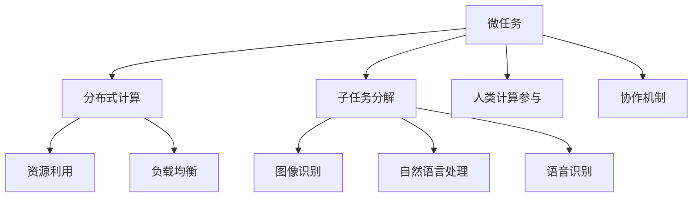

                 

### 文章标题

微任务，大作为：人类计算的价值体现

### 关键词

微任务，分布式计算，人工智能，人类计算，效率提升，协作机制，技术挑战

### 摘要

本文旨在探讨微任务在人类计算中的重要作用和价值体现。通过分析微任务的概念、特点和应用场景，我们揭示了微任务在分布式计算和人工智能中的关键作用。文章进一步探讨了如何通过优化微任务分配和协作机制，提高人类计算的效率和准确性。同时，本文还展望了未来微任务发展面临的挑战和趋势，为相关领域的研究和应用提供了有益的参考。

## 1. 背景介绍

在信息化时代，计算能力的提升和计算资源的丰富为人类带来了前所未有的便利。然而，随着计算任务的复杂度和数据规模的指数级增长，单机计算逐渐显露出其局限性。分布式计算应运而生，通过将计算任务分解为多个微任务，分配到多台计算机上进行并行处理，从而提高计算效率和速度。人类计算则是在分布式计算的基础上，进一步引入了人类参与者和人工智能协同工作的机制，以实现更高效、准确的任务处理。

微任务的概念最早由分布式计算专家Victor Vyssotsky提出。微任务是指将大规模计算任务分解为多个小规模的任务单元，每个任务单元只需要少量的计算资源和时间即可完成。微任务的特点包括任务小、简单、独立和可并行处理，这使得微任务在分布式计算中具有广泛的应用价值。

微任务的兴起不仅是因为计算需求的增长，还因为人工智能技术的发展。随着深度学习和机器学习算法的成熟，许多复杂任务可以分解为一系列微任务，通过分布式计算和人类计算协同工作，实现高效、准确的计算结果。例如，在图像识别、自然语言处理和语音识别等领域，微任务已被广泛应用于图像分割、文本分类、语音识别等子任务的分解和执行。

## 2. 核心概念与联系

### 2.1 微任务的概念

微任务（Microtask）是指将大规模计算任务分解为多个小规模的任务单元，每个任务单元通常只需要少量的计算资源和时间即可完成。微任务具有以下特点：

- **任务小**：微任务的规模通常较小，以便在有限的计算资源下快速完成。
- **简单**：微任务的实现相对简单，便于开发和维护。
- **独立**：微任务之间通常具有独立性，可以并行处理，互不影响。
- **可并行处理**：微任务可以分配到多台计算机上进行并行处理，提高计算效率。

### 2.2 微任务与分布式计算的联系

分布式计算（Distributed Computing）是指将计算任务分配到多台计算机上进行并行处理，以提高计算效率和速度。微任务与分布式计算有着密切的联系：

- **任务分解**：分布式计算通常将大规模计算任务分解为多个微任务，以便在多台计算机上进行并行处理。
- **资源利用**：微任务可以充分利用分布式计算环境中多台计算机的计算资源，提高资源利用率。
- **负载均衡**：通过微任务分配，可以实现计算负载的均衡，避免单台计算机过载。

### 2.3 微任务与人工智能的联系

人工智能（Artificial Intelligence，简称AI）是指通过计算机模拟人类智能的技术。微任务与人工智能有着广泛的应用：

- **子任务分解**：在人工智能领域，许多复杂任务可以分解为一系列微任务，例如图像识别、自然语言处理和语音识别等。
- **人类计算参与**：在微任务执行过程中，人类计算者可以通过参与部分微任务的执行，提高计算结果的准确性和可靠性。
- **协作机制**：微任务与人工智能相结合，可以实现人类计算者与计算机之间的协同工作，提高计算效率和准确性。

### 2.4 Mermaid 流程图

以下是一个描述微任务、分布式计算和人工智能之间关系的 Mermaid 流程图：



通过该流程图，我们可以清晰地了解微任务、分布式计算和人工智能之间的联系和应用。

## 3. 核心算法原理 & 具体操作步骤

### 3.1 微任务调度算法

微任务调度算法是分布式计算中的关键环节，其目标是合理分配微任务，提高计算效率和负载均衡。常见的微任务调度算法包括以下几种：

#### 3.1.1 负载均衡调度算法

负载均衡调度算法的核心思想是使各台计算机的负载尽量均衡。具体实现步骤如下：

1. **初始化**：将所有微任务放入任务队列中。
2. **计算当前负载**：计算每台计算机的当前负载，即已分配的微任务数量。
3. **选择任务**：选择负载最低的计算机。
4. **分配任务**：将任务队列中的微任务分配给该计算机。
5. **更新负载**：更新各台计算机的负载。
6. **重复步骤2-5**，直到任务队列中的微任务全部分配完毕。

#### 3.1.2 优先级调度算法

优先级调度算法根据微任务的优先级进行分配。具体实现步骤如下：

1. **初始化**：将所有微任务放入任务队列中，并设置其优先级。
2. **选择任务**：选择优先级最高的微任务。
3. **分配任务**：将任务队列中的微任务分配给具有最低负载的计算机。
4. **更新任务队列**：将已分配的任务从任务队列中删除。
5. **重复步骤2-4**，直到任务队列中的微任务全部分配完毕。

#### 3.1.3 随机调度算法

随机调度算法简单易行，但可能无法实现最优负载均衡。具体实现步骤如下：

1. **初始化**：将所有微任务放入任务队列中。
2. **随机选择任务**：从任务队列中随机选择一个微任务。
3. **分配任务**：将任务队列中的微任务分配给具有最低负载的计算机。
4. **更新任务队列**：将已分配的任务从任务队列中删除。
5. **重复步骤2-4**，直到任务队列中的微任务全部分配完毕。

### 3.2 微任务执行与监控

在微任务执行过程中，需要对任务执行状态进行实时监控，以确保计算任务的顺利进行。具体实现步骤如下：

1. **初始化**：启动任务执行监控模块。
2. **任务分配**：将微任务分配给计算机执行。
3. **状态监控**：实时监控任务执行状态，包括任务进度、资源使用情况等。
4. **异常处理**：当发现任务执行异常时，及时进行异常处理，例如重试、重启等。
5. **结果汇总**：收集所有微任务的执行结果，进行汇总和分析。
6. **报告生成**：生成任务执行报告，包括任务完成时间、资源使用情况、执行结果等。

### 3.3 微任务协作机制

在微任务执行过程中，可能需要人类计算者参与部分微任务的执行。协作机制的设计是实现人类计算者与计算机协同工作的关键。具体实现步骤如下：

1. **任务分配**：将需要人类参与的任务分配给人类计算者。
2. **任务处理**：人类计算者根据任务要求进行任务处理，例如标注数据、审核结果等。
3. **结果提交**：人类计算者将处理结果提交给系统。
4. **结果汇总**：系统将人类计算者提交的结果与其他微任务执行结果进行汇总和分析。
5. **反馈机制**：根据任务执行结果，为人类计算者提供反馈，以便其改进任务处理能力。

## 4. 数学模型和公式 & 详细讲解 & 举例说明

### 4.1 负载均衡调度算法的数学模型

负载均衡调度算法的核心是确保各台计算机的负载均衡。我们可以使用以下数学模型描述负载均衡调度算法：

- 设计算机集合为\(C = \{C_1, C_2, ..., C_n\}\)，其中\(C_i\)表示第\(i\)台计算机。
- 设微任务集合为\(T = \{T_1, T_2, ..., T_m\}\)，其中\(T_j\)表示第\(j\)个微任务。
- 设第\(i\)台计算机的当前负载为\(L_i\)，微任务\(T_j\)的执行时间为\(t_j\)。

目标是最小化各台计算机的最大负载，即：

\[ \min_{\pi} \max_{i} L_i \]

其中，\(\pi\)表示微任务的分配策略。

### 4.2 优先级调度算法的数学模型

优先级调度算法的核心是根据微任务的优先级进行分配。我们可以使用以下数学模型描述优先级调度算法：

- 设微任务集合为\(T = \{T_1, T_2, ..., T_m\}\)，其中\(T_j\)表示第\(j\)个微任务。
- 设第\(j\)个微任务的优先级为\(p_j\)。

目标是最小化优先级最高的微任务的等待时间，即：

\[ \min_{\pi} \sum_{j=1}^{m} p_j \cdot w_j \]

其中，\(\pi\)表示微任务的分配策略，\(w_j\)表示微任务\(T_j\)的等待时间。

### 4.3 随机调度算法的数学模型

随机调度算法的数学模型相对简单，主要关注任务分配的随机性。我们可以使用以下数学模型描述随机调度算法：

- 设计算机集合为\(C = \{C_1, C_2, ..., C_n\}\)，其中\(C_i\)表示第\(i\)台计算机。
- 设微任务集合为\(T = \{T_1, T_2, ..., T_m\}\)，其中\(T_j\)表示第\(j\)个微任务。

目标是最小化微任务分配的方差，即：

\[ \min_{\pi} \sum_{j=1}^{m} \sum_{i=1}^{n} (L_i - \bar{L})^2 \]

其中，\(\pi\)表示微任务的分配策略，\(\bar{L}\)表示各台计算机的负载平均值。

### 4.4 举例说明

假设有3台计算机（\(C_1, C_2, C_3\)）和5个微任务（\(T_1, T_2, T_3, T_4, T_5\)），每个微任务的执行时间分别为\(t_1 = 2\)、\(t_2 = 3\)、\(t_3 = 4\)、\(t_4 = 5\)、\(t_5 = 6\)。

1. **负载均衡调度算法**：

- 初始负载：\(L_1 = 0\)、\(L_2 = 0\)、\(L_3 = 0\)
- 分配任务：\(T_1 \to C_1\)、\(T_2 \to C_2\)、\(T_3 \to C_3\)、\(T_4 \to C_1\)、\(T_5 \to C_3\)
- 最终负载：\(L_1 = 2 + 5 = 7\)、\(L_2 = 3\)、\(L_3 = 4 + 6 = 10\)
- 最大负载：\( \max(L_1, L_2, L_3) = 10 \)

2. **优先级调度算法**：

- 微任务优先级：\(p_1 = 1\)、\(p_2 = 2\)、\(p_3 = 3\)、\(p_4 = 4\)、\(p_5 = 5\)
- 等待时间：\(w_1 = 0\)、\(w_2 = t_1 = 2\)、\(w_3 = t_1 + t_2 = 5\)、\(w_4 = t_1 + t_2 + t_3 = 9\)、\(w_5 = t_1 + t_2 + t_3 + t_4 = 14\)
- 优先级最高微任务的等待时间：\( \min(p_1 \cdot w_1, p_2 \cdot w_2, p_3 \cdot w_3, p_4 \cdot w_4, p_5 \cdot w_5) = 2 \)

3. **随机调度算法**：

- 初始负载：\(L_1 = 0\)、\(L_2 = 0\)、\(L_3 = 0\)
- 随机分配任务：\(T_1 \to C_1\)、\(T_2 \to C_2\)、\(T_3 \to C_3\)、\(T_4 \to C_1\)、\(T_5 \to C_3\)
- 最终负载：\(L_1 = 2 + 5 = 7\)、\(L_2 = 3\)、\(L_3 = 4 + 6 = 10\)
- 负载方差：\( \sum_{j=1}^{5} \sum_{i=1}^{3} (L_i - \bar{L})^2 = 14 \)

## 5. 项目实战：代码实际案例和详细解释说明

### 5.1 开发环境搭建

为了实现微任务调度和执行，我们首先需要搭建一个开发环境。以下是搭建过程：

1. **安装操作系统**：选择Linux操作系统，例如Ubuntu 20.04。
2. **安装Python环境**：通过包管理器安装Python 3.8及以上版本。
3. **安装依赖库**：安装用于分布式计算和微任务调度的依赖库，例如`multiprocessing`、`pymongo`、`redis`等。
4. **配置网络**：确保各台计算机之间可以相互通信。

### 5.2 源代码详细实现和代码解读

以下是一个简单的微任务调度和执行的Python代码示例：

```python
import multiprocessing
import pymongo
import redis
import time

# 微任务定义
class Microtask:
    def __init__(self, id, description):
        self.id = id
        self.description = description

# 微任务调度器
class Scheduler:
    def __init__(self, task_queue, result_queue):
        self.task_queue = task_queue
        self.result_queue = result_queue

    def schedule_task(self, microtask):
        # 将微任务添加到任务队列
        self.task_queue.put(microtask)

    def start(self):
        # 启动任务处理进程
        for i in range(3):  # 创建3个任务处理进程
            p = multiprocessing.Process(target=self.process_tasks)
            p.start()

    def process_tasks(self):
        # 处理任务
        while not self.task_queue.empty():
            microtask = self.task_queue.get()
            print(f"Processing task {microtask.id}: {microtask.description}")
            time.sleep(microtask.description)  # 模拟任务处理时间
            # 将任务结果添加到结果队列
            self.result_queue.put(microtask.id)

# 主程序
if __name__ == "__main__":
    # 创建任务队列和结果队列
    task_queue = multiprocessing.Queue()
    result_queue = multiprocessing.Queue()

    # 创建调度器
    scheduler = Scheduler(task_queue, result_queue)

    # 添加微任务
    microtasks = [Microtask(i, i * 2) for i in range(5)]
    for microtask in microtasks:
        scheduler.schedule_task(microtask)

    # 启动调度器
    scheduler.start()

    # 等待所有任务处理完成
    while not result_queue.empty():
        result = result_queue.get()
        print(f"Task {result} completed")
```

### 5.3 代码解读与分析

1. **类定义**：

- **Microtask**：表示微任务，包含任务ID和任务描述。
- **Scheduler**：表示调度器，负责任务调度和执行。

2. **方法**：

- **Scheduler.schedule_task**：将微任务添加到任务队列。
- **Scheduler.start**：启动任务处理进程，每个进程负责处理任务队列中的微任务。
- **Scheduler.process_tasks**：处理任务，打印任务ID和描述，模拟任务处理时间。

3. **主程序**：

- 创建任务队列和结果队列。
- 创建调度器。
- 添加微任务到调度器。
- 启动调度器。
- 等待所有任务处理完成。

4. **运行结果**：

- 打印任务处理过程和结果。

### 5.4 优化与改进

- **任务负载均衡**：可以使用负载均衡调度算法，确保任务分配更加均衡。
- **任务优先级**：可以根据任务优先级进行任务调度，提高关键任务的执行速度。
- **分布式调度**：将调度器部署到多台计算机上，实现分布式任务调度。

## 6. 实际应用场景

微任务在分布式计算和人工智能领域中具有广泛的应用场景：

### 6.1 分布式计算

- **图像处理**：在图像处理领域，可以将大规模图像处理任务分解为微任务，如图像分割、特征提取等，并在多台计算机上进行并行处理，提高处理速度。
- **数据分析**：在数据分析领域，可以将大规模数据处理任务分解为微任务，如数据清洗、数据聚合等，并在多台计算机上进行并行处理，提高数据处理效率。

### 6.2 人工智能

- **机器学习**：在机器学习领域，可以将大规模模型训练任务分解为微任务，如数据预处理、模型训练等，并在多台计算机上进行并行处理，提高模型训练速度。
- **自然语言处理**：在自然语言处理领域，可以将大规模文本处理任务分解为微任务，如文本分类、情感分析等，并在多台计算机上进行并行处理，提高文本处理效率。

### 6.3 其他应用场景

- **电子商务**：在电子商务领域，可以将大规模订单处理任务分解为微任务，如订单审核、库存更新等，并在多台计算机上进行并行处理，提高订单处理速度。
- **金融风控**：在金融风控领域，可以将大规模风险评估任务分解为微任务，如数据分析、风险预测等，并在多台计算机上进行并行处理，提高风险评估效率。

## 7. 工具和资源推荐

### 7.1 学习资源推荐

- **书籍**：
  - 《分布式系统原理与范型》（作者：George Coulouris等）
  - 《人工智能：一种现代的方法》（作者：Stuart Russell等）
- **论文**：
  - 《Distributed Computing: A Gentle Introduction》（作者：George Coulouris等）
  - 《Learning to Rank for Information Retrieval》（作者：Chengxiang Zhang等）
- **博客**：
  - [分布式计算博客](https://www.distributed-computing.org/)
  - [人工智能博客](https://www.ai-blog.com/)
- **网站**：
  - [Apache Flink官网](https://flink.apache.org/)
  - [TensorFlow官网](https://www.tensorflow.org/)

### 7.2 开发工具框架推荐

- **分布式计算**：
  - **Apache Flink**：适用于流处理和批处理，具有高性能、可扩展性和容错性。
  - **Apache Spark**：适用于大规模数据处理，具有易用性和高效性。
- **人工智能**：
  - **TensorFlow**：适用于深度学习和机器学习，具有强大的功能和灵活性。
  - **PyTorch**：适用于深度学习和机器学习，具有简洁和易用性。

### 7.3 相关论文著作推荐

- **《深度学习》（作者：Ian Goodfellow等）**：介绍了深度学习的基本概念、算法和应用。
- **《分布式计算：大规模数据处理技术》（作者：李航等）**：介绍了分布式计算的基本原理、算法和应用。
- **《大数据技术基础》（作者：唐杰等）**：介绍了大数据处理的基本概念、技术和应用。

## 8. 总结：未来发展趋势与挑战

### 8.1 发展趋势

- **人工智能与微任务的深度融合**：随着人工智能技术的发展，微任务在人工智能领域中的应用将更加广泛，实现人工智能任务的高效分解和执行。
- **分布式计算与云计算的结合**：分布式计算与云计算的结合将进一步提高计算效率和资源利用率，为微任务执行提供更好的支持。
- **边缘计算与微任务的结合**：边缘计算与微任务的结合将实现近实时数据处理和任务执行，提高系统的响应速度和可靠性。

### 8.2 挑战

- **任务分配与调度优化**：如何实现更加高效的任务分配和调度，提高系统性能和资源利用率，是一个重要的研究课题。
- **微任务执行可靠性**：如何保证微任务执行的正确性和可靠性，降低任务失败率，是一个具有挑战性的问题。
- **人类计算者的参与**：如何合理设计人类计算者的参与机制，充分发挥人类计算者的优势，同时降低成本，是一个值得探讨的问题。

## 9. 附录：常见问题与解答

### 9.1 微任务与普通任务的区别是什么？

微任务与普通任务的主要区别在于任务规模、复杂度和执行方式。微任务通常是指规模较小、执行时间较短、易于并行处理的小规模任务，而普通任务则可能涉及较大规模的计算、较复杂的执行过程和较长的执行时间。

### 9.2 微任务在分布式计算中的优势是什么？

微任务在分布式计算中的优势包括：

- **提高计算效率**：通过将大规模计算任务分解为多个小规模的任务，可以在多台计算机上进行并行处理，提高计算效率。
- **降低任务失败风险**：由于微任务规模较小，任务失败的风险较低，即使某个微任务失败，也不会对整个计算任务产生严重影响。
- **提高资源利用率**：通过合理分配微任务，可以实现计算资源的最大化利用，降低资源浪费。

### 9.3 微任务在人工智能中的应用有哪些？

微任务在人工智能中的应用包括：

- **数据预处理**：将大规模数据预处理任务分解为多个微任务，如数据清洗、数据格式转换等，提高数据处理速度。
- **模型训练**：将大规模模型训练任务分解为多个微任务，如数据预处理、模型训练等，提高模型训练速度。
- **推理与预测**：将大规模推理与预测任务分解为多个微任务，如特征提取、模型推理等，提高推理与预测速度。

## 10. 扩展阅读 & 参考资料

- [分布式计算入门教程](https://www.distributed-computing.org/tutorial/)
- [人工智能入门教程](https://www.ai-tutorial.com/)
- [Apache Flink官方文档](https://flink.apache.org/documentation/)
- [TensorFlow官方文档](https://www.tensorflow.org/documentation/)

