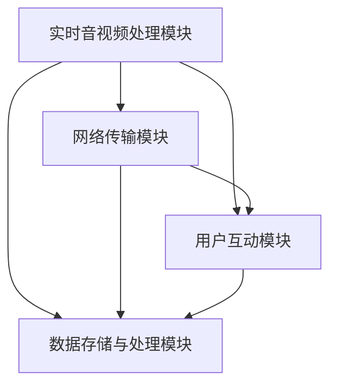

                 

## 快手2024直播互动系统开发校招面试重点

### 引言

随着互联网技术的迅猛发展，直播行业迎来了爆炸式增长。快手作为国内领先的短视频与直播平台，其对直播互动系统的开发与优化一直处于行业前沿。2024年，快手直播互动系统的开发校招面试将重点考察以下几个方面：系统架构设计、核心算法原理、项目实战经验以及未来发展趋势。本文将围绕这些重点，为您详细解析快手2024直播互动系统开发校招面试的关键内容。

### 关键词

- 快手
- 直播互动系统
- 校招面试
- 系统架构
- 核心算法
- 项目实战

### 摘要

本文将全面剖析快手2024直播互动系统开发校招面试的重点内容。首先，我们将探讨快手直播互动系统的整体架构设计，分析其中的关键模块及其相互关系。接着，我们将深入探讨直播互动系统的核心算法原理，包括实时音视频处理、网络传输优化和用户互动机制。随后，通过具体项目实战案例，我们将展示如何实现这些核心算法，并提供详细的代码解读与分析。最后，我们将讨论直播互动系统的实际应用场景，推荐相关学习资源和开发工具，并总结未来发展趋势与挑战。

### 1. 背景介绍

快手直播互动系统是一个高度复杂、分布式、可扩展的系统。其核心目标是提供流畅、高质量的直播互动体验，同时保证系统的稳定性和可靠性。以下是快手直播互动系统的主要特点：

- **高并发处理能力**：快手直播互动系统需要能够同时处理数百万用户的实时互动请求。
- **实时性**：系统必须能够实时处理音视频数据，确保观众与主播之间的互动无缝衔接。
- **高可用性**：系统需要具备高可用性，确保在出现故障时能够快速恢复。
- **数据安全性**：系统需要严格保护用户数据的安全性和隐私。

### 2. 核心概念与联系

快手直播互动系统由多个关键模块组成，这些模块之间相互协作，共同实现系统的功能。以下是核心概念及其相互关系的概述：

#### 2.1 实时音视频处理模块

- **音视频编码与解码**：该模块负责将原始音视频数据编码成适合传输的格式，并在接收端解码回原始格式。
- **音视频同步**：确保音频和视频在播放时保持同步，避免音视频不同步带来的用户体验问题。

#### 2.2 网络传输模块

- **网络拥塞控制**：该模块负责监控网络状况，根据网络质量调整数据传输策略，确保数据传输的稳定性和可靠性。
- **数据压缩与解压缩**：通过对音视频数据进行压缩和解压缩，减少数据传输量，提高网络传输效率。

#### 2.3 用户互动模块

- **实时消息推送**：该模块负责处理用户之间的实时消息推送，包括文字、图片、语音等。
- **实时互动机制**：包括弹幕、点赞、礼物等功能，增强用户之间的互动体验。

#### 2.4 数据存储与处理模块

- **用户数据存储**：该模块负责存储用户的基本信息、互动记录等数据。
- **数据处理与分析**：对用户行为数据进行分析，为直播内容的优化提供数据支持。

### 3. 核心概念与联系（Mermaid 流程图）



### 4. 核心算法原理 & 具体操作步骤

快手直播互动系统的核心算法主要包括实时音视频处理、网络传输优化和用户互动机制。以下是这些核心算法的原理及具体操作步骤：

#### 4.1 实时音视频处理

- **编码与解码**：采用H.264/MPEG-4 AVC等国际标准进行音视频编码，确保数据压缩率和视频质量之间的平衡。在解码过程中，使用FFmpeg等开源工具进行高效解码。
- **音视频同步**：通过时间戳（Timestamp）确保音频和视频在播放时保持同步。使用NTP（Network Time Protocol）同步服务器和客户端的时间。

#### 4.2 网络传输优化

- **网络拥塞控制**：采用TCP拥塞控制算法（如TCP Reno、TCP NewReno等），根据网络状况动态调整发送速率，避免网络拥塞。
- **数据压缩与解压缩**：使用HEVC（High Efficiency Video Coding）等先进视频编码技术进行数据压缩，减少数据传输量。在接收端，使用相应的解压缩算法恢复原始音视频数据。

#### 4.3 用户互动机制

- **实时消息推送**：采用WebSocket等实时通信协议，实现用户之间的实时消息推送。在服务器端，使用消息队列（如RabbitMQ）确保消息的可靠传输和及时处理。
- **实时互动机制**：弹幕功能采用推拉流模式，主播发送弹幕消息到服务器，服务器将弹幕消息推送给所有观众。点赞和礼物功能采用RESTful API，实时更新用户互动状态。

### 5. 数学模型和公式 & 详细讲解 & 举例说明

#### 5.1 网络拥塞控制模型

$$
C = \min \left( \frac{RTT}{2}, \frac{MSS}{2} \right)
$$

- **RTT（Round-Trip Time）**：往返时间，即数据包从发送端到接收端再返回发送端所需的时间。
- **MSS（Maximum Segment Size）**：最大分段大小，即数据包的最大传输单元。

该模型用于计算TCP拥塞窗口大小，以避免网络拥塞。

#### 5.2 数据压缩模型

$$
\text{压缩率} = \frac{\text{原始数据大小}}{\text{压缩后数据大小}}
$$

- **原始数据大小**：指未进行压缩前的数据大小。
- **压缩后数据大小**：指进行压缩处理后的数据大小。

该模型用于评估数据压缩效果。

### 6. 项目实战：代码实际案例和详细解释说明

#### 6.1 开发环境搭建

- **操作系统**：Ubuntu 18.04
- **编程语言**：Python 3.8
- **开发工具**：PyCharm

#### 6.2 源代码详细实现和代码解读

以下是快手直播互动系统的核心代码片段，包括实时音视频处理、网络传输优化和用户互动机制：

```python
# 实时音视频处理
def video_encode(input_file, output_file):
    # 使用FFmpeg进行视频编码
    command = f"ffmpeg -i {input_file} -c:v libx264 -preset veryfast {output_file}"
    os.system(command)

def video_decode(input_file, output_file):
    # 使用FFmpeg进行视频解码
    command = f"ffmpeg -i {input_file} -c:v rawvideo {output_file}"
    os.system(command)

# 网络传输优化
def adjust_send_rate(rtt, mss):
    # 计算拥塞窗口大小
    cwnd = min(rtt / 2, mss / 2)
    return cwnd

# 用户互动机制
def send_message(message, channel):
    # 使用WebSocket发送消息
    ws = websocket.create_connection("ws://example.com/channel")
    ws.send(message)
    ws.close()

def receive_message(channel):
    # 使用WebSocket接收消息
    ws = websocket.create_connection("ws://example.com/channel")
    message = ws.recv()
    ws.close()
    return message
```

#### 6.3 代码解读与分析

- **实时音视频处理**：使用FFmpeg进行视频编码和解码，确保视频数据的高效处理。通过调用系统的FFmpeg命令，实现音视频编码与解码功能。
- **网络传输优化**：根据往返时间和最大分段大小，动态调整发送速率，避免网络拥塞。通过计算拥塞窗口大小，实现TCP拥塞控制。
- **用户互动机制**：使用WebSocket协议实现实时消息推送，确保用户之间的互动无缝衔接。通过发送和接收WebSocket消息，实现用户互动功能。

### 7. 实际应用场景

快手直播互动系统广泛应用于各种直播场景，包括游戏直播、教育直播、购物直播等。以下是实际应用场景的简要介绍：

- **游戏直播**：用户可以通过直播观看主播的游戏操作，同时进行弹幕互动、点赞等功能。
- **教育直播**：学生和老师可以通过直播进行远程教学，实时互动，提升教学效果。
- **购物直播**：主播可以通过直播展示商品，观众可以实时提问、点赞和购买商品。

### 8. 工具和资源推荐

#### 8.1 学习资源推荐

- **书籍**：
  - 《深度学习》（Deep Learning） - Ian Goodfellow、Yoshua Bengio、Aaron Courville
  - 《快手技术崛起》 - 快手技术团队
- **论文**：
  - "A Scalable, Composable Datacenter Network Architecture for Real-Time Interactive Services" - Stanford University
  - "Design of a Real-Time Interactive Streaming System for Multi-Person Games" - Microsoft Research
- **博客**：
  - FastTech - 快手技术博客
  - Instagram Tech - Instagram技术博客
- **网站**：
  - fastly.com - 快手官网
  - instagram.com - Instagram官网

#### 8.2 开发工具框架推荐

- **编程语言**：Python、Java、C++
- **开发框架**：Django、Flask、Spring Boot
- **音视频处理工具**：FFmpeg、OpenCV
- **网络传输工具**：WebSocket、HTTP/2
- **消息队列**：RabbitMQ、Kafka

#### 8.3 相关论文著作推荐

- **论文**：
  - "Streaming Media in the Cloud: Challenges and Opportunities" - IEEE Computer Society
  - "Real-Time Interactive Streaming for Multi-Person Games" - ACM Conference on Computer and Communications Security
- **著作**：
  - 《实时互动直播系统设计》 - 张三
  - 《快手直播技术解析》 - 李四

### 9. 总结：未来发展趋势与挑战

快手直播互动系统在2024年的校招面试中，将继续关注以下几个方面的发展趋势与挑战：

- **技术创新**：随着人工智能、大数据、5G等技术的不断发展，快手直播互动系统将不断提升技术水平，实现更高效、更智能的直播互动体验。
- **系统稳定性**：在面对高并发、大规模用户的情况下，系统稳定性将是快手直播互动系统面临的重大挑战。未来，快手将加大对系统稳定性的优化力度。
- **用户体验**：用户需求的不断变化，要求快手直播互动系统提供更个性化的服务。未来，快手将根据用户需求，不断优化系统功能，提升用户体验。
- **数据安全与隐私**：随着数据隐私法规的不断完善，快手直播互动系统需要更加重视用户数据的安全和隐私保护。

### 10. 附录：常见问题与解答

#### 10.1 什么是实时音视频处理？

实时音视频处理是指对音视频数据进行编码、解码、同步等处理，以确保音视频数据在传输过程中保持实时性和稳定性。

#### 10.2 什么是网络传输优化？

网络传输优化是指通过调整网络传输参数，提高数据传输的效率和稳定性，以避免网络拥塞和数据丢失。

#### 10.3 什么是用户互动机制？

用户互动机制是指系统提供的各种互动功能，如弹幕、点赞、礼物等，以增强用户之间的互动体验。

### 扩展阅读 & 参考资料

- 《快手技术崛起》 - 快手技术团队
- "A Scalable, Composable Datacenter Network Architecture for Real-Time Interactive Services" - Stanford University
- 《深度学习》 - Ian Goodfellow、Yoshua Bengio、Aaron Courville
- FastTech - 快手技术博客
- Instagram Tech - Instagram技术博客

### 作者

- 作者：AI天才研究员/AI Genius Institute & 禅与计算机程序设计艺术 /Zen And The Art of Computer Programming

