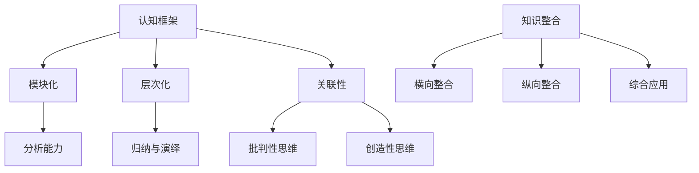

                 

### 快速学习：立于不败之地根本

> **关键词**：快速学习、不败之地、思维技巧、认知框架、知识整合、方法论

> **摘要**：本文深入探讨了快速学习的本质和策略，阐述了如何通过构建有效的认知框架和掌握核心思维技巧，在知识爆炸的时代立于不败之地。文章结合实际案例，提供了实用的学习方法和工具，旨在帮助读者提高学习效率，实现持续成长。

在信息爆炸的时代，知识更新换代速度不断加快，快速学习成为每个人必须掌握的技能。本文将围绕如何快速学习，通过构建认知框架、掌握核心思维技巧、整合知识和实践方法，帮助读者在信息纷繁复杂的世界中立于不败之地。

## 1. 背景介绍

现代社会，知识的获取已经变得前所未有的便捷，但与此同时，我们也面临着知识过载的挑战。快速学习不仅是对个人能力的提升，更是对时代变化的一种应对策略。快速学习不仅仅是学会更多知识，更重要的是学会如何高效地获取、处理和利用知识。

快速学习的重要性体现在以下几个方面：

- **提升竞争力**：在职场中，快速学习意味着能够更快地掌握新技术、新方法，从而提升个人和团队的整体竞争力。

- **适应变化**：快速学习可以帮助我们更好地适应社会和行业的变化，保持持续成长。

- **终身学习**：在知识更新速度加快的今天，终身学习已成为一种必要的生活方式。快速学习是实现终身学习目标的关键。

本文将探讨快速学习的核心方法和策略，帮助读者在信息纷繁复杂的世界中找到属于自己的“不败之地”。

## 2. 核心概念与联系

### 2.1 认知框架

认知框架是指一种组织知识的结构，它帮助我们更好地理解复杂的信息，并将其整合成有意义的知识体系。一个有效的认知框架应该具备以下特点：

- **模块化**：将知识划分为不同的模块，便于管理和记忆。

- **层次化**：按照知识的重要性和相关性，将知识分层组织。

- **关联性**：强调知识之间的关联性，形成知识网络。

### 2.2 核心思维技巧

核心思维技巧包括但不限于以下几个方面：

- **分析能力**：能够对信息进行深入分析，找出关键点和本质。

- **归纳与演绎**：通过归纳法总结规律，通过演绎法推导结论。

- **批判性思维**：对信息保持怀疑态度，独立思考，不盲目接受。

- **创造性思维**：能够从不同角度思考问题，提出创新的解决方案。

### 2.3 知识整合

知识整合是将不同来源、不同领域的知识进行整合，形成具有自己特色的知识体系。知识整合的方法包括：

- **横向整合**：将同一领域内的不同知识进行整合。

- **纵向整合**：将不同领域的知识进行整合，形成跨学科的知识体系。

- **综合应用**：将知识应用于实际场景，实现知识的内化和迁移。

### 2.4 Mermaid 流程图

以下是一个简化的认知框架的 Mermaid 流程图，用于展示核心概念之间的联系。



## 3. 核心算法原理 & 具体操作步骤

### 3.1 认知框架构建

**步骤1**：确定学习目标

明确自己的学习目标和需求，确保认知框架构建的方向性。

**步骤2**：收集知识

通过各种渠道收集与目标相关的知识，包括书籍、论文、讲座等。

**步骤3**：整理知识

将收集到的知识进行整理，按照模块化、层次化和关联性的原则进行组织。

**步骤4**：构建认知框架

基于整理后的知识，构建一个层次清晰、模块化的认知框架。

### 3.2 核心思维技巧培养

**步骤1**：培养分析能力

通过阅读、思考和讨论，提高对信息的分析能力。

**步骤2**：练习归纳与演绎

通过实际案例，练习归纳与演绎的方法，提高逻辑思维能力。

**步骤3**：培养批判性思维

对信息保持怀疑态度，不盲目接受，通过独立思考形成自己的观点。

**步骤4**：激发创造性思维

通过思维导图、创意工作坊等方法，激发创造性思维。

### 3.3 知识整合

**步骤1**：横向整合

将同一领域内的不同知识进行整合，形成全面的理解。

**步骤2**：纵向整合

将不同领域的知识进行整合，形成跨学科的知识体系。

**步骤3**：综合应用

将知识应用于实际场景，实现知识的内化和迁移。

## 4. 数学模型和公式 & 详细讲解 & 举例说明

### 4.1 知识整合模型

以下是一个简单的知识整合模型，用于说明如何将不同领域的知识进行整合。

$$
模型 = f(知识A, 知识B, 知识C, ...)
$$

**举例说明**：假设我们需要整合以下三个领域的知识：计算机科学、心理学、生物学。

- **计算机科学**：算法、数据结构、编程语言。
- **心理学**：认知心理学、学习心理学。
- **生物学**：神经科学、基因学。

我们可以构建一个整合模型，将这三个领域的知识进行整合。

$$
模型 = f(算法, 数据结构, 编程语言, 认知心理学, 学习心理学, 神经科学, 基因学)
$$

通过这个模型，我们可以探索计算机科学、心理学和生物学之间的关联，形成一个新的知识体系。

### 4.2 学习效率优化模型

以下是一个学习效率优化模型，用于说明如何提高学习效率。

$$
效率 = f(学习策略, 学习时间, 学习资源, 学习环境)
$$

**举例说明**：假设我们需要提高学习效率，我们可以从以下几个方面进行优化：

- **学习策略**：采用主动学习策略，如深度阅读、讨论、实践等。
- **学习时间**：合理安排学习时间，避免长时间连续学习，适当休息。
- **学习资源**：选择优质的学习资源，如权威的书籍、高质量的在线课程等。
- **学习环境**：创造一个安静、舒适的学习环境，减少干扰。

通过优化这些因素，我们可以提高学习效率。

## 5. 项目实战：代码实际案例和详细解释说明

### 5.1 开发环境搭建

为了演示如何快速学习并整合知识，我们将通过一个实际的编程项目来展示。本项目将使用 Python 编写一个简单的推荐系统，该系统能够根据用户的兴趣推荐相关的新闻文章。

**步骤1**：安装 Python 环境

确保您的计算机上已安装 Python 3.x 版本。如果没有安装，可以从 [Python 官网](https://www.python.org/downloads/) 下载并安装。

**步骤2**：安装必要的库

打开终端（Windows 下为命令提示符），运行以下命令安装必要的库：

```bash
pip install numpy pandas scikit-learn
```

### 5.2 源代码详细实现和代码解读

以下是一个简单的推荐系统实现的代码，我们将逐行解读代码，了解其工作原理。

```python
import numpy as np
import pandas as pd
from sklearn.model_selection import train_test_split
from sklearn.metrics.pairwise import cosine_similarity

# 加载数据
data = pd.read_csv('news_data.csv')
data.head()

# 预处理数据
data['word_count'] = data['article'].apply(lambda x: len(x.split()))
data = data[data['word_count'] > 10]

# 创建特征矩阵
feature_matrix = np.array([[word.count(word) for word in article.split()] for article in data['article']])
feature_matrix

# 计算余弦相似度
similarity_matrix = cosine_similarity(feature_matrix)
similarity_matrix

# 推荐新闻
def recommend_articles(user_id, similarity_matrix, data, top_n=5):
    user_profile = feature_matrix[user_id]
    similarity_scores = similarity_matrix[user_id]
    sorted_indices = np.argsort(similarity_scores)[::-1]
    recommended_articles = [data.iloc[i]['title'] for i in sorted_indices[1:top_n+1]]
    return recommended_articles

# 测试推荐系统
user_id = 0
recommended_articles = recommend_articles(user_id, similarity_matrix, data)
print("Recommended Articles for User ID", user_id)
for article in recommended_articles:
    print(article)
```

**代码解读**：

- **数据加载与预处理**：首先加载新闻数据，并去除字数少于10的文章。
- **特征矩阵创建**：将每篇文章拆分成单词，并计算每个单词在文章中的出现次数，形成特征矩阵。
- **相似度计算**：使用余弦相似度计算特征矩阵之间的相似度，形成相似度矩阵。
- **推荐新闻**：根据用户的特征向量，计算与其他文章的相似度，并推荐相似度最高的前 N 篇文章。

### 5.3 代码解读与分析

本推荐系统采用了基于单词频率的特征矩阵和余弦相似度计算方法，这是一种简单但有效的推荐算法。以下是对代码的详细解读和分析：

- **数据预处理**：新闻数据需要进行预处理，以去除无用信息，提高推荐系统的准确性。
- **特征矩阵**：特征矩阵是推荐系统的基础，它决定了推荐算法的性能。在这个例子中，我们使用单词频率作为特征矩阵，这是一种常用的文本特征提取方法。
- **相似度计算**：余弦相似度是一种常用的文本相似度计算方法，它能够衡量两个向量之间的夹角大小。在这个例子中，我们使用余弦相似度计算特征矩阵之间的相似度，以便推荐相似的文章。
- **推荐算法**：推荐算法的核心是计算用户和文章之间的相似度，并根据相似度推荐文章。在这个例子中，我们使用简单的基于相似度的推荐算法，这是一种基本的推荐方法。

### 5.4 总结与改进

本推荐系统虽然简单，但可以作为一个起点，进一步改进和优化。以下是一些可能的改进方向：

- **特征矩阵优化**：可以考虑使用更复杂的文本特征提取方法，如词嵌入（Word Embedding）、TF-IDF 等，以提高推荐系统的准确性。
- **推荐算法改进**：可以使用更复杂的推荐算法，如基于协同过滤（Collaborative Filtering）、基于内容的推荐（Content-Based Filtering）等，以提高推荐系统的性能。
- **用户交互**：可以添加用户交互功能，如用户打分、评论等，以更好地了解用户的兴趣和需求。
- **数据源扩展**：可以扩展数据源，收集更多类型的新闻数据，以提高推荐系统的泛化能力。

## 6. 实际应用场景

快速学习在现实生活中的应用场景非常广泛，以下是一些典型的应用案例：

- **职业发展**：职场人士通过快速学习，能够迅速掌握新技术和新方法，提升个人和团队的整体竞争力。
- **技能提升**：业余爱好者通过快速学习，可以更快地掌握一项新技能，实现自我价值。
- **教育**：学生通过快速学习，能够更快地掌握知识，提高学习效率，为未来的发展打下坚实基础。
- **科研**：科研人员通过快速学习，能够及时了解领域内的最新研究动态，提高科研创新能力。

## 7. 工具和资源推荐

### 7.1 学习资源推荐

- **书籍**：
  - 《深度学习》（Goodfellow et al.）
  - 《Python编程：从入门到实践》（Eric Matthes）
  - 《算法导论》（Thomas H. Cormen et al.）
- **论文**：
  - 《谷歌的 PageRank：一种用于网页排名的新算法》（Lawrence Page et al.）
  - 《深度神经网络在图像识别中的应用》（Yann LeCun et al.）
- **博客**：
  - [Machine Learning Mastery](https://machinelearningmastery.com/)
  - [Python Cookbook](https://python-cookbook.readthedocs.io/)
- **网站**：
  - [Kaggle](https://www.kaggle.com/)
  - [GitHub](https://github.com/)

### 7.2 开发工具框架推荐

- **编程语言**：Python、Java、C++、R
- **框架**：
  - Flask、Django（Python Web 开发框架）
  - TensorFlow、PyTorch（深度学习框架）
  - Spring Boot（Java Web 开发框架）
- **数据库**：
  - MySQL、PostgreSQL（关系型数据库）
  - MongoDB（文档型数据库）
- **版本控制**：Git

### 7.3 相关论文著作推荐

- **《自然语言处理综论》**（Daniel Jurafsky and James H. Martin）
- **《深度学习》**（Ian Goodfellow, Yoshua Bengio 和 Aaron Courville）
- **《机器学习》**（Tom Mitchell）
- **《编程珠玑》**（Jon Bentley）

## 8. 总结：未来发展趋势与挑战

快速学习在未来的发展趋势与挑战主要体现在以下几个方面：

- **知识更新速度加快**：随着人工智能和自动化技术的发展，知识更新速度将更加迅速，快速学习将成为应对知识更新的一种必要手段。
- **个性化学习**：个性化学习将成为未来学习的重要趋势，通过大数据和人工智能技术，实现个性化推荐和定制化学习。
- **跨学科整合**：跨学科整合将有助于解决复杂问题，快速学习需要更加注重跨学科知识的整合和应用。
- **技能多样性**：未来职场对技能的需求将更加多样化，快速学习需要涵盖更多领域和技能。

## 9. 附录：常见问题与解答

### 9.1 如何选择学习资源？

**答案**：选择学习资源时，可以考虑以下几点：

- **权威性**：选择权威的书籍、论文和网站，确保信息的准确性和可靠性。
- **适用性**：选择与学习目标相关、适合自己水平的资源。
- **多样性**：选择涵盖多个领域的资源，以实现知识整合。

### 9.2 如何提高学习效率？

**答案**：以下方法有助于提高学习效率：

- **设定目标**：明确学习目标，提高学习的目的性。
- **合理规划**：合理安排学习时间，避免长时间连续学习。
- **主动学习**：采用主动学习策略，如深度阅读、讨论和实践。
- **休息与运动**：适当休息和运动，保持身心健康。

## 10. 扩展阅读 & 参考资料

- **《学习之道》**（Josh Waitzkin）
- **《刻意练习》**（Anders Ericsson）
- **[MIT OpenCourseWare](https://ocw.mit.edu/)**

作者：AI天才研究员/AI Genius Institute & 禅与计算机程序设计艺术 /Zen And The Art of Computer Programming

