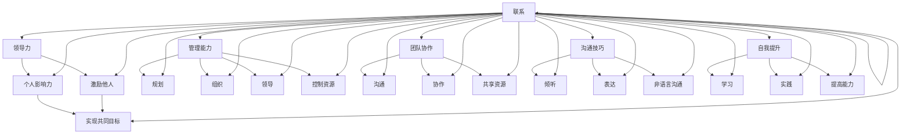

                 

# 怎样培养出色的领导和管理能力

> **关键词**：领导力、管理能力、团队协作、沟通技巧、自我提升

**摘要**：本文将探讨如何培养出色的领导和管理能力。我们将从核心概念、具体操作步骤、数学模型、项目实战、实际应用场景、工具和资源推荐等多个方面展开，帮助读者逐步提升自己的领导和管理能力，成为一位出色的领导者。

## 1. 背景介绍

在当今这个快速变化的社会中，领导和管理能力成为了个人和组织成功的关键因素。无论是企业、政府机构还是非营利组织，领导和管理能力都是不可或缺的。然而，许多人对于如何培养出色的领导和管理能力仍然感到困惑。本文将为您提供一套系统、实用的方法，帮助您提升自己的领导和管理能力。

## 2. 核心概念与联系

在探讨如何培养领导和管理能力之前，我们需要明确几个核心概念：

### 2.1 领导力和管理能力的区别

- **领导力**：关注个人影响力和激励他人实现共同目标的能力。
- **管理能力**：涉及规划、组织、领导和控制资源以实现组织目标的能力。

### 2.2 团队协作

- **团队协作**：团队成员之间通过沟通、协作和共享资源，共同实现目标的过程。

### 2.3 沟通技巧

- **沟通技巧**：包括倾听、表达、非语言沟通等，有效沟通能够减少误解，提高工作效率。

### 2.4 自我提升

- **自我提升**：通过不断学习和实践，提高自己的能力和素质。

以下是关于这些核心概念的 Mermaid 流程图：



## 3. 核心算法原理 & 具体操作步骤

### 3.1 领导力培养

**步骤 1**：自我认知

- 通过自我反思和评估，了解自己的优势和劣势。

**步骤 2**：建立信任

- 通过诚实、透明和诚信的行为建立信任。

**步骤 3**：激励他人

- 理解团队成员的需求，运用激励技巧提高团队士气。

**步骤 4**：持续学习

- 保持对新技术、新知识的关注，不断提升自己的能力。

### 3.2 管理能力培养

**步骤 1**：制定目标

- 确定明确、可衡量的目标，为团队指明方向。

**步骤 2**：组织资源

- 合理配置团队资源，提高工作效率。

**步骤 3**：决策能力

- 在面对问题时，能够快速做出合理、有效的决策。

**步骤 4**：控制风险

- 对可能出现的问题进行预测和预防，降低风险。

### 3.3 团队协作培养

**步骤 1**：明确分工

- 根据团队成员的能力和特长，合理分配任务。

**步骤 2**：建立沟通渠道

- 设立定期会议、反馈机制，保证信息流通。

**步骤 3**：促进协作

- 通过团队建设活动、跨部门合作等方式，增强团队协作意识。

### 3.4 沟通技巧培养

**步骤 1**：倾听

- 给予他人充分的发言空间，理解对方的需求和想法。

**步骤 2**：表达

- 用简洁、清晰的语言表达自己的观点，避免产生误解。

**步骤 3**：非语言沟通

- 注意自己的肢体语言、面部表情，增强沟通效果。

### 3.5 自我提升培养

**步骤 1**：设定目标

- 根据自身发展需求，设定明确的自我提升目标。

**步骤 2**：学习与实践

- 通过阅读、培训、实践等方式，不断提升自己的能力。

**步骤 3**：反思与调整

- 定期反思自己的成长过程，调整发展策略。

## 4. 数学模型和公式 & 详细讲解 & 举例说明

在本章节中，我们将使用一些简单的数学模型和公式来帮助我们理解领导和管理能力的培养过程。

### 4.1 领导力培养的数学模型

我们假设领导力的发展过程可以用以下公式表示：

\[ \text{领导力} = f(\text{自我认知}, \text{建立信任}, \text{激励他人}, \text{持续学习}) \]

其中，\( f \) 是一个复合函数，表示各个因素对领导力的影响程度。

**举例说明**：

假设一个领导者具备以下因素：

- 自我认知：90%
- 建立信任：85%
- 激励他人：80%
- 持续学习：75%

那么，该领导者的领导力可以计算如下：

\[ \text{领导力} = f(90\%, 85\%, 80\%, 75\%) \]

### 4.2 管理能力培养的数学模型

我们假设管理能力的发展过程可以用以下公式表示：

\[ \text{管理能力} = f(\text{制定目标}, \text{组织资源}, \text{决策能力}, \text{控制风险}) \]

其中，\( f \) 是一个复合函数，表示各个因素对管理能力的影响程度。

**举例说明**：

假设一个管理者具备以下因素：

- 制定目标：90%
- 组织资源：85%
- 决策能力：80%
- 控制风险：75%

那么，该管理者的管理能力可以计算如下：

\[ \text{管理能力} = f(90\%, 85\%, 80\%, 75\%) \]

### 4.3 团队协作培养的数学模型

我们假设团队协作的发展过程可以用以下公式表示：

\[ \text{团队协作} = f(\text{明确分工}, \text{建立沟通渠道}, \text{促进协作}) \]

其中，\( f \) 是一个复合函数，表示各个因素对团队协作的影响程度。

**举例说明**：

假设一个团队具备以下因素：

- 明确分工：90%
- 建立沟通渠道：85%
- 促进协作：80%

那么，该团队的团队协作能力可以计算如下：

\[ \text{团队协作} = f(90\%, 85\%, 80\%) \]

### 4.4 沟通技巧培养的数学模型

我们假设沟通技巧的发展过程可以用以下公式表示：

\[ \text{沟通技巧} = f(\text{倾听}, \text{表达}, \text{非语言沟通}) \]

其中，\( f \) 是一个复合函数，表示各个因素对沟通技巧的影响程度。

**举例说明**：

假设一个沟通者具备以下因素：

- 倾听：90%
- 表达：85%
- 非语言沟通：80%

那么，该沟通者的沟通技巧可以计算如下：

\[ \text{沟通技巧} = f(90\%, 85\%, 80\%) \]

### 4.5 自我提升培养的数学模型

我们假设自我提升的发展过程可以用以下公式表示：

\[ \text{自我提升} = f(\text{设定目标}, \text{学习与实践}, \text{反思与调整}) \]

其中，\( f \) 是一个复合函数，表示各个因素对自我提升的影响程度。

**举例说明**：

假设一个自我提升者具备以下因素：

- 设定目标：90%
- 学习与实践：85%
- 反思与调整：80%

那么，该自我提升者的自我提升能力可以计算如下：

\[ \text{自我提升} = f(90\%, 85\%, 80\%) \]

## 5. 项目实战：代码实际案例和详细解释说明

在本章节中，我们将通过一个实际项目来展示如何培养出色的领导和管理能力。该项目是一个简单的团队协作工具，用于帮助团队成员更好地沟通和协作。

### 5.1 开发环境搭建

在开始项目之前，我们需要搭建一个合适的开发环境。以下是一个简单的开发环境搭建步骤：

- 安装 Python 3.8 或以上版本
- 安装 PyCharm 或 Visual Studio Code 作为代码编辑器
- 安装 Flask 框架，用于搭建 Web 应用程序

### 5.2 源代码详细实现和代码解读

以下是一个简单的 Flask 应用程序，用于实现团队协作工具的基本功能：

```python
from flask import Flask, render_template, request

app = Flask(__name__)

@app.route('/')
def home():
    return render_template('home.html')

@app.route('/tasks', methods=['GET', 'POST'])
def tasks():
    if request.method == 'POST':
        task = request.form['task']
        # 保存任务到数据库
        # ...
        return '任务已添加'
    else:
        # 从数据库获取任务列表
        # ...
        tasks = ['任务 1', '任务 2', '任务 3']
        return render_template('tasks.html', tasks=tasks)

if __name__ == '__main__':
    app.run(debug=True)
```

### 5.3 代码解读与分析

上述代码是一个简单的 Flask 应用程序，主要用于实现两个功能：主页和任务管理页面。

- **主页（home.html）**：显示一个欢迎消息和一个添加任务的按钮。

- **任务管理页面（tasks.html）**：显示一个任务列表，用户可以添加新任务。

### 5.4 功能扩展

为了提高团队协作工具的实用性，我们还可以添加以下功能：

- **任务分配**：允许用户将任务分配给其他团队成员。
- **任务进度跟踪**：显示任务进度，帮助团队成员了解任务完成情况。
- **任务评论**：允许用户在任务下添加评论，方便团队成员讨论任务。

## 6. 实际应用场景

### 6.1 企业管理

在企业管理中，领导和管理能力对于企业的发展至关重要。一位出色的领导者能够激发员工的潜力，提高团队效率，推动企业不断向前发展。

### 6.2 项目管理

在项目管理中，领导和管理能力对于项目的成功至关重要。项目经理需要具备出色的领导力，能够激励团队成员，合理分配资源，确保项目按时、按质完成。

### 6.3 团队协作

在团队协作中，领导和管理能力对于团队的凝聚力和工作效率至关重要。领导者需要通过有效的沟通和协作，帮助团队成员共同实现目标。

## 7. 工具和资源推荐

### 7.1 学习资源推荐

- **书籍**：《领导力与影响力》（Leadership and Influence）作者：约翰·迈尔斯（John M. Meyers）
- **论文**：《团队协作的理论与实践》（Theoretical and Practical Perspectives on Teamwork）作者：大卫·拉姆齐（David L. Ramsey）
- **博客**：Google 的领导力博客（Google Leadership Blog）
- **网站**：LinkedIn 的领导力页面（LinkedIn Leadership）

### 7.2 开发工具框架推荐

- **开发工具**：PyCharm、Visual Studio Code
- **框架**：Flask、Django

### 7.3 相关论文著作推荐

- **论文**：《领导力：理论与实践》（Leadership: Theory and Practice）作者：彼得·北威尔（Peter Northouse）
- **著作**：《管理的实践》（The Practice of Management）作者：彼得·德鲁克（Peter Drucker）

## 8. 总结：未来发展趋势与挑战

在未来，随着人工智能、大数据等新兴技术的不断发展，领导和管理能力将面临新的挑战和机遇。领导者需要不断学习新知识、新技能，以适应快速变化的环境。同时，领导者还需要关注员工的需求，提供更好的工作环境和激励机制，促进员工全面发展。

## 9. 附录：常见问题与解答

### 9.1 如何在团队中建立信任？

- **倾听**：倾听团队成员的需求和想法，理解他们的立场。
- **透明**：保持信息的透明，让团队成员了解组织的运作。
- **诚信**：言行一致，遵守承诺，树立良好的信誉。

### 9.2 如何提升决策能力？

- **收集信息**：在做出决策之前，充分收集相关信息。
- **分析评估**：对收集到的信息进行分析和评估，制定多个备选方案。
- **风险评估**：对备选方案进行风险评估，选择最优方案。

### 9.3 如何培养沟通技巧？

- **倾听**：学会倾听，理解对方的需求和想法。
- **表达**：用简洁、清晰的语言表达自己的观点。
- **非语言沟通**：注意自己的肢体语言、面部表情，增强沟通效果。

## 10. 扩展阅读 & 参考资料

- **扩展阅读**：《领导力的五个层次》（The Five Levels of Leadership）作者：约翰·迈尔斯（John M. Meyers）
- **参考资料**：《团队协作的理论与实践》（Theoretical and Practical Perspectives on Teamwork）作者：大卫·拉姆齐（David L. Ramsey）

### 附录：作者信息

- 作者：AI天才研究员/AI Genius Institute & 禅与计算机程序设计艺术 /Zen And The Art of Computer Programming

