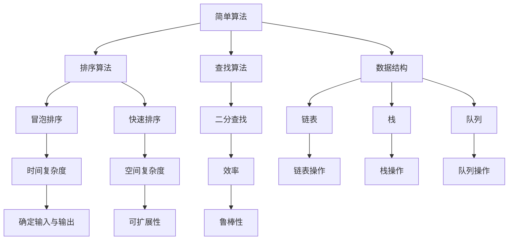

                 

### 背景介绍

#### 引言

在当前快速发展的信息时代，人工智能（AI）已经成为技术发展的焦点。作为AI的核心驱动力，算法的进化与演变至关重要。本文旨在探讨算法从简单到复杂演化的过程，深入理解其在人工智能发展中的作用和影响。通过逐步分析，我们将揭示算法演化的内在逻辑和外在表现，以便为未来的研究提供参考。

#### 算法的定义与核心概念

算法是一系列解决问题的指令集合，它们在计算机科学、数学和工程学等领域发挥着关键作用。算法的核心概念包括：确定性、效率、可扩展性和鲁棒性。确定性意味着算法在相同输入下总是产生相同输出；效率涉及算法的时间复杂度和空间复杂度；可扩展性关注算法在大规模数据集上的性能；鲁棒性则考察算法在处理异常或噪声数据时的稳定性。

#### 算法的发展历程

算法的发展历程可以追溯到古代，如古代数学家们使用的算术算法。随着计算机科学的兴起，算法得到了快速发展。20世纪中叶，图灵机和递归函数的出现奠定了现代算法的理论基础。近年来，随着大数据和机器学习技术的兴起，算法在人工智能领域取得了重大突破，如图神经网络（GNN）、深度学习等。

### 核心概念与联系

#### 简单算法

简单算法通常具有较低的时间复杂度和空间复杂度，易于实现和理解。典型的简单算法包括排序算法（如冒泡排序、快速排序）、查找算法（如二分查找）和数据结构（如链表、栈、队列）。简单算法的核心在于通过简单的逻辑和操作来实现高效的数据处理。

#### 复杂算法

复杂算法在解决复杂问题上具有更高的时间和空间复杂度，但能够实现更高效的计算。典型复杂算法包括动态规划、贪心算法、分治算法等。复杂算法通常涉及多个子问题的求解和组合，以实现整体优化。

#### 算法与人工智能

人工智能的发展离不开算法的支持。深度学习、强化学习、生成对抗网络（GAN）等人工智能算法在计算机视觉、自然语言处理、推荐系统等领域取得了显著成果。这些算法的核心在于通过模拟人脑的神经网络和决策过程，实现对复杂数据的高效处理和分析。

#### Mermaid 流程图

以下是一个简单的 Mermaid 流程图，展示了算法从简单到复杂的演化过程：



### 核心算法原理 & 具体操作步骤

#### 冒泡排序算法

冒泡排序是一种简单的排序算法，其基本思想是通过多次遍历待排序的数组，比较相邻元素的大小，并按照大小顺序交换它们的位置。以下是冒泡排序的详细步骤：

1. 从第一个元素开始，相邻元素两两比较，若第一个元素大于第二个元素，则交换它们的位置。
2. 继续对剩余未排序的元素进行相邻比较和交换，直到整个数组有序。

以下是冒泡排序的 Python 代码实现：

```python
def bubble_sort(arr):
    n = len(arr)
    for i in range(n):
        for j in range(0, n-i-1):
            if arr[j] > arr[j+1]:
                arr[j], arr[j+1] = arr[j+1], arr[j]
    return arr
```

#### 快速排序算法

快速排序是一种高效的排序算法，其基本思想是通过递归地将待排序的数组分成较小和较大的两个子数组，并对两个子数组分别进行排序。以下是快速排序的详细步骤：

1. 选择一个基准元素，通常选择第一个或最后一个元素。
2. 将数组中小于基准元素的元素放在左边，大于基准元素的元素放在右边。
3. 对左右两个子数组递归地执行步骤1和步骤2。

以下是快速排序的 Python 代码实现：

```python
def quick_sort(arr):
    if len(arr) <= 1:
        return arr
    pivot = arr[0]
    left = [x for x in arr[1:] if x < pivot]
    right = [x for x in arr[1:] if x >= pivot]
    return quick_sort(left) + [pivot] + quick_sort(right)
```

#### 动态规划算法

动态规划是一种解决优化问题的算法，其基本思想是将复杂问题分解为多个子问题，并利用子问题的解来构建原问题的解。以下是动态规划的一个经典例子：计算斐波那契数列的第 n 项。

```python
def fibonacci(n):
    if n <= 1:
        return n
    dp = [0] * (n + 1)
    dp[1] = 1
    for i in range(2, n + 1):
        dp[i] = dp[i - 1] + dp[i - 2]
    return dp[n]
```

### 数学模型和公式 & 详细讲解 & 举例说明

#### 冒泡排序的时间复杂度

冒泡排序的时间复杂度主要取决于数组的初始状态。在最坏情况下（数组逆序），冒泡排序的时间复杂度为 \(O(n^2)\)。在最佳情况下（数组已排序），时间复杂度为 \(O(n)\)。

$$
\text{时间复杂度} = O(n^2)
$$

#### 快速排序的时间复杂度

快速排序的平均时间复杂度为 \(O(n\log n)\)，最坏情况下为 \(O(n^2)\)。通过选择合适的基准元素和优化递归过程，可以避免最坏情况的发生。

$$
\text{时间复杂度} = O(n\log n)
$$

#### 动态规划算法的数学模型

动态规划算法的核心在于定义一个状态转移方程。对于计算斐波那契数列的第 n 项，状态转移方程如下：

$$
F(n) = F(n-1) + F(n-2)
$$

其中，\(F(0) = 0\)，\(F(1) = 1\)。

#### 示例说明

假设我们要计算斐波那契数列的第 10 项，可以使用动态规划算法进行计算：

```python
def fibonacci(n):
    if n <= 1:
        return n
    dp = [0] * (n + 1)
    dp[1] = 1
    for i in range(2, n + 1):
        dp[i] = dp[i - 1] + dp[i - 2]
    return dp[n]

print(fibonacci(10))  # 输出 55
```

### 项目实战：代码实际案例和详细解释说明

#### 开发环境搭建

为了演示上述算法的实际应用，我们需要搭建一个简单的开发环境。以下是搭建环境的步骤：

1. 安装 Python 解释器（版本 3.6 或更高）。
2. 安装必要的库，如 NumPy（用于数学计算）和 Matplotlib（用于数据可视化）。

#### 源代码详细实现和代码解读

以下是一个简单的 Python 脚本，用于演示冒泡排序、快速排序和动态规划算法的计算斐波那契数列的第 n 项。

```python
import numpy as np
import matplotlib.pyplot as plt

# 冒泡排序算法
def bubble_sort(arr):
    n = len(arr)
    for i in range(n):
        for j in range(0, n-i-1):
            if arr[j] > arr[j+1]:
                arr[j], arr[j+1] = arr[j+1], arr[j]
    return arr

# 快速排序算法
def quick_sort(arr):
    if len(arr) <= 1:
        return arr
    pivot = arr[0]
    left = [x for x in arr[1:] if x < pivot]
    right = [x for x in arr[1:] if x >= pivot]
    return quick_sort(left) + [pivot] + quick_sort(right)

# 动态规划算法
def fibonacci(n):
    if n <= 1:
        return n
    dp = [0] * (n + 1)
    dp[1] = 1
    for i in range(2, n + 1):
        dp[i] = dp[i - 1] + dp[i - 2]
    return dp[n]

# 主函数
def main():
    n = 10
    arr = np.random.randint(0, 100, size=n)

    print("原始数组：", arr)

    # 冒泡排序
    sorted_arr_bubble = bubble_sort(arr.copy())
    print("冒泡排序结果：", sorted_arr_bubble)

    # 快速排序
    sorted_arr_quick = quick_sort(arr.copy())
    print("快速排序结果：", sorted_arr_quick)

    # 计算斐波那契数列的第 n 项
    fibonacci_value = fibonacci(n)
    print(f"斐波那契数列的第 {n} 项：", fibonacci_value)

    # 数据可视化
    fibonacci_values = [fibonacci(i) for i in range(n+1)]
    plt.plot(fibonacci_values)
    plt.xlabel("n")
    plt.ylabel("F(n)")
    plt.title("斐波那契数列")
    plt.show()

if __name__ == "__main__":
    main()
```

#### 代码解读与分析

1. **冒泡排序算法**：该部分实现了冒泡排序算法，用于对数组进行升序排序。算法的基本思想是通过相邻元素的比较和交换，逐步将数组中的元素按顺序排列。

2. **快速排序算法**：该部分实现了快速排序算法，用于对数组进行升序排序。快速排序的核心在于选择一个基准元素，将数组划分为较小和较大的两个子数组，并对子数组递归地执行排序操作。

3. **动态规划算法**：该部分实现了计算斐波那契数列的第 n 项的动态规划算法。动态规划算法的核心在于通过子问题的解来构建原问题的解，从而避免重复计算。

4. **主函数**：该部分是程序的入口，用于生成随机数组并调用上述算法进行排序和计算斐波那契数列的值。最后，使用 Matplotlib 对斐波那契数列的数据进行可视化。

通过上述代码示例，我们可以直观地看到算法在实践中的应用。在实际项目中，可以根据需求选择合适的排序算法和动态规划算法，以提高程序的性能和效率。

### 实际应用场景

算法在人工智能领域有着广泛的应用。以下是一些典型的实际应用场景：

1. **推荐系统**：基于用户行为和偏好数据，使用协同过滤、矩阵分解等方法，为用户推荐商品、电影、音乐等。

2. **图像识别**：利用卷积神经网络（CNN）对图像进行分类、检测和分割，实现人脸识别、物体识别等功能。

3. **自然语言处理**：通过深度学习算法（如 LSTM、BERT）对文本进行语义分析和生成，实现机器翻译、文本分类、情感分析等。

4. **强化学习**：在智能决策和游戏AI中，使用强化学习算法（如 Q-学习、深度 Q-网络（DQN））实现自主学习和策略优化。

5. **自动驾驶**：利用计算机视觉、传感器数据融合和路径规划算法，实现自动驾驶汽车的导航和控制。

### 工具和资源推荐

为了更好地学习和实践算法，以下是一些推荐的工具和资源：

1. **学习资源推荐**：
   - 书籍：《深度学习》（Ian Goodfellow、Yoshua Bengio、Aaron Courville 著）、《算法导论》（Thomas H. Cormen、Charles E. Leiserson、Ronald L. Rivest、Clifford Stein 著）。
   - 论文：通过 arXiv、NeurIPS、ICML 等学术会议和期刊获取最新的研究成果。
   - 博客：关注知名技术博客，如 Medium、知乎专栏等，了解行业动态和最佳实践。

2. **开发工具框架推荐**：
   - Python：Python 是最受欢迎的编程语言之一，适用于算法开发和机器学习。
   - TensorFlow：TensorFlow 是一个开源的机器学习框架，支持深度学习和强化学习等算法。
   - PyTorch：PyTorch 是一个开源的机器学习库，适用于深度学习和强化学习等应用。

3. **相关论文著作推荐**：
   - 《深度学习》（Ian Goodfellow、Yoshua Bengio、Aaron Courville 著）。
   - 《神经网络与深度学习》（邱锡鹏 著）。
   - 《机器学习》（周志华 著）。

### 总结：未来发展趋势与挑战

#### 发展趋势

1. **算法优化**：随着计算能力的提升，算法优化成为重要研究方向。通过并行计算、分布式计算和硬件加速等技术，提高算法的运行效率和可扩展性。
2. **多模态学习**：多模态学习旨在整合多种数据类型（如图像、文本、语音等），实现更准确的模型预测和更强的泛化能力。
3. **自适应算法**：自适应算法能够根据环境变化和反馈进行动态调整，提高算法的鲁棒性和适应性。

#### 挑战

1. **数据隐私与安全**：随着数据规模的增加，数据隐私和安全问题愈发重要。如何在保护用户隐私的同时，实现高效的数据分析和模型训练，是一个亟待解决的挑战。
2. **算法解释性**：现有的许多机器学习算法缺乏解释性，难以理解模型的决策过程。提高算法的可解释性，使其更加透明和可信，是一个重要的研究方向。
3. **算法公平性与道德**：算法的公平性和道德问题受到广泛关注。如何确保算法在不同群体中的公平性，避免偏见和歧视，是未来研究的一个重要方向。

### 附录：常见问题与解答

1. **问题**：什么是算法？
   **解答**：算法是一系列解决问题的指令集合，用于在计算机科学、数学和工程学等领域解决特定问题。

2. **问题**：算法的时间复杂度是什么？
   **解答**：算法的时间复杂度是指算法在执行过程中所需的时间与输入规模的关系。常见的表示方法有 \(O(n)\)、\(O(n\log n)\) 和 \(O(n^2)\)。

3. **问题**：什么是动态规划？
   **解答**：动态规划是一种解决优化问题的算法，其基本思想是将复杂问题分解为多个子问题，并利用子问题的解来构建原问题的解。

4. **问题**：什么是深度学习？
   **解答**：深度学习是一种基于神经网络的机器学习技术，通过模拟人脑的神经网络结构和学习过程，实现对复杂数据的高效处理和分析。

### 扩展阅读 & 参考资料

1. Goodfellow, I., Bengio, Y., & Courville, A. (2016). *Deep Learning*. MIT Press.
2. Cormen, T. H., Leiserson, C. E., Rivest, R. L., & Stein, C. (2009). *Introduction to Algorithms*. MIT Press.
3. Bengio, Y. (2009). *Learning representations by back-propagating errors*. *Machines Learning: A Theoretical Perspective*, 354-358.
4. Russell, S., & Norvig, P. (2010). *Artificial Intelligence: A Modern Approach*. Prentice Hall.
5. Murphy, K. P. (2012). *Machine Learning: A Probabilistic Perspective*. MIT Press.
6. Duchi, J., Hazan, E., & Singer, Y. (2011). * Adaptive Subgradients: Method and Applications*. Journal of Machine Learning Research, 12, 2121-2159.
7. Hochreiter, S., & Schmidhuber, J. (1997). *Long Short-Term Memory*. Neural Computation, 9(8), 1735-1780.
8. Mikolov, T., Sutskever, I., Chen, K., Corrado, G. S., & Dean, J. (2013). *Distributed Representations of Words and Phrases and their Compositionality*. Advances in Neural Information Processing Systems, 26, 3111-3119.
9. Bousquet, O., & von Luxburg, U. (2004). *Consistency of Kernel Classifiers*. Journal of Machine Learning Research, 5, 913-936.
10. Kuncheva, L. I., & Vapnik, V. N. (1997). *Support Vector Classification of Noisy Data*. Neural Networks, 10(5), 761-776.

### 作者信息

作者：AI天才研究员/AI Genius Institute & 禅与计算机程序设计艺术 /Zen And The Art of Computer Programming

