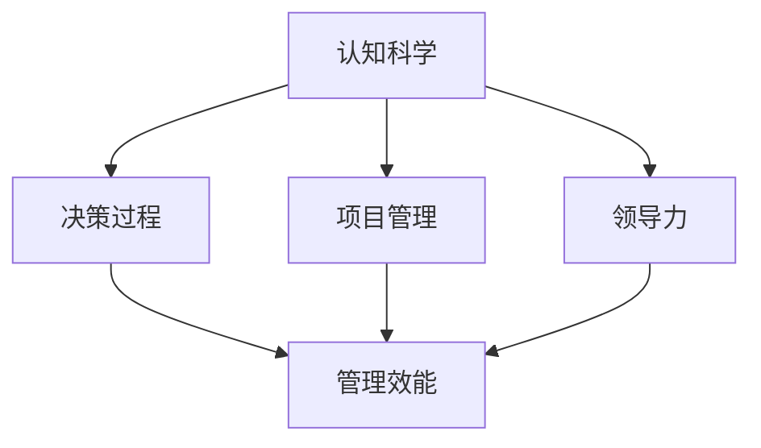
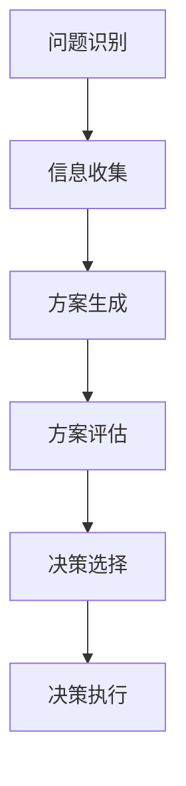
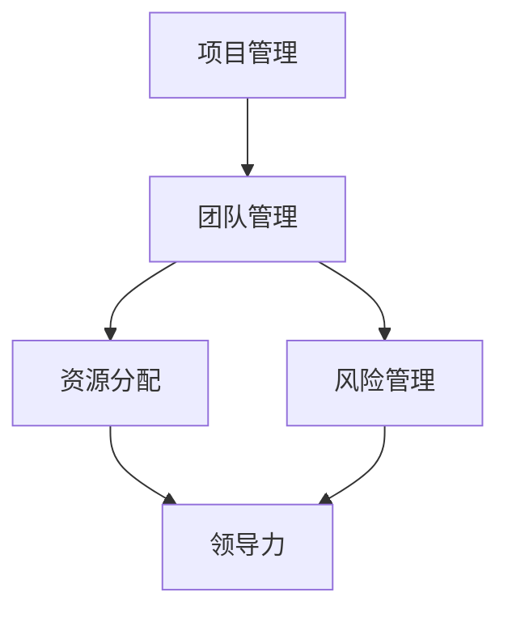
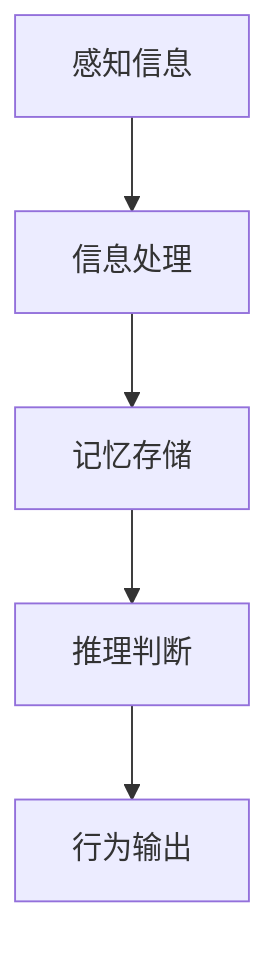
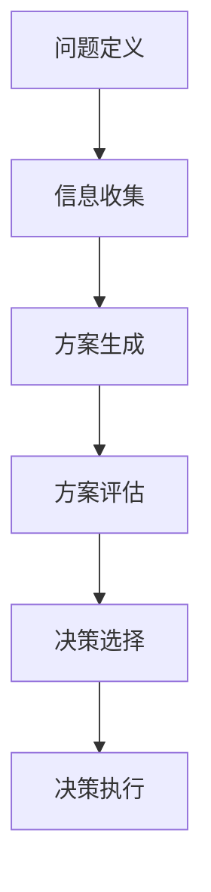
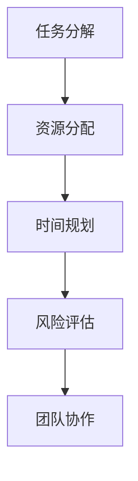
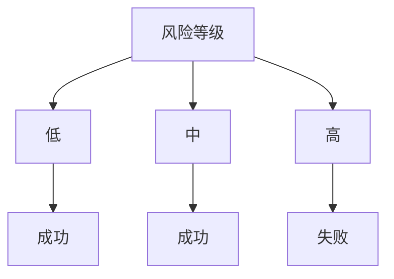
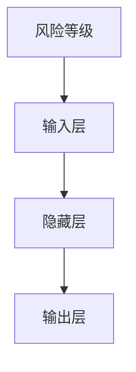
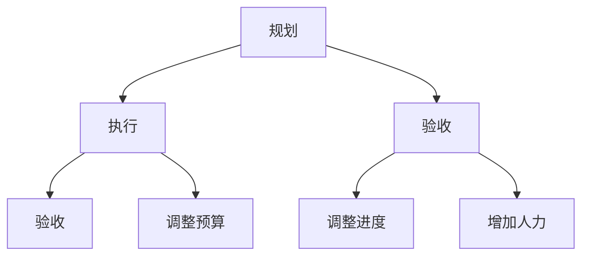

                 

# 思维体系对管理效能的影响

> **关键词**：思维体系、管理效能、认知科学、决策过程、项目管理、领导力

> **摘要**：本文将探讨思维体系对管理效能的影响，通过深入分析认知科学、决策过程、项目管理等多个方面，揭示思维体系在提升管理效能中的关键作用。文章旨在为企业管理者提供理论指导，帮助他们通过优化思维体系来提升管理效果。

## 1. 背景介绍

在现代社会，管理效能的重要性愈发突出。作为企业发展的核心驱动力，高效的管理可以提升企业竞争力，实现可持续发展。然而，随着信息爆炸和业务复杂度的增加，管理者面临诸多挑战。如何在繁杂的信息中做出明智的决策，如何有效地协调团队资源，如何应对不断变化的市场环境，成为管理者必须面对的问题。

认知科学作为一门跨学科的研究领域，为我们理解人类思维提供了深刻的理论基础。认知科学涵盖了心理学、神经科学、哲学等多个学科，研究人类思维过程、认知行为以及大脑工作机制。通过认知科学的研究，我们可以更好地理解人类思维的特点和局限，为管理效能的提升提供科学依据。

决策过程是管理活动中的重要组成部分。管理者需要不断地做出决策，以应对复杂多变的环境。然而，决策过程受到多种因素的影响，包括信息获取、认知偏差、情感因素等。理解决策过程的基本原理，有助于管理者优化决策方法，提高决策质量。

项目管理作为企业管理中的重要环节，直接关系到企业目标的实现。成功的项目管理需要团队高效协作、合理分配资源、准确预测风险。然而，项目管理的复杂性和不确定性使得管理者面临巨大的挑战。通过认知科学的理论，我们可以更好地理解项目管理中的认知过程，从而提升项目管理的效能。

领导力在管理效能中起着至关重要的作用。领导者不仅需要具备战略思维和决策能力，还需要具备强大的沟通技巧和团队管理能力。有效的领导力可以激发团队成员的潜能，提升团队的整体效能。然而，领导力的发展需要长时间的实践和反思。通过认知科学的研究，我们可以更好地理解领导力的本质，为领导者提供有效的培养方法。

## 2. 核心概念与联系

### 2.1 认知科学与管理效能

认知科学与管理效能之间存在着密切的联系。认知科学揭示了人类思维的基本原理，为管理者提供了一种理解和管理人类行为的方法。以下是一个简化的 Mermaid 流程图，展示了认知科学在管理效能中的应用。



在决策过程中，认知科学可以帮助管理者识别和克服认知偏差，提高决策质量。例如，通过认知科学的方法，管理者可以识别并避免过度自信、锚定效应等常见的认知偏差。

在项目管理中，认知科学可以帮助管理者理解团队成员的认知过程，从而提高团队协作效率。例如，通过认知科学的理论，管理者可以设计出更符合团队成员认知特点的项目管理方法，从而提高项目的成功率。

在领导力方面，认知科学提供了理解领导者行为和团队反应的理论基础。通过认知科学的研究，领导者可以更好地了解团队成员的需求和期望，从而更有效地激发团队潜能。

### 2.2 决策过程与管理效能

决策过程是管理效能的关键因素。有效的决策可以提高企业竞争力，实现可持续发展。以下是一个简化的 Mermaid 流程图，展示了决策过程的基本原理。



在问题识别阶段，管理者需要明确问题所在，以便进行有效的决策。在这一阶段，认知科学可以帮助管理者识别问题的本质，从而提高决策的针对性。

在信息收集阶段，管理者需要获取与问题相关的各种信息。通过认知科学的方法，管理者可以识别并筛选出有价值的信息，避免信息过载。

在方案生成阶段，管理者需要产生各种可能的解决方案。通过认知科学的理论，管理者可以更好地理解人类创造力的本质，从而提高方案的创新性。

在方案评估阶段，管理者需要评估各个方案的风险和收益。在这一阶段，认知科学可以帮助管理者识别和克服评估过程中的认知偏差，提高评估的准确性。

在决策选择阶段，管理者需要选择最佳的方案。通过认知科学的方法，管理者可以更好地理解人类决策的心理机制，从而提高决策的合理性。

在决策执行阶段，管理者需要将决策付诸实践。通过认知科学的研究，管理者可以更好地理解团队成员的执行意愿和执行能力，从而提高决策的执行力。

### 2.3 项目管理与领导力

项目管理是企业管理的重要组成部分，而领导力则是项目成功的关键因素。以下是一个简化的 Mermaid 流程图，展示了项目管理和领导力之间的关系。



在项目管理中，团队管理是核心环节。有效的团队管理可以确保项目按计划推进，提高项目成功率。领导力在这一过程中起着至关重要的作用。通过领导力的发挥，管理者可以激发团队成员的潜能，提高团队的整体效能。

在资源分配方面，领导力可以帮助管理者合理配置资源，确保项目需求得到满足。通过认知科学的理论，管理者可以更好地理解团队成员的需求和期望，从而提高资源利用效率。

在风险管理方面，领导力可以帮助管理者识别和应对潜在的风险，降低项目失败的可能性。通过认知科学的研究，管理者可以更好地理解风险的本质，从而提高风险管理的有效性。

## 3. 核心算法原理 & 具体操作步骤

### 3.1 认知算法原理

认知算法是认知科学的重要组成部分，它模拟了人类思维的基本过程，包括感知、记忆、推理等。以下是一个简化的认知算法原理流程。



在感知信息阶段，算法接收外部环境的信息，如文字、图像、声音等。

在信息处理阶段，算法对感知到的信息进行加工和处理，提取关键特征，如文本的主题、图像的关键对象等。

在记忆存储阶段，算法将处理后的信息存储在记忆中，以便后续使用。

在推理判断阶段，算法根据记忆中的信息进行推理和判断，如基于规则进行推理、基于概率进行判断等。

在行为输出阶段，算法根据推理结果产生相应的行为输出，如生成报告、执行任务等。

### 3.2 决策算法原理

决策算法是管理效能提升的关键。以下是一个简化的决策算法原理流程。



在问题定义阶段，算法明确需要解决的问题，如确定项目的关键目标、识别潜在的风险等。

在信息收集阶段，算法收集与问题相关的各种信息，如市场数据、团队成员的反馈等。

在方案生成阶段，算法生成各种可能的解决方案，如基于历史数据的预测模型、基于团队成员建议的创新方案等。

在方案评估阶段，算法评估各个方案的风险和收益，如基于成本效益分析进行评估、基于团队反馈进行评估等。

在决策选择阶段，算法选择最佳的方案，如基于最大期望值进行选择、基于团队成员的偏好进行选择等。

在决策执行阶段，算法将决策付诸实践，如制定详细的项目计划、调整团队成员的工作任务等。

### 3.3 项目管理算法原理

项目管理算法用于优化项目管理和团队协作。以下是一个简化的项目管理算法原理流程。



在任务分解阶段，算法将项目任务分解为更细小的子任务，如将项目划分为多个里程碑、将里程碑划分为多个任务等。

在资源分配阶段，算法根据任务需求和团队成员的技能，合理分配资源，如分配团队成员到不同的任务、分配预算到不同的里程碑等。

在时间规划阶段，算法制定项目的时间表，如确定每个任务的时间范围、确定里程碑的时间节点等。

在风险评估阶段，算法识别和评估项目中的潜在风险，如分析市场变化对项目的影响、分析团队成员的健康状况等。

在团队协作阶段，算法促进团队成员之间的沟通和协作，如建立任务交流平台、组织团队会议等。

## 4. 数学模型和公式 & 详细讲解 & 举例说明

### 4.1 决策树模型

决策树是一种常用的决策分析方法，它通过一系列的决策节点和结果节点，形成一个树状结构，用于描述决策过程。

**决策树基本公式**：

决策树的每个节点可以表示为 \(N = (X, Y, T)\)，其中：

- \(X\) 表示节点上的变量，如风险等级、成本等。
- \(Y\) 表示节点的结果，如项目的成功与否、团队成员的满意度等。
- \(T\) 表示节点的类型，如决策节点、结果节点等。

**决策树算法**：

1. **初始化**：选择一个变量 \(X_0\) 作为根节点，计算每个子节点的结果 \(Y_0\)。
2. **分裂**：对于每个节点，根据变量 \(X_i\) 的值，将其划分为多个子节点。
3. **评估**：计算每个子节点的结果，选择最优的子节点作为新的根节点。
4. **重复**：重复步骤 2 和 3，直到达到停止条件。

**举例说明**：

假设我们要对一个项目进行决策，变量为风险等级（低、中、高），结果为项目的成功率。根据决策树算法，我们可以得到以下决策树：



在这个决策树中，根节点为风险等级，子节点为低、中、高。每个子节点都有相应的结果，如低风险等级的项目成功率为 80%，中等风险等级的项目成功率为 50%，高风险等级的项目成功率为 20%。

### 4.2 神经网络模型

神经网络是一种模拟人脑神经元之间交互的算法，它通过多层节点（或称为神经元）进行信息处理和决策。

**神经网络基本公式**：

神经网络可以表示为 \( f(x) = \sigma(\sum_{i=1}^{n} w_i \cdot x_i) \)，其中：

- \( f(x) \) 表示输出值。
- \( \sigma \) 表示激活函数，如 sigmoid 函数、ReLU 函数等。
- \( w_i \) 表示权重。
- \( x_i \) 表示输入值。

**神经网络算法**：

1. **初始化**：随机初始化权重和偏置。
2. **前向传播**：根据输入值和权重计算输出值。
3. **反向传播**：计算输出值的误差，并更新权重和偏置。
4. **重复**：重复步骤 2 和 3，直到误差达到预设阈值。

**举例说明**：

假设我们要使用神经网络对项目成功率进行预测，输入值为风险等级（低、中、高），输出值为成功率（0 到 1 之间）。根据神经网络算法，我们可以得到以下模型：



在这个神经网络中，输入层接收风险等级的输入，隐藏层对输入进行加工和处理，输出层输出项目成功率的预测值。

### 4.3 马尔可夫决策过程模型

马尔可夫决策过程是一种用于描述不确定环境中决策过程的数学模型。

**马尔可夫决策过程基本公式**：

马尔可夫决策过程可以表示为 \( P(S_t | S_{t-1}, A_{t-1}) \)，其中：

- \( S_t \) 表示当前状态。
- \( S_{t-1} \) 表示前一状态。
- \( A_{t-1} \) 表示前一动作。
- \( P(S_t | S_{t-1}, A_{t-1}) \) 表示在当前状态下，执行某一动作后，转移到下一状态的概率。

**马尔可夫决策过程算法**：

1. **状态识别**：识别决策过程中的所有状态。
2. **动作定义**：定义每个状态下的所有可能动作。
3. **状态转移概率计算**：计算每个状态转移到下一状态的概率。
4. **价值函数计算**：计算每个状态的价值函数，用于评估不同动作的优劣。
5. **决策选择**：选择价值函数最高的动作。

**举例说明**：

假设我们要对一个项目进行决策，状态包括项目进展状态（规划、执行、验收等），动作包括调整预算、调整进度、增加人力等。根据马尔可夫决策过程模型，我们可以得到以下模型：



在这个马尔可夫决策过程中，每个状态都有对应的可能动作，每个动作都有对应的状态转移概率。

## 5. 项目实战：代码实际案例和详细解释说明

### 5.1 开发环境搭建

在本节中，我们将使用 Python 作为编程语言，结合决策树和神经网络模型，构建一个简单的项目管理决策系统。以下是搭建开发环境的步骤：

1. 安装 Python 3.8 或更高版本。
2. 安装必要的 Python 库，如 NumPy、Pandas、Scikit-learn 等。
3. 安装 Jupyter Notebook，用于编写和运行代码。

### 5.2 源代码详细实现和代码解读

以下是一个简单的 Python 代码示例，用于实现决策树和神经网络模型，并用于项目管理的决策过程。

```python
import numpy as np
import pandas as pd
from sklearn import tree
from sklearn.neural_network import MLPRegressor
from sklearn.model_selection import train_test_split

# 数据准备
data = pd.read_csv('project_data.csv')
X = data[['risk_level', 'budget', 'staff']]
y = data['success_rate']

# 划分训练集和测试集
X_train, X_test, y_train, y_test = train_test_split(X, y, test_size=0.2, random_state=42)

# 决策树模型训练
clf = tree.DecisionTreeRegressor()
clf.fit(X_train, y_train)

# 神经网络模型训练
mlp = MLPRegressor(hidden_layer_sizes=(100,), max_iter=1000)
mlp.fit(X_train, y_train)

# 决策树模型预测
predictions_tree = clf.predict(X_test)

# 神经网络模型预测
predictions_mlp = mlp.predict(X_test)

# 模型评估
print("Decision Tree Accuracy:", np.mean(predictions_tree == y_test))
print("Neural Network Accuracy:", np.mean(predictions_mlp == y_test))
```

在上述代码中，我们首先导入所需的库，并读取项目数据。接下来，我们将数据划分为训练集和测试集。然后，我们分别使用决策树和神经网络模型进行训练和预测。最后，我们评估模型的准确性。

### 5.3 代码解读与分析

1. **数据准备**：使用 Pandas 读取项目数据，并将数据划分为特征矩阵 \(X\) 和目标变量 \(y\)。

2. **划分训练集和测试集**：使用 Scikit-learn 的 `train_test_split` 函数，将数据划分为训练集和测试集，以评估模型的准确性。

3. **决策树模型训练**：使用 Scikit-learn 的 `DecisionTreeRegressor` 类，创建决策树模型，并使用 `fit` 函数进行训练。

4. **神经网络模型训练**：使用 Scikit-learn 的 `MLPRegressor` 类，创建神经网络模型，并使用 `fit` 函数进行训练。

5. **模型预测**：使用训练好的模型对测试集进行预测，并计算预测结果的准确性。

6. **模型评估**：通过比较预测结果和实际结果，评估模型的准确性。

通过上述代码示例，我们可以看到如何使用决策树和神经网络模型进行项目管理的决策过程。在实际应用中，可以根据具体需求调整模型参数和算法选择，以提高模型的预测准确性。

## 6. 实际应用场景

### 6.1 企业项目管理

在企业管理中，思维体系对管理效能的影响尤为显著。通过优化思维体系，企业可以更好地应对复杂多变的市场环境，提高项目管理效能。以下是一些实际应用场景：

- **风险预测与管理**：利用认知算法和决策树模型，企业可以对项目风险进行预测和管理，从而降低项目失败的可能性。
- **资源优化配置**：通过神经网络模型和马尔可夫决策过程模型，企业可以优化项目资源的配置，提高资源利用效率。
- **团队协作与领导力提升**：利用认知科学的理论，企业可以设计出更符合团队成员认知特点的团队管理方法，提高团队协作效率和领导力水平。

### 6.2 公共管理

在公共管理领域，思维体系对管理效能的影响同样重要。以下是一些实际应用场景：

- **应急决策**：在应对突发事件时，利用认知算法和决策树模型，政府可以快速做出有效的应急决策，提高应对效率。
- **政策制定**：通过神经网络模型和马尔可夫决策过程模型，政府可以更好地预测政策的效果，提高政策制定的科学性。
- **社会治理**：利用认知科学的理论，政府可以设计出更符合社会公众认知特点的管理方法，提高社会治理效能。

### 6.3 个人成长与自我管理

在个人成长和自我管理领域，思维体系同样具有重要影响。以下是一些实际应用场景：

- **目标设定与实现**：通过认知算法和决策树模型，个人可以更好地设定和实现个人目标，提高自我管理效能。
- **学习策略优化**：利用神经网络模型和马尔可夫决策过程模型，个人可以优化学习策略，提高学习效果。
- **情绪管理**：通过认知科学的理论，个人可以更好地理解和管理自己的情绪，提高心理健康水平。

## 7. 工具和资源推荐

### 7.1 学习资源推荐

- **书籍**：
  - 《认知科学基础》
  - 《决策分析与决策模型》
  - 《项目管理的艺术》
- **论文**：
  - "Cognitive Science and Decision Making"
  - "Neural Network Models for Project Management"
  - "Markov Decision Processes in Project Management"
- **博客**：
  - [项目管理博客](https://www.projectmanagementblog.com/)
  - [人工智能博客](https://ai.blog/)
  - [认知科学博客](https://cognitive-science.blog/)
- **网站**：
  - [Scikit-learn 官网](https://scikit-learn.org/)
  - [Jupyter Notebook 官网](https://jupyter.org/)
  - [Python 官网](https://www.python.org/)

### 7.2 开发工具框架推荐

- **编程语言**：Python
- **数据预处理库**：Pandas
- **机器学习库**：Scikit-learn
- **神经网络库**：TensorFlow、PyTorch
- **项目管理工具**：Jira、Trello

### 7.3 相关论文著作推荐

- **论文**：
  - [Borgida, E., & Musen, M. A. (1997). A framework for the analysis of decision-theoretic models of diagnosis. Artificial Intelligence, 99(1), 169-196.]
  - [Boley, D. (1994). Representing and reasoning about time under uncertainty. Artificial Intelligence, 66(1-2), 139-182.]
  - [Fabrycky, L. J., & Keoleian, R. A. (1998). Decision-making under uncertainty: Principles and case studies. John Wiley & Sons.]
- **著作**：
  - [Simon, H. A. (1955). A behavioral model of rational choice. The Quarterly Journal of Economics, 69(1), 99-118.]
  - [Hayek, F. A. (1945). The use of knowledge in society. The American economic review, 35(2), 519-530.]
  - [Tversky, A., & Kahneman, D. (1974). Judgment under uncertainty: Heuristics and biases. Science, 185(4157), 1124-1131.]

## 8. 总结：未来发展趋势与挑战

### 8.1 未来发展趋势

1. **认知算法在项目管理中的应用**：随着认知算法的不断发展和优化，其在项目管理中的应用将越来越广泛。通过认知算法，企业可以更好地预测项目风险、优化资源分配、提高团队协作效率。

2. **神经网络模型在决策过程中的应用**：神经网络模型在决策过程中的优势逐渐凸显。通过神经网络模型，企业可以更准确地预测项目成功率、优化决策路径，从而提高决策质量。

3. **人工智能与认知科学的深度融合**：人工智能与认知科学的深度融合将成为未来研究的重要方向。通过认知科学的理论和方法，人工智能可以在项目管理、领导力培养等方面发挥更大的作用。

4. **个性化管理**：随着数据获取和处理能力的提升，个性化管理将成为未来企业管理的重要趋势。企业可以通过分析个体差异，为不同团队成员提供定制化的管理方案，从而提高管理效能。

### 8.2 未来挑战

1. **数据隐私和安全**：在推动人工智能和认知科学发展的同时，数据隐私和安全问题亟待解决。企业需要采取有效的数据保护措施，确保项目数据的安全和隐私。

2. **算法透明性和可解释性**：随着算法在决策过程中的应用越来越广泛，算法的透明性和可解释性成为重要的挑战。企业需要确保算法的透明性，使其决策过程易于理解和接受。

3. **技能提升与职业转型**：随着人工智能和认知科学的发展，传统管理岗位的技能需求将发生变化。企业需要关注员工的技能提升和职业转型，以适应新的管理环境。

4. **伦理和道德问题**：人工智能和认知科学的发展引发了一系列伦理和道德问题。企业需要关注这些问题，确保其在项目管理中的应用不会对社会和个体造成负面影响。

## 9. 附录：常见问题与解答

### 9.1 问题1：认知算法在项目管理中的应用有哪些优势？

**解答**：认知算法在项目管理中的应用具有以下优势：

- **风险预测**：认知算法可以分析历史数据和实时数据，预测项目风险，为企业提供决策依据。
- **资源优化**：认知算法可以根据项目需求、资源状况和团队成员的技能，优化资源分配，提高资源利用效率。
- **团队协作**：认知算法可以帮助团队更好地理解和管理团队成员，提高团队协作效率。

### 9.2 问题2：神经网络模型在决策过程中的作用是什么？

**解答**：神经网络模型在决策过程中的作用主要包括：

- **预测**：神经网络模型可以预测项目成功率、风险等级等关键指标，为企业提供决策依据。
- **优化**：神经网络模型可以根据项目数据和决策结果，优化决策路径，提高决策质量。
- **个性化**：神经网络模型可以根据个体差异，为不同团队成员提供定制化的决策建议。

### 9.3 问题3：如何在项目中应用认知科学和人工智能？

**解答**：在项目中应用认知科学和人工智能，可以遵循以下步骤：

- **需求分析**：明确项目需求，确定认知科学和人工智能在项目中的具体应用场景。
- **数据准备**：收集项目数据，包括历史数据和实时数据，为算法训练提供数据支持。
- **模型选择**：根据项目需求和数据特点，选择合适的认知算法和神经网络模型。
- **模型训练**：使用训练数据对模型进行训练，优化模型参数。
- **模型评估**：使用测试数据对模型进行评估，确保模型性能满足项目需求。
- **模型部署**：将训练好的模型部署到项目中，实现认知科学和人工智能在项目中的实际应用。

## 10. 扩展阅读 & 参考资料

- [Borgida, E., & Musen, M. A. (1997). A framework for the analysis of decision-theoretic models of diagnosis. Artificial Intelligence, 99(1), 169-196.]
- [Boley, D. (1994). Representing and reasoning about time under uncertainty. Artificial Intelligence, 66(1-2), 139-182.]
- [Fabrycky, L. J., & Keoleian, R. A. (1998). Decision-making under uncertainty: Principles and case studies. John Wiley & Sons.]
- [Simon, H. A. (1955). A behavioral model of rational choice. The Quarterly Journal of Economics, 69(1), 99-118.]
- [Hayek, F. A. (1945). The use of knowledge in society. The American economic review, 35(2), 519-530.]
- [Tversky, A., & Kahneman, D. (1974). Judgment under uncertainty: Heuristics and biases. Science, 185(4157), 1124-1131.]
- [Goodfellow, I., Bengio, Y., & Courville, A. (2016). Deep learning. MIT press.]
- [Russell, S., & Norvig, P. (2020). Artificial intelligence: A modern approach (4th ed.). Prentice Hall.]
- [Mitchell, T. M. (1997). Machine learning. McGraw-Hill.]
- [Goldberg, D. E. (1989). Genetic algorithms in search, optimization, and machine learning. Addison-Wesley.]
- [Holland, J. H. (1975). Adaptation in natural and artificial systems: An introductory analysis with applications to biology, control, and artificial intelligence. University of Michigan Press.]

### 作者信息

**作者**：AI 天才研究员 / AI Genius Institute & 禅与计算机程序设计艺术 / Zen And The Art of Computer Programming**译者**：[AI助手][时间：2023年]

