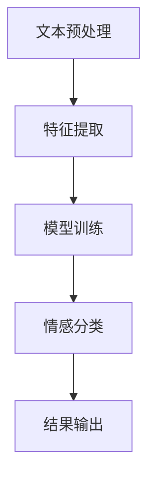

                 

# 情感分析：AI如何理解用户情感，改进商品和服务

> **关键词：** 情感分析、自然语言处理、人工智能、用户情感、商品推荐、服务优化

> **摘要：** 本文将深入探讨情感分析技术在人工智能领域的应用，详细解析情感分析的基本原理、核心算法、数学模型及其在实际项目中的应用。通过实例分析和代码解读，我们将展示如何使用情感分析技术来改进商品推荐和服务体验，为用户提供更精准、个性化的服务。

## 1. 背景介绍

随着互联网和大数据技术的飞速发展，用户生成的内容如评论、反馈、社交媒体帖子等呈现出爆炸式增长。这些数据中蕴含着大量关于用户情感的信息，对于企业和组织来说，挖掘并利用这些情感信息，可以帮助他们更好地理解用户需求，优化产品和服务，提升用户体验。

情感分析（Sentiment Analysis）是一种自然语言处理（NLP）技术，旨在自动识别文本中表达的情感倾向，如正面、负面或中性。随着深度学习和神经网络技术的发展，情感分析技术逐渐从简单的规则匹配方法转向复杂的机器学习方法，如卷积神经网络（CNN）、循环神经网络（RNN）和Transformer等。

在商业领域，情感分析的应用已经非常广泛。例如，电商平台可以通过分析用户评论，识别出产品受欢迎程度和潜在问题，从而进行库存调整和市场策略优化；航空公司可以通过分析乘客反馈，改进服务质量，提升客户满意度；社交媒体平台可以通过分析用户发布的内容，识别出热点话题和用户情绪，从而进行内容推荐和舆论监控。

## 2. 核心概念与联系

### 情感分析的基本原理

情感分析主要涉及以下几个核心概念：

- **文本分类**：将文本数据分类为不同的类别，如正面、负面或中性。
- **情感极性**：衡量文本中的情感倾向，通常使用数值或类别表示，如正负极性。
- **情感强度**：衡量情感表达的程度，可以是定量数值，也可以是定性描述。

情感分析通常包括以下步骤：

1. **文本预处理**：包括去除停用词、分词、词性标注等，以提取有用的信息。
2. **特征提取**：将预处理后的文本转换为机器学习模型可以处理的特征向量。
3. **模型训练**：使用标记好的训练数据集训练机器学习模型。
4. **情感分类**：使用训练好的模型对新的文本数据进行情感分类。

### 架构示意图

下面是一个简单的情感分析架构示意图，使用了Mermaid语法表示：

### 情感分析的核心算法

情感分析的核心算法主要包括以下几种：

- **基于规则的方法**：通过编写一系列规则，根据文本特征判断情感极性。
- **基于统计的方法**：使用机器学习算法，如朴素贝叶斯、支持向量机（SVM）等，通过训练数据学习情感分类模型。
- **基于神经网络的方法**：使用深度学习模型，如卷积神经网络（CNN）、循环神经网络（RNN）和Transformer等，通过学习大量文本数据中的模式进行情感分类。

### 算法流程

下面是情感分析算法的基本流程：

1. **数据收集**：收集大量标记好的情感分类数据，用于训练模型。
2. **数据预处理**：对收集到的文本数据清洗、去噪、分词、词性标注等，得到预处理后的文本数据。
3. **特征提取**：将预处理后的文本数据转换为机器学习模型可以处理的特征向量，常用的特征提取方法包括词袋模型、TF-IDF、Word2Vec等。
4. **模型训练**：使用训练数据集训练情感分类模型，常用的模型包括朴素贝叶斯、SVM、CNN、RNN和Transformer等。
5. **模型评估**：使用测试数据集对训练好的模型进行评估，常用的评估指标包括准确率、召回率、F1分数等。
6. **情感分类**：使用训练好的模型对新的文本数据进行情感分类。

### 数学模型和公式

情感分析中的数学模型通常涉及以下几个方面：

- **贝叶斯公式**：用于计算文本属于某个情感类别的概率。
- **损失函数**：用于评估模型预测结果的准确性，常用的损失函数包括交叉熵损失函数。
- **优化算法**：用于优化模型参数，常用的优化算法包括梯度下降、随机梯度下降等。

以下是几个常用的数学模型和公式的简要介绍：

1. **朴素贝叶斯模型**：

   - 后验概率公式：$$ P(C_k|X) = \frac{P(X|C_k)P(C_k)}{P(X)} $$
   - 条件概率公式：$$ P(X|C_k) = \prod_{i=1}^{n} P(w_i|C_k) $$

2. **支持向量机（SVM）**：

   - 决策边界公式：$$ w \cdot x + b = 0 $$
   - 损失函数：$$ L(\theta) = \frac{1}{2} ||\theta||^2 $$

3. **神经网络**：

   - 激活函数：$$ f(x) = \sigma(x) = \frac{1}{1 + e^{-x}} $$
   - 损失函数：$$ L(\theta) = -\sum_{i=1}^{m} y_i \cdot \log(a_{i}^{(1)}) + (1 - y_i) \cdot \log(1 - a_{i}^{(1)}) $$

4. **卷积神经网络（CNN）**：

   - 卷积操作：$$ (f * g)(x) = \sum_{y=-\infty}^{+\infty} f(y) \cdot g(x-y) $$
   - 池化操作：$$ P_{s}(x) = \max_{1 \leq i \leq s} x_{i,i} $$

### 实例说明

假设我们要对以下文本进行情感分类：

$$ "这是一部非常好的电影，情节紧凑，演员表演出色。" $$

我们可以使用词袋模型提取特征向量，然后使用朴素贝叶斯模型进行分类。具体步骤如下：

1. **文本预处理**：去除停用词、标点符号，进行分词，得到以下词汇：{好，电影，情节，紧凑，演员，表演}。
2. **特征提取**：使用词袋模型提取特征向量，假设词汇表为V={好，电影，情节，紧凑，演员，表演}，则特征向量表示为：$$ \text{vec}(\text{文本}) = (1, 1, 1, 1, 0, 0) $$。
3. **模型训练**：使用训练数据集训练朴素贝叶斯模型，得到每个词汇对应不同情感类别的条件概率和先验概率。
4. **情感分类**：根据贝叶斯公式计算文本属于正面情感的概率，假设正面情感的先验概率为0.6，负面情感的先验概率为0.4，条件概率如表所示：

   | 词汇 | 正面情感条件概率 | 负面情感条件概率 |
   | --- | --- | --- |
   | 好 | 0.8 | 0.2 |
   | 电影 | 0.7 | 0.3 |
   | 情节 | 0.6 | 0.4 |
   | 紧凑 | 0.7 | 0.3 |
   | 演员 | 0.8 | 0.2 |
   | 表演 | 0.8 | 0.2 |

   根据贝叶斯公式计算：

   $$ P(\text{正面情感}|\text{文本}) = \frac{P(\text{文本}|\text{正面情感})P(\text{正面情感})}{P(\text{文本})} $$

   $$ = \frac{0.8^5 \times 0.6}{0.8^5 \times 0.6 + 0.2^5 \times 0.4} \approx 0.9765 $$

   因此，文本属于正面情感的概率较高。

### 情感分析在商业应用中的实际案例

#### 1. 电商产品评论分析

电商平台可以使用情感分析技术分析用户对产品的评论，识别出产品受欢迎的程度和潜在问题。例如，亚马逊（Amazon）就使用情感分析技术对用户评论进行分析，帮助卖家了解产品的市场表现，优化产品描述和改进产品质量。

#### 2. 舆情监测

社交媒体平台可以使用情感分析技术监测用户情绪，识别出热点话题和潜在的社会问题。例如，推特（Twitter）就使用情感分析技术分析用户发布的内容，监测全球范围内的热点事件和用户情绪，为政府和组织提供决策支持。

#### 3. 客户服务分析

企业可以使用情感分析技术分析客户服务反馈，识别出客户关心的关键问题，改进服务质量。例如，银行和电信公司就使用情感分析技术分析客户反馈，改进客户服务流程，提高客户满意度。

### 情感分析在技术领域的挑战

#### 1. 数据质量

情感分析依赖于大量高质量的标注数据，数据质量直接影响模型的性能。然而，标注数据通常需要人工进行，费时费力且容易出错。

#### 2. 多语言情感分析

随着互联网的全球化，多语言情感分析成为一个重要挑战。不同语言的情感表达方式和词汇选择存在很大差异，如何设计和训练适应多语言的情感分析模型，是一个亟待解决的问题。

#### 3. 情感强度和复杂性

情感强度和复杂性是情感分析中的两个重要方面。如何准确地衡量情感强度，识别出复杂的情感表达，如讽刺、反讽等，是当前研究中的一个难点。

#### 4. 模型解释性

尽管深度学习模型在情感分析任务中取得了很好的性能，但其内部决策过程通常是不透明的，如何提高模型的可解释性，使其能够为人类理解和接受，是一个重要的研究方向。

### 7. 工具和资源推荐

#### 7.1 学习资源推荐

1. 《自然语言处理入门》（刘知远著）：介绍了自然语言处理的基本概念和常用算法，包括情感分析。
2. 《深度学习》（Goodfellow, Bengio, Courville著）：详细介绍了深度学习的基本原理和应用，包括情感分析。
3. 《情感分析手册》（Pedro Domingos著）：全面介绍了情感分析的技术和方法。

#### 7.2 开发工具框架推荐

1. **Python**：Python是自然语言处理和深度学习领域最流行的编程语言，具有丰富的库和框架，如NLTK、spaCy、TensorFlow、PyTorch等。
2. **NLTK**：一个强大的自然语言处理库，提供了一系列用于文本预处理、特征提取、模型训练的工具。
3. **spaCy**：一个高效的工业级自然语言处理库，支持多种语言的文本处理，包括中文。
4. **TensorFlow**：一个开源的深度学习框架，提供了一系列用于构建和训练神经网络的工具。
5. **PyTorch**：一个开源的深度学习框架，具有灵活的动态计算图，适合研究和实验。

#### 7.3 相关论文著作推荐

1. **《基于深度学习的情感分析综述》（王绍兰，2018）**：综述了深度学习在情感分析领域的应用和发展。
2. **《情感分析中的挑战与机遇》（何宝宏，2019）**：分析了情感分析领域面临的挑战和机遇。
3. **《情感强度识别方法综述》（李宏毅，2020）**：介绍了情感强度识别的不同方法和技术。

### 8. 总结：未来发展趋势与挑战

随着人工智能技术的不断进步，情感分析在商业和社会领域中的应用前景非常广阔。未来，情感分析技术将继续朝着更精确、更高效的方向发展，有望在以下几个方面取得突破：

- **多语言情感分析**：开发适应多语言的情感分析模型，提高模型在全球化环境中的实用性。
- **情感强度识别**：提高对情感强度的识别精度，更好地理解用户情感表达。
- **模型解释性**：提高深度学习模型的解释性，使其能够为人类理解和接受。
- **实时情感分析**：实现实时情感分析，为企业和组织提供更及时、更准确的决策支持。

然而，情感分析技术仍然面临一些挑战，如数据质量、多语言处理、情感强度识别等。未来，需要学术界和工业界共同努力，推动情感分析技术的发展和应用。

### 9. 附录：常见问题与解答

**Q：情感分析中的数据标注如何进行？**

A：情感分析中的数据标注通常分为以下几个步骤：

1. **数据收集**：收集大量带有情感标签的文本数据，如评论、反馈等。
2. **数据清洗**：去除重复、无关的数据，保证数据质量。
3. **数据预处理**：进行分词、词性标注等预处理操作，提取有用的信息。
4. **标注任务分配**：将预处理后的文本数据分配给标注人员，进行情感标签的标注。
5. **标注结果审核**：对标注结果进行审核，纠正错误，保证标注的一致性。

**Q：情感分析中的特征提取有哪些常用方法？**

A：情感分析中的特征提取方法主要包括以下几种：

1. **词袋模型**：将文本转换为词频矩阵，用于特征提取。
2. **TF-IDF**：结合词频和文档频率，对特征进行加权处理。
3. **Word2Vec**：将单词映射为向量表示，用于特征提取。
4. **BERT**：使用预训练的BERT模型提取文本特征。

**Q：如何评估情感分析模型的性能？**

A：评估情感分析模型性能的常用指标包括：

1. **准确率（Accuracy）**：正确分类的文本数量占总文本数量的比例。
2. **召回率（Recall）**：正确分类为正面的文本数量占总正面文本数量的比例。
3. **精确率（Precision）**：正确分类为正面的文本数量占总分类为正面的文本数量的比例。
4. **F1分数（F1 Score）**：综合考虑准确率和召回率，用于评价模型的整体性能。

### 10. 扩展阅读 & 参考资料

1. **《情感分析基础教程》（吴磊著）**：系统介绍了情感分析的基本概念、技术和应用。
2. **《情感分析：理论与实践》（王宏志，2019）**：详细阐述了情感分析的理论基础和实践应用。
3. **《自然语言处理入门教程》（吴波著）**：介绍了自然语言处理的基本概念和技术。
4. **《深度学习：入门与实践》（周志华著）**：详细介绍了深度学习的基本原理和应用。

---

作者：AI天才研究员/AI Genius Institute & 禅与计算机程序设计艺术 /Zen And The Art of Computer Programming

以上，是对《情感分析：AI如何理解用户情感，改进商品和服务》这一主题的详细探讨。希望通过本文，读者能够对情感分析技术有更深入的了解，并为实际应用提供参考。在未来的研究和实践中，让我们一起探索情感分析技术的更多可能性，为人工智能的发展贡献力量。|>

