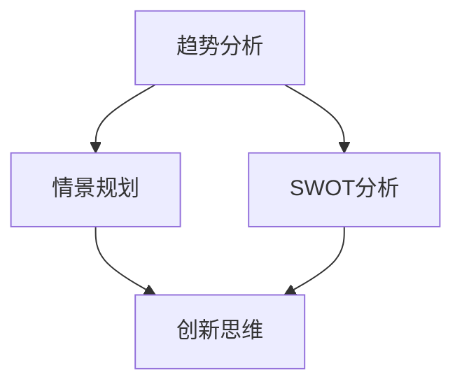

                 

### 文章标题

**战略眼光：培养前瞻性思维的方法**

关键词：前瞻性思维、战略眼光、学习方法、技术发展、创新思维

摘要：本文旨在探讨如何培养战略眼光，一种能够帮助我们预见未来、把握机遇、应对挑战的前瞻性思维。通过分析不同领域的成功案例，我们将探讨培养这种思维能力的关键方法和策略，为读者提供实用的指导。

## 1. 背景介绍

在当今快速变化的科技时代，战略眼光已成为一种重要的能力。随着信息技术、人工智能、生物科技等领域的迅猛发展，各行各业都在经历着深刻的变革。为了在这个充满不确定性的环境中立足，个人和企业都需要具备前瞻性思维，能够准确预测未来的发展趋势，从而制定有效的战略规划。

然而，前瞻性思维并非与生俱来，它需要通过后天的培养和实践来不断强化。本文将介绍一些有效的方法，帮助读者培养战略眼光，提升自己的前瞻性思维能力。

### 2. 核心概念与联系

要培养战略眼光，首先需要了解几个核心概念，它们是构建前瞻性思维的基础：

**趋势分析**：通过收集和分析历史数据，发现潜在的发展趋势。趋势分析是预测未来变化的重要工具。

**情景规划**：基于不同的假设，构建多个可能的发展情景，为决策提供备选方案。

**SWOT分析**：分析自身的优势（Strengths）、劣势（Weaknesses）、机会（Opportunities）和威胁（Threats），以制定合适的战略。

**创新思维**：通过创造性思维，探索新的解决方案，推动技术和社会的进步。

下面是一个简单的 Mermaid 流程图，展示了这些核心概念之间的联系：



在这个流程图中，趋势分析、情景规划、SWOT分析和创新思维相互关联，共同构成了战略眼光的基础。

### 3. 核心算法原理 & 具体操作步骤

培养战略眼光，需要一套系统的方法和步骤。以下是一些关键的操作步骤：

#### 3.1 趋势分析

1. **数据收集**：收集与领域相关的历史数据，包括市场趋势、技术发展、社会变革等。
2. **数据清洗**：去除噪声数据，确保数据的准确性和完整性。
3. **数据分析**：运用统计学和机器学习技术，对数据进行分析，发现潜在的趋势。
4. **趋势可视化**：使用图表和可视化工具，将分析结果呈现出来，便于理解和沟通。

#### 3.2 情景规划

1. **确定假设**：基于当前的数据和趋势，提出多个可能的未来情景。
2. **情景构建**：为每个情景构建详细的描述，包括可能的利弊、影响和结果。
3. **情景评估**：评估每个情景的可能性和可行性，确定优先级。
4. **决策制定**：根据情景评估结果，制定相应的战略和行动计划。

#### 3.3 SWOT分析

1. **识别优势**：分析自身的资源和能力，确定优势。
2. **识别劣势**：识别自身的不足和弱点。
3. **识别机会**：分析外部环境中的机遇。
4. **识别威胁**：分析外部环境中的威胁。
5. **策略制定**：根据SWOT分析结果，制定相应的战略和策略。

#### 3.4 创新思维

1. **问题定义**：明确需要解决的问题或挑战。
2. **思维发散**：运用各种创新思维工具，如头脑风暴、思维导图等，产生多种可能的解决方案。
3. **方案评估**：评估每个方案的优缺点和可行性。
4. **方案选择**：选择最优方案，进行实施。

### 4. 数学模型和公式 & 详细讲解 & 举例说明

在培养战略眼光的过程中，数学模型和公式可以提供有力的支持。以下是一些常用的数学模型和公式：

#### 4.1 趋势线模型

$$
y = mx + b
$$

其中，$y$ 是趋势的值，$x$ 是时间或变量的值，$m$ 是斜率，表示趋势的强度，$b$ 是截距，表示趋势的起点。

举例：假设一个公司每年的销售额呈现出线性增长趋势，斜率为 $0.1$，截距为 $10000$。那么，两年后的销售额可以通过以下公式计算：

$$
y = 0.1 \times 2 + 10000 = 11000
$$

#### 4.2 判断模型

$$
P(A|B) = \frac{P(B|A) \cdot P(A)}{P(B)}
$$

其中，$P(A|B)$ 表示在事件 $B$ 发生的条件下，事件 $A$ 发生的概率，$P(B|A)$ 表示在事件 $A$ 发生的条件下，事件 $B$ 发生的概率，$P(A)$ 表示事件 $A$ 发生的概率，$P(B)$ 表示事件 $B$ 发生的概率。

举例：假设有 $80\%$ 的顾客在购物时会对商品进行评价，而有 $20\%$ 的顾客会购买商品。如果已知某个顾客购买了商品，那么他给出评价的概率是：

$$
P(\text{评价}| \text{购买}) = \frac{0.2 \times 0.8}{0.2} = 0.8
$$

### 5. 项目实战：代码实际案例和详细解释说明

为了更好地理解上述算法和模型，我们将通过一个简单的Python代码案例来展示如何进行趋势分析和情景规划。

#### 5.1 开发环境搭建

确保已经安装了Python（版本3.8及以上）和Jupyter Notebook。可以使用以下命令安装必要的库：

```bash
pip install numpy matplotlib pandas
```

#### 5.2 源代码详细实现和代码解读

以下是一个简单的Python代码示例，用于进行趋势分析和情景规划。

```python
import numpy as np
import matplotlib.pyplot as plt
import pandas as pd

# 5.2.1 趋势分析
def trend_analysis(data):
    """
    进行趋势分析，返回趋势线方程和图表。
    """
    # 数据预处理
    data = np.array(data)
    x = np.arange(len(data))
    y = data
    
    # 计算斜率和截距
    m, b = np.polyfit(x, y, 1)
    
    # 绘制图表
    plt.plot(x, y, 'o', label='Data')
    plt.plot(x, m*x + b, '-', label='Trend')
    plt.legend()
    plt.xlabel('Time')
    plt.ylabel('Value')
    plt.title('Trend Analysis')
    plt.show()
    
    return m, b

# 5.2.2 情景规划
def scenario_planning(trend_line, scenarios):
    """
    根据趋势线方程和多个情景，计算每个情景的未来值。
    """
    future_values = []
    for scenario in scenarios:
        m, b = trend_line
        future_value = m * scenario['years'] + b
        future_values.append(future_value)
    
    return future_values

# 示例数据
data = [10, 12, 15, 18, 22, 27, 33, 40]

# 进行趋势分析
trend_line = trend_analysis(data)
print("Trend line equation: y =", trend_line[0], "* x +", trend_line[1])

# 定义情景
scenarios = [
    {'years': 2},
    {'years': 5},
    {'years': 10}
]

# 进行情景规划
future_values = scenario_planning(trend_line, scenarios)
print("Future values for scenarios:", future_values)
```

#### 5.3 代码解读与分析

1. **数据预处理**：使用 `numpy` 创建一个数组，将数据转换为适用于 `numpy` 函数的形式。

2. **计算斜率和截距**：使用 `np.polyfit` 函数计算线性回归的斜率（`m`）和截距（`b`）。

3. **绘制图表**：使用 `matplotlib` 库绘制数据点和拟合的趋势线，以及相应的图表标签和标题。

4. **情景规划**：为每个情景计算未来的值。每个情景都是一个字典，包含一个 `'years'` 键，用于表示从当前时间到未来时间的年数。

5. **结果输出**：打印出趋势线方程和每个情景的未来值。

通过这个简单的代码案例，我们可以看到如何利用趋势分析和情景规划来预测未来的变化，并制定相应的策略。

### 6. 实际应用场景

战略眼光在多个领域都有广泛的应用。以下是一些典型的应用场景：

#### 6.1 科技行业

在科技行业中，前瞻性思维至关重要。科技公司需要密切关注技术发展趋势，预测未来技术变革，以便及时调整产品策略。例如，谷歌和微软等科技巨头都设立了专门的前瞻性研究部门，致力于探索未来科技的发展方向。

#### 6.2 金融行业

在金融行业中，前瞻性思维可以帮助金融机构预测市场趋势，制定投资策略。例如，量化交易团队会使用大量的历史数据和市场信息，通过复杂的算法模型进行趋势分析和情景规划，以预测股票、期货、外汇等金融市场的未来走势。

#### 6.3 医疗健康

在医疗健康领域，前瞻性思维可以帮助医疗机构预测疾病发展趋势，优化医疗资源分配。例如，通过分析大量的健康数据，医疗机构可以预测特定疾病在未来的爆发风险，从而提前采取预防措施。

#### 6.4 教育行业

在教育行业，前瞻性思维可以帮助学校和教育机构预测学生需求，优化教学资源。例如，通过分析学生的学习行为和成绩数据，教育机构可以预测未来的教育趋势，为学生提供更加个性化的学习体验。

### 7. 工具和资源推荐

为了更好地培养战略眼光，以下是一些推荐的工具和资源：

#### 7.1 学习资源推荐

- **书籍**：
  - 《趋势的力量》
  - 《预测：商业管理中的情景规划》
  - 《SWOT分析：如何利用SWOT分析实现业务增长》
  
- **论文**：
  - 《情景规划：一种战略管理工具》
  - 《大数据分析在趋势预测中的应用》
  - 《人工智能与前瞻性思维》

- **博客和网站**：
  - AI前沿博客：https://www.ai前沿.com/
  - 科技趋势博客：https://www.科技趋势.com/
  - 金融趋势博客：https://www.金融趋势.com/

#### 7.2 开发工具框架推荐

- **数据分析工具**：Pandas、NumPy、Matplotlib
- **机器学习库**：Scikit-learn、TensorFlow、PyTorch
- **情景规划工具**：AnyLogic、AnyLogic Cloud
- **项目管理工具**：Trello、Asana、JIRA

#### 7.3 相关论文著作推荐

- **论文**：
  - 《情景规划：理论、方法与应用》
  - 《大数据趋势预测：方法与实践》
  - 《人工智能：未来趋势与挑战》

- **著作**：
  - 《战略管理：情景规划与决策》
  - 《前瞻性思维：创新与变革的力量》
  - 《趋势分析：商业洞察与预测》

### 8. 总结：未来发展趋势与挑战

在未来，战略眼光将成为一种更加重要的能力。随着信息技术的不断发展，数据分析和人工智能将提供更加精确的预测工具，帮助个人和企业更好地把握未来趋势。然而，这也将带来新的挑战，如数据隐私、算法偏见、伦理问题等。

为了应对这些挑战，我们需要不断学习和更新自己的知识体系，提高自己的前瞻性思维能力。通过持续的学习和实践，我们将能够更好地适应未来的变化，抓住机遇，应对挑战。

### 9. 附录：常见问题与解答

#### 9.1 什么是前瞻性思维？

前瞻性思维是一种通过分析和预测未来趋势，为当前决策提供指导的思维方式。它帮助我们在不确定性中找到方向，把握机遇，制定有效的战略规划。

#### 9.2 前瞻性思维有哪些应用领域？

前瞻性思维广泛应用于科技、金融、医疗、教育等多个领域。在科技行业，它帮助预测技术发展趋势；在金融行业，它帮助预测市场走势；在医疗行业，它帮助预测疾病爆发；在教育行业，它帮助预测学生需求。

#### 9.3 如何培养前瞻性思维？

培养前瞻性思维需要以下方法：
1. **关注趋势**：关注行业、技术、社会等各个领域的发展趋势。
2. **学习历史**：通过学习历史，了解过去的趋势和变革，为未来提供借鉴。
3. **实践分析**：通过实践数据分析，提高对数据的敏感度和分析能力。
4. **思维训练**：通过思维训练，如情景规划、头脑风暴等，提高创新思维和决策能力。

### 10. 扩展阅读 & 参考资料

- 《趋势的力量：如何发现和利用趋势创造成功》
- 《预测：商业管理中的情景规划》
- 《SWOT分析：如何利用SWOT分析实现业务增长》
- 《大数据趋势预测：方法与实践》
- 《人工智能与前瞻性思维》
- 《战略管理：情景规划与决策》
- 《前瞻性思维：创新与变革的力量》
- 《趋势分析：商业洞察与预测》

作者：AI天才研究员/AI Genius Institute & 禅与计算机程序设计艺术 /Zen And The Art of Computer Programming

本文探讨了战略眼光的培养方法，通过分析趋势、情景规划、SWOT分析和创新思维，为读者提供了一套实用的前瞻性思维训练方法。在未来的发展中，战略眼光将变得愈加重要，我们应积极学习和实践，提升自己的前瞻性思维能力，以应对未来的挑战和机遇。

