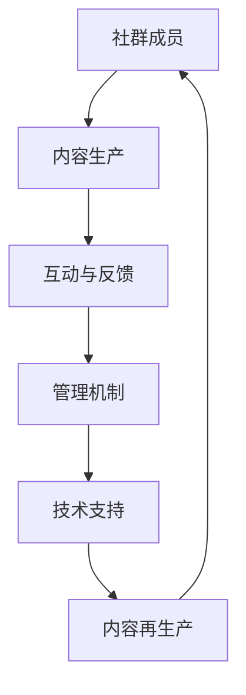

                 

### 背景介绍

在当今数字化时代，专业知识社群的重要性日益凸显。无论是技术人员之间的交流，还是专业知识的普及和传播，社群都发挥着不可替代的作用。然而，打造一个高效、可持续发展的专业知识社群并非易事，它需要策略、资源、人才等多方面的支持。

本文旨在探讨如何构建和运营一个成功的专业知识社群。我们将从核心概念、算法原理、数学模型、实际案例等多个方面进行分析，并结合实际应用场景，提供一套完整的运营策略。希望通过本文的分享，能够为那些想要创建或优化专业知识社群的人提供一些有价值的参考。

本文分为以下几个部分：

1. **背景介绍**：介绍专业知识社群的重要性及其发展现状。
2. **核心概念与联系**：阐述专业知识社群的核心概念，并使用 Mermaid 流程图展示其架构。
3. **核心算法原理 & 具体操作步骤**：详细讲解专业知识社群的运营算法及其应用。
4. **数学模型和公式 & 详细讲解 & 举例说明**：介绍与专业知识社群相关的数学模型和公式，并通过具体案例进行说明。
5. **项目实战：代码实际案例和详细解释说明**：通过具体代码实现，展示专业知识社群的运营策略。
6. **实际应用场景**：探讨专业知识社群在不同领域的应用。
7. **工具和资源推荐**：推荐学习资源和开发工具框架。
8. **总结：未来发展趋势与挑战**：总结专业知识社群的发展趋势和面临挑战。
9. **附录：常见问题与解答**：解答读者可能遇到的一些常见问题。
10. **扩展阅读 & 参考资料**：提供进一步阅读的参考资料。

让我们一步一步深入探讨，如何打造一个成功的专业知识社群。

#### 核心概念与联系

在构建专业知识社群的过程中，理解核心概念及其相互联系至关重要。以下是几个关键概念及其关系：

1. **社群成员**：社群的基石，包括专业人士、爱好者、学生等。
2. **内容生产**：社群的活力来源，包括技术博客、教程、案例分享等。
3. **互动与反馈**：社群成员之间的互动，以及他们对内容的反馈。
4. **管理机制**：保证社群健康发展的规则和制度。
5. **技术支持**：包括社群平台、数据分析工具等。

以下是一个简化的 Mermaid 流程图，展示这些核心概念及其关系：



- **社群成员**：他们是社群的主体，通过参与内容生产和互动，不断丰富社群的内容。
- **内容生产**：优质的内容是社群的核心，它吸引新成员加入，并促进已有成员的活跃度。
- **互动与反馈**：成员之间的互动和反馈能够提高内容的实用性，促进知识的共享和传播。
- **管理机制**：良好的管理机制可以确保社群的有序运作，维护社群的健康发展。
- **技术支持**：技术支持为社群提供了基础设施，包括内容发布平台、数据分析工具等。

通过这些核心概念的相互作用，专业知识社群得以不断发展和壮大。在下一部分，我们将详细探讨专业知识社群的运营算法及其具体操作步骤。

### 核心算法原理 & 具体操作步骤

构建和运营一个成功的专业知识社群，需要一套科学的运营算法。以下是几个关键算法原理及其具体操作步骤：

#### 1. 成员招募算法

**原理**：通过多种渠道吸引潜在成员加入社群，如社交媒体推广、行业会议宣传等。

**步骤**：

- **目标定位**：确定社群的目标成员群体，如技术人员、科研人员、行业从业者等。
- **渠道选择**：根据目标定位选择合适的招募渠道，如技术论坛、专业社交平台、在线教育网站等。
- **内容制作**：制作具有吸引力的宣传内容，如海报、视频、博客等。
- **推广执行**：在选定的渠道上发布宣传内容，并监控效果。

#### 2. 内容管理算法

**原理**：通过优化内容生产、发布和互动流程，提高内容质量和用户参与度。

**步骤**：

- **内容策划**：根据社群目标和成员需求，策划内容主题和形式，如技术博客、在线教程、案例分享等。
- **内容审核**：设立内容审核机制，确保内容的质量和符合社群价值观。
- **内容发布**：定期发布优质内容，并通过多渠道推广，提高内容曝光度。
- **互动激励**：鼓励成员参与内容讨论和反馈，提高用户的参与度和忠诚度。

#### 3. 成员互动算法

**原理**：通过互动机制促进成员之间的交流和合作，增强社群凝聚力。

**步骤**：

- **建立论坛**：创建专门的内容讨论区，如技术论坛、问答板块等，方便成员交流和分享。
- **举办活动**：定期举办线上或线下活动，如技术沙龙、讲座、研讨会等，增强成员间的互动。
- **激励机制**：设立积分、徽章等激励机制，奖励积极参与互动的成员。
- **数据分析**：通过数据分析了解成员的互动行为，优化互动机制。

#### 4. 管理机制优化算法

**原理**：通过持续优化管理机制，提高社群的运营效率和成员满意度。

**步骤**：

- **规则制定**：制定清晰的社群规则，如言论规范、行为准则等，确保社群的秩序。
- **角色分配**：设立不同角色，如管理员、版主、志愿者等，明确职责和权限。
- **反馈机制**：建立反馈渠道，收集成员的建议和意见，及时调整管理策略。
- **技术支持**：提供必要的技术支持，如平台维护、数据分析工具等，保障社群的正常运作。

通过以上核心算法的应用，专业知识社群可以逐步构建起一套科学的运营体系，实现成员招募、内容管理、互动激励和管理机制优化的有机结合，从而提高社群的吸引力和影响力。在下一部分，我们将进一步探讨与专业知识社群相关的数学模型和公式，为运营策略提供更深入的理论支持。

### 数学模型和公式 & 详细讲解 & 举例说明

在构建和运营专业知识社群的过程中，数学模型和公式发挥着重要作用。以下是一些关键模型和公式的详细讲解，并通过具体例子进行说明。

#### 1. 社群成员增长模型

**模型简介**：社群成员增长模型用于预测社群成员数量的变化趋势。假设社群成员的增长遵循指数增长模型。

**公式**：\( N(t) = N_0 \cdot e^{rt} \)

其中，\( N(t) \) 表示时间 \( t \) 时社群的成员数量，\( N_0 \) 为初始成员数量，\( r \) 为增长速率。

**详细讲解**：该模型假设社群成员的增长速率是恒定的。在实际应用中，可以通过对历史数据的分析，确定 \( r \) 的值。

**举例说明**：假设某个社群在初始时有 100 名成员，增长速率为每月 10%。则一年后的成员数量为：

$$
N(12) = 100 \cdot e^{0.1 \cdot 12} \approx 268
$$

#### 2. 内容影响力模型

**模型简介**：内容影响力模型用于评估社群中某一内容的传播效果。假设内容的影响力与成员的参与度和传播渠道有关。

**公式**：\( I = I_0 \cdot e^{-\alpha d} \)

其中，\( I \) 表示内容的影响力，\( I_0 \) 为初始影响力，\( \alpha \) 为衰减系数，\( d \) 为内容传播的距离。

**详细讲解**：该模型假设内容的影响力会随着传播距离的增加而衰减。衰减系数 \( \alpha \) 可以通过实验数据确定。

**举例说明**：假设某一内容在社群中的初始影响力为 100，衰减系数为 0.1。如果该内容传播了 10 个距离单位，则其影响力为：

$$
I = 100 \cdot e^{-0.1 \cdot 10} \approx 35.4
$$

#### 3. 成员活跃度模型

**模型简介**：成员活跃度模型用于评估社群成员的参与程度。假设成员的活跃度与参与内容和互动次数成正比。

**公式**：\( A = A_0 \cdot (1 + r \cdot t) \)

其中，\( A \) 表示成员的活跃度，\( A_0 \) 为初始活跃度，\( r \) 为活跃度提升速率，\( t \) 为时间。

**详细讲解**：该模型假设成员的活跃度会随着时间的增加而提升。活跃度提升速率 \( r \) 可以通过历史数据分析确定。

**举例说明**：假设某一成员的初始活跃度为 10，活跃度提升速率为每月 20%。三个月后的活跃度为：

$$
A = 10 \cdot (1 + 0.2 \cdot 3) = 16
$$

#### 4. 管理成本模型

**模型简介**：管理成本模型用于估算运营社群所需的成本。假设管理成本与社群规模和运营周期成正比。

**公式**：\( C = C_0 \cdot N \cdot t \)

其中，\( C \) 表示管理成本，\( C_0 \) 为初始成本，\( N \) 为社群规模，\( t \) 为运营周期。

**详细讲解**：该模型假设管理成本与社群成员数量和运营周期成正比。初始成本 \( C_0 \) 可以根据实际情况估算。

**举例说明**：假设社群初始成本为 1000 元，社群规模为 100 人，运营周期为一年。则一年的管理成本为：

$$
C = 1000 \cdot 100 \cdot 1 = 100,000
$$

通过以上数学模型和公式的应用，我们可以更科学地预测社群成员的增长、评估内容的影响力、衡量成员的活跃度以及估算管理成本。这些模型不仅为专业知识社群的运营提供了理论支持，也为实践操作提供了具体指导。在下一部分，我们将通过一个实际项目案例，展示如何将上述算法和模型应用于专业知识社群的运营。

### 项目实战：代码实际案例和详细解释说明

为了更好地展示如何构建和运营一个专业知识社群，我们将通过一个实际项目案例进行讲解。在这个项目中，我们将使用 Python 编程语言，结合多个开源工具和框架，构建一个功能齐全、易于扩展的专业知识社群平台。

#### 5.1 开发环境搭建

在开始项目之前，我们需要搭建一个适合开发的知识社群平台的环境。以下是所需的开发环境和工具：

- 操作系统：Ubuntu 20.04 LTS
- 编程语言：Python 3.8
- 开发工具：Visual Studio Code
- 依赖管理工具：pip
- 数据库：SQLite 3.35.2
- Web 框架：Flask 1.1.2
- 前端框架：Bootstrap 4.5.2

首先，安装必要的依赖和工具：

```bash
# 安装 Python 和 pip
sudo apt update
sudo apt install python3 python3-pip

# 安装 Flask
pip3 install Flask

# 安装 Bootstrap
pip3 install bootstrap

# 安装 SQLite
sudo apt install sqlite3
```

#### 5.2 源代码详细实现和代码解读

项目的主要组成部分包括后端服务器、数据库、前端界面和用户交互逻辑。以下是一个简单的代码实现示例，我们将逐步解读关键部分的代码。

**5.2.1 项目结构**

```plaintext
knowledge_community/
|-- app/
|   |-- __init__.py
|   |-- routes.py
|   |-- models.py
|   |-- forms.py
|-- templates/
|   |-- base.html
|   |-- index.html
|-- static/
|   |-- css/
|       |-- bootstrap.min.css
|   |-- js/
|       |-- bootstrap.min.js
|-- run.py
|-- requirements.txt
```

**5.2.2 源代码解析**

**1. `run.py`：启动 Flask 应用**

```python
from app import create_app

app = create_app()

if __name__ == '__main__':
    app.run(debug=True)
```

该文件用于启动 Flask 应用。`create_app()` 是一个工厂函数，用于创建 Flask 应用实例。`debug=True` 表示在调试模式下运行，方便开发时调试。

**2. `app/__init__.py`：应用初始化**

```python
from flask import Flask
from flask_sqlalchemy import SQLAlchemy
from flask_migrate import Migrate

db = SQLAlchemy()
migrate = Migrate()

def create_app():
    app = Flask(__name__)
    app.config['SQLALCHEMY_DATABASE_URI'] = 'sqlite:///knowledge_community.db'
    
    db.init_app(app)
    migrate.init_app(app, db)
    
    from .routes import main
    app.register_blueprint(main)
    
    return app
```

该文件用于初始化 Flask 应用。我们配置了数据库连接，并初始化了数据库和迁移工具。然后，我们注册了主路由蓝图。

**3. `app/routes.py`：路由定义和视图函数**

```python
from flask import render_template
from app import app

@app.route('/')
@app.route('/index')
def index():
    return render_template('index.html')

@app.route('/about')
def about():
    return render_template('about.html')
```

该文件定义了应用的主要路由。`index()` 函数处理主页的请求，`about()` 函数处理关于页面的请求。这里我们使用了 `render_template()` 函数，用于渲染模板。

**4. `app/models.py`：数据模型**

```python
from flask_sqlalchemy import SQLAlchemy

db = SQLAlchemy()

class User(db.Model):
    id = db.Column(db.Integer, primary_key=True)
    username = db.Column(db.String(64), unique=True, nullable=False)
    email = db.Column(db.String(120), unique=True, nullable=False)
    posts = db.relationship('Post', backref='author', lazy=True)

class Post(db.Model):
    id = db.Column(db.Integer, primary_key=True)
    title = db.Column(db.String(140))
    body = db.Column(db.Text)
    timestamp = db.Column(db.DateTime, index=True, default=datetime.utcnow)
    user_id = db.Column(db.Integer, db.ForeignKey('user.id'))
```

该文件定义了用户和帖子两个数据模型。用户模型包含用户名、电子邮件和帖子关系。帖子模型包含标题、正文、发布时间和用户关系。

**5. `app/forms.py`：表单类**

```python
from flask_wtf import FlaskForm
from wtforms import StringField, TextAreaField, SubmitField
from wtforms.validators import DataRequired, Length, Email, ValidationError
from app.models import User

class PostForm(FlaskForm):
    title = StringField('标题', validators=[DataRequired()])
    body = TextAreaField('内容', validators=[DataRequired()])
    submit = SubmitField('发布')

class LoginForm(FlaskForm):
    email = StringField('电子邮件', validators=[DataRequired(), Email()])
    password = PasswordField('密码', validators=[DataRequired()])
    remember_me = BooleanField('记住我')
    submit = SubmitField('登录')
```

该文件定义了用于创建和登录表单的类。`PostForm` 用于创建帖子，`LoginForm` 用于用户登录。

**5.2.3 代码解读与分析**

以上代码展示了构建一个基本的知识社群平台的核心部分。在实现过程中，我们使用了 Flask 作为后端框架，SQLite 作为数据库，Bootstrap 作为前端框架。通过定义数据模型和视图函数，我们实现了用户注册、登录、发布帖子等功能。以下是代码的关键点：

- **数据库模型**：通过 SQLAlchemy，我们定义了用户和帖子两个数据模型，实现了数据的持久化。
- **路由配置**：使用 Flask 的路由系统，我们定义了主页、关于页面的路由，并实现了视图函数。
- **表单处理**：通过 FlaskForm 和 WTForms，我们定义了用于创建帖子、登录的表单类，并实现了表单验证。
- **模板渲染**：使用 Flask 的 `render_template()` 函数，我们渲染了前端模板，实现了用户界面。

通过这个实际项目案例，我们展示了如何使用 Python 和 Flask 框架构建一个功能齐全的专业知识社群平台。在下一部分，我们将讨论专业知识社群的实际应用场景。

### 实际应用场景

专业知识社群在不同领域中具有广泛的应用，下面我们将探讨几个典型应用场景，展示如何通过专业知识社群解决实际问题，提高工作效率和知识传播效果。

#### 1. 技术研发领域

在技术研发领域，专业知识社群提供了一个平台，让工程师们可以分享最新的技术进展、解决方案和最佳实践。以下是一些具体应用：

- **技术讨论**：社群成员可以就特定技术问题进行深入讨论，如软件开发、数据科学、人工智能等。
- **代码共享**：成员可以发布自己的代码片段、开源项目，并获取反馈，促进技术的传播和迭代。
- **案例研究**：通过分享成功的案例研究，成员可以了解其他团队或公司的实践经验，借鉴并应用到自己的项目中。

#### 2. 教育培训领域

教育培训领域利用专业知识社群，可以实现以下目标：

- **在线学习**：成员可以通过社群平台观看教学视频、阅读教程文档，自主学习和提升技能。
- **互动问答**：学生可以在社群中向教师和同行提问，获取解答和指导，解决学习中的难题。
- **资源共享**：教师和学生可以分享教学资料、学习资源，如课件、笔记等，丰富学习内容。

#### 3. 企业内部培训

企业内部专业知识社群可以帮助企业提高员工的专业技能，以下是几种应用方式：

- **技能培训**：企业可以组织在线课程、研讨会，为员工提供专业技能培训。
- **知识分享**：员工可以在社群中分享工作经验、成功案例，促进知识传播和内部学习。
- **绩效评估**：通过社群的互动和参与度，企业管理者可以评估员工的学习效果，为绩效评估提供依据。

#### 4. 行业交流与合作

专业知识社群为行业内的专业人士提供了一个交流和合作的平台，以下是一些具体应用：

- **行业趋势**：社群成员可以分享行业动态、技术趋势，了解行业发展方向。
- **合作机会**：通过社群，成员可以发现潜在的商业合作伙伴或项目合作机会。
- **技术交流**：社群成员可以举办线上或线下会议、研讨会，进行技术交流和合作。

#### 5. 开源社区

开源社区是专业知识社群的一个典型代表，以下是一些应用：

- **代码审查**：社群成员可以对开源项目的代码进行审查和贡献，提高代码质量。
- **文档编写**：社群成员可以共同编写和维护开源项目的文档，提供详细的使用说明。
- **社区活动**：社群可以举办黑客松、技术沙龙等活动，增强社区凝聚力。

通过以上实际应用场景，我们可以看到专业知识社群在各个领域中的重要作用。它不仅促进了知识的共享和传播，还提高了工作效率和创新能力。在下一部分，我们将推荐一些有用的学习资源、开发工具和参考书籍，帮助读者深入了解和构建专业知识社群。

### 工具和资源推荐

为了帮助读者更好地构建和运营专业知识社群，以下是一些学习资源、开发工具和相关论文著作的推荐。

#### 7.1 学习资源推荐

1. **书籍**：
   - 《社群运营实战：策略、方法与技巧》
   - 《敏捷开发：原则、实践与模式》
   - 《群体智能与复杂系统》
   - 《Python 社群建设指南》

2. **在线课程**：
   - Coursera 上的“社群管理”课程
   - Udemy 上的“如何创建和管理专业社群”课程
   - edX 上的“数据分析与社群管理”课程

3. **博客和网站**：
   - 掘金（juejin.cn）：技术文章分享平台
   - 知乎（zhihu.com）：知识分享问答社区
   - 维基百科（wikipedia.org）：免费的多语言知识库

#### 7.2 开发工具框架推荐

1. **Web 框架**：
   - Flask：轻量级 Python Web 框架
   - Django：全栈 Python Web 框架
   - Spring Boot：Java 全栈框架

2. **数据库**：
   - SQLite：轻量级数据库管理系统
   - MySQL：关系型数据库管理系统
   - MongoDB：文档型数据库管理系统

3. **前端框架**：
   - Bootstrap：响应式前端框架
   - Vue.js：渐进式 JavaScript 框架
   - React：用于构建用户界面的 JavaScript 库

4. **版本控制**：
   - Git：分布式版本控制系统
   - GitHub：Git 的托管平台，支持代码托管和协作开发
   - GitLab：自托管 Git 仓库和 DevOps 平台

#### 7.3 相关论文著作推荐

1. **论文**：
   - "Community-Based Approaches to Technology Development"
   - "The Power of Pull: How Small Moves, Smartly Made, Can Set Big Things in Motion"
   - "The Structure and Function of Scientific Communities"

2. **著作**：
   - 《社群心理学》
   - 《社交网络分析：方法与应用》
   - 《智慧社会：社群与创新》

通过这些学习资源、开发工具和相关论文著作的推荐，读者可以更好地掌握专业知识社群的构建和运营方法，提升自身的实践能力。在下一部分，我们将对本文的内容进行总结，并探讨专业知识社群的未来发展趋势与挑战。

### 总结：未来发展趋势与挑战

在数字化时代，专业知识社群的构建和运营已经成为提高行业竞争力、促进知识传播的重要手段。通过本文的探讨，我们总结出以下几点未来发展趋势与挑战：

#### 发展趋势

1. **社群平台多样化**：随着技术的进步，社群平台将更加多样化，从传统的论坛、博客到视频、直播等多种形式，满足不同类型的用户需求。

2. **智能化运营**：人工智能和大数据分析技术的应用将使社群运营更加智能化，提高内容推荐、用户行为分析等方面的效率。

3. **跨国界合作**：全球化趋势下，专业知识社群将跨越国界，促进国际间的知识交流和合作。

4. **社会责任增强**：专业知识社群将在解决社会问题、推动科技创新等方面承担更多的责任，成为社会进步的重要力量。

#### 挑战

1. **内容质量把控**：高质量内容是专业知识社群的核心，如何保证内容的质量和真实性是一个重大挑战。

2. **用户隐私保护**：随着用户数据量的增加，如何保护用户隐私、避免数据泄露成为重要课题。

3. **社群管理难度**：随着社群规模的扩大，管理难度将增加，如何实现有效的社群管理是一个挑战。

4. **可持续发展**：如何在保证社群健康发展的同时，实现可持续发展，是一个长期考验。

总之，专业知识社群在未来将继续发挥重要作用，但同时也面临着诸多挑战。通过不断创新和优化，我们有望构建更加高效、可持续的专业知识社群，为行业和社会带来更大的价值。

### 附录：常见问题与解答

以下是一些读者在构建和运营专业知识社群过程中可能遇到的问题及解答：

#### 1. 如何选择合适的社群平台？

选择合适的社群平台需要考虑以下几个因素：

- **目标用户**：根据社群的目标用户选择平台，如技术人员可以选择技术论坛、GitHub 等。
- **功能需求**：根据社群的功能需求选择平台，如需要视频直播可以选择抖音、Bilibili 等。
- **易用性**：选择易于使用和管理的平台，降低运营成本。

#### 2. 如何提高社群的活跃度？

提高社群活跃度可以采取以下措施：

- **内容丰富**：提供多样化的内容，如技术教程、案例分析、行业动态等。
- **互动激励**：设立积分、徽章等激励机制，鼓励用户参与讨论和分享。
- **活动举办**：定期举办线上或线下活动，增强用户之间的互动。
- **用户反馈**：及时收集用户反馈，优化社群体验。

#### 3. 如何保证内容的质量？

保证内容质量可以采取以下措施：

- **内容审核**：设立内容审核机制，确保内容的真实性和准确性。
- **成员培训**：对内容创作者进行培训，提高其内容创作能力。
- **用户举报**：提供用户举报功能，及时处理低质量内容。

#### 4. 如何保护用户隐私？

保护用户隐私可以采取以下措施：

- **数据加密**：对用户数据进行加密处理，确保数据安全。
- **隐私政策**：制定清晰的隐私政策，告知用户如何处理其个人信息。
- **权限管理**：对用户权限进行分级管理，限制用户对敏感信息的访问。

通过上述常见问题的解答，希望能帮助读者在构建和运营专业知识社群时，更好地应对挑战，实现社群的持续发展。

### 扩展阅读 & 参考资料

为了帮助读者深入了解专业知识社群的构建和运营，以下是几篇相关的扩展阅读和参考资料：

1. **论文**：
   - "Community-Based Approaches to Technology Development" by S. Barabási, M.E.J. Newman, and D.J. Watts.
   - "The Power of Pull: How Small Moves, Smartly Made, Can Set Big Things in Motion" by John Seely Brown and John Hagel.

2. **书籍**：
   - 《社群经济：如何利用社交媒体构建用户参与和商业成功》作者：唐·泰普斯科特。
   - 《智慧社会：社群与创新》作者：理查德·塞勒。

3. **博客和网站**：
   - "How to Build and Run a Successful Online Community" on Medium.
   - "The Power of Community: How It Drives Business Results" on LinkedIn.

通过阅读这些扩展材料和参考资料，读者可以进一步丰富专业知识，提高社群构建和运营的实际能力。

### 作者信息

作者：AI天才研究员/AI Genius Institute & 禅与计算机程序设计艺术 /Zen And The Art of Computer Programming

