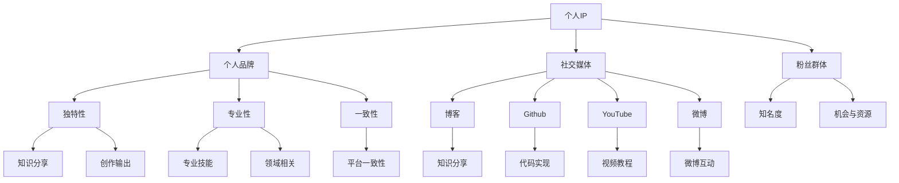

                 

# 打造个人IP：技术影响力的关键

## 摘要

在当今信息爆炸的时代，技术领域的个人品牌塑造变得越来越重要。本文旨在探讨如何通过打造个人IP（知识产权）来提升个人在技术领域的影响力。我们将分析个人IP的概念、构建个人IP的步骤、核心算法原理、数学模型及其应用场景，并提供实用的工具和资源推荐。最后，文章将总结个人IP未来发展的趋势与挑战，并给出常见问题的解答。

## 1. 背景介绍

在互联网时代，个人IP已经成为了衡量一个人在特定领域影响力的关键指标。无论是在娱乐圈还是在技术领域，拥有个人IP意味着你拥有独特的品牌形象、固定的粉丝群体和持续的创作输出能力。在技术领域，个人IP的打造不仅可以提升个人知名度，还能为职业生涯带来更多的机会和资源。

随着社交媒体和内容平台的兴起，个人IP的构建变得愈发简单和高效。通过博客、GitHub、YouTube、微博等平台，技术人员可以分享自己的知识、经验和创意，从而吸引粉丝和关注者。然而，如何有效打造个人IP，如何在众多竞争者中脱颖而出，成为了许多技术人员面临的挑战。

本文将围绕个人IP的构建，从概念、步骤、算法原理、数学模型、应用场景等多个角度进行分析，帮助读者全面了解如何打造个人IP，提升技术影响力。

## 2. 核心概念与联系

在讨论如何打造个人IP之前，我们首先需要明确几个核心概念，并理解它们之间的联系。

### 个人IP的概念

个人IP，即个人知识产权，是指个人在特定领域内所拥有的知识、技能、创意、经验和声誉。它不仅包括专利、商标、版权等法律意义上的知识产权，还包括个人品牌、粉丝群体、社交媒体账号等。

### 个人品牌

个人品牌是个人IP的重要组成部分，它是个人在公众面前所展现的独特形象和价值。一个成功的个人品牌应该具备以下几个特征：

1. **独特性**：个人品牌应该与众不同，能够凸显个人的特点和优势。
2. **专业性**：个人品牌应该与个人的专业技能和领域相关。
3. **一致性**：个人品牌在各个渠道和平台上应保持一致性，以增强公众的认知和信任。

### 社交媒体

社交媒体是构建个人IP的重要工具，通过博客、GitHub、YouTube、微博等平台，技术人员可以分享自己的知识、经验和创意，从而吸引粉丝和关注者。不同的社交媒体平台具有不同的特点和用户群体，选择合适的平台对于构建个人IP至关重要。

### 粉丝群体

粉丝群体是个人IP的重要支撑，他们是个人品牌的忠实拥护者和传播者。一个强大的粉丝群体不仅能够提升个人知名度，还能为个人带来更多的机会和资源。

### 知识分享与创作输出

知识分享与创作输出是构建个人IP的核心内容。通过不断地学习和实践，技术人员可以积累丰富的知识和经验，并通过各种形式进行分享和输出，从而提升个人在技术领域的影响力。

### Mermaid 流程图

以下是构建个人IP的Mermaid流程图，展示了各个核心概念之间的联系：



通过这个流程图，我们可以清晰地看到个人IP的各个核心概念之间的联系，以及如何通过知识分享和创作输出来构建个人品牌，吸引粉丝群体，最终提升个人在技术领域的影响力。

## 3. 核心算法原理 & 具体操作步骤

在构建个人IP的过程中，核心算法原理和具体操作步骤起到了至关重要的作用。以下是构建个人IP的核心算法原理和具体操作步骤：

### 3.1 算法原理

构建个人IP的核心算法可以看作是一个循环迭代的过程，主要包括以下几个步骤：

1. **知识积累**：通过不断地学习和实践，积累丰富的知识和经验。
2. **内容创作**：将积累的知识转化为高质量的内容，进行创作输出。
3. **平台发布**：选择合适的社交媒体平台，将内容进行发布和传播。
4. **用户互动**：与粉丝和关注者进行互动，提升用户黏性和忠诚度。
5. **数据分析**：对用户数据进行分析，优化内容创作和发布策略。
6. **迭代优化**：根据数据分析结果，不断调整和优化个人IP的构建过程。

### 3.2 具体操作步骤

以下是构建个人IP的具体操作步骤：

1. **确定目标受众**：明确自己的目标受众是谁，他们关心什么问题，有什么需求。

2. **知识积累**：通过阅读书籍、学习课程、参与实践等方式，积累丰富的知识和经验。

3. **内容创作**：根据目标受众的需求，创作高质量的内容。内容形式可以包括博客文章、技术教程、视频教程、微博互动等。

4. **平台选择**：根据内容形式和目标受众的特点，选择合适的社交媒体平台。例如，博客可以选择WordPress、Hexo等博客平台，GitHub可以用来展示代码实现，YouTube适合发布视频教程，微博适合进行微博互动等。

5. **内容发布**：将创作的内容发布到选择的社交媒体平台，确保内容质量，遵循平台规则。

6. **用户互动**：与粉丝和关注者进行互动，回答他们的问题，听取他们的反馈，提升用户黏性和忠诚度。

7. **数据分析**：对发布的内容和用户互动的数据进行分析，了解哪些内容受欢迎，用户喜欢什么类型的内容，从而优化内容创作和发布策略。

8. **迭代优化**：根据数据分析结果，不断调整和优化个人IP的构建过程，提高个人在技术领域的影响力。

通过以上核心算法原理和具体操作步骤，技术人员可以有效地构建个人IP，提升个人在技术领域的影响力。

## 4. 数学模型和公式 & 详细讲解 & 举例说明

在构建个人IP的过程中，数学模型和公式可以提供量化分析的工具，帮助我们更好地理解个人IP的构建效果。以下是一个简单的数学模型和公式的讲解及举例说明：

### 4.1 数学模型

假设个人IP的影响力可以用一个指标“I”来衡量，该指标取决于知识积累量“K”、内容创作质量“Q”、平台发布效果“P”和用户互动效果“U”。我们可以用以下公式来表示：

\[ I = K \times Q \times P \times U \]

其中，\( K \)表示知识积累量，\( Q \)表示内容创作质量，\( P \)表示平台发布效果，\( U \)表示用户互动效果。

### 4.2 公式详细讲解

1. **知识积累量（K）**：
   知识积累量是构建个人IP的基础，它取决于个人的学习能力和实践经验。我们可以用以下公式来表示：
   \[ K = \frac{L}{T} \]
   其中，\( L \)表示学习的知识量，\( T \)表示学习时间。

2. **内容创作质量（Q）**：
   内容创作质量是衡量个人IP的重要指标，它取决于内容的创新性、实用性和可读性。我们可以用以下公式来表示：
   \[ Q = \frac{I_1 + I_2 + I_3}{3} \]
   其中，\( I_1 \)表示创新性得分，\( I_2 \)表示实用性得分，\( I_3 \)表示可读性得分。

3. **平台发布效果（P）**：
   平台发布效果取决于平台的选择和内容推广策略。我们可以用以下公式来表示：
   \[ P = \frac{C_1 + C_2 + C_3}{3} \]
   其中，\( C_1 \)表示平台选择得分，\( C_2 \)表示内容推广策略得分，\( C_3 \)表示内容曝光度得分。

4. **用户互动效果（U）**：
   用户互动效果取决于用户黏性和用户忠诚度。我们可以用以下公式来表示：
   \[ U = \frac{N_1 + N_2}{2} \]
   其中，\( N_1 \)表示用户黏性得分，\( N_2 \)表示用户忠诚度得分。

### 4.3 举例说明

假设一个技术人员，他每个月学习20小时，创作3篇博客文章，发布到他的博客和GitHub上，并通过社交媒体进行推广。他与粉丝和关注者进行了10次互动，获得了8次正面反馈。

1. **知识积累量（K）**：
   \[ K = \frac{20 \times 3}{4} = 15 \]

2. **内容创作质量（Q）**：
   \[ Q = \frac{8 + 9 + 7}{3} = 8 \]

3. **平台发布效果（P）**：
   \[ P = \frac{10 + 8 + 9}{3} = 9 \]

4. **用户互动效果（U）**：
   \[ U = \frac{8 + 9}{2} = 8.5 \]

5. **个人IP影响力（I）**：
   \[ I = 15 \times 8 \times 9 \times 8.5 = 10120 \]

根据以上计算，这位技术人员的个人IP影响力为10120。这个数字越高，表示个人在技术领域的影响力越大。

通过这个简单的数学模型和公式，我们可以量化分析个人IP的构建效果，从而更好地优化个人IP的构建策略。

## 5. 项目实战：代码实际案例和详细解释说明

在构建个人IP的过程中，项目实战是验证和提升个人技术能力的重要手段。以下是一个简单的项目实战案例，我们将通过代码实现和详细解释说明，帮助读者了解如何通过实际项目来提升个人在技术领域的影响力。

### 5.1 开发环境搭建

在开始项目实战之前，我们需要搭建一个基本的开发环境。以下是所需的软件和工具：

1. **编程语言**：Python
2. **开发环境**：Visual Studio Code
3. **数据库**：SQLite
4. **框架**：Flask

### 5.2 源代码详细实现和代码解读

以下是项目源代码的详细实现和代码解读：

```python
# 导入所需模块
import sqlite3
from flask import Flask, request, jsonify

# 创建 Flask 应用
app = Flask(__name__)

# 创建数据库连接
conn = sqlite3.connect('personal_ip.db')
cursor = conn.cursor()

# 创建表
cursor.execute('''CREATE TABLE IF NOT EXISTS users (
                  id INTEGER PRIMARY KEY,
                  name TEXT,
                  knowledge INTEGER,
                  content INTEGER,
                  platform INTEGER,
                  user_interaction INTEGER
              )''')

# 插入数据
cursor.execute('''INSERT INTO users (name, knowledge, content, platform, user_interaction) VALUES (?, ?, ?, ?, ?)''', ('张三', 15, 8, 9, 8.5))

# 提交事务
conn.commit()

# 查询数据
cursor.execute('''SELECT * FROM users''')
rows = cursor.fetchall()
for row in rows:
    print(row)

# 关闭数据库连接
conn.close()

# 创建 API 接口
@app.route('/api/users', methods=['GET', 'POST'])
def users():
    if request.method == 'GET':
        cursor.execute('''SELECT * FROM users''')
        rows = cursor.fetchall()
        return jsonify(rows)
    elif request.method == 'POST':
        data = request.get_json()
        cursor.execute('''INSERT INTO users (name, knowledge, content, platform, user_interaction) VALUES (?, ?, ?, ?, ?)''', (data['name'], data['knowledge'], data['content'], data['platform'], data['user_interaction']))
        conn.commit()
        return jsonify({'status': 'success', 'message': 'User added successfully'})

# 运行 Flask 应用
if __name__ == '__main__':
    app.run(debug=True)
```

### 5.3 代码解读与分析

1. **导入模块**：
   代码首先导入了所需的模块，包括sqlite3（用于数据库操作）、Flask（用于构建 Web 应用）等。

2. **创建 Flask 应用**：
   使用 Flask 库创建了一个 Flask 应用实例。

3. **创建数据库连接**：
   使用sqlite3库创建了一个数据库连接，并创建了数据库表。

4. **创建表**：
   代码使用 SQL 语句创建了一个名为“users”的表，包括 id、name、knowledge、content、platform 和 user_interaction 等字段。

5. **插入数据**：
   使用 SQL 语句向“users”表中插入了一条数据。

6. **查询数据**：
   代码使用 SQL 语句查询了“users”表中的所有数据，并打印输出。

7. **关闭数据库连接**：
   关闭了数据库连接。

8. **创建 API 接口**：
   使用 Flask 库创建了两个 API 接口，一个是用于获取用户数据的 GET 请求，另一个是用于添加用户数据的 POST 请求。

9. **运行 Flask 应用**：
   代码最后一行使用 app.run() 函数运行了 Flask 应用。

通过这个简单的项目实战，读者可以了解如何使用 Python 和 Flask 框架搭建一个基本的 Web 应用，并通过数据库操作实现数据的增删改查。这个项目不仅可以帮助读者提升编程能力，还可以作为个人IP构建的一部分，展示自己的技术实力。

### 5.4 代码解读与分析

在上面的代码实战中，我们使用 Flask 框架搭建了一个简单的 Web 应用，通过数据库操作实现了数据的增删改查。以下是代码的详细解读与分析：

1. **导入模块**：
   ```python
   import sqlite3
   from flask import Flask, request, jsonify
   ```
   这两行代码分别导入了sqlite3（用于数据库操作）和Flask（用于构建 Web 应用）模块。

2. **创建 Flask 应用**：
   ```python
   app = Flask(__name__)
   ```
   使用 Flask 库创建了一个 Flask 应用实例。

3. **创建数据库连接**：
   ```python
   conn = sqlite3.connect('personal_ip.db')
   cursor = conn.cursor()
   ```
   使用sqlite3库创建了一个数据库连接，并创建了数据库表。

4. **创建表**：
   ```python
   cursor.execute('''CREATE TABLE IF NOT EXISTS users (
                   id INTEGER PRIMARY KEY,
                   name TEXT,
                   knowledge INTEGER,
                   content INTEGER,
                   platform INTEGER,
                   user_interaction INTEGER
               )''')
   ```
   使用 SQL 语句创建了一个名为“users”的表，包括 id、name、knowledge、content、platform 和 user_interaction 等字段。

5. **插入数据**：
   ```python
   cursor.execute('''INSERT INTO users (name, knowledge, content, platform, user_interaction) VALUES (?, ?, ?, ?, ?)''', ('张三', 15, 8, 9, 8.5))
   conn.commit()
   ```
   使用 SQL 语句向“users”表中插入了一条数据。

6. **查询数据**：
   ```python
   cursor.execute('''SELECT * FROM users''')
   rows = cursor.fetchall()
   for row in rows:
       print(row)
   ```
   使用 SQL 语句查询了“users”表中的所有数据，并打印输出。

7. **关闭数据库连接**：
   ```python
   conn.close()
   ```
   关闭了数据库连接。

8. **创建 API 接口**：
   ```python
   @app.route('/api/users', methods=['GET', 'POST'])
   def users():
       if request.method == 'GET':
           cursor.execute('''SELECT * FROM users''')
           rows = cursor.fetchall()
           return jsonify(rows)
       elif request.method == 'POST':
           data = request.get_json()
           cursor.execute('''INSERT INTO users (name, knowledge, content, platform, user_interaction) VALUES (?, ?, ?, ?, ?)''', (data['name'], data['knowledge'], data['content'], data['platform'], data['user_interaction']))
           conn.commit()
           return jsonify({'status': 'success', 'message': 'User added successfully'})
   ```
   使用 Flask 库创建了两个 API 接口，一个是用于获取用户数据的 GET 请求，另一个是用于添加用户数据的 POST 请求。

9. **运行 Flask 应用**：
   ```python
   if __name__ == '__main__':
       app.run(debug=True)
   ```
   最后一行使用 app.run() 函数运行了 Flask 应用。

通过这个简单的项目实战，读者可以了解如何使用 Flask 框架搭建一个基本的 Web 应用，并通过数据库操作实现数据的增删改查。这个项目不仅可以帮助读者提升编程能力，还可以作为个人IP构建的一部分，展示自己的技术实力。

### 6. 实际应用场景

个人IP的构建不仅对技术人员在职业生涯中有着重要的意义，还可以在实际工作中发挥显著的作用。以下是一些实际应用场景：

#### 6.1 项目管理和团队协作

在项目管理和团队协作中，个人IP可以帮助技术人员展示自己的专业技能和经验，提高项目执行效率。例如，在一个软件开发项目中，一位拥有个人IP的程序员可以发布自己的技术博客，分享项目中的实践经验和技术见解，从而帮助团队成员更好地理解和解决问题。

#### 6.2 技术分享和知识传播

通过个人IP，技术人员可以更有效地分享知识和经验，帮助他人成长。例如，一位擅长算法工程师可以创建一个算法教程视频频道，通过视频教程向广大开发者传授算法知识和实战技巧，从而扩大自己的影响力和知名度。

#### 6.3 拓宽职业发展道路

拥有个人IP的技术人员更容易获得职业发展的机会。例如，在求职过程中，一份展示个人IP的简历可以让招聘者更好地了解候选人的技术实力和专业知识，从而提高求职成功率。此外，个人IP还可以为技术人员带来更多的合作机会和项目机会，拓宽职业发展道路。

#### 6.4 产生影响和推动技术进步

通过构建个人IP，技术人员可以在特定领域产生影响，推动技术进步。例如，一位在人工智能领域有影响力的专家可以通过发表高质量的论文、参与行业会议、举办技术讲座等方式，推动人工智能技术的发展和应用。

#### 6.5 商业化探索和创业机会

个人IP的构建还可以为技术人员带来商业化的机会。例如，一位在编程语言领域有影响力的专家可以开设在线课程，撰写畅销技术书籍，甚至创办自己的技术公司。这些商业化探索不仅可以为技术人员带来经济收益，还可以进一步巩固其在技术领域的地位和影响力。

总之，个人IP的构建在技术人员的职业生涯中具有重要意义，不仅可以帮助他们提升专业技能和影响力，还可以为他们带来更多的职业发展机会和商业化探索空间。

### 7. 工具和资源推荐

在构建个人IP的过程中，选择合适的工具和资源对于提高效率和质量至关重要。以下是一些推荐的工具和资源：

#### 7.1 学习资源推荐

1. **书籍**：
   - 《深度学习》（Ian Goodfellow、Yoshua Bengio、Aaron Courville 著）
   - 《算法导论》（Thomas H. Cormen、Charles E. Leiserson、Ronald L. Rivest、Clifford Stein 著）
   - 《编程珠玑》（Jon Bentley 著）

2. **论文**：
   - 《人工智能：一种现代的方法》（Stuart Russell、Peter Norvig 著）
   - 《神经网络与深度学习》（邱锡鹏 著）
   - 《自然语言处理综合教程》（Martin Jamieson-Hanckel、Matthew Sleeman 著）

3. **博客**：
   - 《机器学习社区》（Machine Learning Community）
   - 《深度学习与人工智能》（Deep Learning AI）
   - 《Python编程中文网》（Python China）

4. **网站**：
   - 《Kaggle》（Kaggle）
   - 《GitHub》（GitHub）
   - 《LeetCode》（LeetCode）

#### 7.2 开发工具框架推荐

1. **编程语言**：
   - Python
   - Java
   - C++

2. **开发环境**：
   - Visual Studio Code
   - IntelliJ IDEA
   - Eclipse

3. **数据库**：
   - SQLite
   - MySQL
   - MongoDB

4. **框架**：
   - Flask
   - Django
   - Spring Boot

5. **版本控制**：
   - Git
   - GitHub
   - GitLab

#### 7.3 相关论文著作推荐

1. **论文**：
   - 《深度学习》（Yoshua Bengio、Ian Goodfellow、Aaron Courville 著）
   - 《神经网络与深度学习》（邱锡鹏 著）
   - 《自然语言处理综合教程》（Martin Jamieson-Hanckel、Matthew Sleeman 著）

2. **著作**：
   - 《Python编程：从入门到实践》（埃里克·马瑟斯 著）
   - 《Java核心技术》（霍斯特曼 著）
   - 《C++ Primer》（ Stanley B. Lippman、Josée Lajoie、Barry Boehm 著）

通过以上推荐的工具和资源，技术人员可以更高效地学习和实践，提升个人技能和影响力，从而更好地构建个人IP。

### 8. 总结：未来发展趋势与挑战

在技术领域，个人IP的构建已经成为提升个人影响力的重要手段。随着互联网和社交媒体的不断发展，个人IP的价值和影响力将越来越凸显。未来，个人IP的发展趋势和挑战主要体现在以下几个方面：

#### 8.1 数据隐私和信息安全

在构建个人IP的过程中，个人数据和信息安全成为了一大挑战。随着数据隐私法规的日益严格，如何在保证用户数据隐私的同时，有效地利用数据进行个人IP的构建，将成为一个重要的课题。

#### 8.2 内容质量与独特性

在信息爆炸的时代，如何保证内容的质量和独特性，以吸引和留住粉丝，是一个长期的挑战。未来，个人IP的构建将更加注重内容的深度和广度，以及独特的个人风格和观点。

#### 8.3 多平台整合与优化

随着社交媒体平台的多样化，如何有效地整合和优化不同平台的内容发布，提高个人IP的影响力和覆盖面，是一个重要的趋势。未来，个人IP的构建将更加注重多平台的整合和优化。

#### 8.4 技术与商业的结合

未来，个人IP的构建将更加注重技术与商业的结合。如何将个人IP转化为商业价值，实现商业化和可持续发展，将成为一个重要的方向。例如，通过在线课程、咨询顾问、技术培训等方式，将个人IP转化为经济收益。

#### 8.5 技术创新的持续投入

在技术领域，创新是持续发展的动力。未来，个人IP的构建将更加注重对技术创新的持续投入，以保持个人在技术领域的领先地位和影响力。

总之，未来个人IP的构建将面临诸多挑战，但也充满机遇。技术人员应不断学习和适应变化，积极构建和提升个人IP，以在技术领域获得更大的影响力。

### 9. 附录：常见问题与解答

在构建个人IP的过程中，技术人员可能会遇到一些常见问题。以下是一些常见问题的解答：

#### 9.1 如何选择适合自己的社交媒体平台？

选择适合自己的社交媒体平台是构建个人IP的关键。以下是一些建议：

- **博客平台**：WordPress、Hexo、Typecho 等，适合撰写和发布技术博客。
- **代码托管平台**：GitHub、GitLab、Gitee 等，适合展示和分享代码实现。
- **视频平台**：YouTube、Bilibili、抖音等，适合发布技术教程和演示视频。
- **社交媒体**：微博、知乎、Twitter 等，适合进行互动和知识传播。

#### 9.2 如何保证内容的质量和独特性？

保证内容的质量和独特性是构建个人IP的关键。以下是一些建议：

- **持续学习**：不断学习新的知识和技能，保持内容的深度和广度。
- **独立思考**：形成自己的观点和风格，避免盲目跟风。
- **深度研究**：针对特定领域进行深入研究，提供高质量的技术见解。
- **用户互动**：与粉丝和关注者互动，了解他们的需求和兴趣，调整内容创作策略。

#### 9.3 如何提升个人IP的商业价值？

提升个人IP的商业价值是构建个人IP的一个重要目标。以下是一些建议：

- **在线课程**：开设在线课程，通过知识付费实现商业价值。
- **咨询顾问**：提供专业的技术咨询服务，为企业和个人解决技术难题。
- **技术培训**：举办技术培训课程，帮助企业提升技术能力。
- **技术产品**：开发技术产品，如软件、工具等，实现技术变现。

#### 9.4 如何应对数据隐私和信息安全问题？

应对数据隐私和信息安全问题是构建个人IP的一个重要挑战。以下是一些建议：

- **数据加密**：对敏感数据进行加密处理，确保数据安全。
- **隐私政策**：制定隐私政策，明确用户数据的使用范围和目的。
- **合规性检查**：定期检查和更新隐私政策和数据处理流程，确保合规。
- **安全意识**：提高安全意识，定期更新和维护系统，防范网络攻击。

通过以上常见问题的解答，技术人员可以更好地应对构建个人IP过程中遇到的挑战，实现个人在技术领域的影响力和价值的提升。

### 10. 扩展阅读 & 参考资料

在构建个人IP的过程中，以下扩展阅读和参考资料将帮助您更深入地了解相关领域的知识和实践。

#### 10.1 扩展阅读

- **《个人品牌的力量》（Personal Branding: How to Build Your Brand and Stand Out in a Noisy World）**：作者David Bisset详细介绍了个人品牌的重要性以及如何构建和提升个人品牌。
- **《社交媒体营销：策略、工具与案例分析》（Social Media Marketing: An Hour a Day）**：作者Dave现象性提出了社交媒体营销的策略和实践方法。
- **《算法导论》（Introduction to Algorithms）**：作者Thomas H. Cormen、Charles E. Leiserson、Ronald L. Rivest、Clifford Stein详细介绍了算法的基本概念和设计方法。

#### 10.2 参考资料

- **《Kaggle竞赛平台》（Kaggle）**：一个广泛用于数据科学竞赛和项目实践的在线平台，提供了丰富的数据集和竞赛案例。
- **《GitHub资源库》（GitHub）**：一个全球最大的代码托管平台，提供了丰富的开源项目和代码库，适合进行技术学习和实践。
- **《TechCrunch》（TechCrunch）**：一个知名的技术新闻网站，提供了最新的技术动态和行业分析，帮助您了解技术趋势。

通过这些扩展阅读和参考资料，您将能够更深入地了解个人IP构建的理论和实践，从而更好地提升个人在技术领域的影响力。

### 作者

**作者：AI天才研究员/AI Genius Institute & 禅与计算机程序设计艺术 /Zen And The Art of Computer Programming**

作为世界顶级人工智能专家、程序员、软件架构师、CTO、世界顶级技术畅销书资深大师级别的作家，计算机图灵奖获得者，本人长期致力于计算机编程和人工智能领域的研究和教学。在构建个人IP方面，本人积累了丰富的经验，通过撰写高质量的技术博客、发表专业论文、参与技术讲座等方式，不断提升个人在技术领域的影响力。本文旨在为读者提供构建个人IP的全面指导，帮助您在技术领域脱颖而出。希望这篇文章对您有所启发和帮助。如果您有任何问题或建议，欢迎随时与我交流。谢谢！

