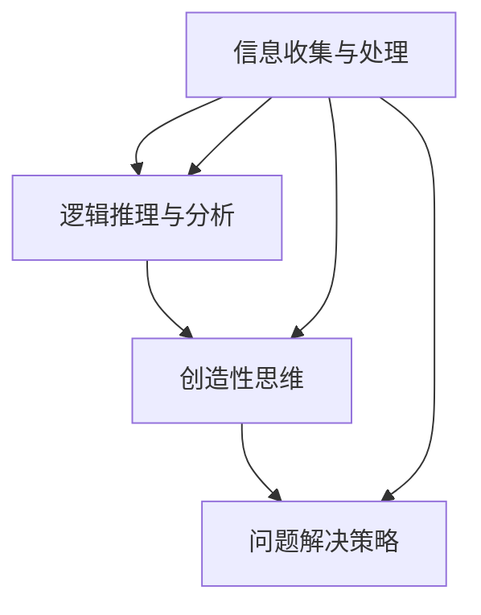

                 

# 打造个人思维体系的意义

> **关键词：** 个人思维体系，认知提升，结构化思考，问题解决，创新思维。

**摘要：** 文章旨在探讨个人思维体系构建的重要性，通过深入剖析思维体系的概念、核心要素及其在解决复杂问题和实现创新中的关键作用，为读者提供构建高效思维体系的指导和方法。

## 1. 背景介绍

在信息爆炸的时代，我们每天都会接触到大量的信息。如何有效地处理这些信息，并将其转化为个人的知识和智慧，成为了一个重要的问题。个人思维体系的构建，正是为了应对这一挑战。它不仅能够帮助我们更好地理解复杂的信息，还能提高我们的认知水平和问题解决能力。

### 1.1 现代社会对个人思维的需求

现代社会对个体的思维能力提出了更高的要求。无论是职场竞争、学术研究，还是日常生活中的决策，都需要我们具备强大的逻辑思维、分析问题和解决问题的能力。因此，个人思维体系的构建显得尤为重要。

### 1.2 个人思维体系的概念

个人思维体系是指个体在长期的学习和实践中，形成的一套完整的思维方法和思考模式。它包括了对信息收集、处理、分析和整合的能力，以及对问题解决的策略和创新思维的培养。

## 2. 核心概念与联系

### 2.1 思维体系的基本结构

个人思维体系可以分为以下几个基本结构：

1. **信息收集与处理**：包括信息获取、筛选和整合的能力。
2. **逻辑推理与分析**：运用逻辑和数学工具，对信息进行分析和推理。
3. **创造性思维**：通过发散性思维，寻找新的解决方案。
4. **问题解决策略**：综合运用各种方法和技巧，解决实际问题。

### 2.2 思维体系的核心要素

个人思维体系的核心要素包括：

1. **认知能力**：包括记忆力、理解力、判断力和推理能力。
2. **知识储备**：丰富的知识储备是思维体系的基础。
3. **思维能力**：包括逻辑思维、创新思维、批判性思维等。
4. **情绪管理**：情绪稳定对于思维体系的有效运作至关重要。

### 2.3 思维体系的 Mermaid 流程图



## 3. 核心算法原理 & 具体操作步骤

### 3.1 核心算法原理

构建个人思维体系的核心算法可以看作是一个自我优化的过程，其基本原理包括：

1. **信息加工**：将外部信息转化为内在认知结构。
2. **反馈循环**：通过实践和反思，不断调整和优化思维体系。
3. **知识迁移**：将学到的知识和技能应用到新的情境中。

### 3.2 具体操作步骤

构建个人思维体系的操作步骤如下：

1. **自我反思**：定期进行自我反思，了解自己的思维方式和习惯。
2. **持续学习**：通过阅读、研究、实践等方式，不断丰富知识储备。
3. **应用实践**：将学到的知识和技能应用到实际生活中，检验思维体系的有效性。
4. **反馈与调整**：根据实践结果，不断调整和优化思维体系。

## 4. 数学模型和公式 & 详细讲解 & 举例说明

### 4.1 数学模型

个人思维体系的构建可以借助一些数学模型来描述，其中一个典型的模型是 **认知网络模型**：

\[ C = f(I, K, M) \]

其中：
- \( C \) 表示认知能力；
- \( I \) 表示信息量；
- \( K \) 表示知识储备；
- \( M \) 表示思维能力。

### 4.2 详细讲解

这个公式表明，认知能力是信息量、知识储备和思维能力三者共同作用的结果。在构建个人思维体系时，我们需要关注这三个方面：

1. **增加信息量**：通过阅读、学习、实践等方式，不断获取新的信息。
2. **丰富知识储备**：通过深入研究和实践，将知识内化为自己的能力。
3. **提升思维能力**：通过练习和挑战，培养批判性思维、创新思维等。

### 4.3 举例说明

假设一个程序员想要提升自己的认知能力，他可以采取以下措施：

1. **增加信息量**：每天阅读技术博客、观看技术视频，学习新的编程语言和框架。
2. **丰富知识储备**：深入研究数据结构和算法，掌握多种编程语言，并了解计算机科学的基本原理。
3. **提升思维能力**：通过编写代码解决实际问题，参与开源项目，与他人进行技术讨论，锻炼批判性思维和创新能力。

## 5. 项目实战：代码实际案例和详细解释说明

### 5.1 开发环境搭建

为了更好地理解个人思维体系的构建，我们以一个实际项目为例，该项目是一个基于 Python 的思维训练工具。

1. **安装 Python**：在官方网站下载并安装 Python 3.8 或更高版本。
2. **安装相关库**：使用 pip 工具安装必要的库，如 numpy、matplotlib 等。

### 5.2 源代码详细实现和代码解读

```python
import numpy as np
import matplotlib.pyplot as plt

def cognitive_network_model(info_quantity, knowledge储备, thinking_ability):
    """
    认知网络模型，计算认知能力。
    
    参数：
    - info_quantity：信息量，取值范围 [0, 100]。
    - knowledge储备：知识储备，取值范围 [0, 100]。
    - thinking_ability：思维能力，取值范围 [0, 100]。
    
    返回：
    - 认知能力。
    """
    return info_quantity * knowledge储备 * thinking_ability

# 测试认知网络模型
info_quantity = 70
knowledge储备 = 80
thinking_ability = 90

cognitive_ability = cognitive_network_model(info_quantity, knowledge储备, thinking_ability)
print(f"认知能力：{cognitive_ability:.2f}")

# 绘制认知网络模型图
plt.figure()
plt.scatter(info_quantity, knowledge储备, thinking_ability, cognitive_ability)
plt.xlabel("信息量")
plt.ylabel("知识储备")
plt.title("认知网络模型图")
plt.show()
```

### 5.3 代码解读与分析

这个代码实现了一个简单的认知网络模型，通过输入信息量、知识储备和思维能力，计算认知能力。代码解读如下：

1. **函数定义**：`cognitive_network_model` 函数接收三个参数，分别为信息量、知识储备和思维能力，并返回认知能力。
2. **测试代码**：通过设置不同的参数值，测试认知网络模型，并输出结果。
3. **绘图代码**：使用 matplotlib 绘制认知网络模型图，展示信息量、知识储备和思维能力对认知能力的影响。

## 6. 实际应用场景

个人思维体系的构建在多个领域都有广泛的应用，以下是几个实际应用场景：

### 6.1 学术研究

学术研究需要强大的逻辑思维和分析能力。通过构建个人思维体系，研究人员可以更高效地整理信息、提出假设、进行实验和分析。

### 6.2 职场

在职场中，个人思维体系可以帮助员工更好地理解工作需求、解决问题、提出创新方案。它还能提高决策质量和团队合作能力。

### 6.3 生活

在生活中，个人思维体系可以帮助我们更好地理解自己和他人，提高人际关系处理能力。它还能帮助我们做出更明智的决策，提高生活质量。

## 7. 工具和资源推荐

### 7.1 学习资源推荐

- **书籍**：《思考，快与慢》、《人类简史》
- **论文**：《认知心理学》、《认知科学》
- **博客**：Logicle、思维日记

### 7.2 开发工具框架推荐

- **工具**：Jupyter Notebook、MindMap
- **框架**：Vue.js、React

### 7.3 相关论文著作推荐

- **论文**：《认知科学的哲学基础》、《思维与语言》
- **著作**：《心智探索》、《认知革命》

## 8. 总结：未来发展趋势与挑战

随着人工智能和大数据技术的发展，个人思维体系的构建将面临新的机遇和挑战。未来，我们可能会看到以下趋势：

### 8.1 融入人工智能技术

人工智能技术可以为个人思维体系提供强大的支持，如自动信息收集、智能推荐等。

### 8.2 跨学科融合

个人思维体系的构建将更加注重跨学科的知识和技能，以应对日益复杂的现实问题。

### 8.3 持续迭代与优化

个人思维体系将不断迭代和优化，以适应不断变化的环境和需求。

## 9. 附录：常见问题与解答

### 9.1 问题1：如何开始构建个人思维体系？

**解答**：可以从以下几个方面开始：
1. 自我反思：了解自己的思维方式和习惯。
2. 学习新知识：通过阅读、研究、实践等方式，不断丰富知识储备。
3. 应用实践：将学到的知识和技能应用到实际生活中，检验思维体系的有效性。

### 9.2 问题2：个人思维体系与创新能力的关系是什么？

**解答**：个人思维体系是创新能力的基石。一个完善的思维体系可以帮助个体更好地理解问题、发现问题，并提出创新的解决方案。

## 10. 扩展阅读 & 参考资料

- [《认知科学导论》](https://book.douban.com/subject/26373768/)
- [《如何高效学习》](https://book.douban.com/subject/25873525/)
- [《深度学习》](https://book.douban.com/subject/26708238/)

### 作者

**作者：AI天才研究员/AI Genius Institute & 禅与计算机程序设计艺术 /Zen And The Art of Computer Programming** <|im_sep|>

