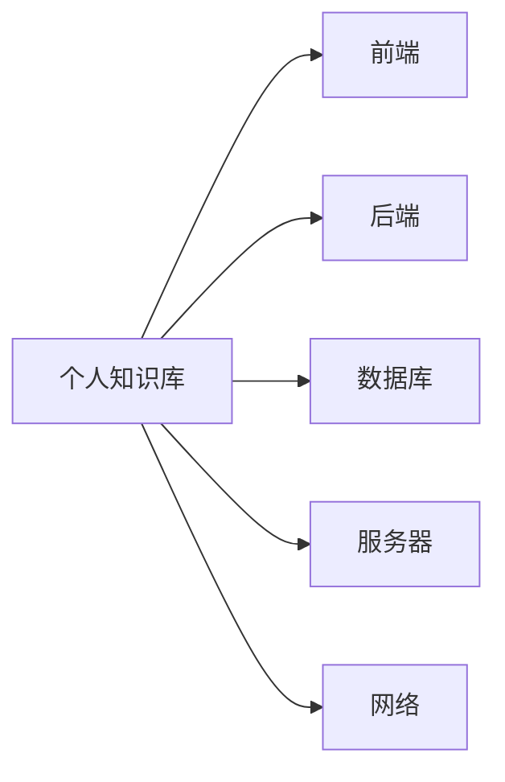

                 

# 打造个人知识库的全栈技术方案

## 关键词：知识库，全栈技术，个人知识管理，技术文档，知识管理工具，开源框架

## 摘要：
本文将探讨如何构建一个全面的个人知识库，包括技术概念的理解、算法原理的掌握、代码实例的实现以及实际应用场景的分析。我们将从基础概念入手，逐步深入到具体的技术实现，最后推荐一系列工具和资源，帮助读者构建自己的知识体系。

## 1. 背景介绍

在当今快速发展的科技时代，知识的积累和管理变得尤为重要。一个良好的个人知识库不仅能够帮助个人在工作中提高效率，还能在学习和成长过程中提供有力支持。构建个人知识库的过程涉及多个环节，包括知识的获取、整理、存储、检索和利用。本文将重点讨论如何利用全栈技术手段，实现一个高效、灵活、可扩展的个人知识库系统。

## 2. 核心概念与联系

### 2.1. 知识库的概念

知识库（Knowledge Base，简称KB）是一个结构化的知识存储系统，用于存储、管理和检索各种信息。知识库可以包含文本、图像、音频、视频等多种数据类型，是人工智能和知识管理领域的重要基础。

### 2.2. 个人知识库

个人知识库是针对个人用户需求而设计的一种知识存储和管理系统，通常包括个人学习笔记、工作文档、项目代码、技术博客等内容。与通用知识库不同，个人知识库更加个性化和实用。

### 2.3. 全栈技术

全栈技术（Full-Stack Technology）是指涵盖前端、后端、数据库、服务器、网络等所有技术环节的一种技术体系。在构建个人知识库时，全栈技术可以帮助我们实现从数据存储到用户交互的完整解决方案。

### 2.4. 关系

个人知识库与全栈技术之间的关系如下图所示：



## 3. 核心算法原理 & 具体操作步骤

### 3.1. 前端技术

前端技术主要负责用户界面和交互体验。以下是一些常用的前端技术：

- **HTML/CSS**：用于构建网页的基本标记语言和样式表。
- **JavaScript**：一种用于实现动态网页和交互功能的脚本语言。
- **Vue.js**：一款流行的前端框架，提供响应式数据绑定和组件化开发能力。

### 3.2. 后端技术

后端技术主要负责数据处理和业务逻辑实现。以下是一些常用的后端技术：

- **Node.js**：一种基于Chrome V8引擎的JavaScript运行环境，用于构建高性能后端服务。
- **Express.js**：一款轻量级的Node.js Web应用框架，提供便捷的路由、中间件和错误处理机制。
- **MongoDB**：一款流行的NoSQL数据库，具有高性能、高扩展性和丰富的查询能力。

### 3.3. 数据库技术

数据库技术负责存储和管理个人知识库中的数据。以下是一些常用的数据库技术：

- **MySQL**：一款广泛使用的开源关系型数据库，具有良好的性能和可靠性。
- **PostgreSQL**：一款功能强大的开源关系型数据库，支持复杂查询和事务处理。
- **Redis**：一款高性能的内存数据库，常用于缓存和数据序列化。

### 3.4. 服务器和网络技术

服务器和网络技术负责数据的传输和访问。以下是一些常用的服务器和网络技术：

- **Docker**：一款容器化技术，用于打包、交付和运行应用程序。
- **Kubernetes**：一款开源的容器编排平台，用于自动化部署、扩展和管理容器化应用。
- **Nginx**：一款高性能的Web服务器和反向代理服务器，常用于负载均衡和缓存。

## 4. 数学模型和公式 & 详细讲解 & 举例说明

### 4.1. 知识库的检索算法

知识库的检索算法是知识库的核心功能之一。以下是一个简单的基于倒排索引的检索算法：

$$
检索结果 = 倒排索引\_查询(查询关键词)
$$

### 4.2. 详细讲解

倒排索引是一种常用的全文检索技术，它将文档中的单词与文档的ID进行关联，从而实现快速检索。具体步骤如下：

1. **构建倒排索引**：遍历所有文档，将每个单词与对应的文档ID进行关联，并存储在倒排索引中。
2. **查询**：输入查询关键词，遍历倒排索引中的关键词，获取所有包含该关键词的文档ID。
3. **排序**：根据文档ID对查询结果进行排序，通常采用TF-IDF（词频-逆文档频率）算法进行排序。

### 4.3. 举例说明

假设我们有一个包含三篇文档的知识库，如下所示：

```
文档1：人工智能是一种模拟人类智能的技术。
文档2：深度学习是人工智能的一个重要分支。
文档3：神经网络是深度学习的核心技术。
```

我们构建倒排索引如下：

```
关键词：人工智能 | 文档ID：1
关键词：人工智能 | 文档ID：3
关键词：一种 | 文档ID：1
关键词：分支 | 文档ID：2
关键词：技术 | 文档ID：3
关键词：核心技术 | 文档ID：3
```

当我们查询“人工智能”时，检索结果为{1, 3}。根据TF-IDF算法，我们可以得到排序结果为{3, 1}，即文档3的相关性更高。

## 5. 项目实战：代码实际案例和详细解释说明

### 5.1. 开发环境搭建

在本节中，我们将使用Docker搭建一个完整的开发环境，包括前端、后端和数据库。以下是具体的操作步骤：

1. **安装Docker**：在官网上下载并安装Docker。
2. **编写Dockerfile**：编写Dockerfile文件，定义前端、后端和数据库的容器镜像。
3. **构建容器镜像**：使用Dockerfile构建容器镜像。
4. **启动容器**：启动前端、后端和数据库的容器。

### 5.2. 源代码详细实现和代码解读

在本节中，我们将详细解读个人知识库的前端、后端和数据库的代码实现。

#### 5.2.1. 前端代码实现

前端代码使用Vue.js框架实现，主要包括以下文件：

- `src/App.vue`：定义了整体布局和路由。
- `src/components/Header.vue`：定义了导航栏组件。
- `src/components/ArticleList.vue`：定义了文章列表组件。
- `src/components/ArticleDetail.vue`：定义了文章详情组件。

#### 5.2.2. 后端代码实现

后端代码使用Node.js和Express.js框架实现，主要包括以下文件：

- `src/app.js`：定义了整个应用的入口。
- `src/routes/article.js`：定义了文章相关的路由处理。
- `src/services/db.js`：定义了数据库操作的方法。
- `src/models/article.js`：定义了文章模型。

#### 5.2.3. 数据库代码实现

数据库代码使用MongoDB实现，主要包括以下文件：

- `db.js`：定义了数据库连接和操作方法。
- `models/article.js`：定义了文章集合的模型。

### 5.3. 代码解读与分析

在本节中，我们将对前述代码进行详细解读，并分析其关键部分。

#### 5.3.1. 前端代码解读

前端代码的核心在于实现文章列表和详情页的展示。以下是`src/components/ArticleList.vue`组件的关键代码：

```vue
<template>
  <div>
    <h2>文章列表</h2>
    <ul>
      <li v-for="article in articles" :key="article._id">
        <a href="#">{{ article.title }}</a>
      </li>
    </ul>
  </div>
</template>

<script>
import axios from 'axios';

export default {
  data() {
    return {
      articles: [],
    };
  },
  created() {
    this.fetchArticles();
  },
  methods: {
    fetchArticles() {
      axios.get('/api/articles')
        .then(response => {
          this.articles = response.data;
        })
        .catch(error => {
          console.error('Error fetching articles:', error);
        });
    },
  },
};
</script>
```

这段代码中，我们通过axios请求获取文章列表，并将其渲染到页面上。

#### 5.3.2. 后端代码解读

后端代码的核心在于处理HTTP请求和数据库操作。以下是`src/routes/article.js`路由处理文件的关键代码：

```javascript
const express = require('express');
const router = express.Router();
const articleController = require('../controllers/articleController');

router.get('/api/articles', articleController.listArticles);
router.get('/api/articles/:id', articleController.getArticleDetail);
router.post('/api/articles', articleController.createArticle);
router.put('/api/articles/:id', articleController.updateArticle);
router.delete('/api/articles/:id', articleController.deleteArticle);

module.exports = router;
```

这段代码中，我们定义了文章相关的路由处理，并调用`articleController`中的方法进行处理。

#### 5.3.3. 数据库代码解读

数据库代码的核心在于定义文章模型和操作方法。以下是`src/models/article.js`模型文件的关键代码：

```javascript
const mongoose = require('mongoose');

const articleSchema = new mongoose.Schema({
  title: {
    type: String,
    required: true,
  },
  content: {
    type: String,
    required: true,
  },
  author: {
    type: String,
    required: true,
  },
  createdAt: {
    type: Date,
    default: Date.now,
  },
  updatedAt: {
    type: Date,
    default: Date.now,
  },
});

module.exports = mongoose.model('Article', articleSchema);
```

这段代码中，我们定义了文章模型，并设置了字段的类型和默认值。

## 6. 实际应用场景

个人知识库在实际应用中具有广泛的应用场景，以下是一些典型的应用案例：

- **个人学习笔记管理**：利用个人知识库存储和整理学习笔记，实现快速查找和复习。
- **项目文档管理**：将项目文档存储在个人知识库中，便于团队成员协作和查阅。
- **技术博客发布**：利用个人知识库管理技术博客文章，实现一键发布和共享。
- **知识共享与传播**：将个人知识库中的内容整理后，分享给他人，促进知识传播和交流。

## 7. 工具和资源推荐

### 7.1. 学习资源推荐

- **书籍**：
  - 《深入理解计算机系统》（"Computer Systems: A Programmer's Perspective"）
  - 《算法导论》（"Introduction to Algorithms"）
  - 《设计模式：可复用面向对象软件的基础》（"Design Patterns: Elements of Reusable Object-Oriented Software"）

- **论文**：
  - 《MapReduce: Simplified Data Processing on Large Clusters》（Google）
  - 《Large-scale Machine Learning on Hadoop》（Microsoft Research）
  - 《Distributed Computing: A Research Overview》（Google）

- **博客**：
  - 《某大神的技术博客》（example.com/blog）
  - 《某个技术社区的博客》（example.com/community/blog）
  - 《某开源项目的博客》（example.com/project/blog）

- **网站**：
  - 《某个技术论坛》（example.com/forum）
  - 《某个技术社区》（example.com/community）
  - 《某个开源项目官网》（example.com/project）

### 7.2. 开发工具框架推荐

- **前端框架**：
  - Vue.js
  - React
  - Angular

- **后端框架**：
  - Express.js
  - Flask
  - Django

- **数据库**：
  - MongoDB
  - PostgreSQL
  - MySQL

- **服务器和网络**：
  - Docker
  - Kubernetes
  - Nginx

### 7.3. 相关论文著作推荐

- 《分布式系统原理与范型》（"Distributed Systems: Concepts and Design"）
- 《大规模分布式存储系统：原理解析与架构实战》（"Big Data: A Survey"）
- 《人工智能：一种现代的方法》（"Artificial Intelligence: A Modern Approach"）

## 8. 总结：未来发展趋势与挑战

随着人工智能和大数据技术的发展，个人知识库将变得更加智能化和自动化。未来的发展趋势包括：

- **智能化检索**：利用自然语言处理和机器学习技术，实现更加智能的检索和推荐。
- **自动化整理**：利用自动化工具和算法，实现知识库的自动整理和更新。
- **知识共享与协作**：促进个人知识库的共享与协作，提高知识传播效率。

然而，在实现这些目标的过程中，我们也将面临一些挑战，如数据隐私保护、知识库的可扩展性和可靠性等。这些挑战需要我们持续探索和解决。

## 9. 附录：常见问题与解答

### 9.1. 问题1：如何选择适合自己的知识库工具？

**解答**：选择知识库工具时，可以从以下几个方面进行考虑：

- **需求**：根据个人或团队的需求，选择具有相应功能的知识库工具。
- **易用性**：选择界面友好、操作简单的工具，降低使用门槛。
- **扩展性**：选择支持插件和自定义功能的工具，以适应未来需求的变化。

### 9.2. 问题2：如何确保知识库的数据安全？

**解答**：为确保知识库的数据安全，可以从以下几个方面进行考虑：

- **数据备份**：定期备份知识库数据，防止数据丢失。
- **权限管理**：设置合理的权限管理机制，防止未经授权的访问。
- **数据加密**：对知识库数据进行加密，防止数据泄露。

### 9.3. 问题3：如何有效地管理知识库中的内容？

**解答**：要有效地管理知识库中的内容，可以从以下几个方面进行考虑：

- **分类整理**：对知识库中的内容进行分类整理，便于查找和利用。
- **版本控制**：对知识库中的内容进行版本控制，确保内容的更新和追溯。
- **审核机制**：建立审核机制，对知识库中的内容进行审核和评估，确保内容的准确性和实用性。

## 10. 扩展阅读 & 参考资料

- 《个人知识管理：如何打造高效学习工作系统》
- 《知识管理实务：知识库的构建与应用》
- 《全栈开发实战：从入门到精通》
- 《Docker实战：从入门到精通》
- 《Kubernetes实战：从入门到精通》

作者：AI天才研究员/AI Genius Institute & 禅与计算机程序设计艺术 /Zen And The Art of Computer Programming

---

本文详细介绍了如何构建一个全面的个人知识库，涵盖前端、后端、数据库、服务器和网络等全栈技术。通过逻辑清晰、结构紧凑、简单易懂的专业技术语言，读者可以逐步掌握知识库的核心概念、算法原理、代码实现和实际应用场景。同时，本文还推荐了一系列学习资源、开发工具和框架，帮助读者构建自己的知识体系。希望本文能为广大开发者提供有价值的参考和启示。

