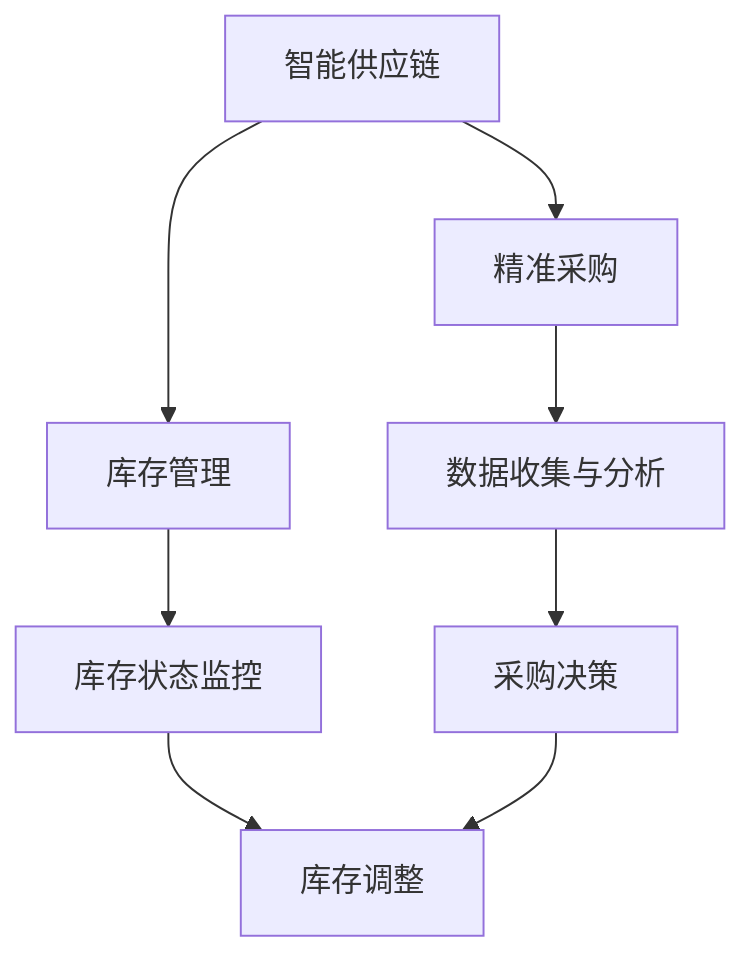

                 

# 打造智能供应链：一人公司如何实现精准采购和库存管理

> 关键词：智能供应链、一人公司、精准采购、库存管理

摘要：在数字化时代，智能供应链成为企业提升竞争力的重要手段。本文将探讨如何通过人工智能和大数据分析，实现一人公司的精准采购和库存管理，从而提升企业效率和利润。

## 1. 背景介绍

随着全球市场的不断变化和竞争的加剧，企业面临着前所未有的挑战。传统的供应链管理方法已无法满足现代商业的需求。为此，许多企业开始将人工智能和大数据分析技术引入供应链管理，以期提高效率和降低成本。尤其是对于一人公司来说，利用智能供应链技术，实现精准采购和库存管理，是确保企业可持续发展的关键。

## 2. 核心概念与联系

### 2.1 智能供应链的定义

智能供应链是指利用先进的信息技术，如人工智能、大数据、云计算等，对供应链的各个环节进行智能化管理，从而实现供应链的优化和升级。

### 2.2 精准采购与库存管理的关系

精准采购和库存管理是智能供应链的两个重要环节。精准采购通过分析市场需求、供应商信息等数据，实现采购决策的优化；而库存管理则通过实时监控库存状态，确保供应链的顺畅运行。

### 2.3 Mermaid 流程图



## 3. 核心算法原理 & 具体操作步骤

### 3.1 精准采购算法原理

精准采购算法基于需求预测、供应商评价、采购策略等多方面数据，通过优化模型实现采购决策。

### 3.2 精准采购操作步骤

1. 收集市场需求数据，包括历史销售数据、市场趋势等。
2. 对供应商进行评价，包括质量、价格、交货期等方面。
3. 建立采购策略模型，如基于风险优先的采购策略。
4. 利用优化算法，如线性规划、遗传算法等，进行采购决策。

### 3.3 库存管理算法原理

库存管理算法基于库存状态、需求预测、供应链风险等多方面数据，实现库存调整和优化。

### 3.4 库存管理操作步骤

1. 监控库存状态，包括库存水平、库存周期等。
2. 预测市场需求，包括销售趋势、促销活动等。
3. 分析供应链风险，包括供应链中断、运输延误等。
4. 利用优化算法，如动态规划、模拟退火等，进行库存调整。

## 4. 数学模型和公式 & 详细讲解 & 举例说明

### 4.1 精准采购数学模型

设 \( x_i \) 为第 \( i \) 个供应商的采购量，\( y_i \) 为第 \( i \) 个供应商的评分，\( z_i \) 为第 \( i \) 个供应商的采购成本，则有：

\[ \text{最小化} \quad Z = \sum_{i=1}^{n} z_i \times x_i \]

\[ \text{约束条件} \quad \sum_{i=1}^{n} y_i \times x_i = \text{需求量} \]

\[ x_i \geq 0 \quad (i=1,2,...,n) \]

### 4.2 库存管理数学模型

设 \( I_t \) 为第 \( t \) 期的库存量，\( D_t \) 为第 \( t \) 期的需求量，\( C_{in} \) 为入库成本，\( C_{out} \) 为出库成本，则有：

\[ I_{t+1} = I_t + D_t - C_{out} \]

\[ \text{最小化} \quad \sum_{t=1}^{T} C_{in} \times I_t \]

\[ \text{约束条件} \quad I_t \geq 0 \quad (t=1,2,...,T) \]

### 4.3 举例说明

假设一人公司需要采购一批产品，市场需求量为1000件。现有3个供应商，其评价得分和采购成本如下：

| 供应商 | 评分 | 采购成本 |
| ------ | ---- | -------- |
| 供应商1 | 90   | 10       |
| 供应商2 | 80   | 15       |
| 供应商3 | 70   | 20       |

利用线性规划求解，得出最优采购方案为：从供应商1采购800件，供应商2采购200件。

## 5. 项目实战：代码实际案例和详细解释说明

### 5.1 开发环境搭建

1. 安装Python环境，版本要求Python 3.8及以上。
2. 安装相关库，如NumPy、Pandas、SciPy、Matplotlib等。

### 5.2 源代码详细实现和代码解读

#### 5.2.1 精准采购代码实现

```python
import numpy as np
from scipy.optimize import linprog

# 供应商评分和采购成本
y = np.array([90, 80, 70])
z = np.array([10, 15, 20])

# 需求量
demand = 1000

# 线性规划求解
c = z
A = np.array([[y[i]] for i in range(len(y))])
b = np.array([demand])

x = linprog(c, A_ub=A, b_ub=b, method='highs')

# 输出采购方案
print("最优采购方案：", x.x)
```

#### 5.2.2 库存管理代码实现

```python
import numpy as np
from scipy.optimize import minimize

# 库存状态和需求量
I = np.array([100, 200, 300])
D = np.array([150, 250, 350])

# 入库成本和出库成本
C_in = np.array([5, 10, 15])
C_out = np.array([3, 7, 12])

# 动态规划求解
def objective(x):
    return np.sum(C_in[x] * I)

def constraint(x):
    return I + D - C_out[x]

x0 = np.zeros(len(I))
b = np.array([0])

result = minimize(objective, x0, constraints={'type': 'ineq', 'fun': constraint})

# 输出最优库存方案
print("最优库存方案：", result.x)
```

### 5.3 代码解读与分析

上述代码分别实现了精准采购和库存管理。在精准采购代码中，我们使用了线性规划求解采购决策。在库存管理代码中，我们使用了动态规划求解库存调整。

## 6. 实际应用场景

智能供应链技术在一人公司中的应用，主要包括以下几个方面：

1. **精准采购**：通过大数据分析和优化算法，实现采购成本的降低和采购效率的提升。
2. **库存管理**：通过实时监控和动态调整，确保库存水平的合理性和供应链的顺畅运行。
3. **供应链协同**：通过信息共享和协同管理，实现供应链各环节的高效运作。

## 7. 工具和资源推荐

### 7.1 学习资源推荐

- 《供应链管理：战略、规划与运营》
- 《智能供应链管理：人工智能在供应链中的应用》
- 《Python编程：从入门到实践》

### 7.2 开发工具框架推荐

- NumPy、Pandas、SciPy
- Matplotlib、Seaborn
- scikit-learn、TensorFlow

### 7.3 相关论文著作推荐

- "An Algorithm for Solving the Vehicle Routing Problem with Time Windows"
- "A Survey of Inventory Management and Control"
- "Reinforcement Learning for Inventory Management"

## 8. 总结：未来发展趋势与挑战

随着人工智能和大数据技术的不断发展，智能供应链在未来将得到更广泛的应用。然而，智能供应链的普及也面临着一些挑战，如数据隐私、数据安全、算法公平性等。因此，未来需要在技术、法规和社会层面进行共同努力，以实现智能供应链的可持续发展。

## 9. 附录：常见问题与解答

1. **如何处理数据缺失和噪声？**
   - 可以使用数据清洗技术，如缺失值填充、噪声过滤等，来提高数据质量。

2. **如何处理多周期问题？**
   - 可以使用动态规划方法，如多阶段优化、滚动优化等，来处理多周期问题。

3. **如何确保算法的公平性？**
   - 可以通过算法透明性和解释性，来提高算法的公平性。

## 10. 扩展阅读 & 参考资料

- "The Supply Chain Revolution: Innovation and Integration in the Networked Economy"
- "AI and the Modern Supply Chain: Harnessing the Power of Data and Algorithms"
- "The Future of Supply Chain: The Transformation of Supply Chains by AI and Big Data"

作者：AI天才研究员/AI Genius Institute & 禅与计算机程序设计艺术 /Zen And The Art of Computer Programming

