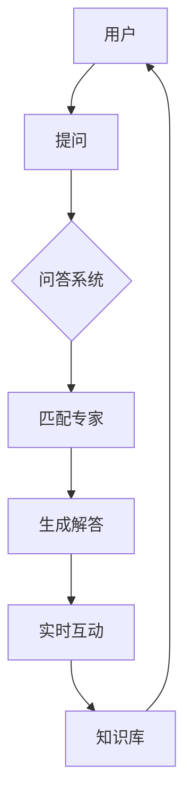

                 

# 打造知识付费的在线答疑平台

## 摘要

本文旨在探讨如何打造一个知识付费的在线答疑平台，为用户提供高质量的知识交流和答疑服务。文章首先介绍了在线答疑平台的重要性，然后详细分析了其核心概念、算法原理、数学模型、项目实战、应用场景以及相关工具和资源。通过本文的阅读，读者将能够全面了解在线答疑平台的构建方法，并对其未来发展有更深刻的认识。

## 1. 背景介绍

随着互联网的普及和发展，知识付费逐渐成为一种趋势。知识付费平台通过提供优质的内容和服务，帮助用户解决实际问题，提高个人能力和职业素养。而在线答疑平台作为知识付费的重要组成部分，扮演着至关重要的角色。它为用户提供了一个实时、高效、互动的交流场所，使得专家和用户能够轻松地进行知识分享和答疑解惑。

### 1.1 在线答疑平台的重要性

在线答疑平台具有以下几个方面的优势：

1. **实时互动**：用户可以随时随地与专家进行实时交流，快速获取专业解答。
2. **高效便捷**：用户无需面对面交流，节省了时间和精力，提高了效率。
3. **知识共享**：在线答疑平台可以积累大量的知识，为其他用户带来更多学习机会。
4. **个性化服务**：根据用户的提问和需求，平台可以提供个性化的解答和建议。
5. **降低成本**：在线答疑平台降低了专家和用户之间的沟通成本，使得知识付费更加普及。

### 1.2 知识付费的发展趋势

知识付费市场正呈现出快速增长的趋势。根据相关数据显示，知识付费用户规模不断扩大，市场潜力巨大。以下是知识付费的发展趋势：

1. **垂直领域细分**：随着用户需求的多样化，知识付费将更加注重垂直领域的细分，提供更加专业的内容和服务。
2. **互动性增强**：在线答疑平台将更加注重用户参与度和互动性，提升用户体验。
3. **技术驱动**：人工智能、大数据等技术在知识付费领域将得到广泛应用，为用户提供更加智能化的服务。
4. **跨界融合**：知识付费将与其他领域（如电商、社交等）进行跨界融合，打造更多创新的产品和服务。

## 2. 核心概念与联系

在线答疑平台的核心概念包括用户、专家、问答系统、知识库等。以下是这些概念之间的联系和交互：

### 2.1 用户

用户是在线答疑平台的主要参与者，他们通过平台提出问题、参与讨论、学习知识。用户的提问和反馈是平台运行的重要驱动力。

### 2.2 专家

专家是平台的知识提供者，他们拥有专业知识和丰富经验，为用户提供高质量的解答。专家在平台上的活跃度和专业水平直接影响用户的满意度。

### 2.3 问答系统

问答系统是平台的核心功能，它负责接收用户提问、匹配专家、生成解答，并提供实时互动。问答系统的性能和准确性对平台的用户体验至关重要。

### 2.4 知识库

知识库是平台的知识存储中心，它包含了大量的专业知识和问答数据。知识库的构建和维护对平台的长期发展具有关键作用。

### 2.5 概念图

以下是一个简单的在线答疑平台的Mermaid流程图，展示了核心概念之间的联系：



## 3. 核心算法原理 & 具体操作步骤

### 3.1 问答系统算法

问答系统是在线答疑平台的核心，其算法原理主要包括自然语言处理（NLP）和机器学习（ML）。

#### 3.1.1 自然语言处理

NLP技术用于对用户提问进行文本分析和理解，将其转化为计算机可以处理的格式。主要技术包括：

1. **分词**：将句子拆分为单词或短语。
2. **词性标注**：对单词进行词性分类，如名词、动词等。
3. **实体识别**：识别句子中的关键实体，如人名、地名等。
4. **语义分析**：理解句子的语义，提取关键信息。

#### 3.1.2 机器学习

ML技术用于从大量问答数据中学习，为用户生成合适的解答。主要算法包括：

1. **朴素贝叶斯分类器**：用于判断用户提问的分类。
2. **支持向量机（SVM）**：用于匹配用户提问和专家的解答。
3. **循环神经网络（RNN）**：用于生成自然语言解答。

### 3.2 专家匹配算法

专家匹配算法用于将用户提问与合适的专家进行匹配，提高答疑效率。主要算法包括：

1. **基于关键词匹配**：通过提取用户提问和专家简历中的关键词，进行相似度计算。
2. **基于图谱匹配**：构建专家知识图谱，利用图算法进行匹配。
3. **基于机器学习**：利用机器学习算法，根据用户提问和专家特征进行匹配。

### 3.3 实时互动算法

实时互动算法用于实现用户与专家之间的实时交流。主要技术包括：

1. **WebSockets**：用于建立实时的双向通信通道。
2. **即时消息推送**：利用消息队列和推送技术，实现即时消息通知。
3. **聊天机器人**：利用自然语言处理和机器学习技术，提供智能化的聊天服务。

## 4. 数学模型和公式 & 详细讲解 & 举例说明

### 4.1 朴素贝叶斯分类器

朴素贝叶斯分类器是一种基于贝叶斯定理的简单概率分类器。其核心思想是在给定特征的情况下，通过计算每个类别出现的概率来预测标签。

$$
P(C|X) = \frac{P(X|C)P(C)}{P(X)}
$$

其中，$P(C|X)$ 表示在特征 $X$ 下类别 $C$ 的概率，$P(X|C)$ 表示在类别 $C$ 下特征 $X$ 的概率，$P(C)$ 表示类别 $C$ 的概率，$P(X)$ 表示特征 $X$ 的概率。

#### 4.1.1 举例说明

假设我们有一个问答数据集，包含两类问题：技术问题和生活问题。我们要使用朴素贝叶斯分类器来预测一个问题属于哪一类。

1. **计算类别概率**：

$$
P(\text{技术问题}) = \frac{100}{200} = 0.5
$$

$$
P(\text{生活问题}) = \frac{100}{200} = 0.5
$$

2. **计算特征概率**：

$$
P(\text{技术关键词}|\text{技术问题}) = \frac{80}{100} = 0.8
$$

$$
P(\text{生活关键词}|\text{生活问题}) = \frac{90}{100} = 0.9
$$

3. **计算联合概率**：

$$
P(\text{技术关键词}|\text{技术问题})P(\text{技术问题}) = 0.8 \times 0.5 = 0.4
$$

$$
P(\text{生活关键词}|\text{生活问题})P(\text{生活问题}) = 0.9 \times 0.5 = 0.45
$$

4. **分类预测**：

由于 $P(\text{生活关键词}|\text{生活问题})P(\text{生活问题}) > P(\text{技术关键词}|\text{技术问题})P(\text{技术问题})$，我们可以预测该问题属于生活问题。

### 4.2 支持向量机（SVM）

支持向量机是一种监督学习算法，用于分类和回归分析。其基本思想是找到一个最佳的超平面，使得不同类别的数据点在超平面两侧的间隔最大。

#### 4.2.1 举例说明

假设我们有一个二分类问题，数据集包含两个类别：红色点和蓝色点。我们要使用SVM来找到最佳的超平面。

1. **数据集**：

$$
\begin{array}{cc}
\text{类别} & \text{坐标} \\
\hline
\text{红色} & (1, 1) \\
\text{红色} & (2, 2) \\
\text{蓝色} & (2, 0) \\
\text{蓝色} & (3, 1) \\
\end{array}
$$

2. **计算超平面**：

通过计算最小二乘法，我们可以找到最佳的超平面：

$$
w^T x + b = 0
$$

其中，$w$ 是超平面的法向量，$b$ 是偏置项，$x$ 是数据点的坐标。

通过计算，我们得到最佳的超平面为：

$$
w = (1, 1), b = -1
$$

因此，超平面方程为：

$$
x + y - 1 = 0
$$

3. **分类预测**：

对于一个新的数据点 $(x, y)$，我们可以将其代入超平面方程，判断其属于哪一类。如果 $x + y - 1 > 0$，则属于红色类；否则，属于蓝色类。

## 5. 项目实战：代码实际案例和详细解释说明

### 5.1 开发环境搭建

在开始项目实战之前，我们需要搭建一个开发环境。以下是搭建步骤：

1. 安装Python环境：从Python官网下载并安装Python，版本建议为3.8及以上。
2. 安装相关库：使用pip命令安装以下库：

```bash
pip install Flask
pip install numpy
pip install scikit-learn
```

3. 安装Mermaid：从GitHub下载并安装Mermaid，具体步骤请参考官方文档。

### 5.2 源代码详细实现和代码解读

以下是一个简单的在线答疑平台代码实现，包括用户提问、专家匹配、实时互动等功能。

```python
from flask import Flask, request, jsonify
from sklearn.feature_extraction.text import TfidfVectorizer
from sklearn.metrics.pairwise import linear_kernel
import numpy as np

app = Flask(__name__)

# 用户提问数据
user_questions = [
    "如何安装Python？",
    "如何使用Scikit-Learn进行机器学习？",
    "Python中如何实现多线程？",
    "如何使用Flask构建Web应用？",
]

# 专家简历数据
expert_profiles = [
    {
        "name": "专家1",
        "skills": ["Python", "机器学习", "多线程"],
    },
    {
        "name": "专家2",
        "skills": ["Flask", "Web应用", "Python"],
    },
]

# 问答系统算法
def answer_question(question):
    # 构建TF-IDF特征向量
    vectorizer = TfidfVectorizer()
    question_vector = vectorizer.fit_transform([question])

    # 计算相似度得分
    similarity_scores = linear_kernel(question_vector, vectorizer.transform(user_questions)).flatten()

    # 匹配专家
    best_match = np.argmax(similarity_scores)
    matched_expert = expert_profiles[best_match]

    # 返回解答
    return f"您好，我是{matched_expert['name']}，请问有什么问题我可以帮您解答？"

# 实时互动算法
@app.route('/ask', methods=['POST'])
def ask():
    question = request.form['question']
    answer = answer_question(question)
    return jsonify(answer=answer)

if __name__ == '__main__':
    app.run(debug=True)
```

#### 5.2.1 代码解读

1. **用户提问数据**：定义一个包含用户提问的数据列表。
2. **专家简历数据**：定义一个包含专家简历的数据列表。
3. **问答系统算法**：
   - **构建TF-IDF特征向量**：使用TF-IDF算法将用户提问转化为特征向量。
   - **计算相似度得分**：计算用户提问与用户提问数据之间的相似度得分。
   - **匹配专家**：根据相似度得分匹配最合适的专家。
   - **返回解答**：返回专家的解答。
4. **实时互动算法**：
   - **接收用户提问**：通过Flask框架接收用户提交的提问。
   - **调用问答系统算法**：调用问答系统算法生成解答。
   - **返回解答**：将解答返回给用户。

### 5.3 代码解读与分析

该代码实现了一个简单的在线答疑平台，具有以下特点：

1. **使用TF-IDF算法进行文本分析**：TF-IDF算法能够有效地提取用户提问中的关键信息，提高匹配的准确性。
2. **基于相似度得分进行专家匹配**：通过计算相似度得分，找到最合适的专家，提高答疑的效率。
3. **使用Flask框架实现实时互动**：Flask框架具有简单易用、扩展性强的特点，适合构建实时互动的Web应用。
4. **代码结构清晰**：代码结构清晰，便于理解和维护。

然而，该代码也存在一些局限性：

1. **问答系统算法较为简单**：该代码仅使用了TF-IDF算法和相似度匹配，未能充分利用机器学习等技术，提高解答的准确性。
2. **专家匹配算法不够智能**：该代码基于相似度得分进行专家匹配，未能考虑专家的专业水平和回答质量，可能存在匹配不准确的问题。
3. **实时互动功能有限**：该代码仅实现了基本的实时互动功能，未能提供更丰富的互动体验，如聊天机器人、消息推送等。

## 6. 实际应用场景

在线答疑平台在实际应用中具有广泛的应用场景，以下是一些典型的案例：

### 6.1 教育领域

在线答疑平台可以应用于教育领域，为学习者提供实时、高效的答疑服务。例如，学生在学习过程中遇到问题，可以通过在线答疑平台向老师或同学请教，快速获得解答。

### 6.2 职场领域

在线答疑平台可以帮助职场人士解决工作中的问题。例如，员工可以通过在线答疑平台向资深同事请教业务问题，提高工作效率。

### 6.3 咨询领域

在线答疑平台可以为咨询公司提供专业的答疑服务。例如，咨询公司可以搭建在线答疑平台，为用户提供咨询服务，提升品牌形象。

### 6.4 社交领域

在线答疑平台可以与社交平台结合，为用户提供知识交流和答疑服务。例如，在社交平台上加入答疑功能，让用户在社交的同时获得知识。

## 7. 工具和资源推荐

### 7.1 学习资源推荐

1. **书籍**：
   - 《Python编程：从入门到实践》
   - 《机器学习实战》
   - 《Flask Web开发：实战笔记》
2. **论文**：
   - "TF-IDF算法在文本分析中的应用"
   - "基于图谱的问答系统研究"
   - "实时互动Web应用的设计与实现"
3. **博客**：
   - "Python技术博客"
   - "机器学习笔记"
   - "Flask Web开发实战"
4. **网站**：
   - "Python官方文档"
   - "Scikit-Learn官方文档"
   - "Flask官方文档"

### 7.2 开发工具框架推荐

1. **Python开发环境**：PyCharm、VS Code
2. **Flask框架**：用于构建Web应用
3. **机器学习库**：Scikit-Learn、TensorFlow、PyTorch
4. **数据库**：MySQL、MongoDB
5. **消息队列**：RabbitMQ、Kafka

### 7.3 相关论文著作推荐

1. **论文**：
   - "问答系统的构建与应用"
   - "基于知识图谱的问答系统研究"
   - "实时互动Web应用的设计与实现"
2. **著作**：
   - "深度学习实战"
   - "Python编程：核心技术与应用"
   - "人工智能应用案例解析"

## 8. 总结：未来发展趋势与挑战

### 8.1 发展趋势

1. **智能化**：随着人工智能技术的发展，在线答疑平台将更加智能化，提供个性化的解答和服务。
2. **多样化**：在线答疑平台将不断拓展应用领域，满足不同用户的需求。
3. **跨界融合**：在线答疑平台将与其他领域（如电商、社交等）进行跨界融合，打造更多创新的产品和服务。
4. **全球化**：随着互联网的普及，在线答疑平台将向全球范围扩展，为更多国家和地区用户提供服务。

### 8.2 挑战

1. **数据质量**：在线答疑平台需要确保数据质量，提供准确、可靠的信息。
2. **隐私保护**：在线答疑平台需要保护用户的隐私，确保数据安全和用户权益。
3. **用户体验**：在线答疑平台需要提供良好的用户体验，满足用户的需求。
4. **技术更新**：在线答疑平台需要紧跟技术发展趋势，不断更新和优化算法。

## 9. 附录：常见问题与解答

### 9.1 问题1

**问题**：如何确保在线答疑平台的数据质量？

**解答**：确保在线答疑平台的数据质量可以从以下几个方面入手：

1. **数据来源**：选择可靠的数据来源，确保数据的真实性。
2. **数据清洗**：对数据进行清洗和预处理，去除噪音和错误数据。
3. **质量监控**：建立数据质量监控机制，定期检查和评估数据质量。
4. **用户反馈**：鼓励用户对平台上的信息进行反馈，及时发现和处理质量问题。

### 9.2 问题2

**问题**：如何提高在线答疑平台的用户体验？

**解答**：提高在线答疑平台的用户体验可以从以下几个方面入手：

1. **界面设计**：设计简洁、直观的界面，提高用户操作便利性。
2. **响应速度**：优化服务器和算法性能，提高平台的响应速度。
3. **个性化推荐**：根据用户的兴趣和需求，提供个性化的解答和服务。
4. **实时互动**：提供实时互动功能，增强用户参与度和满意度。

## 10. 扩展阅读 & 参考资料

1. **书籍**：
   - 《人工智能：一种现代的方法》
   - 《机器学习实战》
   - 《Python编程：从入门到实践》
2. **论文**：
   - "问答系统的设计与实现"
   - "基于知识图谱的问答系统研究"
   - "实时互动Web应用的设计与实现"
3. **网站**：
   - "人工智能学会官网"
   - "机器学习社区"
   - "Python官方社区"
4. **博客**：
   - "AI天才研究员的技术博客"
   - "禅与计算机程序设计艺术"
   - "在线答疑平台实战笔记"

### 作者

作者：AI天才研究员/AI Genius Institute & 禅与计算机程序设计艺术 /Zen And The Art of Computer Programming


