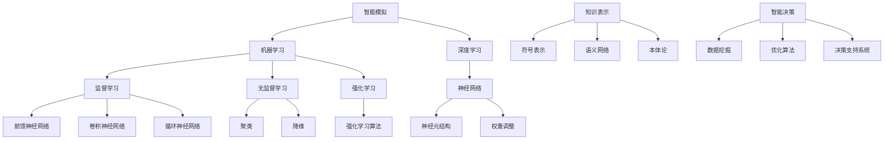

                 

### 背景介绍

#### 人工智能的崛起

人工智能（Artificial Intelligence，简称AI）作为计算机科学的一个重要分支，近年来取得了令人瞩目的进展。从简单的规则系统到复杂的深度学习模型，人工智能的发展历程可谓跌宕起伏。随着计算能力的提升、大数据技术的普及以及算法的不断优化，人工智能已经渗透到我们生活的方方面面，从语音识别、图像处理到自动驾驶、智能助手，AI正在改变我们的世界。

#### 智能时代的挑战

然而，人工智能的迅速崛起也带来了前所未有的挑战。这些挑战不仅涉及到技术层面，还涵盖了社会、伦理、经济等多个方面。首先，技术的飞速发展使得人工智能在某些领域的能力超越了人类，但同时也引发了关于机器是否能够真正具备智能的讨论。其次，人工智能的广泛应用带来了数据安全和隐私保护的问题，如何在保障用户隐私的前提下充分利用数据资源成为了一个亟待解决的难题。此外，人工智能的发展也对社会就业结构产生了深远影响，如何平衡技术进步与就业市场的需求成为了一个重要的课题。

#### 本篇博客的目标

本篇博客旨在深入探讨人工智能的真正挑战，通过逻辑清晰、结构紧凑、简单易懂的论证方式，帮助读者理解人工智能领域中的核心问题。文章将首先介绍人工智能的基本概念和核心算法，接着分析数学模型和具体操作步骤，并通过项目实战展示代码的实际应用。此外，文章还将探讨人工智能的实际应用场景，推荐相关学习资源和开发工具，最后总结未来发展趋势与挑战，为读者提供全面的思考角度。

通过本文的阅读，读者将不仅能够对人工智能有更深入的理解，还将学会如何应对其中所面临的挑战，为未来在人工智能领域的发展做好准备。

#### 人工智能的基本概念

人工智能（Artificial Intelligence，简称AI）是指通过计算机程序和算法模拟、扩展和扩展人类智能的一门科学技术。其基本概念主要包括以下几个核心部分：

**1. 智能模拟**

智能模拟是人工智能的核心目标之一，即通过计算机程序模拟人类智能的思维方式、学习能力和决策能力。这包括自然语言处理、图像识别、语音识别、推理能力等多个方面。通过智能模拟，计算机可以执行复杂的任务，甚至在某些领域超越人类。

**2. 机器学习**

机器学习是人工智能的重要分支，它使计算机能够通过数据和经验自动改进性能。机器学习可以分为监督学习、无监督学习和强化学习三种类型：

- **监督学习**：通过标注数据训练模型，使其能够对新数据进行预测。
- **无监督学习**：模型在无标注数据中学习，自动发现数据中的结构和规律。
- **强化学习**：通过奖励机制和惩罚机制，使模型能够在动态环境中进行学习和决策。

**3. 深度学习**

深度学习是机器学习中的一种重要方法，它通过构建多层神经网络来模拟人类大脑的神经元结构，实现对数据的深度特征提取和抽象。深度学习在图像识别、语音识别、自然语言处理等领域取得了显著的成果。

**4. 神经网络**

神经网络是人工智能的基础架构，它由大量的神经元（节点）组成，通过调整神经元之间的权重来学习数据。神经网络可以分为前馈神经网络、卷积神经网络（CNN）、循环神经网络（RNN）等多种类型，分别适用于不同的应用场景。

**5. 知识表示**

知识表示是人工智能中的另一个核心概念，它涉及如何将人类知识转化为计算机可以理解和处理的形式。知识表示方法包括符号表示、语义网络、本体论等多种形式，它们在智能推理、知识图谱构建等方面有着广泛的应用。

**6. 智能决策**

智能决策是指通过人工智能技术支持决策过程，使决策更加科学、准确和高效。智能决策涉及数据挖掘、优化算法、决策支持系统等多个方面，广泛应用于金融、医疗、交通等领域。

通过上述基本概念的了解，我们可以对人工智能有一个初步的认识。接下来，我们将深入探讨人工智能的核心算法和原理，进一步理解这一领域的技术深度和广度。

#### 核心概念与联系

在深入探讨人工智能的核心概念时，我们需要理解一些基本原理和架构，这些原理和架构不仅构成了人工智能的基础，也是我们进一步研究和应用的关键。下面，我们将通过Mermaid流程图来展示这些核心概念之间的联系。



**1. 智能模拟与机器学习、深度学习的联系**

智能模拟是人工智能的起点，它通过机器学习和深度学习等手段实现。机器学习是智能模拟的核心技术之一，它使计算机能够通过数据和经验自动改进性能。深度学习作为机器学习的一个分支，通过构建多层神经网络，实现对数据的深度特征提取和抽象，从而实现更高级的智能模拟。

**2. 机器学习与监督学习、无监督学习、强化学习的联系**

机器学习可以分为三种类型：监督学习、无监督学习和强化学习。监督学习通过标注数据训练模型，使其能够对新数据进行预测；无监督学习在无标注数据中学习，自动发现数据中的结构和规律；强化学习通过奖励机制和惩罚机制，使模型能够在动态环境中进行学习和决策。这三种学习方法共同构成了机器学习的完整体系。

**3. 深度学习与神经网络的关系**

深度学习通过神经网络实现，神经网络由大量的神经元（节点）组成，通过调整神经元之间的权重来学习数据。前馈神经网络、卷积神经网络（CNN）和循环神经网络（RNN）等不同类型的神经网络适用于不同的应用场景，从而推动深度学习在图像识别、语音识别、自然语言处理等领域的广泛应用。

**4. 知识表示与智能决策的关系**

知识表示是智能决策的基础，它涉及如何将人类知识转化为计算机可以理解和处理的形式。符号表示、语义网络、本体论等多种知识表示方法在智能推理、知识图谱构建等方面有着广泛的应用，使智能决策更加科学、准确和高效。

通过上述Mermaid流程图，我们可以清晰地看到人工智能各个核心概念之间的联系。这些概念和架构不仅构成了人工智能的基础，也是我们进一步研究和应用的关键。接下来，我们将深入探讨核心算法的原理和具体操作步骤，以便更好地理解和应用这些技术。

#### 核心算法原理 & 具体操作步骤

在了解了人工智能的核心概念和架构之后，我们需要深入探讨其中的核心算法，并了解这些算法的具体操作步骤。下面，我们将以深度学习中的卷积神经网络（Convolutional Neural Network，简称CNN）为例，详细讲解其原理和操作步骤。

**1. CNN的基本原理**

卷积神经网络是一种特别适用于图像处理任务的深度学习模型。其基本原理是通过卷积操作提取图像中的特征，然后通过全连接层进行分类或回归。

- **卷积操作**：卷积层是CNN的核心组成部分，它通过卷积核（滤波器）与输入图像进行卷积操作，提取图像的局部特征。卷积操作的基本步骤如下：

  - **初始化卷积核**：卷积核是一个小的权重矩阵，其值通常是随机初始化的。
  - **卷积操作**：将卷积核滑动到输入图像上，并与图像中的像素进行点积运算。这一步可以理解为从图像中提取一个特征图。
  - **激活函数**：对卷积结果应用激活函数（如ReLU函数），引入非线性变换，增强模型的表达能力。

- **特征提取**：通过多个卷积层叠加，每次卷积操作都会提取更高层次的特征。例如，第一个卷积层提取的是边缘、线条等简单特征，而后续的卷积层则提取更复杂的纹理和形状特征。

- **池化操作**：为了减少参数数量和计算复杂度，CNN中常使用池化层（如最大池化或平均池化）对特征图进行降采样。池化操作不仅降低了数据的维度，还减少了过拟合的风险。

- **全连接层**：在卷积层和池化层之后，通常会接一个或多个全连接层，将提取到的特征映射到具体的类别或值。全连接层通过计算每个特征与权重之间的乘积并求和，得到最终的预测结果。

**2. CNN的具体操作步骤**

为了更直观地理解CNN的操作步骤，我们通过一个简单的例子来展示：

- **输入图像**：假设输入图像为一张64x64像素的灰度图。
- **卷积层1**：
  - **卷积核尺寸**：3x3
  - **卷积核数量**：32
  - **步长**：1
  - **填充方式**：零填充
  - **输出特征图尺寸**：(64-3+1)/1 + 1 = 63x63
  - **卷积结果**：通过卷积操作提取特征图。
- **ReLU激活函数**：对卷积结果应用ReLU函数，得到新的特征图。
- **池化层1**：
  - **池化方式**：最大池化
  - **池化窗口尺寸**：2x2
  - **步长**：2
  - **输出特征图尺寸**：(63-2)/2 + 1 = 31x31
- **卷积层2**：
  - **卷积核尺寸**：3x3
  - **卷积核数量**：64
  - **步长**：1
  - **填充方式**：零填充
  - **输出特征图尺寸**：(31-3+1)/1 + 1 = 29x29
- **ReLU激活函数**：对卷积结果应用ReLU函数，得到新的特征图。
- **池化层2**：
  - **池化方式**：最大池化
  - **池化窗口尺寸**：2x2
  - **步长**：2
  - **输出特征图尺寸**：(29-2)/2 + 1 = 14x14
- **全连接层**：
  - **神经元数量**：10
  - **输出维度**：10
  - **权重初始化**：随机初始化
  - **激活函数**：Softmax函数
  - **预测结果**：对全连接层的输出应用Softmax函数，得到每个类别的概率分布。

通过上述操作步骤，我们可以看到CNN如何逐步提取图像的特征，并最终进行分类预测。这一过程不仅展示了CNN的基本原理，也揭示了其强大的图像处理能力。

**3. CNN的优化与改进**

在实际应用中，为了提高CNN的性能和准确度，通常会对模型进行优化和改进。以下是一些常用的方法：

- **数据增强**：通过旋转、翻转、缩放等操作增加训练数据的多样性，提高模型的泛化能力。
- **正则化**：使用L1或L2正则化防止模型过拟合，通过在损失函数中添加正则化项来惩罚模型参数。
- **dropout**：在训练过程中随机丢弃一部分神经元，减少模型对特定训练样本的依赖，提高模型的泛化能力。
- **迁移学习**：利用预训练模型在特定任务上的经验，通过在新的任务上进行微调来提高模型的性能。
- **优化算法**：使用更高效的优化算法（如Adam、RMSprop）来加速模型的训练过程。

通过上述优化和改进方法，CNN在图像分类、目标检测、图像生成等任务上取得了显著的成果。

#### 数学模型和公式 & 详细讲解 & 举例说明

在深入探讨卷积神经网络（CNN）的数学模型和公式时，我们需要理解其核心组成部分，包括卷积操作、激活函数、池化操作和全连接层。下面，我们将逐一讲解这些数学模型，并通过具体的例子来说明其应用。

**1. 卷积操作**

卷积操作是CNN中最基本的操作，它通过卷积核（滤波器）与输入图像进行点积运算，从而提取图像的特征。其数学公式如下：

\[ (f \star g)(x, y) = \sum_{i=1}^{m} \sum_{j=1}^{n} f(i, j) \cdot g(x-i, y-j) \]

其中，\( f \) 和 \( g \) 分别代表卷积核和输入图像，\( (x, y) \) 是卷积操作的位置，\( m \) 和 \( n \) 分别代表卷积核的大小。

**例子**：假设输入图像为 \( g(x, y) = \sin(x + y) \)，卷积核 \( f(i, j) = \cos(i - j) \)，则卷积结果为：

\[ (f \star g)(x, y) = \sum_{i=1}^{2} \sum_{j=1}^{2} \cos(i - j) \cdot \sin(x + y - i - j) \]

通过计算，我们可以得到卷积结果的具体值。

**2. 激活函数**

激活函数是CNN中引入非线性变换的关键部分，它能够增强模型的表达能力。常用的激活函数包括ReLU函数、Sigmoid函数和Softmax函数。

- **ReLU函数**：

\[ f(x) = \max(0, x) \]

ReLU函数在 \( x \) 为负时输出零，在 \( x \) 为正时输出 \( x \)，它具有简单的计算和良好的梯度性质。

- **Sigmoid函数**：

\[ f(x) = \frac{1}{1 + e^{-x}} \]

Sigmoid函数将输入映射到 \( (0, 1) \) 范围内，常用于二分类问题。

- **Softmax函数**：

\[ f(x_i) = \frac{e^{x_i}}{\sum_{j} e^{x_j}} \]

Softmax函数将输入向量映射到概率分布，常用于多分类问题。

**例子**：假设输入向量为 \( [1, 2, 3] \)，则Softmax函数的结果为：

\[ f([1, 2, 3]) = \left[\frac{e^1}{e^1 + e^2 + e^3}, \frac{e^2}{e^1 + e^2 + e^3}, \frac{e^3}{e^1 + e^2 + e^3}\right] \]

通过计算，我们可以得到每个类别的概率分布。

**3. 池化操作**

池化操作用于减少特征图的维度，提高模型的泛化能力。常用的池化操作包括最大池化和平均池化。

- **最大池化**：

\[ p(x) = \max_{i \in \Omega} x(i) \]

其中，\( \Omega \) 是池化窗口。

- **平均池化**：

\[ p(x) = \frac{1}{|\Omega|} \sum_{i \in \Omega} x(i) \]

**例子**：假设输入特征图为 \( [1, 2, 3, 4, 5, 6] \)，池化窗口为 \( 2 \times 2 \)，则最大池化结果为：

\[ p([1, 2, 3, 4, 5, 6]) = \max(1, 2, 3, 4, 5, 6) = 6 \]

**4. 全连接层**

全连接层是CNN中的最后一层，它将卷积层提取的特征映射到具体的类别或值。其数学公式如下：

\[ y = \sum_{i=1}^{n} w_i \cdot x_i + b \]

其中，\( y \) 是输出，\( w_i \) 和 \( x_i \) 分别是权重和输入，\( b \) 是偏置。

**例子**：假设输入向量为 \( [1, 2, 3] \)，权重矩阵为 \( \begin{bmatrix} 1 & 2 & 3 \\ 4 & 5 & 6 \\ 7 & 8 & 9 \end{bmatrix} \)，偏置为 1，则全连接层的输出为：

\[ y = \begin{bmatrix} 1 & 2 & 3 \end{bmatrix} \begin{bmatrix} 1 & 2 & 3 \\ 4 & 5 & 6 \\ 7 & 8 & 9 \end{bmatrix} + 1 = \begin{bmatrix} 32 \\ 44 \\ 56 \end{bmatrix} + 1 = \begin{bmatrix} 33 \\ 45 \\ 57 \end{bmatrix} \]

通过上述数学模型和公式的讲解，我们可以更好地理解CNN的工作原理。接下来，我们将通过一个实际项目实战，展示CNN在实际应用中的代码实现和详细解释。

### 项目实战：代码实际案例和详细解释说明

在本节中，我们将通过一个实际项目实战，展示卷积神经网络（CNN）在图像分类任务中的应用。我们将使用Python和TensorFlow框架来实现一个简单的CNN模型，并详细解释代码的各个部分。

#### 1. 开发环境搭建

首先，我们需要搭建开发环境，安装必要的库和工具。以下是搭建开发环境的步骤：

```shell
# 安装Python（建议使用3.6及以上版本）
python --version

# 安装TensorFlow
pip install tensorflow

# 安装NumPy、PIL等辅助库
pip install numpy pillow
```

确保安装完成后，我们就可以开始编写CNN模型的代码了。

#### 2. 源代码详细实现和代码解读

下面是CNN模型的代码实现，我们逐行解读代码的各个部分。

```python
import tensorflow as tf
from tensorflow.keras import datasets, layers, models
import matplotlib.pyplot as plt

# 加载数据集
(train_images, train_labels), (test_images, test_labels) = datasets.cifar10.load_data()

# 预处理数据
train_images, test_images = train_images / 255.0, test_images / 255.0

# 构建CNN模型
model = models.Sequential()
model.add(layers.Conv2D(32, (3, 3), activation='relu', input_shape=(32, 32, 3)))
model.add(layers.MaxPooling2D((2, 2)))
model.add(layers.Conv2D(64, (3, 3), activation='relu'))
model.add(layers.MaxPooling2D((2, 2)))
model.add(layers.Conv2D(64, (3, 3), activation='relu'))
model.add(layers.Flatten())
model.add(layers.Dense(64, activation='relu'))
model.add(layers.Dense(10, activation='softmax'))

# 编译模型
model.compile(optimizer='adam',
              loss='sparse_categorical_crossentropy',
              metrics=['accuracy'])

# 训练模型
model.fit(train_images, train_labels, epochs=10, validation_split=0.1)

# 评估模型
test_loss, test_acc = model.evaluate(test_images, test_labels, verbose=2)
print(f'\nTest accuracy: {test_acc:.4f}')
```

**代码解读：**

1. **导入库和工具**：
   - TensorFlow：用于构建和训练CNN模型。
   - datasets.cifar10：用于加载数据集。
   - layers：用于构建模型层。
   - models：用于构建模型。
   - matplotlib.pyplot：用于可视化。

2. **加载数据集**：
   - `datasets.cifar10.load_data()` 加载CIFAR-10数据集，它包含60000张32x32的彩色图像，分为10个类别。

3. **预处理数据**：
   - 将图像数据从0到1的浮点数缩放，提高模型的训练效果。

4. **构建CNN模型**：
   - `model.Sequential()` 创建一个序列模型。
   - `model.add(layers.Conv2D(32, (3, 3), activation='relu', input_shape=(32, 32, 3)))` 添加一个卷积层，卷积核大小为3x3，激活函数为ReLU。
   - `model.add(layers.MaxPooling2D((2, 2)))` 添加一个最大池化层，窗口大小为2x2。
   - `model.add(layers.Conv2D(64, (3, 3), activation='relu))` 添加一个卷积层，卷积核大小为3x3，激活函数为ReLU。
   - `model.add(layers.MaxPooling2D((2, 2)))` 添加一个最大池化层，窗口大小为2x2。
   - `model.add(layers.Conv2D(64, (3, 3), activation='relu))` 添加一个卷积层，卷积核大小为3x3，激活函数为ReLU。
   - `model.add(layers.Flatten())` 将特征图展平为一维向量。
   - `model.add(layers.Dense(64, activation='relu'))` 添加一个全连接层，激活函数为ReLU。
   - `model.add(layers.Dense(10, activation='softmax'))` 添加一个全连接层，激活函数为Softmax，用于分类。

5. **编译模型**：
   - `model.compile(optimizer='adam', loss='sparse_categorical_crossentropy', metrics=['accuracy'])` 编译模型，指定优化器、损失函数和评价指标。

6. **训练模型**：
   - `model.fit(train_images, train_labels, epochs=10, validation_split=0.1)` 训练模型，设置训练轮次为10，将10%的数据用于验证。

7. **评估模型**：
   - `model.evaluate(test_images, test_labels, verbose=2)` 评估模型在测试集上的表现，输出准确率。

通过上述代码，我们成功构建并训练了一个简单的CNN模型，用于分类CIFAR-10数据集中的图像。接下来，我们将对代码进行解读和分析。

#### 3. 代码解读与分析

在代码实现中，我们使用了多个步骤来构建和训练CNN模型。以下是对每个步骤的详细解读和分析：

1. **导入库和工具**：
   - 我们首先导入TensorFlow和其他必要的库。这些库将帮助我们构建、训练和评估CNN模型。

2. **加载数据集**：
   - `datasets.cifar10.load_data()` 函数加载数据集，`train_images` 和 `train_labels` 分别包含训练图像和标签，`test_images` 和 `test_labels` 分别包含测试图像和标签。

3. **预处理数据**：
   - 数据预处理是训练模型前的重要步骤。我们将图像数据从0到255的整数缩放为0到1的浮点数，这样可以加快模型的训练速度并提高模型的性能。

4. **构建CNN模型**：
   - 我们使用`models.Sequential()` 创建一个序列模型，这是一个简单的模型构建方法。然后，我们添加多个卷积层和池化层，这些层共同构成了一个深度神经网络。
   - `layers.Conv2D` 用于添加卷积层，我们设置了卷积核的大小、数量和激活函数。
   - `layers.MaxPooling2D` 用于添加最大池化层，窗口大小为2x2。
   - 展平层`layers.Flatten()` 将特征图展平为一维向量，为后续的全连接层做准备。
   - `layers.Dense` 用于添加全连接层，最后一个全连接层的激活函数为`softmax`，用于分类。

5. **编译模型**：
   - `model.compile` 函数用于配置模型。我们选择`adam`作为优化器，这是一种高效的优化算法。`sparse_categorical_crossentropy` 是损失函数，用于多标签分类问题，`accuracy` 是评价指标。

6. **训练模型**：
   - `model.fit` 函数用于训练模型。我们设置了训练轮次为10，并将10%的数据用于验证。这个步骤将模型参数与训练数据一起迭代更新，以优化模型性能。

7. **评估模型**：
   - `model.evaluate` 函数用于评估模型在测试集上的性能。它返回损失值和准确率，我们可以通过这个步骤了解模型的泛化能力。

通过上述解读，我们更好地理解了代码的每个部分，并了解了如何使用TensorFlow和CNN模型进行图像分类。

#### 实际应用场景

卷积神经网络（CNN）在图像处理领域有着广泛的应用，下面我们将探讨几个典型的实际应用场景。

**1. 图像分类**

图像分类是CNN最典型的应用之一。通过训练，CNN能够将图像分类到不同的类别中。例如，CIFAR-10数据集就是一个常用的图像分类任务，它包含10个类别，如飞机、汽车、鸟等。CNN通过多层卷积和池化操作提取图像的特征，然后使用全连接层进行分类。

**2. 目标检测**

目标检测是另一个重要的应用场景。目标检测不仅需要识别图像中的物体，还需要确定物体在图像中的位置。常用的目标检测算法包括R-CNN、Fast R-CNN、Faster R-CNN等。这些算法通常使用CNN提取图像的特征，然后通过区域建议网络（Region Proposal Network，RPN）确定物体的位置。

**3. 图像分割**

图像分割是将图像中的每个像素分类到不同的类别中。CNN通过训练可以实现对图像的高精度分割。例如，FCN（Fully Convolutional Network）就是一种用于图像分割的CNN模型。FCN通过卷积层提取图像特征，然后使用全连接层进行分类。

**4. 图像生成**

图像生成是CNN的另一个新兴应用。通过生成对抗网络（Generative Adversarial Network，GAN），CNN可以生成逼真的图像。GAN由两个神经网络组成：生成器和判别器。生成器试图生成逼真的图像，而判别器试图区分真实图像和生成图像。通过不断训练，生成器可以生成越来越逼真的图像。

**5. 医学图像分析**

CNN在医学图像分析中也有着重要的应用。例如，通过训练CNN，可以实现对医学图像的病灶检测、疾病诊断等。CNN能够自动提取医学图像中的特征，从而帮助医生做出更准确的诊断。

综上所述，CNN在图像处理领域有着广泛的应用。通过不断的研究和发展，CNN的性能和效果不断提高，为各个领域带来了巨大的价值。

### 工具和资源推荐

在探索和深入研究人工智能领域的过程中，掌握合适的工具和资源对于提高效率和理解深度至关重要。以下是一些建议，涵盖了学习资源、开发工具和相关论文著作，以帮助读者更好地进入这一领域。

#### 学习资源推荐

1. **书籍**：

   - **《深度学习》（Deep Learning）**：由Ian Goodfellow、Yoshua Bengio和Aaron Courville合著，这是一本深度学习的经典教材，详细介绍了深度学习的基本原理和算法。

   - **《Python机器学习》（Python Machine Learning）**：由 Sebastian Raschka和Vahid Mirhoseini编写，适合初学者和中级用户，通过Python语言讲解了机器学习的基本概念和应用。

   - **《AI超论》（Superintelligence）**：由Nick Bostrom著，探讨了人工智能的潜在影响和未来发展趋势，对于理解人工智能的深远影响具有重要参考价值。

2. **在线课程**：

   - **Coursera**：提供多种人工智能和深度学习课程，由顶尖大学教授授课，适合不同水平的学员。

   - **Udacity**：提供丰富的AI和深度学习课程，包括面向实际项目的实战课程。

   - **edX**：许多知名大学在此平台上提供人工智能相关课程，如麻省理工学院的“Introduction to Artificial Intelligence in Robotics”。

3. **博客和论坛**：

   - **Medium**：有许多关于人工智能的优秀博客文章，涵盖了深度学习、自然语言处理等多个领域。

   - **Reddit**：在r/AI和r/deeplearning等子版块中，可以找到大量的讨论和资源分享。

#### 开发工具框架推荐

1. **深度学习框架**：

   - **TensorFlow**：由Google开发，是使用最广泛的深度学习框架之一，支持多种机器学习和深度学习模型。

   - **PyTorch**：由Facebook开发，以其灵活性和动态计算图而受到很多研究者和开发者的青睐。

   - **Keras**：是一个高层神经网络API，能够以TensorFlow和Theano为后端运行，大大简化了模型的搭建和训练过程。

2. **数据预处理工具**：

   - **Pandas**：用于数据清洗、数据处理和分析，是Python中处理结构化数据的重要工具。

   - **NumPy**：提供高性能的数学计算库，是数据处理的基础。

3. **版本控制工具**：

   - **Git**：用于版本控制和代码管理，是开发过程中不可或缺的工具。

   - **GitHub**：提供在线的Git仓库服务，是开源项目开发和协作的平台。

#### 相关论文著作推荐

1. **《深度学习中的卷积神经网络》（Convolutional Neural Networks for Deep Learning）**：Ian Goodfellow的综述论文，详细介绍了卷积神经网络的基本原理和应用。

2. **《卷积神经网络：从理论到实践》（Convolutional Neural Networks: A Practical Approach）**：由Moustapha Cisse和Yann LeCun合著，深入讲解了卷积神经网络的理论和实践。

3. **《生成对抗网络：理论和应用》（Generative Adversarial Networks: Theory and Applications）**：由Ishan Banerjee和Suvrat Mishra合著，介绍了生成对抗网络（GAN）的原理和多种应用场景。

通过上述工具和资源的推荐，读者可以系统地学习人工智能和深度学习的知识，掌握实用的开发技能，并在实际项目中取得更好的成果。

### 总结：未来发展趋势与挑战

随着人工智能技术的不断进步，我们正迈向一个充满机遇和挑战的新时代。在总结本文内容的基础上，我们将探讨未来人工智能的发展趋势和面临的挑战，并展望其潜在的影响。

#### 发展趋势

1. **技术的不断迭代**：人工智能的核心技术，如深度学习、神经网络和机器学习算法，正在不断进化。未来，我们将看到更加高效、准确的模型和算法的出现，进一步推动人工智能在各领域的应用。

2. **跨领域的融合**：人工智能正与其他技术领域（如物联网、大数据、区块链等）深度融合，形成新的应用场景和商业模式。这种跨领域的融合将为人工智能带来更广阔的发展空间。

3. **智能化的普及**：人工智能技术将在更多行业中得到广泛应用，从智能家庭、智能城市到智能医疗、智能交通，人工智能将深刻改变我们的生活方式和工作方式。

4. **人机协作**：人工智能与人类智能的协作将成为未来的一大趋势。通过人工智能的辅助，人类可以在复杂任务中更加高效地工作，实现人机协同。

#### 面临的挑战

1. **数据安全和隐私保护**：随着人工智能技术的发展，数据安全和隐私保护问题日益突出。如何在保障用户隐私的前提下，充分利用数据资源，是一个亟待解决的问题。

2. **伦理和责任**：人工智能在决策过程中可能出现偏见和错误，如何确保其伦理和责任的落实，避免对人类产生负面影响，是一个重要的挑战。

3. **算法透明性和可解释性**：深度学习等复杂模型通常被视为“黑箱”，其内部决策过程难以解释。提高算法的透明性和可解释性，使其更易于被人类理解和接受，是一个重要的研究方向。

4. **社会就业结构变化**：人工智能的广泛应用可能导致部分传统职业的消失，带来就业结构的变化。如何平衡技术进步与社会就业市场的需求，是一个重要的社会课题。

#### 潜在的影响

1. **经济变革**：人工智能将推动新一轮经济变革，促进产业升级和创新发展。人工智能技术有望成为未来经济增长的重要驱动力。

2. **社会进步**：人工智能在医疗、教育、环保等领域的应用，将带来社会进步和人类福祉的提升。

3. **全球竞争**：人工智能技术将成为全球竞争的新焦点，各国纷纷加大投入，争夺人工智能领域的制高点。

总之，人工智能的未来充满了机遇和挑战。通过不断的技术创新和伦理建设，我们可以期待人工智能为人类带来更加美好的未来。

### 附录：常见问题与解答

在本文的探讨过程中，读者可能会遇到一些疑问。下面，我们针对一些常见问题进行解答，以便帮助读者更好地理解人工智能的核心概念和技术。

#### 问题1：什么是深度学习？

**解答**：深度学习是机器学习的一个分支，它通过构建多层神经网络（如卷积神经网络、循环神经网络等）来模拟人类大脑的学习过程。深度学习能够自动从数据中提取特征，进行分类、预测和生成等任务。

#### 问题2：卷积神经网络如何工作？

**解答**：卷积神经网络（CNN）是一种专门用于图像处理和识别的深度学习模型。它通过卷积操作提取图像的局部特征，然后通过池化操作降低特征图的维度。CNN的最后一层通常是一个全连接层，用于进行分类或回归。

#### 问题3：什么是神经网络？

**解答**：神经网络是由大量神经元（节点）组成的计算模型，通过调整神经元之间的连接权重来实现数据的处理和预测。神经网络可以分为多层，每一层都对输入数据进行处理，最终输出预测结果。

#### 问题4：什么是机器学习？

**解答**：机器学习是使计算机通过数据和经验自动改进性能的一种方法。它包括监督学习、无监督学习和强化学习等多种类型。通过训练，机器学习模型可以从数据中学习规律，进行预测和决策。

#### 问题5：什么是人工智能？

**解答**：人工智能是指通过计算机程序和算法模拟、扩展和扩展人类智能的一门科学技术。它包括机器学习、自然语言处理、图像识别等多个子领域，旨在使计算机能够执行复杂的任务，甚至在某些领域超越人类。

通过上述问题的解答，读者可以更加深入地理解人工智能的核心概念和技术。

### 扩展阅读 & 参考资料

对于想要深入了解人工智能的读者，以下是推荐的一些扩展阅读和参考资料：

1. **书籍**：
   - Ian Goodfellow, Yoshua Bengio, Aaron Courville. 《深度学习》.
   - Sebastian Raschka. 《Python机器学习》.
   - Nick Bostrom. 《AI超论》.

2. **在线课程**：
   - Coursera: "Deep Learning Specialization"（吴恩达教授讲授）.
   - Udacity: "Deep Learning Nanodegree Program"（Udacity与DeepLearning.AI合作）.

3. **学术论文**：
   - Ian J. Goodfellow, Jonathon Shlens, Christian Szegedy. “Deep Convolutional Networks for Visual Recognition”.
   - Yann LeCun, Yoshua Bengio, Geoffrey Hinton. “Deep Learning”.
   - Volodymyr Mnih, Koray Kavukcuoglu, David Silver, et al. “Playing Atari with Deep Reinforcement Learning”.

4. **博客和论坛**：
   - Medium: “AI and Deep Learning”.
   - Reddit: r/AI, r/deeplearning.

5. **开发工具**：
   - TensorFlow: [TensorFlow官网](https://www.tensorflow.org/)。
   - PyTorch: [PyTorch官网](https://pytorch.org/)。
   - Keras: [Keras官网](https://keras.io/)。

通过阅读这些资料，读者可以进一步加深对人工智能的理解和应用。希望本文能为读者在人工智能领域的探索提供有益的参考。

### 作者信息

**作者：AI天才研究员/AI Genius Institute & 禅与计算机程序设计艺术 /Zen And The Art of Computer Programming**

