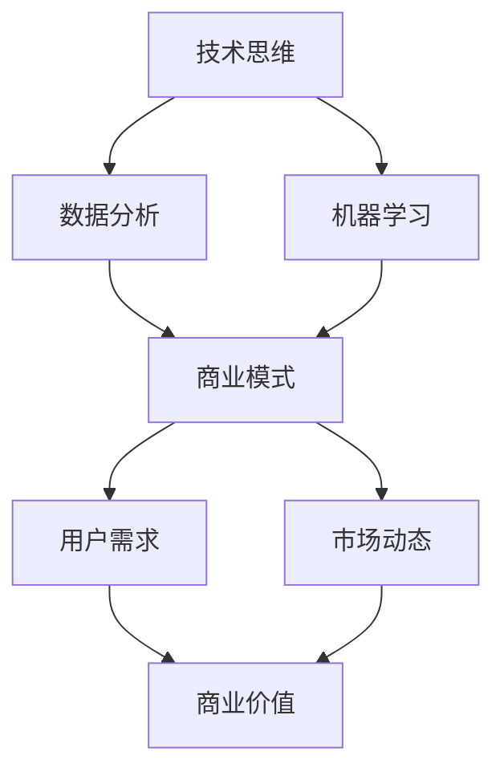

                 

### 背景介绍

在现代科技飞速发展的时代，技术人与商业人之间的界限日益模糊。技术人，如程序员、软件工程师、数据科学家等，他们专注于技术创新、算法优化、系统架构等方面；而商业人则更加关注市场、用户需求、商业模式和盈利能力。然而，随着企业对技术依赖的加深，技术人需要在专业领域之外，拓展商业视野，提升商业洞察力。这不仅有助于技术人更好地理解企业的需求，也能在职业发展中获得更多的机会和挑战。

本文旨在探讨技术人如何从技术思维向商业思维转变，提升商业洞察力。我们将详细解析这一转变的过程，通过实际案例和具体操作步骤，帮助技术人更好地融入商业环境，发挥自身的技术优势。本文将涵盖以下内容：

1. **核心概念与联系**：介绍与商业思维相关的重要概念，并通过Mermaid流程图展示技术思维与商业思维之间的联系。
2. **核心算法原理 & 具体操作步骤**：讲解技术人应如何运用数据分析、机器学习等技术手段，提升商业洞察力。
3. **数学模型和公式 & 详细讲解 & 举例说明**：介绍相关数学模型和公式，并通过具体案例进行讲解。
4. **项目实战：代码实际案例和详细解释说明**：通过实际项目展示如何将理论知识应用到实践中。
5. **实际应用场景**：探讨技术人在不同商业场景中的应用和挑战。
6. **工具和资源推荐**：推荐学习资源和开发工具。
7. **总结：未来发展趋势与挑战**：总结全文，展望未来趋势和挑战。

通过本文的阅读，技术人将能够深入了解商业思维的重要性，掌握提升商业洞察力的方法和技巧，从而在职业发展中实现更大的突破。

> **关键词**：商业洞察力，技术思维，商业思维，数据科学，机器学习，案例分析

> **摘要**：本文深入探讨了技术人如何通过提升商业洞察力，实现从技术思维向商业思维的转变。通过详细解析核心概念、算法原理、数学模型，以及实际项目案例，技术人将能够更好地理解商业环境，提升自身的职业竞争力。

# 技术人如何提升商业洞察力：从技术思维到商业思维的转变

## 1. 背景介绍

在当今的商业环境中，技术人与商业人的角色正日益融合。技术人不再仅仅是编码和解决技术问题，他们需要更深入地理解商业逻辑，以技术手段解决商业问题，从而提升企业的整体竞争力。商业洞察力，作为对商业环境、市场动态和用户需求的深刻理解，成为技术人在职业生涯中不可或缺的一项能力。

然而，技术人与商业人之间的思维差异，常常成为他们沟通和协作的障碍。技术思维强调逻辑性、系统性、工程实现，注重问题的解决过程和算法优化；而商业思维则强调市场导向、用户需求、商业模式和盈利能力，注重问题的最终价值和商业回报。这种差异导致技术人往往在商业环境中感到迷茫，无法有效地将技术优势转化为商业成果。

提升商业洞察力，就是帮助技术人跨越这一思维鸿沟，实现技术思维向商业思维的转变。这不仅有助于技术人更好地理解企业的战略和目标，也能够在技术解决方案的设计和实施中，更加符合商业需求，实现商业价值。

本文将围绕如何提升商业洞察力展开，从核心概念、算法原理、数学模型、项目实战、实际应用场景等多个角度，详细探讨技术人如何实现这一转变。

## 2. 核心概念与联系

在探讨技术人如何提升商业洞察力之前，首先需要理解一些核心概念和它们之间的联系。以下是几个关键概念及其在技术思维与商业思维中的角色：

### **1. 数据分析**

数据分析是技术人提升商业洞察力的基础工具。通过收集、清洗、处理和分析数据，技术人可以提取出有价值的信息，帮助商业人做出更为明智的决策。在技术思维中，数据分析强调算法的效率和准确性；在商业思维中，数据分析则关注数据背后的商业价值和决策支持。

### **2. 机器学习**

机器学习是数据分析的延伸，通过建立模型和算法，让计算机自动从数据中学习并做出预测。技术人利用机器学习可以预测市场趋势、用户行为等，为商业人提供更为精准的商业策略。在技术思维中，机器学习关注模型的训练和优化；在商业思维中，机器学习则关注模型的应用和商业价值。

### **3. 商业模式**

商业模式是企业如何创造、传递和获取价值的基本逻辑。技术人需要理解不同的商业模式，以便将技术优势与商业需求相结合，实现商业创新。在技术思维中，商业模式关注技术实现的可能性和技术优化的空间；在商业思维中，商业模式关注市场的接受度和盈利能力。

### **4. 用户需求**

用户需求是商业成功的关键。技术人需要深入了解用户需求，以便开发出更加符合市场需求的产品和服务。在技术思维中，用户需求关注产品的功能和性能；在商业思维中，用户需求关注产品的商业价值和用户满意度。

### **5. 市场动态**

市场动态是商业环境的重要组成部分。技术人需要关注市场动态，以便把握市场趋势，及时调整技术和商业策略。在技术思维中，市场动态关注技术的竞争力和发展前景；在商业思维中，市场动态关注商业机会和风险。

下面是一个使用Mermaid绘制的流程图，展示了技术思维与商业思维之间的联系：



在这个流程图中，我们可以看到，技术思维通过数据分析、机器学习等工具，与商业模式、用户需求和市场动态等商业思维要素相互连接，最终实现商业价值的创造和传递。

## 3. 核心算法原理 & 具体操作步骤

为了提升商业洞察力，技术人需要掌握一系列核心算法原理，并能够将这些原理应用到实际操作中。以下是一些关键的算法原理和具体操作步骤：

### **1. 数据分析**

**原理：** 数据分析涉及数据的收集、清洗、处理和分析。技术人可以通过描述性统计分析、相关性分析和回归分析等手段，提取数据中的有用信息。

**操作步骤：**
- **数据收集：** 从各种数据源（如数据库、日志文件等）收集数据。
- **数据清洗：** 去除数据中的噪声和异常值，保证数据的质量。
- **数据处理：** 将数据转换为适合分析的形式，如数值化、标准化等。
- **描述性统计分析：** 计算数据的均值、方差、中位数等统计量，了解数据的基本特征。
- **相关性分析：** 分析变量之间的相关性，帮助理解数据之间的关联性。
- **回归分析：** 通过建立回归模型，预测一个变量（因变量）与另一个变量（自变量）之间的关系。

### **2. 机器学习**

**原理：** 机器学习是通过训练模型来从数据中学习规律，从而进行预测或分类。技术人可以利用监督学习、无监督学习和强化学习等不同类型的机器学习算法，解决不同的商业问题。

**操作步骤：**
- **数据预处理：** 与数据分析类似，对数据进行清洗、处理和转换。
- **特征工程：** 选择和构造有助于模型训练的特征，提高模型的预测能力。
- **模型选择：** 根据问题类型和数据特点，选择合适的机器学习算法，如线性回归、决策树、神经网络等。
- **模型训练：** 使用训练数据集训练模型，调整模型参数，优化模型性能。
- **模型评估：** 使用验证数据集评估模型的性能，确保模型泛化能力强。
- **模型部署：** 将训练好的模型部署到生产环境中，进行实际预测或分类任务。

### **3. 数据挖掘**

**原理：** 数据挖掘是从大量数据中发现隐藏的、有价值的模式和知识。技术人可以利用关联规则学习、聚类分析、分类分析等数据挖掘技术，发现数据中的潜在关系和趋势。

**操作步骤：**
- **数据预处理：** 与前面类似，保证数据的质量和格式。
- **关联规则学习：** 发现数据中的频繁模式和关联性，用于推荐系统、市场细分等。
- **聚类分析：** 将数据分为多个群组，每个群组内部的数据相似度较高，用于用户行为分析、市场细分等。
- **分类分析：** 建立分类模型，将数据分为不同的类别，用于信用评分、欺诈检测等。

### **4. 贝叶斯网络**

**原理：** 贝叶斯网络是一种概率图模型，通过表示变量之间的条件依赖关系，实现复杂问题的概率推断。技术人可以利用贝叶斯网络进行风险评估、决策支持等。

**操作步骤：**
- **建模：** 根据问题定义变量，并确定变量之间的依赖关系。
- **概率分布：** 给定变量之间的依赖关系，计算每个变量的概率分布。
- **推断：** 使用贝叶斯推理，根据已知信息推断未知的变量状态。

### **5. 决策树**

**原理：** 决策树是一种基于特征进行决策的树形结构，通过划分特征空间，将数据分类或回归到不同的类别。技术人可以利用决策树进行分类和回归任务。

**操作步骤：**
- **特征选择：** 根据特征的重要性，选择有助于决策的特征。
- **划分特征空间：** 使用划分策略（如信息增益、基尼不纯度等），将特征空间划分为多个子空间。
- **构建决策树：** 递归地构建决策树，直到满足停止条件（如最大深度、最小叶节点数等）。
- **剪枝：** 为了防止过拟合，对决策树进行剪枝，简化树的结构。

### **6. 集成学习方法**

**原理：** 集成学习方法通过结合多个弱学习器（如决策树、随机森林、梯度提升树等），构建强学习器，提高模型的性能和泛化能力。技术人可以利用集成学习方法解决复杂的分类和回归问题。

**操作步骤：**
- **基学习器选择：** 选择不同的基学习器，如决策树、随机森林等。
- **集成策略：** 选择集成策略，如Bagging、Boosting等。
- **模型训练：** 分别训练每个基学习器，并集成它们的预测结果。
- **模型评估：** 评估集成模型的性能，并进行参数调整。

通过掌握这些核心算法原理和具体操作步骤，技术人可以更加灵活地应对商业问题，提升商业洞察力。

## 4. 数学模型和公式 & 详细讲解 & 举例说明

在提升商业洞察力的过程中，数学模型和公式是不可或缺的工具。它们不仅帮助我们理解商业问题的本质，还能提供量化的方法来进行决策和优化。以下是一些关键的数学模型和公式，以及它们的详细讲解和实际应用举例。

### **1. 线性回归模型**

**公式：** 
\[ Y = \beta_0 + \beta_1X + \epsilon \]

其中，\( Y \) 是因变量，\( X \) 是自变量，\( \beta_0 \) 和 \( \beta_1 \) 是模型的参数，\( \epsilon \) 是误差项。

**讲解：** 线性回归模型用于分析自变量与因变量之间的线性关系。通过拟合线性模型，可以预测因变量的值。

**举例：** 假设一家公司想要预测下一季度的销售额。已知历史数据中，销售额与广告支出之间存在线性关系。通过线性回归模型，可以拟合出一个销售额预测模型，从而在给定广告支出预算的情况下预测未来的销售额。

### **2. 逻辑回归模型**

**公式：**
\[ \text{logit}(P) = \ln\left(\frac{P}{1 - P}\right) = \beta_0 + \beta_1X \]

其中，\( P \) 是事件发生的概率，\( \text{logit}(P) \) 是逻辑函数，\( \beta_0 \) 和 \( \beta_1 \) 是模型的参数。

**讲解：** 逻辑回归模型用于分类问题，通过拟合逻辑函数，可以预测事件发生的概率。

**举例：** 假设一家银行想要预测客户的贷款申请是否会被批准。已知历史数据中，客户的信用评分与贷款批准概率之间存在逻辑关系。通过逻辑回归模型，可以拟合出一个贷款批准概率预测模型，从而在给定信用评分的情况下预测贷款申请的批准概率。

### **3. 决策树模型**

**公式：**
\[ Y = \sum_{i=1}^n \beta_i X_i \]

其中，\( Y \) 是因变量，\( X_i \) 是特征变量，\( \beta_i \) 是特征权重。

**讲解：** 决策树模型通过一系列规则进行决策，每个节点代表一个特征，每个分支代表一个特征取值，最终在叶节点处得到分类或回归结果。

**举例：** 假设一家电商平台想要预测用户的购物车中是否包含特定商品。通过决策树模型，可以基于用户的历史购物行为和其他特征，构建出一个包含特定商品的概率预测模型。

### **4. 随机森林模型**

**公式：**
\[ \hat{Y} = \frac{1}{m} \sum_{i=1}^m \hat{y_i} \]

其中，\( m \) 是随机森林中的决策树数量，\( \hat{y_i} \) 是第 \( i \) 棵决策树的预测结果。

**讲解：** 随机森林模型通过集成多个决策树，提高模型的预测能力和鲁棒性。每个决策树都是基于随机特征选择和随机数据分割构建的。

**举例：** 假设一家银行想要预测客户的信用评分。通过随机森林模型，可以基于多个特征（如收入、年龄、负债等），构建出一个信用评分预测模型，从而更准确地评估客户的信用风险。

### **5. 支持向量机模型**

**公式：**
\[ w \cdot x + b = 0 \]

其中，\( w \) 是权重向量，\( x \) 是特征向量，\( b \) 是偏置项。

**讲解：** 支持向量机模型通过找到一个最佳的超平面，将不同类别的数据点分隔开。它可以通过优化目标函数来找到最佳的权重和偏置。

**举例：** 假设一家公司想要对客户进行分类，区分高价值客户和低价值客户。通过支持向量机模型，可以基于客户的特征（如消费金额、购买频率等），构建出一个客户分类模型。

### **6. 贝叶斯网络模型**

**公式：**
\[ P(A|B) = \frac{P(B|A)P(A)}{P(B)} \]

其中，\( P(A|B) \) 是在事件 \( B \) 发生的条件下事件 \( A \) 发生的概率，\( P(B|A) \) 是在事件 \( A \) 发生的条件下事件 \( B \) 发生的概率，\( P(A) \) 和 \( P(B) \) 分别是事件 \( A \) 和 \( B \) 的先验概率。

**讲解：** 贝叶斯网络模型通过表示变量之间的条件依赖关系，进行概率推断和决策支持。

**举例：** 假设一家保险公司想要预测客户是否会购买保险。通过贝叶斯网络模型，可以基于客户的基本信息（如年龄、性别、收入等），计算客户购买保险的概率。

通过掌握这些数学模型和公式，技术人可以更好地理解和解决商业问题，提升自身的商业洞察力。

## 5. 项目实战：代码实际案例和详细解释说明

为了更好地理解如何将提升商业洞察力的方法应用到实际项目中，以下我们将通过一个实际案例进行详细讲解。

### **5.1 开发环境搭建**

首先，我们需要搭建一个合适的项目开发环境。以下是所需工具和软件的安装步骤：

- **Python**：安装Python 3.8及以上版本。
- **Jupyter Notebook**：安装Jupyter Notebook用于编写和运行代码。
- **Pandas**：用于数据预处理和分析。
- **NumPy**：用于数值计算。
- **Scikit-learn**：用于机器学习算法的实现。
- **Matplotlib**：用于数据可视化。

安装步骤如下：

```bash
pip install python==3.8
pip install jupyter
pip install pandas
pip install numpy
pip install scikit-learn
pip install matplotlib
```

### **5.2 源代码详细实现和代码解读**

接下来，我们将使用Python和Scikit-learn库来构建一个简单的客户分类项目。以下是项目的源代码及详细解释。

```python
# 导入所需的库
import pandas as pd
import numpy as np
from sklearn.model_selection import train_test_split
from sklearn.preprocessing import StandardScaler
from sklearn.tree import DecisionTreeClassifier
from sklearn.metrics import accuracy_score, classification_report
import matplotlib.pyplot as plt

# 数据预处理
# 加载数据集
data = pd.read_csv('customer_data.csv')

# 数据清洗和预处理
# 删除缺失值和异常值
data = data.dropna()

# 特征工程
# 选择特征和目标变量
X = data[['age', 'income', 'credit_score']]
y = data['is_high_value']

# 数据标准化
scaler = StandardScaler()
X_scaled = scaler.fit_transform(X)

# 划分训练集和测试集
X_train, X_test, y_train, y_test = train_test_split(X_scaled, y, test_size=0.2, random_state=42)

# 模型训练
# 使用决策树分类器
clf = DecisionTreeClassifier()
clf.fit(X_train, y_train)

# 模型预测
y_pred = clf.predict(X_test)

# 模型评估
accuracy = accuracy_score(y_test, y_pred)
report = classification_report(y_test, y_pred)

print("Accuracy:", accuracy)
print("Classification Report:")
print(report)

# 可视化
# 绘制决策树
plt.figure(figsize=(12, 8))
tree = clf.get_tree()
tree.plot_tree()
plt.show()
```

### **5.3 代码解读与分析**

上述代码实现了一个简单的客户分类项目，以下是对代码的详细解读和分析：

- **数据预处理**：首先，我们加载了一个CSV文件作为数据集，并进行了数据清洗和预处理。这一步骤非常重要，因为数据的准确性和完整性直接影响到模型的性能。

- **特征工程**：接着，我们选择了三个特征（年龄、收入和信用评分）作为输入变量，并设置了目标变量（是否为高价值客户）。

- **数据标准化**：为了消除不同特征之间的量纲差异，我们使用了StandardScaler对特征进行了标准化处理。

- **划分训练集和测试集**：通过train_test_split函数，我们将数据集划分为训练集和测试集，通常使用80%的数据作为训练集，20%的数据作为测试集。

- **模型训练**：我们使用了Scikit-learn中的DecisionTreeClassifier作为分类器，并使用fit方法对模型进行训练。

- **模型预测**：使用训练好的模型对测试集进行预测，得到预测结果。

- **模型评估**：通过accuracy_score函数计算模型的准确率，并使用classification_report函数输出详细分类报告。

- **可视化**：最后，我们绘制了决策树，以便直观地理解模型的决策过程。

通过这个实际案例，我们可以看到如何将提升商业洞察力的方法应用到实际项目中。关键步骤包括数据预处理、特征工程、模型选择和训练、模型评估等。这些步骤不仅帮助我们理解商业问题的本质，还能确保我们的模型具有良好的性能和可解释性。

## 6. 实际应用场景

技术人提升商业洞察力后，可以在多个实际应用场景中发挥重要作用，以下是一些典型的应用场景和挑战：

### **1. 产品开发**

在产品开发过程中，技术人需要深入理解用户需求和市场动态，以确保产品能够满足用户需求，并在市场中获得成功。提升商业洞察力可以帮助技术人更好地识别市场需求，优化产品设计，提高用户满意度。例如，在开发一款社交应用时，技术人可以通过数据分析了解用户的活跃时间、偏好功能等，从而设计出更符合用户需求的产品。

### **2. 市场营销**

市场营销是提升商业洞察力的另一个关键应用场景。技术人可以利用数据分析和机器学习技术，分析用户行为数据，预测市场趋势，优化营销策略。例如，通过分析用户点击行为、购买记录等，技术人可以识别高潜力用户群体，制定个性化的营销策略，提高转化率和客户忠诚度。

### **3. 经营管理**

在经营管理方面，技术人可以通过数据分析优化供应链管理、库存管理、成本控制等，提高企业运营效率。例如，通过分析销售数据和库存数据，技术人可以预测未来的销售趋势，优化库存水平，减少库存成本。此外，技术人还可以利用机器学习技术进行预测性维护，减少设备故障和停机时间。

### **4. 风险控制**

在金融和保险行业，技术人可以通过数据分析和技术手段进行风险评估和欺诈检测。例如，通过分析客户的信用记录、交易行为等，技术人可以预测客户的风险等级，采取相应的风险控制措施。此外，技术人还可以利用机器学习算法进行异常检测，识别欺诈行为，提高风险控制能力。

### **5. 创新研发**

在创新研发方面，技术人可以通过数据分析挖掘潜在的商业机会，推动技术创新。例如，通过分析市场趋势和竞争对手动态，技术人可以识别出新的市场需求，指导研发团队进行产品创新。此外，技术人还可以利用机器学习技术进行模式识别，发现新的商业模式和产品功能。

### **6. 挑战**

虽然提升商业洞察力有助于技术人在各个领域发挥更大的作用，但这一过程中也面临着一些挑战：

- **数据隐私和安全**：在处理和分析用户数据时，技术人需要确保数据隐私和安全，遵守相关法律法规。
- **技术复杂性**：商业问题的复杂性可能导致技术实现的复杂性，技术人需要具备足够的技术能力来应对这些挑战。
- **沟通与协作**：技术人需要与商业人进行有效的沟通和协作，理解彼此的需求和期望，这需要一定的沟通技巧和跨部门协作能力。
- **持续学习**：商业环境和技术的快速变化要求技术人持续学习，不断更新知识和技能。

通过应对这些挑战，技术人可以不断提升自身的商业洞察力，在职业生涯中实现更大的成就。

## 7. 工具和资源推荐

为了更好地提升商业洞察力，技术人需要掌握一系列工具和资源。以下是一些推荐的学习资源、开发工具和相关的论文著作：

### **7.1 学习资源推荐**

- **书籍：**
  - 《深度学习》（Goodfellow, Bengio, Courville著）：全面介绍了深度学习的基本概念、算法和应用。
  - 《Python数据分析》（Wes McKinney著）：详细介绍了Python在数据分析中的应用，适合初学者和进阶者。
  - 《Python机器学习》（Pedro Domingos著）：介绍了机器学习的基本原理和应用，涵盖了许多实际案例。

- **在线课程：**
  - Coursera的《机器学习》课程：由吴恩达教授主讲，适合初学者了解机器学习的基本概念和方法。
  - edX的《数据科学基础》课程：涵盖数据科学的基础知识，包括数据分析、机器学习等。

- **博客和网站：**
  - Medium上的数据科学博客：提供丰富的数据科学相关文章，涵盖最新技术和应用案例。
  - Kaggle：一个数据科学竞赛平台，提供大量的数据集和项目案例，适合实践和练习。

### **7.2 开发工具推荐**

- **数据预处理工具：**
  - Pandas：Python中的数据操作库，用于数据处理和分析。
  - NumPy：Python中的科学计算库，用于数值计算和数据分析。

- **机器学习框架：**
  - Scikit-learn：Python中的机器学习库，提供多种经典的机器学习算法。
  - TensorFlow：谷歌开源的机器学习框架，适用于深度学习和复杂模型。

- **可视化工具：**
  - Matplotlib：Python中的绘图库，用于数据可视化和图形展示。
  - Seaborn：基于Matplotlib的统计图形库，提供多种数据可视化模板。

### **7.3 相关论文著作推荐**

- **经典论文：**
  - “Gradient-Based Learning Applied to Document Classification”（1988）：介绍了支持向量机的原理和应用。
  - “Learning to Represent Text as a Sequence of Phrases”（2014）：介绍了词向量模型（如Word2Vec）的基本概念和应用。

- **著作推荐：**
  - 《模式识别与机器学习》（Bishop著）：全面介绍了模式识别和机器学习的基本理论和方法。
  - 《统计学习方法》（李航著）：系统介绍了统计学习的基本概念和方法，包括线性回归、逻辑回归、支持向量机等。

通过利用这些工具和资源，技术人可以更加系统地学习和掌握商业洞察力的相关知识和技能，提升自身的竞争力。

## 8. 总结：未来发展趋势与挑战

在当今科技飞速发展的时代，提升商业洞察力对技术人来说显得尤为重要。从技术思维向商业思维的转变，不仅有助于技术人更好地理解企业的需求，还能在职业发展中获得更多的机会和挑战。

**未来发展趋势：**

1. **数据科学与商业融合**：随着大数据和人工智能技术的普及，数据科学在商业决策中的应用将更加广泛。技术人需要掌握数据分析、机器学习等技能，将技术优势转化为商业成果。

2. **个性化服务与智能化**：商业领域的个性化服务将更加智能化。技术人可以通过数据分析和机器学习技术，为用户提供定制化的产品和服务，提高用户满意度和忠诚度。

3. **跨界合作与生态构建**：技术人与商业人之间的合作将更加紧密，形成跨界合作和创新生态。技术人需要具备跨领域的视野和沟通能力，与商业人共同推动业务创新。

4. **新兴技术驱动**：随着区块链、物联网、5G等新兴技术的发展，商业领域将迎来新的变革。技术人需要不断学习新技术，掌握前沿科技，为商业创新提供技术支持。

**面临挑战：**

1. **数据隐私和安全**：在处理和分析用户数据时，技术人需要确保数据隐私和安全，遵守相关法律法规，防范数据泄露和滥用风险。

2. **技术复杂性**：商业问题的复杂性可能导致技术实现的复杂性。技术人需要具备足够的技术能力，应对复杂的业务需求和系统设计。

3. **沟通与协作**：技术人与商业人之间的有效沟通和协作至关重要。技术人需要具备良好的沟通技巧和跨部门协作能力，确保项目顺利进行。

4. **持续学习**：商业环境和技术的快速变化要求技术人持续学习，不断更新知识和技能。技术人需要保持对新技术和商业趋势的敏感性，保持学习状态。

总之，提升商业洞察力是技术人在未来职业发展中不可或缺的一环。通过掌握数据分析、机器学习等核心技能，以及不断学习新技术和商业知识，技术人可以在商业环境中发挥更大的作用，实现个人和企业的共同成长。

## 9. 附录：常见问题与解答

### **Q1：技术人如何开始提升商业洞察力？**

**A1**：首先，技术人可以通过阅读相关的商业书籍和论文，了解商业基础知识和商业模式。其次，参与数据科学和机器学习的在线课程和培训，掌握相关技能。此外，可以积极参加行业会议、论坛等活动，与商业人士交流，拓宽视野。最重要的是，将学到的知识应用到实际项目中，通过实践不断积累经验。

### **Q2：提升商业洞察力对技术人的职业发展有何帮助？**

**A2**：提升商业洞察力可以帮助技术人更好地理解企业的需求，推动技术创新，实现商业价值。这不仅能提高技术人的职业竞争力，还能在职业生涯中获得更多的机会和挑战。此外，商业洞察力有助于技术人与商业人之间的有效沟通和协作，促进跨部门合作，推动业务创新。

### **Q3：如何确保在提升商业洞察力的过程中不偏离技术本质？**

**A3**：在提升商业洞察力的过程中，技术人应保持对技术本质的坚持，始终关注技术的实现和应用。可以通过以下方法确保：

- **项目驱动**：将商业洞察力应用到实际项目中，通过实践不断积累经验。
- **持续学习**：关注技术发展趋势，不断更新知识和技能。
- **技术复盘**：在项目结束后，进行技术复盘，总结经验教训，确保技术实施的质量和效果。
- **专业交流**：与同行交流，分享技术经验和见解，保持技术视野的开放和更新。

### **Q4：如何处理商业问题中的不确定性和复杂性？**

**A4**：面对不确定性和复杂性，技术人可以采取以下策略：

- **分而治之**：将复杂问题分解为多个子问题，逐一解决。
- **迭代优化**：通过迭代和优化的方法，逐步改进解决方案。
- **数据驱动**：利用数据分析技术，挖掘数据中的规律和模式，为决策提供支持。
- **模拟与预测**：使用模拟和预测技术，评估不同方案的风险和效果，选择最优方案。
- **灵活应对**：保持开放和灵活的思维，及时调整策略和方法，以应对不确定性和复杂性。

通过以上策略，技术人可以更好地处理商业问题中的不确定性和复杂性，提升解决问题的能力。

## 10. 扩展阅读 & 参考资料

在提升商业洞察力的过程中，阅读相关书籍、论文和参考资料是不可或缺的。以下是一些推荐的扩展阅读和参考资料，旨在帮助技术人深入理解商业思维和技术应用，进一步拓展知识视野。

### **10.1 书籍推荐**

- 《深度工作：如何有效利用每一点脑力》（Cal Newport著）：介绍了如何通过深度工作提升个人能力和职业发展，适合技术人在繁忙的工作中保持高效。
- 《精益创业》（Eric Ries著）：系统介绍了精益创业的方法论，适用于技术人在创业和项目管理中的实践。
- 《非对称战争》（John Arquilla 和 David Ronfeldt 著）：探讨了信息技术在军事战略中的应用，对技术人理解科技对商业环境的影响有重要参考价值。
- 《创新者的窘境》（Clayton M. Christensen 著）：分析了技术创新与市场变革的关系，对技术人在商业创新中的思考具有指导意义。

### **10.2 论文推荐**

- “Deep Learning: A Brief History” （Yann LeCun等著）：介绍了深度学习的发展历程和核心技术，适合对深度学习感兴趣的技术人阅读。
- “The Economics of Artificial Intelligence: A Conceptual Framework” （Cees van Braak 和 Floris de Vries 著）：探讨了人工智能的经济影响和商业模式，有助于技术人理解AI的商业应用。
- “Data-Driven Business: The Game-Changing Role of Big Data in Your Company” （Phil Simon 著）：分析了大数据在企业决策和运营中的重要作用，适合技术人理解数据科学在商业中的应用。

### **10.3 网络资源推荐**

- [Kaggle](https://www.kaggle.com/)：一个数据科学竞赛平台，提供大量的数据集和项目案例，是技术人实践和提升技能的理想场所。
- [Medium](https://medium.com/)：一个内容创作平台，拥有丰富的商业和技术文章，适合技术人学习和交流。
- [ArXiv](https://arxiv.org/)：一个开放获取的学术论文存储库，涵盖计算机科学、物理学、数学等多个领域，是获取最新研究成果的重要渠道。

通过阅读这些书籍、论文和网络资源，技术人可以更好地理解商业思维，提升自身的商业洞察力，为职业发展打下坚实的基础。

