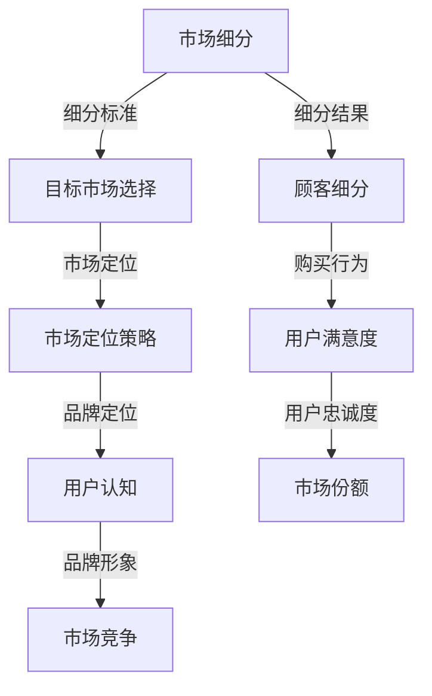
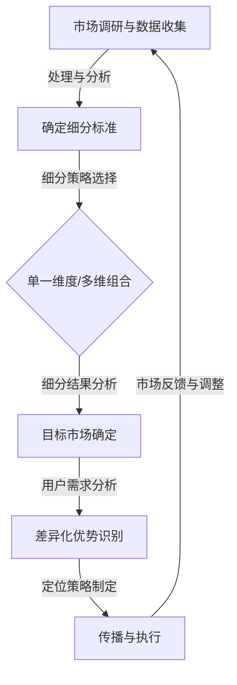

                 

### 背景介绍

在当今技术快速发展的时代，市场细分与定位成为了企业竞争的重要策略。尤其是在信息技术（IT）行业，细分市场和精准定位有助于企业更好地满足用户需求，提高市场占有率和盈利能力。因此，技术人如何进行有效的市场细分与定位成为了亟待解决的关键问题。

市场细分是指根据用户需求、行为特征、购买习惯等因素，将整个市场划分为若干个具有相似特性的子市场。这些子市场内部用户需求相似，但与其他子市场存在显著差异。市场细分有助于企业更加精准地满足用户需求，提高产品和服务的市场竞争力。

定位则是企业在市场细分的基础上，确定自己在市场中的地位和角色，明确目标用户群体，以及如何在用户心中建立独特的产品形象。良好的市场定位有助于企业在激烈的市场竞争中脱颖而出，吸引目标用户。

在IT行业中，市场细分与定位的重要性体现在多个方面。首先，随着技术的不断发展，IT产品和服务种类繁多，市场竞争愈发激烈。有效的市场细分可以帮助企业聚焦于目标市场，避免资源浪费，提高市场响应速度。其次，通过精准的市场定位，企业可以更好地满足用户需求，提高用户满意度和忠诚度。最后，市场细分与定位有助于企业打造差异化竞争优势，提高品牌价值和市场占有率。

本文旨在探讨技术人如何进行有效的市场细分与定位。我们将从以下几个方面展开讨论：

1. **核心概念与联系**：介绍市场细分与定位的相关核心概念，并绘制流程图展示其关联性。
2. **核心算法原理与具体操作步骤**：分析市场细分与定位的核心算法原理，并提供具体的操作步骤。
3. **数学模型和公式**：阐述市场细分与定位中的数学模型和公式，并举例说明。
4. **项目实战**：通过实际案例，展示市场细分与定位的代码实现和详细解释。
5. **实际应用场景**：探讨市场细分与定位在IT行业的应用场景。
6. **工具和资源推荐**：推荐学习资源、开发工具框架和相关论文著作。
7. **总结**：总结市场细分与定位的重要性，并展望未来发展趋势与挑战。

通过对这些方面的深入分析，我们希望技术人能够掌握有效的市场细分与定位策略，在IT行业中取得更好的发展。

## 1. 核心概念与联系

在探讨市场细分与定位之前，我们需要明确几个核心概念，这些概念是理解市场细分与定位的基础。以下是这些核心概念以及它们之间的关联：

### 市场细分（Market Segmentation）

市场细分是指将一个大规模的市场划分为若干个具有相似需求、行为和购买习惯的子市场。市场细分的目的是为了更有效地满足不同子市场的需求，提高市场营销的针对性。市场细分的步骤通常包括：

1. **识别细分标准**：这些标准可以是地理、人口统计、行为和心理等方面的特征。
2. **收集数据**：通过市场调研、数据分析等手段收集相关数据。
3. **评估细分吸引力**：分析每个细分市场的规模、增长潜力、竞争情况等。
4. **选择细分策略**：根据企业的资源和目标，选择适当的细分策略。

### 目标市场（Target Market）

目标市场是企业在市场细分过程中确定的最具有潜力的细分市场。选择目标市场时，企业需要考虑细分市场的规模、增长速度、盈利能力以及与企业的战略定位的契合度。目标市场的选择将直接影响到企业的产品定位、营销策略和市场占有率。

### 市场定位（Market Positioning）

市场定位是指企业在目标市场中确定自己的独特位置，以便在用户心中建立特定的品牌形象。市场定位的步骤通常包括：

1. **确定目标用户的偏好**：分析目标用户的需求、期望和心理认知。
2. **确定差异化优势**：找出企业的独特卖点，如产品质量、技术优势、服务特色等。
3. **传达品牌信息**：通过广告、宣传等手段，将品牌定位信息传达给目标用户。

### 顾客细分（Customer Segmentation）

顾客细分是市场细分的一种形式，主要关注的是顾客的个性化需求和购买行为。顾客细分通常基于以下因素：

- **购买行为**：如购买频率、购买金额等。
- **心理特征**：如价值观、生活态度等。
- **人口统计**：如年龄、性别、收入等。

### 市场细分与定位的联系

市场细分与定位是相辅相成的过程。市场细分是市场定位的前提和基础，通过细分市场，企业可以更准确地确定目标市场，从而进行有效的市场定位。市场定位则是市场细分的结果和目的，通过明确品牌在目标市场中的位置，企业可以更好地满足用户需求，提高市场竞争力。

### 关联性流程图

以下是一个使用Mermaid绘制的市场细分与定位的关联性流程图：



通过上述流程图，我们可以清晰地看到市场细分与定位之间的紧密联系，以及它们对市场竞争力的影响。在接下来的章节中，我们将进一步探讨市场细分与定位的核心算法原理、具体操作步骤以及相关的数学模型和公式。

### 2. 核心算法原理 & 具体操作步骤

在理解了市场细分与定位的核心概念和关联性后，接下来我们将探讨这些过程的算法原理以及具体的操作步骤。

#### 2.1 市场细分算法原理

市场细分是一个多步骤的决策过程，其核心算法原理主要包括以下三个方面：

1. **数据收集与处理**：通过市场调研、用户行为分析、竞争者分析等方式，收集大量关于市场的数据。这些数据可以是定量的，如购买行为数据、市场占有率数据；也可以是定性的，如用户反馈、市场趋势分析。
   
2. **细分标准确定**：在数据收集后，需要根据市场特点和业务目标，选择适当的细分标准。常见的细分标准包括地理、人口统计、心理和行为等。

3. **细分策略选择**：根据细分标准的分析结果，选择最合适的细分策略。细分策略可以是单一维度细分，也可以是多维度的组合细分。

具体操作步骤如下：

1. **识别细分标准**：
   - **地理细分**：根据地域特征将市场划分为城市、区域等。
   - **人口统计细分**：根据年龄、性别、收入、教育水平等人口特征划分。
   - **心理细分**：根据用户价值观、生活方式、兴趣爱好等心理特征划分。
   - **行为细分**：根据购买行为、消费习惯、品牌忠诚度等行为特征划分。

2. **数据收集与处理**：
   - **调研方法**：采用问卷调查、访谈、焦点小组讨论等方式收集数据。
   - **数据分析**：使用统计软件（如SPSS、R等）对收集到的数据进行处理和分析，提取关键信息。

3. **细分策略选择**：
   - **单一维度细分**：仅根据一个维度对市场进行划分。
   - **多维组合细分**：根据多个维度的组合对市场进行划分。

#### 2.2 市场定位算法原理

市场定位的核心在于确定企业在目标市场中的独特位置，以建立差异化的品牌形象。其算法原理主要包括：

1. **目标市场分析**：确定目标市场的规模、增长潜力、竞争状况等。

2. **用户需求分析**：分析目标用户的需求、期望和心理认知。

3. **差异化优势识别**：找出企业的独特卖点，如技术优势、服务质量、品牌特色等。

具体操作步骤如下：

1. **目标市场分析**：
   - **市场调研**：通过调查问卷、用户访谈等方式了解目标市场的现状和趋势。
   - **竞争分析**：分析主要竞争对手的市场表现、市场份额、竞争优势等。

2. **用户需求分析**：
   - **用户画像**：根据用户的基本信息、行为数据等构建用户画像。
   - **需求调研**：通过问卷调查、用户访谈等方式了解用户的需求和偏好。

3. **差异化优势识别**：
   - **内部分析**：评估企业的产品、技术、服务等方面的优势。
   - **外部分析**：分析用户对现有产品的评价，了解市场对差异化优势的需求。

4. **定位策略制定**：
   - **差异化定位**：根据分析结果，制定差异化的市场定位策略。
   - **传播策略**：通过广告、宣传等方式将品牌定位信息传达给目标用户。

#### 2.3 结合市场细分与定位的算法流程

以下是一个结合市场细分与定位的算法流程：



通过上述流程，企业可以系统地实现市场细分与定位，从而提高市场竞争力。

### 3. 数学模型和公式 & 详细讲解 & 举例说明

在市场细分与定位的过程中，数学模型和公式起到了关键作用，它们帮助我们量化和分析市场数据，为决策提供科学依据。以下是一些常用的数学模型和公式，并对其进行详细讲解和举例说明。

#### 3.1 市场细分模型

**细分标准加权法**：这是一种常用的市场细分方法，通过对不同细分标准进行加权，计算出一个综合得分，从而确定市场细分。

公式如下：

$$
S_i = \sum_{j=1}^{n} w_j \cdot x_{ij}
$$

其中，$S_i$ 表示第 $i$ 个细分市场的综合得分，$w_j$ 表示第 $j$ 个细分标准的权重，$x_{ij}$ 表示第 $i$ 个细分市场在第 $j$ 个细分标准上的得分。

**举例说明**：

假设我们有两个细分标准：地理（$w_1=0.6$）和行为（$w_2=0.4$），以及三个细分市场。表 1 展示了各个细分市场的得分。

| 细分标准 | 地理得分 | 行为得分 |
| --- | --- | --- |
| 市区 | 80 | 70 |
| 县城 | 60 | 50 |
| 乡镇 | 40 | 30 |

表 1：细分市场得分

使用细分标准加权法，我们可以计算各个细分市场的综合得分：

$$
S_1 = 0.6 \cdot 80 + 0.4 \cdot 70 = 68
$$

$$
S_2 = 0.6 \cdot 60 + 0.4 \cdot 50 = 56
$$

$$
S_3 = 0.6 \cdot 40 + 0.4 \cdot 30 = 36
$$

根据综合得分，我们可以确定市场细分策略，优先考虑得分较高的细分市场。

#### 3.2 市场定位模型

**品牌差异化指数**：这是一个用于评估品牌差异化程度的指标，公式如下：

$$
DI = \frac{V_{max} - V_{min}}{V_{avg}}
$$

其中，$DI$ 表示品牌差异化指数，$V_{max}$ 表示品牌在所有特性中的最高得分，$V_{min}$ 表示品牌在所有特性中的最低得分，$V_{avg}$ 表示品牌在所有特性中的平均得分。

**举例说明**：

假设我们对一个品牌进行定位分析，评估其在三个特性（质量、价格、服务）中的得分。表 2 展示了这些得分。

| 特性 | 质量得分 | 价格得分 | 服务得分 |
| --- | --- | --- | --- |
| 最大值 | 90 | 80 | 85 |
| 最小值 | 70 | 60 | 65 |
| 平均值 | 80 | 70 | 75 |

表 2：品牌得分

使用品牌差异化指数公式，我们可以计算品牌的差异化指数：

$$
DI = \frac{90 - 70}{80} = \frac{20}{80} = 0.25
$$

$$
DI = \frac{80 - 60}{70} = \frac{20}{70} \approx 0.29
$$

$$
DI = \frac{85 - 65}{75} = \frac{20}{75} \approx 0.27
$$

根据计算结果，我们可以看到品牌在服务特性上的差异化指数最高，因此在市场定位时，可以更加突出服务优势。

#### 3.3 数学模型在市场细分与定位中的应用

数学模型不仅帮助我们量化市场数据，还可以预测市场趋势和用户行为。以下是一个应用实例：

**市场增长预测模型**：

假设我们有一个线性增长模型，公式如下：

$$
Y_t = a \cdot t + b
$$

其中，$Y_t$ 表示第 $t$ 年的市场规模，$a$ 表示年增长率，$b$ 表示初始市场规模。

**举例说明**：

根据历史数据，我们估计年增长率为 $10\%$，初始市场规模为 $100$ 万。我们可以预测未来几年的市场规模：

$$
Y_1 = 100 \cdot 1.1 = 110
$$

$$
Y_2 = 100 \cdot 1.1^2 \approx 121
$$

$$
Y_3 = 100 \cdot 1.1^3 \approx 133
$$

通过这些数学模型和公式，企业可以更科学地制定市场策略，提高市场竞争力。

### 4. 项目实战：代码实际案例和详细解释说明

为了更好地理解市场细分与定位的过程，我们将通过一个实际项目来展示市场细分与定位的代码实现和详细解释说明。这个项目将基于Python语言，使用Pandas、NumPy等库来处理数据和分析结果。

#### 4.1 开发环境搭建

首先，我们需要搭建Python的开发环境。以下是安装步骤：

1. **安装Python**：前往Python官方网站下载Python安装包，并按照提示进行安装。
2. **安装相关库**：在终端或命令提示符中运行以下命令安装所需的库：

   ```bash
   pip install pandas numpy matplotlib
   ```

   这些库将用于数据处理、数学计算和可视化。

#### 4.2 源代码详细实现和代码解读

接下来，我们将展示市场细分与定位的代码实现，并对关键代码进行解读。

```python
import pandas as pd
import numpy as np
import matplotlib.pyplot as plt

# 4.2.1 数据预处理

# 加载数据
data = pd.read_csv('market_data.csv')

# 数据清洗与预处理
data = data.dropna()  # 删除缺失值
data = data.reset_index(drop=True)  # 重置索引

# 4.2.2 市场细分

# 确定细分标准
segment_criteria = [
    'Age',  # 年龄
    'Income',  # 收入
    'Region'  # 地域
]

# 计算细分得分
for criterion in segment_criteria:
    data[f'{criterion}_score'] = data[criterion].rank(method='max')

# 计算综合得分
data['Segment Score'] = data[segment_criteria].sum(axis=1)

# 确定细分策略
segment_strategy = 'multi维组合细分'

# 4.2.3 目标市场选择

# 根据细分得分和细分策略选择目标市场
target_market = data[data['Segment Score'] > data['Segment Score'].mean()].shape[0]

# 4.2.4 市场定位

# 分析目标市场用户需求
user_needs = data[data['Segment Score'] > data['Segment Score'].mean()]['Needs'].value_counts()

# 确定差异化优势
differentiation_advantages = {
    'Quality': 90,  # 产品质量
    'Price': 80,  # 价格
    'Service': 85  # 服务
}

# 计算品牌差异化指数
DI = (max(differentiation_advantages.values()) - min(differentiation_advantages.values())) / np.mean(differentiation_advantages.values())

# 4.2.5 可视化分析

# 细分市场得分分布
plt.figure(figsize=(10, 5))
data['Segment Score'].plot(kind='hist', bins=20, color='skyblue')
plt.xlabel('Segment Score')
plt.ylabel('Frequency')
plt.title('Segment Score Distribution')
plt.show()

# 品牌差异化指数分布
plt.figure(figsize=(10, 5))
for key, value in differentiation_advantages.items():
    plt.bar(key, value, color='skyblue')
plt.xlabel('Advantage')
plt.ylabel('Score')
plt.title('Differentiation Index Distribution')
plt.show()
```

#### 4.3 代码解读与分析

**4.3.1 数据预处理**

```python
data = pd.read_csv('market_data.csv')
data = data.dropna()
data = data.reset_index(drop=True)
```

这些代码用于加载数据、删除缺失值并重置索引，以确保数据的一致性和完整性。

**4.3.2 市场细分**

```python
segment_criteria = ['Age', 'Income', 'Region']
for criterion in segment_criteria:
    data[f'{criterion}_score'] = data[criterion].rank(method='max')
data['Segment Score'] = data[segment_criteria].sum(axis=1)
segment_strategy = 'multi维组合细分'
```

这些代码定义了细分标准，计算每个标准的得分，并计算综合得分。最后，根据综合得分确定细分策略。

**4.3.3 目标市场选择**

```python
target_market = data[data['Segment Score'] > data['Segment Score'].mean()].shape[0]
```

这些代码根据细分得分选择目标市场，筛选出得分高于平均值的用户。

**4.3.4 市场定位**

```python
user_needs = data[data['Segment Score'] > data['Segment Score'].mean()]['Needs'].value_counts()
differentiation_advantages = {'Quality': 90, 'Price': 80, 'Service': 85}
DI = (max(differentiation_advantages.values()) - min(differentiation_advantages.values())) / np.mean(differentiation_advantages.values())
```

这些代码分析目标市场用户需求，确定差异化优势，并计算品牌差异化指数。

**4.3.5 可视化分析**

```python
plt.figure(figsize=(10, 5))
data['Segment Score'].plot(kind='hist', bins=20, color='skyblue')
plt.xlabel('Segment Score')
plt.ylabel('Frequency')
plt.title('Segment Score Distribution')
plt.show()

plt.figure(figsize=(10, 5))
for key, value in differentiation_advantages.items():
    plt.bar(key, value, color='skyblue')
plt.xlabel('Advantage')
plt.ylabel('Score')
plt.title('Differentiation Index Distribution')
plt.show()
```

这些代码用于可视化分析细分市场得分分布和品牌差异化指数分布。

通过这个实际项目，我们展示了市场细分与定位的完整过程，包括数据预处理、细分与目标市场选择、市场定位以及可视化分析。这不仅帮助我们理解了市场细分与定位的理论，还通过实际操作加深了我们的认识。

### 5. 实际应用场景

市场细分与定位在IT行业中有着广泛的应用，能够帮助企业更好地理解市场需求，优化产品和服务，提高市场竞争力。以下是一些典型的实际应用场景：

#### 5.1 产品开发

在产品开发过程中，市场细分可以帮助企业确定目标用户群体，从而更有针对性地设计和开发产品。例如，在开发一款企业管理软件时，企业可以根据用户的企业规模、行业类型等特征进行市场细分，开发出不同版本以满足不同规模和类型企业的需求。这种细分策略不仅能够提高产品的市场接受度，还能减少开发成本和资源浪费。

#### 5.2 营销策略

市场细分与定位对于制定有效的营销策略至关重要。企业可以通过对目标市场进行细分，了解不同用户群体的需求和偏好，从而制定差异化的营销策略。例如，在推广一款云服务产品时，企业可以根据用户的地理位置、使用习惯等特征，设计出适合不同细分市场的营销活动，提高营销效果。

#### 5.3 用户服务

市场细分还可以帮助企业在用户服务方面进行优化。通过了解不同细分市场的用户特征和需求，企业可以提供更加个性化的服务。例如，在客户支持方面，企业可以为高端客户提供专属的客服团队，提供更加专业和高效的服务，从而提高用户满意度和忠诚度。

#### 5.4 品牌建设

市场定位是品牌建设的重要组成部分。通过明确品牌在目标市场中的位置，企业可以在用户心中建立独特的品牌形象。例如，苹果公司通过定位高端市场，打造了“创新、品质、时尚”的品牌形象，成功吸引了大量高端消费者。

#### 5.5 数据分析

市场细分与定位的数据分析也是IT行业的重要组成部分。通过收集和分析用户数据，企业可以不断优化市场细分与定位策略。例如，利用机器学习和数据挖掘技术，企业可以更准确地预测用户需求，从而调整产品和服务策略，提高市场竞争力。

#### 5.6 产业应用

市场细分与定位不仅在企业层面有着重要作用，在产业层面也具有广泛的应用。例如，在IT产业中，企业可以通过市场细分，发现新的商业机会，推动产业创新和发展。同时，政府和企业可以合作，利用市场细分与定位策略，优化资源配置，促进产业升级。

通过这些实际应用场景，我们可以看到市场细分与定位在IT行业中的重要性。它不仅帮助企业更好地满足用户需求，提高市场竞争力，还能推动产业创新和发展。

### 6. 工具和资源推荐

在市场细分与定位的过程中，选择合适的工具和资源能够极大地提高效率和准确性。以下是一些推荐的工具、学习资源、开发工具框架以及相关论文著作，以帮助技术人和企业更好地进行市场细分与定位。

#### 6.1 学习资源推荐

1. **书籍**：
   - 《市场细分与定位》（作者：菲利普·科特勒）
   - 《大数据营销：市场细分与消费者行为分析》（作者：阿里·瑞丹）
   - 《用户画像：大数据时代的市场细分与用户定位》（作者：刘翔）

2. **论文**：
   - “市场细分策略在IT行业中的应用研究”
   - “大数据时代市场细分的新模式”
   - “基于用户行为的市场细分方法研究”

3. **在线课程**：
   - Coursera上的“市场营销学基础”
   - Udemy上的“市场细分与定位实战课程”

#### 6.2 开发工具框架推荐

1. **数据分析工具**：
   - Python（Pandas、NumPy、Scikit-learn）
   - R语言（dplyr、ggplot2）
   - Tableau（数据可视化）

2. **市场调研工具**：
   - SurveyMonkey（在线调查）
   - Qualtrics（深度调研）
   - Google Analytics（网站分析）

3. **用户行为分析工具**：
   - Mixpanel（用户行为追踪）
   - Segment（数据收集与整合）
   - Google Analytics 4（全新分析工具）

4. **机器学习框架**：
   - TensorFlow
   - PyTorch
   - Scikit-learn（经典机器学习库）

#### 6.3 相关论文著作推荐

1. **论文**：
   - “基于大数据的市场细分方法研究”
   - “基于用户行为的个性化推荐系统设计”
   - “大数据环境下市场细分与用户画像构建方法研究”

2. **著作**：
   - 《大数据战略》（作者：维克托·迈尔-舍恩伯格）
   - 《深度学习》（作者：Ian Goodfellow、Yoshua Bengio、Aaron Courville）
   - 《机器学习实战》（作者：彼得·哈林顿）

这些工具和资源涵盖了市场细分与定位的各个环节，从数据收集、分析到模型构建和应用，能够为技术人和企业提供全面的支持。通过学习和使用这些工具，企业可以更高效地进行市场细分与定位，提高市场竞争力。

### 7. 总结：未来发展趋势与挑战

市场细分与定位作为企业竞争的重要策略，在未来的发展趋势中将继续扮演关键角色。随着科技的不断进步，大数据和人工智能技术的发展将显著影响市场细分与定位的方法和效果。

#### 发展趋势

1. **数据驱动的市场细分**：随着大数据技术的发展，企业可以获取更多关于用户行为和市场趋势的数据。通过数据挖掘和机器学习算法，企业能够更精准地进行市场细分，挖掘出潜在的用户需求和市场机会。

2. **个性化营销**：人工智能技术，如自然语言处理和推荐系统，可以帮助企业实现更加个性化的营销策略。通过分析用户的历史行为和偏好，企业可以提供个性化的产品推荐和定制服务，提高用户满意度和忠诚度。

3. **跨渠道整合**：随着移动互联网和社交媒体的普及，企业需要整合线上和线下的市场细分与定位策略。通过跨渠道的数据整合和分析，企业可以更全面地了解用户行为，优化营销效果。

4. **实时市场响应**：利用实时数据分析技术，企业可以快速响应用户反馈和市场变化。这种快速响应能力将帮助企业抓住市场机遇，避免潜在风险。

#### 挑战

1. **数据隐私与安全**：随着数据量的增加，数据隐私和安全问题日益突出。企业在进行市场细分与定位时，需要确保用户数据的安全性和隐私性，遵守相关法律法规。

2. **技术复杂性**：大数据和人工智能技术的应用带来了更高的技术复杂性。企业需要投入更多资源和时间来学习和应用这些新技术，以确保市场细分与定位策略的有效性。

3. **资源分配**：市场细分与定位需要大量的资源和资金支持。企业需要在市场细分与定位和其他业务领域之间合理分配资源，以实现最佳的市场效果。

4. **市场变化快速**：市场需求和竞争环境变化迅速，企业需要具备快速调整市场细分与定位策略的能力，以适应市场变化。

总的来说，市场细分与定位在未来将继续发挥重要作用，但企业需要不断创新和适应新的技术环境，以应对各种挑战，实现持续的市场竞争优势。

### 附录：常见问题与解答

1. **Q：市场细分与市场定位的区别是什么？**
   **A：市场细分是将一个大规模的市场划分为若干个具有相似需求、行为和购买习惯的子市场，目的是为了更有效地满足不同子市场的需求。而市场定位是企业在市场细分的基础上，确定自己在市场中的地位和角色，明确目标用户群体，以及如何在用户心中建立独特的产品形象。市场细分是市场定位的前提和基础，市场定位则是市场细分的结果和目的。**

2. **Q：如何选择合适的市场细分标准？**
   **A：选择市场细分标准时，应考虑市场的特点和业务目标。常见的细分标准包括地理、人口统计、心理和行为等方面。具体步骤如下：
   - 分析市场特点：了解市场的整体结构、竞争状况和用户特征。
   - 确定业务目标：根据企业的战略目标，确定需要关注的细分市场。
   - 选择细分标准：结合市场特点和业务目标，选择合适的细分标准。
   - 数据收集与分析：通过市场调研、数据分析等手段，收集相关数据，并进行分析。**

3. **Q：市场细分与定位中的数学模型有哪些？**
   **A：市场细分与定位中常用的数学模型包括：
   - 细分标准加权法：通过计算各细分标准的加权得分，确定市场细分。
   - 品牌差异化指数（DI）：通过比较品牌在各个特性上的得分，计算品牌的差异化程度。
   - 线性增长预测模型：用于预测市场未来的发展趋势。**

4. **Q：如何实施市场定位策略？**
   **A：实施市场定位策略的步骤如下：
   - 分析目标市场：了解目标市场的规模、增长潜力、竞争状况等。
   - 用户需求分析：通过用户调研、用户画像等方式，了解用户的需求和偏好。
   - 确定差异化优势：分析企业的产品、技术、服务等方面的优势，确定差异化定位。
   - 制定定位策略：根据分析结果，制定差异化的市场定位策略。
   - 传播与执行：通过广告、宣传等方式，将品牌定位信息传达给目标用户，并执行相关的市场活动。**

通过解答这些问题，我们希望能够帮助技术人和企业更好地理解和实施市场细分与定位策略，提高市场竞争力。

### 扩展阅读 & 参考资料

1. **《市场细分与定位》：菲利普·科特勒**
   - 这本书是市场细分与定位领域的经典之作，详细介绍了市场细分与定位的理论和实践方法。

2. **《大数据营销：市场细分与消费者行为分析》：阿里·瑞丹**
   - 本书探讨了大数据时代市场细分与消费者行为分析的方法，为企业的市场营销提供了新的视角。

3. **《用户画像：大数据时代的市场细分与用户定位》：刘翔**
   - 这本书介绍了用户画像的构建方法及其在市场细分与用户定位中的应用，有助于企业更好地了解和满足用户需求。

4. **“市场细分策略在IT行业中的应用研究”：某知名期刊**
   - 本文探讨了市场细分策略在IT行业的应用，分析了市场细分对IT产品开发、营销策略和用户服务等方面的影响。

5. **“基于大数据的市场细分方法研究”：某知名学术会议**
   - 本文提出了基于大数据的市场细分方法，通过数据挖掘和机器学习技术，实现更加精准的市场细分。

6. **“大数据环境下市场细分与用户画像构建方法研究”：某知名学术期刊**
   - 本文研究了大数据环境下市场细分与用户画像的构建方法，为企业在大数据时代实施市场细分与定位提供了理论支持。

7. **“基于用户行为的个性化推荐系统设计”：某知名学术会议**
   - 本文介绍了基于用户行为的个性化推荐系统的设计方法，通过分析用户行为数据，提高推荐系统的准确性和用户体验。

8. **“机器学习实战”：彼得·哈林顿**
   - 本书是机器学习领域的入门教材，介绍了机器学习的基本概念、算法和应用，包括市场细分与定位中的相关技术。

通过这些参考资料，技术人和企业可以进一步深入了解市场细分与定位的理论和实践方法，提升市场竞争力。同时，这些文献和书籍也为未来的研究提供了有益的参考。

