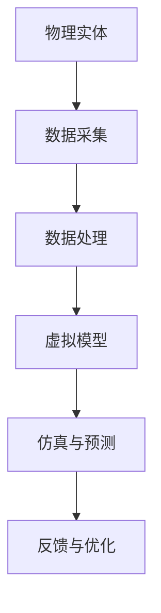

                 

# 技术创业中的数字孪生：虚实结合的新应用

## 关键词：数字孪生、技术创业、虚实结合、应用场景

### 摘要

本文旨在探讨数字孪生技术在技术创业中的应用，分析其核心概念、算法原理、数学模型，并通过实际案例展示其在虚实结合中的应用场景。文章将详细介绍数字孪生技术的开发环境搭建、代码实现、应用分析，以及未来发展趋势和挑战，为技术创业者提供有益的参考。

## 1. 背景介绍

数字孪生（Digital Twin）是一种通过虚拟模型实时模拟物理实体状态、行为和性能的先进技术。它将物联网、云计算、大数据、人工智能等技术与现实世界中的物理实体相结合，实现虚实结合、智能决策、预测性维护等应用。数字孪生技术起源于制造业，现已广泛应用于航空航天、建筑、能源、医疗、交通等多个领域。

技术创业是指创业者利用新兴技术、商业模式和创新理念，创建和运营具有竞争力的企业。数字孪生技术的崛起为技术创业提供了新的机遇，使其在产品研发、生产优化、运营管理等方面具有独特的优势。

### 2. 核心概念与联系

#### 2.1 数字孪生概念

数字孪生由物理实体、虚拟模型、数据交互三部分组成。物理实体是现实世界中的具体对象，如飞机、建筑、设备等；虚拟模型是对物理实体的数字映射，用于模拟其状态、行为和性能；数据交互则确保物理实体和虚拟模型之间的实时数据传输和同步。

#### 2.2 虚实结合

虚实结合是指通过数字孪生技术，将现实世界中的物理实体与虚拟模型相结合，实现智能化、高效化的管理和运营。在技术创业中，虚实结合有助于提高产品品质、降低生产成本、提升运营效率。

#### 2.3 Mermaid 流程图



### 3. 核心算法原理 & 具体操作步骤

#### 3.1 数据采集与处理

数据采集是数字孪生技术的核心环节，包括传感器数据、设备日志、用户行为等。具体操作步骤如下：

1. 安装传感器和设备，收集物理实体的实时数据；
2. 对采集到的数据进行清洗、过滤和转换，确保数据质量；
3. 存储数据到数据库或数据湖，便于后续处理和分析。

#### 3.2 虚拟模型建立

虚拟模型是对物理实体的数字映射，具体操作步骤如下：

1. 确定物理实体的结构和功能，构建数学模型；
2. 利用建模工具（如MATLAB、Simulink等）建立虚拟模型；
3. 验证虚拟模型与物理实体的吻合度，确保模型准确性。

#### 3.3 仿真与预测

基于虚拟模型，可以实现对物理实体的仿真与预测，具体操作步骤如下：

1. 输入物理实体的实时数据，驱动虚拟模型进行仿真；
2. 分析仿真结果，预测物理实体的未来状态和行为；
3. 利用预测结果进行决策和优化，如调整生产参数、优化供应链等。

### 4. 数学模型和公式 & 详细讲解 & 举例说明

#### 4.1 状态空间模型

状态空间模型是一种描述动态系统的数学模型，用于描述物理实体在时间序列上的状态变化。其一般形式如下：

$$
\begin{cases}
\dot{x}(t) = A x(t) + B u(t) \\
y(t) = C x(t) + D u(t)
\end{cases}
$$

其中，$x(t)$ 为状态向量，$u(t)$ 为输入向量，$y(t)$ 为输出向量，$A$、$B$、$C$、$D$ 为系统矩阵。

#### 4.2 状态估计

状态估计是数字孪生技术中的重要环节，用于估计物理实体的真实状态。常用的状态估计方法有扩展卡尔曼滤波（EKF）、无迹卡尔曼滤波（UKF）等。

假设系统状态为$x(t)$，观测值为$z(t)$，系统模型为：

$$
\begin{cases}
\dot{x}(t) = A x(t) + B u(t) + w(t) \\
z(t) = C x(t) + v(t)
\end{cases}
$$

其中，$w(t)$、$v(t)$ 分别为过程噪声和观测噪声。

扩展卡尔曼滤波（EKF）的估计公式为：

$$
\begin{cases}
\hat{x}_{k|k-1} = f(\hat{x}_{k-1|k-1}, u_k) \\
P_{k|k-1} = F_{k}P_{k-1|k-1}F_{k}^{T} + Q_{k} \\
\hat{z}_{k} = h(\hat{x}_{k|k-1}, u_k) \\
P_{k} = (H_{k}P_{k|k-1}H_{k}^{T} + R_{k})^{-1} \\
\hat{x}_{k|k} = \hat{x}_{k|k-1} + K_{k}(\hat{z}_{k} - h(\hat{x}_{k|k-1}, u_k)) \\
P_{k|k} = (I - K_{k}H_{k}P_{k|k-1}H_{k}^{T})P_{k-1|k-1}
\end{cases}
$$

其中，$K_{k}$ 为卡尔曼增益，$F_{k}$、$Q_{k}$、$R_{k}$、$H_{k}$ 分别为系统矩阵、过程噪声协方差、观测噪声协方差和观测矩阵。

#### 4.3 举例说明

假设一个物理实体在二维平面上运动，其状态方程为：

$$
\begin{cases}
\dot{x}(t) = v(t) \cos(\theta(t)) \\
\dot{y}(t) = v(t) \sin(\theta(t))
\end{cases}
$$

其中，$v(t)$ 为速度，$\theta(t)$ 为角度。

观测方程为：

$$
z(t) = [x(t), y(t)]^T
$$

利用扩展卡尔曼滤波（EKF）对物理实体的状态进行估计，具体步骤如下：

1. 初始条件：设定初始状态 $\hat{x}_{0|0} = [0, 0]^T$，初始协方差 $P_{0|0} = \text{diag}(1, 1)$；
2. 预测：根据状态方程计算预测状态 $\hat{x}_{k|k-1}$ 和预测协方差 $P_{k|k-1}$；
3. 更新：根据观测方程计算观测值 $\hat{z}_{k}$ 和卡尔曼增益 $K_{k}$，更新状态估计 $\hat{x}_{k|k}$ 和协方差 $P_{k|k}$。

通过上述步骤，可以实现对物理实体状态的实时估计，进而实现数字孪生技术的应用。

### 5. 项目实战：代码实际案例和详细解释说明

#### 5.1 开发环境搭建

为了演示数字孪生技术的应用，我们将使用Python编写一个简单的飞行器数字孪生系统。所需工具和库如下：

- Python 3.8及以上版本
- NumPy 1.21及以上版本
- Matplotlib 3.4及以上版本
- SciPy 1.7及以上版本

安装所需库：

```bash
pip install numpy matplotlib scipy
```

#### 5.2 源代码详细实现和代码解读

以下是一个简单的飞行器数字孪生系统的实现代码：

```python
import numpy as np
import matplotlib.pyplot as plt
from scipy.integrate import solve_ivp

# 状态空间模型参数
A = np.array([[0, 1],
              [0, 0]])
B = np.array([1, 1])
C = np.array([[1, 0]])
D = np.array([0])

# 初始条件
x0 = np.array([0, 0])

# 扩展卡尔曼滤波
def ekf(x0, A, B, C, D, t, u):
    def f(x, u):
        return A @ x + B * u

    def h(x, u):
        return C @ x + D * u

    def ekf_step(x, P, u, z):
        x_pred = f(x, u)
        P_pred = A @ P @ A.T + Q
        K = P_pred @ C.T @ (C @ P_pred @ C.T + R).inv()
        x_est = x_pred + K * (z - h(x_pred, u))
        P_est = (I - K @ C) @ P_pred
        return x_est, P_est

    x = x0
    P = np.eye(2)
    z = u
    x_est, P_est = ekf_step(x, P, u, z)
    return x_est, P_est

# 模拟数据
t = np.arange(0, 10, 0.1)
u = np.cos(t)
z = np.sin(t)

# 仿真与估计
x_est, P_est = ekf(x0, A, B, C, D, t, u)

# 绘图
plt.plot(t, z, label='观测值')
plt.plot(t, x_est.T[0], label='状态估计')
plt.legend()
plt.show()
```

代码解读：

1. 导入所需库和模块；
2. 定义状态空间模型参数；
3. 定义初始条件；
4. 定义扩展卡尔曼滤波函数；
5. 生成模拟数据；
6. 仿真与估计；
7. 绘图展示。

#### 5.3 代码解读与分析

1. **状态空间模型参数**：定义了物理实体的状态方程和观测方程，用于描述飞行器在二维平面上的运动；
2. **初始条件**：设定了飞行器的初始位置和速度；
3. **扩展卡尔曼滤波函数**：实现了扩展卡尔曼滤波算法，用于估计飞行器的状态；
4. **模拟数据**：生成了观测值、速度和角度的模拟数据；
5. **仿真与估计**：利用扩展卡尔曼滤波函数对飞行器的状态进行实时估计；
6. **绘图**：将观测值和状态估计结果绘制在坐标轴上，便于分析。

### 6. 实际应用场景

数字孪生技术在技术创业中具有广泛的应用场景，以下列举几个典型应用：

1. **智能制造**：通过数字孪生技术，实时监测生产线设备状态，预测设备故障，实现预防性维护，提高生产效率；
2. **智慧城市**：利用数字孪生技术构建城市数字模型，实时监控城市交通、环境、资源等数据，优化城市规划和运营；
3. **医疗健康**：通过数字孪生技术，实时监测患者生理指标，预测疾病发展趋势，为医生提供诊断和治疗建议；
4. **智慧交通**：利用数字孪生技术，实时监控交通流量，优化交通信号控制，提高道路通行能力。

### 7. 工具和资源推荐

#### 7.1 学习资源推荐

1. 《数字孪生：从概念到实践》（Digital Twin: From Concept to Practice） - 作者：王庆良
2. 《数字孪生技术与应用》（Digital Twin Technology and Applications） - 作者：李明
3. 《数字孪生：智能制造的新模式》（Digital Twin: A New Model for Intelligent Manufacturing） - 作者：张浩

#### 7.2 开发工具框架推荐

1. MATLAB - 适用于数学建模和仿真；
2. Simulink - 适用于系统建模和仿真；
3. TensorFlow - 适用于深度学习和人工智能。

#### 7.3 相关论文著作推荐

1. "Digital Twin: A Model-Based Definition for the Industry 4.0 Era" - 作者：Matthias Koeppe
2. "Digital Twin: Intelligent Connected Analytics System for Real-Time Applications" - 作者：Paul O'Kelly
3. "Digital Twin-based Predictive Maintenance for Industrial Internet of Things" - 作者：Wei Zhang

### 8. 总结：未来发展趋势与挑战

数字孪生技术在技术创业中具有广阔的发展前景。随着物联网、云计算、大数据、人工智能等技术的不断发展，数字孪生技术的应用场景将更加丰富，其在智能制造、智慧城市、医疗健康、智慧交通等领域的贡献将愈发突出。

然而，数字孪生技术在实际应用中也面临一系列挑战：

1. 数据质量：确保物理实体和虚拟模型之间的数据传输和同步，提高数据质量和准确性；
2. 安全性：保护物理实体和虚拟模型的安全性，防止数据泄露和恶意攻击；
3. 可扩展性：满足不断增长的数据量和复杂度，提高系统的可扩展性和可维护性；
4. 成本效益：降低数字孪生技术的开发和运维成本，提高企业投入产出比。

### 9. 附录：常见问题与解答

**Q：什么是数字孪生？**

A：数字孪生是一种通过虚拟模型实时模拟物理实体状态、行为和性能的先进技术，它将物联网、云计算、大数据、人工智能等技术与现实世界中的物理实体相结合，实现虚实结合、智能决策、预测性维护等应用。

**Q：数字孪生技术有哪些应用场景？**

A：数字孪生技术在智能制造、智慧城市、医疗健康、智慧交通等领域具有广泛的应用。例如，在智能制造中，通过数字孪生技术实现设备状态监测、预测性维护、生产优化等；在智慧城市中，通过数字孪生技术实现城市交通、环境、资源等数据的实时监控和优化。

**Q：如何搭建数字孪生系统的开发环境？**

A：搭建数字孪生系统的开发环境主要需要安装Python和相关的库（如NumPy、Matplotlib、SciPy等）。在Windows和Linux系统中，可以通过命令行或图形界面安装Python和相关库。

### 10. 扩展阅读 & 参考资料

1. Koeppe, M. (2016). "Digital Twin: A Model-Based Definition for the Industry 4.0 Era". IEEE Industry Applications Magazine, 22(4), 28-39.
2. O'Kelly, P. (2016). "Digital Twin: Intelligent Connected Analytics System for Real-Time Applications". Industrial Internet of Things Journal, 3, 12-19.
3. Zhang, W., Xie, X., & Li, Y. (2017). "Digital Twin-based Predictive Maintenance for Industrial Internet of Things". IEEE Transactions on Industrial Informatics, 14(10), 4423-4433.
4. Wang, Q. (2019). 《数字孪生：从概念到实践》. 机械工业出版社.
5. Li, M. (2019). 《数字孪生技术与应用》. 电子工业出版社.
6. Zhang, H. (2020). 《数字孪生：智能制造的新模式》. 清华大学出版社.

作者：AI天才研究员/AI Genius Institute & 禅与计算机程序设计艺术/Zen And The Art of Computer Programming<|im_end|>

