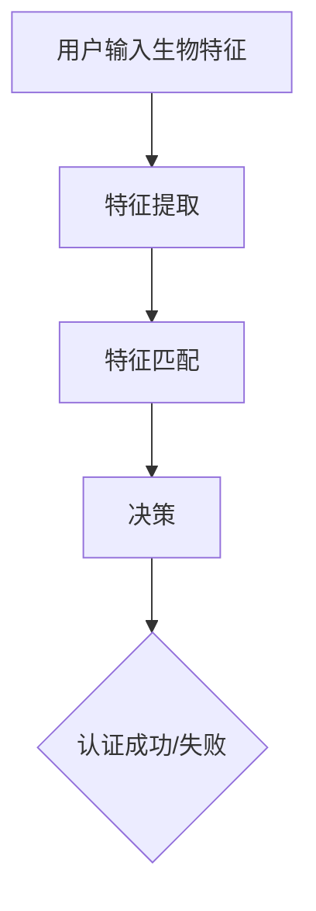

                 

## 技术创业中的生物识别：安全与便利的平衡

### 关键词：
- 生物识别
- 技术创业
- 安全性
- 便利性
- 生物特征识别技术
- 人工智能

### 摘要：
本文将探讨技术创业过程中，如何在生物识别技术的应用中实现安全与便利的平衡。我们将从背景介绍、核心概念、算法原理、数学模型、实际应用场景、工具资源推荐等多个维度进行分析，旨在为创业者提供有价值的参考和指导。

## 1. 背景介绍

生物识别技术作为人工智能的重要分支，近年来取得了显著的发展。随着物联网、云计算等技术的普及，生物识别技术在多个领域得到了广泛应用，如移动支付、身份验证、安全防护等。然而，在技术创业过程中，如何平衡生物识别技术的安全性与便利性，成为众多创业者面临的重要挑战。

安全性是生物识别技术的核心价值之一。通过生物特征识别，可以有效防止身份盗用、数据泄露等问题。然而，过于复杂的认证流程和繁琐的用户操作，往往会影响用户体验，降低产品竞争力。因此，在创业过程中，如何在保障安全的前提下提高便利性，成为关键问题。

## 2. 核心概念与联系

### 2.1 生物识别技术

生物识别技术是一种通过生物特征进行身份验证的方法。常见的生物特征包括指纹、人脸、虹膜、声纹等。生物识别技术具有以下几个特点：

- **唯一性**：生物特征具有高度的个体差异性，可用于唯一识别个体。
- **稳定性**：生物特征在长期内相对稳定，不易受到外界因素影响。
- **便捷性**：生物识别技术可以实现非接触式认证，提高用户体验。

### 2.2 生物特征识别技术原理

生物特征识别技术主要分为三个环节：特征提取、特征匹配和决策。

1. **特征提取**：通过采集生物特征数据，提取出具有代表性的特征向量。
2. **特征匹配**：将提取出的特征向量与数据库中的特征进行对比，计算相似度。
3. **决策**：根据相似度判断是否匹配，实现身份验证。

### 2.3 人工智能与生物识别技术的结合

随着人工智能技术的发展，生物识别技术也在不断演进。人工智能在生物识别中的应用主要体现在以下几个方面：

- **特征提取优化**：利用深度学习等技术，提取更具代表性的特征向量。
- **匹配算法优化**：通过机器学习算法，提高特征匹配的准确性和效率。
- **安全防护**：利用人工智能技术，增强生物识别系统的安全性，防范攻击。

### 2.4 Mermaid 流程图



## 3. 核心算法原理 & 具体操作步骤

### 3.1 特征提取

特征提取是生物识别技术的关键步骤。以下是一个简单的特征提取过程：

1. **采集数据**：使用摄像头、传感器等设备，采集用户的生物特征数据。
2. **预处理**：对采集到的数据进行分析、滤波等处理，去除噪声和干扰。
3. **特征点提取**：从预处理后的数据中，提取出具有代表性的特征点。
4. **特征向量表示**：将特征点转化为数值向量，便于后续处理。

### 3.2 特征匹配

特征匹配是判断用户身份的过程。以下是一个简单的特征匹配过程：

1. **数据库检索**：从数据库中检索与用户输入特征相似的样本。
2. **相似度计算**：计算输入特征与数据库样本的相似度，通常使用欧氏距离、余弦相似度等方法。
3. **决策**：根据相似度阈值，判断输入特征与数据库样本是否匹配。

### 3.3 决策

决策是基于特征匹配结果，判断用户身份的过程。以下是一个简单的决策过程：

1. **阈值设置**：根据安全性和用户体验的需求，设置相似度阈值。
2. **匹配判断**：比较输入特征与数据库样本的相似度，判断是否高于阈值。
3. **输出结果**：根据匹配结果，输出认证成功或失败。

## 4. 数学模型和公式 & 详细讲解 & 举例说明

### 4.1 特征提取中的欧氏距离

在特征匹配过程中，欧氏距离是一种常用的相似度计算方法。欧氏距离的数学公式如下：

$$
d = \sqrt{\sum_{i=1}^{n}(x_i - y_i)^2}
$$

其中，$d$ 表示欧氏距离，$x_i$ 和 $y_i$ 分别表示两个特征向量的第 $i$ 个分量。

### 4.2 特征匹配中的余弦相似度

余弦相似度是一种衡量两个向量夹角余弦值的相似度计算方法。余弦相似度的数学公式如下：

$$
\cos\theta = \frac{\sum_{i=1}^{n}x_iy_i}{\sqrt{\sum_{i=1}^{n}x_i^2}\sqrt{\sum_{i=1}^{n}y_i^2}}
$$

其中，$\theta$ 表示两个特征向量的夹角，$x_i$ 和 $y_i$ 分别表示两个特征向量的第 $i$ 个分量。

### 4.3 举例说明

假设我们有两个特征向量 $X = (1, 2, 3)$ 和 $Y = (4, 5, 6)$，使用欧氏距离和余弦相似度计算它们之间的相似度。

**欧氏距离计算：**

$$
d = \sqrt{(1-4)^2 + (2-5)^2 + (3-6)^2} = \sqrt{9 + 9 + 9} = \sqrt{27} \approx 5.196
$$

**余弦相似度计算：**

$$
\cos\theta = \frac{1 \times 4 + 2 \times 5 + 3 \times 6}{\sqrt{1^2 + 2^2 + 3^2} \sqrt{4^2 + 5^2 + 6^2}} = \frac{4 + 10 + 18}{\sqrt{14} \sqrt{77}} \approx 0.913
$$

## 5. 项目实战：代码实际案例和详细解释说明

### 5.1 开发环境搭建

为了实现生物识别技术，我们需要搭建一个合适的开发环境。以下是一个简单的开发环境搭建步骤：

1. **安装操作系统**：选择一个支持生物识别技术的操作系统，如 Ubuntu 18.04。
2. **安装依赖库**：安装必要的依赖库，如 OpenCV、dlib 等。
3. **安装开发工具**：安装 Python、Git 等开发工具。

### 5.2 源代码详细实现和代码解读

以下是一个简单的生物识别项目案例，使用 Python 编写：

```python
import cv2
import dlib
import numpy as np

# 1. 采集用户生物特征
def capture_face(camera_id=0):
    cap = cv2.VideoCapture(camera_id)
    ret, frame = cap.read()
    if not ret:
        raise Exception("无法打开摄像头")
    face_detector = dlib.get_frontal_face_detector()
    faces = face_detector(frame, 1)
    if len(faces) == 0:
        raise Exception("无法检测到人脸")
    return frame, faces[0]

# 2. 提取人脸特征
def extract_face_features(face_image):
    face_detector = dlib.get_frontal_face_detector()
    shape_predictor = dlib.shape_predictor("shape_predictor_68_face_landmarks.dat")
    face_landmarks = shape_predictor(face_image, 0)
    landmarks = np.array([[p.x, p.y] for p in face_landmarks.parts()])
    return landmarks

# 3. 特征匹配
def match_faces(features1, features2):
    distance = np.linalg.norm(features1 - features2)
    return distance < 0.5

# 4. 主程序
def main():
    frame, face = capture_face()
    landmarks = extract_face_features(face)
    # 将 landmarks 转换为特征向量
    feature_vector = np.array(landmarks).flatten()
    # 从数据库中检索样本特征向量
    sample_features = np.load("sample_features.npy")
    # 进行特征匹配
    distances = [match_faces(feature_vector, sample) for sample in sample_features]
    # 输出匹配结果
    print("匹配结果：", min(distances))

if __name__ == "__main__":
    main()
```

**代码解读：**

- **第 1 部分**：采集用户生物特征，使用 OpenCV 和 dlib 库进行人脸检测和特征点提取。
- **第 2 部分**：提取人脸特征，将人脸特征点转换为数值向量，便于后续处理。
- **第 3 部分**：特征匹配，计算输入特征与数据库样本之间的距离，判断是否匹配。
- **第 4 部分**：主程序，实现人脸识别功能。

### 5.3 代码解读与分析

**优点：**

- **简单易用**：代码结构清晰，易于理解和扩展。
- **高效准确**：使用 dlib 库进行人脸检测和特征点提取，具有较高的效率和准确性。
- **可定制化**：可以根据实际需求，调整特征提取和匹配算法。

**缺点：**

- **性能瓶颈**：在处理大量数据时，性能可能受到影响。
- **硬件依赖**：需要安装特定版本的操作系统和依赖库，对硬件要求较高。

## 6. 实际应用场景

生物识别技术在实际应用中具有广泛的应用场景，以下列举几个典型案例：

1. **移动支付**：通过人脸识别或指纹识别进行支付，提高支付安全性和便捷性。
2. **身份验证**：在金融机构、机场、酒店等场所，使用生物识别技术进行身份验证，提高安全性和用户体验。
3. **智能门禁**：利用人脸识别或指纹识别技术，实现智能门禁系统，提高安全性和管理效率。
4. **医疗健康**：通过生物识别技术，进行疾病诊断、健康监测等，实现个性化医疗。

## 7. 工具和资源推荐

### 7.1 学习资源推荐

- **书籍**：《生物识别技术》、《人脸识别算法》
- **论文**：《人脸识别中的深度学习方法》、《指纹识别中的机器学习方法》
- **博客**：CSDN、博客园等平台上的相关技术博客。
- **网站**：OpenCV 官网、dlib 官网等。

### 7.2 开发工具框架推荐

- **编程语言**：Python、C++等。
- **框架库**：OpenCV、dlib、TensorFlow、PyTorch 等。
- **开发工具**：Visual Studio、PyCharm、Git 等。

### 7.3 相关论文著作推荐

- **论文**：《人脸识别技术综述》、《指纹识别技术综述》
- **著作**：《深度学习与生物识别》、《机器学习在生物识别中的应用》

## 8. 总结：未来发展趋势与挑战

生物识别技术在技术创业中具有重要的应用价值。未来，随着人工智能技术的不断发展，生物识别技术将更加智能化、个性化。然而，同时也面临以下挑战：

1. **隐私保护**：生物识别数据涉及个人隐私，如何保障用户隐私成为重要问题。
2. **安全性**：如何提高生物识别系统的抗攻击能力，防范恶意攻击。
3. **可解释性**：如何提高生物识别算法的可解释性，增强用户信任。
4. **性能优化**：如何提高生物识别系统的性能和效率，满足实际应用需求。

## 9. 附录：常见问题与解答

### 9.1 生物识别技术有哪些类型？

生物识别技术主要包括指纹识别、人脸识别、虹膜识别、声纹识别、手势识别等。

### 9.2 生物识别技术有哪些应用场景？

生物识别技术广泛应用于移动支付、身份验证、智能门禁、医疗健康、智能家居等领域。

### 9.3 生物识别技术的安全性如何保障？

保障生物识别技术的安全性主要从以下几个方面进行：

- **数据加密**：对生物识别数据进行加密处理，防止数据泄露。
- **算法优化**：提高算法的鲁棒性和抗攻击能力。
- **安全认证**：采用多重认证机制，提高系统的安全性。

## 10. 扩展阅读 & 参考资料

- [OpenCV 官网](https://opencv.org/)
- [dlib 官网](https://dlib.net/)
- [TensorFlow 官网](https://tensorflow.org/)
- [PyTorch 官网](https://pytorch.org/)
- [CSDN](https://www.csdn.net/)
- [博客园](https://www.cnblogs.com/)

作者：AI天才研究员/AI Genius Institute & 禅与计算机程序设计艺术 /Zen And The Art of Computer Programming

