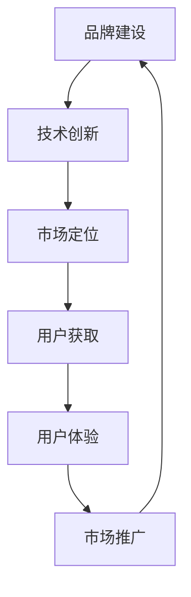

                 

# 技术创业的品牌建设：从默默无闻到行业领袖

## 关键词：技术创业、品牌建设、行业领袖、影响力、市场定位、用户获取、用户体验、市场推广

## 摘要：
本文旨在探讨技术创业企业如何通过有效的品牌建设策略，从默默无闻成长为行业领袖。通过分析品牌建设的基本原理、核心策略和实践案例，帮助创业者找到适合自己的品牌建设路径，提升市场影响力，实现企业可持续发展。

## 1. 背景介绍

在当今快速变化的市场环境中，技术创业企业面临着前所未有的挑战和机遇。一方面，技术的快速迭代和市场的不断扩张为企业提供了广阔的发展空间；另一方面，竞争的激烈和用户需求的多样化要求企业必须具备强大的品牌影响力。品牌不仅是企业的核心竞争力之一，更是企业与用户、投资者、合作伙伴之间沟通的桥梁。

然而，许多技术创业企业往往在品牌建设方面缺乏系统的思考和策略。他们可能更关注技术本身，而忽视了品牌建设的重要性。这导致企业在市场竞争中缺乏辨识度，难以形成差异化优势。因此，本文将从品牌建设的角度出发，探讨技术创业企业如何从默默无闻成长为行业领袖。

## 2. 核心概念与联系

### 2.1 品牌的概念

品牌是指企业、产品或服务的独特标识和形象，它代表着企业的价值观、使命和愿景。品牌不仅是一个标识，更是一种承诺和信任。一个成功的品牌能够赢得用户的忠诚和信任，提升企业的市场竞争力。

### 2.2 品牌建设的基本原则

品牌建设是一项长期而复杂的工作，需要遵循以下基本原则：

- **差异化定位**：在竞争激烈的市场中，企业需要找到自己独特的定位，区分于竞争对手，形成差异化优势。

- **一致性和持续性**：品牌建设需要保持一致性和持续性，确保品牌形象和价值观始终如一，避免混乱和冲突。

- **用户参与**：品牌建设需要注重用户参与，通过互动和沟通提升用户的品牌认知和忠诚度。

- **社会责任**：企业应当承担社会责任，通过环保、公益等举措提升品牌形象，赢得用户的认可和信任。

### 2.3 品牌建设与技术创新的关系

品牌建设与技术创新是相辅相成的。技术创新是企业发展的核心动力，而品牌建设则是技术创新的外在表现和延伸。一个具有创新精神和技术实力的企业，往往能够通过有效的品牌建设策略，提升市场影响力，实现持续发展。

### 2.4 Mermaid 流程图

下面是一个简单的 Mermaid 流程图，展示品牌建设与技术创新的关系：



## 3. 核心算法原理 & 具体操作步骤

### 3.1 品牌定位

品牌定位是品牌建设的核心，决定了品牌在用户心中的形象和认知。以下是品牌定位的核心算法原理和具体操作步骤：

#### 3.1.1 算法原理

- **市场分析**：了解目标市场的需求和竞争对手的优势与劣势，为品牌定位提供数据支持。

- **用户画像**：描绘目标用户的特征和行为模式，为品牌定位提供用户视角。

- **品牌愿景**：明确企业的长远目标和核心价值观，为品牌定位提供指导。

#### 3.1.2 操作步骤

1. **确定品牌愿景**：明确企业的长远目标和核心价值观，为品牌定位提供方向。

2. **进行市场分析**：了解目标市场的需求和竞争对手的优势与劣势，为品牌定位提供数据支持。

3. **描绘用户画像**：通过调研和分析，描绘目标用户的特征和行为模式，为品牌定位提供用户视角。

4. **制定品牌定位策略**：结合市场分析和用户画像，制定符合企业愿景和用户需求的品牌定位策略。

5. **实施品牌定位**：通过品牌传播和营销活动，将品牌定位策略落实到实际操作中。

### 3.2 品牌传播

品牌传播是品牌建设的重要组成部分，决定了品牌在市场中的知名度和影响力。以下是品牌传播的核心算法原理和具体操作步骤：

#### 3.2.1 算法原理

- **内容营销**：通过优质的内容，提升品牌的认知度和影响力。

- **社交媒体营销**：利用社交媒体平台，扩大品牌传播的范围和影响力。

- **公关活动**：通过媒体公关和活动，提升品牌的知名度和美誉度。

#### 3.2.2 操作步骤

1. **制定品牌传播策略**：根据品牌定位和目标用户，制定符合品牌调性的传播策略。

2. **创建优质内容**：围绕品牌主题，创作有价值、有吸引力、有感染力的内容。

3. **选择合适的传播渠道**：根据目标用户的特点和传播策略，选择合适的传播渠道，如社交媒体、博客、论坛等。

4. **执行传播活动**：按照品牌传播策略，执行具体的传播活动，如发布文章、开设社交媒体账号、参与行业活动等。

5. **监测传播效果**：通过数据分析，监测传播活动的效果，及时调整传播策略。

### 3.3 用户获取和体验

用户获取和体验是品牌建设的重要环节，决定了品牌的市场竞争力和用户忠诚度。以下是用户获取和体验的核心算法原理和具体操作步骤：

#### 3.3.1 算法原理

- **精准营销**：通过大数据分析和用户画像，实现精准的用户定位和营销。

- **用户体验**：注重用户在产品使用过程中的体验，提升用户满意度。

- **用户运营**：通过用户互动和社群建设，提升用户粘性和忠诚度。

#### 3.3.2 操作步骤

1. **进行用户画像分析**：通过数据分析，描绘目标用户的特征和行为模式。

2. **制定用户获取策略**：根据用户画像和品牌定位，制定符合用户需求和品牌调性的用户获取策略。

3. **优化用户体验**：关注用户在产品使用过程中的体验，提升用户满意度。

4. **建立用户互动机制**：通过社群建设、用户反馈等方式，提升用户粘性和忠诚度。

5. **监测用户获取和体验效果**：通过数据分析和用户反馈，监测用户获取和体验效果，及时调整策略。

## 4. 数学模型和公式 & 详细讲解 & 举例说明

### 4.1 品牌定位数学模型

品牌定位可以通过以下数学模型进行量化分析：

$$
Brand\ Positioning = f(Vision, Market\ Analysis, User\ Analysis)
$$

其中：

- \( Vision \)：品牌愿景
- \( Market\ Analysis \)：市场分析结果
- \( User\ Analysis \)：用户画像分析结果

举例说明：

假设某技术创业企业的品牌愿景是“成为全球领先的云计算解决方案提供商”，市场分析结果显示目标市场对云计算的需求快速增长，用户画像分析结果显示目标用户主要是对云计算有较高需求的中小企业。

则该企业的品牌定位可以表示为：

$$
Brand\ Positioning = f(\text{成为全球领先的云计算解决方案提供商}, \text{云计算需求快速增长}, \text{对云计算有较高需求的中小企业})
$$

### 4.2 用户获取和体验数学模型

用户获取和体验可以通过以下数学模型进行量化分析：

$$
User\ Acquisition\ and\ Experience = f(User\ Analysis, Product\ Optimization, User\ Engagement)
$$

其中：

- \( User\ Analysis \)：用户画像分析结果
- \( Product\ Optimization \)：产品优化策略
- \( User\ Engagement \)：用户互动策略

举例说明：

假设某技术创业企业的用户画像分析结果显示目标用户主要是对云计算有较高需求的中小企业，该企业的产品优化策略是通过提升云计算服务的性能和稳定性来满足用户需求，用户互动策略是通过建立用户社群和提供技术支持来提升用户粘性和忠诚度。

则该企业的用户获取和体验可以表示为：

$$
User\ Acquisition\ and\ Experience = f(\text{对云计算有较高需求的中小企业}, \text{提升云计算服务的性能和稳定性}, \text{建立用户社群和提供技术支持})
$$

## 5. 项目实战：代码实际案例和详细解释说明

### 5.1 开发环境搭建

为了更好地展示品牌建设的实际应用，我们选择一个实际项目来进行分析。首先，我们需要搭建一个适合项目开发的环境。

#### 5.1.1 环境要求

- 操作系统：Windows/Linux/Mac
- 编程语言：Python
- 数据库：MySQL
- Web框架：Flask

#### 5.1.2 环境搭建步骤

1. 安装Python：在官网下载并安装Python，选择添加到系统环境变量。

2. 安装MySQL：在官网下载并安装MySQL，设置root用户密码。

3. 安装Flask：在命令行中执行以下命令安装Flask：

   ```bash
   pip install flask
   ```

### 5.2 源代码详细实现和代码解读

#### 5.2.1 项目结构

项目结构如下：

```
brand建设项目
│
├── app.py      # 应用程序入口
├── config.py    # 配置文件
├── models.py    # 模型文件
├── templates    # 模板文件
│   └── index.html
└── static       # 静态资源文件
    └── css
        └── style.css
```

#### 5.2.2 代码解读

1. **应用程序入口：app.py**

   ```python
   from flask import Flask, render_template
   
   app = Flask(__name__)
   
   @app.route('/')
   def index():
       return render_template('index.html')
   
   if __name__ == '__main__':
       app.run()
   ```

   代码解读：该文件定义了应用程序的入口，使用了Flask框架创建了一个简单的Web应用。通过定义`index`路由，当访问网站根目录时，会渲染`index.html`模板。

2. **配置文件：config.py**

   ```python
   import os
   
   class Config:
       SECRET_KEY = os.environ.get('SECRET_KEY') or 'your_secret_key'
       SQLALCHEMY_DATABASE_URI = os.environ.get('DATABASE_URL') or 'sqlite:///app.db'
   ```

   代码解读：该文件定义了配置类`Config`，包含了应用程序的密钥、数据库URI等配置信息。通过环境变量获取配置信息，确保配置信息的保密性和灵活性。

3. **模型文件：models.py**

   ```python
   from flask_sqlalchemy import SQLAlchemy
   
   db = SQLAlchemy()
   
   class User(db.Model):
       id = db.Column(db.Integer, primary_key=True)
       username = db.Column(db.String(80), unique=True, nullable=False)
       email = db.Column(db.String(120), unique=True, nullable=False)
   ```

   代码解读：该文件定义了数据库模型`User`，包含了用户的基本信息，如用户名、邮箱等。通过Flask-SQLAlchemy扩展，实现了数据库的操作。

4. **模板文件：templates/index.html**

   ```html
   <!DOCTYPE html>
   <html lang="en">
   <head>
       <meta charset="UTF-8">
       <meta name="viewport" content="width=device-width, initial-scale=1.0">
       <title>Brand Project</title>
       <link rel="stylesheet" href="{{ url_for('static', filename='css/style.css') }}">
   </head>
   <body>
       <h1>Welcome to Brand Project</h1>
   </body>
   </html>
   ```

   代码解读：该文件是应用程序的首页模板，包含了网站的标题和基本样式。通过Flask的模板渲染功能，可以动态地加载静态资源文件。

5. **静态资源文件：static/css/style.css**

   ```css
   body {
       font-family: Arial, sans-serif;
       margin: 0;
       padding: 0;
       background-color: #f5f5f5;
   }
   
   h1 {
       text-align: center;
       margin-top: 50px;
   }
   ```

   代码解读：该文件是网站的样式表，定义了网站的基本样式，如字体、颜色、布局等。

### 5.3 代码解读与分析

通过上述代码解读，我们可以看到品牌建设项目的实现过程。项目使用Flask框架搭建了一个简单的Web应用，通过数据库存储用户信息，并通过模板渲染展示给用户。具体分析如下：

1. **项目结构清晰**：项目按照模块化思想进行组织，分为应用程序入口、配置文件、模型文件、模板文件和静态资源文件，便于管理和维护。

2. **代码简洁易懂**：代码结构清晰，逻辑简单，易于理解和修改。

3. **利用Flask框架**：Flask是一个轻量级的Web开发框架，可以快速搭建Web应用，提高开发效率。

4. **数据库操作简单**：通过Flask-SQLAlchemy扩展，实现了简单的数据库操作，便于管理用户信息。

5. **模板渲染灵活**：通过模板渲染，可以动态地展示网站内容，提高用户体验。

## 6. 实际应用场景

### 6.1 教育行业

在技术创业企业中，教育行业是一个典型的应用场景。通过有效的品牌建设，企业可以提升在线教育平台的市场影响力，吸引更多用户和投资者。以下是一个实际案例：

- **品牌定位**：定位为“提供优质在线教育资源的平台”，专注于为学习者提供高质量的课程和服务。

- **品牌传播**：通过内容营销、社交媒体营销和公关活动，提升品牌知名度和美誉度。

- **用户获取和体验**：通过精准营销、用户体验优化和用户互动机制，提升用户满意度和忠诚度。

### 6.2 健康医疗行业

健康医疗行业也是一个充满机遇和挑战的领域。通过有效的品牌建设，技术创业企业可以提升医疗信息化产品和服务的市场竞争力。以下是一个实际案例：

- **品牌定位**：定位为“提供智能医疗解决方案的领导者”，专注于为医疗机构和患者提供高效、智能的医疗信息化服务。

- **品牌传播**：通过专业文章、研讨会、行业会议等途径，提升品牌在行业内的知名度和影响力。

- **用户获取和体验**：通过大数据分析、用户画像和精准营销，提升用户满意度；通过用户体验优化和用户互动机制，提升用户忠诚度。

### 6.3 金融科技行业

金融科技行业竞争激烈，通过有效的品牌建设，技术创业企业可以提升支付、理财、保险等领域的市场竞争力。以下是一个实际案例：

- **品牌定位**：定位为“金融科技创新引领者”，专注于为用户提供安全、便捷、高效的金融科技产品和服务。

- **品牌传播**：通过品牌故事、用户故事、行业报告等途径，提升品牌形象和口碑。

- **用户获取和体验**：通过精准营销、用户体验优化和用户互动机制，提升用户满意度和忠诚度。

## 7. 工具和资源推荐

### 7.1 学习资源推荐

- **书籍**：《品牌战略》、《品牌制胜》、《品牌管理实战》等。
- **论文**：相关领域的学术论文，如《品牌传播与消费者行为的关系研究》、《品牌定位与市场表现的关系研究》等。
- **博客**：知名品牌专家和公司的博客，如《品牌力》、《品牌之路》等。
- **网站**：品牌管理机构和知名公司的官方网站，如《品牌协会》、《可口可乐公司》等。

### 7.2 开发工具框架推荐

- **编程语言**：Python、Java、JavaScript等。
- **Web框架**：Flask、Django、Spring Boot等。
- **数据库**：MySQL、PostgreSQL、MongoDB等。
- **前端框架**：React、Vue、Angular等。

### 7.3 相关论文著作推荐

- **论文**：《基于大数据的品牌影响力评估方法研究》、《社交网络环境下品牌传播策略研究》、《品牌建设与技术创新的相互作用研究》等。
- **著作**：《互联网品牌管理》、《品牌竞争力》、《品牌战略与品牌管理》等。

## 8. 总结：未来发展趋势与挑战

随着技术的不断进步和市场的不断变化，品牌建设在技术创业企业中的作用越来越重要。未来，品牌建设将呈现出以下发展趋势：

1. **数字化品牌建设**：随着数字化技术的普及，品牌建设将更加依赖于数字营销和数据分析。

2. **用户体验至上**：用户需求不断变化，品牌建设将更加注重用户体验，提升用户满意度。

3. **跨界合作**：品牌建设将不再局限于单一行业，企业将寻求与其他领域的合作，实现品牌价值的最大化。

4. **社会责任**：企业将更加注重社会责任，通过环保、公益等举措提升品牌形象。

然而，品牌建设也面临着一系列挑战：

1. **市场竞争加剧**：随着市场规模的扩大，品牌竞争将更加激烈，企业需要不断创新和提升品牌价值。

2. **用户需求多样化**：用户需求不断变化，企业需要不断调整品牌定位和策略，以适应市场变化。

3. **数据隐私与安全**：在数字化时代，数据隐私和安全成为品牌建设的重要问题，企业需要加强数据保护和用户隐私保护。

4. **可持续发展**：企业需要关注环境保护和社会责任，实现可持续发展。

## 9. 附录：常见问题与解答

### 9.1 品牌定位问题

**Q：如何进行有效的品牌定位？**

**A：进行有效的品牌定位，可以遵循以下步骤：**

1. **明确品牌愿景**：明确企业的长远目标和核心价值观，为品牌定位提供方向。

2. **进行市场分析**：了解目标市场的需求和竞争对手的优势与劣势，为品牌定位提供数据支持。

3. **描绘用户画像**：通过调研和分析，描绘目标用户的特征和行为模式，为品牌定位提供用户视角。

4. **制定品牌定位策略**：结合市场分析和用户画像，制定符合企业愿景和用户需求的品牌定位策略。

5. **实施品牌定位**：通过品牌传播和营销活动，将品牌定位策略落实到实际操作中。

### 9.2 品牌传播问题

**Q：如何提升品牌传播效果？**

**A：提升品牌传播效果，可以采取以下策略：**

1. **内容营销**：通过创作有价值、有吸引力、有感染力的内容，提升品牌的认知度和影响力。

2. **社交媒体营销**：利用社交媒体平台，扩大品牌传播的范围和影响力。

3. **公关活动**：通过媒体公关和活动，提升品牌的知名度和美誉度。

4. **数据驱动**：通过数据分析，监测传播活动的效果，及时调整传播策略。

### 9.3 用户获取和体验问题

**Q：如何提升用户获取和体验？**

**A：提升用户获取和体验，可以采取以下策略：**

1. **精准营销**：通过大数据分析和用户画像，实现精准的用户定位和营销。

2. **用户体验优化**：关注用户在产品使用过程中的体验，提升用户满意度。

3. **用户互动机制**：通过社群建设、用户反馈等方式，提升用户粘性和忠诚度。

4. **数据驱动**：通过数据分析和用户反馈，监测用户获取和体验效果，及时调整策略。

## 10. 扩展阅读 & 参考资料

- 《品牌战略》
- 《品牌制胜》
- 《品牌管理实战》
- 《互联网品牌管理》
- 《品牌竞争力》
- 《品牌战略与品牌管理》
- 《基于大数据的品牌影响力评估方法研究》
- 《社交网络环境下品牌传播策略研究》
- 《品牌建设与技术创新的相互作用研究》
- 《品牌协会》
- 《可口可乐公司》
- 《Flask Web开发：编程实战》
- 《Django Web开发：实战项目驱动》
- 《Spring Boot实战》
- 《Python编程：从入门到实践》
- 《Java编程：从基础到项目实践》
- 《JavaScript高级程序设计》

### 作者信息

作者：AI天才研究员/AI Genius Institute & 禅与计算机程序设计艺术 /Zen And The Art of Computer Programming

