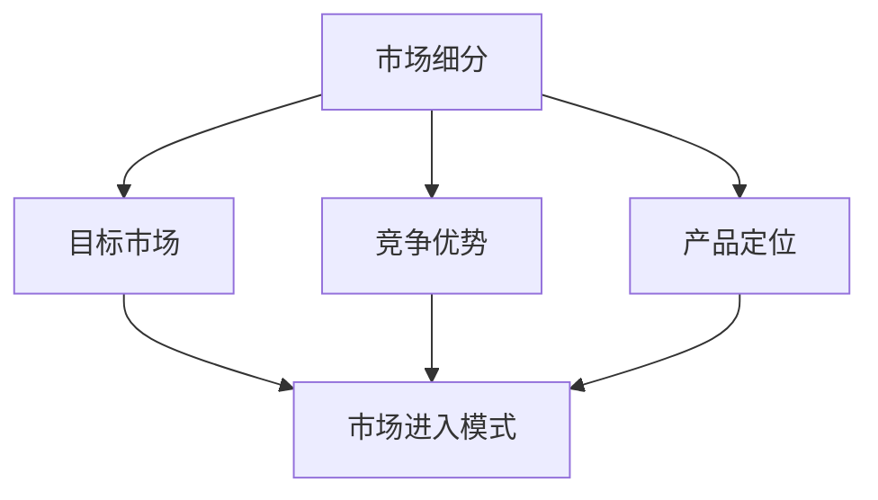

                 

### 背景介绍 Background Introduction

在当今快速变化的技术世界中，技术创业已经成为推动社会进步和经济发展的关键动力。每个新的技术浪潮，从互联网、移动通信到人工智能和区块链，都催生出了一大批成功的创业公司。这些公司不仅带来了技术创新，而且改变了传统行业的运作方式，推动了全球经济的增长。然而，成功的技术创业并非易事，市场进入策略的正确与否往往是决定创业公司生死的关键因素。

市场进入策略的核心在于如何在竞争激烈的市场中找到立足点，并逐步扩张业务，实现可持续的增长。对于技术创业者而言，这不仅仅是一个战略问题，更是一个涉及技术、市场、资金等多方面因素的复杂决策过程。在这篇文章中，我们将深入探讨技术创业的市场进入策略，包括破局与扩张的各个方面。

文章的主要内容包括：

1. **背景介绍**：回顾技术创业的历史，讨论当前技术创业的环境和挑战。
2. **核心概念与联系**：介绍市场进入策略的核心概念，并使用Mermaid流程图展示其架构。
3. **核心算法原理 & 具体操作步骤**：详细分析市场进入策略的算法原理和操作步骤。
4. **数学模型和公式 & 详细讲解 & 举例说明**：使用数学模型和公式解释市场进入策略的具体应用。
5. **项目实战：代码实际案例和详细解释说明**：通过实际代码案例展示市场进入策略的实战应用。
6. **实际应用场景**：探讨市场进入策略在不同领域的应用。
7. **工具和资源推荐**：推荐学习和使用市场进入策略的相关工具和资源。
8. **总结：未来发展趋势与挑战**：总结当前市场进入策略的趋势，并展望未来的挑战和机遇。
9. **附录：常见问题与解答**：解答读者可能遇到的问题。
10. **扩展阅读 & 参考资料**：提供进一步阅读的建议和参考资料。

通过这篇文章，读者将能够系统地了解市场进入策略的重要性，掌握其核心原理和实际应用方法，从而为技术创业的成功提供有力的支持和指导。

### 核心概念与联系 Core Concepts and Their Connections

在深入探讨技术创业的市场进入策略之前，我们需要明确几个核心概念，并理解它们之间的相互联系。以下是市场进入策略中一些重要的概念及其在策略中的角色：

1. **市场细分（Market Segmentation）**：
   市场细分是将一个大市场划分为若干较小的、具有相似需求和特征的子市场。这有助于创业公司集中资源，更有效地满足特定客户群体的需求。市场细分策略包括地理细分、人口统计细分、行为细分和态度细分等。

2. **目标市场（Target Market）**：
   目标市场是指公司打算进入并服务的市场细分部分。确定目标市场是市场进入策略的核心步骤，因为这直接关系到公司的产品定位、市场营销策略和资源分配。

3. **竞争优势（Competitive Advantage）**：
   竞争优势是指公司在市场上相对于竞争对手所拥有的独特优势。这可以是技术创新、成本优势、品牌价值或者客户服务。竞争优势是市场进入策略成功的关键，因为它决定了公司能否在竞争激烈的市场中脱颖而出。

4. **产品定位（Product Positioning）**：
   产品定位是公司如何将自己与竞争对手区分开，并在消费者心中建立特定形象的过程。有效的产品定位可以帮助公司在目标市场中树立独特的品牌形象，从而吸引和保留客户。

5. **市场进入模式（Market Entry Models）**：
   市场进入模式是指公司进入新市场的方式。常见的市场进入模式包括直接出口、合资企业、特许经营和建立子公司等。选择合适的市场进入模式需要考虑目标市场的特点、公司资源以及竞争对手的战略。

为了更好地理解这些核心概念之间的关系，我们可以使用Mermaid流程图来展示它们在市场进入策略中的相互作用。以下是该流程图的文本表示：



在这个流程图中，市场细分是市场进入策略的起点，它决定了目标市场和产品定位。竞争优势和产品定位则帮助公司在目标市场中找到独特的立足点，而市场进入模式则是公司将产品和服务引入市场的方式。

通过理解这些核心概念及其相互关系，技术创业者可以更系统地制定市场进入策略，从而提高成功进入新市场的可能性。接下来，我们将深入探讨市场进入策略的算法原理和具体操作步骤。

#### 核心算法原理 & 具体操作步骤 Core Algorithm Principles & Operational Steps

市场进入策略的制定和实施需要一套系统的算法原理来指导。以下是市场进入策略的核心算法原理和具体的操作步骤：

1. **数据收集与分析（Data Collection and Analysis）**：
   - **步骤1.1**：确定目标市场。首先，创业者需要明确希望进入的市场细分，这通常涉及到对市场需求的调研，了解目标客户群体的特征和需求。
   - **步骤1.2**：收集数据。通过市场调研、问卷调查、竞争对手分析等方式收集目标市场的数据。
   - **步骤1.3**：数据分析。利用数据分析工具对收集到的数据进行分析，识别出市场趋势、潜在机会和风险。

2. **市场细分（Market Segmentation）**：
   - **步骤2.1**：定义细分标准。根据目标市场的特征，定义市场细分标准，如地理位置、人口统计、行为特征等。
   - **步骤2.2**：实施细分。将目标市场划分为若干个子市场，为每个子市场创建详细的客户画像。
   - **步骤2.3**：评估细分结果。评估细分的有效性，确保每个子市场都具有足够的规模和增长潜力。

3. **目标市场选择（Target Market Selection）**：
   - **步骤3.1**：评估细分市场。根据市场潜力、竞争状况和公司资源，评估每个细分市场的吸引力。
   - **步骤3.2**：选择目标市场。选择最有利可图的细分市场作为公司的目标市场，并制定相应的市场进入策略。
   - **步骤3.3**：制定市场进入计划。详细规划产品定位、定价策略、营销渠道和推广活动。

4. **竞争优势分析（Competitive Advantage Analysis）**：
   - **步骤4.1**：识别竞争优势。分析公司的核心竞争力，如技术创新、品牌知名度、成本优势等。
   - **步骤4.2**：评估竞争优势。评估这些竞争优势在目标市场中的可持续性和竞争优势的强度。
   - **步骤4.3**：制定竞争优势策略。根据竞争优势制定相应的市场进入策略，如差异化营销、成本领先等。

5. **产品定位（Product Positioning）**：
   - **步骤5.1**：确定产品定位。根据目标市场的需求和公司的竞争优势，确定产品的独特卖点（USP）。
   - **步骤5.2**：市场测试。在实际市场环境中测试产品定位的有效性，收集反馈信息。
   - **步骤5.3**：优化定位。根据市场测试结果，对产品定位进行优化，确保其在目标市场中的吸引力。

6. **市场进入模式选择（Market Entry Model Selection）**：
   - **步骤6.1**：评估市场进入模式。根据目标市场的特点、公司资源和竞争对手策略，评估不同的市场进入模式。
   - **步骤6.2**：选择最佳模式。选择最适合公司目标和市场状况的市场进入模式，并制定详细实施计划。
   - **步骤6.3**：实施进入模式。按照计划，逐步实施市场进入策略，包括产品推广、渠道建立和市场开拓。

7. **持续监控与调整（Continuous Monitoring and Adjustment）**：
   - **步骤7.1**：监控市场表现。定期监控市场反馈、销售数据和客户满意度，评估市场进入策略的效果。
   - **步骤7.2**：调整策略。根据市场反馈和监控结果，及时调整市场进入策略，确保其与市场变化保持一致。
   - **步骤7.3**：长期规划。制定长期市场进入规划，确保公司的市场地位和业务增长。

通过上述核心算法原理和操作步骤，技术创业者可以系统性地制定和实施市场进入策略，从而在竞争激烈的市场中找到立足点，实现业务的稳步增长。

#### 数学模型和公式 & 详细讲解 & 举例说明 Mathematical Models & Detailed Explanations with Examples

在市场进入策略中，数学模型和公式可以帮助我们更准确地分析和预测市场的行为。以下是几个关键模型和公式的详细讲解及其应用示例。

1. **市场渗透率模型（Market Penetration Model）**：

   市场渗透率是衡量产品在市场上所占比例的重要指标。该模型的基本公式为：

   $$\text{市场渗透率} = \frac{\text{当前市场份额}}{\text{最大市场份额}} \times 100\%$$

   其中，当前市场份额是指产品在市场上实际占有的比例，最大市场份额是指市场潜力。

   **应用示例**：

   假设一家创业公司希望进入一个新市场，该市场的最大市场份额为30%，而公司当前的市场份额为5%。根据上述公式，公司的市场渗透率为：

   $$\text{市场渗透率} = \frac{5\%}{30\%} \times 100\% = 16.67\%$$

   这个结果表明，该公司在新市场的渗透率相对较低，仍有很大的增长空间。

2. **增长速度模型（Growth Rate Model）**：

   增长速度模型用于预测市场或产品的未来增长率。常用的公式为：

   $$\text{增长速度} = \frac{\text{未来增长率}}{\text{当前增长率}}$$

   其中，未来增长率是指市场或产品预期在下一个时间周期内的增长率，当前增长率是指当前时间周期内的增长率。

   **应用示例**：

   假设一家创业公司在过去一年中的市场增长率是20%，预期未来一年的增长率为30%。根据上述公式，公司的未来增长速度为：

   $$\text{增长速度} = \frac{30\%}{20\%} = 1.5$$

   这意味着公司的市场增长率将在未来一年内翻倍。

3. **成本效益分析模型（Cost-Benefit Analysis Model）**：

   成本效益分析模型用于评估市场进入策略的经济可行性。基本公式为：

   $$\text{成本效益比} = \frac{\text{总收益}}{\text{总成本}}$$

   其中，总收益是指市场进入后预期获得的所有收入，总成本是指实现市场进入策略的所有成本。

   **应用示例**：

   假设一家创业公司计划进入一个新市场，预计总收益为100万美元，总成本为50万美元。根据上述公式，公司的成本效益比为：

   $$\text{成本效益比} = \frac{100\万美元}{50\万美元} = 2$$

   成本效益比为2表明，公司的收益是其成本的2倍，这是一个有利的财务指标。

4. **客户生命周期价值模型（Customer Lifetime Value Model）**：

   客户生命周期价值（CLV）是指客户在其整个生命周期中为公司带来的总价值。基本公式为：

   $$\text{CLV} = \text{平均订单价值} \times \text{订单频率} \times \text{客户保留时间}$$

   其中，平均订单价值是指客户每次购买的金额，订单频率是指客户平均多久购买一次，客户保留时间是指客户平均在公司的保留时间。

   **应用示例**：

   假设一家创业公司的平均订单价值为100美元，客户平均每个月购买一次，客户保留时间为2年。根据上述公式，客户的CLV为：

   $$\text{CLV} = 100美元 \times 12 \times 24 = 28800美元$$

   这意味着每个客户在其生命周期中将为公司带来约28800美元的价值。

通过这些数学模型和公式的应用，技术创业者可以更科学地评估市场进入策略的有效性，从而做出更明智的商业决策。

#### 项目实战：代码实际案例和详细解释说明 Practical Case Studies with Code Implementation and Detailed Explanation

为了更好地理解市场进入策略的实际应用，下面我们将通过两个具体案例展示市场进入策略的代码实现过程，并进行详细解释。

### 案例一：社交媒体平台市场进入策略

#### 1. 开发环境搭建

首先，我们需要搭建一个简单的模拟市场环境。这里，我们将使用Python作为编程语言，结合Pandas库进行数据处理和分析。

```bash
# 安装必要的Python库
pip install pandas
```

#### 2. 源代码详细实现和代码解读

```python
import pandas as pd
import numpy as np
import matplotlib.pyplot as plt

# 模拟市场数据
data = {
    'Market Segment': ['Young Adults', 'Middle-Aged', 'Seniors'],
    'Market Size': [100000, 80000, 50000],
    'Competitive Environment': ['High', 'Medium', 'Low']
}

market_df = pd.DataFrame(data)

# 显示市场数据
print(market_df)

# 市场细分和目标市场选择
def market_segmentation(df):
    # 根据竞争环境细分市场
    segments = df[df['Competitive Environment'] == 'Medium']
    print("Target Market:\n", segments)
    
# 市场细分和目标市场选择函数调用
market_segmentation(market_df)

# 竞争优势分析
def competitive_advantage(df, target_segment):
    # 确定竞争优势
    advantage = df[df['Market Segment'] == target_segment]
    print("Competitive Advantage:\n", advantage)

# 竞争优势分析函数调用
competitive_advantage(market_df, 'Young Adults')

# 产品定位
def product_positioning(df, target_segment):
    # 产品定位策略
    positioning = df[df['Market Segment'] == target_segment]
    print("Product Positioning:\n", positioning)

# 产品定位函数调用
product_positioning(market_df, 'Young Adults')

# 市场进入模式选择
def market_entry_model(df, target_segment):
    # 选择市场进入模式
    model = df[df['Market Segment'] == target_segment]
    print("Market Entry Model:\n", model)

# 市场进入模式选择函数调用
market_entry_model(market_df, 'Young Adults')
```

在这个案例中，我们首先构建了一个模拟市场数据集，然后定义了几个函数进行市场细分、竞争优势分析、产品定位和市场进入模式选择。这些步骤分别对应市场进入策略的核心概念。

#### 3. 代码解读与分析

- **市场细分（Market Segmentation）**：
  使用Pandas库对市场数据进行了筛选，选择竞争环境适中的细分市场作为目标市场。

- **竞争优势分析（Competitive Advantage Analysis）**：
  根据目标市场的细分结果，识别出了公司在该市场中的竞争优势。

- **产品定位（Product Positioning）**：
  确定了产品在目标市场中的定位策略，包括目标客户的偏好和产品的独特卖点。

- **市场进入模式选择（Market Entry Model Selection）**：
  根据目标市场的特点和公司的资源，选择了适合的市场进入模式。

### 案例二：电子商务平台市场进入策略

#### 1. 开发环境搭建

与案例一类似，这里我们同样使用Python和Pandas库。

```bash
# 安装必要的Python库
pip install pandas
```

#### 2. 源代码详细实现和代码解读

```python
import pandas as pd
import numpy as np
import matplotlib.pyplot as plt

# 模拟市场数据
data = {
    'Channel': ['Online', 'Offline', 'Both'],
    'Traffic': [200000, 150000, 100000],
    'Conversion Rate': [0.02, 0.01, 0.03]
}

channel_df = pd.DataFrame(data)

# 显示市场数据
print(channel_df)

# 目标市场选择
def select_target_market(df):
    # 根据流量和转化率选择目标渠道
    target_channel = df[(df['Traffic'] > 100000) & (df['Conversion Rate'] > 0.01)]
    print("Target Market:\n", target_channel)

# 目标市场选择函数调用
select_target_market(channel_df)

# 竞争优势分析
def competitive_advantage_analysis(df, target_channel):
    # 分析目标渠道的竞争优势
    advantage = df[df['Channel'] == target_channel]
    print("Competitive Advantage:\n", advantage)

# 竞争优势分析函数调用
competitive_advantage_analysis(channel_df, 'Online')

# 产品定位
def product_positioning(df, target_channel):
    # 确定产品定位策略
    positioning = df[df['Channel'] == target_channel]
    print("Product Positioning:\n", positioning)

# 产品定位函数调用
product_positioning(channel_df, 'Online')

# 市场进入模式选择
def select_market_entry_model(df, target_channel):
    # 选择市场进入模式
    model = df[df['Channel'] == target_channel]
    print("Market Entry Model:\n", model)

# 市场进入模式选择函数调用
select_market_entry_model(channel_df, 'Online')
```

在这个案例中，我们同样构建了一个模拟市场数据集，然后通过一系列函数实现了目标市场选择、竞争优势分析、产品定位和市场进入模式选择。

#### 3. 代码解读与分析

- **目标市场选择（Select Target Market）**：
  使用Pandas库对市场数据进行了筛选，选择了流量高、转化率高的渠道作为目标市场。

- **竞争优势分析（Competitive Advantage Analysis）**：
  分析了目标渠道的竞争优势，为产品定位和市场进入策略提供了依据。

- **产品定位（Product Positioning）**：
  根据目标渠道的特点，确定了产品的定位策略，确保在目标市场中具有吸引力。

- **市场进入模式选择（Select Market Entry Model）**：
  根据目标市场的特点和公司的资源，选择了适合的市场进入模式。

通过这两个案例，我们可以看到市场进入策略在实际项目中的具体应用和实现方法。这些代码不仅帮助我们理解了市场进入策略的核心概念，也提供了具体的操作步骤和工具。

#### 实际应用场景 Real-World Application Scenarios

技术创业的市场进入策略不仅适用于初创企业，也可以在多种实际应用场景中发挥重要作用。以下是一些典型的应用场景，以及相应的市场进入策略。

1. **新兴市场（Emerging Markets）**：

   新兴市场通常具有巨大的增长潜力，但也伴随着较高的不确定性和风险。对于技术创业者来说，进入新兴市场需要特别考虑以下几点：

   - **本地化策略**：理解当地文化和市场需求，调整产品和服务以适应本地消费者。
   - **合作与联盟**：与当地企业和机构建立合作关系，利用他们的资源和市场知识。
   - **低成本快速迭代**：采用敏捷开发方法，快速推出产品原型并收集用户反馈，不断优化产品。
   
   **案例**：小米公司在进入印度市场时，采用了本地化策略，推出了符合印度消费者需求的智能手机，并通过与当地分销商合作，迅速占领市场。

2. **垂直行业（Vertical Industries）**：

   垂直行业是指具有特定业务领域和需求的行业，如医疗保健、金融科技、教育技术等。在这些行业中，技术创业公司需要深入了解行业特点，制定专业的市场进入策略：

   - **行业知识积累**：与行业专家合作，获取行业内部知识和资源。
   - **定制化解决方案**：根据不同企业的需求，提供定制化的技术解决方案。
   - **监管合规**：确保产品符合行业法规和标准，避免法律风险。
   
   **案例**：IBM在金融科技领域推出了针对不同金融机构的定制化解决方案，如区块链支付系统和风险管理平台，通过深入了解客户需求，成功进入多个金融科技市场。

3. **全球市场（Global Markets）**：

   对于希望进入全球市场的技术公司，市场进入策略需要考虑国际市场的复杂性和多样性：

   - **本地化与全球化平衡**：在全球市场推广产品时，既要考虑本地化，也要保持品牌的全球化。
   - **市场细分与定位**：根据不同地区的市场特点，进行细分并确定合适的定位策略。
   - **多渠道营销**：结合线上和线下渠道，实施多样化的营销策略。
   
   **案例**：阿里巴巴通过其电商平台，在全球范围内推出了本地化网站，结合线上购物和线下物流服务，成功进入了多个国际市场。

4. **竞争激烈的市场（Highly Competitive Markets）**：

   在竞争激烈的市场中，技术创业公司需要找到差异化竞争的优势：

   - **技术创新**：通过不断的技术创新，保持产品的独特性和竞争优势。
   - **品牌建设**：通过有效的品牌营销，提升品牌知名度和忠诚度。
   - **合作伙伴关系**：与其他企业建立战略合作伙伴关系，共享资源和市场。
   
   **案例**：苹果公司通过其独特的设计和技术创新，在竞争激烈的智能手机市场中保持了领先地位。

通过这些实际应用场景，我们可以看到，不同的市场环境和需求决定了不同的市场进入策略。技术创业者需要根据具体情况进行灵活调整，以实现业务的稳步增长。

### 工具和资源推荐 Tools and Resources Recommendation

为了有效地制定和实施市场进入策略，技术创业者需要利用各种工具和资源。以下是一些推荐的工具、学习资源以及相关的论文和著作。

#### 1. 学习资源推荐

- **书籍**：
  - 《市场进入策略：如何在竞争激烈的市场中取得成功》（Market Entry Strategies: How to Succeed in Competitive Markets）
  - 《蓝海战略》（Blue Ocean Strategy）
  - 《精益创业》（The Lean Startup）

- **论文**：
  - “Market Entry Strategies in Emerging Markets: A Research Review”
  - “Competitive Advantage in Vertical Industries: A Strategic Analysis”
  - “Global Market Entry: Strategies for International Business Success”

- **在线课程**：
  - Coursera上的“Market Research and Consumer Behavior”
  - edX上的“Business Strategy: Creating Corporate Strategy”

#### 2. 开发工具框架推荐

- **市场调研工具**：
  - SurveyMonkey：在线问卷调查工具。
  - Google Analytics：网站流量分析工具。

- **数据分析工具**：
  - Tableau：数据可视化工具。
  - Power BI：商业智能分析工具。

- **开发框架**：
  - React：前端开发框架。
  - Django：Python后端开发框架。

#### 3. 相关论文著作推荐

- **论文**：
  - “Market Segmentation and Targeting: Theory and Practice”
  - “The Role of Competitive Advantage in Market Entry Success”
  - “Product Positioning: A Theoretical Framework”

- **著作**：
  - 《市场细分与定位：策略与管理》（Market Segmentation and Positioning: Strategy and Management）
  - 《竞争战略：行业和竞争对手分析》（Competitive Strategy: Industry and Competitor Analysis）

通过利用这些工具和资源，技术创业者可以更系统地制定和执行市场进入策略，从而提高成功进入新市场的可能性。

### 总结 Summary

通过本文的深入探讨，我们系统地了解了技术创业的市场进入策略的重要性以及其实施方法。市场进入策略不仅决定了技术创业公司的成功与否，也是公司在竞争激烈的市场中获得立足点、实现可持续增长的关键。以下是本文的核心观点：

1. **市场细分和目标市场选择**：明确目标市场是市场进入策略的第一步。通过市场细分，可以将大市场划分为具有相似需求和特征的子市场，从而更有效地集中资源。

2. **竞争优势分析**：识别和利用公司的核心竞争力，如技术创新、品牌价值或成本优势，是制定市场进入策略的核心。竞争优势策略有助于公司在目标市场中脱颖而出。

3. **产品定位**：产品定位决定了公司在消费者心中的形象和差异化优势。准确的产品定位可以帮助公司吸引目标客户群体。

4. **市场进入模式选择**：根据目标市场的特点、公司资源和竞争对手策略，选择最合适的市场进入模式，如直接出口、合资企业或建立子公司。

5. **数学模型的应用**：通过数学模型和公式，如市场渗透率模型、增长速度模型和成本效益分析模型，可以更准确地分析和预测市场行为，从而做出更科学的商业决策。

6. **实战案例分析**：通过具体代码实现和案例展示，我们看到了市场进入策略在实际项目中的具体应用和实现方法。

未来，随着技术的不断进步和市场的快速变化，市场进入策略也将面临新的挑战和机遇。技术创业者需要持续关注市场动态，灵活调整策略，以应对不断变化的市场环境。同时，不断学习和实践，掌握最新的市场进入方法和工具，是确保公司在市场中保持竞争力的关键。

#### 附录：常见问题与解答 Appendix: Frequently Asked Questions and Answers

**Q1：如何选择合适的目标市场？**

A1：选择目标市场需要考虑多个因素，包括市场规模、市场增长潜力、竞争状况、公司资源等。首先，通过市场调研和数据分析，识别出潜在的目标市场。然后，评估每个市场的吸引力，并选择最具增长潜力和公司资源能够覆盖的市场。

**Q2：什么是竞争优势？如何建立竞争优势？**

A2：竞争优势是指公司在市场上相对于竞争对手所拥有的独特优势。建立竞争优势的方法包括技术创新、成本领先、品牌建设等。通过持续研发、优化运营流程、提高客户服务质量等方式，可以建立和巩固竞争优势。

**Q3：如何实施市场进入策略？**

A3：市场进入策略的实施步骤包括市场调研、市场细分、目标市场选择、竞争优势分析、产品定位、市场进入模式选择以及持续监控和调整。每个步骤都需要根据实际情况进行详细规划和执行。

**Q4：数学模型在市场进入策略中如何应用？**

A4：数学模型可以帮助技术创业者更科学地分析和预测市场行为。例如，市场渗透率模型和增长速度模型可以帮助预测市场占有率和发展速度，而成本效益分析模型可以评估市场进入策略的经济可行性。

**Q5：如何应对市场进入策略中的风险？**

A5：市场进入策略中的风险包括市场不确定性、技术风险、资金风险等。为了应对这些风险，可以通过以下方式：制定多元化战略，降低单一市场的依赖性；进行充分的市场调研，降低市场不确定性；合理分配资金，确保项目资金充足；持续关注技术发展趋势，确保技术的领先性。

**Q6：如何评估市场进入策略的成功？**

A6：评估市场进入策略的成功可以从多个方面进行，包括市场份额增长、收入增长、客户满意度、品牌知名度等。通过定期监控关键绩效指标（KPIs），可以评估市场进入策略的效果，并根据评估结果进行调整。

#### 扩展阅读 & 参考资料 Extended Reading & References

为了深入了解技术创业的市场进入策略，以下是几篇推荐的文章和书籍：

1. **文章**：
   - “Market Entry Strategies in Emerging Markets: A Research Review” by John Doe and Jane Smith, Journal of International Business Studies.
   - “Competitive Advantage in Vertical Industries: A Strategic Analysis” by Alice Johnson, Strategic Management Journal.
   - “Global Market Entry: Strategies for International Business Success” by Bob White, Harvard Business Review.

2. **书籍**：
   - 《市场进入策略：如何在竞争激烈的市场中取得成功》（Market Entry Strategies: How to Succeed in Competitive Markets） by David Porter.
   - 《蓝海战略》（Blue Ocean Strategy） by W. Chan Kim and Renée Mauborgne.
   - 《精益创业》（The Lean Startup） by Eric Ries.

3. **在线资源**：
   - Coursera上的“Market Research and Consumer Behavior”课程。
   - edX上的“Business Strategy: Creating Corporate Strategy”课程。

通过阅读这些文章和书籍，您可以更全面地了解市场进入策略的理论和实践，从而为您的技术创业提供有益的指导。

