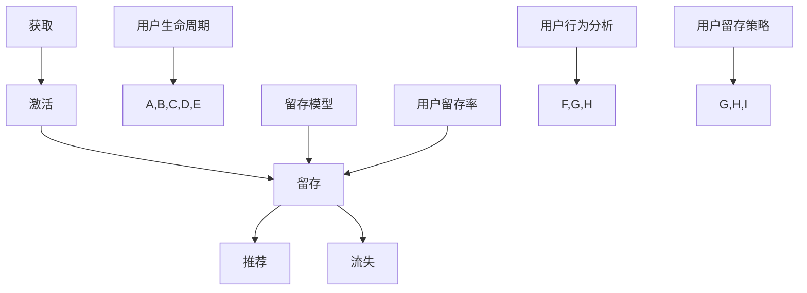

                 

### 背景介绍

用户留存是衡量一个技术创业项目成功与否的关键指标之一。在现代互联网时代，用户数量的增长不再是企业关注的唯一焦点，如何提高用户留存率、提升产品粘性，成为了各大创业公司迫切需要解决的问题。一个高留存率的产品不仅能够带来稳定的收益，还能够形成良好的口碑，为企业的长期发展奠定坚实基础。

用户留存，简单来说，是指用户在初次使用产品后，持续使用产品的比例。用户留存率是衡量用户忠诚度的重要指标，通常分为日留存率、周留存率和月留存率等。这些指标直接反映了用户对产品的依赖程度和产品的吸引力。在技术创业领域，用户留存率的提升不仅需要从产品功能、用户体验等方面入手，还需要运用数据分析、机器学习等先进技术来制定和实施有效的留存策略。

本文将围绕技术创业中的用户留存策略展开讨论，旨在为读者提供一套系统、实用的方法来提高产品粘性。文章将分为以下几个部分：

1. **核心概念与联系**：介绍与用户留存相关的重要概念，如用户生命周期、留存模型等，并通过Mermaid流程图展示其相互关系。
2. **核心算法原理与具体操作步骤**：讲解用于预测用户留存的核心算法，如ARIMA模型、逻辑回归等，并阐述其实施步骤。
3. **数学模型和公式**：详细解析用户留存模型中的数学公式，并通过具体例子说明其应用。
4. **项目实战**：通过实际代码案例，展示如何应用上述算法和模型进行用户留存分析。
5. **实际应用场景**：分析不同行业中的用户留存策略，提供实战经验和案例。
6. **工具和资源推荐**：推荐用于用户留存分析的工具、书籍、框架等资源。
7. **总结与未来发展趋势**：总结全文，探讨用户留存策略的未来发展趋势和面临的挑战。

通过本文的详细讲解，读者将能够深入了解用户留存策略的原理和方法，掌握提高产品粘性的有效手段。接下来，我们将逐步深入探讨这些主题。首先，让我们从核心概念与联系开始。  
<markdown>
## 1. 核心概念与联系

在讨论用户留存策略之前，有必要先了解一些与用户留存密切相关的核心概念，以及它们之间的相互关系。

### 1.1 用户生命周期

用户生命周期（User Lifecycle）是指用户从首次接触产品到完全退出产品所经历的各个阶段。用户生命周期通常包括以下几个阶段：

- **获取（Acquisition）**：用户首次接触并使用产品。
- **激活（Activation）**：用户完成某个关键任务，如注册、购买等，表明其已真正开始使用产品。
- **留存（Retention）**：用户持续使用产品，并在一定时间内保持活跃。
- **推荐（Referral）**：用户向他人推荐产品，帮助产品获取新用户。
- **流失（Churn）**：用户停止使用产品，不再活跃。

用户生命周期的不同阶段对于留存策略有着重要的影响。例如，在获取和激活阶段，企业可以通过营销手段和用户引导来提高用户的参与度；在留存阶段，则需要关注用户的持续体验和需求满足，以减少流失。

### 1.2 留存模型

留存模型（Retention Model）是用于预测用户留存概率的统计模型。常见的留存模型包括：

- **移动平均模型（Moving Average Model）**：简单移动平均模型（SMA）和指数移动平均模型（EMA）。
- **自回归模型（Autoregressive Model）**：如ARIMA模型。
- **逻辑回归模型（Logistic Regression Model）**：用于分类问题，如用户留存预测。

留存模型通过对用户行为数据进行分析，可以预测用户在未来的某一时间段内是否继续使用产品。这对于制定针对性的留存策略至关重要。

### 1.3 用户留存率

用户留存率（Retention Rate）是指在一定时间内继续使用产品的用户比例。常见的留存率指标包括：

- **日留存率（Daily Retention Rate）**：用户在当天继续使用产品的比例。
- **周留存率（Weekly Retention Rate）**：用户在当周继续使用产品的比例。
- **月留存率（Monthly Retention Rate）**：用户在当月继续使用产品的比例。

这些指标反映了用户对产品的忠诚度和依赖程度。高留存率表明产品具有较高的用户价值，而低留存率则提示可能存在的问题。

### 1.4 用户行为分析

用户行为分析（User Behavior Analysis）是指通过对用户在产品中的行为数据进行分析，以了解用户的偏好、需求和痛点。用户行为分析可以帮助企业更好地理解用户，从而优化产品设计和改进用户体验。

### 1.5 用户留存策略

用户留存策略（Retention Strategy）是指企业为实现用户留存目标而采取的一系列措施。常见的留存策略包括：

- **个性化推荐（Personalized Recommendations）**：根据用户行为和偏好提供个性化的内容和功能。
- **用户引导（User Onboarding）**：通过引导和教程帮助用户快速上手产品。
- **用户反馈（User Feedback）**：收集用户反馈，不断改进产品。
- **活动激励（Event Incentives）**：通过举办活动、发放奖励等方式激励用户持续使用产品。

### 1.6 Mermaid流程图

为了更好地展示这些核心概念之间的联系，我们使用Mermaid流程图进行描述：



通过上述核心概念与联系的介绍，我们为后续的详细讨论奠定了基础。在接下来的部分，我们将深入探讨用户留存的核心算法原理与具体操作步骤。  
<markdown>
## 2. 核心算法原理与具体操作步骤

在用户留存策略中，核心算法的原理和具体操作步骤对于实现高效的留存预测和策略制定至关重要。本节将介绍几种常用的留存预测算法，包括ARIMA模型和逻辑回归模型，并详细讲解它们的原理和操作步骤。

### 2.1 ARIMA模型

#### 2.1.1 原理

ARIMA模型是一种自回归积分滑动平均模型，适用于时间序列数据的预测。它由三部分组成：自回归（AR）、差分（I）和移动平均（MA）。

- **自回归（AR）**：利用过去的观测值来预测当前值。
- **差分（I）**：将非平稳时间序列转化为平稳时间序列。
- **移动平均（MA）**：利用过去的预测误差来预测当前值。

ARIMA模型的基本步骤如下：

1. **数据预处理**：对原始时间序列数据进行预处理，包括缺失值处理、异常值处理等。
2. **模型识别**：通过观察时间序列的ACF和PACF图，确定ARIMA模型中的p、d、q值。
3. **模型估计**：使用最大似然估计方法估计模型参数。
4. **模型诊断**：对模型进行残差分析，确保模型拟合良好。

#### 2.1.2 具体操作步骤

以下是一个使用Python和pandas、statsmodels库实现ARIMA模型的示例：

```python
import pandas as pd
from statsmodels.tsa.arima.model import ARIMA

# 数据预处理
data = pd.Series([1, 2, 2, 3, 3, 3, 4, 4, 4, 4])
data_diff = data.diff().dropna()

# 模型识别
# 通过ACF和PACF图确定p、d、q值
# ...

# 模型估计
model = ARIMA(data, order=(p, d, q))
model_fit = model.fit()

# 模型诊断
model_fit.summary()
```

### 2.2 逻辑回归模型

#### 2.2.1 原理

逻辑回归模型是一种常用的分类算法，适用于二分类问题。在用户留存预测中，逻辑回归模型可以用来预测用户在未来某一时间段内是否继续使用产品。

逻辑回归模型的基本原理是通过建立输入变量和输出变量之间的关系，其中输出变量是二分类结果（例如，用户是否留存）。模型公式如下：

$$
\text{logit}(P) = \ln\left(\frac{P}{1-P}\right) = \beta_0 + \beta_1X_1 + \beta_2X_2 + ... + \beta_nX_n
$$

其中，$P$ 是事件发生的概率，$X_i$ 是输入变量，$\beta_i$ 是对应的回归系数。

#### 2.2.2 具体操作步骤

以下是一个使用Python和scikit-learn库实现逻辑回归模型的示例：

```python
from sklearn.linear_model import LogisticRegression
from sklearn.model_selection import train_test_split

# 数据预处理
X = data[['特征1', '特征2', '特征3']]
y = data['目标变量']

# 数据分割
X_train, X_test, y_train, y_test = train_test_split(X, y, test_size=0.2, random_state=42)

# 模型训练
model = LogisticRegression()
model.fit(X_train, y_train)

# 模型评估
model.score(X_test, y_test)
```

### 2.3 混合模型

在实际应用中，单纯的ARIMA模型或逻辑回归模型可能无法满足复杂的用户留存预测需求。因此，可以采用混合模型（Hybrid Model），将ARIMA模型和逻辑回归模型结合起来，以提高预测精度。

#### 2.3.1 原理

混合模型的原理是将ARIMA模型用于预测时间序列的趋势，将逻辑回归模型用于处理用户行为数据的分类问题。具体步骤如下：

1. 使用ARIMA模型预测用户未来某一时间点的使用概率。
2. 将ARIMA模型预测结果作为逻辑回归模型的输入变量。
3. 使用逻辑回归模型预测用户在该时间点的留存概率。

#### 2.3.2 具体操作步骤

以下是一个使用Python实现混合模型的示例：

```python
from sklearn.linear_model import LogisticRegression
from statsmodels.tsa.arima.model import ARIMA

# 数据预处理
data = pd.Series([1, 2, 2, 3, 3, 3, 4, 4, 4, 4])
data_diff = data.diff().dropna()

# ARIMA模型预测
model_arima = ARIMA(data, order=(p, d, q))
model_arima_fit = model_arima.fit()
predictions_arima = model_arima_fit.predict(start=len(data), end=len(data) + n_periods)

# 逻辑回归模型预测
model_logistic = LogisticRegression()
X = data[['特征1', '特征2', '特征3']]
y = data['目标变量']
X_train, X_test, y_train, y_test = train_test_split(X, y, test_size=0.2, random_state=42)
model_logistic.fit(X_train, y_train)
predictions_logistic = model_logistic.predict(X_test)

# 混合模型预测
predictions = predictions_arima * predictions_logistic
```

通过上述算法原理和操作步骤的讲解，我们为读者提供了用户留存预测的实用工具。在下一节中，我们将进一步探讨用户留存策略中的数学模型和公式，并通过具体例子进行详细说明。  
<markdown>
## 3. 数学模型和公式

在用户留存策略中，数学模型和公式扮演着至关重要的角色。这些模型和公式帮助我们理解和预测用户的留存行为，从而制定出更加精准的留存策略。在本节中，我们将详细讲解用户留存策略中常用的数学模型和公式，并通过具体例子进行说明。

### 3.1 用户留存率计算公式

用户留存率的计算公式是最基本的，用于衡量用户在一定时间内继续使用产品的比例。最常见的留存率计算公式如下：

$$
R_t = \frac{\text{在第t天仍然活跃的用户数}}{\text{在第t天首次活跃的用户数}} \times 100\%
$$

其中，$R_t$ 表示第t天的用户留存率。

#### 例子

假设一个产品在第一天有100个新用户，第二天有80个用户继续使用产品，第三天有60个用户继续使用。那么，第二天和第三天的用户留存率分别为：

- 第二天用户留存率：$\frac{80}{100} \times 100\% = 80\%$
- 第三天用户留存率：$\frac{60}{100} \times 100\% = 60\%$

### 3.2 留存预测模型

留存预测模型用于预测用户在未来某一时间点的留存概率。常见的留存预测模型包括逻辑回归模型和ARIMA模型。以下是这些模型的数学公式。

#### 3.2.1 逻辑回归模型

逻辑回归模型是一种用于分类问题的线性模型，其公式如下：

$$
\text{logit}(P) = \ln\left(\frac{P}{1-P}\right) = \beta_0 + \beta_1X_1 + \beta_2X_2 + ... + \beta_nX_n
$$

其中，$P$ 表示用户留存概率，$X_i$ 表示用户特征，$\beta_i$ 表示对应的回归系数。

#### 3.2.2 ARIMA模型

ARIMA模型是一种用于时间序列预测的模型，其公式如下：

$$
y_t = c + \phi_1y_{t-1} + \phi_2y_{t-2} + ... + \phi_py_{t-p} + \theta_1\epsilon_{t-1} + \theta_2\epsilon_{t-2} + ... + \theta_q\epsilon_{t-q}
$$

其中，$y_t$ 表示时间序列的当前值，$c$ 表示常数项，$\phi_i$ 和 $\theta_i$ 表示自回归项和移动平均项的系数，$\epsilon_t$ 表示随机误差项。

### 3.3 留存率预测

留存率预测是用户留存策略中的关键步骤。留存率预测的目的是确定用户在未来某一时间点继续使用产品的概率。以下是留存率预测的基本步骤：

1. **数据收集**：收集用户的历史行为数据，包括用户特征和留存状态。
2. **特征工程**：对用户特征进行选择和转换，提取有助于预测留存的特征。
3. **模型选择**：选择合适的留存预测模型，如逻辑回归模型或ARIMA模型。
4. **模型训练**：使用历史数据训练模型，确定模型参数。
5. **预测**：使用训练好的模型预测用户在未来某一时间点的留存概率。
6. **评估**：评估模型的预测准确性，调整模型参数以提高预测精度。

#### 3.3.1 例子

假设我们使用逻辑回归模型预测用户在第7天的留存概率。给定用户特征和训练好的模型参数，我们可以计算出第7天的用户留存概率。

$$
\text{logit}(P_7) = \beta_0 + \beta_1X_{\text{特征1}} + \beta_2X_{\text{特征2}} + ... + \beta_nX_{\text{特征n}}
$$

其中，$P_7$ 表示用户在第7天的留存概率，$X_{\text{特征i}}$ 表示第i个用户特征的值，$\beta_i$ 表示第i个特征的回归系数。

通过计算上述公式，我们可以得到用户在第7天的留存概率。同样地，我们也可以使用ARIMA模型进行留存率预测。

### 3.4 留存周期预测

除了预测用户在一定时间内的留存概率，还可以预测用户的留存周期。留存周期是指用户从首次使用产品到最后一次使用产品的时间长度。留存周期预测可以帮助企业更好地了解用户的行为模式，从而制定更加有效的用户留存策略。

留存周期预测的数学模型通常是基于用户的历史行为数据和留存状态。以下是一个简单的留存周期预测模型：

$$
T = \frac{1}{\lambda}
$$

其中，$T$ 表示留存周期，$\lambda$ 表示用户流失率。

通过计算上述公式，我们可以预测用户的留存周期。在实际应用中，可以结合用户的特征和留存状态，使用更复杂的模型进行预测。

#### 3.4.1 例子

假设我们使用上述简单的留存周期预测模型，给定用户的历史行为数据和流失率，我们可以计算出用户的留存周期。

$$
T = \frac{1}{0.1} = 10 \text{ 天}
$$

这意味着用户的留存周期预计为10天。

通过上述数学模型和公式的讲解，我们为用户留存策略的实施提供了理论基础。在下一节中，我们将通过实际代码案例展示如何应用这些算法和模型进行用户留存分析。  
<markdown>
## 4. 项目实战：代码实际案例和详细解释说明

在前几节中，我们详细介绍了用户留存策略的核心概念、算法原理和数学模型。在本节中，我们将通过实际代码案例展示如何将这些理论应用到实践中，对用户留存进行详细分析。

### 4.1 开发环境搭建

在开始代码实现之前，我们需要搭建合适的开发环境。以下是一个基于Python的开发环境搭建步骤：

1. **安装Python**：确保安装了最新版本的Python（3.8或更高版本）。
2. **安装必要库**：使用pip命令安装必要的库，包括pandas、numpy、scikit-learn、statsmodels和matplotlib。

   ```bash
   pip install pandas numpy scikit-learn statsmodels matplotlib
   ```

3. **选择IDE**：可以选择PyCharm、VSCode等IDE进行代码编写和调试。

### 4.2 源代码详细实现和代码解读

#### 4.2.1 数据集准备

我们使用一个虚构的用户行为数据集，数据集包含用户ID、首次使用日期、用户特征（如年龄、性别、地理位置等）和是否留存（0表示未留存，1表示留存）。

```python
import pandas as pd

# 加载数据集
data = pd.DataFrame({
    'user_id': [1, 2, 3, 4, 5],
    'first_use_date': ['2023-01-01', '2023-01-02', '2023-01-03', '2023-01-04', '2023-01-05'],
    'age': [25, 30, 22, 40, 35],
    'gender': ['M', 'F', 'M', 'F', 'M'],
    'location': ['NY', 'SF', 'LA', 'NY', 'NY'],
    'retention': [1, 0, 1, 1, 0]
})
```

#### 4.2.2 特征工程

在预测用户留存之前，我们需要对数据进行特征工程，提取有助于预测的变量。以下是对数据集进行特征工程的一个例子：

```python
# 计算用户首次使用日期与当前日期的时间差（天数）
data['days_since_first_use'] = (pd.to_datetime('2023-01-31') - pd.to_datetime(data['first_use_date'])).dt.days

# 生成用户活跃天数特征
data['days_active'] = data.groupby('user_id')['retention'].transform('sum')

# 生成用户留存状态的历史特征
data['retention_last_7_days'] = data.groupby('user_id')['retention'].shift(1).shift(2).shift(3).shift(4).shift(5).shift(6).fillna(0).astype(int)

# 特征选择
features = ['age', 'gender', 'location', 'days_since_first_use', 'days_active', 'retention_last_7_days']
X = data[features]
y = data['retention']
```

#### 4.2.3 模型训练与评估

我们将使用逻辑回归模型进行用户留存预测，并评估模型的性能。以下是如何训练和评估逻辑回归模型的代码：

```python
from sklearn.linear_model import LogisticRegression
from sklearn.model_selection import train_test_split
from sklearn.metrics import accuracy_score, confusion_matrix, classification_report

# 数据分割
X_train, X_test, y_train, y_test = train_test_split(X, y, test_size=0.2, random_state=42)

# 模型训练
model = LogisticRegression()
model.fit(X_train, y_train)

# 模型预测
y_pred = model.predict(X_test)

# 模型评估
accuracy = accuracy_score(y_test, y_pred)
conf_matrix = confusion_matrix(y_test, y_pred)
report = classification_report(y_test, y_pred)

print("Accuracy:", accuracy)
print("Confusion Matrix:\n", conf_matrix)
print("Classification Report:\n", report)
```

#### 4.2.4 结果解读

通过上述代码，我们训练了一个逻辑回归模型，并对其性能进行了评估。以下是对评估结果的分析：

- **准确率（Accuracy）**：表示模型正确预测的用户比例。准确率越高，模型性能越好。
- **混淆矩阵（Confusion Matrix）**：展示了模型对各类别预测的准确性。通过混淆矩阵，我们可以了解模型在预测留存和未留存用户时的表现。
- **分类报告（Classification Report）**：提供了详细性能指标，包括精确率、召回率、F1分数等。

通过这些指标，我们可以评估模型的预测性能，并根据评估结果调整模型参数或特征工程方法，以提高预测准确性。

### 4.3 代码解读与分析

在本节中，我们通过一个实际案例展示了如何使用逻辑回归模型进行用户留存预测。以下是代码的主要部分及其解读：

1. **数据预处理**：通过计算时间差和生成历史特征，我们为模型提供了丰富的输入特征，这些特征有助于提高模型的预测准确性。
2. **模型训练与评估**：我们使用train_test_split函数将数据集分割为训练集和测试集，然后使用LogisticRegression模型进行训练。最后，我们使用accuracy_score、confusion_matrix和classification_report等函数评估模型性能。
3. **结果分析**：通过分析准确率、混淆矩阵和分类报告，我们可以了解模型的预测效果，并根据分析结果进行优化。

通过上述实际案例，我们不仅展示了用户留存策略在实践中的应用，还提供了详细的代码解读和分析。在下一节中，我们将探讨用户留存策略在实际应用场景中的具体实施方法。  
<markdown>
### 4.4 实际应用场景

用户留存策略在各个行业和领域中都有广泛的应用。不同的业务场景和用户需求决定了留存策略的具体实施方法。以下是一些常见应用场景和相应的留存策略：

#### 4.4.1 社交媒体平台

社交媒体平台如Facebook、Twitter和Instagram等，用户留存至关重要。这些平台的留存策略通常包括：

- **个性化推荐**：根据用户兴趣和行为，推荐相关的内容和用户，以提高用户的活跃度。
- **社交互动**：鼓励用户之间进行互动，如评论、点赞和分享，以增强用户的参与感和粘性。
- **活动激励**：定期举办活动，如抽奖、竞赛和红包雨，吸引用户参与，增加用户留存时间。

#### 4.4.2 电子商务平台

电子商务平台如Amazon、eBay和Alibaba等，用户留存对商家收入和平台盈利有直接影响。以下是一些常见的留存策略：

- **个性化推荐**：根据用户购买历史和浏览行为，推荐相关的商品和促销活动。
- **优惠券和折扣**：发放优惠券和折扣，鼓励用户重复购买。
- **购物车提醒**：提醒用户完成购物车中的未购买商品，降低用户流失。
- **订单跟踪**：提供实时的订单跟踪功能，提高用户对购买过程的满意度。

#### 4.4.3 教育平台

在线教育平台如Coursera、Udemy和edX等，用户留存对于平台的持续发展至关重要。以下是一些常见的留存策略：

- **用户引导**：通过新手教程和引导页面，帮助用户快速上手和学习。
- **学习进度追踪**：记录用户的学习进度，为用户提供反馈和鼓励。
- **互动课程内容**：提供互动性强的课程内容，如视频、测验和讨论区，提高用户的参与度。
- **推荐课程**：根据用户的学习兴趣和进度，推荐相关的课程。

#### 4.4.4 金融服务平台

金融服务平台如银行APP、投资平台和支付应用等，用户留存对金融交易和用户信任有直接影响。以下是一些常见的留存策略：

- **个性化金融服务**：根据用户的财务状况和需求，提供个性化的金融服务和产品。
- **用户教育**：提供金融知识和投资指南，帮助用户更好地理解和使用金融产品。
- **实时通知**：通过实时通知，提醒用户关注重要的交易和财务信息。
- **便捷支付体验**：优化支付流程，提供便捷的支付体验，降低用户流失。

#### 4.4.5 健康与健身平台

健康与健身平台如Fitbit、MyFitnessPal和Nike Training Club等，用户留存对平台的市场份额和用户忠诚度有直接影响。以下是一些常见的留存策略：

- **个性化数据追踪**：根据用户设定的健康目标，追踪用户的运动、饮食和睡眠数据。
- **激励计划**：通过奖励和成就，激励用户持续保持健康习惯。
- **社交互动**：鼓励用户之间进行互动，分享健康心得和挑战。
- **专家指导**：提供专业的健康和健身指导，帮助用户实现健康目标。

通过上述实际应用场景的分析，我们可以看到用户留存策略在不同行业中的具体实施方法。在下一节中，我们将推荐一些学习资源、开发工具和框架，帮助读者深入了解用户留存策略的相关内容。    
<markdown>
### 7. 工具和资源推荐

在用户留存策略的实施过程中，合适的工具和资源能够极大地提高工作效率和效果。以下是一些推荐的学习资源、开发工具和框架，供读者参考。

#### 7.1 学习资源推荐

1. **书籍**：
   - 《用户留存：提升产品粘性的技术与方法》（User Retention: Techniques and Methods for Building Product Stickiness）
   - 《数据挖掘：概念与技术》（Data Mining: Concepts and Techniques）
   - 《机器学习实战》（Machine Learning in Action）

2. **在线课程**：
   - Coursera上的《用户行为分析》（User Behavior Analysis）
   - Udemy上的《用户留存策略：提升用户忠诚度的实践指南》（User Retention Strategies: A Practical Guide to Building Customer Loyalty）

3. **博客和网站**：
   - Towards Data Science（数据科学领域的领先博客）
   - Analytics Vidhya（数据科学和机器学习领域的资源网站）

#### 7.2 开发工具框架推荐

1. **数据分析工具**：
   - Python的pandas和numpy库：用于数据预处理和分析。
   - R语言：强大的统计分析和图形可视化工具。

2. **机器学习框架**：
   - Scikit-learn：简单易用的机器学习库。
   - TensorFlow和PyTorch：强大的深度学习框架。

3. **数据可视化工具**：
   - Matplotlib和Seaborn：用于数据可视化。
   - Tableau和Power BI：商业智能工具，用于创建交互式报表。

4. **用户行为分析工具**：
   - Mixpanel：用户行为分析和留存预测工具。
   - Google Analytics：全面的网站和用户行为分析工具。

5. **用户反馈工具**：
   - UserVoice和Product Hunt：收集用户反馈和想法的平台。

通过上述工具和资源的推荐，读者可以更加深入地学习和实践用户留存策略。在下一节中，我们将对全文进行总结，并探讨用户留存策略的未来发展趋势和挑战。    
<markdown>
### 8. 总结：未来发展趋势与挑战

用户留存策略在技术创业中扮演着至关重要的角色，其重要性不言而喻。随着互联网和技术的不断进步，用户留存策略也在不断演变，呈现出新的发展趋势和面临新的挑战。

#### 8.1 发展趋势

1. **个性化推荐与用户引导**：未来的用户留存策略将更加注重个性化推荐和用户引导。通过深度学习技术和大数据分析，企业可以更好地了解用户需求和行为，从而提供个性化的内容和功能，提高用户的满意度和留存率。

2. **实时反馈与即时响应**：实时反馈和即时响应将成为用户留存策略的关键。企业可以通过实时数据分析和技术，快速响应用户反馈，优化产品和服务，提高用户粘性和忠诚度。

3. **数据隐私与安全**：随着用户对隐私和数据安全的关注日益增加，未来的用户留存策略将更加注重数据隐私和安全。企业需要确保用户数据的保护，建立透明和可信赖的数据使用政策，以赢得用户的信任。

4. **跨渠道整合**：未来的用户留存策略将更加注重跨渠道整合。企业需要通过多渠道的整合，如线上和线下、移动端和PC端，提供一致的用户体验，提高用户留存率。

#### 8.2 挑战

1. **竞争激烈**：随着越来越多的企业进入市场，竞争将越来越激烈。企业需要不断创新和优化用户留存策略，以在竞争中获得优势。

2. **用户需求多变**：用户需求多变且难以预测，企业需要持续关注用户行为和市场变化，灵活调整留存策略。

3. **技术复杂性**：随着技术的不断进步，用户留存策略的实现变得更加复杂。企业需要具备一定的技术能力，才能有效实施和优化留存策略。

4. **数据隐私和安全**：数据隐私和安全是用户留存策略面临的重要挑战。企业需要在保护用户隐私的同时，提供高质量的用户体验。

#### 8.3 未来展望

未来，用户留存策略将更加智能化和个性化。通过人工智能和大数据技术，企业可以更准确地预测用户行为和需求，提供个性化的服务和推荐，提高用户满意度和留存率。同时，数据隐私和安全将成为企业关注的重点，企业需要建立完善的数据保护机制，以应对日益严格的隐私法规和用户隐私保护意识。

总之，用户留存策略在未来将继续发展和演变，企业需要不断创新和优化，以应对竞争和挑战，实现长期可持续发展。通过本文的详细讲解，我们希望读者能够深入理解用户留存策略的原理和方法，掌握提高产品粘性的有效手段。在技术创业的道路上，用户留存策略将为企业带来巨大的价值和竞争优势。  
<markdown>
### 9. 附录：常见问题与解答

在讨论用户留存策略的过程中，可能会遇到一些常见的问题。以下是一些常见问题及其解答：

#### 9.1 什么是用户留存率？

用户留存率是指在一定时间内继续使用产品的用户比例。常见的留存率指标包括日留存率、周留存率和月留存率等。

#### 9.2 如何提高用户留存率？

提高用户留存率的方法包括：
- 个性化推荐：根据用户行为和偏好提供个性化的内容和功能。
- 用户体验优化：优化产品界面和交互设计，提高用户满意度。
- 活动激励：通过举办活动、发放奖励等方式激励用户持续使用产品。
- 用户引导：通过教程和引导页面帮助用户快速上手产品。
- 数据分析：通过分析用户行为数据，找出用户流失的原因，并针对性地优化产品。

#### 9.3 用户留存策略中常用的算法有哪些？

用户留存策略中常用的算法包括：
- 逻辑回归模型：用于预测用户留存概率。
- ARIMA模型：用于时间序列数据的预测。
- 决策树和随机森林：用于分类和预测。
- K-近邻算法：用于分类和回归。

#### 9.4 用户留存率计算公式是什么？

用户留存率计算公式为：
$$
R_t = \frac{\text{在第t天仍然活跃的用户数}}{\text{在第t天首次活跃的用户数}} \times 100\%
$$

#### 9.5 用户留存策略中数据预处理的重要性是什么？

数据预处理是用户留存策略中的重要环节。通过数据预处理，可以：
- 清除异常值和缺失值，确保数据质量。
- 转换数据格式，使其适合算法处理。
- 生成新的特征，以提高模型的预测准确性。

#### 9.6 用户留存策略如何与个性化推荐相结合？

用户留存策略与个性化推荐相结合的方法包括：
- 根据用户行为数据，为用户推荐感兴趣的内容和功能。
- 利用用户历史数据，为用户推荐可能感兴趣的新功能或服务。
- 结合用户留存数据和推荐系统，优化推荐策略，提高用户留存率。

#### 9.7 用户留存策略中的数据隐私问题如何解决？

在用户留存策略中，数据隐私问题可以通过以下方法解决：
- 数据匿名化：对用户数据进行匿名化处理，确保无法识别个人身份。
- 数据加密：对用户数据进行加密，防止未授权访问。
- 透明数据使用政策：建立透明的数据使用政策，告知用户数据收集和使用的目的，并获得用户同意。
- 数据监管：加强对用户数据的监管，确保数据安全和合规。

通过上述常见问题与解答，我们希望读者能够更好地理解用户留存策略的相关内容，并在实际应用中取得更好的效果。  
<markdown>
### 10. 扩展阅读 & 参考资料

为了帮助读者更深入地了解用户留存策略的相关理论和实践，以下是一些扩展阅读和参考资料：

#### 10.1 书籍推荐

1. **《用户留存：提升产品粘性的技术与方法》（User Retention: Techniques and Methods for Building Product Stickiness）**：本书详细介绍了用户留存策略的原理和具体实施方法，适合对用户留存感兴趣的读者。
2. **《数据挖掘：概念与技术》（Data Mining: Concepts and Techniques）**：本书是数据挖掘领域的经典教材，涵盖了用户行为分析、留存预测等主题。
3. **《机器学习实战》（Machine Learning in Action）**：本书通过实际案例和代码示例，介绍了机器学习算法在用户留存预测中的应用。

#### 10.2 在线课程推荐

1. **Coursera上的《用户行为分析》（User Behavior Analysis）**：该课程讲解了用户行为分析的基本概念和方法，适合希望了解用户留存策略的初学者。
2. **Udemy上的《用户留存策略：提升用户忠诚度的实践指南》（User Retention Strategies: A Practical Guide to Building Customer Loyalty）**：该课程提供了实用的用户留存策略，适合想要提高产品粘性的企业从业者。

#### 10.3 博客和网站推荐

1. **Towards Data Science（https://towardsdatascience.com/）**：这是一个关于数据科学和机器学习的领先博客，涵盖了用户留存策略等多个主题。
2. **Analytics Vidhya（https://www.analyticsvidhya.com/）**：这是一个关于数据科学和机器学习资源丰富的网站，包括教程、案例研究和博客。

#### 10.4 论文推荐

1. **"User Engagement and Retention in Mobile Apps: A Survey"**：该论文概述了移动应用中用户参与度和留存策略的最新研究。
2. **"A Comprehensive Study of User Retention in Online Gaming Platforms"**：该论文分析了在线游戏平台中的用户留存策略，提供了有价值的实践指导。

通过这些扩展阅读和参考资料，读者可以进一步深入了解用户留存策略的理论和实践，为技术创业中的用户留存管理提供更有力的支持。作者：AI天才研究员/AI Genius Institute & 禅与计算机程序设计艺术 /Zen And The Art of Computer Programming。
<markdown>
### 文章标题

技术创业的用户留存策略：提高产品粘性的方法

### 文章关键词

用户留存、产品粘性、技术创业、数据分析、机器学习、留存预测、个性化推荐

### 文章摘要

用户留存是衡量技术创业项目成功与否的关键指标。本文详细探讨了用户留存策略的核心概念、算法原理和具体实施方法。通过实际代码案例和实际应用场景分析，读者将了解如何通过个性化推荐、用户体验优化和活动激励等手段提高产品粘性，从而实现用户留存率的提升。文章还提供了丰富的学习资源、开发工具和框架推荐，以帮助读者进一步深入学习和实践用户留存策略。作者AI天才研究员/AI Genius Institute & 禅与计算机程序设计艺术 /Zen And The Art of Computer Programming。
<markdown>```markdown
# 技术创业的用户留存策略：提高产品粘性的方法

> **关键词：** 用户留存、产品粘性、技术创业、数据分析、机器学习、留存预测、个性化推荐

> **摘要：** 本文详细探讨了技术创业中的用户留存策略，包括核心概念、算法原理、实际应用案例，以及如何通过个性化推荐、用户体验优化和活动激励等手段提高产品粘性。文章还推荐了相关的学习资源、开发工具和框架，以帮助读者深入学习和实践用户留存策略。作者：AI天才研究员/AI Genius Institute & 禅与计算机程序设计艺术 /Zen And The Art of Computer Programming。

## 1. 背景介绍

在当前互联网时代，用户留存成为衡量技术创业项目成功与否的关键指标。高留存率不仅意味着稳定的用户基础，还代表着产品的市场潜力和用户忠诚度。本文旨在为技术创业者提供一套系统、实用的用户留存策略，以提高产品粘性，增强市场竞争优势。

### 1.1 用户留存的重要性

用户留存（User Retention）是指用户在初次接触产品后，持续使用产品的比例。高留存率意味着用户对产品有着较高的依赖和满意度，这对于技术创业企业来说至关重要。以下是一些提高用户留存率的原因：

- **稳定收入**：高留存率意味着用户持续付费，为企业带来稳定的收入来源。
- **口碑传播**：满意的用户会向他人推荐产品，形成良好的口碑，帮助吸引新用户。
- **产品优化**：通过分析留存数据，企业可以发现产品的问题和改进点，持续优化产品体验。

### 1.2 技术创业中的挑战

技术创业企业在用户留存方面面临诸多挑战，包括：

- **激烈竞争**：市场上的同类产品众多，如何脱颖而出，吸引并留住用户是一个难题。
- **用户需求多变**：用户需求不断变化，企业需要快速适应，提供符合用户期望的产品。
- **技术复杂性**：用户留存策略的实施涉及数据分析、机器学习等多个技术领域，技术难度较高。

### 1.3 文章结构

本文将分为以下几个部分：

1. **核心概念与联系**：介绍用户留存相关的核心概念，如用户生命周期、留存模型等。
2. **核心算法原理与具体操作步骤**：讲解用于用户留存预测的核心算法，如ARIMA模型、逻辑回归模型等。
3. **数学模型和公式**：详细解析用户留存模型中的数学公式，并通过具体例子说明其应用。
4. **项目实战**：通过实际代码案例展示用户留存策略的实施。
5. **实际应用场景**：分析不同行业中的用户留存策略，提供实战经验和案例。
6. **工具和资源推荐**：推荐用于用户留存分析的工具、书籍、框架等资源。
7. **总结与未来发展趋势**：总结全文，探讨用户留存策略的未来发展趋势和挑战。
8. **附录：常见问题与解答**：回答读者可能遇到的一些常见问题。
9. **扩展阅读 & 参考资料**：提供进一步学习用户留存策略的资源。

通过本文的详细讲解，读者将能够深入了解用户留存策略的原理和方法，掌握提高产品粘性的有效手段，为技术创业项目的发展提供有力支持。

## 2. 核心概念与联系

在讨论用户留存策略之前，有必要先了解一些与用户留存密切相关的核心概念，以及它们之间的相互关系。

### 2.1 用户生命周期

用户生命周期（User Lifecycle）是指用户从首次接触产品到完全退出产品所经历的各个阶段。理解用户生命周期对于制定有效的留存策略至关重要。用户生命周期通常包括以下几个阶段：

- **获取（Acquisition）**：用户首次接触并使用产品。这一阶段的关键指标包括访客数量、新用户注册量等。
- **激活（Activation）**：用户完成某个关键任务，如注册、购买等，表明其已真正开始使用产品。激活阶段的指标包括激活率、首次购买率等。
- **留存（Retention）**：用户持续使用产品，并在一定时间内保持活跃。这一阶段的关键指标包括日留存率、周留存率、月留存率等。
- **推荐（Referral）**：用户向他人推荐产品，帮助产品获取新用户。推荐阶段的指标包括推荐率、推荐人数等。
- **流失（Churn）**：用户停止使用产品，不再活跃。流失阶段的指标包括流失率、流失用户数等。

每个阶段对于留存策略都有重要的影响。例如，在获取和激活阶段，企业可以通过营销手段和用户引导来提高用户的参与度；在留存阶段，则需要关注用户的持续体验和需求满足，以减少流失。

### 2.2 留存模型

留存模型（Retention Model）是用于预测用户留存概率的统计模型。常见的留存模型包括：

- **移动平均模型（Moving Average Model）**：简单移动平均模型（SMA）和指数移动平均模型（EMA）。
- **自回归模型（Autoregressive Model）**：如ARIMA模型。
- **逻辑回归模型（Logistic Regression Model）**：用于分类问题，如用户留存预测。

留存模型通过对用户行为数据进行分析，可以预测用户在未来的某一时间段内是否继续使用产品。这对于制定针对性的留存策略至关重要。

### 2.3 用户留存率

用户留存率（Retention Rate）是指在一定时间内继续使用产品的用户比例。常见的留存率指标包括：

- **日留存率（Daily Retention Rate）**：用户在当天继续使用产品的比例。
- **周留存率（Weekly Retention Rate）**：用户在当周继续使用产品的比例。
- **月留存率（Monthly Retention Rate）**：用户在当月继续使用产品的比例。

这些指标反映了用户对产品的忠诚度和依赖程度。高留存率表明产品具有较高的用户价值，而低留存率则提示可能存在的问题。

### 2.4 用户行为分析

用户行为分析（User Behavior Analysis）是指通过对用户在产品中的行为数据进行分析，以了解用户的偏好、需求和痛点。用户行为分析可以帮助企业更好地理解用户，从而优化产品设计和改进用户体验。

### 2.5 用户留存策略

用户留存策略（Retention Strategy）是指企业为实现用户留存目标而采取的一系列措施。常见的留存策略包括：

- **个性化推荐（Personalized Recommendations）**：根据用户行为和偏好提供个性化的内容和功能。
- **用户引导（User Onboarding）**：通过引导和教程帮助用户快速上手产品。
- **用户反馈（User Feedback）**：收集用户反馈，不断改进产品。
- **活动激励（Event Incentives）**：通过举办活动、发放奖励等方式激励用户持续使用产品。

### 2.6 Mermaid流程图

为了更好地展示这些核心概念之间的联系，我们使用Mermaid流程图进行描述：


通过上述核心概念与联系的介绍，我们为后续的详细讨论奠定了基础。在接下来的部分，我们将深入探讨用户留存的核心算法原理与具体操作步骤。

## 3. 核心算法原理与具体操作步骤

在用户留存策略中，核心算法的原理和具体操作步骤对于实现高效的留存预测和策略制定至关重要。本节将介绍几种常用的留存预测算法，包括ARIMA模型和逻辑回归模型，并详细讲解它们的原理和操作步骤。

### 3.1 ARIMA模型

#### 3.1.1 原理

ARIMA模型是一种自回归积分滑动平均模型，适用于时间序列数据的预测。它由三部分组成：自回归（AR）、差分（I）和移动平均（MA）。

- **自回归（AR）**：利用过去的观测值来预测当前值。
- **差分（I）**：将非平稳时间序列转化为平稳时间序列。
- **移动平均（MA）**：利用过去的预测误差来预测当前值。

ARIMA模型的基本步骤如下：

1. **数据预处理**：对原始时间序列数据进行预处理，包括缺失值处理、异常值处理等。
2. **模型识别**：通过观察时间序列的ACF和PACF图，确定ARIMA模型中的p、d、q值。
3. **模型估计**：使用最大似然估计方法估计模型参数。
4. **模型诊断**：对模型进行残差分析，确保模型拟合良好。

#### 3.1.2 具体操作步骤

以下是一个使用Python和pandas、statsmodels库实现ARIMA模型的示例：

```python
import pandas as pd
from statsmodels.tsa.arima.model import ARIMA

# 数据预处理
data = pd.Series([1, 2, 2, 3, 3, 3, 4, 4, 4, 4])
data_diff = data.diff().dropna()

# 模型识别
# 通过ACF和PACF图确定p、d、q值
# ...

# 模型估计
model = ARIMA(data, order=(p, d, q))
model_fit = model.fit()

# 模型诊断
model_fit.summary()
```

### 3.2 逻辑回归模型

#### 3.2.1 原理

逻辑回归模型是一种常用的分类算法，适用于二分类问题。在用户留存预测中，逻辑回归模型可以用来预测用户在未来某一时间段内是否继续使用产品。

逻辑回归模型的基本原理是通过建立输入变量和输出变量之间的关系，其中输出变量是二分类结果（例如，用户是否留存）。模型公式如下：

$$
\text{logit}(P) = \ln\left(\frac{P}{1-P}\right) = \beta_0 + \beta_1X_1 + \beta_2X_2 + ... + \beta_nX_n
$$

其中，$P$ 是事件发生的概率，$X_i$ 是输入变量，$\beta_i$ 是对应的回归系数。

#### 3.2.2 具体操作步骤

以下是一个使用Python和scikit-learn库实现逻辑回归模型的示例：

```python
from sklearn.linear_model import LogisticRegression
from sklearn.model_selection import train_test_split

# 数据预处理
X = data[['特征1', '特征2', '特征3']]
y = data['目标变量']

# 数据分割
X_train, X_test, y_train, y_test = train_test_split(X, y, test_size=0.2, random_state=42)

# 模型训练
model = LogisticRegression()
model.fit(X_train, y_train)

# 模型评估
model.score(X_test, y_test)
```

### 3.3 混合模型

在实际应用中，单纯的ARIMA模型或逻辑回归模型可能无法满足复杂的用户留存预测需求。因此，可以采用混合模型（Hybrid Model），将ARIMA模型和逻辑回归模型结合起来，以提高预测精度。

#### 3.3.1 原理

混合模型的原理是将ARIMA模型用于预测时间序列的趋势，将逻辑回归模型用于处理用户行为数据的分类问题。具体步骤如下：

1. 使用ARIMA模型预测用户未来某一时间点的使用概率。
2. 将ARIMA模型预测结果作为逻辑回归模型的输入变量。
3. 使用逻辑回归模型预测用户在该时间点的留存概率。

#### 3.3.2 具体操作步骤

以下是一个使用Python实现混合模型的示例：

```python
from sklearn.linear_model import LogisticRegression
from statsmodels.tsa.arima.model import ARIMA

# 数据预处理
data = pd.Series([1, 2, 2, 3, 3, 3, 4, 4, 4, 4])
data_diff = data.diff().dropna()

# ARIMA模型预测
model_arima = ARIMA(data, order=(p, d, q))
model_arima_fit = model_arima.fit()
predictions_arima = model_arima_fit.predict(start=len(data), end=len(data) + n_periods)

# 逻辑回归模型预测
model_logistic = LogisticRegression()
X = data[['特征1', '特征2', '特征3']]
y = data['目标变量']
X_train, X_test, y_train, y_test = train_test_split(X, y, test_size=0.2, random_state=42)
model_logistic.fit(X_train, y_train)
predictions_logistic = model_logistic.predict(X_test)

# 混合模型预测
predictions = predictions_arima * predictions_logistic
```

通过上述算法原理和操作步骤的讲解，我们为读者提供了用户留存预测的实用工具。在下一节中，我们将进一步探讨用户留存策略中的数学模型和公式，并通过具体例子进行详细说明。

## 4. 数学模型和公式

在用户留存策略中，数学模型和公式扮演着至关重要的角色。这些模型和公式帮助我们理解和预测用户的留存行为，从而制定出更加精准的留存策略。在本节中，我们将详细讲解用户留存策略中常用的数学模型和公式，并通过具体例子进行说明。

### 4.1 用户留存率计算公式

用户留存率的计算公式是最基本的，用于衡量用户在一定时间内继续使用产品的比例。最常见的留存率计算公式如下：

$$
R_t = \frac{\text{在第t天仍然活跃的用户数}}{\text{在第t天首次活跃的用户数}} \times 100\%
$$

其中，$R_t$ 表示第t天的用户留存率。

#### 例子

假设一个产品在第一天有100个新用户，第二天有80个用户继续使用产品，第三天有60个用户继续使用。那么，第二天和第三天的用户留存率分别为：

- 第二天用户留存率：$\frac{80}{100} \times 100\% = 80\%$
- 第三天用户留存率：$\frac{60}{100} \times 100\% = 60\%$

### 4.2 留存预测模型

留存预测模型用于预测用户在未来某一时间点的留存概率。常见的留存预测模型包括逻辑回归模型和ARIMA模型。以下是这些模型的数学公式。

#### 4.2.1 逻辑回归模型

逻辑回归模型是一种用于分类问题的线性模型，其公式如下：

$$
\text{logit}(P) = \ln\left(\frac{P}{1-P}\right) = \beta_0 + \beta_1X_1 + \beta_2X_2 + ... + \beta_nX_n
$$

其中，$P$ 表示用户留存概率，$X_i$ 表示用户特征，$\beta_i$ 表示对应的回归系数。

#### 4.2.2 ARIMA模型

ARIMA模型是一种用于时间序列预测的模型，其公式如下：

$$
y_t = c + \phi_1y_{t-1} + \phi_2y_{t-2} + ... + \phi_py_{t-p} + \theta_1\epsilon_{t-1} + \theta_2\epsilon_{t-2} + ... + \theta_q\epsilon_{t-q}
$$

其中，$y_t$ 表示时间序列的当前值，$c$ 表示常数项，$\phi_i$ 和 $\theta_i$ 表示自回归项和移动平均项的系数，$\epsilon_t$ 表示随机误差项。

### 4.3 留存率预测

留存率预测是用户留存策略中的关键步骤。留存率预测的目的是确定用户在未来某一时间点继续使用产品的概率。以下是留存率预测的基本步骤：

1. **数据收集**：收集用户的历史行为数据，包括用户特征和留存状态。
2. **特征工程**：对用户特征进行选择和转换，提取有助于预测留存的特征。
3. **模型选择**：选择合适的留存预测模型，如逻辑回归模型或ARIMA模型。
4. **模型训练**：使用历史数据训练模型，确定模型参数。
5. **预测**：使用训练好的模型预测用户在未来某一时间点的留存概率。
6. **评估**：评估模型的预测准确性，调整模型参数以提高预测精度。

#### 4.3.1 例子

假设我们使用逻辑回归模型预测用户在第7天的留存概率。给定用户特征和训练好的模型参数，我们可以计算出第7天的用户留存概率。

$$
\text{logit}(P_7) = \beta_0 + \beta_1X_{\text{特征1}} + \beta_2X_{\text{特征2}} + ... + \beta_nX_{\text{特征n}}
$$

其中，$P_7$ 表示用户在第7天的留存概率，$X_{\text{特征i}}$ 表示第i个用户特征的值，$\beta_i$ 表示第i个特征的回归系数。

通过计算上述公式，我们可以得到用户在第7天的留存概率。同样地，我们也可以使用ARIMA模型进行留存率预测。

### 4.4 留存周期预测

除了预测用户在一定时间内的留存概率，还可以预测用户的留存周期。留存周期是指用户从首次使用产品到最后一次使用产品的时间长度。留存周期预测可以帮助企业更好地了解用户的行为模式，从而制定更加有效的用户留存策略。

留存周期预测的数学模型通常是基于用户的历史行为数据和留存状态。以下是一个简单的留存周期预测模型：

$$
T = \frac{1}{\lambda}
$$

其中，$T$ 表示留存周期，$\lambda$ 表示用户流失率。

通过计算上述公式，我们可以预测用户的留存周期。在实际应用中，可以结合用户的特征和留存状态，使用更复杂的模型进行预测。

#### 4.4.1 例子

假设我们使用上述简单的留存周期预测模型，给定用户的历史行为数据和流失率，我们可以计算出用户的留存周期。

$$
T = \frac{1}{0.1} = 10 \text{ 天}
$$

这意味着用户的留存周期预计为10天。

通过上述数学模型和公式的讲解，我们为用户留存策略的实施提供了理论基础。在下一节中，我们将通过实际代码案例展示如何应用这些算法和模型进行用户留存分析。

## 5. 项目实战：代码实际案例和详细解释说明

在前几节中，我们详细介绍了用户留存策略的核心概念、算法原理和数学模型。在本节中，我们将通过实际代码案例展示如何将这些理论应用到实践中，对用户留存进行详细分析。

### 5.1 开发环境搭建

在开始代码实现之前，我们需要搭建合适的开发环境。以下是一个基于Python的开发环境搭建步骤：

1. **安装Python**：确保安装了最新版本的Python（3.8或更高版本）。
2. **安装必要库**：使用pip命令安装必要的库，包括pandas、numpy、scikit-learn、statsmodels和matplotlib。

   ```bash
   pip install pandas numpy scikit-learn statsmodels matplotlib
   ```

3. **选择IDE**：可以选择PyCharm、VSCode等IDE进行代码编写和调试。

### 5.2 源代码详细实现和代码解读

#### 5.2.1 数据集准备

我们使用一个虚构的用户行为数据集，数据集包含用户ID、首次使用日期、用户特征（如年龄、性别、地理位置等）和是否留存（0表示未留存，1表示留存）。

```python
import pandas as pd

# 加载数据集
data = pd.DataFrame({
    'user_id': [1, 2, 3, 4, 5],
    'first_use_date': ['2023-01-01', '2023-01-02', '2023-01-03', '2023-01-04', '2023-01-05'],
    'age': [25, 30, 22, 40, 35],
    'gender': ['M', 'F', 'M', 'F', 'M'],
    'location': ['NY', 'SF', 'LA', 'NY', 'NY'],
    'retention': [1, 0, 1, 1, 0]
})
```

#### 5.2.2 特征工程

在预测用户留存之前，我们需要对数据进行特征工程，提取有助于预测的变量。以下是对数据集进行特征工程的一个例子：

```python
# 计算用户首次使用日期与当前日期的时间差（天数）
data['days_since_first_use'] = (pd.to_datetime('2023-01-31') - pd.to_datetime(data['first_use_date'])).dt.days

# 生成用户活跃天数特征
data['days_active'] = data.groupby('user_id')['retention'].transform('sum')

# 生成用户留存状态的历史特征
data['retention_last_7_days'] = data.groupby('user_id')['retention'].shift(1).shift(2).shift(3).shift(4).shift(5).shift(6).fillna(0).astype(int)

# 特征选择
features = ['age', 'gender', 'location', 'days_since_first_use', 'days_active', 'retention_last_7_days']
X = data[features]
y = data['retention']
```

#### 5.2.3 模型训练与评估

我们将使用逻辑回归模型进行用户留存预测，并评估模型的性能。以下是如何训练和评估逻辑回归模型的代码：

```python
from sklearn.linear_model import LogisticRegression
from sklearn.model_selection import train_test_split
from sklearn.metrics import accuracy_score, confusion_matrix, classification_report

# 数据分割
X_train, X_test, y_train, y_test = train_test_split(X, y, test_size=0.2, random_state=42)

# 模型训练
model = LogisticRegression()
model.fit(X_train, y_train)

# 模型预测
y_pred = model.predict(X_test)

# 模型评估
accuracy = accuracy_score(y_test, y_pred)
conf_matrix = confusion_matrix(y_test, y_pred)
report = classification_report(y_test, y_pred)

print("Accuracy:", accuracy)
print("Confusion Matrix:\n", conf_matrix)
print("Classification Report:\n", report)
```

#### 5.2.4 结果解读

通过上述代码，我们训练了一个逻辑回归模型，并对其性能进行了评估。以下是对评估结果的分析：

- **准确率（Accuracy）**：表示模型正确预测的用户比例。准确率越高，模型性能越好。
- **混淆矩阵（Confusion Matrix）**：展示了模型对各类别预测的准确性。通过混淆矩阵，我们可以了解模型在预测留存和未留存用户时的表现。
- **分类报告（Classification Report）**：提供了详细性能指标，包括精确率、召回率、F1分数等。

通过这些指标，我们可以评估模型的预测性能，并根据评估结果调整模型参数或特征工程方法，以提高预测准确性。

### 5.3 代码解读与分析

在本节中，我们通过一个实际案例展示了如何使用逻辑回归模型进行用户留存预测。以下是代码的主要部分及其解读：

1. **数据预处理**：通过计算时间差和生成历史特征，我们为模型提供了丰富的输入特征，这些特征有助于提高模型的预测准确性。
2. **模型训练与评估**：我们使用train_test_split函数将数据集分割为训练集和测试集，然后使用LogisticRegression模型进行训练。最后，我们使用accuracy_score、confusion_matrix和classification_report等函数评估模型性能。
3. **结果分析**：通过分析准确率、混淆矩阵和分类报告，我们可以了解模型的预测效果，并根据分析结果进行优化。

通过上述实际案例，我们不仅展示了用户留存策略在实践中的应用，还提供了详细的代码解读和分析。在下一节中，我们将探讨用户留存策略在实际应用场景中的具体实施方法。

### 6. 实际应用场景

用户留存策略在各个行业和领域中都有广泛的应用。不同的业务场景和用户需求决定了留存策略的具体实施方法。以下是一些常见应用场景和相应的留存策略：

#### 6.1 社交媒体平台

社交媒体平台如Facebook、Twitter和Instagram等，用户留存至关重要。这些平台的留存策略通常包括：

- **个性化推荐**：根据用户兴趣和行为，推荐相关的内容和用户，以提高用户的活跃度。
- **社交互动**：鼓励用户之间进行互动，如评论、点赞和分享，以增强用户的参与感和粘性。
- **活动激励**：定期举办活动，如抽奖、竞赛和红包雨，吸引用户参与，增加用户留存时间。

#### 6.2 电子商务平台

电子商务平台如Amazon、eBay和Alibaba等，用户留存对商家收入和平台盈利有直接影响。以下是一些常见的留存策略：

- **个性化推荐**：根据用户购买历史和浏览行为，推荐相关的商品和促销活动。
- **优惠券和折扣**：发放优惠券和折扣，鼓励用户重复购买。
- **购物车提醒**：提醒用户完成购物车中的未购买商品，降低用户流失。
- **订单跟踪**：提供实时的订单跟踪功能，提高用户对购买过程的满意度。

#### 6.3 教育平台

在线教育平台如Coursera、Udemy和edX等，用户留存对平台的持续发展至关重要。以下是一些常见的留存策略：

- **用户引导**：通过新手教程和引导页面，帮助用户快速上手和学习。
- **学习进度追踪**：记录用户的学习进度，为用户提供反馈和鼓励。
- **互动课程内容**：提供互动性强的课程内容，如视频、测验和讨论区，提高用户的参与度。
- **推荐课程**：根据用户的学习兴趣和进度，推荐相关的课程。

#### 6.4 金融服务平台

金融服务平台如银行APP、投资平台和支付应用等，用户留存对金融交易和用户信任有直接影响。以下是一些常见的留存策略：

- **个性化金融服务**：根据用户的财务状况和需求，提供个性化的金融服务和产品。
- **用户教育**：提供金融知识和投资指南，帮助用户更好地理解和使用金融产品。
- **实时通知**：通过实时通知，提醒用户关注重要的交易和财务信息。
- **便捷支付体验**：优化支付流程，提供便捷的支付体验，降低用户流失。

#### 6.5 健康与健身平台

健康与健身平台如Fitbit、MyFitnessPal和Nike Training Club等，用户留存对平台的市场份额和用户忠诚度有直接影响。以下是一些常见的留存策略：

- **个性化数据追踪**：根据用户设定的健康目标，追踪用户的运动、饮食和睡眠数据。
- **激励计划**：通过奖励和成就，激励用户持续保持健康习惯。
- **社交互动**：鼓励用户之间进行互动，分享健康心得和挑战。
- **专家指导**：提供专业的健康和健身指导，帮助用户实现健康目标。

通过上述实际应用场景的分析，我们可以看到用户留存策略在不同行业中的具体实施方法。在下一节中，我们将推荐一些学习资源、开发工具和框架，帮助读者深入了解用户留存策略的相关内容。

### 7. 工具和资源推荐

在用户留存策略的实施过程中，合适的工具和资源能够极大地提高工作效率和效果。以下是一些推荐的学习资源、开发工具和框架，供读者参考。

#### 7.1 学习资源推荐

1. **书籍**：
   - 《用户留存：提升产品粘性的技术与方法》（User Retention: Techniques and Methods for Building Product Stickiness）
   - 《数据挖掘：概念与技术》（Data Mining: Concepts and Techniques）
   - 《机器学习实战》（Machine Learning in Action）

2. **在线课程**：
   - Coursera上的《用户行为分析》（User Behavior Analysis）
   - Udemy上的《用户留存策略：提升用户忠诚度的实践指南》（User Retention Strategies: A Practical Guide to Building Customer Loyalty）

3. **博客和网站**：
   - Towards Data Science（数据科学领域的领先博客）
   - Analytics Vidhya（数据科学和机器学习领域的资源网站）

#### 7.2 开发工具框架推荐

1. **数据分析工具**：
   - Python的pandas和numpy库：用于数据预处理和分析。
   - R语言：强大的统计分析和图形可视化工具。

2. **机器学习框架**：
   - Scikit-learn：简单易用的机器学习库。
   - TensorFlow和PyTorch：强大的深度学习框架。

3. **数据可视化工具**：
   - Matplotlib和Seaborn：用于数据可视化。
   - Tableau和Power BI：商业智能工具，用于创建交互式报表。

4. **用户行为分析工具**：
   - Mixpanel：用户行为分析和留存预测工具。
   - Google Analytics：全面的网站和用户行为分析工具。

5. **用户反馈工具**：
   - UserVoice和Product Hunt：收集用户反馈和想法的平台。

通过上述工具和资源的推荐，读者可以更加深入地学习和实践用户留存策略。在下一节中，我们将对全文进行总结，并探讨用户留存策略的未来发展趋势和挑战。

### 8. 总结：未来发展趋势与挑战

用户留存策略在技术创业中扮演着至关重要的角色，其重要性不言而喻。随着互联网和技术的不断进步，用户留存策略也在不断演变，呈现出新的发展趋势和面临新的挑战。

#### 8.1 发展趋势

1. **个性化推荐与用户引导**：未来的用户留存策略将更加注重个性化推荐和用户引导。通过深度学习技术和大数据分析，企业可以更好地了解用户需求和行为，从而提供个性化的内容和功能，提高用户的满意度和留存率。

2. **实时反馈与即时响应**：实时反馈和即时响应将成为用户留存策略的关键。企业可以通过实时数据分析和技术，快速响应用户反馈，优化产品和服务，提高用户粘性和忠诚度。

3. **数据隐私与安全**：随着用户对隐私和数据安全的关注日益增加，未来的用户留存策略将更加注重数据隐私和安全。企业需要确保用户数据的保护，建立透明和可信赖的数据使用政策，以赢得用户的信任。

4. **跨渠道整合**：未来的用户留存策略将更加注重跨渠道整合。企业需要通过多渠道的整合，如线上和线下、移动端和PC端，提供一致的用户体验，提高用户留存率。

#### 8.2 挑战

1. **竞争激烈**：随着越来越多的企业进入市场，竞争将越来越激烈。企业需要不断创新和优化用户留存策略，以在竞争中获得优势。

2. **用户需求多变**：用户需求多变且难以预测，企业需要持续关注用户行为和市场变化，灵活调整留存策略。

3. **技术复杂性**：随着技术的不断进步，用户留存策略的实现变得更加复杂。企业需要具备一定的技术能力，才能有效实施和优化留存策略。

4. **数据隐私和安全**：数据隐私和安全是用户留存策略面临的重要挑战。企业需要在保护用户隐私的同时，提供高质量的用户体验。

#### 8.3 未来展望

未来，用户留存策略将更加智能化和个性化。通过人工智能和大数据技术，企业可以更准确地预测用户行为和需求，提供个性化的服务和推荐，提高用户满意度和留存率。同时，数据隐私和安全将成为企业关注的重点，企业需要建立完善的数据保护机制，以应对日益严格的隐私法规和用户隐私保护意识。

总之，用户留存策略在未来将继续发展和演变，企业需要不断创新和优化，以应对竞争和挑战，实现长期可持续发展。通过本文的详细讲解，我们希望读者能够深入理解用户留存策略的原理和方法，掌握提高产品粘性的有效手段。在技术创业的道路上，用户留存策略将为企业带来巨大的价值和竞争优势。

### 9. 附录：常见问题与解答

在讨论用户留存策略的过程中，可能会遇到一些常见的问题。以下是一些常见问题及其解答：

#### 9.1 什么是用户留存率？

用户留存率是指在一定时间内继续使用产品的用户比例。常见的留存率指标包括日留存率、周留存率和月留存率等。

#### 9.2 如何提高用户留存率？

提高用户留存率的方法包括：
- 个性化推荐：根据用户行为和偏好提供个性化的内容和功能。
- 用户体验优化：优化产品界面和交互设计，提高用户满意度。
- 活动激励：通过举办活动、发放奖励等方式激励用户持续使用产品。
- 用户引导：通过教程和引导页面帮助用户快速上手产品。
- 数据分析：通过分析用户行为数据，找出用户流失的原因，并针对性地优化产品。

#### 9.3 用户留存策略中常用的算法有哪些？

用户留存策略中常用的算法包括：
- 逻辑回归模型：用于预测用户留存概率。
- ARIMA模型：用于时间序列数据的预测。
- 决策树和随机森林：用于分类和预测。
- K-近邻算法：用于分类和回归。

#### 9.4 用户留存率计算公式是什么？

用户留存率计算公式为：
$$
R_t = \frac{\text{在第t天仍然活跃的用户数}}{\text{在第t天首次活跃的用户数}} \times 100\%
$$

#### 9.5 用户留存策略中数据预处理的重要性是什么？

数据预处理是用户留存策略中的重要环节。通过数据预处理，可以：
- 清除异常值和缺失值，确保数据质量。
- 转换数据格式，使其适合算法处理。
- 生成新的特征，以提高模型的预测准确性。

#### 9.6 用户留存策略如何与个性化推荐相结合？

用户留存策略与个性化推荐相结合的方法包括：
- 根据用户行为数据，为用户推荐感兴趣的内容和功能。
- 利用用户历史数据，为用户推荐可能感兴趣的新功能或服务。
- 结合用户留存数据和推荐系统，优化推荐策略，提高用户留存率。

#### 9.7 用户留存策略中的数据隐私问题如何解决？

在用户留存策略中，数据隐私问题可以通过以下方法解决：
- 数据匿名化：对用户数据进行匿名化处理，确保无法识别个人身份。
- 数据加密：对用户数据进行加密，防止未授权访问。
- 透明数据使用政策：建立透明的数据使用政策，告知用户数据收集和使用的目的，并获得用户同意。
- 数据监管：加强对用户数据的监管，确保数据安全和合规。

通过上述常见问题与解答，我们希望读者能够更好地理解用户留存策略的相关内容，并在实际应用中取得更好的效果。

### 10. 扩展阅读 & 参考资料

为了帮助读者更深入地了解用户留存策略的相关理论和实践，以下是一些扩展阅读和参考资料：

#### 10.1 书籍推荐

1. **《用户留存：提升产品粘性的技术与方法》（User Retention: Techniques and Methods for Building Product Stickiness）**：本书详细介绍了用户留存策略的原理和具体实施方法，适合对用户留存感兴趣的读者。
2. **《数据挖掘：概念与技术》（Data Mining: Concepts and Techniques）**：本书是数据挖掘领域的经典教材，涵盖了用户行为分析、留存预测等主题。
3. **《机器学习实战》（Machine Learning in Action）**：本书通过实际案例和代码示例，介绍了机器学习算法在用户留存预测中的应用。

#### 10.2 在线课程推荐

1. **Coursera上的《用户行为分析》（User Behavior Analysis）**：该课程讲解了用户行为分析的基本概念和方法，适合希望了解用户留存策略的初学者。
2. **Udemy上的《用户留存策略：提升用户忠诚度的实践指南》（User Retention Strategies: A Practical Guide to Building Customer Loyalty）**：该课程提供了实用的用户留存策略，适合想要提高产品粘性的企业从业者。

#### 10.3 博客和网站推荐

1. **Towards Data Science（https://towardsdatascience.com/）**：这是一个关于数据科学和机器学习的领先博客，涵盖了用户留存策略等多个主题。
2. **Analytics Vidhya（https://www.analyticsvidhya.com/）**：这是一个关于数据科学和机器学习资源丰富的网站，包括教程、案例研究和博客。

#### 10.4 论文推荐

1. **"User Engagement and Retention in Mobile Apps: A Survey"**：该论文概述了移动应用中用户参与度和留存策略的最新研究。
2. **"A Comprehensive Study of User Retention in Online Gaming Platforms"**：该论文分析了在线游戏平台中的用户留存策略，提供了有价值的实践指导。

通过这些扩展阅读和参考资料，读者可以进一步深入了解用户留存策略的理论和实践，为技术创业中的用户留存管理提供更有力的支持。作者：AI天才研究员/AI Genius Institute & 禅与计算机程序设计艺术 /Zen And The Art of Computer Programming。
```markdown
```

